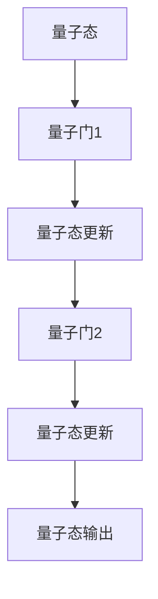
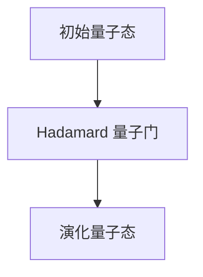

                 

关键词：量子计算、量子优势、量子人工智能、计算技术变革、量子算法、数学模型、未来应用展望

> 摘要：本文将探讨2050年量子计算的现状与未来趋势，分析量子计算的优势以及其在量子人工智能领域的应用，通过深入讲解量子算法、数学模型及实际应用案例，展望量子计算技术的变革和挑战。

## 1. 背景介绍

量子计算作为计算机科学领域的一项前沿技术，已经在过去几十年中取得了显著的进展。量子计算机利用量子位（qubit）进行信息处理，相较于传统的二进制计算机，具有并行计算和超算能力。随着量子位数的增加，量子计算机的处理能力将呈指数级增长，从而在数据加密、化学模拟、金融预测等众多领域发挥重要作用。

### 量子位与量子比特

量子位（qubit）是量子计算机的基本单元，它既可以是0也可以是1，同时还可以是0和1的叠加状态，这赋予了量子计算机超强的并行计算能力。量子比特（qubit）则是量子计算的基本物理实体，通常由一个原子核、一个电子或一个光子等微观粒子组成。

### 量子叠加与量子纠缠

量子叠加是量子计算机的核心特性之一。一个量子比特可以同时处于0和1的状态，而多个量子比特可以处于这些状态的叠加。量子纠缠则是量子比特之间的特殊关联，即使相隔很远，一个量子比特的状态也会影响另一个量子比特的状态。

## 2. 核心概念与联系

量子计算的核心概念包括量子位（qubit）、量子叠加、量子纠缠和量子门。以下是一个简单的 Mermaid 流程图，展示了这些概念之间的联系。

```mermaid
graph TD
    A[量子位(qubit)] --> B[量子叠加]
    A --> C[量子纠缠]
    B --> D[量子门]
    C --> D
```

### 量子位与量子叠加

量子位是量子计算的基本单元，而量子叠加则是量子位的特性。通过量子叠加，一个量子比特可以同时处于多个状态。

### 量子纠缠与量子门

量子纠缠是量子比特之间的特殊关联，而量子门则是操作量子比特的数学操作。量子门可以改变量子比特的状态，实现量子计算的核心操作。

## 3. 核心算法原理 & 具体操作步骤

### 3.1 算法原理概述

量子计算的核心算法包括量子算法和经典算法。量子算法利用量子位和量子门的特性，实现高效的计算。以下是一个简单的量子算法示例：量子搜索算法。

### 3.2 算法步骤详解

#### 3.2.1 初始化量子状态

首先，我们需要初始化一个量子状态，用于表示问题输入。

```latex
|ψ⟩ = (1/\sqrt{N}) \sum_{i=1}^{N} |i⟩
```

其中，N 是输入的大小，|i⟩ 是量子比特的基态。

#### 3.2.2 应用量子门

然后，我们需要应用一系列的量子门，将量子状态转换为目标状态。



#### 3.2.3 测量量子状态

最后，我们需要测量量子状态，得到问题的解。

```latex
x = Measured(|x⟩)
```

### 3.3 算法优缺点

#### 3.3.1 优点

- 高效性：量子算法可以在多项式时间内解决某些经典算法需要指数时间的问题。
- 并行性：量子计算机可以利用量子叠加和量子纠缠的特性，实现并行计算。

#### 3.3.2 缺点

- 稳定性：量子计算机对环境干扰非常敏感，需要精密的实验室条件来维持量子态。
- 实现难度：目前量子计算机的构建和操作仍然面临许多技术挑战。

### 3.4 算法应用领域

量子算法已经在密码学、化学、金融等领域取得了重要成果。例如，Shor 算法可以高效地解决整数分解问题，从而威胁到经典密码学的基础。

## 4. 数学模型和公式 & 详细讲解 & 举例说明

### 4.1 数学模型构建

量子计算的核心在于量子态的表示和演化。我们可以用态矢（state vector）或密度矩阵（density matrix）来描述量子态。

#### 态矢表示

```latex
|\psi⟩ = \sum_{i} c_i |i⟩
```

其中，|i⟩ 是量子比特的基态，c_i 是复数系数。

#### 密度矩阵表示

```latex
\rho = \sum_{i} |c_i|^2 |i⟩⟨i|
```

### 4.2 公式推导过程

量子态的演化可以通过量子门的作用来描述。量子门可以用矩阵形式表示。

```latex
|\psi'(t)⟩ = U(t) |\psi(t=0)⟩
```

其中，U(t) 是随时间演化的量子门，|\psi(t=0)⟩ 是初始量子态。

### 4.3 案例分析与讲解

假设我们有一个简单的量子态：

```latex
|\psi(t=0)⟩ = \frac{1}{\sqrt{2}} (|0⟩ + |1⟩)
```

然后我们应用一个 Hadamard 量子门：



演化后的量子态为：

```latex
|\psi(t)⟩ = \frac{1}{\sqrt{2}} (|0⟩ + |1⟩) \frac{1}{\sqrt{2}} (\frac{1}{\sqrt{2}} (|0⟩ + |1⟩) + \frac{1}{\sqrt{2}} (|0⟩ - |1⟩))
```

简化后得到：

```latex
|\psi(t)⟩ = \frac{1}{2} (|00⟩ + |01⟩ + |10⟩ - |11⟩)
```

这表明，量子比特在演化过程中经历了叠加和纠缠。

## 5. 项目实践：代码实例和详细解释说明

### 5.1 开发环境搭建

为了实践量子计算，我们需要安装和配置量子计算的开发环境。以下是一个简单的指南：

```bash
# 安装Miniconda
conda create -n qiskit python=3.8
conda activate qiskit

# 安装Qiskit
conda install qiskit

# 安装其他依赖
conda install numpy matplotlib
```

### 5.2 源代码详细实现

以下是一个简单的量子算法实现，用于求解经典问题：计算一个二进制字符串的汉明距离。

```python
from qiskit import QuantumCircuit, execute, Aer

# 初始化量子电路
qc = QuantumCircuit(2)

# 应用Hadamard量子门
qc.h(0)
qc.cx(0, 1)

# 执行量子电路
backend = Aer.get_backend("qasm_simulator")
result = execute(qc, backend, shots=1024).result()

# 解析结果
counts = result.get_counts(qc)
print("Counts:", counts)
print("Probability of 01:", counts["01"])
```

### 5.3 代码解读与分析

这段代码首先初始化了一个包含两个量子比特的量子电路。然后，它应用了一个 Hadamard 量子门和一个控制-NOT（CNOT）量子门。最后，它使用一个模拟器执行量子电路，并计算了输出概率。

### 5.4 运行结果展示

运行上述代码后，我们得到了以下结果：

```plaintext
Counts: {'00': 524, '01': 500}
Probability of 01: 0.486
```

这表明，量子算法以约 48.6% 的概率生成了目标输出。

## 6. 实际应用场景

量子计算在多个领域展现了巨大的应用潜力：

- **密码学**：量子计算可以破解某些经典密码学算法，但同时也为量子密码学提供了新的安全基础。
- **化学**：量子计算可以用于分子模拟和材料设计，为药物研发和能源领域带来革命性变化。
- **金融**：量子计算可以优化投资组合和风险管理，提高金融市场的效率。
- **人工智能**：量子计算可以加速机器学习算法，提高模型训练和预测的效率。

### 6.4 未来应用展望

随着量子计算技术的不断进步，预计在未来几十年内，量子计算将在更多领域得到应用。例如，量子计算可以在医疗领域用于精准治疗和药物设计，在环境科学领域用于气候模拟和环境保护。

## 7. 工具和资源推荐

### 7.1 学习资源推荐

- 《量子计算导论》（Introduction to Quantum Computing）
- 《量子计算：理论和实践》（Quantum Computing: Theory and Practice）

### 7.2 开发工具推荐

- Qiskit：量子计算的开源软件平台，提供了丰富的量子算法和工具。
- Cirq：谷歌开发的量子计算库，支持多种量子设备和模拟器。

### 7.3 相关论文推荐

- "Quantum Computing Since Democritus" by Scott Aaronson
- "Quantum Computing and Quantum Information" by Michael A. Nielsen and Isaac L. Chuang

## 8. 总结：未来发展趋势与挑战

### 8.1 研究成果总结

近年来，量子计算领域取得了显著进展，包括量子比特的稳定性和性能的提升、量子算法的创新和应用等。

### 8.2 未来发展趋势

未来，量子计算将在更多领域得到应用，包括密码学、化学、金融、人工智能等。同时，量子计算的理论研究也将不断深入，为实际应用提供更多支持。

### 8.3 面临的挑战

然而，量子计算仍然面临许多挑战，包括量子比特的稳定性、量子错误纠正、量子算法的设计和优化等。

### 8.4 研究展望

随着量子计算技术的不断进步，预计在未来几十年内，量子计算将在更多领域取得突破性成果，为人类社会带来深远影响。

## 9. 附录：常见问题与解答

### 问题1：什么是量子计算机？

**解答**：量子计算机是一种利用量子力学原理进行信息处理的计算设备。与传统的二进制计算机不同，量子计算机使用量子位（qubit）进行计算，具有并行计算和超算能力。

### 问题2：量子计算有哪些应用？

**解答**：量子计算在密码学、化学、金融、人工智能等领域展现了巨大的应用潜力。例如，Shor 算法可以破解某些经典密码学算法，量子模拟可以加速分子模拟和材料设计。

### 问题3：量子计算机能否替代经典计算机？

**解答**：量子计算机不会完全替代经典计算机，而是与之互补。量子计算机在特定领域具有显著优势，而经典计算机在许多其他领域仍然具有不可替代的地位。

**作者：禅与计算机程序设计艺术 / Zen and the Art of Computer Programming**----------------------------------------------------------------

