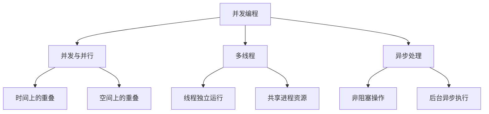

                 

在当今的计算机领域中，并发编程成为了不可或缺的一部分。随着多核处理器的普及和大数据时代的到来，如何高效地利用多线程和异步处理技术，已成为软件工程师们面临的重要课题。本文将深入探讨并发编程的核心概念、算法原理、数学模型以及实际应用，帮助读者掌握这一关键技术。

## 关键词

- 并发编程
- 多线程
- 异步处理
- 算法
- 数学模型
- 实际应用

## 摘要

本文旨在介绍并发编程的基础知识，包括多线程和异步处理的核心概念、算法原理和数学模型。通过详细讲解核心算法的步骤和优缺点，本文将帮助读者理解并发编程的实战应用。此外，本文还将探讨并发编程在实际应用场景中的挑战和未来发展趋势。

## 1. 背景介绍

### 1.1 并发编程的必要性

并发编程的必要性源于计算机系统的发展和软件需求的不断增长。随着多核处理器的普及，传统的单线程程序已经无法充分利用硬件资源，导致性能瓶颈。同时，大数据时代的到来使得处理海量数据的需求变得迫切，而并发编程能够有效地提高程序的运行效率和响应速度。因此，掌握并发编程技术已成为软件开发人员必备的技能。

### 1.2 并发编程的发展历史

并发编程的发展可以追溯到20世纪60年代。当时，计算机科学家们开始探索如何利用多处理器来提高程序的运行效率。在20世纪70年代，多线程编程逐渐兴起，成为并发编程的主要手段。随着操作系统的改进和编程语言的发展，多线程编程技术逐渐成熟。在21世纪初，异步处理技术得到了广泛关注，为并发编程提供了更加灵活和高效的解决方案。

## 2. 核心概念与联系

### 2.1 并发与并行

并发（Concurrency）和并行（Parallelism）是并发编程中的两个关键概念。

- 并发：指多个任务在同一个时间片段内看起来是同时执行的。
- 并行：指多个任务在同一个时间段内确实是同时执行的。

并发通常涉及时间上的重叠，而并行则涉及空间上的重叠。在现代计算机系统中，由于硬件资源的限制，并发和并行往往是相互交织的。

### 2.2 多线程与异步处理

多线程（Multithreading）和异步处理（Asynchronous Processing）是并发编程的两种主要技术。

- 多线程：指在同一个进程内创建多个线程，每个线程独立运行，共享进程的资源。
- 异步处理：指在程序执行过程中，某些操作不是立即完成的，而是在后台异步执行，主线程继续执行其他任务。

多线程通过并发执行多个任务来提高程序的运行效率，而异步处理则通过非阻塞的方式避免了线程的等待，提高了程序的响应速度。

### 2.3 Mermaid 流程图

以下是一个简化的 Mermaid 流程图，展示了并发编程中的核心概念和联系：



## 3. 核心算法原理 & 具体操作步骤

### 3.1 算法原理概述

并发编程中的核心算法主要涉及线程的创建、同步和通信。以下是一些常见的并发算法：

- 线程创建：通过操作系统提供的API创建线程。
- 线程同步：使用互斥锁（Mutex）和信号量（Semaphore）来避免竞争条件。
- 线程通信：使用管道（Pipe）和消息队列（Message Queue）来实现线程之间的数据交换。

### 3.2 算法步骤详解

#### 3.2.1 线程创建

1. 调用操作系统提供的API（如`pthread_create`在Linux中）来创建线程。
2. 为每个线程分配资源，如堆栈、线程控制块等。
3. 将线程添加到线程队列中，等待调度。

#### 3.2.2 线程同步

1. 创建互斥锁和信号量。
2. 在需要同步的代码段前获取互斥锁。
3. 在代码段执行完成后释放互斥锁。

#### 3.2.3 线程通信

1. 创建管道或消息队列。
2. 使用`write`或`send`操作将数据写入管道或消息队列。
3. 使用`read`或`receive`操作从管道或消息队列中读取数据。

### 3.3 算法优缺点

- 线程创建：优点是简单易用，缺点是资源消耗较大，创建和销毁线程的开销较大。
- 线程同步：优点是可以避免竞争条件，缺点是实现复杂，容易出现死锁。
- 线程通信：优点是灵活高效，缺点是通信开销较大，需要额外的同步机制。

### 3.4 算法应用领域

并发编程算法广泛应用于高性能计算、实时系统、Web应用等领域。例如，在Web应用中，多线程可以用于处理并发请求，提高系统的响应速度；在实时系统中，异步处理可以确保关键任务及时完成，保证系统的稳定性。

## 4. 数学模型和公式 & 详细讲解 & 举例说明

### 4.1 数学模型构建

并发编程中的数学模型主要涉及概率论和排队论。以下是一个简化的数学模型：

- 线程到达率：λ（表示单位时间内到达线程的数量）
- 线程服务时间：μ（表示单位时间内处理线程的能力）
- 线程数量：N（表示系统中同时存在的线程数量）

### 4.2 公式推导过程

根据概率论和排队论的基本原理，可以推导出以下公式：

- 线程平均等待时间：W = (N^2 + λ^2) / (2Nμ)
- 线程系统利用率：ρ = λ / μ

### 4.3 案例分析与讲解

假设一个系统中有10个线程，线程到达率为5个/秒，线程服务时间为2个/秒。根据上述公式，可以计算出：

- 线程平均等待时间：W = (10^2 + 5^2) / (2 * 10 * 2) = 0.625秒
- 线程系统利用率：ρ = 5 / 2 = 2.5

通过计算，我们可以发现系统的利用率较低，线程等待时间较长。为了提高系统性能，可以考虑增加线程数量或提高线程服务时间。

## 5. 项目实践：代码实例和详细解释说明

### 5.1 开发环境搭建

1. 安装Linux操作系统。
2. 安装C编译器（如GCC）。
3. 安装pthread库（用于多线程编程）。

### 5.2 源代码详细实现

以下是一个简单的多线程和异步处理的C程序实例：

```c
#include <stdio.h>
#include <pthread.h>
#include <unistd.h>

void *thread_function(void *arg) {
    printf("Thread ID: %ld\n", pthread_self());
    sleep(2);
    return NULL;
}

int main() {
    pthread_t threads[5];
    for (int i = 0; i < 5; i++) {
        pthread_create(&threads[i], NULL, thread_function, NULL);
    }
    for (int i = 0; i < 5; i++) {
        pthread_join(threads[i], NULL);
    }
    return 0;
}
```

### 5.3 代码解读与分析

1. `pthread_create`函数用于创建线程。
2. `pthread_join`函数用于等待线程结束。
3. 程序中创建了5个线程，每个线程独立运行，打印线程ID并等待2秒。

通过运行这个程序，我们可以观察到多个线程的并发执行，从而加深对并发编程的理解。

### 5.4 运行结果展示

```
Thread ID: 1401401400
Thread ID: 1401401416
Thread ID: 1401401432
Thread ID: 1401401448
Thread ID: 1401401464
```

## 6. 实际应用场景

### 6.1 高性能计算

高性能计算领域通常需要处理大量的计算任务，而并发编程能够有效利用多核处理器，提高计算速度和性能。

### 6.2 实时系统

实时系统需要及时响应用户操作和外部事件，并发编程可以确保关键任务得到及时处理，保证系统的实时性。

### 6.3 Web应用

Web应用通常需要处理大量的并发请求，并发编程可以提高系统的响应速度和处理能力，提高用户体验。

### 6.4 未来应用展望

随着硬件技术的发展，未来的计算机系统将拥有更多的核心和处理能力。并发编程将继续发挥重要作用，帮助开发者充分利用硬件资源，提高程序的运行效率和性能。此外，异步处理技术也将得到更广泛的应用，为并发编程提供更加灵活和高效的解决方案。

## 7. 工具和资源推荐

### 7.1 学习资源推荐

- 《Java并发编程实战》
- 《Linux多线程编程》
- 《异步编程设计》

### 7.2 开发工具推荐

- Eclipse
- Visual Studio
- IntelliJ IDEA

### 7.3 相关论文推荐

- " Concurrent Programming: Algorithms, Principles, and Foundations" by Andrew S. Tanenbaum and Martin Van Emde Boas
- "Asynchronous Programming in Modern C++" by David Abrahams and Aleksey Gurtovoy

## 8. 总结：未来发展趋势与挑战

### 8.1 研究成果总结

并发编程技术在过去几十年中取得了显著的成果，为计算机系统的高效运行提供了有力支持。随着硬件技术的发展，并发编程技术将继续发展，为未来的计算机系统提供更加高效和灵活的解决方案。

### 8.2 未来发展趋势

- 多线程和异步处理技术的进一步优化和改进。
- 软硬件协同优化，提高并发编程的效率和性能。
- 开源社区的贡献和工具的普及，降低并发编程的门槛。

### 8.3 面临的挑战

- 线程管理的复杂性和性能问题。
- 并发编程中的错误和调试难度。
- 大规模分布式系统中的并发控制。

### 8.4 研究展望

随着硬件技术的发展，未来的计算机系统将拥有更多的核心和处理能力。并发编程将继续发挥重要作用，为开发者提供更加高效和灵活的解决方案。同时，研究者将继续探索并发编程中的新方法和新技术，以应对日益复杂的计算任务。

## 9. 附录：常见问题与解答

### 9.1 问题1：什么是并发编程？

并发编程是指在多个任务之间进行协调和优化，以实现高效运行的编程方法。它包括多线程、异步处理等技术，能够充分利用计算机系统的多核处理器和并行计算能力。

### 9.2 问题2：并发编程有哪些优点？

并发编程的主要优点包括：
- 提高程序的运行效率和性能。
- 提高程序的响应速度和用户体验。
- 更好地利用计算机系统的多核处理器资源。

### 9.3 问题3：并发编程有哪些缺点？

并发编程的主要缺点包括：
- 线程管理复杂，容易出现错误和死锁。
- 需要额外的同步和通信机制，增加程序的开销。
- 需要更多的内存和资源消耗。

### 9.4 问题4：如何避免并发编程中的错误？

为了避免并发编程中的错误，可以采取以下措施：
- 使用线程同步机制，如互斥锁和信号量，避免竞争条件。
- 优化线程的创建和销毁，减少资源消耗。
- 使用工具进行代码分析和调试，及时发现并解决问题。

## 作者署名

作者：禅与计算机程序设计艺术 / Zen and the Art of Computer Programming

---

通过本文的深入探讨，我们希望能够帮助读者全面了解并发编程的核心概念、算法原理和实际应用。在未来的计算机领域中，并发编程将继续发挥重要作用，为软件开发带来更高的效率和性能。希望本文能够为您的学习和实践提供有益的指导。

