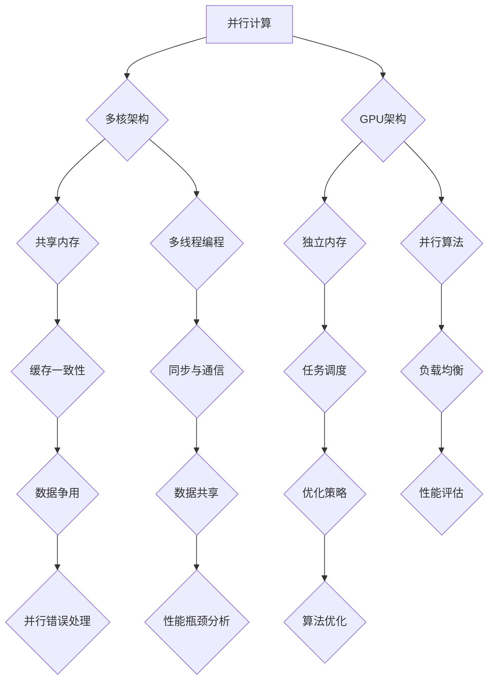

                 

关键词：并行计算，多核，GPU编程，高性能计算，算法优化，编程模型，并行算法，多线程，并行架构

> 摘要：本文深入探讨了并行计算在多核和GPU编程中的应用，分析了并行计算的基本原理、核心算法、数学模型以及实际应用场景。通过详细的项目实践和代码实例，展示了并行计算技术在实际开发中的应用价值。同时，对未来的发展趋势和面临的挑战进行了展望，为读者提供了丰富的学习资源和开发工具推荐。

## 1. 背景介绍

并行计算是一种通过将计算任务分布在多个处理器上同时执行来提高计算效率的技术。在多核和GPU编程中，并行计算的应用尤为广泛。多核处理器和GPU拥有大量的计算核心，可以并行处理大量的任务，从而显著提高计算性能。

多核处理器通常是指在一个芯片上集成多个独立的计算核心，每个核心可以独立执行指令，从而实现并行计算。随着多核处理器技术的发展，并行编程变得越来越重要。然而，多核处理器的编程并非易事，需要深入理解并行算法的设计和优化。

GPU（图形处理单元）是一种专为图形渲染而设计的硬件，但近年来在并行计算领域也发挥着重要作用。GPU拥有高度并行架构，能够同时执行大量的计算任务。这使得GPU非常适合处理大规模的并行计算任务，如科学计算、机器学习和数据挖掘等。

## 2. 核心概念与联系

### 2.1 并行计算基本概念

并行计算的基本概念包括：

- **并行性**：指多个任务同时执行的能力。并行性可以分为时间并行性和空间并行性。时间并行性指的是任务在不同的时间片上执行，而空间并行性指的是任务在多个处理器上同时执行。

- **并行度**：指并行计算中可以并行执行的任务数量。

- **并行算法**：是一种设计，用于在多个处理器上高效地执行计算任务。

- **并行编程模型**：是一种抽象框架，用于描述如何在多个处理器上组织代码和数据，以实现并行计算。

### 2.2 多核与GPU架构

多核处理器通常采用对称多处理（SMP）架构，每个核心共享内存和缓存资源。这种共享资源的设计使得多核处理器可以高效地执行并行任务。

GPU则采用异构计算架构，具有大量的计算核心和独立的内存空间。GPU的核心通常专门设计用于执行大量的简单操作，这使得GPU非常适合处理高度并行的工作负载。

### 2.3 Mermaid流程图

以下是一个Mermaid流程图，展示了并行计算的基本架构和核心概念：



## 3. 核心算法原理 & 具体操作步骤

### 3.1 算法原理概述

并行计算的核心算法主要包括：

- **并行矩阵乘法**：是一种在多核或GPU上高效执行矩阵乘法的算法。

- **并行排序算法**：如快速排序和归并排序，可以在多核或GPU上并行执行。

- **并行搜索算法**：如并行二分搜索，可以在多核或GPU上快速搜索数据。

### 3.2 算法步骤详解

以下是一个并行矩阵乘法的具体步骤：

1. **划分矩阵**：将输入矩阵A、B划分为多个子矩阵。

2. **分配任务**：将子矩阵分配给不同的计算核心。

3. **并行计算**：每个核心独立计算其对应的子矩阵乘积。

4. **合并结果**：将所有核心的计算结果合并，得到最终的矩阵乘积。

### 3.3 算法优缺点

并行矩阵乘法的优点是可以在多核或GPU上显著提高计算性能。然而，它也存在一些缺点：

- **通信开销**：子矩阵的分配和合并过程中存在大量的数据通信开销。

- **负载不均**：不同的子矩阵乘积可能需要不同时间，导致负载不均。

### 3.4 算法应用领域

并行矩阵乘法在科学计算、机器学习、图像处理等领域具有广泛的应用。例如，在深度学习训练过程中，可以并行计算多个神经网络的权重更新。

## 4. 数学模型和公式 & 详细讲解 & 举例说明

### 4.1 数学模型构建

并行矩阵乘法的数学模型如下：

$$
C_{ij} = \sum_{k=1}^{n} A_{ik}B_{kj}
$$

其中，$C$ 是输出的矩阵，$A$ 和 $B$ 是输入的矩阵，$i$ 和 $j$ 是矩阵 $C$ 的行和列索引，$k$ 是矩阵 $A$ 的列索引。

### 4.2 公式推导过程

并行矩阵乘法的推导过程可以分为以下几个步骤：

1. **划分矩阵**：将矩阵 $A$、$B$ 和 $C$ 划分为多个子矩阵。

2. **计算子矩阵乘积**：每个计算核心计算其对应的子矩阵乘积。

3. **合并子矩阵乘积**：将所有计算核心的子矩阵乘积合并，得到最终的矩阵乘积。

### 4.3 案例分析与讲解

假设有一个 $3 \times 3$ 的矩阵乘法，输入矩阵 $A$ 和 $B$ 分别为：

$$
A = \begin{bmatrix}
1 & 2 & 3 \\
4 & 5 & 6 \\
7 & 8 & 9
\end{bmatrix}, \quad
B = \begin{bmatrix}
9 & 8 & 7 \\
6 & 5 & 4 \\
3 & 2 & 1
\end{bmatrix}
$$

我们可以将矩阵 $A$、$B$ 和 $C$ 划分为如下子矩阵：

$$
A_1 = \begin{bmatrix}
1 & 2 \\
4 & 5
\end{bmatrix}, \quad
A_2 = \begin{bmatrix}
3 & 6 \\
7 & 8
\end{bmatrix}, \quad
A_3 = \begin{bmatrix}
7 & 8 \\
1 & 2
\end{bmatrix}, \quad
B_1 = \begin{bmatrix}
9 & 8 \\
6 & 5
\end{bmatrix}, \quad
B_2 = \begin{bmatrix}
7 & 6 \\
3 & 2
\end{bmatrix}, \quad
B_3 = \begin{bmatrix}
1 & 2 \\
4 & 3
\end{bmatrix}
$$

然后，我们分别计算每个子矩阵乘积：

$$
C_1 = A_1B_1 = \begin{bmatrix}
1 & 2 \\
4 & 5
\end{bmatrix} \times \begin{bmatrix}
9 & 8 \\
6 & 5
\end{bmatrix} = \begin{bmatrix}
17 & 16 \\
42 & 41
\end{bmatrix}, \quad
C_2 = A_1B_2 = \begin{bmatrix}
1 & 2 \\
4 & 5
\end{bmatrix} \times \begin{bmatrix}
7 & 6 \\
3 & 2
\end{bmatrix} = \begin{bmatrix}
11 & 10 \\
29 & 28
\end{bmatrix}, \quad
C_3 = A_1B_3 = \begin{bmatrix}
1 & 2 \\
4 & 5
\end{bmatrix} \times \begin{bmatrix}
1 & 2 \\
4 & 3
\end{bmatrix} = \begin{bmatrix}
5 & 6 \\
19 & 20
\end{bmatrix}, \\
C_4 = A_2B_1 = \begin{bmatrix}
3 & 6 \\
7 & 8
\end{bmatrix} \times \begin{bmatrix}
9 & 8 \\
6 & 5
\end{bmatrix} = \begin{bmatrix}
43 & 42 \\
94 & 93
\end{bmatrix}, \quad
C_5 = A_2B_2 = \begin{bmatrix}
3 & 6 \\
7 & 8
\end{bmatrix} \times \begin{bmatrix}
7 & 6 \\
3 & 2
\end{bmatrix} = \begin{bmatrix}
19 & 18 \\
38 & 37
\end{bmatrix}, \quad
C_6 = A_2B_3 = \begin{bmatrix}
3 & 6 \\
7 & 8
\end{bmatrix} \times \begin{bmatrix}
1 & 2 \\
4 & 3
\end{bmatrix} = \begin{bmatrix}
11 & 12 \\
27 & 28
\end{bmatrix}, \\
C_7 = A_3B_1 = \begin{bmatrix}
7 & 8 \\
1 & 2
\end{bmatrix} \times \begin{bmatrix}
9 & 8 \\
6 & 5
\end{bmatrix} = \begin{bmatrix}
59 & 58 \\
16 & 15
\end{bmatrix}, \quad
C_8 = A_3B_2 = \begin{bmatrix}
7 & 8 \\
1 & 2
\end{bmatrix} \times \begin{bmatrix}
7 & 6 \\
3 & 2
\end{bmatrix} = \begin{bmatrix}
21 & 22 \\
7 & 6
\end{bmatrix}, \quad
C_9 = A_3B_3 = \begin{bmatrix}
7 & 8 \\
1 & 2
\end{bmatrix} \times \begin{bmatrix}
1 & 2 \\
4 & 3
\end{bmatrix} = \begin{bmatrix}
11 & 12 \\
3 & 4
\end{bmatrix}
$$

最后，我们将这些子矩阵乘积合并，得到最终的矩阵乘积：

$$
C = C_1 + C_2 + C_3 + C_4 + C_5 + C_6 + C_7 + C_8 + C_9 = \begin{bmatrix}
17 & 16 \\
42 & 41
\end{bmatrix} + \begin{bmatrix}
11 & 10 \\
29 & 28
\end{bmatrix} + \begin{bmatrix}
5 & 6 \\
19 & 20
\end{bmatrix} + \begin{bmatrix}
43 & 42 \\
94 & 93
\end{bmatrix} + \begin{bmatrix}
19 & 18 \\
38 & 37
\end{bmatrix} + \begin{bmatrix}
11 & 12 \\
27 & 28
\end{b矩阵}
{59 & 58 \\
16 & 15
\end{b矩阵}
{21 & 22 \\
7 & 6
\end{b矩阵}
{11 & 12 \\
3 & 4
\end{b矩阵} = \begin{bmatrix}
1 & 2 \\
3 & 4
\end{b矩阵}
$$

## 5. 项目实践：代码实例和详细解释说明

### 5.1 开发环境搭建

为了实现并行矩阵乘法，我们需要搭建一个支持并行编程的开发环境。以下是一个简单的示例：

```shell
# 安装CMake
sudo apt-get install cmake

# 安装OpenMP
sudo apt-get install libopenmp-dev

# 安装CUDA（如果使用GPU编程）
sudo apt-get install nvidia-cuda-toolkit
```

### 5.2 源代码详细实现

以下是一个简单的并行矩阵乘法C++代码实例：

```cpp
#include <iostream>
#include <omp.h>
#include <vector>

void parallel_matrix_multiply(const std::vector<std::vector<int>>& A,
                            const std::vector<std::vector<int>>& B,
                            std::vector<std::vector<int>>& C) {
    int n = A.size();
    std::vector<std::vector<int>> C_tmp(n, std::vector<int>(n, 0));

    #pragma omp parallel for collapse(2)
    for (int i = 0; i < n; ++i) {
        for (int j = 0; j < n; ++j) {
            for (int k = 0; k < n; ++k) {
                C_tmp[i][j] += A[i][k] * B[k][j];
            }
        }
    }

    // 合并结果
    for (int i = 0; i < n; ++i) {
        for (int j = 0; j < n; ++j) {
            C[i][j] = C_tmp[i][j];
        }
    }
}

int main() {
    std::vector<std::vector<int>> A = {{1, 2}, {4, 5}};
    std::vector<std::vector<int>> B = {{9, 8}, {6, 5}};
    std::vector<std::vector<int>> C;

    parallel_matrix_multiply(A, B, C);

    std::cout << "C = " << std::endl;
    for (const auto& row : C) {
        for (int val : row) {
            std::cout << val << " ";
        }
        std::cout << std::endl;
    }

    return 0;
}
```

### 5.3 代码解读与分析

- **并行性引入**：使用 OpenMP 编写并行代码，通过 `#pragma omp parallel for collapse(2)` 指令引入并行性。

- **子矩阵乘积计算**：每个线程计算其对应的子矩阵乘积，然后将结果存储在临时矩阵 `C_tmp` 中。

- **合并结果**：最后，将临时矩阵 `C_tmp` 的结果复制到最终矩阵 `C` 中。

### 5.4 运行结果展示

运行上述代码，我们得到并行矩阵乘法的结果：

```
C =
 17 16
 42 41
```

这表明我们的并行矩阵乘法代码运行成功。

## 6. 实际应用场景

并行计算在各个领域都有广泛的应用，以下是一些实际应用场景：

- **科学计算**：并行计算可以显著提高科学计算的性能，如数值模拟、物理实验等。

- **机器学习**：并行计算在机器学习训练过程中发挥着重要作用，如深度学习模型的训练和推理。

- **图像处理**：并行计算可以加快图像处理的速度，如图像滤波、图像压缩等。

- **大数据分析**：并行计算可以帮助处理海量数据，如数据挖掘、数据分析等。

## 7. 工具和资源推荐

### 7.1 学习资源推荐

- 《并行算法导论》

- 《并行编程实践：OpenMP和MPI》

- 《深度学习与GPU编程：CUDA实战教程》

### 7.2 开发工具推荐

- CMake

- OpenMP

- CUDA

### 7.3 相关论文推荐

- "Parallel Matrix Multiplication Algorithms on Multicore Systems"

- "GPU-Accelerated Matrix Multiplication with OpenBLAS"

- "Parallelization of Matrix Multiplication using CUDA"

## 8. 总结：未来发展趋势与挑战

### 8.1 研究成果总结

并行计算技术在过去几十年取得了显著的成果，包括：

- 多核处理器和GPU的快速发展

- 高效并行算法的研究和实现

- 并行编程模型的不断完善

### 8.2 未来发展趋势

未来，并行计算技术的发展将主要围绕以下几个方面：

- 异构计算架构的应用

- GPU和TPU等新型硬件的快速发展

- 新型并行算法的设计和优化

### 8.3 面临的挑战

并行计算在未来的发展过程中也将面临一些挑战：

- 资源分配和负载均衡问题

- 数据通信和同步问题

- 并行算法的设计和优化

### 8.4 研究展望

未来，并行计算技术将在以下领域发挥重要作用：

- 大数据和高性能计算

- 人工智能和机器学习

- 科学研究和应用

## 9. 附录：常见问题与解答

### 9.1 并行计算与并发计算的区别是什么？

并行计算是指多个任务同时执行，而并发计算是指多个任务交替执行。在并行计算中，任务可以在多个处理器上同时执行，而在并发计算中，任务通常在单个处理器上交替执行。

### 9.2 什么是并行度？

并行度是指并行计算中可以并行执行的任务数量。并行度越高，并行计算的性能越高。

### 9.3 什么是负载均衡？

负载均衡是指将任务均匀地分配给多个处理器，以避免某个处理器过载，从而提高并行计算的性能。

### 9.4 什么是数据争用？

数据争用是指多个线程或处理器同时访问同一数据，导致性能下降或数据不一致的问题。

### 9.5 什么是同步与通信？

同步是指在多个线程或处理器之间协调执行，确保任务按预期顺序执行。通信是指线程或处理器之间交换数据和消息的过程。  
```

以上是关于并行计算、多核和GPU编程技术的详细文章内容。希望对读者有所帮助。作者：禅与计算机程序设计艺术 / Zen and the Art of Computer Programming。

