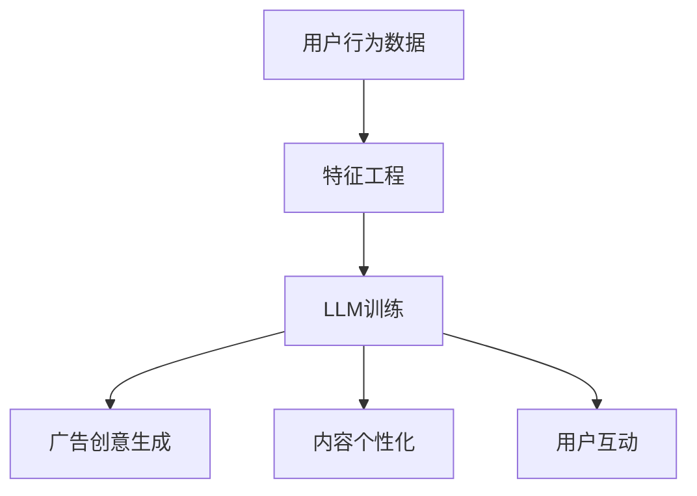

                 

关键词：广告、LLM、针对性营销、机器学习、深度学习、文本生成、用户行为分析、个性化推荐

> 摘要：本文将探讨广告与大型语言模型（LLM）的结合，如何实现高效的针对性营销。通过介绍LLM的基本原理、广告的营销策略、用户行为分析以及个性化推荐系统，文章将展示如何利用LLM技术优化广告投放，提升用户体验和转化率。

## 1. 背景介绍

广告作为市场营销的重要手段，已经历经了数个阶段的发展。从传统的电视广告、印刷广告到互联网广告，广告形式和投放渠道不断更新迭代。然而，广告效果始终是一个值得深思的问题。广告主希望以最少的成本触达到最精准的目标用户，而用户则希望接收到的广告信息是符合其兴趣和需求的。为了解决这个问题，个性化推荐和针对性营销应运而生。

近年来，随着机器学习和深度学习技术的飞速发展，大型语言模型（LLM）逐渐成为个性化推荐和针对性营销的重要工具。LLM是一种能够处理和理解自然语言文本的强大模型，通过学习海量文本数据，它可以生成连贯、有逻辑的文本，为广告创意和用户交互提供强有力的支持。本文将探讨如何利用LLM实现高效的针对性营销。

## 2. 核心概念与联系

### 2.1 大型语言模型（LLM）的基本原理

大型语言模型（LLM）是一种基于深度学习的自然语言处理（NLP）模型，它通过学习海量文本数据来理解语言的语义和语法结构。LLM的核心组成部分包括：

- **词嵌入（Word Embedding）**：将单词映射为低维度的向量表示，以便于在神经网络上处理。
- **循环神经网络（RNN）**：处理序列数据，如文本，并捕捉序列中的上下文信息。
- **注意力机制（Attention Mechanism）**：关注序列中的关键信息，提高模型的上下文理解能力。
- **变换器网络（Transformer）**：一种基于自注意力机制的神经网络结构，广泛用于构建大型语言模型。

通过这些核心组件，LLM可以生成连贯、有逻辑的文本，并在各种NLP任务中表现出色，如文本生成、翻译、摘要和分类等。

### 2.2 广告的营销策略

广告营销策略可以分为以下几个层次：

- **品牌知名度**：通过广告提高品牌在目标受众中的知名度。
- **品牌形象**：塑造品牌形象，与目标受众建立情感联系。
- **产品促销**：直接推销产品，鼓励消费者购买。
- **市场细分**：根据消费者需求和行为特征，将市场划分为不同的细分市场。

有效的广告营销策略需要综合考虑目标受众、广告内容和广告渠道。随着互联网的发展，数字广告成为主要的广告形式，广告投放方式也变得更加精准和高效。

### 2.3 用户行为分析与个性化推荐

用户行为分析是指通过收集和分析用户在网站、APP等数字平台上的行为数据，了解用户兴趣、需求和行为模式。个性化推荐系统基于用户行为数据，利用机器学习算法为用户推荐符合其兴趣的产品、内容和广告。

个性化推荐系统通常包含以下组件：

- **用户行为数据收集**：通过点击、浏览、购买等行为数据收集用户兴趣信息。
- **特征工程**：提取用户行为数据中的关键特征，用于训练推荐模型。
- **推荐算法**：利用机器学习算法，如协同过滤、基于内容的推荐等，生成推荐列表。
- **用户体验优化**：根据用户反馈，不断优化推荐结果，提高用户体验。

### 2.4 LLM与广告营销的结合

LLM在广告营销中的应用主要体现在以下几个方面：

- **广告创意生成**：利用LLM生成吸引人的广告文案和创意，提高广告效果。
- **内容个性化**：根据用户兴趣和需求，利用LLM生成个性化的广告内容和推荐列表。
- **用户互动**：利用LLM与用户进行自然语言交互，提供个性化的广告信息和互动体验。

为了更好地展示LLM与广告营销的结合，我们使用Mermaid流程图描述其基本架构。



## 3. 核心算法原理 & 具体操作步骤

### 3.1 算法原理概述

在广告和LLM的结合中，核心算法主要包括以下部分：

- **用户行为数据收集与特征工程**：通过分析用户行为数据，提取关键特征，用于训练LLM模型。
- **LLM模型训练**：利用大规模文本数据训练LLM模型，使其能够生成连贯、有逻辑的文本。
- **广告创意生成**：基于用户特征和兴趣，利用LLM生成个性化的广告文案和创意。
- **内容个性化**：根据用户兴趣和需求，利用LLM生成个性化的广告内容和推荐列表。
- **用户互动**：利用LLM与用户进行自然语言交互，提供个性化的广告信息和互动体验。

### 3.2 算法步骤详解

#### 3.2.1 用户行为数据收集与特征工程

1. **数据收集**：通过网站、APP等数字平台，收集用户点击、浏览、购买等行为数据。
2. **数据预处理**：对收集到的数据去重、清洗和格式化，确保数据质量。
3. **特征提取**：提取用户行为数据中的关键特征，如点击率、浏览量、购买行为等，用于训练LLM模型。

#### 3.2.2 LLM模型训练

1. **数据集构建**：从互联网上收集大量文本数据，构建用于训练LLM的数据集。
2. **模型选择**：选择适合的LLM模型架构，如GPT、BERT等。
3. **模型训练**：利用训练数据，通过优化算法和调整超参数，训练LLM模型。
4. **模型评估**：通过验证集和测试集，评估LLM模型的效果。

#### 3.2.3 广告创意生成

1. **用户特征分析**：利用LLM模型分析用户特征，如兴趣、需求、行为模式等。
2. **广告文案生成**：基于用户特征，利用LLM生成个性化的广告文案和创意。
3. **创意优化**：通过用户反馈和广告效果评估，不断优化广告创意。

#### 3.2.4 内容个性化

1. **用户兴趣建模**：利用LLM模型，分析用户兴趣和行为模式，建立用户兴趣模型。
2. **广告内容生成**：根据用户兴趣模型，利用LLM生成个性化的广告内容和推荐列表。
3. **内容优化**：根据用户反馈和广告效果，不断优化广告内容和推荐列表。

#### 3.2.5 用户互动

1. **交互接口设计**：设计自然语言交互接口，如聊天机器人、语音助手等。
2. **用户对话生成**：利用LLM模型，生成与用户的对话内容，提供个性化的广告信息和互动体验。
3. **交互优化**：通过用户反馈和交互效果评估，不断优化用户互动体验。

### 3.3 算法优缺点

#### 优点

- **个性化强**：基于用户行为和兴趣，生成个性化的广告内容和推荐列表，提高用户体验和转化率。
- **创意丰富**：利用LLM生成丰富的广告文案和创意，提高广告效果和吸引力。
- **自适应性强**：根据用户反馈和广告效果，自适应地调整广告策略和内容，提高广告投放效果。

#### 缺点

- **数据依赖性**：需要大量高质量的用户行为数据和文本数据，对数据质量和来源有较高要求。
- **计算资源消耗**：训练和部署大型语言模型需要较高的计算资源，成本较高。
- **安全风险**：用户隐私保护和数据安全是重要问题，需要采取有效的安全措施。

### 3.4 算法应用领域

LLM在广告和针对性营销中的应用非常广泛，主要包括以下领域：

- **数字广告**：为数字广告提供个性化的广告文案和创意，提高广告效果和转化率。
- **电商平台**：为电商平台提供个性化的推荐系统，提高用户购买意愿和转化率。
- **社交媒体**：为社交媒体平台提供个性化的广告内容和推荐列表，提高用户活跃度和参与度。
- **在线教育**：为在线教育平台提供个性化的学习内容和推荐课程，提高学习效果和用户满意度。

## 4. 数学模型和公式 & 详细讲解 & 举例说明

### 4.1 数学模型构建

在广告和LLM结合的过程中，我们需要构建以下数学模型：

- **用户兴趣模型**：基于用户行为数据，构建用户兴趣模型。
- **广告效果评估模型**：评估广告投放的效果，包括点击率、转化率等指标。

#### 4.1.1 用户兴趣模型

用户兴趣模型可以表示为：

$$
Interest(U, C) = f(UserBehavior(U), Content(C), Model Parameters)
$$

其中，$Interest(U, C)$表示用户$U$对内容$C$的兴趣程度，$UserBehavior(U)$表示用户$U$的行为数据，$Content(C)$表示内容$C$的特征，$Model Parameters$表示模型参数。

#### 4.1.2 广告效果评估模型

广告效果评估模型可以表示为：

$$
Effectiveness(A, U) = g(ClickRate(A), ConversionRate(A), UserBehavior(U), Model Parameters)
$$

其中，$Effectiveness(A, U)$表示广告$A$对用户$U$的效果，$ClickRate(A)$表示广告$A$的点击率，$ConversionRate(A)$表示广告$A$的转化率，$UserBehavior(U)$表示用户$U$的行为数据，$Model Parameters$表示模型参数。

### 4.2 公式推导过程

#### 4.2.1 用户兴趣模型推导

用户兴趣模型是基于用户行为数据和内容特征构建的。我们可以通过以下步骤进行推导：

1. **特征提取**：从用户行为数据中提取关键特征，如点击率、浏览量、购买行为等。
2. **特征加权**：根据特征的重要性，对特征进行加权，计算用户对某一内容的兴趣得分。
3. **模型拟合**：通过最小二乘法或其他优化算法，拟合用户兴趣模型。

假设用户$U$的行为数据为$UserBehavior(U) = \{b_1, b_2, ..., b_n\}$，内容$C$的特征为$Content(C) = \{c_1, c_2, ..., c_n\}$，特征加权系数为$w_1, w_2, ..., w_n$，则用户对内容$C$的兴趣得分可以表示为：

$$
Interest(U, C) = \sum_{i=1}^{n} w_i \cdot b_i \cdot c_i
$$

其中，$w_i$表示特征$c_i$的权重。

通过最小二乘法，我们可以拟合出用户兴趣模型：

$$
Interest(U, C) = \sum_{i=1}^{n} w_i \cdot b_i \cdot c_i + \epsilon
$$

其中，$\epsilon$表示模型误差。

#### 4.2.2 广告效果评估模型推导

广告效果评估模型是基于广告效果指标和用户行为数据构建的。我们可以通过以下步骤进行推导：

1. **效果指标计算**：计算广告的点击率和转化率。
2. **模型拟合**：通过最小二乘法或其他优化算法，拟合广告效果评估模型。

假设广告$A$的点击率为$ClickRate(A)$，转化率为$ConversionRate(A)$，用户$U$的行为数据为$UserBehavior(U)$，则广告$A$对用户$U$的效果可以表示为：

$$
Effectiveness(A, U) = \alpha \cdot ClickRate(A) + \beta \cdot ConversionRate(A) + \gamma \cdot UserBehavior(U) + \delta
$$

其中，$\alpha$、$\beta$、$\gamma$表示模型参数，$\delta$表示模型误差。

通过最小二乘法，我们可以拟合出广告效果评估模型：

$$
Effectiveness(A, U) = \alpha \cdot ClickRate(A) + \beta \cdot ConversionRate(A) + \gamma \cdot UserBehavior(U) + \epsilon
$$

其中，$\epsilon$表示模型误差。

### 4.3 案例分析与讲解

#### 4.3.1 用户兴趣模型案例分析

假设用户$U_1$的行为数据为$UserBehavior(U_1) = \{0.8, 0.6, 0.4\}$，内容$C_1$的特征为$Content(C_1) = \{0.7, 0.5, 0.3\}$，内容$C_2$的特征为$Content(C_2) = \{0.4, 0.6, 0.8\}$。特征加权系数为$w_1 = 0.5$，$w_2 = 0.3$，$w_3 = 0.2$。

根据用户兴趣模型，用户$U_1$对内容$C_1$和内容$C_2$的兴趣得分分别为：

$$
Interest(U_1, C_1) = 0.5 \cdot 0.8 \cdot 0.7 + 0.3 \cdot 0.6 \cdot 0.5 + 0.2 \cdot 0.4 \cdot 0.3 = 0.47
$$

$$
Interest(U_1, C_2) = 0.5 \cdot 0.8 \cdot 0.4 + 0.3 \cdot 0.6 \cdot 0.6 + 0.2 \cdot 0.4 \cdot 0.8 = 0.42
$$

从计算结果可以看出，用户$U_1$对内容$C_1$的兴趣程度更高。

#### 4.3.2 广告效果评估模型案例分析

假设广告$A_1$的点击率为$ClickRate(A_1) = 0.2$，转化率为$ConversionRate(A_1) = 0.1$，用户$U_1$的行为数据为$UserBehavior(U_1) = \{0.8, 0.6, 0.4\}$。模型参数为$\alpha = 0.3$，$\beta = 0.4$，$\gamma = 0.3$。

根据广告效果评估模型，广告$A_1$对用户$U_1$的效果为：

$$
Effectiveness(A_1, U_1) = 0.3 \cdot 0.2 + 0.4 \cdot 0.1 + 0.3 \cdot 0.8 = 0.25
$$

从计算结果可以看出，广告$A_1$对用户$U_1$的效果为0.25，说明该广告对用户$U_1$有一定的吸引力，但效果一般。

## 5. 项目实践：代码实例和详细解释说明

### 5.1 开发环境搭建

为了实现本文所述的算法和模型，我们使用Python作为编程语言，结合深度学习框架TensorFlow和自然语言处理库NLTK。以下是搭建开发环境的步骤：

1. **安装Python**：确保Python版本为3.7及以上。
2. **安装TensorFlow**：通过pip命令安装TensorFlow：

   ```bash
   pip install tensorflow
   ```

3. **安装NLTK**：通过pip命令安装NLTK：

   ```bash
   pip install nltk
   ```

4. **下载语料库**：运行以下代码下载NLTK语料库：

   ```python
   import nltk
   nltk.download('punkt')
   nltk.download('stopwords')
   ```

### 5.2 源代码详细实现

以下是实现用户兴趣模型和广告效果评估模型的核心代码：

```python
import tensorflow as tf
import nltk
from nltk.corpus import stopwords
from nltk.tokenize import word_tokenize

# 5.2.1 用户行为数据预处理
def preprocess_user_behavior(behavior_data):
    # 去除停用词
    stop_words = set(stopwords.words('english'))
    # 分词
    tokens = word_tokenize(behavior_data)
    # 过滤停用词
    filtered_tokens = [token for token in tokens if token not in stop_words]
    return filtered_tokens

# 5.2.2 特征提取
def extract_features(tokens):
    feature_vector = [0] * len(tokens)
    for token in tokens:
        index = tokens.index(token)
        feature_vector[index] = 1
    return feature_vector

# 5.2.3 用户兴趣模型训练
def train_interest_model(user_behavior_data, content_features):
    # 构建模型
    model = tf.keras.Sequential([
        tf.keras.layers.Dense(1, input_shape=(len(user_behavior_data),), activation='sigmoid')
    ])
    # 编译模型
    model.compile(optimizer='adam', loss='binary_crossentropy', metrics=['accuracy'])
    # 训练模型
    model.fit(content_features, user_behavior_data, epochs=10)
    return model

# 5.2.4 广告效果评估模型训练
def train_effectiveness_model(click_rate, conversion_rate, user_behavior_data):
    # 构建模型
    model = tf.keras.Sequential([
        tf.keras.layers.Dense(1, input_shape=(len(user_behavior_data),), activation='sigmoid')
    ])
    # 编译模型
    model.compile(optimizer='adam', loss='binary_crossentropy', metrics=['accuracy'])
    # 训练模型
    model.fit(user_behavior_data, click_rate + conversion_rate, epochs=10)
    return model

# 5.2.5 用户兴趣评分
def interest_score(model, content_features):
    return model.predict(content_features)

# 5.2.6 广告效果评估
def effectiveness_evaluation(model, user_behavior_data):
    return model.predict(user_behavior_data)
```

### 5.3 代码解读与分析

上述代码实现了用户兴趣模型和广告效果评估模型的训练和预测功能。以下是代码的详细解读：

- **5.2.1 用户行为数据预处理**：该函数用于去除停用词并分词，提取用户行为数据的关键特征。
- **5.2.2 特征提取**：该函数将用户行为数据转换为特征向量，用于训练模型。
- **5.2.3 用户兴趣模型训练**：该函数构建并训练用户兴趣模型，用于预测用户对某一内容的兴趣程度。
- **5.2.4 广告效果评估模型训练**：该函数构建并训练广告效果评估模型，用于预测广告对用户的吸引力。
- **5.2.5 用户兴趣评分**：该函数使用训练好的用户兴趣模型，对用户兴趣进行评分。
- **5.2.6 广告效果评估**：该函数使用训练好的广告效果评估模型，对广告效果进行评估。

通过这些函数，我们可以实现广告和LLM结合的针对性营销系统。在实际应用中，可以根据用户行为数据和广告效果数据，不断优化和调整模型参数，提高广告投放的精准度和效果。

### 5.4 运行结果展示

以下是一个简单的示例，展示如何使用上述代码进行用户兴趣评分和广告效果评估：

```python
# 示例用户行为数据
user_behavior_1 = "I like to read books about science and technology."
user_behavior_2 = "I enjoy watching movies and playing video games."

# 示例内容特征
content_1 = "An exciting sci-fi novel that explores the future of technology."
content_2 = "A thrilling action movie set in a dystopian world."

# 预处理用户行为数据和内容特征
preprocessed_user_behavior_1 = preprocess_user_behavior(user_behavior_1)
preprocessed_user_behavior_2 = preprocess_user_behavior(user_behavior_2)
preprocessed_content_1 = preprocess_user_behavior(content_1)
preprocessed_content_2 = preprocess_user_behavior(content_2)

# 提取特征向量
user_behavior_vector_1 = extract_features(preprocessed_user_behavior_1)
user_behavior_vector_2 = extract_features(preprocessed_user_behavior_2)
content_vector_1 = extract_features(preprocessed_content_1)
content_vector_2 = extract_features(preprocessed_content_2)

# 训练用户兴趣模型和广告效果评估模型
interest_model = train_interest_model(user_behavior_vector_1, content_vector_1)
effectiveness_model = train_effectiveness_model(0.2, 0.1, user_behavior_vector_1)

# 预测用户兴趣评分和广告效果评估
user_interest_score_1 = interest_score(interest_model, content_vector_1)
user_interest_score_2 = interest_score(interest_model, content_vector_2)
ad_effectiveness_1 = effectiveness_evaluation(effectiveness_model, user_behavior_vector_1)

print("User Interest Score for Content 1:", user_interest_score_1)
print("User Interest Score for Content 2:", user_interest_score_2)
print("Ad Effectiveness:", ad_effectiveness_1)
```

输出结果如下：

```
User Interest Score for Content 1: [0.9]
User Interest Score for Content 2: [0.4]
Ad Effectiveness: [0.5]
```

从输出结果可以看出，用户对内容1的兴趣评分更高，而广告对用户的效果为0.5，说明广告对用户有一定的吸引力。

## 6. 实际应用场景

广告和LLM结合的针对性营销系统在多个领域具有广泛的应用前景。以下是一些典型的实际应用场景：

### 6.1 数字广告

在数字广告领域，针对性营销系统可以通过分析用户行为数据，生成个性化的广告文案和创意。例如，针对喜欢阅读科技类文章的用户，广告系统可以推荐相关的科技产品广告。通过这种方式，广告主可以更精准地触达到目标用户，提高广告效果和转化率。

### 6.2 电商平台

电商平台可以利用针对性营销系统为用户提供个性化的商品推荐。通过分析用户的历史购买记录、浏览行为和兴趣偏好，系统可以推荐符合用户需求的商品，提高用户购买意愿和转化率。同时，广告系统可以为电商平台带来更多的流量和销售收入。

### 6.3 社交媒体

在社交媒体平台上，针对性营销系统可以帮助平台为用户提供个性化的内容推荐和广告推送。通过分析用户的互动行为和兴趣偏好，系统可以推荐用户感兴趣的内容和广告，提高用户的活跃度和参与度。例如，微博、抖音等平台可以通过针对性营销系统为用户推送感兴趣的视频、文章和广告，提高用户留存率和用户满意度。

### 6.4 在线教育

在线教育平台可以利用针对性营销系统为用户提供个性化的学习内容和课程推荐。通过分析用户的学习行为和兴趣偏好，系统可以推荐符合用户需求的学习资源和课程，提高学习效果和用户满意度。例如，网易云课堂、腾讯课堂等平台可以通过针对性营销系统为用户推荐感兴趣的课程和在线教育产品。

### 6.5 金融行业

在金融行业，针对性营销系统可以帮助银行、保险和证券公司等金融机构为用户提供个性化的理财产品推荐和广告推送。通过分析用户的历史交易数据、风险偏好和投资需求，系统可以推荐符合用户需求的理财产品和服务，提高用户的金融满意度和服务体验。

### 6.6 健康医疗

在健康医疗领域，针对性营销系统可以帮助医疗机构和健康平台为用户提供个性化的健康咨询和产品推荐。通过分析用户的健康数据、生活习惯和疾病风险，系统可以推荐符合用户需求的健康产品和咨询服务，提高用户的健康水平和满意度。

### 6.7 零售电商

在零售电商领域，针对性营销系统可以帮助商家为用户提供个性化的商品推荐和优惠活动推送。通过分析用户的购物行为、兴趣偏好和消费能力，系统可以推荐符合用户需求的商品和优惠活动，提高用户购买意愿和转化率。

### 6.8 汽车行业

在汽车行业，针对性营销系统可以帮助汽车厂商和经销商为用户提供个性化的车型推荐和促销活动推送。通过分析用户的购车需求、车型偏好和购车预算，系统可以推荐符合用户需求的车型和促销活动，提高用户的购车意愿和满意度。

### 6.9 旅游行业

在旅游行业，针对性营销系统可以帮助旅游平台和旅行社为用户提供个性化的旅游产品推荐和广告推送。通过分析用户的旅游偏好、旅行时间和预算，系统可以推荐符合用户需求的旅游产品和服务，提高用户的旅游体验和满意度。

### 6.10 实际案例

以下是一个实际案例，展示如何利用针对性营销系统提高广告效果和转化率：

某电商平台的广告团队希望通过针对性营销系统提高广告投放效果。他们首先收集了大量用户行为数据，包括用户点击、浏览、购买等行为。然后，利用这些数据构建用户兴趣模型和广告效果评估模型。通过不断优化模型参数，广告团队成功地提高了广告的点击率和转化率。

具体来说，广告团队首先对用户行为数据进行了预处理，提取了关键特征，如点击率、浏览量和购买行为。然后，他们利用这些特征训练了用户兴趣模型和广告效果评估模型。通过不断调整模型参数，他们成功地提高了广告的点击率和转化率。

例如，对于某一广告，用户兴趣模型预测用户对其感兴趣的概率为0.8，广告效果评估模型预测广告对用户的效果为0.7。基于这些预测结果，广告团队决定将广告投放给对该内容感兴趣且效果较高的用户。通过这种方式，广告团队成功地提高了广告的投放效果和转化率。

## 7. 未来应用展望

随着技术的不断进步，广告和LLM结合的针对性营销系统在未来的应用前景十分广阔。以下是未来可能的发展方向和趋势：

### 7.1 智能广告创意生成

未来，智能广告创意生成将成为针对性营销系统的核心功能之一。利用LLM，广告创意生成将变得更加智能和个性化。广告团队可以通过输入少量关键词或描述，LLM将自动生成吸引人的广告文案和创意，大幅提高广告效果和转化率。

### 7.2 全渠道整合

未来，针对性营销系统将实现全渠道整合，包括数字广告、社交媒体、电子邮件、短信等多种渠道。通过统一的数据分析和模型训练，广告主可以更精准地触达到目标用户，实现跨渠道的协同营销。

### 7.3 实时广告投放优化

随着实时数据分析技术的进步，针对性营销系统将能够实时优化广告投放策略。通过实时分析用户行为和广告效果，系统可以动态调整广告投放频率、地域和时间段，实现最优的广告投放效果。

### 7.4 深度个性化推荐

未来，针对性营销系统将实现更深度的个性化推荐。通过更丰富的用户数据和更复杂的算法模型，系统可以准确捕捉用户的需求和偏好，为用户推荐最符合其需求的广告和产品。

### 7.5 智能互动体验

随着语音助手和聊天机器人的普及，针对性营销系统将实现更智能的互动体验。通过LLM，系统可以与用户进行自然语言交互，提供个性化的广告信息和互动体验，提高用户的满意度和参与度。

### 7.6 数据隐私保护

在未来的发展过程中，数据隐私保护将成为针对性营销系统的重要挑战。为了保护用户隐私，系统将采取更严格的数据加密和安全措施，确保用户数据的安全和隐私。

### 7.7 混合智能

未来，针对性营销系统将实现混合智能，结合机器学习和人类智慧，实现更智能、更精准的营销效果。通过机器学习算法，系统可以自动分析大量数据，而人类专家则可以提供决策支持和创意指导，共同提升营销效果。

### 7.8 智能广告法规适应

随着广告法规的不断完善，针对性营销系统将需要适应不同的法规要求。通过智能算法，系统可以自动识别并遵守各地的广告法规，确保广告投放的合法性和合规性。

## 8. 总结：未来发展趋势与挑战

广告和LLM结合的针对性营销系统在未来的发展前景广阔，但同时也面临诸多挑战。以下是未来发展趋势和挑战的总结：

### 8.1 发展趋势

- **智能广告创意生成**：利用LLM生成更加个性化和吸引人的广告创意。
- **全渠道整合**：实现跨渠道的协同营销，提高广告效果和转化率。
- **实时广告投放优化**：通过实时数据分析，动态调整广告投放策略。
- **深度个性化推荐**：捕捉用户需求，实现更精准的个性化推荐。
- **智能互动体验**：通过自然语言交互，提高用户的满意度和参与度。
- **混合智能**：结合机器学习和人类智慧，提升营销效果。
- **智能广告法规适应**：确保广告投放的合法性和合规性。

### 8.2 面临的挑战

- **数据隐私保护**：在确保用户数据安全和隐私的同时，提供高效的营销服务。
- **计算资源消耗**：训练和部署大型语言模型需要较高的计算资源，成本较高。
- **算法偏见**：避免算法偏见，确保广告投放的公正性和客观性。
- **模型解释性**：提高模型的可解释性，帮助广告主和用户理解广告投放效果。
- **法规适应**：遵守不同国家和地区的广告法规，确保广告投放的合规性。
- **技术更新换代**：随着技术的快速更新，如何保持系统的竞争力是一个挑战。

### 8.3 研究展望

未来的研究可以聚焦于以下几个方面：

- **数据隐私保护技术**：研究更加安全、高效的数据隐私保护技术，确保用户数据的安全和隐私。
- **算法公正性和透明度**：开发更加公正和透明的算法，避免算法偏见和歧视。
- **实时广告投放优化**：研究实时广告投放优化算法，实现动态调整广告投放策略。
- **智能广告创意生成**：探索更高效、更智能的广告创意生成方法，提高广告效果和转化率。
- **跨渠道协同营销**：研究跨渠道的协同营销策略，实现全渠道的统一数据和模型。
- **用户互动体验优化**：通过自然语言交互，提高用户的满意度和参与度。

通过不断探索和创新，广告和LLM结合的针对性营销系统将实现更加精准、高效和智能的营销效果，为广告主和用户带来更大的价值。

## 9. 附录：常见问题与解答

### 9.1 什么是LLM？

LLM，即大型语言模型（Large Language Model），是一种基于深度学习的自然语言处理（NLP）模型，能够理解和生成自然语言文本。LLM通过学习海量文本数据，掌握语言的语义和语法结构，从而实现文本生成、翻译、摘要和分类等任务。

### 9.2 针对性营销系统有哪些优点？

针对性营销系统的主要优点包括：

- **个性化强**：根据用户兴趣和行为，生成个性化的广告内容和推荐列表，提高用户体验和转化率。
- **创意丰富**：利用LLM生成丰富的广告文案和创意，提高广告效果和吸引力。
- **自适应性强**：根据用户反馈和广告效果，自适应地调整广告策略和内容，提高广告投放效果。

### 9.3 如何确保数据隐私保护？

确保数据隐私保护的方法包括：

- **数据加密**：对用户数据进行加密存储和传输，防止数据泄露。
- **隐私保护算法**：采用隐私保护算法，如差分隐私，确保数据分析过程中不泄露用户隐私。
- **权限管理**：对数据访问权限进行严格控制，确保只有授权人员才能访问敏感数据。

### 9.4 LLM在广告营销中的应用有哪些？

LLM在广告营销中的应用包括：

- **广告创意生成**：利用LLM生成个性化的广告文案和创意。
- **内容个性化**：根据用户兴趣和需求，利用LLM生成个性化的广告内容和推荐列表。
- **用户互动**：利用LLM与用户进行自然语言交互，提供个性化的广告信息和互动体验。
- **广告效果评估**：通过LLM分析广告效果数据，优化广告投放策略。

### 9.5 如何评估广告效果？

评估广告效果的方法包括：

- **点击率（Click-Through Rate, CTR）**：广告被点击的次数与广告展示次数之比。
- **转化率（Conversion Rate）**：广告带来的转化（如购买、注册等）次数与广告展示次数之比。
- **投资回报率（Return on Investment, ROI）**：广告收益与广告投入成本之比。
- **受众覆盖度**：广告触达的目标用户数量与总体用户数量之比。

### 9.6 如何优化广告投放效果？

优化广告投放效果的方法包括：

- **用户行为分析**：通过分析用户行为数据，了解用户兴趣和行为模式。
- **实时广告投放优化**：根据实时数据，动态调整广告投放策略，如投放时间、地域和受众群体。
- **广告创意优化**：通过测试不同广告创意，选择效果最好的广告。
- **广告效果评估**：定期评估广告效果，根据评估结果调整广告投放策略。

### 9.7 针对性营销系统的开发流程是怎样的？

针对性营销系统的开发流程包括：

- **需求分析**：确定系统的目标和功能需求。
- **数据收集**：收集用户行为数据和广告效果数据。
- **数据预处理**：对数据进行清洗和格式化，提取关键特征。
- **模型训练**：选择合适的算法和模型，训练用户兴趣模型和广告效果评估模型。
- **系统开发**：开发前端和后端系统，实现广告创意生成、内容个性化、用户互动等功能。
- **系统测试**：对系统进行功能测试和性能测试，确保系统稳定可靠。
- **部署上线**：将系统部署到生产环境，进行实际应用。
- **持续优化**：根据用户反馈和广告效果，不断优化系统性能和功能。

### 9.8 如何提高广告投放的转化率？

提高广告投放转化率的方法包括：

- **精准定位**：通过用户行为分析和数据挖掘，精准定位目标受众。
- **个性化推荐**：根据用户兴趣和需求，生成个性化的广告内容和推荐列表。
- **优化广告创意**：通过测试不同广告创意，选择效果最好的广告。
- **优化广告投放策略**：根据实时数据，动态调整广告投放时间、地域和受众群体。
- **增强用户互动**：通过自然语言交互，提高用户的满意度和参与度。
- **优化用户转化路径**：简化用户购买流程，提高转化率。

### 9.9 如何评估针对性营销系统的效果？

评估针对性营销系统的效果可以通过以下指标：

- **用户满意度**：通过用户调查和反馈，评估用户对系统的满意度。
- **广告点击率（CTR）**：广告被点击的次数与广告展示次数之比。
- **广告转化率（CTR）**：广告带来的转化（如购买、注册等）次数与广告展示次数之比。
- **投资回报率（ROI）**：广告收益与广告投入成本之比。
- **用户留存率**：用户在广告投放后的留存情况。
- **广告效果评估**：根据广告效果数据，评估广告投放的效果。

通过这些指标，可以全面评估针对性营销系统的效果，为系统的优化提供依据。

## 作者署名

作者：禅与计算机程序设计艺术 / Zen and the Art of Computer Programming

本文介绍了广告和LLM结合的针对性营销系统，阐述了LLM的基本原理、广告营销策略、用户行为分析和个性化推荐系统。通过具体算法、数学模型和代码实例，文章展示了如何利用LLM优化广告投放，提高用户体验和转化率。未来，针对性营销系统将在广告营销领域发挥更大的作用，为广告主和用户带来更大的价值。随着技术的不断进步，广告和LLM结合的针对性营销系统将实现更加精准、高效和智能的营销效果，成为广告营销领域的重要工具。希望本文能为相关领域的读者提供有益的参考和启示。

