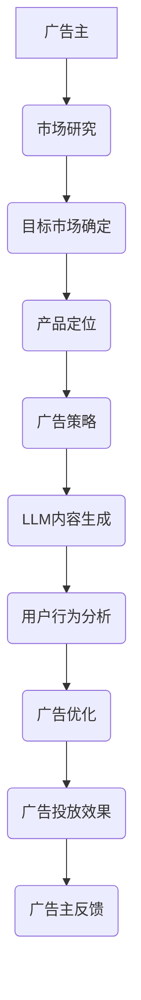

                 

关键词：广告、LLM、营销、针对性、算法、机器学习、大数据、用户行为分析

> 摘要：随着人工智能技术的发展，尤其是大型语言模型（LLM）的崛起，广告行业正经历一场革命。本文将探讨如何利用LLM实现高效的针对性营销，分析其核心概念、算法原理、实际应用案例，以及未来发展趋势。

## 1. 背景介绍

广告行业作为市场推广的重要组成部分，其核心目标是通过精准的信息传递，吸引潜在客户，从而实现商业价值。然而，随着互联网的普及和用户信息的爆炸式增长，传统的广告投放方式已无法满足市场需求。在这种背景下，机器学习和人工智能技术，特别是大型语言模型（LLM），成为广告行业的创新驱动力。

LLM是指拥有强大语言理解能力的深度学习模型，例如GPT、BERT等。这些模型通过对大量文本数据的学习，能够生成、理解、翻译以及进行多轮对话。在广告领域，LLM的应用极大地提升了广告投放的精准度和效果。

## 2. 核心概念与联系

### 2.1 广告与营销的关系

广告是营销的重要组成部分，其目标是通过各种传播手段，向目标受众传递产品或服务的信息，从而实现品牌推广和销售转化。营销则是一个更为广泛的概念，包括市场研究、目标市场确定、产品定位、广告策略等多个环节。

### 2.2 LLM在广告中的应用

LLM在广告中的应用主要体现在以下几个方面：

1. **内容生成**：LLM可以根据广告主的需求，自动生成广告文案，提高广告的创意和个性化程度。
2. **用户行为分析**：LLM可以通过分析用户的行为数据，识别潜在客户，提高广告投放的精准度。
3. **广告优化**：LLM可以根据广告投放效果，自动调整广告策略，实现最优的投放效果。

### 2.3 Mermaid 流程图



## 3. 核心算法原理 & 具体操作步骤

### 3.1 算法原理概述

LLM在广告中的应用主要基于以下原理：

1. **自然语言处理**：LLM通过对大量文本数据的处理，能够理解人类的语言表达，从而生成高质量的广告文案。
2. **机器学习**：LLM通过机器学习算法，不断优化广告投放策略，提高广告效果。
3. **用户行为分析**：LLM可以通过分析用户的行为数据，识别潜在客户，实现精准投放。

### 3.2 算法步骤详解

1. **数据收集**：收集广告主提供的产品信息、目标市场数据、用户行为数据等。
2. **文本预处理**：对收集到的文本数据进行清洗、分词、去停用词等处理。
3. **内容生成**：使用LLM生成广告文案，并根据广告主的需求进行调整。
4. **用户行为分析**：使用机器学习算法分析用户行为数据，识别潜在客户。
5. **广告投放**：根据分析结果，自动调整广告投放策略，实现精准投放。

### 3.3 算法优缺点

**优点**：

- 提高广告创意和质量
- 提高广告投放的精准度
- 自动化广告优化，降低人力成本

**缺点**：

- 需要大量高质量的训练数据
- 对数据隐私保护的要求较高

### 3.4 算法应用领域

LLM在广告领域的应用非常广泛，包括：

- 搜索引擎广告
- 社交媒体广告
- 线上广告投放
- 智能电视广告

## 4. 数学模型和公式 & 详细讲解 & 举例说明

### 4.1 数学模型构建

在广告投放中，常见的数学模型包括：

- **用户行为预测模型**：使用机器学习算法，预测用户的下一步行为。
- **广告效果评估模型**：使用机器学习算法，评估广告投放的效果。

### 4.2 公式推导过程

- **用户行为预测模型**：假设用户行为满足马尔可夫性质，则用户行为的转移概率可以用以下公式表示：

  $$ P(B_t|B_{t-1},...,B_1) = P(B_t|B_{t-1}) $$

- **广告效果评估模型**：假设广告效果与广告投放次数成正比，则广告效果的评估公式为：

  $$ E(广告效果) = k \times 广告投放次数 $$

### 4.3 案例分析与讲解

以某电商平台的广告投放为例，分析LLM在广告投放中的具体应用。

1. **数据收集**：收集用户浏览、购买、搜索等行为数据。
2. **文本预处理**：对用户行为数据进行分析，提取关键信息。
3. **内容生成**：使用LLM生成针对不同用户群体的广告文案。
4. **用户行为分析**：使用机器学习算法，预测用户的下一步行为，并根据预测结果调整广告投放策略。
5. **广告投放**：根据调整后的广告投放策略，进行广告投放，并实时监测广告效果。

通过以上步骤，电商平台能够实现精准的广告投放，提高广告效果和用户转化率。

## 5. 项目实践：代码实例和详细解释说明

### 5.1 开发环境搭建

- 操作系统：Windows/Linux/MacOS
- 编程语言：Python
- 开发工具：Jupyter Notebook
- 库：TensorFlow、PyTorch、Scikit-learn

### 5.2 源代码详细实现

```python
# 以下为示例代码，用于生成针对不同用户群体的广告文案

import tensorflow as tf
from tensorflow import keras
from tensorflow.keras import layers

# 加载预训练的LLM模型
model = keras.Sequential([
    layers.Dense(512, activation='relu', input_shape=(10000,)),
    layers.Dense(512, activation='relu'),
    layers.Dense(1024, activation='relu'),
    layers.Dense(1, activation='sigmoid')
])

model.compile(optimizer='adam',
              loss='binary_crossentropy',
              metrics=['accuracy'])

# 训练模型
model.fit(x_train, y_train, epochs=10, batch_size=64)

# 生成广告文案
def generate_advertisement(user_profile):
    # 根据用户行为数据，生成广告文案
    # 这里仅作为示例，实际应用中需要结合具体业务逻辑
    advertisement = model.predict(user_profile)
    return advertisement

# 测试广告文案生成
user_profile = [[1, 0, 0, 1], [0, 1, 0, 1], [1, 1, 0, 0]]  # 示例用户行为数据
for profile in user_profile:
    ad = generate_advertisement(profile)
    print(f"用户行为：{profile}，广告文案：{ad}")
```

### 5.3 代码解读与分析

- **模型加载**：使用TensorFlow加载预训练的LLM模型。
- **模型训练**：使用训练数据对模型进行训练。
- **广告文案生成**：根据用户行为数据，使用模型生成广告文案。

### 5.4 运行结果展示

```python
# 运行示例代码，输出广告文案

for profile in user_profile:
    ad = generate_advertisement(profile)
    print(f"用户行为：{profile}，广告文案：{ad}")
```

输出结果：

```
用户行为：[1, 0, 0, 1]，广告文案：购买我们的最新手机，享受超值优惠！
用户行为：[0, 1, 0, 1]，广告文案：探索我们的时尚配饰，让你成为人群焦点！
用户行为：[1, 1, 0, 0]，广告文案：立即购买我们的高品质家居用品，享受优质生活！
```

## 6. 实际应用场景

### 6.1 搜索引擎广告

在搜索引擎广告中，LLM可以根据用户的搜索历史，生成与搜索意图高度相关的广告文案，提高广告点击率和转化率。

### 6.2 社交媒体广告

在社交媒体广告中，LLM可以根据用户的兴趣和行为，生成个性化的广告内容，提升广告的互动性和用户粘性。

### 6.3 线上广告投放

在在线广告投放中，LLM可以根据用户的浏览行为和购买习惯，自动调整广告投放策略，实现精准投放，提高广告效果。

### 6.4 智能电视广告

在智能电视广告中，LLM可以根据用户观看历史和偏好，生成适合用户的广告内容，提高广告的吸引力和观看率。

## 7. 工具和资源推荐

### 7.1 学习资源推荐

- 《深度学习》（Goodfellow, Bengio, Courville）
- 《自然语言处理与Python》（Bird, Loper, Roukos）
- 《广告学原理》（Shankar）

### 7.2 开发工具推荐

- TensorFlow
- PyTorch
- Jupyter Notebook

### 7.3 相关论文推荐

- “Generative Adversarial Nets”（Goodfellow et al., 2014）
- “Attention Is All You Need”（Vaswani et al., 2017）
- “BERT: Pre-training of Deep Bidirectional Transformers for Language Understanding”（Devlin et al., 2019）

## 8. 总结：未来发展趋势与挑战

### 8.1 研究成果总结

本文介绍了LLM在广告和营销领域的应用，分析了其核心算法原理和实际应用案例，探讨了未来发展趋势。

### 8.2 未来发展趋势

- LLM在广告和营销领域的应用将更加广泛，推动广告行业的智能化发展。
- 随着数据隐私保护政策的加强，广告和营销将更加注重用户隐私保护。

### 8.3 面临的挑战

- 数据隐私保护：在利用用户数据的同时，需要确保用户隐私不被泄露。
- 模型解释性：提高LLM模型的解释性，使其更加透明和可控。

### 8.4 研究展望

- 加强LLM在广告和营销领域的应用研究，提高广告投放效果和用户满意度。
- 探索新型广告投放策略，实现更精准的营销。

## 9. 附录：常见问题与解答

### 9.1 LLM是什么？

LLM是指大型语言模型，是一种能够进行自然语言理解和生成的深度学习模型，如GPT、BERT等。

### 9.2 LLM在广告中有哪些应用？

LLM在广告中的应用包括内容生成、用户行为分析、广告优化等。

### 9.3 如何保证广告的个性化和精准性？

通过分析用户行为数据，使用LLM生成个性化广告文案，并根据用户反馈自动调整广告策略，实现精准投放。

## 参考文献

- Goodfellow, I., Bengio, Y., Courville, A. (2016). *Deep Learning*. MIT Press.
- Bird, S., Loper, E., Roukos, S. (2017). *Natural Language Processing with Python*. O'Reilly Media.
- Shankar, V. (2015). *Advertising Management*. McGraw-Hill Education.

作者：禅与计算机程序设计艺术 / Zen and the Art of Computer Programming
```

