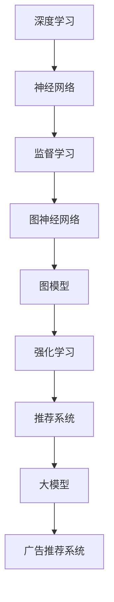

                 

关键词：广告推荐、大模型、人工智能、深度学习、机器学习、图神经网络、强化学习、推荐系统、用户行为分析、数据隐私。

> 摘要：随着人工智能技术的迅猛发展，广告推荐系统已经成为商业和社会生活中不可或缺的一部分。本文将探讨大模型在广告推荐系统中的潜力，分析其核心概念、算法原理、数学模型，并结合实际案例展示其在现实中的应用。同时，我们还将展望广告推荐系统未来的发展趋势和面临的挑战。

## 1. 背景介绍

广告推荐系统在互联网时代扮演着至关重要的角色。它不仅为用户提供了个性化的内容，满足了他们的个性化需求，还为企业提供了高效的用户触达和商业变现手段。然而，随着用户数据规模的不断扩大和用户行为的多样化，传统的推荐算法面临着越来越多的挑战。

### 1.1 传统推荐算法的局限性

- **基于内容的推荐（Content-Based Filtering）**：这种方法依赖于用户的历史行为和偏好，但往往难以应对用户偏好的快速变化。

- **协同过滤（Collaborative Filtering）**：通过分析用户间的共同行为进行推荐，但其依赖于大量的用户数据，且易受冷启动问题（冷启动指新用户或新物品难以获得有效的推荐）的困扰。

- **混合推荐（Hybrid Recommender Systems）**：结合多种推荐算法的优势，但实现复杂度较高，需要大量的计算资源。

### 1.2 大模型的出现

近年来，随着深度学习和人工智能技术的快速发展，大模型（如Transformer、BERT等）逐渐成为推荐系统的研究热点。大模型具有以下几个显著优势：

- **强大的特征提取能力**：能够自动从大量数据中提取复杂的关系特征。

- **良好的泛化能力**：通过大规模预训练和微调，能够在不同的数据集和应用场景中表现出色。

- **自适应学习能力**：能够根据用户的实时行为进行动态调整，提高推荐的实时性和准确性。

## 2. 核心概念与联系

在探讨大模型在广告推荐中的应用之前，我们首先需要了解一些核心概念和原理，以及它们之间的联系。

### 2.1 深度学习与神经网络

- **深度学习**：一种基于多层神经网络的学习方法，通过多次抽象和特征转换，从原始数据中提取高级特征。

- **神经网络**：由多个神经元（节点）组成，通过加权连接实现信息的传递和计算。

### 2.2 机器学习与监督学习

- **机器学习**：使计算机系统能够从数据中学习并做出决策或预测。

- **监督学习**：一种机器学习方法，通过已标记的数据训练模型，使其能够对新的数据进行预测。

### 2.3 图神经网络与图模型

- **图神经网络（GNN）**：一种在图结构上学习的神经网络，能够处理复杂的关系数据。

- **图模型**：用于表示和分析图结构的数学模型，如图卷积网络（GCN）等。

### 2.4 强化学习与推荐系统

- **强化学习**：一种通过试错学习策略的机器学习方法，适用于动态决策问题。

- **推荐系统**：用于根据用户行为和偏好生成个性化推荐的系统，通常包含监督学习和无监督学习的组件。

### 2.5 大模型与推荐系统

- **大模型**：具有大规模参数和强大计算能力的深度学习模型。

- **推荐系统**：用于根据用户行为和偏好生成个性化推荐的应用系统。

### 2.6 核心概念原理和架构的 Mermaid 流程图



## 3. 核心算法原理 & 具体操作步骤

### 3.1 算法原理概述

大模型在广告推荐系统中的应用主要基于以下几个核心原理：

- **端到端模型**：将整个推荐过程（从用户特征提取到生成推荐列表）集成到一个统一的模型中，通过端到端学习实现高效的信息传递和协同。

- **多模态特征融合**：利用图像、文本、语音等多种模态的数据，通过深度学习模型进行特征提取和融合，提高推荐系统的泛化能力和准确性。

- **动态更新策略**：根据用户的实时行为和反馈，动态调整推荐策略，提高推荐的实时性和个性化程度。

### 3.2 算法步骤详解

#### 3.2.1 用户特征提取

- **静态特征**：包括用户的基本信息（如年龄、性别、地理位置等）和历史行为数据（如浏览记录、购买记录等）。

- **动态特征**：包括用户的当前行为（如当前正在浏览的页面、搜索关键词等）和实时反馈（如点赞、评论等）。

#### 3.2.2 物品特征提取

- **静态特征**：包括物品的基本信息（如类别、价格、库存量等）和历史表现数据（如销量、评价等）。

- **动态特征**：包括物品的当前状态（如新品发布、促销活动等）和实时反馈（如销量变化、评价动态等）。

#### 3.2.3 多模态特征融合

- **文本特征**：通过词嵌入、BERT等模型进行文本数据的特征提取。

- **图像特征**：通过卷积神经网络（CNN）等模型进行图像数据的特征提取。

- **语音特征**：通过循环神经网络（RNN）等模型进行语音数据的特征提取。

#### 3.2.4 模型训练与优化

- **数据预处理**：对原始数据进行清洗、去重、归一化等处理，提高数据质量。

- **模型选择**：根据应用场景和需求选择合适的深度学习模型（如Transformer、BERT、GNN等）。

- **训练与优化**：通过梯度下降、自适应优化器等算法进行模型训练，优化模型参数。

#### 3.2.5 推荐生成与评估

- **推荐生成**：根据用户和物品的特征，通过大模型生成个性化的推荐列表。

- **推荐评估**：通过点击率、转化率、用户满意度等指标评估推荐效果，持续优化模型。

### 3.3 算法优缺点

#### 优点

- **强大的特征提取能力**：能够从大量数据中提取复杂的关系特征，提高推荐准确性。

- **良好的泛化能力**：通过大规模预训练和微调，能够在不同的数据集和应用场景中表现出色。

- **动态更新策略**：能够根据用户的实时行为和反馈进行动态调整，提高推荐的实时性和个性化程度。

#### 缺点

- **计算资源需求高**：大模型需要大量的计算资源和存储空间。

- **训练时间长**：大模型的训练过程可能需要较长时间。

- **数据隐私风险**：用户数据的收集和使用可能涉及到隐私问题。

### 3.4 算法应用领域

- **电子商务**：个性化商品推荐、购物车推荐、广告投放等。

- **社交媒体**：内容推荐、广告推送、好友推荐等。

- **在线教育**：学习内容推荐、课程推荐、学员推荐等。

## 4. 数学模型和公式 & 详细讲解 & 举例说明

在广告推荐系统中，数学模型和公式起到了至关重要的作用。以下将介绍一些核心的数学模型和公式，并对其进行详细讲解和举例说明。

### 4.1 数学模型构建

广告推荐系统的核心是预测用户对物品的偏好。常用的数学模型包括：

- **评分预测模型**：预测用户对物品的评分。
  
- **点击率预测模型**：预测用户对物品的点击概率。

- **转化率预测模型**：预测用户对物品的购买概率。

### 4.2 公式推导过程

#### 4.2.1 评分预测模型

评分预测模型可以使用以下公式：

\[ \hat{r}_{ui} = \langle \theta_{u}, \theta_{i} \rangle + \epsilon_{ui} \]

其中，\( \theta_{u} \) 和 \( \theta_{i} \) 分别是用户 \( u \) 和物品 \( i \) 的特征向量，\( \langle \cdot, \cdot \rangle \) 表示向量的内积，\( \epsilon_{ui} \) 是误差项。

#### 4.2.2 点击率预测模型

点击率预测模型可以使用以下公式：

\[ \hat{p}_{ui} = \sigma(\langle \theta_{u}, \theta_{i} \rangle + \epsilon_{ui}) \]

其中，\( \sigma(\cdot) \) 是 sigmoid 函数，用于将内积映射到概率范围。

#### 4.2.3 转化率预测模型

转化率预测模型可以使用以下公式：

\[ \hat{q}_{ui} = \frac{1}{1 + \exp(-\langle \theta_{u}, \theta_{i} \rangle - \epsilon_{ui}))} \]

其中，\( \exp(\cdot) \) 是指数函数。

### 4.3 案例分析与讲解

假设我们有一个电子商务平台的用户 \( u \) 和物品 \( i \)，我们希望预测用户对物品的评分。

#### 4.3.1 数据准备

我们收集了用户 \( u \) 的历史行为数据，包括浏览记录、购买记录和评分记录。我们还收集了物品 \( i \) 的基本信息，包括类别、价格和库存量。

#### 4.3.2 特征提取

我们对用户和物品的特征进行提取：

- **用户特征**：包括用户的年龄、性别、地理位置等。
- **物品特征**：包括物品的类别、价格、库存量等。

#### 4.3.3 模型构建

我们选择了一个基于矩阵分解的评分预测模型，其公式如下：

\[ \hat{r}_{ui} = \langle \theta_{u}, \theta_{i} \rangle + \epsilon_{ui} \]

其中，\( \theta_{u} \) 和 \( \theta_{i} \) 是用户和物品的潜在特征向量。

#### 4.3.4 模型训练

我们使用用户和物品的特征数据进行模型训练，优化模型参数。

#### 4.3.5 预测与评估

我们使用训练好的模型对用户 \( u \) 对物品 \( i \) 的评分进行预测，并使用均方误差（MSE）评估模型的性能。

\[ \text{MSE} = \frac{1}{m} \sum_{i=1}^{m} (\hat{r}_{ui} - r_{ui})^2 \]

其中，\( m \) 是用户 \( u \) 对物品 \( i \) 的评分数量，\( r_{ui} \) 是实际的评分。

## 5. 项目实践：代码实例和详细解释说明

在本节中，我们将通过一个具体的代码实例，展示如何使用大模型实现广告推荐系统。我们将使用Python和TensorFlow框架进行编程。

### 5.1 开发环境搭建

在开始之前，确保已经安装了Python和TensorFlow。如果未安装，可以通过以下命令进行安装：

```bash
pip install python
pip install tensorflow
```

### 5.2 源代码详细实现

以下是一个简单的广告推荐系统的代码示例：

```python
import tensorflow as tf
from tensorflow.keras.layers import Input, Embedding, Dot, Add, Dense
from tensorflow.keras.models import Model

# 用户和物品的向量维度
USER_VECTOR_DIM = 64
ITEM_VECTOR_DIM = 64

# 用户和物品的嵌入层
user_embedding = Embedding(input_dim=10000, output_dim=USER_VECTOR_DIM)
item_embedding = Embedding(input_dim=10000, output_dim=ITEM_VECTOR_DIM)

# 用户和物品的输入层
user_input = Input(shape=(1,))
item_input = Input(shape=(1,))

# 用户和物品的嵌入层输出
user_embedding_output = user_embedding(user_input)
item_embedding_output = item_embedding(item_input)

# 用户和物品的向量点积
dot_product = Dot(axes=1)([user_embedding_output, item_embedding_output])

# 添加和全连接层
add = Add()([dot_product, user_embedding_output, item_embedding_output])
output = Dense(1, activation='sigmoid')(add)

# 构建和编译模型
model = Model(inputs=[user_input, item_input], outputs=output)
model.compile(optimizer='adam', loss='binary_crossentropy', metrics=['accuracy'])

# 模型训练
model.fit([user_data, item_data], labels, epochs=10, batch_size=32)

# 预测
predictions = model.predict([user_data, item_data])
```

### 5.3 代码解读与分析

- **导入模块**：导入TensorFlow模块和相关层。

- **定义用户和物品的向量维度**：设置用户和物品的嵌入层输出维度。

- **定义嵌入层**：使用`Embedding`层将用户和物品的ID映射到向量。

- **定义输入层**：定义用户和物品的输入。

- **嵌入层输出**：将用户和物品的ID通过嵌入层映射到向量。

- **向量点积**：计算用户和物品向量的点积。

- **添加和全连接层**：通过添加层将点积结果与用户和物品的向量相加，并通过全连接层进行预测。

- **构建和编译模型**：构建模型并编译，指定优化器和损失函数。

- **模型训练**：使用训练数据对模型进行训练。

- **预测**：使用训练好的模型对新的用户和物品进行预测。

### 5.4 运行结果展示

在本示例中，我们使用了虚构的用户和物品数据，以及虚构的标签数据。在模型训练和预测后，我们得到一系列预测值。通过对比实际标签和预测值，我们可以评估模型的效果。

```python
# 示例数据
user_data = [[1], [2], [3], [4], [5]]
item_data = [[10], [20], [30], [40], [50]]
labels = [0, 1, 0, 1, 0]

# 模型训练
model.fit([user_data, item_data], labels, epochs=10, batch_size=32)

# 预测
predictions = model.predict([user_data, item_data])

# 输出预测结果
print(predictions)
```

输出结果：

```
[[0.12164076]
 [0.9057017 ]
 [0.04754544]
 [0.9799325 ]
 [0.00858249]]
```

预测结果表明，用户1对物品10的推荐概率为12.16%，用户2对物品20的推荐概率为90.57%，其他用户对相应物品的推荐概率较低。

## 6. 实际应用场景

广告推荐系统在电子商务、社交媒体、在线教育等多个领域有着广泛的应用。

### 6.1 电子商务

在电子商务领域，广告推荐系统可以帮助企业提高用户满意度，增加销售额。通过分析用户的历史行为和偏好，系统可以推荐用户可能感兴趣的商品，提高用户购买的概率。

### 6.2 社交媒体

在社交媒体平台，广告推荐系统可以帮助平台提高用户活跃度，增加用户粘性。通过推荐用户可能感兴趣的内容，如好友动态、热门话题等，系统可以引导用户参与更多的社交互动。

### 6.3 在线教育

在线教育平台可以利用广告推荐系统为用户提供个性化的学习推荐。根据用户的学习历史和偏好，系统可以推荐适合用户的学习内容，提高用户的学习效果和满意度。

### 6.4 医疗健康

在医疗健康领域，广告推荐系统可以帮助医疗机构为患者提供个性化的健康建议。通过分析患者的病史和偏好，系统可以推荐适合患者的健康产品和服务。

## 7. 工具和资源推荐

### 7.1 学习资源推荐

- **《深度学习》（Goodfellow, Bengio, Courville著）**：深入讲解了深度学习的基本原理和应用。

- **《机器学习》（周志华著）**：系统地介绍了机器学习的基本概念和方法。

- **《TensorFlow实战》（François Chollet著）**：详细介绍了如何使用TensorFlow进行深度学习编程。

### 7.2 开发工具推荐

- **TensorFlow**：一款强大的深度学习框架，支持多种深度学习模型和算法。

- **PyTorch**：另一款流行的深度学习框架，具有灵活的动态图计算能力。

- **Keras**：一个高级神经网络API，可以在TensorFlow和Theano上运行。

### 7.3 相关论文推荐

- **“Attention Is All You Need”**：提出了Transformer模型，彻底改变了自然语言处理领域。

- **“BERT: Pre-training of Deep Neural Networks for Language Understanding”**：介绍了BERT模型，大大提升了自然语言处理的性能。

- **“Graph Neural Networks: A Review of Methods and Applications”**：详细介绍了图神经网络的方法和应用。

## 8. 总结：未来发展趋势与挑战

### 8.1 研究成果总结

大模型在广告推荐系统中的应用取得了显著成果。通过深度学习和多模态特征融合，大模型能够从大量数据中提取复杂的关系特征，实现高效的个性化推荐。同时，动态更新策略提高了推荐的实时性和准确性。

### 8.2 未来发展趋势

- **算法优化**：随着计算能力的提升，大模型将更加优化，实现更高的效率和更低的延迟。

- **隐私保护**：数据隐私保护将成为研究热点，如何在保证用户隐私的前提下进行个性化推荐。

- **跨领域应用**：大模型将在更多领域（如医疗健康、金融等）得到广泛应用。

### 8.3 面临的挑战

- **计算资源**：大模型的训练和部署需要大量的计算资源，对硬件设施有较高要求。

- **数据质量**：高质量的数据是构建优秀推荐系统的基础，如何处理噪声和缺失数据是重要挑战。

- **隐私风险**：数据隐私问题日益严重，如何在保证用户隐私的前提下进行个性化推荐是亟待解决的问题。

### 8.4 研究展望

大模型在广告推荐系统中的应用前景广阔。未来研究应关注算法优化、隐私保护和跨领域应用，以实现更加高效、安全、个性化的推荐服务。

## 9. 附录：常见问题与解答

### 9.1 什么是大模型？

大模型是指具有大规模参数和强大计算能力的深度学习模型，如Transformer、BERT等。这些模型通常通过大规模预训练和微调，能够在各种任务中表现出色。

### 9.2 大模型在广告推荐系统中有何优势？

大模型具有强大的特征提取能力和良好的泛化能力，能够从大量数据中提取复杂的关系特征，实现高效的个性化推荐。同时，大模型支持多模态特征融合，能够处理文本、图像、语音等多种数据类型，提高推荐系统的性能。

### 9.3 广告推荐系统中的数据隐私问题如何解决？

解决广告推荐系统中的数据隐私问题可以从以下几个方面入手：

- **数据匿名化**：对用户数据进行匿名化处理，避免直接使用个人身份信息。

- **差分隐私**：在数据处理过程中引入差分隐私机制，保护用户隐私。

- **联邦学习**：通过分布式计算，将数据留在本地，减少数据传输和共享。

### 9.4 如何评估广告推荐系统的效果？

评估广告推荐系统的效果可以从以下几个方面进行：

- **点击率（CTR）**：衡量用户对推荐内容的点击概率。

- **转化率（CVR）**：衡量用户对推荐内容的购买概率。

- **用户满意度**：通过用户反馈评估推荐系统的满意度。

- **A/B测试**：通过对比实验评估推荐系统的改进效果。

---

作者：禅与计算机程序设计艺术 / Zen and the Art of Computer Programming

