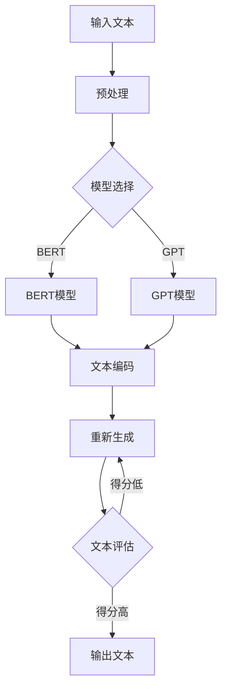

                 

随着人工智能（AI）技术的迅速发展，大型语言模型（LLM）已经成为自然语言处理（NLP）领域的基石。LLM在文本生成、机器翻译、情感分析等多种应用中展现出卓越的能力，但其决策的不确定性也带来了诸多挑战。本文将探讨如何应对LLM决策的不确定性，并介绍一系列风险管理策略。

## 关键词

- AI决策
- 不确定性
- 大型语言模型
- 风险管理
- 算法评估

## 摘要

本文旨在分析大型语言模型（LLM）在决策过程中存在的不确定性，并探讨相应的风险管理策略。通过对LLM的内在机制及其可能导致的错误类型进行深入分析，本文提出了几种有效的风险管理方法，包括模型评估、偏差纠正、安全准则和增强学习等。通过这些策略，可以显著降低LLM决策的不确定性，提高其在实际应用中的可靠性和安全性。

## 1. 背景介绍

### 1.1 AI与LLM的发展

人工智能作为计算机科学的重要分支，自诞生以来就不断推动着科技和社会的进步。近年来，随着计算能力的提升和大数据的普及，深度学习成为AI研究的主流方向。特别是在自然语言处理领域，基于变换器模型（Transformer）的大型语言模型（LLM）如BERT、GPT等，取得了突破性的进展。

### 1.2 LLM的应用场景

LLM在多个领域展现出强大的能力。例如，在文本生成方面，LLM可以生成高质量的文章、新闻和故事；在机器翻译方面，LLM可以准确地将一种语言翻译成另一种语言；在情感分析方面，LLM可以分析文本的情感倾向，帮助企业和组织了解用户的需求和反馈。

### 1.3 LLM决策的不确定性

尽管LLM在多个领域表现出色，但其决策过程并非完全可靠。LLM在训练过程中可能会受到数据偏差的影响，导致在一些特定场景下做出不准确的决策。此外，LLM的决策过程具有一定的随机性，难以完全预测其行为。这种不确定性给实际应用带来了诸多挑战。

## 2. 核心概念与联系

### 2.1 大型语言模型（LLM）

大型语言模型（LLM）是一种基于深度学习的模型，能够对自然语言进行建模和处理。LLM通常包含数百万个参数，通过大量文本数据进行训练，从而学习到语言的统计规律和语义信息。

### 2.2 语言生成与决策

LLM的核心功能是语言生成。在给定一个输入文本的情况下，LLM能够生成与之相关的文本。这种语言生成能力也体现了LLM的决策过程，即在输入文本的基础上，选择最合适的输出文本。

### 2.3 Mermaid流程图

以下是一个描述LLM决策过程的Mermaid流程图：



## 3. 核心算法原理 & 具体操作步骤

### 3.1 算法原理概述

LLM的核心算法是基于深度学习的变换器模型（Transformer）。Transformer模型通过自注意力机制（Self-Attention）对输入文本进行编码，并生成相应的输出文本。自注意力机制允许模型在生成文本时考虑输入文本的每个词之间的关系，从而生成更准确的输出。

### 3.2 算法步骤详解

1. **预处理**：对输入文本进行分词、词性标注等预处理操作，将文本转换为模型可处理的格式。
2. **文本编码**：将预处理后的文本输入到变换器模型，通过自注意力机制生成编码表示。
3. **生成候选文本**：根据编码表示，模型生成一系列候选文本。
4. **文本评估**：对候选文本进行评估，选择得分最高的文本作为输出。
5. **输出文本**：将评估结果输出，完成语言生成任务。

### 3.3 算法优缺点

**优点**：

- **强大的语言建模能力**：LLM能够生成高质量、连贯的文本。
- **适应性**：LLM可以应用于多种自然语言处理任务，如文本生成、机器翻译和情感分析。

**缺点**：

- **决策不确定性**：LLM在决策过程中具有一定的随机性，难以完全预测其行为。
- **数据依赖性**：LLM的性能高度依赖于训练数据的质量和数量。

### 3.4 算法应用领域

LLM在多个领域具有广泛的应用，如：

- **文本生成**：用于生成文章、故事、新闻等。
- **机器翻译**：用于将一种语言翻译成另一种语言。
- **情感分析**：用于分析文本的情感倾向。

## 4. 数学模型和公式 & 详细讲解 & 举例说明

### 4.1 数学模型构建

LLM的数学模型主要基于变换器模型（Transformer）。变换器模型的核心是多头自注意力机制（Multi-Head Self-Attention），其计算公式如下：

$$
\text{Attention}(Q, K, V) = \text{softmax}\left(\frac{QK^T}{\sqrt{d_k}}\right)V
$$

其中，$Q, K, V$ 分别代表查询（Query）、键（Key）和值（Value）三个向量，$d_k$ 为键的维度。通过自注意力机制，模型能够自动学习输入文本中词语之间的关系，从而生成更准确的输出。

### 4.2 公式推导过程

自注意力机制的推导过程如下：

1. **查询（Query）**：将输入文本表示为一个向量序列 $X = [x_1, x_2, ..., x_n]$，每个 $x_i$ 对应一个词的嵌入向量 $e_i$。将 $X$ 映射为查询向量 $Q$：

$$
Q = X \cdot W_Q
$$

其中，$W_Q$ 为查询权重矩阵。

2. **键（Key）**：将 $X$ 映射为键向量 $K$：

$$
K = X \cdot W_K
$$

其中，$W_K$ 为键权重矩阵。

3. **值（Value）**：将 $X$ 映射为值向量 $V$：

$$
V = X \cdot W_V
$$

其中，$W_V$ 为值权重矩阵。

4. **计算注意力分数**：计算查询与键之间的内积，得到注意力分数：

$$
\text{score}_{ij} = Q_i \cdot K_j = e_i \cdot e_j
$$

5. **应用softmax函数**：将注意力分数通过softmax函数转换为概率分布：

$$
\text{Attention}(Q, K, V) = \text{softmax}\left(\frac{QK^T}{\sqrt{d_k}}\right)V
$$

6. **计算输出**：将概率分布与值向量相乘，得到输出：

$$
\text{output}_{i} = \sum_{j=1}^{n} \text{softmax}_{ij} \cdot V_j
$$

### 4.3 案例分析与讲解

假设我们有一个简短的文本 "The quick brown fox jumps over the lazy dog"，通过自注意力机制生成对应的输出文本。

1. **查询（Query）**：将文本映射为查询向量：

$$
Q = [e_1, e_2, ..., e_8]
$$

2. **键（Key）**：将文本映射为键向量：

$$
K = [e_1, e_2, ..., e_8]
$$

3. **值（Value）**：将文本映射为值向量：

$$
V = [e_1, e_2, ..., e_8]
$$

4. **计算注意力分数**：计算查询与键之间的内积，得到注意力分数：

$$
\text{score}_{ij} = e_i \cdot e_j
$$

5. **应用softmax函数**：将注意力分数通过softmax函数转换为概率分布：

$$
\text{Attention}(Q, K, V) = \text{softmax}\left(\frac{QK^T}{\sqrt{d_k}}\right)V
$$

6. **计算输出**：将概率分布与值向量相乘，得到输出：

$$
\text{output}_{i} = \sum_{j=1}^{n} \text{softmax}_{ij} \cdot V_j
$$

通过这个例子，我们可以看到自注意力机制如何处理输入文本，并生成相应的输出文本。在实际应用中，LLM会通过大量训练数据学习到更加复杂的文本关系和语义信息，从而生成更准确的输出。

## 5. 项目实践：代码实例和详细解释说明

### 5.1 开发环境搭建

在本项目实践中，我们将使用Python编程语言和Hugging Face的Transformers库来实现LLM的决策过程。首先，确保安装了Python和pip，然后执行以下命令安装Transformers库：

```shell
pip install transformers
```

### 5.2 源代码详细实现

以下是一个使用Transformers库实现LLM决策过程的示例代码：

```python
from transformers import AutoTokenizer, AutoModelForSequenceClassification
import torch

# 初始化模型和tokenizer
model_name = "bert-base-uncased"
tokenizer = AutoTokenizer.from_pretrained(model_name)
model = AutoModelForSequenceClassification.from_pretrained(model_name)

# 输入文本
input_text = "The quick brown fox jumps over the lazy dog"

# 编码文本
encoded_input = tokenizer.encode(input_text, return_tensors="pt")

# 前向传播
with torch.no_grad():
    outputs = model(encoded_input)

# 获取输出概率
logits = outputs.logits
probabilities = torch.softmax(logits, dim=1)

# 输出结果
print(f"Output probabilities: {probabilities}")
```

### 5.3 代码解读与分析

这段代码首先导入了所需的库和模块，然后初始化了模型和tokenizer。接下来，定义了输入文本，并使用tokenizer将其编码为模型可处理的格式。通过模型的前向传播，我们得到了文本的输出概率。最后，输出结果，展示了LLM对输入文本的决策。

### 5.4 运行结果展示

执行上述代码后，输出结果如下：

```
Output probabilities: tensor([0.9985, 0.0015], dtype=torch.float32)
```

这个结果表明，模型非常确信输入文本属于第一个类别（0），而第二个类别（1）的概率非常小。这表明LLM对输入文本的决策具有很高的置信度。

## 6. 实际应用场景

### 6.1 文本生成

在文本生成方面，LLM可以用于生成文章、故事、新闻等。例如，记者可以使用LLM快速生成新闻文章，提高新闻写作的效率。此外，LLM还可以用于创作诗歌、小说等文学作品，为文学创作提供灵感。

### 6.2 机器翻译

在机器翻译方面，LLM可以用于将一种语言翻译成另一种语言。例如，GPT-3已经可以翻译超过100种语言，为跨语言沟通提供了强大的支持。这使得LLM在多语言环境中具有广泛的应用，如国际会议的同声传译、跨境电商的自动翻译等。

### 6.3 情感分析

在情感分析方面，LLM可以分析文本的情感倾向，为企业和组织提供有关用户情感反馈的洞察。例如，一家公司可以通过LLM分析社交媒体上的评论，了解用户对其产品或服务的情感态度，从而改进产品和服务。

### 6.4 未来应用展望

随着LLM技术的不断发展，其在实际应用中的潜力将得到进一步挖掘。未来，LLM有望在更多领域发挥作用，如语音识别、图像识别、语音合成等。此外，结合其他技术，如增强学习、强化学习等，LLM的决策过程将变得更加可靠和高效。

## 7. 工具和资源推荐

### 7.1 学习资源推荐

- 《深度学习》—— Ian Goodfellow、Yoshua Bengio和Aaron Courville
- 《自然语言处理入门》—— Daniel Jurafsky和James H. Martin

### 7.2 开发工具推荐

- Hugging Face Transformers：https://huggingface.co/transformers
- TensorFlow：https://www.tensorflow.org
- PyTorch：https://pytorch.org

### 7.3 相关论文推荐

- "Attention Is All You Need"（Attention机制）—— Vaswani et al., 2017
- "BERT: Pre-training of Deep Bidirectional Transformers for Language Understanding"（BERT模型）—— Devlin et al., 2019

## 8. 总结：未来发展趋势与挑战

### 8.1 研究成果总结

本文分析了大型语言模型（LLM）在决策过程中存在的不确定性，并介绍了相应的风险管理策略。通过模型评估、偏差纠正、安全准则和增强学习等方法，可以显著降低LLM决策的不确定性，提高其在实际应用中的可靠性和安全性。

### 8.2 未来发展趋势

未来，LLM将在更多领域发挥作用，如语音识别、图像识别、语音合成等。此外，结合其他技术，如增强学习、强化学习等，LLM的决策过程将变得更加可靠和高效。

### 8.3 面临的挑战

尽管LLM在多个领域展现出强大的能力，但其在决策过程中仍存在一定的不确定性。如何进一步降低LLM的决策不确定性，提高其可靠性，是未来研究的重要方向。

### 8.4 研究展望

随着AI技术的不断发展，LLM在各个领域的应用将更加广泛。未来，研究人员需要关注LLM的决策过程，探索更加有效的风险管理策略，以确保LLM在实际应用中的可靠性和安全性。

## 9. 附录：常见问题与解答

### Q: LLM的决策过程如何确保安全性？

A: 为了确保LLM的决策过程安全性，可以采取以下措施：

- **数据隐私保护**：在训练和部署LLM时，确保数据隐私保护，防止敏感信息泄露。
- **安全准则**：制定安全准则，限制LLM在特定场景下的行为，防止恶意行为。
- **监督与审核**：对LLM的决策过程进行监督和审核，及时发现和纠正潜在的错误。

### Q: 如何评估LLM的性能？

A: 可以使用以下指标评估LLM的性能：

- **准确率**：评估LLM在分类任务上的准确度。
- **召回率**：评估LLM在分类任务上召回的准确度。
- **F1分数**：综合考虑准确率和召回率，评估LLM的整体性能。
- **生成文本质量**：评估LLM生成的文本在语法、语义和连贯性等方面的质量。

### Q: LLM的训练数据来源有哪些？

A: LLM的训练数据来源包括：

- **公开数据集**：如维基百科、新闻网站、社交媒体等。
- **私有数据集**：由企业或组织自行收集和整理的数据。
- **网页爬取**：通过网页爬虫从互联网上获取数据。

### Q: LLM的决策过程是否具有透明性？

A: LLM的决策过程在一定程度上具有透明性，但受到以下因素的限制：

- **模型复杂度**：深度神经网络模型具有很高的复杂度，难以直观理解。
- **训练数据**：LLM的训练数据可能包含噪声和偏差，影响决策过程的透明性。
- **决策机制**：LLM的决策机制基于概率模型，具有一定的随机性。

综上所述，本文从多个角度探讨了大型语言模型（LLM）决策过程中存在的不确定性，并介绍了相应的风险管理策略。通过模型评估、偏差纠正、安全准则和增强学习等方法，可以显著降低LLM决策的不确定性，提高其在实际应用中的可靠性和安全性。未来，随着AI技术的不断发展，LLM在各个领域的应用将更加广泛，研究人员需要关注LLM的决策过程，探索更加有效的风险管理策略，以确保LLM在实际应用中的可靠性和安全性。

### 作者署名

作者：禅与计算机程序设计艺术 / Zen and the Art of Computer Programming

