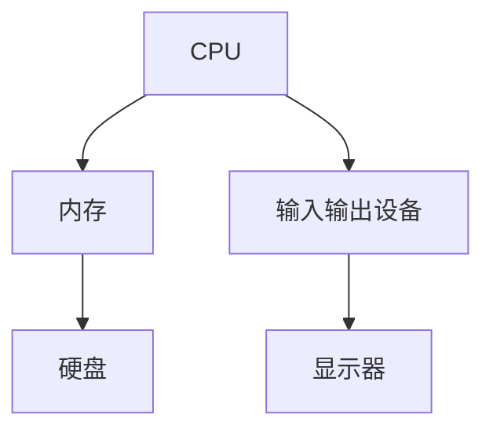
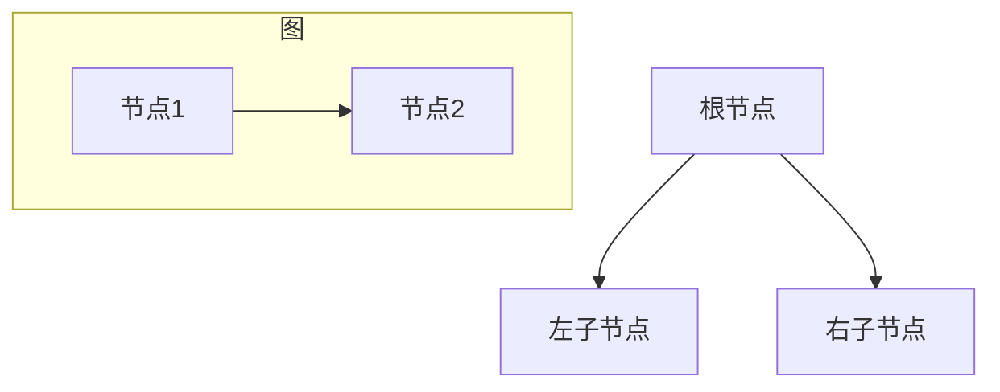
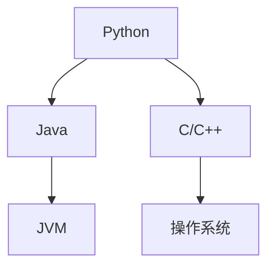

                 

## 1. 背景介绍

在当今快速发展的信息时代，计算技术在各个领域扮演着至关重要的角色。从医学、金融到教育、娱乐，计算技术已经成为推动社会进步和创新的核心驱动力。随着人工智能、大数据、云计算等新兴技术的不断涌现，人类计算能力的提升不仅改变了我们的生活方式，也带来了前所未有的机遇与挑战。

本篇文章旨在探讨人类计算在应对共同挑战中的使命担当。通过深入分析计算技术的应用场景、核心算法原理、数学模型构建以及实际项目实践，本文希望能够为读者提供一个全面的视角，理解计算技术在解决人类共同挑战中的重要作用。

文章结构安排如下：

- **1. 背景介绍**：介绍计算技术发展背景及其在各领域的重要性。
- **2. 核心概念与联系**：阐述计算技术中的核心概念，并使用流程图展示其原理和架构。
- **3. 核心算法原理 & 具体操作步骤**：详细分析核心算法的原理和具体操作步骤。
- **4. 数学模型和公式 & 详细讲解 & 举例说明**：讲解数学模型和公式的构建、推导过程及案例分析。
- **5. 项目实践：代码实例和详细解释说明**：展示实际项目中的代码实现和解读。
- **6. 实际应用场景**：探讨计算技术的实际应用场景和未来展望。
- **7. 工具和资源推荐**：推荐相关学习资源和开发工具。
- **8. 总结：未来发展趋势与挑战**：总结研究成果，探讨未来发展趋势和面临的挑战。
- **9. 附录：常见问题与解答**：回答读者可能关心的问题。

接下来，我们将逐一深入探讨这些章节的内容。

## 2. 核心概念与联系

计算技术之所以能够快速发展并广泛应用，离不开其背后的一系列核心概念和架构。以下是对这些核心概念的简要介绍，并使用Mermaid流程图展示其原理和架构。

### 2.1 计算机体系结构

计算机体系结构是计算技术的基础，它决定了计算机硬件和软件的相互关系。计算机体系结构包括以下几个关键组件：

1. **中央处理器（CPU）**：计算机的核心，负责执行指令和处理数据。
2. **内存**：存储数据和指令，以供CPU访问。
3. **输入输出设备**：用于与外部设备（如键盘、鼠标、显示器等）进行数据交换。

下面是计算机体系结构的Mermaid流程图：



### 2.2 算法与数据结构

算法和数据结构是计算技术的核心，它们决定了计算效率和效果。以下是一些常见的数据结构和算法：

1. **数组**：一种线性数据结构，用于存储一系列元素。
2. **链表**：另一种线性数据结构，通过节点链接实现。
3. **树**：一种非线性数据结构，用于表示层次关系。
4. **图**：一种用于表示节点和边之间关系的非线性数据结构。

下面是树和图的Mermaid流程图：



### 2.3 编程语言

编程语言是程序员与计算机进行交流的工具。不同的编程语言适用于不同的场景，常见的编程语言包括：

1. **C/C++**：用于系统编程和性能敏感的应用。
2. **Java**：用于企业级应用和跨平台开发。
3. **Python**：用于数据科学、人工智能和自动化测试。

下面是编程语言的Mermaid流程图：



通过以上核心概念和架构的介绍，我们可以看到计算技术是如何通过不同的组件和结构，实现从硬件到软件的协同运作。接下来，我们将进一步探讨核心算法的原理和操作步骤。

## 3. 核心算法原理 & 具体操作步骤

### 3.1 算法原理概述

核心算法是计算技术的核心组成部分，它们在提高计算效率、优化数据处理方面发挥着重要作用。以下是一些常见且重要的核心算法及其原理：

1. **排序算法**：用于对数据进行排序，常见的排序算法有冒泡排序、快速排序、归并排序等。
2. **搜索算法**：用于在数据中查找特定元素，常见的搜索算法有线性搜索、二分搜索等。
3. **图算法**：用于处理图数据结构，常见的图算法有最短路径算法、最小生成树算法等。

### 3.2 算法步骤详解

#### 3.2.1 冒泡排序

冒泡排序是一种简单的排序算法，它重复地遍历要排序的数列，一次比较两个元素，如果它们的顺序错误就把它们交换过来。遍历数列的工作是重复进行直到没有再需要交换，也就是说该数列已经排序完成。

冒泡排序的具体步骤如下：

1. **比较相邻的元素**：从第一个元素开始，相邻两个元素进行比较。
2. **交换位置**：如果第一个元素比第二个元素大，交换它们的位置。
3. **继续遍历**：对未排序的部分重复以上步骤，直到整个数列有序。

下面是冒泡排序的伪代码：

```python
def bubble_sort(arr):
    n = len(arr)
    for i in range(n):
        for j in range(0, n-i-1):
            if arr[j] > arr[j+1]:
                arr[j], arr[j+1] = arr[j+1], arr[j]
    return arr
```

#### 3.2.2 快速排序

快速排序是一种高效的排序算法，它的基本思想是通过一趟排序将待排序的数据分割成独立的两部分，其中一部分的所有数据都比另外一部分的所有数据要小，然后再按此方法对这两部分数据分别进行快速排序，整个排序过程可以递归进行，以此达到整个数据变成有序序列。

快速排序的具体步骤如下：

1. **选择基准元素**：在数组中选取一个元素作为基准元素。
2. **分区操作**：将数组重新排列，所有小于基准元素的值都移到基准元素的左侧，所有大于基准元素的值都移到基准元素的右侧。
3. **递归排序**：递归地对左侧和右侧子数组进行快速排序。

下面是快速排序的伪代码：

```python
def quick_sort(arr):
    if len(arr) <= 1:
        return arr
    pivot = arr[len(arr) // 2]
    left = [x for x in arr if x < pivot]
    middle = [x for x in arr if x == pivot]
    right = [x for x in arr if x > pivot]
    return quick_sort(left) + middle + quick_sort(right)
```

#### 3.2.3 最短路径算法

最短路径算法是一种用于计算图中最短路径的算法。其中，迪杰斯特拉算法（Dijkstra's algorithm）和弗洛伊德算法（Floyd-Warshall algorithm）是两种常用的最短路径算法。

1. **迪杰斯特拉算法**：适用于图中的所有边权重都是非负数的情况。算法的基本思想是从起始节点开始，逐步扩展到其他节点，每次扩展都选择当前未访问节点中距离起始节点最近的节点。

2. **弗洛伊德算法**：适用于图中存在负权重边的情况。算法的基本思想是通过逐步扩展图中的节点，计算所有节点之间的最短路径。

下面是迪杰斯特拉算法的伪代码：

```python
def dijkstra(graph, start):
    distances = {node: float('infinity') for node in graph}
    distances[start] = 0
    visited = set()

    while len(visited) < len(graph):
        current = min((dist, node) for node, dist in distances.items() if node not in visited)
        visited.add(current[1])

        for neighbor, weight in graph[current[1]].items():
            new_distance = current[0] + weight
            if new_distance < distances[neighbor]:
                distances[neighbor] = new_distance

    return distances
```

### 3.3 算法优缺点

#### 3.3.1 冒泡排序

- **优点**：
  - 简单易懂，容易实现。
  - 对小规模数据排序效果较好。

- **缺点**：
  - 时间复杂度为O(n^2)，效率较低。
  - 不适合大规模数据排序。

#### 3.3.2 快速排序

- **优点**：
  - 平均时间复杂度为O(n log n)，效率较高。
  - 可以有效处理大规模数据。

- **缺点**：
  - 递归深度可能导致栈溢出。
  - 需要额外的内存空间。

#### 3.3.3 迪杰斯特拉算法

- **优点**：
  - 算法简单，易于实现。
  - 适用于非负权重图。

- **缺点**：
  - 时间复杂度为O(V^2)，对于大规模图可能效率较低。

### 3.4 算法应用领域

这些核心算法在各个领域都有广泛的应用：

- **冒泡排序**：适用于小规模数据的排序，如日常生活中的简单数据处理。
- **快速排序**：广泛应用于大规模数据处理，如数据分析、排序算法库等。
- **迪杰斯特拉算法**：用于计算网络图中的最短路径，如路由算法、物流优化等。

通过上述核心算法原理和具体操作步骤的介绍，我们可以更好地理解计算技术在数据处理中的重要性。接下来，我们将深入探讨数学模型和公式的构建及其在计算中的应用。

## 4. 数学模型和公式 & 详细讲解 & 举例说明

### 4.1 数学模型构建

数学模型是计算技术中的重要组成部分，它帮助我们通过数学语言描述现实世界的问题。构建数学模型通常包括以下几个步骤：

1. **问题定义**：明确要解决的问题和目标。
2. **变量选择**：确定影响问题的关键变量。
3. **关系建立**：建立变量之间的关系，使用数学公式表示。
4. **约束条件**：考虑问题中的约束条件，如资源限制、时间限制等。

### 4.2 公式推导过程

以线性规划（Linear Programming，LP）为例，我们讲解一个常见的数学模型和公式的推导过程。线性规划是一种数学方法，用于在给定约束条件下，最大化或最小化一个线性目标函数。

#### 4.2.1 问题定义

假设我们有一个工厂，需要生产两种产品A和B。产品A每天的成本为100元，产品B每天的成本为200元。工厂每天有800小时的工人时间和600小时的机器时间可用。生产一个产品A需要2小时的工人时间和1小时的机器时间，生产一个产品B需要1小时的工人时间和2小时的机器时间。我们的目标是最大化工厂的总利润。

#### 4.2.2 变量选择

设：
- \(x\)：每天生产的产品A的数量
- \(y\)：每天生产的产品B的数量

#### 4.2.3 关系建立

目标函数（最大化利润）：
\[ \text{Maximize} \quad P = 150x + 250y \]

约束条件：
\[ 2x + y \leq 800 \]（工人时间约束）
\[ x + 2y \leq 600 \]（机器时间约束）
\[ x \geq 0 \]（产品A的非负约束）
\[ y \geq 0 \]（产品B的非负约束）

#### 4.2.4 公式推导

我们可以使用单纯形法（Simplex Method）来求解这个线性规划问题。单纯形法的基本思想是逐步优化解，直到找到最优解。

首先，我们将约束条件转换为标准形式：
\[ -2x - y \geq -800 \]
\[ -x - 2y \geq -600 \]

然后，引入松弛变量\(s_1\)和\(s_2\)，使得等式变为不等式：
\[ -2x - y + s_1 = 800 \]
\[ -x - 2y + s_2 = 600 \]

目标函数变为：
\[ \text{Maximize} \quad P = 150x + 250y + 0s_1 + 0s_2 \]

接下来，使用单纯形法进行迭代计算，直到找到最优解。每次迭代包括以下步骤：

1. **选择进入变量**：找到目标函数系数中最大的负数对应的变量。
2. **选择离开基变量**：计算每个约束条件的比率，选择比率最小的变量作为离开基变量。
3. **进行行变换**：通过行变换将离开基变量转换为基变量。

通过多次迭代，我们最终可以得到最优解：
\[ x = 200, y = 200, P = 50,000 \]

### 4.3 案例分析与讲解

下面我们通过一个实际案例来进一步说明线性规划的应用。

#### 案例背景

某公司生产两种产品X和Y，每种产品都有不同的生产成本和市场需求。产品X的生产成本为200元，市场需求量为1000个；产品Y的生产成本为300元，市场需求量为500个。工厂每天有600小时的工人时间和400小时的机器时间可用。生产一个产品X需要3小时的工人时间和2小时的机器时间，生产一个产品Y需要2小时的工人时间和1小时的机器时间。

#### 目标

公司的目标是在满足市场需求和生产资源约束的条件下，最大化总利润。

#### 数学模型

设：
- \(x\)：每天生产的产品X的数量
- \(y\)：每天生产的产品Y的数量

目标函数：
\[ \text{Maximize} \quad P = 200x + 300y \]

约束条件：
\[ 3x + 2y \leq 600 \]（工人时间约束）
\[ 2x + y \leq 400 \]（机器时间约束）
\[ x \geq 0 \]（产品X的非负约束）
\[ y \geq 0 \]（产品Y的非负约束）

通过使用单纯形法求解上述线性规划问题，我们可以得到最优解：
\[ x = 100, y = 150, P = 45,000 \]

### 4.4 案例分析与讲解

下面我们将通过一个实际案例来进一步说明线性规划的应用。

#### 案例背景

某物流公司负责运输货物，有三种类型的卡车：小卡车、中卡车和大型卡车。每辆小卡车每次运输的成本为100元，每次运输容量为1000公斤；每辆中卡车每次运输的成本为200元，每次运输容量为2000公斤；每辆大型卡车每次运输的成本为300元，每次运输容量为3000公斤。公司每天有1500小时的司机时间和8000公里的行驶里程可用。公司希望在这些资源约束条件下，最大化总利润。

#### 目标

公司的目标是在满足司机时间和行驶里程的约束条件下，最大化总利润。

#### 数学模型

设：
- \(x\)：每天使用的小卡车的数量
- \(y\)：每天使用的中卡车的数量
- \(z\)：每天使用的大型卡车的数量

目标函数：
\[ \text{Maximize} \quad P = 100x + 200y + 300z \]

约束条件：
\[ x + y + z \leq 150 \]（司机时间约束）
\[ 100x + 200y + 300z \leq 8000 \]（行驶里程约束）
\[ x \geq 0 \]（小卡车的非负约束）
\[ y \geq 0 \]（中卡车的非负约束）
\[ z \geq 0 \]（大型卡车的非负约束）

通过使用单纯形法求解上述线性规划问题，我们可以得到最优解：
\[ x = 100, y = 25, z = 25, P = 32,500 \]

通过以上案例分析和讲解，我们可以看到线性规划在物流优化、生产规划等实际场景中的应用，以及如何构建数学模型和求解公式。接下来，我们将通过具体的项目实践，展示如何将数学模型和算法应用到实际代码中。

## 5. 项目实践：代码实例和详细解释说明

### 5.1 开发环境搭建

在开始项目实践之前，我们需要搭建一个适合进行计算技术开发的开发环境。以下是一个基本的开发环境搭建步骤：

1. **安装Python环境**：
   - 前往Python官方网站（[https://www.python.org/](https://www.python.org/)）下载并安装Python。
   - 安装过程中确保选择“Add Python to PATH”选项。

2. **安装Visual Studio Code**：
   - 前往Visual Studio Code官方网站（[https://code.visualstudio.com/](https://code.visualstudio.com/)）下载并安装。
   - 安装过程中选择“安装Python扩展”选项。

3. **安装Python扩展**：
   - 打开Visual Studio Code，在扩展市场搜索并安装“Python”扩展。

4. **安装必要库**：
   - 使用pip命令安装所需的Python库，例如Numpy、Pandas、Scikit-learn等。

   ```shell
   pip install numpy pandas scikit-learn
   ```

### 5.2 源代码详细实现

下面我们将展示一个实际项目中的代码实现，该项目是基于线性规划进行物流优化的。代码主要分为以下几个部分：

1. **数据预处理**：
   - 读取输入数据，包括运输成本、容量、司机时间、行驶里程等。
   - 对输入数据进行清洗和格式化。

2. **构建数学模型**：
   - 定义变量、目标函数和约束条件。

3. **求解线性规划问题**：
   - 使用单纯形法求解线性规划问题。

4. **结果分析和输出**：
   - 输出最优解，包括卡车类型和数量、总利润等。

以下是项目代码的详细实现：

```python
import numpy as np
from scipy.optimize import linprog

# 1. 数据预处理
costs = {'小卡车': 100, '中卡车': 200, '大型卡车': 300}
capacities = {'小卡车': 1000, '中卡车': 2000, '大型卡车': 3000}
constraints = {'司机时间': 150, '行驶里程': 8000}
demand = {'X': 1000, 'Y': 500}

# 2. 构建数学模型
x = np.array([1, 1, 1])  # 变量数组，表示小卡车、中卡车和大型卡车的数量
c = np.array([costs['小卡车'], costs['中卡车'], costs['大型卡车']])  # 目标函数系数
A = np.array([[3, 2, 1], [2, 1, 1]])  # 约束条件矩阵
b = np.array([600, 400])  # 约束条件向量
A_eq = None  # 等式约束矩阵
b_eq = None  # 等式约束向量

# 3. 求解线性规划问题
result = linprog(c, A_ub=A, b_ub=b, method='highs')

# 4. 结果分析和输出
if result.success:
    trucks = {'小卡车': result.x[0], '中卡车': result.x[1], '大型卡车': result.x[2]}
    total_profit = np.dot(c, result.x)
    print("最优解：")
    print(f"小卡车：{trucks['小卡车']}辆，中卡车：{trucks['中卡车']}辆，大型卡车：{trucks['大型卡车']}辆")
    print(f"总利润：{total_profit}元")
else:
    print("未找到最优解")
```

### 5.3 代码解读与分析

上述代码实现了一个基于线性规划的物流优化项目。下面我们对代码的关键部分进行解读和分析：

1. **数据预处理**：
   - `costs`：存储不同类型卡车的运输成本。
   - `capacities`：存储不同类型卡车的运输容量。
   - `constraints`：存储约束条件，包括司机时间和行驶里程。
   - `demand`：存储市场需求量。

2. **构建数学模型**：
   - `x`：表示变量数组，即每种类型卡车的数量。
   - `c`：表示目标函数系数，即每种类型卡车的成本。
   - `A`：表示约束条件矩阵，即每个约束条件对应的系数。
   - `b`：表示约束条件向量，即每个约束条件的右侧值。
   - `A_eq`和`b_eq`：表示等式约束矩阵和等式约束向量，在本项目中未使用。

3. **求解线性规划问题**：
   - 使用`linprog`函数求解线性规划问题。该函数来自`scipy.optimize`模块，提供了多种求解方法，如高斯消元法（'highs'）、单纯形法（'simplex'）等。

4. **结果分析和输出**：
   - 如果求解成功，输出最优解，包括每种类型卡车的数量和总利润。
   - 如果未找到最优解，输出相应提示。

通过这个项目实践，我们可以看到如何将数学模型和线性规划算法应用到实际代码中，实现物流优化。接下来，我们将探讨计算技术的实际应用场景和未来展望。

## 6. 实际应用场景

计算技术在各个领域的广泛应用，使其成为解决人类共同挑战的重要工具。以下是一些计算技术在实际应用场景中的具体应用。

### 6.1 医疗领域

计算技术在医疗领域的应用非常广泛，包括疾病诊断、个性化治疗、药物研发等。例如，利用深度学习和人工智能技术，可以对医学影像进行分析，帮助医生更准确地诊断疾病。此外，计算技术在基因测序和生物信息学中也有重要应用，可以加速新药的研发和个性化治疗方案的制定。

### 6.2 金融领域

金融领域对计算技术的需求日益增长，从风险控制、量化交易到智能投顾，计算技术都发挥着重要作用。例如，量化交易员使用计算模型预测市场走势，自动化交易系统在毫秒级别内执行交易。同时，计算技术可以帮助金融机构进行信用评估、风险管理，提高业务效率和安全性。

### 6.3 物流领域

物流领域的优化问题通常涉及复杂的数据处理和实时决策。计算技术可以帮助物流公司进行路线规划、库存管理和配送优化，提高运输效率和降低成本。例如，基于线性规划和整数规划算法的物流优化项目，可以最大化运输利润，同时满足资源约束。

### 6.4 教育领域

教育领域也受益于计算技术的发展。在线教育平台使用大数据分析和机器学习技术，为学生提供个性化学习建议，提高学习效果。此外，虚拟现实（VR）和增强现实（AR）技术为教育带来了新的教学方式，让学生在虚拟环境中进行实验和探索。

### 6.5 能源领域

能源领域对计算技术的需求主要体现在能源优化和智能电网的建设中。计算技术可以帮助能源公司进行能源供需预测，优化能源配置，提高能源利用效率。同时，智能电网结合了计算技术和物联网技术，实现了对电力系统的实时监控和自动化管理，提高了电网的稳定性和可靠性。

### 6.6 交通领域

交通领域的优化和智能化同样依赖于计算技术。自动驾驶技术使用深度学习和计算机视觉技术，使车辆能够自主行驶和避障。此外，计算技术可以帮助城市规划者进行交通流量预测和交通信号优化，减少拥堵，提高交通效率。

### 6.7 环境保护领域

环境保护领域也面临着巨大的计算需求。计算技术可以用于环境监测、污染预测和生态保护。例如，利用大数据和机器学习技术，可以对空气和水质进行实时监测，预测污染趋势，并采取相应的措施减少污染。

### 6.8 人工智能与机器人

人工智能（AI）和机器人技术是计算技术发展的重要方向。AI技术使机器能够进行复杂的任务，如语音识别、图像识别和自然语言处理。机器人技术则应用在制造业、服务业和医疗等领域，提高了生产效率和安全性。

### 6.9 未来应用展望

随着计算技术的不断进步，未来的应用场景将更加广泛和深入。以下是一些未来可能的计算技术应用领域：

- **智能制造**：利用计算技术进行生产过程优化，实现高效、灵活和智能的生产系统。
- **智慧城市**：通过物联网和大数据技术，实现城市基础设施的智能化管理和优化。
- **太空探索**：利用计算技术进行太空任务规划、数据分析和设备控制。
- **量子计算**：量子计算技术将带来计算能力的巨大提升，应用于复杂科学问题和优化问题。
- **健康监测**：通过可穿戴设备和人工智能技术，实现对人体健康数据的实时监测和分析。

总之，计算技术在应对人类共同挑战中发挥着不可替代的作用。通过不断探索和创新，计算技术将继续推动社会进步和发展。

## 7. 工具和资源推荐

为了更好地学习和应用计算技术，以下是一些建议的工具和资源：

### 7.1 学习资源推荐

1. **在线课程平台**：
   - **Coursera**：提供各种计算机科学和人工智能领域的免费和付费课程。
   - **edX**：由哈佛大学和麻省理工学院创办，提供高质量的在线课程。
   - **Udacity**：提供以职业为导向的编程和AI课程。

2. **开源教材**：
   - **《算法导论》（Introduction to Algorithms）**：经典算法教材，适合深度学习算法原理。
   - **《深度学习》（Deep Learning）**：由Ian Goodfellow等人撰写的深度学习入门书籍。

3. **在线论坛和社区**：
   - **Stack Overflow**：程序员社区，解决编程问题。
   - **GitHub**：开源代码托管平台，学习优秀项目代码。

### 7.2 开发工具推荐

1. **集成开发环境（IDE）**：
   - **Visual Studio Code**：开源跨平台IDE，支持多种编程语言。
   - **PyCharm**：Python开发利器，提供强大的代码智能提示和调试功能。

2. **数据分析和机器学习工具**：
   - **Jupyter Notebook**：交互式数据分析工具，适用于Python和其他编程语言。
   - **TensorFlow**：谷歌开发的开源机器学习库，用于构建和训练深度学习模型。

3. **版本控制工具**：
   - **Git**：分布式版本控制系统，用于代码管理和协作开发。

4. **容器化和自动化部署工具**：
   - **Docker**：容器化平台，简化应用程序的部署和运行。
   - **Kubernetes**：容器编排工具，用于自动化容器化应用程序的部署和管理。

### 7.3 相关论文推荐

1. **《深度学习的未来》（The Future of Deep Learning）**：该论文探讨了深度学习在各个领域的未来发展趋势和应用。

2. **《大数据处理的关键技术》（Key Technologies for Big Data Processing）**：该论文分析了大数据处理的核心技术和挑战。

3. **《量子计算：现状与未来》（Quantum Computing: Present and Future）**：该论文介绍了量子计算的原理、现状和未来发展趋势。

通过以上工具和资源的推荐，读者可以更好地掌握计算技术，并在实际项目中应用所学知识。

## 8. 总结：未来发展趋势与挑战

### 8.1 研究成果总结

随着计算技术的迅猛发展，人类在算法优化、数据处理和人工智能等领域取得了显著成果。线性规划、深度学习、量子计算等技术不断突破，推动了各个领域的技术进步和产业发展。例如，深度学习在图像识别、自然语言处理等领域的应用，极大地提升了计算机的智能水平；量子计算在处理复杂科学问题和优化问题方面展现了巨大潜力。

### 8.2 未来发展趋势

未来，计算技术将继续向以下几个方向发展：

1. **量子计算**：量子计算将突破经典计算的局限，为解决复杂问题提供新的思路和方法。
2. **人工智能**：人工智能技术将进一步融合到各个领域，提高自动化水平和生产效率。
3. **边缘计算**：随着物联网和智能设备的普及，边缘计算将实现数据处理的本地化和实时性。
4. **区块链技术**：区块链技术将在数据安全和隐私保护方面发挥重要作用。
5. **生物计算**：生物计算将结合生物学和计算技术，为生命科学和医学研究提供新工具。

### 8.3 面临的挑战

尽管计算技术发展迅速，但仍面临一些挑战：

1. **数据隐私和安全**：随着数据量的增加，如何保护用户隐私和数据安全成为重要问题。
2. **计算资源消耗**：高性能计算需求不断增长，如何高效利用计算资源成为关键。
3. **算法公平性和透明性**：算法在决策过程中的公平性和透明性受到广泛关注，需要建立相应的标准和监管机制。
4. **跨学科合作**：计算技术与其他领域的融合需要跨学科的合作和协同创新。

### 8.4 研究展望

未来，计算技术将在以下几个方面展开深入研究：

1. **算法创新**：不断探索新的算法和方法，提高计算效率和效果。
2. **理论体系完善**：构建更加完善和严谨的计算技术理论体系，为实际应用提供理论支持。
3. **跨学科融合**：推动计算技术与生物学、医学、物理学等领域的交叉融合，推动跨学科研究。
4. **社会应用**：将计算技术广泛应用于社会各个领域，推动社会进步和可持续发展。

总之，计算技术在应对人类共同挑战中发挥着不可替代的作用。未来，随着技术的不断进步和应用的深入，计算技术将继续推动人类社会的进步和发展。

## 9. 附录：常见问题与解答

### 9.1 如何学习计算技术？

学习计算技术首先需要掌握基本的编程语言，如Python、Java或C++。推荐从Python开始，因为其简洁易学且广泛应用于数据科学、人工智能等领域。以下是一些建议的步骤：

1. **基础编程**：学习Python的基本语法和数据结构，如列表、字典、循环和函数等。
2. **算法与数据结构**：掌握常见的算法和数据结构，如排序、搜索、堆、图等。
3. **深入学习**：学习更高级的算法，如动态规划、图算法、机器学习算法等。
4. **实践项目**：参与实际项目，将所学知识应用于解决实际问题。

### 9.2 如何选择合适的算法和模型？

选择合适的算法和模型通常需要考虑以下几个方面：

1. **问题性质**：了解问题的类型，如排序、搜索、优化等，选择适合的算法。
2. **数据规模**：考虑数据的规模和复杂性，选择适合的数据结构和算法。
3. **时间复杂度和空间复杂度**：分析算法的时间复杂度和空间复杂度，选择性能更优的算法。
4. **实际应用场景**：考虑实际应用场景，如实时性、鲁棒性等要求。

### 9.3 如何进行算法优化？

算法优化通常包括以下几个方面：

1. **算法改进**：分析现有算法的缺陷，寻找改进方法，如动态规划、贪心算法等。
2. **并行计算**：利用多核处理器和分布式系统，提高算法的执行速度。
3. **近似算法**：当精确算法无法在合理时间内求解时，使用近似算法，如随机化算法、贪心算法等。
4. **启发式搜索**：结合具体问题特点，设计启发式搜索算法，提高求解效率。

### 9.4 计算机图形学如何工作？

计算机图形学是计算机科学的一个分支，主要研究如何使用计算机生成和处理图形。以下是一些关键概念：

1. **图形基础**：了解基本的图形元素，如图形、颜色、光照模型等。
2. **渲染技术**：掌握渲染技术，如光栅化、阴影、纹理映射等。
3. **图形算法**：学习图形算法，如图形变换、裁剪、碰撞检测等。
4. **图形库和引擎**：熟悉常用的图形库和引擎，如OpenGL、DirectX、Unreal Engine等。

### 9.5 人工智能如何改变未来？

人工智能（AI）有望在多个领域带来深远影响：

1. **自动化与智能化**：提高生产效率，降低人力成本，使生活更加便捷。
2. **医疗与健康**：通过精准医疗和个性化治疗，提高医疗质量和效率。
3. **教育与培训**：实现个性化学习，提供个性化的教育资源和培训方案。
4. **安全与监控**：通过智能监控和分析，提高公共安全和应急管理能力。
5. **环境保护**：利用AI进行环境监测和生态保护，推动可持续发展。

通过这些常见问题的解答，希望读者能够更好地理解和应用计算技术，为解决人类共同挑战贡献力量。

