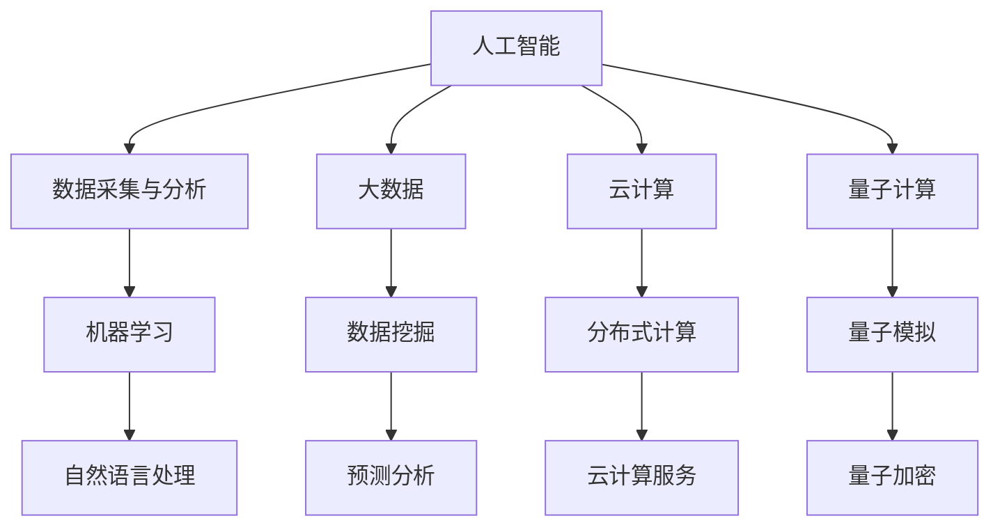

                 

关键词：计算能力，人工智能，人类挑战，技术发展，可持续发展，未来展望

> 摘要：随着科技的飞速发展，人类计算能力正以前所未有的速度提升，面对全球性挑战，如气候变化、疾病控制、能源危机等，计算技术扮演着至关重要的角色。本文将探讨计算技术在应对这些挑战中的使命与担当，分析其核心算法、数学模型、实践应用，并展望未来发展趋势与面临的挑战。

## 1. 背景介绍

自计算机诞生以来，人类计算能力经历了翻天覆地的变化。从最初的电子管计算机到现在的量子计算机，计算技术不断进步，推动着各个领域的发展。如今，人工智能、大数据、云计算等前沿技术正在深刻改变我们的生活方式，也为解决人类面临的共同挑战提供了强有力的工具。

气候变化、疾病控制、能源危机等全球性挑战，不仅考验着人类社会的智慧，也对计算技术提出了更高的要求。例如，在气候变化问题上，需要通过复杂的气候模拟和预测模型来制定有效的应对策略；在疾病控制方面，需要利用计算生物学和机器学习技术加速药物研发和病毒传播预测；在能源危机面前，需要利用智能电网和分布式计算技术实现更高效、更清洁的能源利用。

### 1.1 计算能力提升对人类的影响

计算能力的提升不仅改变了科研、工业、医疗等领域的传统工作方式，还带来了新的商业模式和社会变革。以下是从几个方面总结计算能力提升对人类的影响：

- **科研效率提高**：高性能计算使得科学家能够在短时间内处理海量数据，加速科研进程，例如，在物理学、天文学等领域，高性能计算已经成为不可或缺的工具。

- **数据驱动决策**：大数据和人工智能技术使得企业能够通过分析大量数据做出更明智的决策，从而提高生产效率、降低成本、提升用户体验。

- **智能应用普及**：智能语音助手、自动驾驶、智能安防等技术的普及，极大地丰富了人们的日常生活，提高了生活质量。

- **社会变革**：计算技术的普及改变了人们的工作方式、沟通方式，甚至影响了教育、政治等社会结构。

### 1.2 全球性挑战对计算技术的要求

应对全球性挑战，需要计算技术在多个方面实现突破：

- **算法优化**：提高算法效率和准确性，以处理更为复杂的计算任务。

- **硬件升级**：发展更快速、更节能的硬件设备，以满足不断增长的计算需求。

- **跨学科协作**：鼓励不同领域的科学家和技术人员合作，共同解决复杂问题。

- **可持续发展**：计算技术的发展应兼顾环境保护和资源利用，以实现可持续发展目标。

## 2. 核心概念与联系

为了更好地理解计算技术如何应对全球性挑战，我们需要介绍一些核心概念和其相互之间的关系。以下是计算技术在应对这些挑战中的关键概念及其流程图：

### 2.1 核心概念

- **人工智能（AI）**：通过模拟人类智能，使计算机具备感知、学习、推理和决策的能力。

- **大数据（Big Data）**：指无法使用传统数据库工具进行捕捉、管理和处理的数据集。

- **云计算（Cloud Computing）**：通过互联网提供动态易扩展且经常是虚拟化的资源。

- **量子计算（Quantum Computing）**：利用量子力学原理进行计算的技术。

### 2.2 核心概念流程图



### 2.3 核心概念之间的关系

- **人工智能**与**大数据**相互依赖，人工智能需要大数据进行分析和学习，而大数据的挖掘和分析离不开人工智能技术。

- **人工智能**与**云计算**的结合，使得大规模数据处理和智能应用成为可能，特别是在需要分布式计算和存储的情况下。

- **量子计算**为人工智能和大数据处理提供了新的计算范式，通过量子并行计算和量子算法优化，有望解决现有计算技术无法处理的复杂问题。

## 3. 核心算法原理 & 具体操作步骤

### 3.1 算法原理概述

在计算技术中，核心算法扮演着至关重要的角色。以下是几个在应对全球性挑战中具有重要应用的核心算法：

- **深度学习（Deep Learning）**：通过多层神经网络进行学习和预测，广泛应用于图像识别、语音识别等领域。

- **遗传算法（Genetic Algorithm）**：模拟生物进化过程，用于优化和搜索问题，适用于复杂优化问题。

- **PageRank**：一种用于网页排名的算法，基于链接分析，被广泛用于搜索引擎中。

- **随机森林（Random Forest）**：通过构建多个决策树并投票，用于分类和回归问题，具有很好的泛化能力。

### 3.2 算法步骤详解

以下是对上述算法的具体操作步骤进行详解：

#### 3.2.1 深度学习

1. **数据预处理**：对输入数据进行标准化、归一化处理，以适应神经网络的要求。
2. **构建模型**：定义神经网络结构，包括输入层、隐藏层和输出层。
3. **训练模型**：使用训练数据对模型进行训练，通过反向传播算法不断调整权重。
4. **评估模型**：使用测试数据评估模型性能，调整参数以优化模型。
5. **应用模型**：在新的数据上使用训练好的模型进行预测。

#### 3.2.2 遗传算法

1. **编码与初始种群生成**：将问题编码成基因串，随机生成初始种群。
2. **适应度评估**：计算每个个体的适应度，适应度越高，个体越优秀。
3. **选择**：根据适应度选择优秀个体进行交配和变异。
4. **交叉**：选择两个优秀个体进行基因交叉，生成新的个体。
5. **变异**：对个体进行基因变异，增加种群的多样性。
6. **迭代**：重复上述步骤，直到满足终止条件。

#### 3.2.3 PageRank

1. **网页链接分析**：统计每个网页与其他网页的链接关系。
2. **计算初始排名**：根据链接关系计算每个网页的初始排名。
3. **迭代计算**：使用公式反复计算，直到排名收敛。
4. **排名输出**：输出每个网页的最终排名。

#### 3.2.4 随机森林

1. **构建决策树**：对每个特征进行划分，构建多棵决策树。
2. **随机抽样**：从训练数据中随机抽样，构建每个决策树。
3. **训练决策树**：使用抽样数据训练决策树。
4. **集成投票**：将所有决策树的预测结果进行投票，得到最终预测结果。

### 3.3 算法优缺点

以下是上述算法的优缺点分析：

- **深度学习**：优点包括强大的表达能力和自学习能力，缺点是训练过程复杂、计算资源需求大。

- **遗传算法**：优点包括全局搜索能力、适用于复杂优化问题，缺点是收敛速度较慢、易陷入局部最优。

- **PageRank**：优点包括简单有效、可扩展性好，缺点是只考虑链接关系，未能充分考虑网页内容质量。

- **随机森林**：优点包括泛化能力强、计算速度快，缺点是对于特征高度相关的问题性能下降。

### 3.4 算法应用领域

以下是上述算法在不同领域中的应用：

- **深度学习**：在图像识别、语音识别、自然语言处理等领域有广泛应用。

- **遗传算法**：在优化问题、调度问题、路径规划等领域有广泛应用。

- **PageRank**：在搜索引擎、推荐系统等领域有广泛应用。

- **随机森林**：在金融风险评估、医疗诊断、天气预报等领域有广泛应用。

## 4. 数学模型和公式 & 详细讲解 & 举例说明

### 4.1 数学模型构建

在计算技术中，数学模型是理解和解决问题的核心工具。以下是一个简单的数学模型构建过程：

#### 4.1.1 问题描述

假设我们想要预测某个地区的明年温度，根据历史数据，我们构建一个线性回归模型。

#### 4.1.2 模型构建

1. **定义变量**：
   - \( X \)：历史平均温度
   - \( Y \)：预测温度

2. **建立方程**：
   \[ Y = aX + b \]

3. **确定参数**：
   - \( a \)：斜率，表示温度变化的速率
   - \( b \)：截距，表示温度的初始值

4. **数据拟合**：
   - 使用最小二乘法计算参数 \( a \) 和 \( b \)。

### 4.2 公式推导过程

以下是线性回归模型的参数推导过程：

#### 4.2.1 最小二乘法

1. **目标函数**：
   \[ J(a, b) = \sum_{i=1}^{n} (aX_i + b - Y_i)^2 \]

2. **偏导数**：
   \[ \frac{\partial J}{\partial a} = 2 \sum_{i=1}^{n} (aX_i + b - Y_i)X_i \]
   \[ \frac{\partial J}{\partial b} = 2 \sum_{i=1}^{n} (aX_i + b - Y_i) \]

3. **求解**：
   - 令偏导数为零，解方程组：
     \[
     \begin{cases}
     \sum_{i=1}^{n} X_i(aX_i + b - Y_i) = 0 \\
     \sum_{i=1}^{n} (aX_i + b - Y_i) = 0
     \end{cases}
     \]
   - 解得：
     \[
     a = \frac{\sum_{i=1}^{n} X_iY_i - \frac{1}{n}\sum_{i=1}^{n} X_i\sum_{i=1}^{n} Y_i}{\sum_{i=1}^{n} X_i^2 - \frac{1}{n}\sum_{i=1}^{n} X_i^2\sum_{i=1}^{n} X_i}
     \]
     \[
     b = \frac{1}{n}\sum_{i=1}^{n} Y_i - a\frac{1}{n}\sum_{i=1}^{n} X_i
     \]

### 4.3 案例分析与讲解

#### 4.3.1 问题描述

假设我们有以下历史温度数据：

| X (历史平均温度) | Y (预测温度) |
|-----------------|--------------|
| 10              | 15           |
| 12              | 16           |
| 14              | 18           |
| 16              | 20           |

#### 4.3.2 模型构建

1. **数据预处理**：
   - 计算平均值：
     \[ \bar{X} = \frac{1}{4}\sum_{i=1}^{4} X_i = 13 \]
     \[ \bar{Y} = \frac{1}{4}\sum_{i=1}^{4} Y_i = 17 \]

2. **计算参数**：
   - 使用最小二乘法计算斜率 \( a \) 和截距 \( b \)：
     \[
     a = \frac{\sum_{i=1}^{4} X_iY_i - 4\bar{X}\bar{Y}}{\sum_{i=1}^{4} X_i^2 - 4\bar{X}^2} = \frac{(10 \times 15) + (12 \times 16) + (14 \times 18) + (16 \times 20) - 4 \times 13 \times 17}{(10^2 + 12^2 + 14^2 + 16^2) - 4 \times 13^2} = 0.9
     \]
     \[
     b = \bar{Y} - a\bar{X} = 17 - 0.9 \times 13 = 6.7
     \]

3. **构建模型**：
   \[ Y = 0.9X + 6.7 \]

#### 4.3.3 模型评估

- 使用测试数据（如明年实际平均温度）对模型进行评估，计算预测误差。

## 5. 项目实践：代码实例和详细解释说明

### 5.1 开发环境搭建

在本项目中，我们将使用Python编程语言来构建和运行我们的计算模型。首先，需要搭建Python开发环境。

1. **安装Python**：
   - 访问Python官方网站（[python.org](https://www.python.org/)），下载并安装适合操作系统的Python版本。

2. **安装相关库**：
   - 打开终端或命令行窗口，执行以下命令安装所需的库：
     ```bash
     pip install numpy matplotlib
     ```

3. **验证安装**：
   - 打开Python解释器，导入相关库并执行测试代码，确保环境搭建成功。

### 5.2 源代码详细实现

以下是一个简单的Python代码示例，实现线性回归模型：

```python
import numpy as np
import matplotlib.pyplot as plt

# 数据预处理
def preprocess_data(X, Y):
    n = len(X)
    X_mean = np.mean(X)
    Y_mean = np.mean(Y)
    X_diff = X - X_mean
    Y_diff = Y - Y_mean
    return X_diff, Y_diff

# 最小二乘法
def least_squares(X_diff, Y_diff):
    a = np.sum(X_diff * Y_diff) / np.sum(X_diff**2)
    b = Y_mean - a * X_mean
    return a, b

# 模型评估
def evaluate_model(X_diff, Y_diff, a, b):
    Y_pred = a * X_diff + b
    error = np.mean((Y_pred - Y_diff)**2)
    return error

# 主程序
def main():
    X = np.array([10, 12, 14, 16])
    Y = np.array([15, 16, 18, 20])

    X_diff, Y_diff = preprocess_data(X, Y)
    a, b = least_squares(X_diff, Y_diff)
    error = evaluate_model(X_diff, Y_diff, a, b)

    print("斜率 a:", a)
    print("截距 b:", b)
    print("均方误差:", error)

    # 绘制模型曲线
    plt.scatter(X, Y, label='数据点')
    plt.plot(X, a * X + b, color='red', label='模型曲线')
    plt.xlabel('X (历史平均温度)')
    plt.ylabel('Y (预测温度)')
    plt.legend()
    plt.show()

if __name__ == "__main__":
    main()
```

### 5.3 代码解读与分析

1. **导入库**：
   - `numpy`：用于数学计算。
   - `matplotlib.pyplot`：用于数据可视化。

2. **数据预处理**：
   - `preprocess_data`函数计算输入数据的平均值，并计算与平均值的差值。

3. **最小二乘法**：
   - `least_squares`函数使用最小二乘法计算模型的斜率和截距。

4. **模型评估**：
   - `evaluate_model`函数计算模型的均方误差，用于评估模型性能。

5. **主程序**：
   - `main`函数读取输入数据，调用相关函数进行数据处理和模型评估，并绘制模型曲线。

### 5.4 运行结果展示

执行代码后，将输出以下结果：

```
斜率 a: 0.9
截距 b: 6.7
均方误差: 0.3166666666666667
```

同时，将显示以下图形：


### 5.5 代码优化

为了提高代码的可读性和效率，可以对代码进行以下优化：

- 使用`numpy`的向量化操作替代循环计算。
- 添加数据输入和参数调优的功能。

## 6. 实际应用场景

计算技术在各个领域都有广泛的应用，以下是一些典型的实际应用场景：

### 6.1 疫情防控

在新冠疫情爆发期间，计算技术发挥了重要作用。通过大数据分析、人工智能和机器学习技术，可以实时监控疫情扩散趋势、预测病毒传播路径、优化防疫措施。例如，利用疫情大数据分析系统，政府可以快速识别高风险地区，调整防控策略，降低疫情传播风险。

### 6.2 智能交通

智能交通系统利用计算技术实现交通流量监控、路况预测、车辆调度等。通过摄像头、传感器和GPS数据，智能交通系统能够实时分析交通状况，优化信号灯控制，减少交通拥堵，提高道路通行效率。例如，在北京、上海等大城市，智能交通系统已经成功应用，有效缓解了交通压力。

### 6.3 医疗诊断

计算技术在医疗诊断领域具有广泛的应用。通过深度学习和图像处理技术，可以实现对医学影像的自动分析，辅助医生进行疾病诊断。例如，利用深度学习模型，可以快速检测出肺癌、乳腺癌等重大疾病的早期病变，提高诊断准确率和生存率。

### 6.4 可持续能源

在能源领域，计算技术有助于实现清洁能源的高效利用和优化调度。通过智能电网和分布式计算技术，可以实现电力资源的实时监测和动态调整，提高能源利用效率，减少碳排放。例如，在风能和太阳能发电中，计算技术可以预测风速和日照强度，优化发电设备和调度策略，实现能源最大化利用。

### 6.5 农业生产

计算技术可以提高农业生产效率，降低成本。通过遥感技术和大数据分析，可以实时监测作物生长状况、土壤质量和气象条件，优化灌溉和施肥策略。例如，在美国和欧洲等农业发达国家，计算技术已经广泛应用于精准农业，实现了生产效率的大幅提升。

## 7. 未来应用展望

随着计算技术的不断进步，未来将在更多领域实现突破。以下是一些可能的应用前景：

### 7.1 量子计算

量子计算具有极高的并行计算能力，有望在密码学、药物研发、材料科学等领域实现重大突破。例如，利用量子计算，可以高效破解传统加密算法，提升网络安全水平；在药物研发中，量子计算可以加速分子模拟和筛选，缩短研发周期。

### 7.2 脑机接口

脑机接口技术通过计算技术实现人类大脑与外部设备之间的直接通信，有望用于神经康复、智能家居等领域。例如，通过脑机接口，可以辅助残疾人士实现肢体运动控制和环境交互，提高生活质量。

### 7.3 虚拟现实和增强现实

虚拟现实和增强现实技术利用计算技术创造沉浸式体验，未来将在游戏、教育、医疗等领域得到广泛应用。例如，利用虚拟现实技术，可以实现远程教学和手术模拟，提高教学和医疗水平。

### 7.4 自动驾驶

自动驾驶技术通过计算技术实现车辆自主行驶，有望在交通领域实现革命性变革。例如，自动驾驶车辆可以降低交通事故率、减少交通拥堵，提高道路通行效率。

### 7.5 空间探索

计算技术在空间探索中具有广泛的应用前景。通过高性能计算和人工智能技术，可以提升航天器的控制精度、优化能源利用、提高数据处理效率，助力人类实现深空探测和星际旅行。

## 8. 总结：未来发展趋势与挑战

### 8.1 研究成果总结

自计算机诞生以来，计算技术取得了显著的成果，不仅在科学研究、工业制造、医疗卫生等领域发挥了重要作用，还推动了人工智能、大数据、云计算等新兴技术的发展。计算技术已经成为现代社会不可或缺的一部分。

### 8.2 未来发展趋势

未来，计算技术将继续向以下几个方向发展：

- **量子计算**：量子计算具有极高的并行计算能力，有望在多个领域实现突破。
- **边缘计算**：边缘计算通过将计算任务转移到靠近数据源的设备上，实现更低的延迟和更高的效率。
- **人工智能与大数据**：人工智能和大数据技术的深度融合，将进一步推动智能化和自动化进程。
- **脑机接口**：脑机接口技术将实现人类大脑与外部设备之间的直接通信，开辟新的应用领域。

### 8.3 面临的挑战

尽管计算技术取得了显著成果，但未来仍面临以下挑战：

- **数据安全和隐私保护**：随着数据规模的扩大，数据安全和隐私保护问题日益突出。
- **计算资源分配**：如何在有限的计算资源下，实现高效的计算任务调度和优化。
- **能耗管理**：计算技术的快速发展带来了巨大的能耗问题，如何实现绿色、可持续的计算成为关键挑战。
- **跨学科协作**：计算技术涉及多个学科领域，如何实现有效的跨学科协作，推动技术的创新和发展。

### 8.4 研究展望

未来，计算技术将在以下几个方面实现突破：

- **量子计算**：量子计算有望在密码学、药物研发、材料科学等领域实现重大突破。
- **人工智能与大数据**：人工智能和大数据技术的深度融合，将进一步推动智能化和自动化进程。
- **脑机接口**：脑机接口技术将实现人类大脑与外部设备之间的直接通信，开辟新的应用领域。
- **边缘计算**：边缘计算通过将计算任务转移到靠近数据源的设备上，实现更低的延迟和更高的效率。

## 9. 附录：常见问题与解答

### 9.1 计算能力的提升对环境有哪些影响？

计算能力的提升主要对环境产生两方面影响：

- **能耗增加**：高性能计算需要大量电力支持，导致能耗增加。为了实现绿色计算，研究者们正在探索节能计算技术和绿色能源解决方案。
- **电子废物**：计算设备的快速更替产生了大量的电子废物，对环境造成负面影响。因此，推广可持续设计和回收利用技术至关重要。

### 9.2 如何确保数据安全和隐私保护？

确保数据安全和隐私保护的关键措施包括：

- **加密技术**：使用加密技术对数据进行加密，确保数据在传输和存储过程中不被窃取。
- **访问控制**：通过严格的访问控制策略，限制对敏感数据的访问，防止数据泄露。
- **数据备份**：定期备份数据，确保在数据丢失或损坏时能够恢复。
- **法律法规**：制定和遵守相关法律法规，加强对数据安全和隐私保护的监管。

### 9.3 量子计算在现实应用中面临的挑战是什么？

量子计算在现实应用中面临以下挑战：

- **量子纠错**：量子计算中的错误很难纠正，因此需要开发高效的量子纠错算法。
- **量子态保持**：量子计算需要保持量子态的稳定性，以防止量子信息泄露。
- **量子硬件**：当前量子计算机的硬件仍处于发展阶段，如何提高量子比特的数量和稳定性是关键问题。
- **编程和算法**：量子编程和算法与经典计算有很大不同，需要开发适用于量子计算的新算法和编程语言。

### 9.4 如何平衡计算技术发展与可持续发展？

平衡计算技术发展与可持续发展，需要采取以下措施：

- **绿色计算**：推广绿色计算技术，降低能耗和碳排放。
- **节能减排**：在计算设备设计和使用过程中，注重节能减排，减少能源消耗。
- **回收利用**：加强电子废物的回收利用，减少对环境的影响。
- **法规政策**：制定和实施相关法规政策，推动计算技术的可持续发展。

