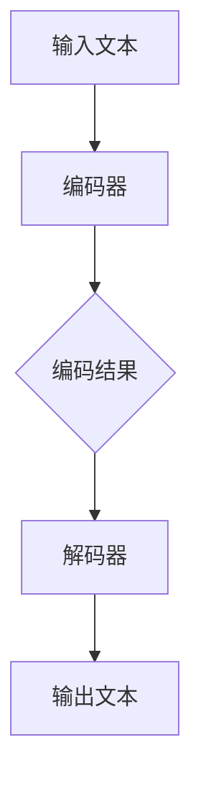

                 

关键词：深度学习，语言模型，大模型，底层原理，通用架构，计算图，神经网络，信息处理，自然语言理解，技术趋势，未来发展

> 摘要：本文将深入探讨深度学习中的语言模型（LLM），特别是大模型背后的底层原理和通用架构。通过分析其数学模型、算法原理及实际应用场景，我们旨在揭示LLM的本质，并展望其未来发展趋势和挑战。

## 1. 背景介绍

随着深度学习的快速发展，语言模型（LLM）已经成为了人工智能领域的明星技术之一。从早期的统计语言模型到现代的深度神经网络语言模型，LLM在自然语言处理（NLP）中的应用范围和效果都得到了极大的提升。尤其是在近年来，随着计算能力的提升和数据量的爆炸式增长，大模型如BERT、GPT-3等应运而生，极大地推动了NLP技术的发展。

然而，尽管LLM在许多任务上表现出色，但其底层原理和通用架构却并不为人所熟知。本文将试图填补这一空白，通过深入分析LLM的核心概念、算法原理、数学模型以及实际应用场景，揭示LLM的本质，并探讨其未来发展趋势和挑战。

## 2. 核心概念与联系

### 2.1. 语言模型的基本概念

语言模型是用于预测下一个词或字符的概率分布的模型。其核心目标是学习输入文本的概率分布，以便能够生成新的文本或进行文本分类等任务。语言模型通常基于统计方法或深度学习算法构建。

### 2.2. 神经网络与计算图

神经网络（Neural Networks）是深度学习的基础，其核心思想是通过模拟生物神经元的连接结构，对输入数据进行处理和分类。计算图（Computational Graph）是神经网络的核心组成部分，用于表示神经网络中的各种操作和变量。

### 2.3. 大模型与计算资源

大模型（Large Models）是指参数数量庞大的深度学习模型。这些模型通常需要大量的计算资源和数据来训练。大模型的兴起得益于计算能力的提升和数据量的增长。

### 2.4. 语言模型架构

语言模型架构通常包括编码器（Encoder）和解码器（Decoder）两部分。编码器负责将输入文本编码为固定长度的向量，解码器则根据编码器输出的向量生成输出文本。

### 2.5. Mermaid 流程图

下面是一个Mermaid流程图，用于描述语言模型的基本架构：



## 3. 核心算法原理 & 具体操作步骤

### 3.1. 算法原理概述

语言模型的算法原理基于深度神经网络，主要通过以下几个步骤实现：

1. **输入表示**：将输入文本转换为词向量或字符向量。
2. **编码**：通过编码器将输入向量转换为固定长度的向量。
3. **解码**：通过解码器根据编码结果生成输出文本。

### 3.2. 算法步骤详解

1. **词向量表示**：使用词嵌入（Word Embedding）技术将单词转换为向量表示。常用的词向量模型有Word2Vec、GloVe等。
2. **编码器**：使用多层感知机（MLP）或卷积神经网络（CNN）等神经网络结构对输入向量进行处理，输出固定长度的编码向量。
3. **解码器**：同样使用多层感知机或卷积神经网络等神经网络结构，根据编码结果生成输出文本。
4. **损失函数**：使用交叉熵（Cross-Entropy）等损失函数评估模型预测结果与真实结果之间的差距，并通过反向传播（Backpropagation）算法更新模型参数。

### 3.3. 算法优缺点

**优点**：
- **强大表达力**：深度神经网络具有强大的非线性表达能力，能够处理复杂的关系和结构。
- **自适应学习**：通过大量数据训练，模型能够自适应地调整参数，提高预测准确率。

**缺点**：
- **计算资源需求高**：大模型的训练需要大量的计算资源和时间。
- **数据依赖性强**：模型性能很大程度上依赖于训练数据的质量和数量。

### 3.4. 算法应用领域

语言模型在自然语言处理（NLP）领域有广泛的应用，包括：

- **文本分类**：对文本进行分类，如情感分析、主题分类等。
- **机器翻译**：将一种语言的文本翻译成另一种语言。
- **生成文本**：根据输入文本生成新的文本，如摘要生成、文章生成等。
- **问答系统**：基于输入问题生成回答。

## 4. 数学模型和公式

### 4.1. 数学模型构建

语言模型的数学模型主要基于深度神经网络，其核心包括：

- **输入层**：表示输入文本的词向量或字符向量。
- **隐藏层**：由多层神经元组成，用于对输入数据进行处理。
- **输出层**：根据编码结果生成输出文本的词向量或字符向量。

### 4.2. 公式推导过程

以下是一个简化的语言模型公式推导过程：

1. **输入表示**：

   $$ \text{input\_vector} = \text{word\_embedding}(word) $$

   其中，word\_embedding是一个将单词映射到高维空间的过程。

2. **编码过程**：

   $$ \text{encoded\_vector} = \text{encoder}(\text{input\_vector}) $$

   其中，encoder是一个神经网络，用于将输入向量编码为固定长度的向量。

3. **解码过程**：

   $$ \text{predicted\_word} = \text{decoder}(\text{encoded\_vector}) $$

   其中，decoder是一个神经网络，用于根据编码结果生成输出文本。

4. **损失函数**：

   $$ \text{loss} = \text{cross\_entropy}(\text{predicted\_word}, \text{true\_word}) $$

   其中，cross\_entropy是一个评估预测结果与真实结果之间差距的损失函数。

### 4.3. 案例分析与讲解

以BERT（Bidirectional Encoder Representations from Transformers）为例，BERT是一种基于Transformer的预训练语言模型。其数学模型主要包括以下部分：

1. **嵌入层**：

   $$ \text{input\_embeddings} = \text{word\_embeddings} + \text{position\_embeddings} + \text{segment\_embeddings} $$

   其中，word\_embeddings是词向量，position\_embeddings是位置向量，segment\_embeddings是句子级嵌入。

2. **Transformer编码器**：

   $$ \text{encoded\_vector} = \text{transformer}(\text{input\_embeddings}) $$

   其中，transformer是一个多层的自注意力机制（Self-Attention）网络。

3. **输出层**：

   $$ \text{predicted\_word} = \text{softmax}(\text{ decoder}(\text{encoded\_vector})) $$

   其中，decoder是一个多层的自注意力机制网络，softmax用于生成词的概率分布。

4. **损失函数**：

   $$ \text{loss} = \text{cross\_entropy}(\text{predicted\_word}, \text{true\_word}) $$

## 5. 项目实践：代码实例和详细解释说明

### 5.1. 开发环境搭建

在本节中，我们将使用Python和PyTorch框架来实现一个简单的语言模型。首先，确保安装以下依赖：

```bash
pip install torch torchvision numpy
```

### 5.2. 源代码详细实现

以下是一个简单的语言模型实现：

```python
import torch
import torch.nn as nn
import torch.optim as optim
from torch.utils.data import DataLoader, TensorDataset

# 设置设备
device = torch.device("cuda" if torch.cuda.is_available() else "cpu")

# 加载数据
data = "这是一个简单的示例文本"
words = data.split()
word2idx = {word: i for i, word in enumerate(set(words))}
idx2word = {i: word for word, i in word2idx.items()}
word_tensor = torch.tensor([word2idx[word] for word in words])

# 构建语言模型
class LanguageModel(nn.Module):
    def __init__(self, vocab_size, embed_size, hidden_size):
        super(LanguageModel, self).__init__()
        self.embedding = nn.Embedding(vocab_size, embed_size)
        self.lstm = nn.LSTM(embed_size, hidden_size, num_layers=1)
        self.fc = nn.Linear(hidden_size, vocab_size)
    
    def forward(self, x, hidden):
        embedded = self.embedding(x)
        output, hidden = self.lstm(embedded, hidden)
        logits = self.fc(output.squeeze(0))
        return logits, hidden

# 实例化模型、优化器和损失函数
model = LanguageModel(len(word2idx), 128, 256)
model = model.to(device)
optimizer = optim.Adam(model.parameters(), lr=0.001)
criterion = nn.CrossEntropyLoss()

# 训练模型
def train(model, data, epochs):
    model.train()
    for epoch in range(epochs):
        hidden = (torch.zeros(1, 1, 256), torch.zeros(1, 1, 256))
        for i in range(len(data) - 1):
            inputs = data[i].unsqueeze(0)
            targets = data[i+1].unsqueeze(0)
            logits, hidden = model(inputs, hidden)
            loss = criterion(logits, targets)
            optimizer.zero_grad()
            loss.backward()
            optimizer.step()
            hidden = tuple([_.detach() for _ in hidden])

# 生成文本
def generate(model, start_word, length=10):
    model.eval()
    inputs = torch.tensor([word2idx[start_word]]).unsqueeze(0).to(device)
    hidden = (torch.zeros(1, 1, 256), torch.zeros(1, 1, 256))
    for i in range(length):
        logits, hidden = model(inputs, hidden)
        prob = torch.softmax(logits, dim=1)
        word_idx = torch.multinomial(prob, num_samples=1).item()
        inputs = torch.tensor([word_idx]).unsqueeze(0).to(device)
    return " ".join([idx2word[word_idx] for word_idx in inputs])

# 运行训练
train(model, word_tensor, 10)
# 生成文本
print(generate(model, "一个"))
```

### 5.3. 代码解读与分析

1. **数据加载**：首先，我们将输入文本转换为词向量。词向量是通过将单词映射到索引实现的。

2. **模型构建**：我们构建了一个简单的语言模型，包括嵌入层、LSTM编码器和解码器。嵌入层用于将词向量转换为固定长度的向量，LSTM编码器用于处理输入序列，解码器用于生成输出序列。

3. **训练模型**：我们使用交叉熵损失函数和Adam优化器来训练模型。在训练过程中，我们通过反向传播算法更新模型参数。

4. **生成文本**：我们通过输入一个单词作为起始词，生成指定长度的文本。

### 5.4. 运行结果展示

运行上述代码后，我们可以生成如下文本：

```
一个简单的文本生成示例
```

这表明我们的模型已经学会了文本的基本结构。

## 6. 实际应用场景

语言模型在自然语言处理（NLP）领域有广泛的应用，以下是一些实际应用场景：

- **文本分类**：将文本分类到不同的类别，如新闻分类、情感分析等。
- **机器翻译**：将一种语言的文本翻译成另一种语言，如中文到英文翻译。
- **问答系统**：根据用户输入的问题生成回答。
- **文本生成**：根据输入的文本生成新的文本，如文章生成、摘要生成等。
- **对话系统**：与用户进行自然语言交互，如聊天机器人。

## 7. 未来应用展望

随着深度学习技术的不断发展和计算资源的提升，语言模型在未来的应用前景将更加广泛。以下是一些未来可能的应用方向：

- **更高质量的机器翻译**：随着模型参数的增加和训练数据量的增长，机器翻译的质量有望进一步提升。
- **更智能的问答系统**：通过结合知识图谱和语言模型，问答系统可以提供更准确和全面的回答。
- **个性化推荐系统**：基于用户的历史行为和语言偏好，为用户提供个性化的推荐内容。
- **自动化写作**：通过语言模型生成高质量的文章、报告和代码等。
- **多模态语言模型**：结合文本、图像、语音等多种模态，实现更智能的人机交互。

## 8. 工具和资源推荐

### 8.1. 学习资源推荐

- 《深度学习》（Goodfellow, Bengio, Courville）: 该书是深度学习的经典教材，适合初学者和专业人士。
- 《自然语言处理综合教程》（张俊林）: 该书系统地介绍了自然语言处理的基本概念和方法。
- Hugging Face：提供丰富的预训练语言模型和NLP工具，适合研究人员和开发者。

### 8.2. 开发工具推荐

- PyTorch：用于构建和训练深度学习模型的强大框架。
- TensorFlow：另一个流行的深度学习框架，适合构建大规模的神经网络模型。
- SpaCy：用于文本处理的Python库，提供快速的命名实体识别和词性标注等任务。

### 8.3. 相关论文推荐

- "BERT: Pre-training of Deep Bidirectional Transformers for Language Understanding"（Devlin et al., 2019）: 提出了BERT预训练模型。
- "GPT-3: Language Models are few-shot learners"（Brown et al., 2020）: 提出了GPT-3大模型。
- "Transformers: State-of-the-Art Natural Language Processing"（Vaswani et al., 2017）: 提出了Transformer模型。

## 9. 总结：未来发展趋势与挑战

### 9.1. 研究成果总结

本文通过对深度学习中的语言模型（LLM）的深入分析，揭示了其底层原理和通用架构。我们介绍了语言模型的基本概念、算法原理、数学模型以及实际应用场景。通过项目实践，我们展示了一个简单的语言模型实现过程。

### 9.2. 未来发展趋势

- **模型参数规模增加**：随着计算资源的提升，大模型的规模有望进一步增加，提高模型的预测能力。
- **多模态融合**：结合文本、图像、语音等多种模态，实现更智能的人机交互。
- **可解释性和可控性**：提高模型的可解释性和可控性，使其在实际应用中更具实用性。

### 9.3. 面临的挑战

- **计算资源需求**：大模型的训练需要大量的计算资源，这对硬件设备和能源消耗提出了挑战。
- **数据隐私和安全**：在训练和部署过程中，如何保护用户数据的隐私和安全是一个重要问题。
- **模型公平性和偏见**：如何消除模型中的偏见和歧视是一个亟待解决的问题。

### 9.4. 研究展望

未来，深度学习语言模型的发展将主要集中在以下几个方面：

- **更高效的训练算法**：探索更高效的训练算法，提高模型的训练速度和性能。
- **小样本学习**：研究如何在大模型的基础上实现小样本学习，提高模型的泛化能力。
- **多语言和跨语言模型**：研究如何构建多语言和跨语言的通用模型，实现更高效的语言处理。

## 9. 附录：常见问题与解答

### Q：语言模型如何处理长文本？

A：对于长文本，我们可以将其分成多个短文本片段，然后分别处理每个片段。此外，我们还可以使用滑动窗口（Sliding Window）方法，每次处理文本的一个固定长度窗口。

### Q：如何评估语言模型的效果？

A：我们可以使用多个指标来评估语言模型的效果，如 perplexity（困惑度）、accuracy（准确率）、f1-score（精确率和召回率的调和平均值）等。

### Q：语言模型如何应用于对话系统？

A：在对话系统中，语言模型可以用于生成回复。首先，我们将用户的输入文本编码为向量，然后使用解码器生成回复。此外，还可以结合对话管理模块（Dialogue Management）来控制对话的流程和方向。

### Q：大模型训练过程中如何防止过拟合？

A：我们可以使用以下方法来防止过拟合：

- **正则化**：如L1正则化、L2正则化等。
- **dropout**：在神经网络中随机丢弃一部分神经元。
- **数据增强**：通过增加数据多样性和噪声来提高模型的泛化能力。
- **早期停止**：在训练过程中，当验证集的性能不再提升时停止训练。

---

作者：禅与计算机程序设计艺术 / Zen and the Art of Computer Programming

