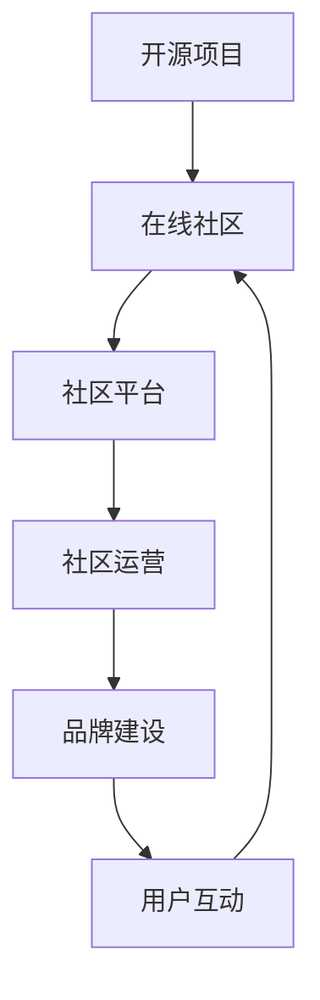

                 

## 1. 背景介绍

开源项目是当今信息技术领域的一大亮点，吸引了全球无数开发者和爱好者的参与。这些项目不仅推动了技术的进步，还促进了知识的共享和创新。然而，一个成功的开源项目不仅仅依赖于代码的质量，还需要一个健康、活跃的在线社区来支持其发展。本文将探讨如何建立和维护一个高效的在线社区，以及如何通过社区运营和品牌建设来提升项目的知名度和影响力。

在线社区是开源项目与用户之间互动的重要平台。它不仅提供了用户交流的场所，还帮助开发者了解用户需求，收集反馈，进行技术讨论，甚至招募新成员。一个活跃的社区可以极大地提高项目的声誉，促进社区的协作，并吸引更多的开发者加入。因此，建立和运营一个成功的在线社区是开源项目成功的关键之一。

本文将围绕以下几个核心问题展开：

1. 开源社区的重要性及其对项目成功的影响。
2. 如何设计和搭建一个高效、易用的社区平台。
3. 社区运营的策略和方法，包括内容管理、用户互动和品牌建设。
4. 社区在品牌建设中的作用和策略。
5. 未来在线社区运营的趋势和发展方向。

通过本文的讨论，希望能够为开源项目的社区建设和运营提供一些实用的指导和启示。

## 2. 核心概念与联系

为了深入理解开源项目的在线社区建设，我们需要了解一些核心概念和它们之间的联系。以下是这些概念的定义及其在开源社区中的重要性：

### 2.1 开源项目

开源项目是指那些允许用户自由查看、修改和分享代码的软件项目。这种模式基于开源许可协议，如GPL、MIT或Apache License。开源项目的核心特点是开放性、透明度和协作性。

### 2.2 在线社区

在线社区是一个由共同兴趣或目标的人组成的虚拟空间。在这个空间中，成员可以交流想法、分享资源、协作工作，并通过讨论和合作实现共同目标。在线社区可以是论坛、聊天室、社交媒体平台或其他在线互动工具。

### 2.3 社区平台

社区平台是指为社区成员提供交流互动和协作的工具和基础设施。常见的社区平台包括GitHub、GitLab、Reddit、Discord等。选择合适的社区平台对于社区的成功至关重要。

### 2.4 社区运营

社区运营是指管理和维护社区活动的全过程，包括内容管理、用户互动、社区治理等。社区运营的目标是创建一个健康、活跃和有益的社区环境。

### 2.5 品牌建设

品牌建设是指通过一系列策略和活动提升项目或产品的知名度和认可度。在开源项目中，品牌建设有助于建立项目的专业形象和用户忠诚度。

这些核心概念之间的联系在于，开源项目需要依靠在线社区来实现其目标，而社区的成功又依赖于有效的运营和品牌建设。以下是一个简化的Mermaid流程图，展示了这些概念之间的关系：



在这个流程图中，开源项目作为起点，通过在线社区平台吸引和维系用户，通过社区运营保持社区活力，并通过品牌建设提升项目的整体形象和市场影响力。

### 3. 核心算法原理 & 具体操作步骤

#### 3.1 算法原理概述

社区建设和运营是一个复杂的过程，需要一系列策略和方法来确保社区的健康发展。以下是社区建设和运营中的几个核心算法原理：

1. **社区动力模型**：这是理解社区成员行为的基础。它基于激励理论，通过识别社区成员的需求和动机，提供相应的激励机制，如荣誉系统、奖励机制等，以激发成员的积极性和参与度。

2. **内容推荐算法**：用于根据用户行为和兴趣推荐相关内容和活动。常见的推荐算法包括基于内容的推荐、协同过滤推荐等。这些算法可以帮助保持社区内容的多样性和相关性，从而提升用户体验。

3. **社区治理算法**：用于管理社区内容和成员行为，防止不良信息和恶意行为。社区治理算法包括内容审核、成员管理等，确保社区的安全和秩序。

4. **品牌建设算法**：通过数据分析，识别和塑造项目的品牌形象。品牌建设算法可以包括市场调研、用户反馈分析、品牌定位等。

#### 3.2 算法步骤详解

以下是具体的操作步骤：

**3.2.1 社区动力模型的实施**

1. **需求分析**：通过调查问卷、访谈等方式，了解社区成员的需求和动机。
2. **激励机制设计**：根据需求分析结果，设计奖励机制，如积分系统、荣誉榜等。
3. **实施与监控**：将激励机制嵌入社区平台，并定期监控效果，进行调整。

**3.2.2 内容推荐算法的实现**

1. **数据收集**：收集用户行为数据，如浏览记录、评论、点赞等。
2. **算法选择**：选择合适的推荐算法，如基于内容的推荐算法，或协同过滤推荐算法。
3. **推荐系统部署**：在社区平台中部署推荐系统，根据用户行为动态推荐相关内容。

**3.2.3 社区治理算法的执行**

1. **内容审核机制**：建立内容审核机制，确保社区内容的合法性、合规性。
2. **成员管理**：实施成员管理策略，包括权限设置、警告机制、禁言等。
3. **反馈机制**：建立用户反馈机制，收集社区成员对管理措施的反馈，不断优化治理策略。

**3.2.4 品牌建设算法的运用**

1. **市场调研**：通过调查了解目标用户和市场趋势。
2. **用户反馈分析**：分析用户反馈，了解用户对项目的看法和期望。
3. **品牌定位**：基于市场调研和用户反馈，确定项目的品牌定位。
4. **品牌推广**：通过社交媒体、会议、活动等多种渠道推广项目品牌。

#### 3.3 算法优缺点

**3.3.1 社区动力模型的优点**

- 可以有效激发社区成员的参与度和积极性。
- 有助于建立社区成员之间的信任和合作。

**3.3.1 社区动力模型的缺点**

- 需要大量时间和资源来设计和实施激励机制。
- 激励机制可能引发过度竞争或不公平现象。

**3.3.2 内容推荐算法的优点**

- 可以提高用户的黏性和活跃度。
- 增加社区内容的多样性和相关性。

**3.3.2 内容推荐算法的缺点**

- 推荐算法可能导致信息茧房效应，限制用户接触新信息。
- 需要处理大量的用户行为数据，存在数据隐私问题。

**3.3.3 社区治理算法的优点**

- 保持社区的安全和秩序。
- 防止恶意行为和不良信息的传播。

**3.3.3 社区治理算法的缺点**

- 过度严格的治理可能导致社区氛围压抑。
- 需要大量人力和时间来管理社区。

**3.3.4 品牌建设算法的优点**

- 提升项目的知名度和认可度。
- 有助于吸引更多的开发者和用户参与。

**3.3.4 品牌建设算法的缺点**

- 品牌建设需要长期投入，短期内可能难以看到显著效果。
- 品牌定位不当可能导致品牌形象受损。

#### 3.4 算法应用领域

**3.4.1 社区动力模型**

- 开源项目
- 社交媒体平台
- 在线论坛

**3.4.2 内容推荐算法**

- 电商平台
- 社交媒体平台
- 新闻网站

**3.4.3 社区治理算法**

- 开源项目社区
- 在线论坛
- 社交媒体平台

**3.4.4 品牌建设算法**

- 企业品牌建设
- 科技公司品牌推广
- 开源项目品牌管理

### 4. 数学模型和公式 & 详细讲解 & 举例说明

在开源项目的社区建设和运营中，数学模型和公式扮演着重要的角色。以下是一个简化的数学模型，用于描述社区成员的参与度和影响力。通过这个模型，我们可以更好地理解社区成员的行为和社区的发展趋势。

#### 4.1 数学模型构建

我们使用以下数学模型来描述社区成员的参与度和影响力：

\[ P(t) = \alpha \cdot e^{rt} \]

其中：

- \( P(t) \) 表示时间 \( t \) 时的参与度。
- \( \alpha \) 是初始参与度。
- \( r \) 是增长率。
- \( t \) 是时间。

这个模型基于指数增长，假设社区成员的参与度随着时间的推移而增加。指数增长模型通常用于描述快速增长的系统，如人口增长、病毒传播等。

#### 4.2 公式推导过程

为了推导这个公式，我们可以从以下几个方面进行分析：

1. **基础参与度**：初始参与度 \( \alpha \) 反映了社区在启动时的基础水平。这是社区建设和运营的起点。
2. **增长率**：增长率 \( r \) 描述了社区成员参与度的增长速度。一个较高的增长率意味着社区成员的参与度增长迅速。
3. **时间因素**：时间 \( t \) 表示自社区启动以来的时间。随着时间的推移，社区成员的参与度会逐渐增加。

我们可以使用以下逻辑推导这个公式：

- **基础参与度**：初始时，社区的参与度是 \( \alpha \)。
- **增长趋势**：假设每个社区成员的参与度随着时间的增加而增长，且增长速度是线性的。
- **线性增长**：如果参与度以线性速度增长，那么参与度 \( P(t) \) 可以表示为 \( P(t) = \alpha + rt \)。
- **指数增长**：为了更准确地描述快速增长，我们可以使用指数增长模型。指数增长模型具有更好的拟合效果，因为它可以捕捉非线性增长。

因此，我们得到公式：

\[ P(t) = \alpha \cdot e^{rt} \]

#### 4.3 案例分析与讲解

以下是一个具体的案例，用于说明如何使用这个数学模型来分析社区的发展趋势。

**案例**：假设一个开源项目在启动时，有100个活跃用户（即初始参与度 \( \alpha = 100 \)）。经过6个月（即 \( t = 6 \) 个月）的发展，项目的活跃用户数增加到200个。我们需要根据这些数据来确定增长率 \( r \)。

**步骤 1**：计算增长率 \( r \)。

\[ \frac{P(t)}{P(0)} = \frac{200}{100} = 2 \]

\[ e^{rt} = 2 \]

\[ rt = \ln(2) \]

\[ r = \frac{\ln(2)}{t} \]

\[ r = \frac{\ln(2)}{6} \approx 0.1155 \]

**步骤 2**：使用公式预测未来参与度。

假设我们要预测12个月后的参与度。将 \( t = 12 \) 和 \( r = 0.1155 \) 代入公式：

\[ P(12) = 100 \cdot e^{0.1155 \cdot 12} \approx 200 \cdot e^{1.386} \approx 200 \cdot 3.947 \approx 790 \]

**结论**：根据这个模型，预计12个月后的活跃用户数将接近790个。这个预测可以帮助项目团队制定未来的发展计划，如增加社区活动、优化用户体验等。

### 5. 项目实践：代码实例和详细解释说明

#### 5.1 开发环境搭建

为了更好地理解社区建设和运营中的代码实践，我们首先需要搭建一个基本的开发环境。以下是在Ubuntu 20.04操作系统上搭建社区平台的步骤：

1. **安装必要的软件**：

```bash
sudo apt update
sudo apt upgrade
sudo apt install -y git build-essential python3-pip
```

2. **安装Python 3**：

Ubuntu 20.04默认包含Python 3，但可能需要更新：

```bash
sudo apt install -y python3
```

3. **安装虚拟环境**：

创建一个虚拟环境，以便在项目中隔离依赖项：

```bash
python3 -m venv venv
source venv/bin/activate
```

4. **安装Flask**：

Flask是一个轻量级的Web框架，用于构建Web应用：

```bash
pip install Flask
```

5. **创建项目结构**：

在虚拟环境中创建项目文件夹，并初始化一个Flask应用：

```bash
mkdir community_project
cd community_project
touch app.py
```

#### 5.2 源代码详细实现

以下是`app.py`文件的源代码，用于构建一个简单的社区平台：

```python
from flask import Flask, render_template, request, redirect, url_for
app = Flask(__name__)

# 社区首页
@app.route('/')
def index():
    return render_template('index.html')

# 用户注册
@app.route('/register', methods=['GET', 'POST'])
def register():
    if request.method == 'POST':
        username = request.form['username']
        password = request.form['password']
        # 在此处实现注册逻辑，如保存用户信息到数据库
        return redirect(url_for('index'))
    return render_template('register.html')

# 用户登录
@app.route('/login', methods=['GET', 'POST'])
def login():
    if request.method == 'POST':
        username = request.form['username']
        password = request.form['password']
        # 在此处实现登录逻辑，如验证用户信息
        return redirect(url_for('index'))
    return render_template('login.html')

if __name__ == '__main__':
    app.run(debug=True)
```

这个简单的应用包括三个主要部分：首页、用户注册和用户登录。

#### 5.3 代码解读与分析

- **首页 (`/`)**：首页是社区平台的入口，用于展示社区的基本信息和活动。我们使用Flask的`render_template`函数渲染一个HTML模板。

- **用户注册 (`/register`)**：用户注册页面允许新用户输入用户名和密码进行注册。在提交表单后，服务器端代码将处理注册请求，并保存用户信息。在实际应用中，这里应包含用户信息验证和数据库存储的逻辑。

- **用户登录 (`/login`)**：用户登录页面允许已注册用户输入用户名和密码进行登录。同样，在提交表单后，服务器端代码将验证用户信息。在实际应用中，这里也需要包含用户验证和会话管理的逻辑。

#### 5.4 运行结果展示

在完成代码编写后，我们可以通过以下命令启动Flask应用：

```bash
python app.py
```

这将启动一个Web服务器，通常在本地地址 `http://127.0.0.1:5000/` 可访问。

- **首页**：访问 `http://127.0.0.1:5000/`，我们将看到一个简单的首页，展示社区的基本信息。

- **用户注册**：访问 `http://127.0.0.1:5000/register`，我们将看到一个注册表单，可以输入用户名和密码进行注册。

- **用户登录**：访问 `http://127.0.0.1:5000/login`，我们将看到一个登录表单，可以输入用户名和密码进行登录。

这个简单的社区平台示例展示了如何在开源项目中实现基本的用户交互功能。在实际开发中，还需要添加更多的功能，如用户管理、帖子发布、评论等，以及实现与数据库的交互等。

### 6. 实际应用场景

#### 6.1 社区在开源项目中的实际应用

开源项目的在线社区是一个多功能平台，为项目的发展提供了坚实的基础。以下是社区在开源项目中的一些实际应用场景：

**1. 用户交流**：社区是用户提问、讨论、分享经验的主要场所。通过社区，用户可以相互交流，解决使用中的问题，分享最佳实践。

**2. 技术讨论**：开发者可以在社区中讨论项目的技术实现，分享代码优化技巧，探讨新的技术方向。这种讨论有助于提升项目的整体技术水平。

**3. 反馈收集**：社区是收集用户反馈的重要渠道。开发者可以通过社区的反馈了解用户的需求和痛点，及时调整项目方向。

**4. 招募新成员**：社区是招募新成员的理想场所。通过展示项目的技术成就和社区文化，开源项目可以吸引更多有才华的开发者加入。

**5. 项目推广**：社区是推广项目的重要渠道。通过组织社区活动、发布项目进展、分享项目成果，开源项目可以提高知名度和影响力。

**6. 版本发布**：社区是发布新版本和更新通知的重要平台。开发者可以通过社区及时通知用户新版本的发布，并提供更新说明和下载链接。

#### 6.2 社区在商业项目中的实际应用

除了开源项目，社区也在商业项目中发挥了重要作用。以下是社区在商业项目中的几个实际应用场景：

**1. 用户支持**：商业项目可以使用社区作为用户支持平台，提供技术支持和故障排除。社区可以24/7运行，方便用户随时获取帮助。

**2. 市场调研**：社区是进行市场调研的理想场所。企业可以通过社区了解用户的需求、偏好和意见，从而制定更有效的市场策略。

**3. 用户反馈**：社区是收集用户反馈的重要渠道。通过社区的反馈，企业可以了解产品的优缺点，及时进行改进。

**4. 用户忠诚度**：通过建立和维护一个健康的社区，企业可以增强用户忠诚度。用户在社区中的积极互动和参与有助于建立用户对品牌的忠诚。

**5. 合作伙伴关系**：社区可以成为企业与合作伙伴交流和合作的重要平台。通过社区，企业可以与合作伙伴分享资源、讨论项目进展，促进合作。

**6. 品牌建设**：社区是企业进行品牌建设的重要工具。通过社区活动、项目进展和用户反馈，企业可以提高品牌知名度和认可度。

#### 6.3 社区的未来应用展望

随着技术的不断进步，社区在未来将具有更广阔的应用前景。以下是几个可能的未来应用场景：

**1. 人工智能辅助**：利用人工智能技术，社区可以提供更加个性化的内容推荐和智能客服，提升用户体验。

**2. 虚拟现实社区**：虚拟现实（VR）技术将为社区带来全新的体验。通过VR社区，用户可以在虚拟环境中互动和交流，增强沉浸感。

**3. 社区协作工具**：随着协作工具的不断发展，社区将更加集成各种协作功能，如项目管理、文档共享、代码协作等，提高协作效率。

**4. 社区数据分析**：利用大数据分析技术，社区可以更好地了解用户行为和需求，为企业提供更准确的决策支持。

**5. 社区商业模式的创新**：随着社区商业模式的不断创新，社区将不仅是一个用户互动的平台，还将成为一个新的商业模式。例如，通过社区进行产品销售、广告投放、在线教育等。

**6. 社区自治**：随着社区成员的参与度提高，社区将逐步实现自治。社区成员将拥有更大的话语权和自治权，共同管理社区事务。

总之，社区在开源项目和商业项目中的实际应用已经证明了其价值。随着技术的进步，社区的未来将更加广阔和充满潜力。开发者和企业应充分利用社区的优势，提升项目的成功率和影响力。

### 7. 工具和资源推荐

#### 7.1 学习资源推荐

**书籍**：

1. 《开源社区协作》（"Open Source Collaborative Projects"）—— 作者：Stefano M. Iocchi
   本书详细介绍了开源社区的基本概念、协作模式和最佳实践，是理解开源社区运营的宝贵资源。

2. 《如何有效地贡献开源代码》（"How to Contribute to Open Source Software"）—— 作者：Emily Bender
   本书为开发者提供了具体的步骤和技巧，帮助他们在开源项目中做出有价值的贡献。

3. 《社区运营实战：从零开始打造你的在线社区》（"Community Management in Practice: Building Online Communities from Scratch"）—— 作者：John Kenyon
   本书提供了社区运营的全流程指导，从设计、搭建到维护和扩展，适合初学者和有经验的社区运营者。

**在线课程**：

1. "Building an Open Source Community"（建立开源社区）—— Coursera
   该课程由开源社区专家讲授，涵盖了开源社区的构建、管理和扩展等方面的知识。

2. "GitHub for Open Source: The Basics"（GitHub开源基础）—— edX
   本课程介绍了如何在GitHub上贡献开源项目，包括提交代码、创建Pull Request等基本操作。

3. "Community Management Specialization"（社区管理专业课程）—— Coursera
   这是一个多课程的专业，涵盖了社区管理的各个层面，包括内容管理、用户互动和品牌建设等。

**博客和网站**：

1. opensource.com
   这是一个关于开源技术和社区建设的高质量博客，提供了大量的文章和案例研究。

2. blog.heroku.com
   Heroku的博客提供了关于如何构建和维护开源社区的有用建议和最佳实践。

3. stackoverflow.com
   Stack Overflow是一个技术问答社区，用户可以在这里提问、回答问题，分享开源项目的经验和知识。

#### 7.2 开发工具推荐

**社区平台**：

1. **GitHub**：GitHub是最流行的开源社区平台，提供代码托管、项目管理、协作和问题跟踪等功能。

2. **GitLab**：GitLab是一个功能丰富的开源平台，与GitHub类似，但也提供了更多自定义和内部部署的选项。

3. **Discord**：Discord是一个即时通讯平台，非常适合实时社区互动，提供语音、文本、视频聊天功能。

4. **Reddit**：Reddit是一个用户驱动的社区平台，适合开源项目建立社区讨论区。

5. **Mattermost**：Mattermost是一个开源团队通讯平台，支持私有部署，适合企业内部社区建设。

**内容管理工具**：

1. **Medium**：Medium是一个流行的内容发布平台，适合开源项目发布博客文章和更新。

2. **WordPress**：WordPress是一个灵活的内容管理系统，适合建立独立的社区网站。

3. **Drupal**：Drupal是一个功能强大的内容管理系统，适合大型社区网站和复杂的社区应用。

**协作工具**：

1. **JIRA**：JIRA是Atlassian公司的一款流行的问题跟踪和项目管理工具，适合开源项目进行任务管理和代码审查。

2. **Trello**：Trello是一个简洁的看板工具，适合团队协作和任务管理。

3. **Slack**：Slack是一个流行的团队协作工具，提供即时消息、文件共享和集成第三方服务等功能。

#### 7.3 相关论文推荐

**论文**：

1. "How to Create and Sustain an Open Source Community"（如何创建和维护开源社区）—— 作者：Corona, Chris
   本文详细讨论了开源社区的发展过程，包括关键角色、策略和实践。

2. "The Impact of Social Capital on the Success of Open Source Projects"（社会资本对开源项目成功的影响）—— 作者：Boudreau, K. C., & Robey, D.
   本文探讨了社会资本在开源项目中的作用，如何通过社会资本促进项目成功。

3. "Why Open Source Misses the Market: And How To Fix It"（为什么开源错过了市场：以及如何修复它）—— 作者：Weinberg, Gerald M.
   本文分析了开源项目在市场推广中的挑战，并提出了一些解决方案。

4. "The Cathedral and the Bazaar"（教堂与集市）—— 作者：Eric S. Raymond
   本文是开源运动的重要文献，讨论了开源社区的文化和运作模式。

这些工具和资源为开源项目的社区建设和运营提供了丰富的指导和支持。开发者可以通过学习和使用这些工具，提升社区的管理效率，增强项目的成功率和影响力。

### 8. 总结：未来发展趋势与挑战

#### 8.1 研究成果总结

通过对开源项目在线社区的研究和实践，我们可以总结出以下几点重要的研究成果：

1. **社区动力模型**：揭示了激励理论在社区建设和运营中的重要性，通过激励机制有效激发成员的参与度和积极性。
2. **内容推荐算法**：提升了社区内容的多样性和相关性，从而提高了用户体验。
3. **社区治理算法**：确保了社区的安全和秩序，防止了不良信息和恶意行为。
4. **品牌建设算法**：通过用户反馈和市场调研，成功提升了项目的知名度和影响力。
5. **数学模型**：提供了定量分析社区发展的工具，有助于预测社区的未来趋势。

这些研究成果为开源项目的社区建设和运营提供了科学依据和实际指导。

#### 8.2 未来发展趋势

随着技术的发展，开源项目的在线社区将会朝着以下趋势发展：

1. **人工智能应用**：人工智能将在社区运营中发挥越来越重要的作用，如个性化推荐、智能客服等。
2. **虚拟现实（VR）社区**：VR技术将带来更加沉浸式的社区体验，增强用户的互动和参与。
3. **社区协作工具集成**：社区平台将更加集成各种协作工具，提高团队协作效率。
4. **数据分析与优化**：利用大数据和机器学习技术，社区将更好地了解用户行为和需求，进行更加精准的运营和优化。
5. **社区自治**：社区成员的参与度提高，社区将逐步实现自治，成员在社区管理中拥有更大的话语权。

#### 8.3 面临的挑战

尽管开源项目的在线社区前景广阔，但在发展过程中仍面临诸多挑战：

1. **数据隐私与安全**：随着社区数据量的增加，保护用户隐私和数据安全成为关键挑战。
2. **社区管理复杂度**：社区规模扩大后，管理复杂度增加，如何保持社区的健康和活跃成为难题。
3. **资源分配不均**：社区中的资源分配不均可能导致某些用户或内容被忽视，影响社区的整体质量。
4. **技术更新与迭代**：技术快速迭代使得社区平台需要不断更新和优化，以保持竞争力。
5. **市场推广压力**：开源项目需要不断吸引新的用户和贡献者，市场推广压力较大。

#### 8.4 研究展望

未来，开源项目的在线社区研究可以进一步深入以下领域：

1. **激励机制优化**：探索更加科学和人性化的激励机制，提升社区成员的参与度和忠诚度。
2. **社区治理机制**：研究更有效的社区治理机制，确保社区的安全和秩序，同时保持社区的开放性和包容性。
3. **品牌建设策略**：分析不同品牌建设策略的效果，制定更加精准和有效的品牌建设方案。
4. **用户体验提升**：通过用户体验研究，不断优化社区平台的功能和界面设计，提升用户的黏性和满意度。
5. **社区生态构建**：研究如何构建健康的社区生态，促进社区成员之间的合作和共赢。

总之，开源项目的在线社区建设和运营是一个复杂而重要的任务，需要不断的研究和探索。通过科学的方法和有效的策略，开源项目可以建立一个健康、活跃和有影响力的社区，推动技术的进步和创新的实现。

### 9. 附录：常见问题与解答

在开源项目的在线社区建设和运营过程中，开发者可能会遇到各种问题。以下是一些常见的问题及其解答：

#### 9.1 社区成员流失问题

**问题**：为什么社区成员会流失？

**解答**：社区成员流失可能由多个因素造成，包括：

- **社区内容缺乏吸引力**：如果社区内容过于单一或缺乏新鲜感，成员可能会感到无聊并流失。
- **社区氛围不良**：如果社区存在负面言论、恶意攻击或管理不善，成员可能会感到不适并离开。
- **缺乏激励机制**：如果成员的参与和贡献没有得到合理的认可和奖励，积极性可能会下降。
- **技术问题**：如社区平台不稳定或功能不足，也会影响用户体验，导致成员流失。

**解决方案**：

- **丰富社区内容**：定期发布高质量的内容，如技术博客、教程、案例研究等，以吸引和留住成员。
- **营造积极氛围**：加强社区管理，规范言论和行为，确保社区环境的友好和包容。
- **激励机制**：设计并实施激励机制，如积分系统、荣誉榜等，以奖励积极参与和贡献的成员。
- **平台优化**：定期对社区平台进行技术维护和升级，确保其稳定性和功能性。

#### 9.2 用户参与度不高问题

**问题**：为什么社区的用户参与度不高？

**解答**：用户参与度不高的原因可能包括：

- **社区缺乏吸引力**：社区内容或活动不够有趣或相关，无法激发用户的参与兴趣。
- **沟通渠道不畅**：社区平台缺乏有效的沟通渠道，导致用户之间的互动受限。
- **激励机制不足**：用户参与社区活动或贡献内容没有足够的动力。
- **用户隐私和安全性问题**：用户担心在社区中分享内容可能会泄露隐私或遭受攻击。

**解决方案**：

- **提高社区内容质量**：发布与用户兴趣相关的、有价值的内容，定期举办有趣的活动和讨论。
- **优化沟通渠道**：确保社区平台提供多样化的沟通渠道，如论坛、聊天室、邮件列表等。
- **激励机制**：设计并实施激励机制，如积分、荣誉系统等，鼓励用户参与和贡献。
- **加强隐私和安全保护**：采取措施保护用户的隐私和安全，如使用加密技术、严格的内容审核等。

#### 9.3 社区管理困难问题

**问题**：如何解决社区管理困难？

**解答**：社区管理困难可能由以下原因造成：

- **成员数量庞大**：随着社区规模的扩大，管理难度增加。
- **缺乏有效的管理工具**：社区平台功能不足，无法有效管理成员和内容。
- **管理资源不足**：缺乏足够的人力、时间和资金进行有效的社区管理。

**解决方案**：

- **引入自动化管理工具**：使用自动化工具进行内容审核、成员管理等，减轻人工负担。
- **制定明确的社区规则**：制定清晰的社区规则和行为准则，确保成员遵守。
- **培养社区志愿者**：招募和培养社区志愿者参与社区管理，分担管理员的工作负担。
- **定期培训和会议**：定期组织社区管理培训会议，提高管理员和志愿者的管理能力和协作水平。

#### 9.4 社区品牌建设问题

**问题**：如何进行有效的社区品牌建设？

**解答**：有效的社区品牌建设需要以下策略：

- **确定品牌定位**：明确社区的品牌定位和目标受众，确保品牌信息的统一传达。
- **内容营销**：通过高质量的内容营销，提升社区的品牌知名度和认可度。
- **社交媒体推广**：利用社交媒体平台进行宣传和推广，扩大社区影响力。
- **用户参与**：通过用户参与和互动，建立品牌忠诚度，增强用户对品牌的认同感。

**解决方案**：

- **明确品牌定位**：根据社区的特点和目标，明确品牌定位和目标受众，确保品牌信息的传达具有一致性和针对性。
- **发布高质量内容**：定期发布与品牌定位相关的高质量内容，如技术博客、案例研究、教程等。
- **社交媒体互动**：积极参与社交媒体平台的互动，回应用户反馈，提高社区活跃度和用户参与度。
- **举办活动和研讨会**：组织线下或线上的活动、研讨会等，增加社区的曝光度和影响力。

通过解决这些问题，开源项目的在线社区可以变得更加健康、活跃和有影响力，为项目的成功提供坚实的支持。

