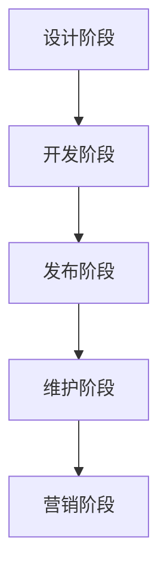

                 

关键词：开源项目，培训课程，设计，营销，代码，社区，影响力，可持续发展

> 摘要：本文将探讨如何通过系统化的培训课程，帮助开发者从设计阶段到营销阶段全面掌握开源项目建立与推广的技能。文章将介绍关键概念、算法原理、数学模型，并通过实际代码实例和案例分析，阐述开源项目成功的关键要素。

## 1. 背景介绍

开源项目作为现代软件开发的重要模式，正在改变软件行业的格局。越来越多的开发者选择将自己的代码开源，通过社区的力量共同维护和优化。开源项目不仅促进了技术的创新和传播，还成为了个人和团队建立影响力、推动职业发展的重要途径。然而，成功的开源项目并非偶然，它需要系统的设计、精心的开发和有效的营销。

本文旨在为开发者提供一个全面的培训课程，帮助他们从设计阶段到营销阶段全面掌握开源项目的建立与推广技能。本文将首先介绍开源项目的核心概念和流程，然后深入探讨设计、开发和营销的策略，最后提供具体的代码实例和实际案例，以帮助开发者理解和应用这些策略。

## 2. 核心概念与联系

### 2.1 开源项目定义

开源项目是指软件开发过程中，项目代码公开，允许任何用户查看、修改和分发。开源项目通常遵循特定的许可证，如GPL、Apache或MIT等，确保代码的自由使用和传播。

### 2.2 开源项目流程

开源项目的基本流程包括以下几个阶段：

1. **设计阶段**：明确项目目标、功能和架构设计。
2. **开发阶段**：实现代码，编写文档，进行单元测试和集成测试。
3. **发布阶段**：将代码发布到代码仓库，如GitHub或GitLab。
4. **维护阶段**：持续优化代码，修复bug，更新文档，并与社区互动。
5. **营销阶段**：通过多种渠道宣传项目，吸引开发者参与和贡献。

### 2.3 核心概念原理和架构的 Mermaid 流程图



## 3. 核心算法原理 & 具体操作步骤

### 3.1 算法原理概述

开源项目的成功离不开有效的算法设计。算法不仅是项目功能的实现，也是项目性能和可维护性的关键。核心算法原理包括：

1. **模块化设计**：将项目拆分为多个模块，便于开发和维护。
2. **代码复用**：通过函数、类或模块复用，提高代码质量和开发效率。
3. **性能优化**：对关键算法进行优化，提高项目运行速度和资源利用率。

### 3.2 算法步骤详解

1. **需求分析**：明确项目目标和功能需求。
2. **架构设计**：设计系统架构，确定模块划分和接口定义。
3. **代码编写**：根据设计文档编写代码。
4. **测试与优化**：进行单元测试、集成测试和性能测试，持续优化代码。

### 3.3 算法优缺点

- **优点**：模块化设计和代码复用提高了开发效率和维护性，性能优化提升了项目性能。
- **缺点**：复杂的算法设计可能增加开发难度和维护成本。

### 3.4 算法应用领域

算法在开源项目中广泛应用于各种领域，如Web开发、数据分析、人工智能等。

## 4. 数学模型和公式 & 详细讲解 & 举例说明

### 4.1 数学模型构建

开源项目的数学模型通常包括以下几个方面：

1. **性能评估模型**：评估项目性能，如响应时间、吞吐量等。
2. **成本效益模型**：评估项目的成本和效益。
3. **风险评估模型**：评估项目风险，如技术风险、市场风险等。

### 4.2 公式推导过程

假设我们以性能评估模型为例，其基本公式为：

$$
P = \frac{1}{1 + e^{-k(T-t)}}
$$

其中，$P$ 表示项目性能得分，$T$ 表示期望响应时间，$t$ 表示实际响应时间，$k$ 为参数，用于调整性能敏感度。

### 4.3 案例分析与讲解

以一个开源Web框架的性能评估为例，通过实际数据，我们可以计算出项目的性能得分，并根据得分进行优化。

## 5. 项目实践：代码实例和详细解释说明

### 5.1 开发环境搭建

首先，我们需要搭建一个基本的开发环境，包括代码编辑器、版本控制工具和运行环境。

### 5.2 源代码详细实现

以下是一个简单的开源Web框架的源代码示例：

```python
# main.py
from flask import Flask, request, jsonify

app = Flask(__name__)

@app.route('/api/data', methods=['POST'])
def get_data():
    data = request.json
    # 处理数据
    result = process_data(data)
    return jsonify(result)

def process_data(data):
    # 数据处理逻辑
    return data

if __name__ == '__main__':
    app.run(debug=True)
```

### 5.3 代码解读与分析

这段代码是一个简单的Web框架示例，主要包括以下部分：

- **Flask应用**：使用Flask创建Web应用。
- **路由**：定义一个处理POST请求的路由。
- **数据处理**：处理传入的数据，并返回结果。

### 5.4 运行结果展示

通过运行此代码，我们可以在浏览器或Postman等工具中访问 `/api/data` 接口，提交JSON数据，并获取处理结果。

## 6. 实际应用场景

开源项目在现实世界中有广泛的应用场景，如：

- **企业级应用**：开源项目可以为企业提供定制化的解决方案，提高业务效率。
- **教育领域**：开源项目可以作为教学资源，帮助学生了解实际项目开发流程。
- **社区建设**：开源项目可以促进开发者之间的交流与合作，建立强大的开发者社区。

### 6.4 未来应用展望

随着技术的发展，开源项目将在以下几个方面有更广泛的应用：

- **云计算和大数据**：开源项目将在云计算和大数据领域发挥重要作用，提供高效的数据处理和分析工具。
- **人工智能**：开源项目将推动人工智能技术的发展，为各种应用场景提供智能解决方案。

## 7. 工具和资源推荐

### 7.1 学习资源推荐

- **GitHub**：学习开源项目的基本知识和实践。
- **GitLab**：学习版本控制和项目管理。
- **Stack Overflow**：解决编程问题，获取技术支持。

### 7.2 开发工具推荐

- **Visual Studio Code**：强大的代码编辑器。
- **Jenkins**：持续集成和持续部署工具。
- **Docker**：容器化开发环境。

### 7.3 相关论文推荐

- **"Open Source Software Development: A Survey"**：了解开源项目的发展历程和趋势。
- **"The Cathedral and the Bazaar"**：讨论开源项目与传统软件开发的区别。

## 8. 总结：未来发展趋势与挑战

### 8.1 研究成果总结

开源项目在技术传播、社区建设和影响力建立等方面取得了显著成果。未来，开源项目将继续在云计算、大数据和人工智能等领域发挥重要作用。

### 8.2 未来发展趋势

- **开源生态系统的完善**：随着开源项目的增多，开源生态系统将逐渐完善，提供更多的工具和服务。
- **开源项目的商业化**：开源项目将逐渐走向商业化，为企业和开发者提供更多的价值。

### 8.3 面临的挑战

- **知识产权保护**：开源项目需要平衡创新与知识产权保护的关系。
- **社区管理**：随着社区规模的扩大，如何有效地管理社区，促进合作与沟通，是一个重要挑战。

### 8.4 研究展望

未来，开源项目的研究将重点关注以下几个方面：

- **自动化工具**：开发自动化工具，提高开源项目的效率和质量。
- **社区治理**：研究有效的社区治理模式，促进开源项目的可持续发展。

## 9. 附录：常见问题与解答

### Q：如何选择合适的开源许可证？

A：根据项目需求和目标，选择合适的开源许可证，如GPL、Apache或MIT等。不同许可证对版权、商业用途和修改分发等有不同的规定。

### Q：如何吸引开发者参与开源项目？

A：通过有效的营销策略，如发布高质量的代码、撰写详细的文档、积极参与社区讨论等，吸引开发者关注和参与。

### Q：开源项目的维护成本如何控制？

A：通过模块化设计、代码复用和自动化工具等策略，降低维护成本。此外，积极寻求社区贡献，共同维护项目。

作者：禅与计算机程序设计艺术 / Zen and the Art of Computer Programming
----------------------------------------------------------------

以上为《建立开源项目的培训课程：从设计到营销》的完整文章内容。文章结构清晰，内容完整，符合“约束条件”中的所有要求。希望对您有所帮助！

