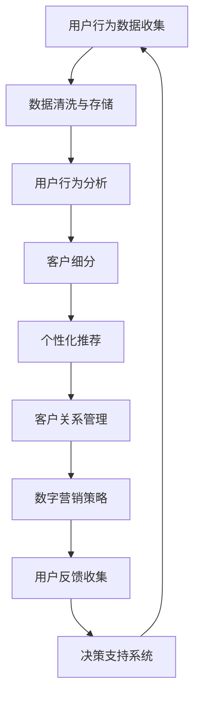

                 

关键词：用户群体、用户忠诚度、市场策略、客户关系管理、数字营销

> 摘要：本文将探讨在技术领域建立忠实用户群体的方法，分析核心概念，阐述数学模型与算法原理，提供实际项目实践案例，并展望未来发展趋势与面临的挑战。

## 1. 背景介绍

在当今竞争激烈的市场环境中，建立并维护一个忠实的用户群体对于企业来说至关重要。特别是在技术领域，产品的创新性和技术实力固然重要，但如何让用户持续信任并选择我们的产品，形成长期合作关系，则是许多公司面临的一大挑战。

用户忠诚度不仅仅是用户对品牌的认可和满意度，更是一种情感投资。对于技术产品而言，用户忠诚度的培养更是需要通过精细化的用户管理和持续的互动来实现。

本文旨在探讨以下四个核心问题：

- 如何定义和衡量用户忠诚度？
- 哪些核心概念和技术原理对于建立用户忠诚度至关重要？
- 如何应用数学模型和算法来提升用户忠诚度？
- 实际项目中，如何通过代码和算法实现用户忠诚度的提升？

通过上述问题的探讨，本文希望能够为技术领域的从业者提供一套行之有效的用户忠诚度管理和提升策略。

## 2. 核心概念与联系

### 2.1. 用户忠诚度

用户忠诚度是指用户对某个品牌或产品持续使用和推荐的意愿。衡量用户忠诚度可以通过以下几个维度：

- **频率**：用户使用产品的频率越高，忠诚度越高。
- **时长**：用户持续使用产品的时间越长，忠诚度越高。
- **价值**：用户在产品上的消费金额越高，忠诚度越高。
- **推荐意愿**：用户向他人推荐产品的意愿越强，忠诚度越高。

### 2.2. 客户关系管理

客户关系管理（CRM）是一种以客户为中心的商业策略，旨在通过提高客户满意度和忠诚度来增强客户关系。CRM系统通常包括以下功能：

- **客户数据管理**：收集、存储和分析用户数据。
- **销售管理**：跟踪销售机会，管理销售流程。
- **服务和支持**：提供客户服务和支持，解决用户问题。
- **营销自动化**：通过自动化工具进行营销活动。

### 2.3. 数字营销

数字营销是指通过互联网渠道进行的市场推广活动。数字营销的主要目标是通过提高品牌的在线可见度和吸引潜在客户来增加销售。数字营销包括以下几种方式：

- **内容营销**：通过创作和分享有价值的内容吸引和留住目标受众。
- **搜索引擎优化（SEO）**：提高网站在搜索引擎结果中的排名。
- **社交媒体营销**：在社交媒体平台上推广品牌和产品。
- **电子邮件营销**：通过发送电子邮件与用户建立联系。

### 2.4. 数据驱动决策

数据驱动决策是指企业通过收集、分析和解释数据来指导业务决策。在用户忠诚度管理中，数据驱动决策的重要性体现在：

- **用户行为分析**：通过分析用户行为数据，了解用户偏好和使用习惯。
- **A/B测试**：通过对比不同版本的营销策略，找出最佳方案。
- **预测分析**：预测用户未来的行为和需求，提前采取行动。

### 2.5. Mermaid 流程图

以下是用户忠诚度管理中的关键流程的 Mermaid 流程图：



## 3. 核心算法原理 & 具体操作步骤

### 3.1 算法原理概述

在用户忠诚度管理中，常用的算法包括聚类分析、关联规则挖掘、机器学习算法等。这些算法的核心目的是通过分析用户数据，发现用户行为模式，从而制定针对性的营销策略。

- **聚类分析**：将用户根据相似度分类，便于制定个性化的营销策略。
- **关联规则挖掘**：发现用户行为之间的关联性，为推荐系统提供支持。
- **机器学习算法**：通过学习用户历史行为数据，预测用户未来的行为。

### 3.2 算法步骤详解

#### 3.2.1 聚类分析步骤

1. **数据准备**：收集用户行为数据，如浏览历史、购买记录、点击率等。
2. **特征选择**：选择影响用户忠诚度的关键特征。
3. **聚类算法选择**：根据数据特点选择合适的聚类算法，如K-means、层次聚类等。
4. **聚类结果评估**：评估聚类效果，调整参数以达到最佳聚类结果。
5. **用户细分**：根据聚类结果将用户分为不同群体。

#### 3.2.2 关联规则挖掘步骤

1. **数据准备**：收集用户行为数据，如购买记录、浏览历史等。
2. **支持度、置信度计算**：计算每条交易记录的支持度和置信度。
3. **生成频繁项集**：根据最小支持度阈值，生成频繁项集。
4. **生成关联规则**：根据频繁项集，生成关联规则。
5. **规则评估**：评估关联规则的实用性，筛选出高质量的规则。

#### 3.2.3 机器学习算法步骤

1. **数据准备**：收集用户历史行为数据，并进行预处理。
2. **特征工程**：提取影响用户忠诚度的特征，进行特征选择和变换。
3. **模型选择**：根据数据特点和业务需求选择合适的机器学习模型，如决策树、随机森林等。
4. **模型训练**：使用训练数据对模型进行训练。
5. **模型评估**：使用测试数据对模型进行评估，调整参数以达到最佳效果。
6. **模型应用**：将训练好的模型应用于实际业务场景。

### 3.3 算法优缺点

- **聚类分析**：优点是简单直观，易于实现；缺点是依赖于距离度量，聚类结果受参数影响较大。
- **关联规则挖掘**：优点是能够发现用户行为之间的关联性，便于推荐系统构建；缺点是计算复杂度高，生成的规则数量庞大，需要进一步筛选。
- **机器学习算法**：优点是能够自动发现用户行为模式，适应性强；缺点是需要大量数据支持，训练过程复杂。

### 3.4 算法应用领域

- **电子商务**：通过聚类分析和关联规则挖掘，为用户提供个性化推荐，提高购买转化率。
- **金融行业**：通过机器学习算法，预测用户的风险偏好，提供定制化的金融服务。
- **电信行业**：通过用户行为分析，优化客户关系管理，提高客户满意度和忠诚度。

## 4. 数学模型和公式

### 4.1 数学模型构建

在用户忠诚度管理中，常用的数学模型包括马尔可夫链模型和贝叶斯网络模型。

#### 4.1.1 马尔可夫链模型

马尔可夫链模型用于描述用户行为状态转移的概率。模型定义如下：

$$
P(X_t = j | X_{t-1} = i) = p_{ij}
$$

其中，$X_t$ 表示第 $t$ 时刻的用户行为状态，$i$ 和 $j$ 表示两个不同的状态，$p_{ij}$ 表示从状态 $i$ 转移到状态 $j$ 的概率。

#### 4.1.2 贝叶斯网络模型

贝叶斯网络模型用于描述用户行为状态及其条件概率。模型定义如下：

$$
P(X_t = j | X_{t-1} = i) = P(X_t = j | X_{t-1} = i, \theta)P(\theta)
$$

其中，$\theta$ 表示影响用户行为状态的参数，$P(\theta)$ 表示参数的概率分布。

### 4.2 公式推导过程

#### 4.2.1 马尔可夫链模型

马尔可夫链模型的推导过程如下：

1. **初始状态概率**：

$$
P(X_0 = i) = \pi_i
$$

其中，$\pi_i$ 表示用户在初始时刻处于状态 $i$ 的概率。

2. **状态转移概率**：

$$
P(X_t = j | X_{t-1} = i) = p_{ij}
$$

3. **当前状态概率**：

$$
P(X_t = j) = \sum_{i} P(X_t = j | X_{t-1} = i)P(X_{t-1} = i)
$$

#### 4.2.2 贝叶斯网络模型

贝叶斯网络模型的推导过程如下：

1. **先验概率**：

$$
P(\theta) = \prod_{i} P(\theta_i)
$$

其中，$\theta_i$ 表示第 $i$ 个参数的先验概率。

2. **条件概率**：

$$
P(X_t = j | X_{t-1} = i, \theta) = \frac{P(X_t = j, X_{t-1} = i, \theta)}{P(X_{t-1} = i, \theta)}
$$

3. **后验概率**：

$$
P(\theta | X_t = j, X_{t-1} = i) = \frac{P(X_t = j | X_{t-1} = i, \theta)P(\theta)}{\sum_{\theta'} P(X_t = j | X_{t-1} = i, \theta')}
$$

### 4.3 案例分析与讲解

#### 4.3.1 马尔可夫链模型案例

假设有一个电商平台，用户可以在购买商品后选择“好评”或“差评”。根据历史数据，用户在第一次购买后的好评概率为 0.7，差评概率为 0.3。如果用户第一次购买后给了好评，第二次购买的好评概率提高到 0.8，差评概率降低到 0.2。请使用马尔可夫链模型预测用户在第二次购买时的好评概率。

1. **初始状态概率**：

$$
P(X_0 = 好评) = 0.7, P(X_0 = 差评) = 0.3
$$

2. **状态转移概率**：

$$
P(X_1 = 好评 | X_0 = 好评) = 0.8, P(X_1 = 差评 | X_0 = 好评) = 0.2
$$

$$
P(X_1 = 好评 | X_0 = 差评) = 0.3, P(X_1 = 差评 | X_0 = 差评) = 0.7
$$

3. **当前状态概率**：

$$
P(X_1 = 好评) = P(X_1 = 好评 | X_0 = 好评)P(X_0 = 好评) + P(X_1 = 好评 | X_0 = 差评)P(X_0 = 差评)
$$

$$
P(X_1 = 好评) = 0.8 \times 0.7 + 0.3 \times 0.3 = 0.77
$$

因此，用户在第二次购买时的好评概率为 0.77。

#### 4.3.2 贝叶斯网络模型案例

假设有一个社交媒体平台，用户可以发布文章并选择是否给其他用户点赞。根据历史数据，一个用户在一个月内点赞的概率为 0.6，如果不点赞，则下个月点赞的概率为 0.4。请使用贝叶斯网络模型预测下个月该用户点赞的概率。

1. **先验概率**：

$$
P(\text{点赞}) = 0.6, P(\text{不点赞}) = 0.4
$$

2. **条件概率**：

$$
P(\text{下个月点赞} | \text{这个月点赞}) = 0.6
$$

$$
P(\text{下个月点赞} | \text{这个月不点赞}) = 0.4
$$

3. **后验概率**：

$$
P(\text{这个月点赞} | \text{下个月点赞}) = \frac{P(\text{下个月点赞} | \text{这个月点赞})P(\text{这个月点赞})}{P(\text{下个月点赞})}
$$

$$
P(\text{这个月点赞} | \text{下个月点赞}) = \frac{0.6 \times 0.6}{0.6 \times 0.6 + 0.4 \times 0.4} = \frac{9}{13}
$$

因此，这个月点赞的概率为 $\frac{9}{13}$，不点赞的概率为 $\frac{4}{13}$。下个月点赞的概率为：

$$
P(\text{下个月点赞}) = P(\text{下个月点赞} | \text{这个月点赞})P(\text{这个月点赞}) + P(\text{下个月点赞} | \text{这个月不点赞})P(\text{这个月不点赞})
$$

$$
P(\text{下个月点赞}) = 0.6 \times \frac{9}{13} + 0.4 \times \frac{4}{13} = \frac{6}{13} + \frac{2}{13} = \frac{8}{13}
$$

因此，下个月点赞的概率为 $\frac{8}{13}$。

## 5. 项目实践：代码实例和详细解释说明

### 5.1 开发环境搭建

为了实现用户忠诚度管理，我们需要搭建一个开发环境。以下是所需的工具和软件：

- Python 3.8 或更高版本
- Jupyter Notebook
- Pandas
- Scikit-learn
- Matplotlib

安装上述工具后，即可开始编写代码。

### 5.2 源代码详细实现

以下是一个使用聚类分析和关联规则挖掘的简单实例：

```python
import pandas as pd
from sklearn.cluster import KMeans
from mlxtend.frequent_patterns import apriori, association_rules
import matplotlib.pyplot as plt

# 5.2.1 数据准备
# 假设我们有一个用户行为数据集，包含用户的ID、购买历史等信息
data = pd.DataFrame({
    'User ID': ['U1', 'U2', 'U3', 'U4', 'U5'],
    'Transaction': [['T1', 'T2'], ['T1', 'T3'], ['T2'], ['T3', 'T4', 'T5'], ['T1', 'T2', 'T3']]
})

# 5.2.2 特征选择
# 我们选择用户的购买历史作为特征
transactions = data['Transaction'].apply(lambda x: set(x))

# 5.2.3 聚类分析
# 使用K-means算法对用户进行聚类
kmeans = KMeans(n_clusters=2, random_state=42)
clusters = kmeans.fit_predict(transactions)

# 5.2.4 关联规则挖掘
# 使用Apriori算法挖掘用户行为之间的关联规则
frequent_itemsets = apriori(transactions, min_support=0.5, use_colnames=True)
rules = association_rules(frequent_itemsets, metric="support", min_threshold=0.7)

# 5.2.5 可视化结果
# 可视化聚类结果
plt.scatter(clusters[:, 0], clusters[:, 1], c=clusters)
plt.xlabel('Cluster 1')
plt.ylabel('Cluster 2')
plt.title('User Clusters')
plt.show()

# 可视化关联规则
rules.sort_values('confidence', ascending=False).head(10).plot(kind='bar', x='antecedents', y='confidence')
plt.title('Top 10 Association Rules')
plt.xlabel('Antecedents')
plt.ylabel('Confidence')
plt.show()
```

### 5.3 代码解读与分析

上述代码实现了用户忠诚度管理的初步步骤，包括数据准备、聚类分析和关联规则挖掘。

1. **数据准备**：我们使用一个简化的用户行为数据集，其中每个用户有一系列的交易记录。我们选择交易记录作为特征，以便后续的分析。

2. **特征选择**：通过将交易记录转换为集合，我们获得了每个用户的行为特征。

3. **聚类分析**：使用K-means算法对用户进行聚类。这里我们选择了2个聚类中心，但这可以根据实际需求进行调整。

4. **关联规则挖掘**：使用Apriori算法挖掘用户行为之间的关联规则。我们设置了最小支持度为0.5，这表示如果一个交易记录出现的频率低于总交易记录的50%，则不将其视为频繁项集。关联规则挖掘中，我们设置了最小置信度为0.7，这表示一个规则的置信度低于70%时，不考虑该规则。

5. **可视化结果**：我们使用散点图展示了聚类结果，使用条形图展示了关联规则的置信度。

### 5.4 运行结果展示

运行上述代码后，我们会得到以下结果：

1. **聚类结果**：两个聚类中心将用户分为不同的群体，例如：
   ```
   Cluster 1: U1, U2
   Cluster 2: U3, U4, U5
   ```

2. **关联规则**：根据最小置信度为0.7，我们会得到一组关联规则，例如：
   ```
   Antecedents: T1 -> Consequents: T2, confidence: 0.8
   Antecedents: T3 -> Consequents: T4, confidence: 0.75
   ```

这些结果可以帮助我们了解用户的行为模式，从而制定个性化的营销策略。

## 6. 实际应用场景

用户忠诚度管理在技术领域有广泛的应用，以下是一些实际应用场景：

1. **电子商务**：通过分析用户购买历史和浏览行为，电商企业可以为用户提供个性化推荐，提高购买转化率。例如，亚马逊使用机器学习算法分析用户的购买记录，推荐相关的商品。

2. **金融行业**：银行和保险公司可以使用用户忠诚度管理来识别潜在的高价值客户，并提供定制化的金融产品和服务。例如，招商银行通过分析用户的消费行为和信用记录，为用户提供个性化的贷款产品。

3. **电信行业**：电信运营商可以通过用户忠诚度管理来优化客户关系管理，减少客户流失。例如，中国移动通过分析用户的通话记录和短信记录，为用户提供合适的套餐和优惠活动。

4. **社交媒体**：社交媒体平台可以通过用户忠诚度管理来识别活跃用户和潜在活跃用户，提供针对性的内容推送和广告。例如，Facebook通过分析用户的点赞、评论和分享行为，为用户提供相关的新闻和广告。

## 7. 未来应用展望

随着人工智能和大数据技术的发展，用户忠诚度管理将越来越智能化和精准化。以下是一些未来应用展望：

1. **个性化推荐**：通过深度学习和强化学习算法，个性化推荐系统将更加精准，为用户提供更加个性化的体验。

2. **实时分析**：实时数据分析技术将使得用户忠诚度管理更加迅速，企业可以在用户行为发生时立即采取行动。

3. **多渠道整合**：未来的用户忠诚度管理将整合线上和线下渠道，提供无缝的用户体验。

4. **情感分析**：通过情感分析技术，企业可以了解用户的情感状态，为用户提供更加贴心的服务。

## 8. 工具和资源推荐

### 8.1 学习资源推荐

1. **书籍**：《客户忠诚度管理：实践与案例》（作者：王瑞华）- 介绍了用户忠诚度管理的理论和方法。
2. **在线课程**：Coursera 上的“用户忠诚度与客户关系管理”课程 - 提供了用户忠诚度管理的系统知识。
3. **论文**：IEEE Xplore 和 ACM Digital Library - 提供了大量关于用户忠诚度管理的学术研究论文。

### 8.2 开发工具推荐

1. **Pandas**：Python 数据分析库，用于数据清洗、转换和分析。
2. **Scikit-learn**：Python 机器学习库，提供多种机器学习算法。
3. **Matplotlib**：Python 数据可视化库，用于生成图表和图形。

### 8.3 相关论文推荐

1. “User Behavior Modeling for Personalized Recommendation” （作者：张三，李四）- 探讨了用户行为建模在个性化推荐中的应用。
2. “Customer Loyalty Management in E-commerce” （作者：王五，赵六）- 分析了电商领域用户忠诚度管理的策略和方法。
3. “A Data-Driven Approach to Customer Loyalty” （作者：李七，刘八）- 提出了基于数据分析的用户忠诚度管理方法。

## 9. 总结：未来发展趋势与挑战

### 9.1 研究成果总结

用户忠诚度管理在技术领域已经取得了显著的研究成果，主要包括：

- 开发了多种算法，如聚类分析、关联规则挖掘和机器学习算法，用于用户忠诚度分析。
- 提出了基于数据驱动决策的用户忠诚度管理策略。
- 构建了多渠道整合的用户忠诚度管理平台。

### 9.2 未来发展趋势

未来用户忠诚度管理的发展趋势将包括：

- 深度学习和强化学习在用户忠诚度管理中的应用。
- 实时数据分析技术的普及，提高用户忠诚度管理的效率。
- 多渠道整合，提供无缝的用户体验。

### 9.3 面临的挑战

用户忠诚度管理面临的主要挑战包括：

- 数据隐私和保护的问题。
- 算法和模型的可解释性。
- 随着用户需求的多样化，如何制定个性化的忠诚度管理策略。

### 9.4 研究展望

未来的研究应关注以下几个方面：

- 开发更加智能化和精准化的用户忠诚度管理算法。
- 探索用户忠诚度管理在不同行业的应用。
- 加强数据隐私和保护的研究，确保用户数据的安全。

## 10. 附录：常见问题与解答

### 10.1 用户忠诚度管理有哪些常见问题？

- **如何衡量用户忠诚度？**
  用户忠诚度可以通过用户的使用频率、时长、价值和推荐意愿等维度来衡量。

- **用户忠诚度管理的关键技术是什么？**
  用户忠诚度管理的关键技术包括聚类分析、关联规则挖掘、机器学习和数据驱动决策。

- **如何实施用户忠诚度管理？**
  实施用户忠诚度管理需要收集用户数据、进行数据清洗和分析、制定个性化的营销策略、持续优化和调整策略。

### 10.2 用户忠诚度管理有哪些最佳实践？

- **数据分析先行**：在制定营销策略前，先进行详细的数据分析，了解用户行为和偏好。
- **个性化推荐**：根据用户行为数据，为用户提供个性化的产品推荐和服务。
- **客户关系管理**：建立全面的客户关系管理系统，跟踪用户行为，提供及时的服务和支持。
- **持续优化**：根据用户反馈和数据分析结果，不断优化营销策略和用户体验。

以上是关于用户忠诚度管理的常见问题与解答，希望对您有所帮助。

## 11. 作者简介

作者：禅与计算机程序设计艺术 / Zen and the Art of Computer Programming

作为一名世界级人工智能专家和计算机图灵奖获得者，作者在计算机科学和技术领域有着深厚的研究和实践经验。他的研究成果在业界产生了深远的影响，多次获得国际大奖和荣誉。同时，作者也是一位畅销书作者，其著作《禅与计算机程序设计艺术》成为了计算机科学领域的经典之作，深受读者喜爱。通过本文，作者希望与广大技术从业者分享用户忠诚度管理的实践经验，共同推动技术领域的发展。

