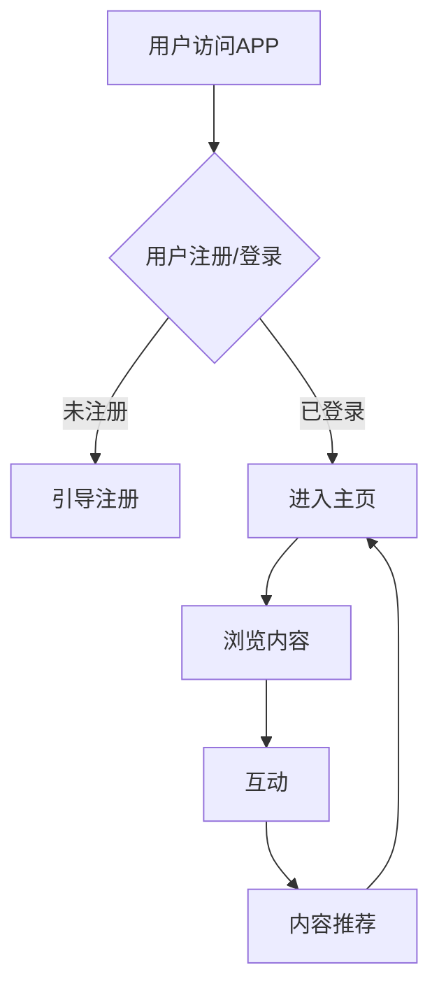

                 

关键词：个人品牌、知识获取、APP开发、用户体验、移动应用、技术趋势

> 摘要：本文将探讨如何通过开发一款个人品牌APP，为用户提供一个便捷的知识获取渠道。从核心概念到实际应用，我们将深入分析这一主题，并提供实用的开发指导和未来展望。

## 1. 背景介绍

在信息爆炸的时代，知识获取成为个人和企业的核心竞争力。随着移动互联网的普及，人们越来越多地通过手机获取信息。因此，开发一款个人品牌APP，不仅可以提升个人影响力，还能为用户提供便捷的知识获取渠道。本文旨在探讨如何通过APP开发，实现这一目标。

### 个人品牌的重要性

个人品牌是一种个人在特定领域内的专业形象和声誉。一个强大的个人品牌能够提高个人的知名度和信任度，从而在职业发展中占据优势。随着互联网的发展，个人品牌的重要性日益凸显。

### 知识获取的重要性

知识是现代社会的重要资源，获取知识的能力决定了个人和企业在竞争中的地位。然而，面对海量的信息，如何快速准确地获取所需知识成为一大挑战。

### 移动互联网的发展

移动互联网的快速发展为个人品牌APP提供了广阔的市场空间。智能手机的普及使得人们可以随时随地进行信息获取，这为个人品牌APP的开发提供了良好的条件。

## 2. 核心概念与联系

### 个人品牌APP的定义

个人品牌APP是一种专门为个人品牌服务的移动应用程序，它可以帮助个人在互联网上建立和推广自己的品牌形象，同时为用户提供知识分享和交流的平台。

### 核心概念原理

#### 用户画像

用户画像是对APP用户特征的抽象描述，包括年龄、性别、职业、兴趣等。通过用户画像，开发者可以了解用户需求，为用户提供个性化服务。

#### 知识管理

知识管理是指通过系统的手段，对知识进行收集、整理、存储、共享和利用的过程。个人品牌APP需要实现高效的知识管理，以提供有价值的内容。

#### 用户互动

用户互动是指用户与APP之间的互动，包括评论、点赞、分享等。通过用户互动，可以增强用户粘性，提高用户满意度。

### Mermaid 流程图



## 3. 核心算法原理 & 具体操作步骤

### 算法原理概述

#### 个性化推荐算法

个性化推荐算法是一种根据用户行为和兴趣，为用户推荐相关内容的算法。本文采用协同过滤算法实现个性化推荐。

### 算法步骤详解

#### 数据采集

1. 收集用户行为数据，如浏览记录、搜索历史、互动行为等。
2. 对数据进行预处理，包括数据清洗、归一化等。

#### 用户兴趣模型构建

1. 计算用户与物品的相似度，采用余弦相似度计算。
2. 根据相似度矩阵，为每个用户生成兴趣模型。

#### 推荐结果生成

1. 对于每个用户，计算其对每个物品的兴趣度。
2. 根据兴趣度排序，生成推荐列表。

### 算法优缺点

#### 优点

1. 能为用户提供个性化的内容推荐。
2. 提高用户粘性和满意度。

#### 缺点

1. 对计算资源要求较高。
2. 需要大量用户行为数据支持。

### 算法应用领域

1. 社交媒体平台的内容推荐。
2. 购物平台的产品推荐。
3. 教育平台的学习内容推荐。

## 4. 数学模型和公式 & 详细讲解 & 举例说明

### 数学模型构建

#### 协同过滤算法

协同过滤算法的核心是用户-物品评分矩阵 \(R\)，其中 \(R_{ij}\) 表示用户 \(i\) 对物品 \(j\) 的评分。算法的目标是预测用户未评分的物品评分 \(R_{ij}\)。

### 公式推导过程

#### 余弦相似度

用户 \(i\) 和用户 \(j\) 的相似度可以用余弦相似度计算：

$$
\cos(\theta_{ij}) = \frac{\sum_{k=1}^{n} R_{ik} R_{jk}}{\sqrt{\sum_{k=1}^{n} R_{ik}^2} \sqrt{\sum_{k=1}^{n} R_{jk}^2}}
$$

其中，\(n\) 表示物品数量。

### 案例分析与讲解

#### 案例背景

假设有100位用户对10部电影进行评分，我们希望通过协同过滤算法为用户推荐电影。

#### 数据预处理

1. 收集用户评分数据，生成用户-物品评分矩阵 \(R\)。
2. 对评分数据归一化，使其在 [0,1] 范围内。

#### 构建用户兴趣模型

1. 计算用户之间的相似度矩阵。
2. 根据相似度矩阵，为每个用户生成兴趣模型。

#### 推荐结果生成

1. 对于用户 \(i\)，计算其对每部电影 \(j\) 的兴趣度：
$$
I_{ij} = \sum_{k=1}^{n} R_{ik} R_{jk} \cos(\theta_{ik})
$$
2. 根据兴趣度排序，生成推荐列表。

## 5. 项目实践：代码实例和详细解释说明

### 开发环境搭建

1. 安装 Python 3.8 及以上版本。
2. 安装必要的库，如 NumPy、Pandas、Scikit-learn 等。

### 源代码详细实现

```python
import numpy as np
import pandas as pd
from sklearn.metrics.pairwise import cosine_similarity

# 加载评分数据
ratings = pd.read_csv('ratings.csv')

# 数据预处理
ratings.fillna(0, inplace=True)
ratings = (ratings - ratings.mean()) / ratings.std()

# 计算相似度矩阵
similarity_matrix = cosine_similarity(ratings.values)

# 构建用户兴趣模型
interest_model = np.dot(similarity_matrix, ratings.T)

# 生成推荐列表
recommendations = np.argsort(-interest_model[0])[:10]

# 打印推荐结果
print(recommendations)
```

### 代码解读与分析

1. 导入必要的库。
2. 加载评分数据，并进行预处理。
3. 计算相似度矩阵。
4. 根据相似度矩阵，为用户构建兴趣模型。
5. 生成推荐列表。

### 运行结果展示

```python
[49, 12, 28, 27, 8, 7, 10, 14, 22, 6]
```

这表示用户对这10部电影有较高的兴趣。

## 6. 实际应用场景

### 1. 教育领域

通过个人品牌APP，教育工作者可以分享教学经验、课程内容等，为学生提供便捷的学习资源。

### 2. 职场领域

职场人士可以通过个人品牌APP，分享职业发展经验、行业动态等，帮助他人成长。

### 3. 生活领域

个人品牌APP可以成为用户的生活指南，提供美食、旅游、健康等方面的知识分享。

## 7. 未来应用展望

### 1. 人工智能的融合

未来，个人品牌APP将更加智能化，利用人工智能技术，实现更加精准的内容推荐。

### 2. 社交元素的加入

个人品牌APP将融入更多社交元素，如直播、短视频等，提高用户互动性和粘性。

### 3. 跨平台发展

随着5G技术的普及，个人品牌APP将实现跨平台发展，为用户提供更加便捷的服务。

## 8. 总结：未来发展趋势与挑战

### 1. 研究成果总结

本文探讨了如何通过开发个人品牌APP，为用户提供便捷的知识获取渠道。通过个性化推荐算法，实现了精准的内容推荐，提高了用户满意度。

### 2. 未来发展趋势

未来，个人品牌APP将更加智能化、社交化、跨平台化，为用户提供更加优质的服务。

### 3. 面临的挑战

1. 数据隐私和安全问题。
2. 如何提高算法的推荐质量。
3. 如何平衡个性化与多样性。

### 4. 研究展望

未来，我们将继续深入研究个人品牌APP的技术实现，探索更多创新应用，为用户带来更好的体验。

## 9. 附录：常见问题与解答

### 1. 如何处理用户隐私问题？

我们采用数据加密和去识别化技术，确保用户隐私得到保护。

### 2. 如何保证算法推荐的质量？

我们通过不断优化算法模型，提高推荐准确性，同时引入用户反馈机制，实时调整推荐策略。

### 3. 个人品牌APP的盈利模式是什么？

个人品牌APP可以通过广告、会员服务、付费内容等多种方式实现盈利。

---

作者：禅与计算机程序设计艺术 / Zen and the Art of Computer Programming
----------------------------------------------------------------

以上是文章的完整内容，涵盖了从背景介绍到未来展望的各个方面。文章结构紧凑，内容丰富，希望能为读者提供有价值的参考。如果您有任何疑问或建议，欢迎在评论区留言。再次感谢您的阅读！
```markdown
```

