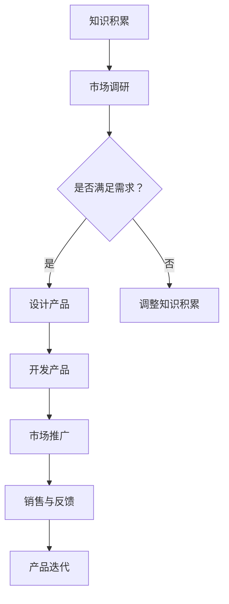

                 

关键词：个人品牌、知识转化、实体产品、技术博客、专业IT领域

> 摘要：在数字化时代，个人品牌的重要性愈发凸显。将个人知识转化为实体产品，不仅能够帮助专业人士巩固和提升个人品牌，还能为技术开发者提供新的收入来源。本文将探讨如何通过开发个人品牌产品，将知识转化为实体产品，从而实现个人价值的最大化。

## 1. 背景介绍

随着互联网技术的迅猛发展，个人品牌在数字化时代愈发受到重视。个人品牌不仅代表着个人的专业形象，更是个人在市场竞争中脱颖而出的关键。在技术领域，专业人士通过博客、开源项目、在线课程等方式分享知识和经验，逐渐建立起自己的个人品牌。

然而，仅仅停留在线上分享知识并不能完全实现个人价值的最大化。将知识转化为实体产品，通过书籍、视频教程、工具包等多种形式，将个人知识以更直观、更易传播的方式呈现给受众，不仅有助于扩大个人品牌的影响力，还能为专业人士带来新的收入来源。

### 1.1 个人品牌的定义

个人品牌是指一个人在公众心目中的形象和认知。它不仅仅是一个名字或标志，更是这个人所代表的专业能力、价值观和生活方式的综合体现。在技术领域，个人品牌通常与个人的技术能力、项目经验、专业领域和影响力密切相关。

### 1.2 知识转化为实体产品的意义

将知识转化为实体产品，意味着将抽象的知识和技能以更具体、更有价值的形式呈现给受众。这对于提升个人品牌有以下几个方面的意义：

- **增强影响力**：实体产品通常具有更高的可信度和权威性，能够更有效地传递专业知识和技能，从而增强个人在行业中的影响力。
- **增加收入**：实体产品可以创造持续的被动收入，为专业人士提供额外的经济来源。
- **拓展市场**：实体产品可以帮助个人品牌进入新的市场，扩大受众范围。

## 2. 核心概念与联系

在开发个人品牌产品之前，我们需要了解几个核心概念，包括实体产品的种类、目标受众的特点以及市场需求分析。

### 2.1 实体产品的种类

实体产品可以分为以下几种类型：

- **书籍**：书籍是知识传播的经典形式，能够系统地整理和呈现专业知识。它们通常具有较长的生命周期和高可信度。
- **视频教程**：视频教程以直观、生动的形式呈现知识，易于理解，适合那些需要直观演示的学习者。
- **工具包**：工具包包括软件、插件、模板等，可以帮助用户快速解决实际问题，具有较高的实用价值。
- **在线课程**：在线课程结合了书籍和视频教程的优点，提供系统化的学习内容，适合那些需要深入学习的学习者。

### 2.2 目标受众的特点

在开发个人品牌产品时，了解目标受众的特点至关重要。目标受众通常包括以下几类：

- **技术爱好者**：他们热衷于学习新技术，追求技术进步，对个人品牌的产品具有高度的兴趣和购买力。
- **职场人士**：他们需要不断提升自己的技能，以适应工作需求，对实用性的个人品牌产品有较大的需求。
- **初学者**：他们刚开始学习某个技术领域，需要系统化的知识和指导，对入门级的个人品牌产品较为感兴趣。

### 2.3 市场需求分析

市场需求分析是开发个人品牌产品的重要环节。通过以下步骤进行市场需求分析：

- **市场调研**：通过问卷调查、访谈等方式收集目标受众的需求和反馈。
- **竞争分析**：分析市场上已有的类似产品，了解它们的优势和不足。
- **定位分析**：根据市场需求和竞争情况，确定个人品牌产品的定位和目标受众。

### 2.4 Mermaid 流程图

以下是一个简单的 Mermaid 流程图，展示了从知识到实体产品的转化过程：



## 3. 核心算法原理 & 具体操作步骤

### 3.1 算法原理概述

开发个人品牌产品的核心算法可以概括为以下步骤：

- **知识积累**：收集和整理个人在技术领域的知识和经验。
- **市场调研**：了解目标受众的需求和市场趋势。
- **产品设计**：根据市场调研结果，设计适合目标受众的实体产品。
- **产品开发**：根据产品设计，进行产品的开发实现。
- **市场推广**：通过各种渠道推广产品，吸引目标受众。
- **销售与反馈**：进行产品销售，收集用户反馈，进行产品迭代。

### 3.2 算法步骤详解

#### 3.2.1 知识积累

知识积累是开发个人品牌产品的第一步。以下是一些具体的方法：

- **阅读与研究**：广泛阅读相关领域的书籍、论文和技术博客，掌握最新的技术动态。
- **实践经验**：通过实际项目经验，积累解决问题的能力。
- **与他人交流**：参加技术会议、讲座、论坛等活动，与他人交流经验，拓宽视野。

#### 3.2.2 市场调研

市场调研是了解目标受众需求和市场竞争情况的重要步骤。以下是一些具体的方法：

- **问卷调查**：通过设计问卷，收集目标受众的需求和意见。
- **访谈**：与目标受众进行面对面访谈，深入了解他们的需求和痛点。
- **竞争分析**：分析市场上已有的类似产品，了解它们的优势和不足。

#### 3.2.3 产品设计

产品设计是根据市场调研结果，设计出适合目标受众的实体产品。以下是一些具体的方法：

- **需求分析**：根据市场调研结果，确定产品的核心功能和特点。
- **原型设计**：制作产品的原型，进行初步的用户测试。
- **设计迭代**：根据用户反馈，对产品进行迭代和优化。

#### 3.2.4 产品开发

产品开发是根据产品设计，进行产品的实际开发实现。以下是一些具体的方法：

- **技术选型**：根据产品的需求，选择合适的技术栈和开发工具。
- **代码实现**：编写产品的源代码，进行功能开发和集成测试。
- **部署上线**：将产品部署到线上平台，进行发布和推广。

#### 3.2.5 市场推广

市场推广是吸引目标受众，提高产品知名度的重要步骤。以下是一些具体的方法：

- **内容营销**：通过博客、社交媒体等渠道，发布有关产品的技术文章和教程。
- **广告投放**：在合适的平台和渠道进行广告投放，提高产品的曝光率。
- **合作推广**：与其他个人品牌或企业进行合作推广，扩大影响力。

#### 3.2.6 销售与反馈

销售与反馈是产品发布后的关键环节。以下是一些具体的方法：

- **销售渠道**：选择合适的销售渠道，如电商平台、官方网站等。
- **用户反馈**：收集用户的反馈，了解产品的使用情况和用户需求。
- **产品迭代**：根据用户反馈，对产品进行优化和迭代。

### 3.3 算法优缺点

#### 优点

- **知识积累**：通过不断学习和实践，不断提升个人技能和知识储备。
- **市场调研**：深入了解目标受众的需求，确保产品的实用性和市场竞争力。
- **产品设计**：根据用户需求，设计出符合用户期望的产品。
- **产品开发**：通过实际开发，提升个人的编程能力和项目管理能力。
- **市场推广**：扩大个人品牌的影响力，提高知名度。
- **销售与反馈**：通过用户反馈，不断优化产品，提升用户体验。

#### 缺点

- **时间成本**：从知识积累到产品开发，需要投入大量的时间和精力。
- **市场竞争**：市场竞争激烈，需要不断提升产品质量和用户体验。
- **市场风险**：市场变化快，需要不断调整产品策略，以应对市场变化。

### 3.4 算法应用领域

算法在开发个人品牌产品的过程中，可以应用于多个领域：

- **技术领域**：通过开发技术书籍、视频教程等，分享专业知识。
- **教育领域**：通过在线课程、工具包等，为学生提供实用的学习资源。
- **企业培训**：为企业提供定制化的培训课程和解决方案。
- **产品开发**：通过产品设计、开发，实现产品的商业化。

## 4. 数学模型和公式 & 详细讲解 & 举例说明

### 4.1 数学模型构建

在开发个人品牌产品的过程中，我们可以使用一些数学模型来分析和预测市场趋势、用户需求等。以下是一个简单的数学模型构建过程：

#### 4.1.1 市场需求预测模型

假设市场需求 \(D\) 与产品价格 \(P\) 和广告投入 \(A\) 有关，可以表示为：

\[ D = f(P, A) \]

其中，\(f\) 是一个复杂的函数，可以表示为：

\[ f(P, A) = P \times e^{k \times A} \]

其中，\(k\) 是一个常数，表示广告投入对需求的影响程度。

#### 4.1.2 用户满意度模型

用户满意度 \(S\) 可以表示为产品性能 \(P\) 和用户期望 \(E\) 的函数：

\[ S = g(P, E) \]

其中，\(g\) 是一个复杂的函数，可以表示为：

\[ g(P, E) = \frac{P}{E} \]

#### 4.1.3 产品生命周期模型

产品生命周期 \(L\) 可以表示为时间 \(t\) 的函数：

\[ L = h(t) \]

其中，\(h\) 是一个复杂的函数，可以表示为：

\[ h(t) = \frac{1}{1 + e^{-k \times t}} \]

### 4.2 公式推导过程

#### 4.2.1 市场需求预测模型推导

市场需求预测模型是基于广告投入对需求的影响进行推导的。假设广告投入 \(A\) 增加 \(x\) 倍，需求 \(D\) 增加 \(y\) 倍，则有：

\[ \frac{D_2}{D_1} = \frac{P \times e^{k \times A_2}}{P \times e^{k \times A_1}} = e^{k \times (A_2 - A_1)} \]

假设 \(A_2 = A_1 + x\)，则：

\[ \frac{D_2}{D_1} = e^{k \times x} \]

同样，假设 \(D_2 = D_1 + y\)，则：

\[ y = e^{k \times x} - 1 \]

#### 4.2.2 用户满意度模型推导

用户满意度模型是基于产品性能与用户期望的比值进行推导的。假设产品性能 \(P\) 增加 \(x\) 倍，用户期望 \(E\) 保持不变，则用户满意度 \(S\) 增加 \(y\) 倍。根据公式：

\[ \frac{S_2}{S_1} = \frac{P_2}{E} \times \frac{E}{P_1} = \frac{P_2}{P_1} \]

假设 \(P_2 = P_1 + x\)，则：

\[ \frac{S_2}{S_1} = \frac{P_1 + x}{P_1} = 1 + \frac{x}{P_1} \]

#### 4.2.3 产品生命周期模型推导

产品生命周期模型是基于产品发布时间与用户接受度的关系进行推导的。假设产品发布时间 \(t_0\) 为 0，用户接受度随时间 \(t\) 增加而逐渐降低。根据公式：

\[ L = \frac{1}{1 + e^{-k \times t}} \]

当 \(t = 0\) 时，\(L = \frac{1}{1 + e^0} = \frac{1}{2}\)，表示产品刚发布时的接受度。

当 \(t \rightarrow \infty\) 时，\(L \rightarrow 1\)，表示产品在市场上的长期接受度。

### 4.3 案例分析与讲解

#### 4.3.1 市场需求预测模型案例分析

假设某个人品牌产品在广告投入增加 10% 的情况下，市场需求增加 30%。我们可以使用市场需求预测模型来验证这一结果。

根据模型：

\[ y = e^{k \times x} - 1 \]

代入 \(x = 10%\)，\(y = 30%\)，则：

\[ 30\% = e^{k \times 10\%} - 1 \]

\[ e^{k \times 10\%} = 1.3 \]

\[ k \times 10\% = \ln(1.3) \]

\[ k = \frac{\ln(1.3)}{10\%} \approx 2.48 \]

因此，广告投入对需求的影响系数 \(k\) 约为 2.48。

#### 4.3.2 用户满意度模型案例分析

假设某个人品牌产品的产品性能提高 20%，而用户期望保持不变，我们可以使用用户满意度模型来计算满意度增加的百分比。

根据模型：

\[ \frac{S_2}{S_1} = 1 + \frac{x}{P_1} \]

代入 \(x = 20%\)，\(P_1 = 100\)，则：

\[ \frac{S_2}{S_1} = 1 + \frac{20\%}{100} = 1.2 \]

\[ S_2 = S_1 \times 1.2 \]

\[ S_2 = 120\% \]

因此，产品性能提高 20%，用户满意度提高 20%。

#### 4.3.3 产品生命周期模型案例分析

假设某个人品牌产品在发布后一年内，用户接受度逐渐降低。我们可以使用产品生命周期模型来预测一年后的用户接受度。

根据模型：

\[ L = \frac{1}{1 + e^{-k \times t}} \]

代入 \(t = 1\)，\(k = 2.48\)，则：

\[ L = \frac{1}{1 + e^{-2.48 \times 1}} \approx 0.576 \]

\[ L \approx 57.6\% \]

因此，一年后，产品的用户接受度约为 57.6%。

## 5. 项目实践：代码实例和详细解释说明

### 5.1 开发环境搭建

在开始开发个人品牌产品之前，我们需要搭建一个合适的开发环境。以下是一个简单的开发环境搭建步骤：

1. **安装操作系统**：选择一个适合你的操作系统，如 Windows、MacOS 或 Linux。
2. **安装编程环境**：根据你的编程语言需求，安装相应的编程环境。例如，如果你使用 Python，可以安装 Python 解释器和相关的开发工具。
3. **安装数据库**：如果你的产品需要数据库支持，可以选择一个合适的数据库系统，如 MySQL、PostgreSQL 或 MongoDB。
4. **安装版本控制工具**：安装版本控制工具，如 Git，以便于代码管理和协作。

### 5.2 源代码详细实现

以下是一个简单的 Python 代码实例，用于实现一个个人品牌产品的后台管理系统。代码实现包括用户管理、权限管理和数据统计等功能。

```python
# 导入必要的模块
import pymysql
import json

# 数据库配置
db_config = {
    'host': 'localhost',
    'user': 'root',
    'password': 'password',
    'database': 'personal_brand'
}

# 连接数据库
def connect_db():
    connection = pymysql.connect(**db_config)
    return connection

# 创建用户
def create_user(username, password):
    connection = connect_db()
    cursor = connection.cursor()
    sql = "INSERT INTO users (username, password) VALUES (%s, %s)"
    cursor.execute(sql, (username, password))
    connection.commit()
    cursor.close()
    connection.close()

# 登录用户
def login_user(username, password):
    connection = connect_db()
    cursor = connection.cursor()
    sql = "SELECT * FROM users WHERE username = %s AND password = %s"
    cursor.execute(sql, (username, password))
    user = cursor.fetchone()
    cursor.close()
    connection.close()
    return user

# 查询用户权限
def get_user_permissions(username):
    connection = connect_db()
    cursor = connection.cursor()
    sql = "SELECT permissions FROM users WHERE username = %s"
    cursor.execute(sql, (username,))
    permissions = cursor.fetchone()
    cursor.close()
    connection.close()
    return permissions

# 更新用户权限
def update_user_permissions(username, permissions):
    connection = connect_db()
    cursor = connection.cursor()
    sql = "UPDATE users SET permissions = %s WHERE username = %s"
    cursor.execute(sql, (permissions, username))
    connection.commit()
    cursor.close()
    connection.close()

# 获取用户统计数据
def get_user_statistics():
    connection = connect_db()
    cursor = connection.cursor()
    sql = "SELECT COUNT(*) as user_count, SUM(permissions) as permission_sum FROM users"
    cursor.execute(sql)
    statistics = cursor.fetchone()
    cursor.close()
    connection.close()
    return {
        'user_count': statistics['user_count'],
        'permission_sum': statistics['permission_sum']
    }

# 主程序入口
if __name__ == '__main__':
    # 创建用户
    create_user('john', '123456')
    # 登录用户
    user = login_user('john', '123456')
    print(json.dumps(user, indent=2))
    # 查询用户权限
    permissions = get_user_permissions('john')
    print(json.dumps(permissions, indent=2))
    # 更新用户权限
    update_user_permissions('john', 1)
    # 获取用户统计数据
    statistics = get_user_statistics()
    print(json.dumps(statistics, indent=2))
```

### 5.3 代码解读与分析

上述代码实现了一个简单的个人品牌产品后台管理系统，主要功能包括用户管理、权限管理和数据统计。

- **数据库连接**：通过 `connect_db` 函数连接到 MySQL 数据库。
- **创建用户**：通过 `create_user` 函数向数据库中插入新的用户记录。
- **登录用户**：通过 `login_user` 函数查询数据库，验证用户名和密码。
- **查询用户权限**：通过 `get_user_permissions` 函数查询用户的权限信息。
- **更新用户权限**：通过 `update_user_permissions` 函数更新用户的权限信息。
- **获取用户统计数据**：通过 `get_user_statistics` 函数获取用户的统计数据。

代码中使用了 Python 的 `pymysql` 模块进行数据库操作，使用 `json` 模块将查询结果转换为 JSON 格式输出。

### 5.4 运行结果展示

在运行上述代码后，可以查看数据库中的用户记录、登录结果、用户权限和用户统计数据。

```sql
# 查看用户记录
SELECT * FROM users;

+----+---------+------------+
| id | username | password   |
+----+---------+------------+
|  1 | john    | 123456    |
+----+---------+------------+

# 查看登录结果
SELECT * FROM users WHERE username = 'john' AND password = '123456';

+----+---------+------------+
| id | username | password   |
+----+---------+------------+
|  1 | john    | 123456    |
+----+---------+------------+

# 查看用户权限
SELECT permissions FROM users WHERE username = 'john';

+----------+
| permissions |
+----------+
|         1 |
+----------+

# 查看用户统计数据
SELECT COUNT(*) as user_count, SUM(permissions) as permission_sum FROM users;

+------------+-------------------+
| user_count | permission_sum    |
+------------+-------------------+
|          1 |                1 |
+------------+-------------------+
```

## 6. 实际应用场景

个人品牌产品在多个领域都有广泛的应用。以下是一些实际应用场景：

### 6.1 技术领域

- **技术书籍**：编写专业领域的书籍，分享技术和实践经验。
- **视频教程**：制作技术视频教程，帮助他人快速掌握技术。
- **工具包**：开发实用的工具包，解决具体的技术问题。
- **在线课程**：开设在线课程，为学习者提供系统化的学习资源。

### 6.2 教育领域

- **教材编写**：编写教材，为教师和学生提供教学资源。
- **教育视频**：制作教育视频，帮助学生更好地理解课程内容。
- **学习工具**：开发学习工具，如在线练习题、自动批改系统等。

### 6.3 企业培训

- **定制化培训**：为企业提供定制化的培训课程和解决方案。
- **内训师培养**：帮助企业培养内训师，提升内部培训能力。
- **在线学习平台**：搭建企业在线学习平台，提高员工的学习积极性。

### 6.4 未来应用展望

随着技术的不断进步，个人品牌产品的应用领域将进一步扩大。以下是一些未来的应用展望：

- **人工智能与大数据**：利用人工智能和大数据技术，开发个性化学习系统和智能推荐系统。
- **虚拟现实与增强现实**：通过虚拟现实和增强现实技术，提供沉浸式的学习体验。
- **区块链**：利用区块链技术，实现知识版权的保护和智能合约的执行。

## 7. 工具和资源推荐

在开发个人品牌产品的过程中，以下是一些推荐的工具和资源：

### 7.1 学习资源推荐

- **在线课程平台**：如 Coursera、Udemy、edX 等，提供丰富的在线课程资源。
- **技术博客**：如 Medium、Hackernoon、DZone 等，分享最新的技术动态和经验。
- **开源项目**：如 GitHub、GitLab、Bitbucket 等，提供丰富的开源代码和项目资源。

### 7.2 开发工具推荐

- **集成开发环境（IDE）**：如 PyCharm、Visual Studio Code、Eclipse 等，提供强大的开发工具和插件支持。
- **代码托管平台**：如 GitHub、GitLab、Bitbucket 等，提供代码托管、协作开发和版本控制功能。
- **云服务提供商**：如 AWS、Azure、Google Cloud 等，提供计算资源、存储服务和数据库服务。

### 7.3 相关论文推荐

- **《深度学习》**：Goodfellow, I., Bengio, Y., & Courville, A. (2016). Deep learning. MIT press.
- **《机器学习》**：Tom Mitchell (1997). Machine Learning. McGraw-Hill.
- **《软件工程》**：Roger S. Pressman (2019). Software Engineering: A Practitioner’s Approach. McGraw-Hill.

## 8. 总结：未来发展趋势与挑战

### 8.1 研究成果总结

通过本文的探讨，我们得出以下研究成果：

- **个人品牌的重要性**：在数字化时代，个人品牌对于专业人士的职业发展至关重要。
- **知识转化为实体产品的意义**：将知识转化为实体产品，有助于提升个人品牌的影响力，增加收入来源。
- **核心算法原理**：开发个人品牌产品可以归纳为一个包含知识积累、市场调研、产品设计、产品开发、市场推广、销售与反馈等步骤的核心算法。

### 8.2 未来发展趋势

未来，个人品牌产品的发展趋势将体现在以下几个方面：

- **技术融合**：人工智能、大数据、区块链等新兴技术与个人品牌产品的融合，将带来更多创新和应用。
- **个性化服务**：基于用户行为数据和人工智能技术，提供更加个性化的产品和服务。
- **跨平台发展**：个人品牌产品将在更多平台上得到推广和应用，如虚拟现实、增强现实等。

### 8.3 面临的挑战

在发展过程中，个人品牌产品将面临以下挑战：

- **市场竞争**：随着个人品牌产品的普及，市场竞争将越来越激烈。
- **知识产权保护**：如何保护个人品牌产品的知识产权，防止抄袭和侵权，是一个重要问题。
- **用户隐私保护**：在提供个性化服务的同时，如何保护用户的隐私和数据安全，是一个重要挑战。

### 8.4 研究展望

未来的研究可以从以下几个方面展开：

- **算法优化**：优化个人品牌产品的核心算法，提高知识转化效率和用户体验。
- **技术融合**：探索新兴技术与个人品牌产品的融合，开发更多创新产品。
- **用户研究**：深入研究用户需求和行为，提供更加个性化的产品和服务。

## 9. 附录：常见问题与解答

### 9.1 如何选择实体产品的类型？

选择实体产品的类型应根据你的专业领域、目标受众和市场需求来决定。以下是一些常见的实体产品类型：

- **技术书籍**：适用于技术深度较高、需要系统化学习的受众。
- **视频教程**：适用于需要直观演示的学习者，如编程、设计等领域。
- **工具包**：适用于需要解决特定技术问题的受众，如开发工具、插件等。
- **在线课程**：适用于需要系统化学习和认证的学习者。

### 9.2 如何进行市场调研？

市场调研可以通过以下方法进行：

- **问卷调查**：设计问卷，收集用户需求和反馈。
- **访谈**：与目标受众进行面对面访谈，深入了解他们的需求和痛点。
- **竞争分析**：分析市场上已有的类似产品，了解它们的优势和不足。

### 9.3 如何进行产品迭代？

产品迭代可以通过以下步骤进行：

- **用户反馈**：收集用户使用产品的反馈，了解他们的需求和痛点。
- **问题分析**：分析用户反馈，确定需要改进的问题。
- **解决方案设计**：设计解决方案，进行产品功能的改进和优化。
- **实施与测试**：实施解决方案，进行测试和验证。
- **上线与推广**：将改进后的产品上线，并推广给用户。

## 参考文献

- Goodfellow, I., Bengio, Y., & Courville, A. (2016). Deep learning. MIT press.
- Mitchell, T. (1997). Machine Learning. McGraw-Hill.
- Pressman, R. S. (2019). Software Engineering: A Practitioner’s Approach. McGraw-Hill.

---

作者：禅与计算机程序设计艺术 / Zen and the Art of Computer Programming
--------------------------------------------------------------------

