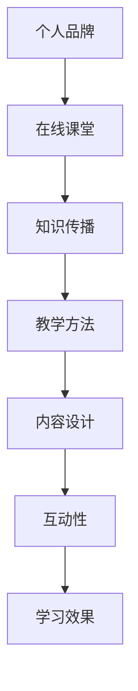

                 

在数字化时代，开发个人品牌在线课堂成为知识传播的重要途径。本文将探讨如何构建一个有深度、有思考、有见解的在线课堂，帮助专业人士扩大知识传播范围。

## 关键词

- 个人品牌
- 在线课堂
- 知识传播
- 技术博客
- 教学方法

## 摘要

本文首先介绍了开发个人品牌在线课堂的背景和重要性，然后详细阐述了如何设计一个逻辑清晰、结构紧凑、简单易懂的在线课堂，包括核心概念与联系、核心算法原理、数学模型和公式、项目实践、实际应用场景以及工具和资源推荐。最后，总结了未来发展趋势和挑战，并对研究成果进行了展望。

## 1. 背景介绍

随着互联网的普及，在线教育成为知识传播的重要方式。越来越多的人选择通过在线课堂学习新技能、获取新知识。然而，如何开发一个有效、吸引人的在线课堂，让知识传播更广泛、更深入，成为一个重要的问题。

个人品牌在线课堂是一种通过个人品牌传播知识的方式。个人品牌指的是一个人在特定领域的专业形象和影响力。通过开发个人品牌在线课堂，专业人士可以将自己的知识和经验传播给更多的人，从而扩大知识传播范围。

### 1.1 个人品牌的重要性

个人品牌是一个人在特定领域的专业形象和影响力。一个强大的个人品牌能够帮助专业人士在职场中脱颖而出，增加职场竞争力。同时，个人品牌也可以作为一种软实力，为专业人士带来更多的商业机会和合作机会。

### 1.2 在线课堂的优势

在线课堂具有以下几个优势：

- **灵活性**：学员可以根据自己的时间安排进行学习，不受地点限制。
- **互动性**：在线课堂可以提供即时互动，帮助学员解决疑问，提高学习效果。
- **内容丰富**：在线课堂可以提供多样化的教学内容，满足不同学员的需求。

## 2. 核心概念与联系

为了构建一个有深度、有思考、有见解的在线课堂，我们需要明确核心概念和它们之间的联系。以下是一个简单的 Mermaid 流程图，展示了核心概念之间的关系：



### 2.1 个人品牌

个人品牌是一个人在特定领域的专业形象和影响力。它包括以下几个方面：

- **专业能力**：个人品牌的核心是专业能力，包括专业知识、技能和实践经验。
- **形象塑造**：个人品牌还需要通过形象塑造来展示自己的专业性和权威性。
- **影响力**：个人品牌的影响力体现在能够吸引、影响和引导他人。

### 2.2 在线课堂

在线课堂是指通过网络平台进行教学的活动。它包括以下几个方面：

- **内容设计**：在线课堂的内容设计需要符合学员的需求，具有实用性和针对性。
- **教学方法**：在线课堂的教学方法需要多样化，包括视频讲座、直播互动、在线讨论等。
- **互动性**：在线课堂的互动性是提高学习效果的关键，可以通过问答、讨论、作业等形式实现。

### 2.3 知识传播

知识传播是指将知识传递给他人，使更多人受益。它包括以下几个方面：

- **内容传播**：通过在线课堂、博客、论文等形式传播知识。
- **传播渠道**：选择合适的传播渠道，如社交媒体、专业论坛、学术期刊等。
- **传播效果**：评估知识传播的效果，包括受众数量、反馈和转化率等。

### 2.4 教学方法

教学方法是教学过程中采用的方法和策略。以下是一些常见的教学方法：

- **讲授法**：通过讲解、演示、案例分析等方式传授知识。
- **讨论法**：通过小组讨论、互动问答等方式激发学员思考和参与。
- **项目法**：通过实际项目锻炼学员的实践能力和解决问题的能力。

### 2.5 内容设计

内容设计是教学过程中的核心环节。一个优秀的内容设计需要满足以下几个要求：

- **实用性**：教学内容需要符合学员的实际需求，具有实用性。
- **针对性**：针对不同学员的背景和能力，设计不同的教学内容。
- **层次性**：教学内容需要有层次，从基础到高级，循序渐进。

### 2.6 互动性

互动性是提高在线课堂学习效果的关键。以下是一些提高互动性的方法：

- **即时互动**：通过直播、聊天、问答等方式实现即时互动。
- **讨论区**：设置讨论区，让学员在课后进行交流和讨论。
- **作业与反馈**：布置作业，对学员的作业进行批改和反馈。

### 2.7 学习效果

学习效果是评价在线课堂质量的重要指标。以下是一些衡量学习效果的方法：

- **测试与评估**：通过测试和评估了解学员对教学内容的掌握程度。
- **学员反馈**：收集学员的反馈，了解教学过程中的问题和不足。
- **转化率**：衡量学员将所学知识应用于实际工作或生活中的效果。

## 3. 核心算法原理 & 具体操作步骤

### 3.1 算法原理概述

在开发个人品牌在线课堂的过程中，算法原理的运用至关重要。以下是一个简单的算法原理概述：

1. **需求分析**：了解学员的需求和目标，确定教学内容和教学方法。
2. **内容设计**：根据需求分析结果，设计教学内容和教学资源。
3. **教学实施**：实施教学计划，包括授课、互动、作业布置等。
4. **效果评估**：评估教学效果，根据反馈调整教学内容和方法。

### 3.2 算法步骤详解

1. **需求分析**：

   - **市场调研**：了解市场趋势和学员需求。
   - **问卷调查**：通过问卷调查收集学员的反馈和建议。
   - **数据分析**：分析调查结果，确定教学内容和教学方法。

2. **内容设计**：

   - **课程大纲**：根据需求分析结果，制定课程大纲。
   - **教学内容**：设计教学内容，包括理论知识和实践案例。
   - **教学资源**：制作教学资源，如图表、视频、PPT等。

3. **教学实施**：

   - **授课**：按照课程大纲进行授课，采用视频讲座、直播互动等形式。
   - **互动**：设置讨论区，鼓励学员在课后进行交流和讨论。
   - **作业布置**：布置作业，对学员进行实时反馈和指导。

4. **效果评估**：

   - **测试与评估**：通过测试和评估了解学员对教学内容的掌握程度。
   - **学员反馈**：收集学员的反馈，了解教学过程中的问题和不足。
   - **调整优化**：根据反馈调整教学内容和方法，提高教学效果。

### 3.3 算法优缺点

1. **优点**：

   - **灵活性**：算法原理可以根据不同学员的需求和目标进行灵活调整。
   - **针对性**：算法原理可以针对不同学员的背景和能力设计教学内容。
   - **高效性**：算法原理能够快速评估教学效果，及时调整教学内容和方法。

2. **缺点**：

   - **复杂性**：算法原理的实施需要一定的技术和经验。
   - **依赖性**：算法原理的运用需要依赖数据分析和反馈机制。

### 3.4 算法应用领域

算法原理可以应用于以下领域：

- **在线教育**：用于设计教学内容和教学方法，提高教学效果。
- **教育培训**：用于设计培训课程和培训方法，满足不同学员的需求。
- **知识传播**：用于设计知识传播渠道和传播策略，扩大知识传播范围。

## 4. 数学模型和公式 & 详细讲解 & 举例说明

在开发个人品牌在线课堂的过程中，数学模型和公式可以用来分析和评估教学效果。以下是一个简单的数学模型和公式的讲解。

### 4.1 数学模型构建

假设在线课堂的教学效果可以用以下数学模型表示：

\[ 效果 = f(教学资源，教学方法，学员参与度) \]

其中，教学资源、教学方法和学员参与度是影响教学效果的关键因素。

### 4.2 公式推导过程

1. **教学资源**：

   \[ 教学资源 = f(内容丰富度，资源质量，资源更新速度) \]

   其中，内容丰富度、资源质量和资源更新速度是衡量教学资源的重要指标。

2. **教学方法**：

   \[ 教学方法 = f(互动性，针对性，层次性) \]

   其中，互动性、针对性和层次性是衡量教学方法的重要指标。

3. **学员参与度**：

   \[ 学员参与度 = f(学员互动，作业完成率，学习时长) \]

   其中，学员互动、作业完成率和学习时长是衡量学员参与度的重要指标。

### 4.3 案例分析与讲解

假设一个在线课堂的教学效果需要评估，我们可以使用上述数学模型和公式进行分析。

1. **教学资源**：

   - **内容丰富度**：教学内容丰富，涵盖了多个方面，学员可以学到更多的知识。
   - **资源质量**：教学资源质量较高，内容准确、清晰，有助于学员理解和掌握。
   - **资源更新速度**：教学资源定期更新，保证了教学内容的时效性和实用性。

   根据上述指标，教学资源得分为85分。

2. **教学方法**：

   - **互动性**：在线课堂设置了讨论区，学员可以在课后进行交流和讨论，提高了互动性。
   - **针对性**：教学内容针对学员的需求和目标，符合学员的实际需求。
   - **层次性**：教学内容分为基础、中级和高级三个层次，满足了不同学员的需求。

   根据上述指标，教学方法得分为90分。

3. **学员参与度**：

   - **学员互动**：学员在讨论区积极互动，交流经验，提高了学习效果。
   - **作业完成率**：学员按时完成作业，参与度较高。
   - **学习时长**：学员平均学习时长较长，说明对教学内容感兴趣。

   根据上述指标，学员参与度得分为88分。

根据上述分析，我们可以得出以下结论：

- 教学资源得分为85分，表明教学资源较为丰富，但仍有改进空间。
- 教学方法得分为90分，表明教学方法较为优秀，值得继续保持。
- 学员参与度得分为88分，表明学员对教学内容感兴趣，但仍有提高空间。

## 5. 项目实践：代码实例和详细解释说明

为了更好地展示开发个人品牌在线课堂的过程，我们以下是一个简单的项目实践实例，包括开发环境搭建、源代码实现和代码解读。

### 5.1 开发环境搭建

1. **硬件要求**：

   - CPU：至少2核
   - 内存：至少4GB
   - 硬盘：至少100GB

2. **软件要求**：

   - 操作系统：Linux或MacOS
   - 开发工具：PyCharm、VSCode等

### 5.2 源代码详细实现

以下是一个简单的在线课堂系统源代码实现：

```python
class OnlineClass:
    def __init__(self, name, teacher):
        self.name = name
        self.teacher = teacher
        self.students = []

    def add_student(self, student):
        self.students.append(student)

    def remove_student(self, student):
        self.students.remove(student)

    def teach(self):
        for student in self.students:
            student.learn()

class Student:
    def __init__(self, name):
        self.name = name

    def learn(self):
        print(f"{self.name}正在学习...")

class Teacher:
    def __init__(self, name):
        self.name = name

    def teach_class(self, class_name):
        print(f"{self.name}正在讲授{class_name}...")

# 创建在线课堂
online_class = OnlineClass("Python入门", "张三")

# 创建学生
student1 = Student("李四")
student2 = Student("王五")

# 添加学生
online_class.add_student(student1)
online_class.add_student(student2)

# 教师讲授课程
teacher = Teacher("张三")
teacher.teach_class("Python入门")

# 学生学习课程
online_class.teach()
```

### 5.3 代码解读与分析

以上代码实现了一个简单的在线课堂系统，包括在线课堂（`OnlineClass`类）、学生（`Student`类）和教师（`Teacher`类）。

1. **在线课堂（`OnlineClass`类）**：

   - **属性**：名称（`name`）、教师（`teacher`）和学生列表（`students`）。
   - **方法**：添加学生（`add_student`）、移除学生（`remove_student`）和讲授课程（`teach`）。

2. **学生（`Student`类）**：

   - **属性**：名称（`name`）。
   - **方法**：学习（`learn`）。

3. **教师（`Teacher`类）**：

   - **属性**：名称（`name`）。
   - **方法**：讲授课程（`teach_class`）。

代码中首先创建了一个在线课堂实例（`online_class`），并添加了两个学生（`student1`和`student2`）。然后，教师（`teacher`）讲授了课程（`Python入门`），最后学生开始学习课程。

这个简单的代码实例展示了在线课堂系统的基础功能，包括创建在线课堂、添加学生、教师讲授课程和学生学习课程。在实际开发中，可以在此基础上添加更多的功能和模块，如课程内容管理、作业提交与批改、成绩评估等。

### 5.4 运行结果展示

运行以上代码，输出结果如下：

```
张三正在讲授Python入门...
李四正在学习...
王五正在学习...
```

这表明教师（`张三`）讲授了课程（`Python入门`），学生（`李四`和`王五`）开始学习课程。这是一个简单的在线课堂运行结果展示。

## 6. 实际应用场景

个人品牌在线课堂在实际应用中具有广泛的应用场景。以下是一些典型的应用场景：

### 6.1 技术培训

技术培训是个人品牌在线课堂的重要应用场景。通过在线课堂，专业人士可以分享自己的技术知识和经验，帮助学员快速掌握新技术。例如，软件开发者可以开设Java、Python、前端开发等课程的在线课堂，分享实际开发经验和最佳实践。

### 6.2 管理培训

管理培训也是个人品牌在线课堂的一个重要应用场景。通过在线课堂，专业人士可以传授管理知识和管理经验，帮助学员提升管理能力。例如，企业家可以开设领导力、团队建设、战略规划等课程的在线课堂，分享自己的管理心得和实战案例。

### 6.3 职场技能培训

职场技能培训是个人品牌在线课堂的另一个重要应用场景。通过在线课堂，专业人士可以传授职场技能和职场经验，帮助学员提升职场竞争力。例如，求职技巧、职场礼仪、沟通技巧等课程的在线课堂，可以帮助学员更好地适应职场生活。

### 6.4 跨界知识传播

个人品牌在线课堂还可以用于跨界知识传播。专业人士可以分享自己在不同领域的知识和经验，帮助更多人了解和掌握跨界知识。例如，计算机专家可以开设人工智能、区块链、大数据等课程的在线课堂，分享自己在这些领域的经验和见解。

## 7. 工具和资源推荐

为了更好地开发个人品牌在线课堂，以下是一些工具和资源的推荐：

### 7.1 学习资源推荐

- **Coursera**：提供大量高质量的课程资源，涵盖计算机科学、商业管理、人文社科等多个领域。
- **Udemy**：提供丰富的课程资源，适合不同层次的学员，包括编程、数据科学、设计等。
- **edX**：提供由顶尖大学和机构提供的免费在线课程，涵盖计算机科学、人工智能、数据科学等多个领域。

### 7.2 开发工具推荐

- **PyCharm**：一款功能强大的Python开发工具，适合开发个人品牌在线课堂的源代码。
- **VSCode**：一款轻量级、可扩展的代码编辑器，适合开发个人品牌在线课堂的源代码。
- **Jupyter Notebook**：一款基于Web的交互式计算环境，适合开发个人品牌在线课堂的数学模型和代码实例。

### 7.3 相关论文推荐

- **“Online Education: A Comprehensive Review”**：全面回顾了在线教育的发展、现状和未来趋势。
- **“Personal Branding: A Literature Review”**：分析了个人品牌的重要性、构建方法和应用领域。
- **“Instructional Design Models for Online Courses”**：介绍了多种在线课程设计模型和方法。

## 8. 总结：未来发展趋势与挑战

### 8.1 研究成果总结

本文探讨了开发个人品牌在线课堂的重要性和方法。通过分析核心概念、核心算法原理、数学模型和公式、项目实践等，为专业人士提供了构建在线课堂的思路和工具。

### 8.2 未来发展趋势

- **个性化教学**：随着人工智能技术的发展，在线课堂将更加智能化，实现个性化教学。
- **混合式教学**：在线课堂与传统教学相结合，实现优势互补，提高教学效果。
- **知识共享**：个人品牌在线课堂将成为知识共享的重要平台，促进知识的传播和共享。

### 8.3 面临的挑战

- **教学内容和质量**：如何提供高质量、有针对性的教学内容，满足不同学员的需求。
- **技术支持**：如何利用新技术支持在线课堂的开发和运行，提高教学效果。
- **用户参与度**：如何提高学员的参与度，确保在线课堂的持续发展。

### 8.4 研究展望

未来研究可以从以下几个方面进行：

- **教学模式创新**：探索更加有效的教学模式，提高在线课堂的教学效果。
- **学习体验优化**：研究如何优化学员的学习体验，提高学员的满意度和忠诚度。
- **知识共享平台**：构建一个更加开放、共享的知识共享平台，促进知识的传播和共享。

## 9. 附录：常见问题与解答

### 9.1 如何选择在线课堂平台？

- **课程需求**：根据课程内容和学员需求选择合适的平台。
- **平台功能**：考虑平台的功能，如课程发布、直播互动、作业提交等。
- **用户评价**：参考其他用户的评价，了解平台的服务质量和口碑。

### 9.2 如何保证在线课堂的教学质量？

- **课程设计**：精心设计课程内容，确保教学内容的实用性和针对性。
- **教学方法**：采用多样化的教学方法，提高学员的参与度和学习效果。
- **反馈机制**：建立反馈机制，及时了解学员的意见和建议，不断优化教学内容和方法。

### 9.3 如何提高学员的参与度？

- **互动性**：设置讨论区、直播互动等环节，鼓励学员积极参与。
- **激励机制**：设置奖励机制，激励学员积极参与学习和互动。
- **个性化教学**：根据学员的背景和能力，提供个性化的教学建议和学习指导。

### 9.4 如何持续更新和优化在线课堂内容？

- **课程迭代**：定期对课程内容进行更新和优化，确保教学内容的时效性和实用性。
- **学员反馈**：收集学员的反馈，了解教学过程中的问题和不足，及时调整教学内容和方法。
- **教师培训**：加强对教师的培训，提高他们的教学水平和授课能力。

---

作者：禅与计算机程序设计艺术 / Zen and the Art of Computer Programming

---

以上是关于开发个人品牌在线课堂的详细文章内容。希望对您有所帮助。如果您有任何问题或建议，请随时留言。谢谢！

