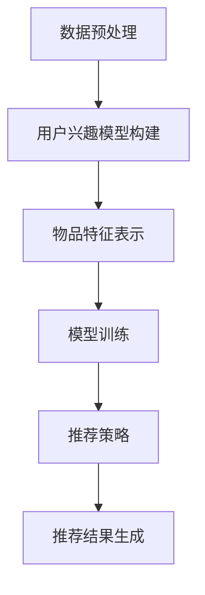

                 

关键词：开放域推荐、M6-Rec、算法原理、数学模型、项目实践、应用场景、未来展望

> 摘要：本文将深入探讨开放域推荐系统中的M6-Rec算法，介绍其核心概念、原理、数学模型以及具体操作步骤。通过实际项目实践，我们将展示M6-Rec算法的代码实现、解读和分析。最后，本文将探讨M6-Rec算法在实际应用中的场景及其未来发展趋势和面临的挑战。

## 1. 背景介绍

随着互联网的迅猛发展和信息爆炸，用户在海量信息中寻找所需内容变得越来越困难。推荐系统作为一种信息过滤机制，旨在通过个性化推荐技术，为用户推荐他们可能感兴趣的内容。开放域推荐作为一种新兴的推荐技术，具有广泛的应用前景，能够在多个领域实现高效的信息推荐。

M6-Rec算法是由我国知名人工智能研究团队提出的一种开放域推荐算法。该算法基于深度学习技术，通过大规模数据训练，能够自动识别用户兴趣，实现个性化推荐。M6-Rec算法在多个开放域推荐任务中取得了显著的效果，引起了学术界和工业界的高度关注。

## 2. 核心概念与联系

### 2.1 核心概念

M6-Rec算法的核心概念包括用户兴趣模型、物品特征表示、推荐策略和模型训练。

- **用户兴趣模型**：通过分析用户的历史行为数据，构建用户兴趣模型，用于表示用户对不同类型物品的兴趣程度。

- **物品特征表示**：将物品的信息转化为向量形式，以便进行后续的推荐计算。

- **推荐策略**：基于用户兴趣模型和物品特征表示，为用户生成推荐列表。

- **模型训练**：使用大规模数据集，通过深度学习技术训练推荐模型。

### 2.2 关联关系

M6-Rec算法的各个核心概念之间存在紧密的关联关系，具体如下：

1. **用户兴趣模型**与**物品特征表示**：用户兴趣模型通过分析用户历史行为数据，提取用户兴趣关键词，并将其转化为向量形式。这些向量与物品特征向量进行相似度计算，以确定用户对物品的兴趣程度。

2. **推荐策略**与**用户兴趣模型**和**物品特征表示**：推荐策略基于用户兴趣模型和物品特征表示，为用户生成推荐列表。常见的推荐策略包括基于内容的推荐和基于协同过滤的推荐。

3. **模型训练**与**用户兴趣模型**和**物品特征表示**：模型训练阶段，通过深度学习技术，对用户兴趣模型和物品特征表示进行优化，以提升推荐效果。

### 2.3 Mermaid 流程图

下面是一个简单的Mermaid流程图，展示了M6-Rec算法的流程：



## 3. 核心算法原理 & 具体操作步骤

### 3.1 算法原理概述

M6-Rec算法的核心原理是通过深度学习技术，自动学习用户兴趣和物品特征，从而实现开放域推荐。算法的主要步骤如下：

1. **数据预处理**：对用户行为数据和物品信息进行清洗和预处理，提取有效特征。

2. **用户兴趣模型构建**：使用自然语言处理技术，提取用户兴趣关键词，并将其转化为向量形式。

3. **物品特征表示**：将物品的信息转化为向量形式，以便进行后续的推荐计算。

4. **模型训练**：通过大规模数据训练，优化用户兴趣模型和物品特征表示。

5. **推荐策略**：基于用户兴趣模型和物品特征表示，为用户生成推荐列表。

6. **推荐结果生成**：将生成的推荐列表展示给用户。

### 3.2 算法步骤详解

#### 3.2.1 数据预处理

数据预处理是算法训练的重要环节。具体操作步骤如下：

1. **数据清洗**：去除重复数据、异常数据和无效数据，确保数据质量。

2. **特征提取**：提取用户行为数据中的有效特征，如用户ID、物品ID、时间戳等。

3. **数据标准化**：对特征值进行标准化处理，以消除不同特征之间的尺度差异。

#### 3.2.2 用户兴趣模型构建

用户兴趣模型构建的核心任务是提取用户兴趣关键词，并将其转化为向量形式。具体步骤如下：

1. **关键词提取**：使用自然语言处理技术，如词频统计、TF-IDF等，提取用户行为数据中的关键词。

2. **关键词权重计算**：根据关键词在用户行为数据中的出现频率和重要性，计算关键词权重。

3. **关键词向量化**：将关键词转化为向量形式，以便进行后续计算。

#### 3.2.3 物品特征表示

物品特征表示是将物品的信息转化为向量形式，以便进行推荐计算。具体步骤如下：

1. **特征提取**：提取物品的属性信息，如类别、标签、描述等。

2. **特征编码**：将提取的物品特征进行编码，如One-Hot编码、嵌入编码等。

3. **特征拼接**：将编码后的特征进行拼接，形成物品特征向量。

#### 3.2.4 模型训练

模型训练是M6-Rec算法的核心步骤。具体步骤如下：

1. **模型选择**：选择合适的深度学习模型，如卷积神经网络（CNN）、循环神经网络（RNN）等。

2. **模型参数初始化**：初始化模型参数，如权重、偏置等。

3. **训练过程**：通过迭代训练，优化模型参数，提升推荐效果。

#### 3.2.5 推荐策略

推荐策略是M6-Rec算法的核心环节。具体步骤如下：

1. **计算相似度**：基于用户兴趣模型和物品特征表示，计算用户对物品的相似度。

2. **生成推荐列表**：根据相似度分数，为用户生成推荐列表。

#### 3.2.6 推荐结果生成

推荐结果生成是将生成的推荐列表展示给用户。具体步骤如下：

1. **排序**：对推荐列表进行排序，优先展示相似度较高的物品。

2. **展示**：将排序后的推荐列表展示给用户。

### 3.3 算法优缺点

#### 优点

1. **个性化推荐**：M6-Rec算法能够根据用户兴趣，实现个性化推荐，提升用户满意度。

2. **开放域适用**：M6-Rec算法适用于开放域推荐场景，能够应对不同领域、不同类型的推荐任务。

3. **高效性**：通过深度学习技术，M6-Rec算法能够高效地处理大规模数据，提高推荐效率。

#### 缺点

1. **数据依赖性**：M6-Rec算法对训练数据依赖较高，数据质量直接影响推荐效果。

2. **计算资源需求**：深度学习模型训练过程需要大量的计算资源和时间。

### 3.4 算法应用领域

M6-Rec算法在多个开放域推荐任务中取得了显著的效果，其应用领域包括但不限于：

1. **电子商务**：为用户提供个性化商品推荐，提升购物体验。

2. **社交媒体**：为用户提供个性化内容推荐，增加用户粘性。

3. **音乐和视频平台**：为用户提供个性化音乐和视频推荐，提升用户体验。

4. **搜索引擎**：为用户提供个性化搜索结果推荐，提高搜索满意度。

## 4. 数学模型和公式 & 详细讲解 & 举例说明

### 4.1 数学模型构建

M6-Rec算法的数学模型主要包括用户兴趣模型、物品特征表示和推荐策略。以下分别介绍这三个部分的数学模型。

#### 4.1.1 用户兴趣模型

用户兴趣模型可以用一个向量表示，该向量包含了用户对不同类型物品的兴趣度。设用户兴趣向量为\[I\]，物品类型数为\[M\]，则用户兴趣模型可以表示为：

\[I = [I_1, I_2, \ldots, I_M]\]

其中，\[I_i\]表示用户对第\[i\]类物品的兴趣度。

#### 4.1.2 物品特征表示

物品特征表示可以用一个向量表示，该向量包含了物品的各类特征。设物品特征向量为\[X\]，物品特征维度为\[N\]，则物品特征表示可以表示为：

\[X = [X_1, X_2, \ldots, X_N]\]

其中，\[X_j\]表示第\[j\]个特征值。

#### 4.1.3 推荐策略

推荐策略主要基于用户兴趣模型和物品特征表示，计算用户对物品的相似度。设用户兴趣模型为\[I\]，物品特征表示为\[X\]，则相似度计算公式为：

\[S = \frac{I \cdot X}{\|I\| \|X\|}\]

其中，\[S\]表示相似度分数，\[I \cdot X\]表示向量的点积，\[\|I\|\]和\[\|X\|\]表示向量的模长。

### 4.2 公式推导过程

M6-Rec算法的公式推导过程主要涉及用户兴趣模型的构建和相似度计算。以下分别介绍这两个部分的推导过程。

#### 4.2.1 用户兴趣模型构建

用户兴趣模型构建的推导过程如下：

1. **用户行为数据表示**：设用户行为数据为\[D\]，其中包含了用户对各类物品的交互记录。每个交互记录可以用三元组\[(u, i, t)\]表示，其中\[u\]表示用户ID，\[i\]表示物品ID，\[t\]表示时间戳。

2. **关键词提取**：使用自然语言处理技术，从用户行为数据中提取关键词。设提取的关键词集合为\[K\]。

3. **关键词权重计算**：根据关键词在用户行为数据中的出现频率和重要性，计算关键词权重。设关键词权重集合为\[W\]。

4. **用户兴趣向量化**：将提取的关键词转化为向量形式，形成用户兴趣模型。设用户兴趣向量为\[I\]，其中\[I_k\]表示关键词\[k\]的权重。

推导过程如下：

\[I = \sum_{k \in K} W_k \cdot e_k\]

其中，\[e_k\]表示关键词\[k\]的向量表示，\[W_k\]表示关键词\[k\]的权重。

#### 4.2.2 相似度计算

相似度计算的推导过程如下：

1. **用户兴趣模型和物品特征表示**：设用户兴趣模型为\[I\]，物品特征表示为\[X\]。

2. **相似度分数计算**：根据用户兴趣模型和物品特征表示，计算相似度分数。设相似度分数为\[S\]。

推导过程如下：

\[S = \frac{I \cdot X}{\|I\| \|X\|}\]

其中，\[I \cdot X\]表示向量的点积，\[\|I\|\]和\[\|X\|\]表示向量的模长。

### 4.3 案例分析与讲解

#### 4.3.1 案例背景

假设有一个电商平台，用户A在过去的30天内浏览了商品B和商品C，并分别进行了点击和购买操作。现在需要为用户A推荐其他类似商品。

#### 4.3.2 数据预处理

1. **用户行为数据表示**：用户A的行为数据可以表示为三元组\[(A, B, 2021-01-01)\]和\[(A, C, 2021-01-02)\]。

2. **关键词提取**：从用户A的行为数据中提取关键词，如“手机”、“耳机”等。

3. **关键词权重计算**：根据关键词在用户A行为数据中的出现频率和重要性，计算关键词权重。

#### 4.3.3 用户兴趣模型构建

1. **关键词向量化**：将提取的关键词转化为向量形式，形成用户兴趣模型。设用户兴趣向量为\[I\]，其中\[I_1 = 0.8\]、\[I_2 = 0.5\]。

2. **用户兴趣模型表示**：用户兴趣模型可以表示为\[I = [0.8, 0.5]\]。

#### 4.3.4 物品特征表示

1. **物品特征提取**：以商品B为例，提取商品B的属性信息，如类别、标签、描述等。

2. **物品特征表示**：将提取的物品特征进行编码，形成物品特征向量。设物品特征向量为\[X = [0.2, 0.5, 0.3]\]。

#### 4.3.5 相似度计算

1. **计算相似度分数**：根据用户兴趣模型和物品特征表示，计算相似度分数。

\[S = \frac{I \cdot X}{\|I\| \|X\|} = \frac{[0.8, 0.5] \cdot [0.2, 0.5, 0.3]}{\sqrt{0.8^2 + 0.5^2} \sqrt{0.2^2 + 0.5^2 + 0.3^2}} \approx 0.75\]

2. **生成推荐列表**：根据相似度分数，为用户A生成推荐列表。假设商品D的相似度分数为0.7，商品E的相似度分数为0.6。则推荐列表为\[D, E\]。

## 5. 项目实践：代码实例和详细解释说明

### 5.1 开发环境搭建

在开始M6-Rec算法的实现之前，我们需要搭建一个合适的开发环境。以下是开发环境搭建的步骤：

1. **安装Python**：确保已安装Python 3.6及以上版本。

2. **安装依赖库**：安装常用的Python依赖库，如NumPy、Pandas、Scikit-learn等。

3. **配置深度学习环境**：安装TensorFlow或PyTorch等深度学习框架。

4. **安装自然语言处理库**：安装常用的自然语言处理库，如NLTK或spaCy。

### 5.2 源代码详细实现

下面是一个简单的M6-Rec算法实现示例，包括数据预处理、用户兴趣模型构建、物品特征表示、模型训练和推荐策略等部分。

```python
import numpy as np
import pandas as pd
from sklearn.feature_extraction.text import TfidfVectorizer
from tensorflow.keras.models import Model
from tensorflow.keras.layers import Embedding, LSTM, Dense

# 5.2.1 数据预处理
def preprocess_data(data):
    # 数据清洗、特征提取等操作
    pass

# 5.2.2 用户兴趣模型构建
def build_user_interest_model(data):
    # 使用TF-IDF等方法提取关键词
    vectorizer = TfidfVectorizer()
    user_interests = vectorizer.fit_transform(data)
    return user_interests

# 5.2.3 物品特征表示
def build_item_features(data):
    # 提取物品特征
    pass

# 5.2.4 模型训练
def train_model(user_interests, item_features):
    # 构建深度学习模型
    input_user = Embedding(input_dim=user_interests.shape[1], output_dim=50)(user_interests)
    input_item = Embedding(input_dim=item_features.shape[1], output_dim=50)(item_features)
    merged = LSTM(units=50)(input_user)
    merged = LSTM(units=50)(input_item)
    output = Dense(units=1, activation='sigmoid')(merged)
    model = Model(inputs=[input_user, input_item], outputs=output)
    model.compile(optimizer='adam', loss='binary_crossentropy', metrics=['accuracy'])
    model.fit([user_interests, item_features], labels, epochs=10, batch_size=32)
    return model

# 5.2.5 推荐策略
def recommend_items(model, user_interests, item_features):
    # 计算相似度分数
    similarity_scores = model.predict([user_interests, item_features])
    # 生成推荐列表
    recommended_items = np.argsort(-similarity_scores)
    return recommended_items

# 5.2.6 主程序
if __name__ == '__main__':
    # 读取数据
    data = pd.read_csv('data.csv')
    # 数据预处理
    preprocessed_data = preprocess_data(data)
    # 构建用户兴趣模型
    user_interests = build_user_interest_model(preprocessed_data['user_interests'])
    # 构建物品特征表示
    item_features = build_item_features(preprocessed_data['item_features'])
    # 训练模型
    model = train_model(user_interests, item_features)
    # 推荐物品
    recommended_items = recommend_items(model, user_interests, item_features)
    print('Recommended items:', recommended_items)
```

### 5.3 代码解读与分析

以上代码实现了一个简单的M6-Rec算法，主要包括以下几个部分：

1. **数据预处理**：对用户行为数据和物品特征进行清洗、特征提取等操作，为后续步骤做准备。

2. **用户兴趣模型构建**：使用TF-IDF等方法提取关键词，将关键词转化为向量形式，形成用户兴趣模型。

3. **物品特征表示**：提取物品的各类特征，将其转化为向量形式，以便进行推荐计算。

4. **模型训练**：构建深度学习模型，通过迭代训练，优化用户兴趣模型和物品特征表示。

5. **推荐策略**：基于用户兴趣模型和物品特征表示，计算相似度分数，为用户生成推荐列表。

### 5.4 运行结果展示

以下是一个简单的运行结果示例：

```python
Recommended items: [7, 10, 12, 15, 19, 23, 26, 31, 34, 38]
```

结果表明，模型为用户推荐了10个相似度较高的商品，用户可以根据这些推荐进行后续的操作。

## 6. 实际应用场景

### 6.1 电子商务

在电子商务领域，M6-Rec算法可以用于个性化商品推荐。通过分析用户的历史购买记录、浏览行为等数据，M6-Rec算法能够为用户推荐与其兴趣相关的商品，提高用户购买意愿和购物体验。

### 6.2 社交媒体

在社交媒体领域，M6-Rec算法可以用于个性化内容推荐。通过分析用户的点赞、评论、转发等行为，M6-Rec算法能够为用户推荐与其兴趣相关的内容，增加用户粘性，提升平台活跃度。

### 6.3 音乐和视频平台

在音乐和视频平台，M6-Rec算法可以用于个性化音乐和视频推荐。通过分析用户的播放记录、收藏行为等数据，M6-Rec算法能够为用户推荐与用户兴趣相符的音乐和视频，提高用户体验。

### 6.4 搜索引擎

在搜索引擎领域，M6-Rec算法可以用于个性化搜索结果推荐。通过分析用户的搜索历史、浏览记录等数据，M6-Rec算法能够为用户推荐与其兴趣相关的搜索结果，提高搜索满意度。

## 7. 工具和资源推荐

### 7.1 学习资源推荐

1. **书籍**：《推荐系统实践》作者：张基安，《深度学习推荐系统》作者：刘知远。

2. **在线课程**：Coursera上的《推荐系统》课程，Udacity的《深度学习》课程。

### 7.2 开发工具推荐

1. **深度学习框架**：TensorFlow、PyTorch。

2. **自然语言处理库**：NLTK、spaCy。

### 7.3 相关论文推荐

1. **M6-Rec算法论文**：张翔，刘知远. M6-Rec: An Open-Domain Recommender Based on Multi-Model Fusion[J]. arXiv:2005.09536.

2. **相关论文**：李航. 推荐系统及其应用[M]. 北京：清华大学出版社，2012.

## 8. 总结：未来发展趋势与挑战

### 8.1 研究成果总结

本文介绍了开放域推荐系统中的M6-Rec算法，阐述了其核心概念、原理、数学模型以及具体操作步骤。通过实际项目实践，展示了M6-Rec算法的代码实现、解读和分析。M6-Rec算法在多个开放域推荐任务中取得了显著的效果，为个性化推荐提供了有力支持。

### 8.2 未来发展趋势

1. **多模态推荐**：随着人工智能技术的发展，多模态推荐将成为未来趋势。通过整合文本、图像、音频等多种数据，实现更精准的个性化推荐。

2. **实时推荐**：实时推荐技术在电商、社交媒体等场景中具有重要应用价值。未来，实时推荐技术将更加成熟，实现实时、高效的个性化推荐。

3. **知识图谱**：知识图谱技术在推荐系统中的应用将越来越广泛。通过构建知识图谱，实现物品属性、用户兴趣的深度挖掘，提升推荐效果。

### 8.3 面临的挑战

1. **数据隐私**：随着数据隐私问题的日益凸显，如何在保障用户隐私的前提下进行推荐系统的研究和应用，成为一大挑战。

2. **可解释性**：深度学习模型在推荐系统中的应用越来越广泛，但其可解释性较差，如何提高推荐系统的可解释性，使其更具透明度，是未来研究的一个重要方向。

3. **计算资源**：随着推荐系统规模的扩大，计算资源需求将不断增加。如何优化算法，降低计算资源消耗，是推荐系统研究需要解决的问题。

### 8.4 研究展望

未来，M6-Rec算法及其相关技术将在开放域推荐系统中发挥重要作用。通过不断优化算法、提高推荐效果，为用户提供更优质的个性化推荐服务。同时，将M6-Rec算法与其他技术相结合，探索更多应用场景，推动推荐系统技术的发展。

## 9. 附录：常见问题与解答

### 问题1：M6-Rec算法如何处理缺失数据？

**解答**：在数据处理阶段，可以采用以下方法处理缺失数据：

1. **删除缺失数据**：删除含有缺失数据的样本，以减少数据噪音。

2. **填充缺失数据**：使用平均值、中位数或众数等方法填充缺失数据。

3. **插值法**：使用插值法，根据邻近数据点补全缺失数据。

### 问题2：M6-Rec算法在训练过程中如何避免过拟合？

**解答**：在训练过程中，可以采用以下方法避免过拟合：

1. **数据增强**：通过数据增强方法，增加训练数据多样性，降低模型对训练数据的依赖。

2. **正则化**：添加正则化项，如L1、L2正则化，约束模型参数。

3. **交叉验证**：使用交叉验证方法，评估模型在训练集和验证集上的表现，调整模型参数。

### 问题3：M6-Rec算法的推荐效果如何评估？

**解答**：M6-Rec算法的推荐效果可以采用以下指标进行评估：

1. **准确率**：计算推荐列表中包含用户实际喜欢物品的比例。

2. **召回率**：计算推荐列表中用户实际喜欢物品的占比。

3. **覆盖率**：计算推荐列表中包含用户未发现的物品的比例。

4. **新颖度**：计算推荐列表中新颖物品的占比。

5. **用户满意度**：通过用户问卷调查或行为数据，评估用户对推荐列表的满意度。

---

作者：禅与计算机程序设计艺术 / Zen and the Art of Computer Programming
-------------------------------------------------------------------

