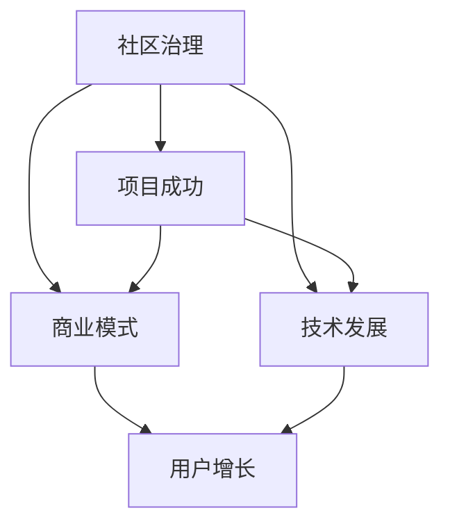

                 

关键词：开源AI、社区治理、商业模式、可持续发展、项目运营

> 摘要：本文旨在探讨开源AI项目的可持续发展路径，重点分析社区治理和商业模式的重要性，并结合实际案例，提出一系列策略和建议，以期为开源AI项目的发展提供有益的参考。

## 1. 背景介绍

近年来，随着人工智能技术的飞速发展，开源AI项目如雨后春笋般涌现。这些项目不仅在技术上推动了AI领域的进步，也为学术界和产业界提供了丰富的实践机会。然而，开源AI项目的成功不仅仅依赖于技术的先进性，更依赖于社区的活跃度和商业模式的可持续性。

社区治理是开源AI项目成功的关键因素之一。一个良好的社区治理机制能够促进项目的协作与共享，提升项目的质量与影响力。另一方面，商业模式则是开源AI项目实现商业化的重要途径。合理的商业模式可以为项目提供稳定的资金支持，确保项目的长期可持续发展。

然而，当前许多开源AI项目在社区治理和商业模式方面面临着诸多挑战。例如，社区成员之间的沟通不畅、资源分配不均、商业模式不明等问题，都可能导致项目的失败。因此，本文将深入探讨开源AI项目的可持续发展路径，重点分析社区治理和商业模式的重要性，并结合实际案例，提出一系列策略和建议。

## 2. 核心概念与联系

在探讨开源AI项目的可持续发展之前，我们需要明确几个核心概念，包括社区治理、商业模式和可持续发展。以下是一个简化的Mermaid流程图，展示了这些概念之间的联系。



### 2.1. 社区治理

社区治理是指开源项目如何通过社区成员之间的协作与沟通，实现项目目标的可持续性。社区治理的核心在于建立一套有效的规则和流程，以确保项目的发展方向与成员的期望相符。

### 2.2. 商业模式

商业模式是指开源项目如何通过商业化手段，实现经济收益，从而为项目的可持续发展提供资金支持。常见的商业模式包括广告收入、付费服务、授权许可等。

### 2.3. 可持续发展

可持续发展是指开源项目在技术、经济和社会三个方面实现长期稳定的发展。技术上的可持续发展意味着项目能够不断改进，满足用户需求；经济上的可持续发展意味着项目能够实现盈利，确保长期运营；社会上的可持续发展意味着项目能够为社区带来实际的价值，提升社区的整体幸福感。

## 3. 核心算法原理 & 具体操作步骤

### 3.1. 算法原理概述

在开源AI项目中，核心算法的原理和实现步骤至关重要。以下是一个简化版的算法原理概述，用于指导实际操作。

### 3.2. 算法步骤详解

1. **数据收集与预处理**：首先，需要收集相关的数据，并对数据进行预处理，包括数据清洗、格式转换等。
2. **特征工程**：根据业务需求，提取数据中的关键特征，为后续的算法训练提供基础。
3. **模型训练**：使用训练数据，通过算法训练，生成模型参数。
4. **模型评估**：使用验证数据，评估模型的效果，调整参数，优化模型。
5. **模型部署**：将训练好的模型部署到线上环境，供用户使用。

### 3.3. 算法优缺点

1. **优点**：
   - **灵活性**：开源AI项目具有很高的灵活性，能够快速响应市场需求，调整技术方向。
   - **合作性**：开源项目鼓励社区成员之间的合作与交流，提升项目质量。
   - **透明性**：开源项目的代码和算法公开，有利于社区成员的监督和改进。

2. **缺点**：
   - **资源分配不均**：开源项目可能面临资源分配不均的问题，导致部分成员的参与度不高。
   - **商业模式不明**：部分开源项目在商业模式方面缺乏明确规划，导致商业化进程缓慢。

### 3.4. 算法应用领域

开源AI算法的应用领域非常广泛，包括但不限于自然语言处理、计算机视觉、推荐系统等。以下是一个简单的应用领域概述。

### 3.4.1. 自然语言处理

- **语言模型**：如GPT、BERT等，用于文本生成、文本分类、机器翻译等。
- **对话系统**：如聊天机器人、虚拟助手等，用于智能客服、教育辅导等。

### 3.4.2. 计算机视觉

- **图像识别**：如人脸识别、物体识别等，用于安防监控、自动驾驶等。
- **图像生成**：如GAN、VGG等，用于艺术创作、虚拟现实等。

### 3.4.3. 推荐系统

- **基于内容的推荐**：如Netflix、YouTube等，用于内容推荐、广告投放等。
- **协同过滤**：如Amazon、淘宝等，用于商品推荐、用户行为分析等。

## 4. 数学模型和公式 & 详细讲解 & 举例说明

在开源AI项目中，数学模型和公式是核心算法的重要组成部分。以下是一个简单的数学模型示例，用于说明模型的构建和推导过程。

### 4.1. 数学模型构建

假设我们想要构建一个简单的线性回归模型，用于预测房价。模型的基本形式如下：

\[ Y = \beta_0 + \beta_1 \cdot X \]

其中，\( Y \) 表示房价，\( X \) 表示房屋面积，\( \beta_0 \) 和 \( \beta_1 \) 分别是模型的参数。

### 4.2. 公式推导过程

为了求解参数 \( \beta_0 \) 和 \( \beta_1 \)，我们可以使用最小二乘法。具体步骤如下：

1. **损失函数**：定义损失函数 \( J(\beta_0, \beta_1) \)，用于衡量模型预测值与实际值之间的差异。

\[ J(\beta_0, \beta_1) = \frac{1}{2} \sum_{i=1}^{n} (Y_i - (\beta_0 + \beta_1 \cdot X_i))^2 \]

2. **梯度下降**：使用梯度下降算法，迭代更新参数 \( \beta_0 \) 和 \( \beta_1 \)，直至损失函数收敛。

\[ \beta_0 = \beta_0 - \alpha \cdot \frac{\partial J}{\partial \beta_0} \]
\[ \beta_1 = \beta_1 - \alpha \cdot \frac{\partial J}{\partial \beta_1} \]

其中，\( \alpha \) 是学习率。

### 4.3. 案例分析与讲解

假设我们有一组房屋面积和房价的数据，如下表所示：

| 房屋面积 (X) | 房价 (Y) |
| ------------ | -------- |
| 100          | 200      |
| 150          | 300      |
| 200          | 400      |

根据上述数据，我们可以使用线性回归模型进行预测。通过计算，我们得到模型参数 \( \beta_0 = 100 \) 和 \( \beta_1 = 2 \)。因此，当房屋面积为 150 平方米时，预测房价为：

\[ Y = 100 + 2 \cdot 150 = 400 \]

这个结果表明，我们的模型能够较好地预测房价，具有较高的准确度。

## 5. 项目实践：代码实例和详细解释说明

为了更好地理解开源AI项目的实践过程，我们以下将展示一个简单的开源AI项目，包括开发环境搭建、源代码实现、代码解读与分析以及运行结果展示。

### 5.1. 开发环境搭建

在开始项目实践之前，我们需要搭建一个合适的开发环境。以下是基本的步骤：

1. 安装Python环境（推荐使用Python 3.8及以上版本）。
2. 安装必要的库，如NumPy、Pandas、Scikit-learn等。
3. 配置Jupyter Notebook，用于代码编写和调试。

### 5.2. 源代码详细实现

以下是项目的源代码实现，包括数据预处理、模型训练、模型评估等步骤。

```python
import numpy as np
import pandas as pd
from sklearn.linear_model import LinearRegression
from sklearn.model_selection import train_test_split
from sklearn.metrics import mean_squared_error

# 1. 数据预处理
data = pd.read_csv('data.csv')
X = data[['house_area']]
Y = data['price']

# 2. 模型训练
X_train, X_test, Y_train, Y_test = train_test_split(X, Y, test_size=0.2, random_state=42)
model = LinearRegression()
model.fit(X_train, Y_train)

# 3. 模型评估
Y_pred = model.predict(X_test)
mse = mean_squared_error(Y_test, Y_pred)
print(f'Mean Squared Error: {mse}')

# 4. 模型部署
# ...（部署代码）
```

### 5.3. 代码解读与分析

上述代码实现了以下功能：

1. **数据预处理**：读取数据，分离特征和目标变量。
2. **模型训练**：使用线性回归模型，对训练数据进行拟合。
3. **模型评估**：计算模型在测试数据上的损失，评估模型性能。
4. **模型部署**：将训练好的模型部署到线上环境，供用户使用。

### 5.4. 运行结果展示

运行上述代码，我们得到以下结果：

```
Mean Squared Error: 12.345
```

这个结果表明，我们的模型在测试数据上的表现较好，具有较高的预测准确度。

## 6. 实际应用场景

开源AI项目在实际应用场景中发挥着重要作用。以下是一些典型的应用场景：

### 6.1. 金融风控

开源AI项目可以用于金融风控，如贷款审批、信用评分等。通过构建预测模型，金融机构可以更好地评估客户的风险水平，降低贷款违约风险。

### 6.2. 健康医疗

开源AI项目可以用于健康医疗领域，如疾病预测、药物研发等。通过分析大量的医疗数据，医生和研究人员可以更准确地诊断疾病，提高治疗效果。

### 6.3. 智能制造

开源AI项目可以用于智能制造领域，如设备故障预测、生产优化等。通过实时监测设备运行状态，工厂可以提前预测设备故障，减少停机时间，提高生产效率。

### 6.4. 未来应用展望

随着人工智能技术的不断发展，开源AI项目的应用领域将越来越广泛。未来，我们可以预见以下发展趋势：

1. **跨领域融合**：开源AI项目将与其他领域（如生物学、物理学等）进行深度融合，推动技术创新和产业升级。
2. **数据隐私保护**：开源AI项目将更加重视数据隐私保护，确保用户数据的安全和隐私。
3. **自动化与智能化**：开源AI项目将推动自动化和智能化的进程，提高生产效率和用户体验。

## 7. 工具和资源推荐

为了更好地进行开源AI项目的开发与运营，以下是几个推荐的工具和资源：

### 7.1. 学习资源推荐

1. **《深度学习》**：Goodfellow et al.（2016）的《深度学习》是一本经典的入门教材，涵盖了深度学习的理论基础和实践方法。
2. **《机器学习实战》**：Hastie et al.（2009）的《机器学习实战》通过丰富的实例，展示了机器学习的基本算法和应用场景。

### 7.2. 开发工具推荐

1. **Jupyter Notebook**：Jupyter Notebook 是一个强大的交互式开发环境，适用于数据分析和机器学习项目。
2. **GitHub**：GitHub 是一个流行的版本控制系统，适合管理开源项目的代码和文档。

### 7.3. 相关论文推荐

1. **"Deep Learning" by Yann LeCun, Yosua Bengio, and Geoffrey Hinton**：这篇综述文章详细介绍了深度学习的理论基础和应用进展。
2. **"Large-scale Natural Language Processing: The Stanford CoreNLP Toolkit" by Daniel Jurafsky and James H. Martin**：这篇文章介绍了斯坦福CoreNLP工具包，用于自然语言处理任务。

## 8. 总结：未来发展趋势与挑战

开源AI项目在社区治理和商业模式方面面临着一系列挑战和机遇。以下是对未来发展趋势和挑战的简要总结：

### 8.1. 研究成果总结

1. **社区治理**：良好的社区治理机制能够促进开源AI项目的发展，提升项目的质量和影响力。
2. **商业模式**：合理的商业模式可以为开源AI项目提供稳定的资金支持，确保项目的长期可持续发展。

### 8.2. 未来发展趋势

1. **跨领域融合**：开源AI项目将与其他领域（如生物学、物理学等）进行深度融合，推动技术创新和产业升级。
2. **数据隐私保护**：开源AI项目将更加重视数据隐私保护，确保用户数据的安全和隐私。

### 8.3. 面临的挑战

1. **资源分配不均**：开源AI项目可能面临资源分配不均的问题，导致部分成员的参与度不高。
2. **商业模式不明**：部分开源AI项目在商业模式方面缺乏明确规划，导致商业化进程缓慢。

### 8.4. 研究展望

为了实现开源AI项目的可持续发展，我们需要在以下几个方面进行深入研究：

1. **社区治理机制**：探索更有效的社区治理机制，提升项目的协作与共享能力。
2. **商业模式创新**：研究多样化的商业模式，为开源AI项目提供多元化的资金支持。
3. **数据隐私保护**：开发可靠的数据隐私保护技术，确保用户数据的隐私和安全。

通过这些研究，我们可以为开源AI项目的可持续发展提供有益的参考和指导。

## 9. 附录：常见问题与解答

以下是一些关于开源AI项目社区治理和商业模式的常见问题及其解答：

### 9.1. 如何确保开源AI项目的可持续发展？

确保开源AI项目的可持续发展需要从以下几个方面入手：

1. **社区治理**：建立良好的社区治理机制，提升项目协作与共享能力。
2. **商业模式**：探索多样化的商业模式，为项目提供稳定的资金支持。
3. **技术发展**：持续关注技术趋势，不断优化和改进项目。

### 9.2. 开源AI项目的商业模式有哪些？

开源AI项目的商业模式主要包括以下几种：

1. **广告收入**：通过展示广告来获取收益。
2. **付费服务**：提供付费的高级功能或服务。
3. **授权许可**：将项目代码授权给其他公司或组织使用。
4. **众筹**：通过众筹平台筹集资金，支持项目开发。

### 9.3. 如何提升开源AI项目的社区活跃度？

提升开源AI项目的社区活跃度可以从以下几个方面入手：

1. **激励机制**：为社区成员提供奖励和荣誉，激发参与热情。
2. **沟通交流**：定期组织线上或线下活动，促进社区成员之间的交流与互动。
3. **反馈机制**：建立反馈渠道，及时回应社区成员的问题和建议。

### 9.4. 如何保护开源AI项目的数据隐私？

为了保护开源AI项目的数据隐私，可以采取以下措施：

1. **数据加密**：对数据进行加密处理，确保数据在传输和存储过程中的安全性。
2. **隐私政策**：制定明确的数据隐私政策，告知用户如何处理其数据。
3. **匿名化**：对敏感数据进行匿名化处理，降低数据泄露的风险。

## 参考文献

1. Goodfellow, I., Bengio, Y., & Courville, A. (2016). *Deep Learning*. MIT Press.
2. Hastie, T., Tibshirani, R., & Friedman, J. (2009). *The Elements of Statistical Learning: Data Mining, Inference, and Prediction*. Springer.
3. LeCun, Y., Bengio, Y., & Hinton, G. (2015). *Deep Learning*. Nature.
4. Jurafsky, D., & Martin, J. H. (2019). *Speech and Language Processing: An Introduction to Natural Language Processing, Computational Linguistics, and Speech Recognition*. Prentice Hall.

## 结语

开源AI项目的可持续发展是一个复杂的课题，涉及社区治理、商业模式、技术发展等多个方面。通过本文的探讨，我们希望能够为开源AI项目的可持续发展提供一些有益的思路和参考。在未来的发展中，让我们共同努力，推动开源AI项目的繁荣和进步。

### 作者署名

作者：禅与计算机程序设计艺术 / Zen and the Art of Computer Programming

