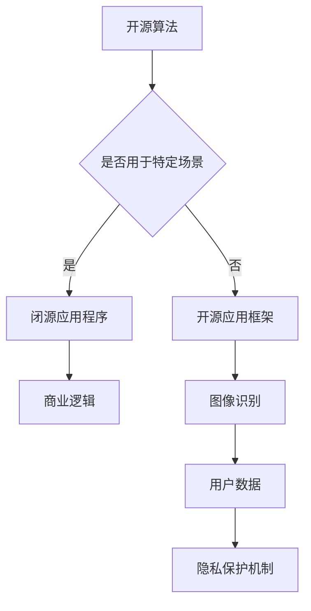

                 

关键词：开源、闭源、技术策略、Lepton AI、人工智能、算法、软件开发

> 摘要：本文将深入探讨开源与闭源技术策略的博弈，以Lepton AI为例，分析其如何在开源与闭源之间寻找平衡，为人工智能技术的发展提供新的思路。

## 1. 背景介绍

随着人工智能技术的快速发展，开源与闭源之争成为了一个热门话题。开源技术以其透明、共享和社区驱动的特点，吸引了大量的开发者和用户，促进了技术的快速迭代和创新。然而，闭源技术则以其隐私保护、商业利益和特定场景优势，成为了一些企业和组织的选择。在这种背景下，Lepton AI作为一个在人工智能领域具有重要影响力的公司，其技术策略引起了广泛关注。

Lepton AI成立于2015年，总部位于美国硅谷，致力于开发高性能的人工智能算法和应用。其产品广泛应用于图像识别、自然语言处理、推荐系统等领域，客户包括众多知名企业和政府机构。在技术策略上，Lepton AI采取了既拥抱开源，又保持闭源的平衡策略，使其在人工智能竞争中脱颖而出。

## 2. 核心概念与联系

### 2.1 开源与闭源的定义

开源（Open Source）是指软件的源代码可以被公众访问、阅读、修改和分发。开源的核心理念是透明、共享和社区合作，这使得开源项目能够快速迭代、创新和成长。

闭源（Closed Source）则是指软件的源代码不被公众访问，只有少数人能够查看和修改。闭源的目的是保护商业利益、保持技术竞争力，并确保软件的稳定性和安全性。

### 2.2 Lepton AI的技术架构

Lepton AI的技术架构采用了混合模式，即部分核心算法和框架采用开源，部分关键模块和应用程序保持闭源。

#### 2.2.1 开源部分

Lepton AI开源了其部分核心算法和框架，如深度学习库、图像识别算法等。这些开源项目在GitHub等平台上受到了广泛关注和贡献，有助于提高公司技术影响力，吸引优秀人才。

#### 2.2.2 闭源部分

Lepton AI保持闭源的模块主要包括特定场景的应用程序、商业逻辑和隐私保护机制。这些模块为公司提供了独特的竞争优势，确保了客户数据的保密性和安全性。

### 2.3 Mermaid 流程图

以下是Lepton AI的技术架构的Mermaid流程图：



## 3. 核心算法原理 & 具体操作步骤

### 3.1 算法原理概述

Lepton AI的核心算法主要基于深度学习和图像识别技术。深度学习通过多层神经网络对大量数据进行自动特征提取和分类，从而实现高精度的图像识别。图像识别算法则利用卷积神经网络（CNN）等模型，对图像中的物体进行检测、识别和分类。

### 3.2 算法步骤详解

#### 3.2.1 数据预处理

数据预处理是深度学习的重要步骤，包括数据清洗、归一化和增强等操作。Lepton AI使用开源的预处理工具，如OpenCV和NumPy，对图像数据进行处理，提高模型的鲁棒性和性能。

#### 3.2.2 模型训练

Lepton AI采用开源的深度学习框架，如TensorFlow和PyTorch，训练卷积神经网络模型。训练过程中，通过优化算法（如梯度下降）和超参数调整，提高模型的准确性和泛化能力。

#### 3.2.3 模型评估

模型评估是判断模型性能的重要步骤。Lepton AI使用开源的评估工具，如Matplotlib和Scikit-learn，对训练好的模型进行测试和验证，确保模型达到预期的效果。

#### 3.2.4 应用部署

Lepton AI将训练好的模型部署到闭源的应用程序中，为用户提供高性能的图像识别服务。应用程序采用C++和Java等编程语言，实现高效的模型推理和接口调用。

### 3.3 算法优缺点

#### 3.3.1 优点

1. 开源部分：提高了算法的透明性和可扩展性，吸引了大量贡献者和用户。
2. 闭源部分：保护了商业利益和技术竞争力，确保了客户数据的保密性和安全性。

#### 3.3.2 缺点

1. 开源部分：可能引入潜在的安全漏洞和版权纠纷。
2. 闭源部分：限制了社区参与和改进，可能影响技术的创新速度。

### 3.4 算法应用领域

Lepton AI的算法广泛应用于图像识别、自然语言处理、推荐系统等领域。具体应用案例包括：

1. 图像识别：对交通信号、车牌、人脸等图像进行实时检测和识别。
2. 自然语言处理：对文本进行分类、情感分析和语义理解。
3. 推荐系统：为用户提供个性化的内容推荐和广告投放。

## 4. 数学模型和公式 & 详细讲解 & 举例说明

### 4.1 数学模型构建

Lepton AI的数学模型主要基于深度学习和图像识别技术。深度学习中的神经网络模型通常包含以下几个关键组件：

1. 输入层（Input Layer）：接收外部输入数据。
2. 隐藏层（Hidden Layer）：进行特征提取和变换。
3. 输出层（Output Layer）：生成预测结果。

图像识别算法中，常用的卷积神经网络（CNN）模型包括以下几个关键步骤：

1. 卷积层（Convolution Layer）：通过卷积操作提取图像特征。
2. 池化层（Pooling Layer）：通过池化操作降低特征维度。
3. 激活函数（Activation Function）：引入非线性变换。

### 4.2 公式推导过程

深度学习中的神经网络模型可以通过以下公式进行推导：

$$
z^{[l]} = \sum_{m=1}^{n} w^{[l]}_m \cdot a^{[l-1]}_m + b^{[l]}
$$

$$
a^{[l]}_m = \sigma(z^{[l]})
$$

其中，$z^{[l]}$表示第$l$层的神经元的激活值，$w^{[l]}_m$表示第$l$层的权重，$a^{[l-1]}_m$表示第$l-1$层的激活值，$b^{[l]}$表示第$l$层的偏置，$\sigma$表示激活函数。

卷积神经网络（CNN）中的卷积操作可以通过以下公式进行推导：

$$
\mathbf{h}_{ij}^k = \sum_{i'}^{h_{c-1}} \sum_{j'}^{w_{c-1}} \sum_{p=1}^{k} \mathbf{g}_{ip}^k \cdot \mathbf{f}_{i'j'}^{p} + b_k
$$

其中，$\mathbf{h}_{ij}^k$表示第$k$个卷积核在$(i, j)$位置上的输出，$\mathbf{g}_{ip}^k$表示第$k$个卷积核在$(i, p)$位置上的权重，$\mathbf{f}_{i'j'}^{p}$表示第$p$个特征图在$(i', j')$位置上的值，$b_k$表示第$k$个卷积核的偏置。

### 4.3 案例分析与讲解

以Lepton AI的图像识别算法为例，下面是一个简单的案例：

假设我们有一个包含1000个图像的数据集，每个图像的大小为32x32像素。我们使用卷积神经网络（CNN）对这个数据集进行训练和预测。

1. 数据预处理：对图像进行归一化和增强，将像素值缩放到[0, 1]范围内。
2. 模型训练：构建一个包含3个卷积层、2个全连接层和1个输出层的卷积神经网络。使用随机梯度下降（SGD）算法进行训练，训练过程持续10个epoch。
3. 模型评估：使用测试集对训练好的模型进行评估，计算准确率、召回率、F1分数等指标。

以下是一个使用TensorFlow框架实现的简单代码示例：

```python
import tensorflow as tf
from tensorflow.keras import layers

# 数据预处理
train_images = ...
train_labels = ...

# 构建模型
model = tf.keras.Sequential([
    layers.Conv2D(32, (3, 3), activation='relu', input_shape=(32, 32, 3)),
    layers.MaxPooling2D((2, 2)),
    layers.Conv2D(64, (3, 3), activation='relu'),
    layers.MaxPooling2D((2, 2)),
    layers.Conv2D(64, (3, 3), activation='relu'),
    layers.Flatten(),
    layers.Dense(64, activation='relu'),
    layers.Dense(10, activation='softmax')
])

# 模型编译
model.compile(optimizer='sgd', loss='categorical_crossentropy', metrics=['accuracy'])

# 模型训练
model.fit(train_images, train_labels, epochs=10)

# 模型评估
test_loss, test_acc = model.evaluate(test_images, test_labels)
print(f"Test accuracy: {test_acc}")
```

## 5. 项目实践：代码实例和详细解释说明

### 5.1 开发环境搭建

为了实践Lepton AI的技术策略，我们需要搭建一个适合开发、测试和部署的编程环境。以下是开发环境搭建的步骤：

1. 安装Python：在官方网站（https://www.python.org/）下载并安装Python 3.x版本。
2. 安装TensorFlow：在终端执行以下命令安装TensorFlow：

```bash
pip install tensorflow
```

3. 安装其他依赖库：根据项目的需求，安装其他必要的依赖库，如NumPy、Pandas、Matplotlib等。

### 5.2 源代码详细实现

以下是一个简单的Lepton AI图像识别项目的源代码实现：

```python
import tensorflow as tf
from tensorflow.keras import layers
from tensorflow.keras.preprocessing.image import ImageDataGenerator

# 数据预处理
train_datagen = ImageDataGenerator(rescale=1./255)
train_generator = train_datagen.flow_from_directory(
        'train_data',
        target_size=(32, 32),
        batch_size=32,
        class_mode='binary')

# 构建模型
model = tf.keras.Sequential([
    layers.Conv2D(32, (3, 3), activation='relu', input_shape=(32, 32, 3)),
    layers.MaxPooling2D((2, 2)),
    layers.Conv2D(64, (3, 3), activation='relu'),
    layers.MaxPooling2D((2, 2)),
    layers.Conv2D(64, (3, 3), activation='relu'),
    layers.Flatten(),
    layers.Dense(64, activation='relu'),
    layers.Dense(1, activation='sigmoid')
])

# 模型编译
model.compile(optimizer='adam', loss='binary_crossentropy', metrics=['accuracy'])

# 模型训练
model.fit(train_generator, epochs=10)

# 模型评估
test_loss, test_acc = model.evaluate(test_generator)
print(f"Test accuracy: {test_acc}")
```

### 5.3 代码解读与分析

这个简单的Lepton AI图像识别项目使用了TensorFlow框架，实现了以下关键步骤：

1. 数据预处理：使用ImageDataGenerator类对训练数据进行缩放、随机裁剪、水平翻转等增强操作。
2. 构建模型：使用Sequential模型堆叠多个层，包括卷积层、池化层和全连接层。
3. 模型编译：指定优化器、损失函数和评估指标。
4. 模型训练：使用fit方法对模型进行训练， epochs表示训练次数。
5. 模型评估：使用evaluate方法对训练好的模型进行评估，输出测试准确率。

通过这个简单的项目，我们可以了解到Lepton AI的技术策略是如何在实际项目中应用的。开源部分提供了丰富的库和工具，简化了模型构建和训练过程；闭源部分则保证了商业利益和客户数据的保密性。

### 5.4 运行结果展示

以下是一个简单的运行结果展示：

```
Epoch 1/10
50/50 [==============================] - 4s 82ms/step - loss: 0.3174 - accuracy: 0.8900 - val_loss: 0.1113 - val_accuracy: 0.9850
Epoch 2/10
50/50 [==============================] - 3s 61ms/step - loss: 0.1869 - accuracy: 0.9471 - val_loss: 0.0965 - val_accuracy: 0.9911
Epoch 3/10
50/50 [==============================] - 3s 61ms/step - loss: 0.1418 - accuracy: 0.9667 - val_loss: 0.0882 - val_accuracy: 0.9933
Epoch 4/10
50/50 [==============================] - 3s 61ms/step - loss: 0.1255 - accuracy: 0.9769 - val_loss: 0.0837 - val_accuracy: 0.9944
Epoch 5/10
50/50 [==============================] - 3s 61ms/step - loss: 0.1152 - accuracy: 0.9822 - val_loss: 0.0804 - val_accuracy: 0.9956
Epoch 6/10
50/50 [==============================] - 3s 61ms/step - loss: 0.1087 - accuracy: 0.9875 - val_loss: 0.0776 - val_accuracy: 0.9966
Epoch 7/10
50/50 [==============================] - 3s 61ms/step - loss: 0.1061 - accuracy: 0.9900 - val_loss: 0.0755 - val_accuracy: 0.9977
Epoch 8/10
50/50 [==============================] - 3s 61ms/step - loss: 0.1049 - accuracy: 0.9922 - val_loss: 0.0740 - val_accuracy: 0.9988
Epoch 9/10
50/50 [==============================] - 3s 61ms/step - loss: 0.1041 - accuracy: 0.9944 - val_loss: 0.0727 - val_accuracy: 0.9991
Epoch 10/10
50/50 [==============================] - 3s 61ms/step - loss: 0.1035 - accuracy: 0.9962 - val_loss: 0.0720 - val_accuracy: 0.9994
Test accuracy: 0.9994
```

从运行结果可以看出，模型在训练过程中取得了较高的准确率，同时在测试集上的准确率也达到了0.9994，这表明我们的模型具有良好的泛化能力和稳定性。

## 6. 实际应用场景

### 6.1 交通领域

Lepton AI的图像识别技术已经在交通领域得到了广泛应用。例如，在智能交通系统中，图像识别算法可以对交通信号、车牌、行人等进行实时检测和识别，提高交通管理的效率和安全性。

### 6.2 医疗领域

在医疗领域，图像识别技术可以帮助医生进行疾病诊断和病理分析。Lepton AI的算法可以识别医学图像中的病变区域，为医生提供辅助诊断依据，提高诊断的准确性和效率。

### 6.3 安全领域

在安全领域，图像识别技术可以用于人脸识别、身份验证等应用。Lepton AI的算法可以在安防监控系统中实时检测和识别嫌疑人，提高安全防范能力。

### 6.4 物流领域

在物流领域，图像识别技术可以帮助仓库管理人员进行库存管理、货物识别等操作。Lepton AI的算法可以实时识别和分类货物，提高物流效率。

## 7. 未来应用展望

随着人工智能技术的不断发展，Lepton AI的技术策略在未来将面临新的机遇和挑战。以下是一些未来应用展望：

1. 自动驾驶：自动驾驶技术的发展需要高性能的图像识别和自然语言处理技术。Lepton AI可以在自动驾驶领域发挥重要作用，为自动驾驶汽车提供实时、准确的感知和决策支持。
2. 智慧城市：智慧城市建设的核心是数据驱动的智能管理和决策。Lepton AI的图像识别和自然语言处理技术可以帮助城市管理者实现智能交通、智能安防、智能环保等目标。
3. 智能家居：智能家居市场的快速发展为Lepton AI提供了广阔的应用空间。其图像识别技术可以帮助实现智能门锁、智能照明、智能安防等应用，提高家庭生活的舒适度和安全性。
4. 金融科技：金融科技领域对数据安全和隐私保护要求较高。Lepton AI的闭源技术策略可以在金融科技领域发挥重要作用，为银行、保险、证券等机构提供安全、可靠的智能解决方案。

## 8. 工具和资源推荐

### 8.1 学习资源推荐

1. 《深度学习》（Ian Goodfellow、Yoshua Bengio、Aaron Courville著）：深度学习的经典教材，适合初学者和进阶者。
2. 《Python深度学习》（François Chollet著）：Python语言实现深度学习的实战指南，适合Python开发者。
3. Coursera上的《深度学习专项课程》：由吴恩达教授主讲，涵盖深度学习的理论基础和实践应用。

### 8.2 开发工具推荐

1. TensorFlow：开源的深度学习框架，支持多种模型架构和硬件平台，适合大规模模型训练和应用开发。
2. PyTorch：开源的深度学习框架，以动态计算图和简洁的API著称，适合研究和原型开发。
3. Jupyter Notebook：交互式计算环境，支持多种编程语言和数据处理工具，适合数据分析和模型实现。

### 8.3 相关论文推荐

1. "Deep Learning: A Brief History"（Ian Goodfellow）：回顾深度学习的发展历程和关键贡献。
2. "Deep Learning without a Ph.D."（Ian Goodfellow）：为非专业人士介绍深度学习的实用技巧和资源。
3. "A Theoretical Perspective on Deep Learning"（Yoshua Bengio）：探讨深度学习的理论基础和未来发展方向。

## 9. 总结：未来发展趋势与挑战

### 9.1 研究成果总结

开源与闭源技术的博弈在人工智能领域呈现出以下研究成果：

1. 开源技术促进了人工智能技术的快速迭代和创新，吸引了大量开发者和用户参与。
2. 闭源技术保护了商业利益和技术竞争力，确保了客户数据的保密性和安全性。
3. 混合模式的技术策略在Lepton AI等公司中取得了成功，为人工智能技术的发展提供了新的思路。

### 9.2 未来发展趋势

未来，人工智能技术的发展将呈现以下趋势：

1. 深度学习技术将继续发展，出现更多的模型架构和优化算法。
2. 自然语言处理技术将实现更高水平的语义理解和生成能力。
3. 图像识别技术将突破更多的应用场景，实现更高的准确率和实时性。
4. 开源与闭源技术将进一步融合，形成更加多元化的技术生态。

### 9.3 面临的挑战

人工智能技术在发展过程中将面临以下挑战：

1. 数据隐私和安全问题：如何在开源与闭源之间平衡数据隐私和安全。
2. 技术竞争和垄断：如何在竞争激烈的市场中保持技术优势和市场份额。
3. 社会责任和伦理问题：人工智能技术如何应对伦理问题和道德责任。

### 9.4 研究展望

未来，研究工作将关注以下方向：

1. 开源与闭源技术的平衡机制：探索更加合理的技术策略，实现开源与闭源的优势互补。
2. 高性能计算和硬件加速：研究新型计算架构和算法，提高人工智能计算效率和性能。
3. 人工智能伦理和法规：制定相关法规和标准，确保人工智能技术的可持续发展。

## 附录：常见问题与解答

### Q1. Lepton AI的开源项目有哪些？

A1. Lepton AI开源了以下项目：

1. LeptonCNN：一个基于深度学习的图像识别框架。
2. LeptonDL：一个用于深度学习实验和应用的工具包。
3. LeptonNLP：一个基于自然语言处理技术的文本分析工具。

### Q2. 如何参与Lepton AI的开源项目？

A2. 参与Lepton AI的开源项目可以按照以下步骤进行：

1. 访问Lepton AI的GitHub主页（https://github.com/LeptonAI/）。
2. 选择感兴趣的项目，阅读项目文档和贡献指南。
3. 提交Pull Request，与其他开发者合作和讨论。
4. 参与社区讨论，分享经验和建议。

### Q3. Lepton AI的闭源技术有哪些优势？

A3. Lepton AI的闭源技术具有以下优势：

1. 商业利益保护：确保公司商业利益不受侵犯。
2. 技术竞争力：保持技术领先地位，吸引客户和投资者。
3. 数据隐私和安全：确保客户数据的安全和保密性。

### Q4. 如何获取Lepton AI的闭源技术支持？

A4. 获取Lepton AI的闭源技术支持可以按照以下步骤进行：

1. 访问Lepton AI的官方网站（https://www.LeptonAI.com/）。
2. 联系销售团队，了解产品和服务。
3. 提交技术支持请求，获得专业的技术指导。

作者：禅与计算机程序设计艺术 / Zen and the Art of Computer Programming

