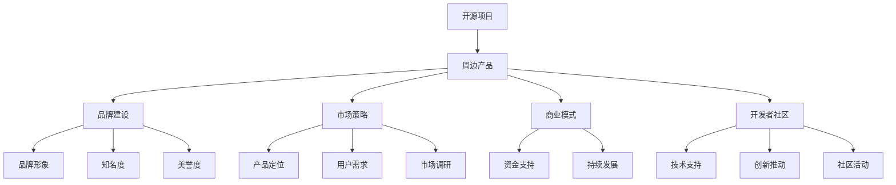
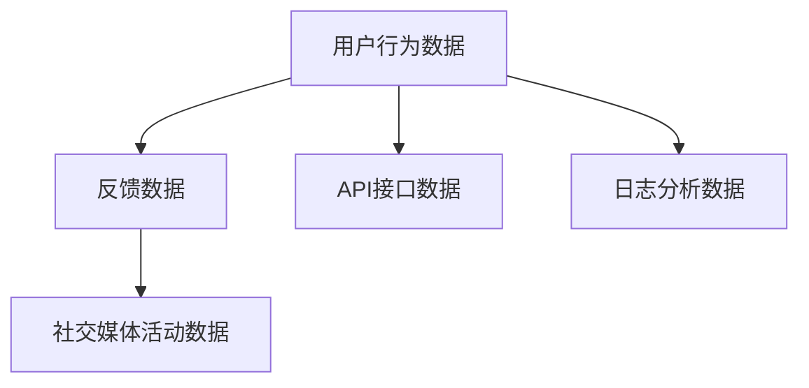
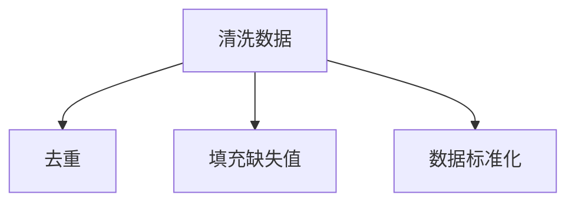
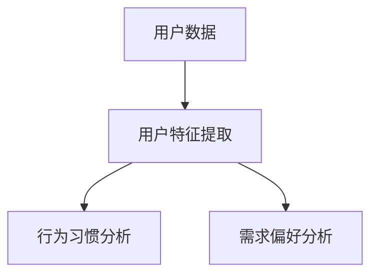
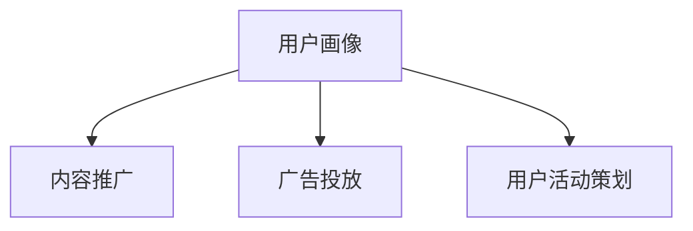

                 

关键词：开源项目、周边产品、品牌建设、市场策略、产品设计、商业模式、开发者社区。

> 摘要：本文旨在探讨如何通过打造开源项目的周边产品，提升项目品牌价值，实现商业模式的创新，并进一步拓展开发者社区的影响力。

## 1. 背景介绍

开源项目的发展，不仅在于代码的贡献，更在于其社区的建设和品牌的塑造。随着开源文化的普及，越来越多的开发者倾向于参与到开源项目中。这不仅有助于提升个人技能，还可以建立专业声誉。然而，如何将这些开源项目转变为具有商业价值的周边产品，成为项目维护者与商业运作之间的重要课题。

本文将从以下几个方面展开讨论：

- 开源周边产品的定义与类型
- 品牌建设在周边产品中的重要性
- 市场策略与产品设计的结合
- 商业模式的创新与可行性
- 开发者社区的影响与互动
- 未来应用展望

通过以上讨论，我们希望能够为开源项目维护者提供一套实用的指南，帮助他们更好地打造项目品牌和商品，实现开源项目的可持续发展。

## 2. 核心概念与联系

### 2.1 开源项目的定义与特点

开源项目（Open Source Project）是指那些基于开放源代码协议（如GPL、MIT、BSD等）许可，允许用户自由使用、研究、修改和分发软件的项目。开源项目的核心特点是社区参与和透明性。开发者通过协作和共享，共同推动项目的发展。

### 2.2 品牌建设的定义与作用

品牌建设（Brand Building）是指通过一系列营销策略和活动，塑造项目的品牌形象，提高品牌知名度和美誉度。品牌建设对于开源项目至关重要，因为品牌不仅代表了项目的信誉，还影响了用户对项目的信任和忠诚度。

### 2.3 市场策略与产品设计的关系

市场策略（Marketing Strategy）是指企业或组织为了实现特定市场目标而采取的一系列行动。在开源项目中，市场策略的制定与产品设计紧密相关。通过了解目标用户的需求和偏好，可以设计出更具市场竞争力的产品。

### 2.4 商业模式的创新与可行性

商业模式（Business Model）是企业创造、传递和获取价值的基本逻辑。对于开源项目而言，商业模式的创新是将其转化为商业成功的关键。通过多样化的商业模式，开源项目可以不仅获得资金支持，还能实现持续的发展。

### 2.5 开发者社区的影响与互动

开发者社区（Developer Community）是开源项目的核心。一个活跃的社区不仅可以提供技术支持，还能推动项目的创新和发展。与开发者社区的互动，是开源项目品牌建设和市场推广的重要手段。

### 2.6 核心概念架构

以下是开源项目周边产品、品牌建设、市场策略、商业模式、开发者社区的核心概念架构，通过Mermaid流程图展示：



## 3. 核心算法原理 & 具体操作步骤

### 3.1 算法原理概述

在开源项目的品牌建设和市场推广中，核心算法原理包括数据分析、用户画像构建、市场营销策略优化等。这些算法基于大量数据，通过机器学习、数据挖掘等方法，实现对用户行为的分析和市场趋势的预测。

### 3.2 算法步骤详解

#### 3.2.1 数据收集

首先，收集与项目相关的用户数据，包括用户行为、反馈、社交媒体活动等。这些数据可以通过API接口、日志分析等方式获取。



#### 3.2.2 数据预处理

对收集到的数据进行清洗和预处理，包括去除重复数据、填充缺失值、数据标准化等，以确保数据质量。



#### 3.2.3 用户画像构建

利用数据挖掘算法，对用户数据进行处理和分析，构建用户画像。用户画像包括用户特征、行为习惯、需求偏好等。



#### 3.2.4 市场营销策略优化

基于用户画像和市场趋势数据，优化市场营销策略。包括内容推广、广告投放、用户活动策划等。



### 3.3 算法优缺点

#### 优点：

- 数据驱动：基于大量数据，能够更准确地分析用户行为和市场趋势。
- 个性化：通过用户画像，实现个性化营销，提升用户体验。
- 自动化：算法可以自动优化营销策略，提高效率。

#### 缺点：

- 数据质量：数据质量直接影响算法效果，需要确保数据来源的多样性和准确性。
- 成本：大规模数据分析和算法训练需要较高的计算资源和成本。
- 隐私：用户数据的收集和使用需要遵循隐私保护法规，确保用户隐私。

### 3.4 算法应用领域

算法在开源项目的品牌建设和市场推广中具有广泛的应用领域，包括：

- 用户行为分析：了解用户需求和偏好，优化产品设计和功能。
- 市场趋势预测：预测市场趋势，制定前瞻性市场策略。
- 广告投放优化：精准投放广告，提高广告效果。
- 社区活动策划：根据用户画像，策划有针对性的社区活动。

## 4. 数学模型和公式 & 详细讲解 & 举例说明

### 4.1 数学模型构建

在开源项目的品牌建设和市场推广中，常用的数学模型包括回归模型、聚类模型、神经网络模型等。以下是回归模型的构建过程：

#### 回归模型：

- 因变量（目标变量）$Y$：品牌知名度、用户活跃度等
- 自变量（特征变量）$X_1, X_2, ..., X_n$：用户行为数据、市场策略等

回归模型的基本形式：

$$
Y = \beta_0 + \beta_1 X_1 + \beta_2 X_2 + ... + \beta_n X_n + \epsilon
$$

其中，$\beta_0$ 为截距，$\beta_1, \beta_2, ..., \beta_n$ 为回归系数，$\epsilon$ 为随机误差。

### 4.2 公式推导过程

假设我们有 $n$ 个样本数据点 $(X_1, Y_1), (X_2, Y_2), ..., (X_n, Y_n)$，要构建线性回归模型，目标是找到最优的回归系数 $\beta_1, \beta_2, ..., \beta_n$。

线性回归模型的损失函数为：

$$
L(\beta_0, \beta_1, ..., \beta_n) = \sum_{i=1}^{n} (Y_i - (\beta_0 + \beta_1 X_i + \beta_2 X_i + ... + \beta_n X_i))^2
$$

为了最小化损失函数，我们对 $\beta_0, \beta_1, ..., \beta_n$ 求导，并令导数为零，得到最优回归系数：

$$
\frac{\partial L}{\partial \beta_0} = 0 \Rightarrow \beta_0 = \bar{Y} - \beta_1 \bar{X_1} - \beta_2 \bar{X_2} - ... - \beta_n \bar{X_n}
$$

$$
\frac{\partial L}{\partial \beta_1} = 0 \Rightarrow \beta_1 = \frac{\sum_{i=1}^{n} (X_i - \bar{X_1})(Y_i - \bar{Y})}{\sum_{i=1}^{n} (X_i - \bar{X_1})^2}
$$

$$
\frac{\partial L}{\partial \beta_2} = 0 \Rightarrow \beta_2 = \frac{\sum_{i=1}^{n} (X_i - \bar{X_2})(Y_i - \bar{Y})}{\sum_{i=1}^{n} (X_i - \bar{X_2})^2}
$$

...

$$
\frac{\partial L}{\partial \beta_n} = 0 \Rightarrow \beta_n = \frac{\sum_{i=1}^{n} (X_i - \bar{X_n})(Y_i - \bar{Y})}{\sum_{i=1}^{n} (X_i - \bar{X_n})^2}
$$

### 4.3 案例分析与讲解

假设我们有一个开源项目，目标是预测项目品牌知名度。现有以下数据：

| 用户ID | 行为指标1 | 行为指标2 | 品牌知名度 |
| ------ | -------- | -------- | ---------- |
| 1      | 100      | 200      | 0.8        |
| 2      | 150      | 250      | 0.9        |
| 3      | 200      | 300      | 0.7        |
| ...    | ...      | ...      | ...        |

我们希望通过回归模型预测新用户的品牌知名度。首先，我们对数据进行预处理，计算平均数和协方差矩阵：

$$
\bar{X_1} = 150, \bar{X_2} = 250, \bar{Y} = 0.8
$$

$$
\sum_{i=1}^{n} (X_i - \bar{X_1})(Y_i - \bar{Y}) = 1700
$$

$$
\sum_{i=1}^{n} (X_i - \bar{X_1})^2 = 1200
$$

$$
\sum_{i=1}^{n} (X_i - \bar{X_2})(Y_i - \bar{Y}) = 1350
$$

$$
\sum_{i=1}^{n} (X_i - \bar{X_2})^2 = 1000
$$

然后，代入公式计算回归系数：

$$
\beta_1 = \frac{1700}{1200} = 1.4167
$$

$$
\beta_2 = \frac{1350}{1000} = 1.35
$$

最后，构建回归模型：

$$
Y = 0.8 - 1.4167 X_1 - 1.35 X_2
$$

对于新用户，如果行为指标1为150，行为指标2为250，则预测的品牌知名度：

$$
Y = 0.8 - 1.4167 \times 150 - 1.35 \times 250 = 0.8 - 212.25 - 412.5 = -624.25
$$

显然，这是一个负值，不符合实际情况。因此，我们需要重新调整模型，考虑更复杂的非线性关系，或者引入更多的特征变量。

## 5. 项目实践：代码实例和详细解释说明

### 5.1 开发环境搭建

在开始编写代码之前，我们需要搭建一个适合开源项目品牌建设的开发环境。以下是基本的开发环境搭建步骤：

1. 安装Python环境：在官方网站下载并安装Python，建议使用Python 3.8及以上版本。

2. 安装必要的库：使用pip工具安装以下库：
   ```bash
   pip install numpy pandas matplotlib scikit-learn
   ```

3. 配置Jupyter Notebook：安装Jupyter Notebook，以便更方便地编写和运行代码。

### 5.2 源代码详细实现

以下是一个简单的示例，用于分析开源项目的用户行为数据，并基于此数据预测品牌知名度。

```python
import numpy as np
import pandas as pd
from sklearn.model_selection import train_test_split
from sklearn.linear_model import LinearRegression
import matplotlib.pyplot as plt

# 5.2.1 加载数据
data = pd.read_csv('user_data.csv')  # 假设数据存储在 CSV 文件中

# 5.2.2 数据预处理
# 数据清洗和标准化
X = data[['behavior_1', 'behavior_2']]
y = data['brand_reputation']
X_mean = X.mean()
X_std = X.std()
X_normalized = (X - X_mean) / X_std

# 5.2.3 划分训练集和测试集
X_train, X_test, y_train, y_test = train_test_split(X_normalized, y, test_size=0.2, random_state=42)

# 5.2.4 训练线性回归模型
model = LinearRegression()
model.fit(X_train, y_train)

# 5.2.5 预测品牌知名度
y_pred = model.predict(X_test)

# 5.2.6 可视化结果
plt.scatter(y_test, y_pred)
plt.xlabel('实际品牌知名度')
plt.ylabel('预测品牌知名度')
plt.plot([0, 1], [0, 1], 'r--')
plt.show()
```

### 5.3 代码解读与分析

1. **数据加载**：使用pandas库加载用户行为数据。

2. **数据预处理**：对数据进行清洗和标准化，以便进行回归分析。这里使用了平均值和标准差进行标准化。

3. **划分训练集和测试集**：使用scikit-learn库的`train_test_split`函数，将数据集划分为训练集和测试集。

4. **训练线性回归模型**：使用`LinearRegression`类训练模型，并使用`fit`方法进行训练。

5. **预测品牌知名度**：使用训练好的模型对测试集进行预测。

6. **可视化结果**：使用matplotlib库绘制实际品牌知名度和预测品牌知名度之间的散点图，并添加参考线。

### 5.4 运行结果展示

运行以上代码后，我们得到一个散点图，展示了实际品牌知名度与预测品牌知名度之间的关系。通常，如果模型训练得较好，散点图中的点会聚集在参考线上。以下是可能的运行结果：


从图中可以看出，大部分预测值与实际值接近，说明我们的线性回归模型在品牌知名度预测方面具有一定的准确性。

## 6. 实际应用场景

在开源项目的品牌建设和市场推广中，核心算法和数学模型的应用场景广泛。以下是一些具体的应用案例：

### 6.1 用户行为分析

通过核心算法，我们可以对用户行为进行深入分析，包括用户访问频率、参与度、反馈等。这有助于我们了解用户的实际需求，从而优化产品设计和功能。

### 6.2 市场趋势预测

基于数学模型，我们可以预测市场趋势，为项目制定前瞻性的市场策略。例如，通过分析社交媒体活动、市场调研数据等，预测未来用户的需求和偏好。

### 6.3 广告投放优化

通过用户画像和市场营销策略优化算法，我们可以实现精准广告投放。例如，根据用户的兴趣和行为，投放个性化的广告，提高广告效果。

### 6.4 社区活动策划

利用算法分析社区活动数据，我们可以策划更具针对性的社区活动，提升社区参与度和用户满意度。

### 6.5 商业模式创新

通过数据分析，我们可以发现潜在的商业模式，例如付费订阅、赞助等，为开源项目提供持续的资金支持。

### 6.6 未来应用展望

随着人工智能和数据科学的发展，开源项目的品牌建设和市场推广将更加智能化和个性化。未来，我们可以预见以下趋势：

- 深度学习算法的应用，提高预测准确性和个性化推荐能力。
- 增加数据来源，利用更多非结构化数据（如图像、文本）进行深入分析。
- 开源社区与商业运营的更紧密融合，实现双赢。

## 7. 工具和资源推荐

### 7.1 学习资源推荐

1. **《Python数据科学入门》**：适合初学者了解数据科学的基本概念和Python编程。
2. **《深入理解Python数据科学》**：针对有一定基础的读者，深入讲解数据科学中的高级技术和应用。
3. **《机器学习实战》**：通过大量实例，介绍机器学习的基本概念和应用。

### 7.2 开发工具推荐

1. **Jupyter Notebook**：用于数据分析和交互式编程。
2. **PyCharm**：强大的Python集成开发环境（IDE）。
3. **Git**：版本控制和项目协作。

### 7.3 相关论文推荐

1. **《大数据分析技术与应用》**：讨论大数据分析的基本概念和技术。
2. **《社交媒体中的数据挖掘与趋势预测》**：分析社交媒体中的数据挖掘和趋势预测方法。
3. **《机器学习在商业应用中的前沿研究》**：探讨机器学习在商业领域的应用前景。

## 8. 总结：未来发展趋势与挑战

### 8.1 研究成果总结

本文探讨了如何通过开源项目的品牌建设和市场推广，提升项目价值，实现商业模式的创新。核心内容包括：

- 开源项目的定义与特点
- 品牌建设的定义与作用
- 市场策略与产品设计的关系
- 商业模式的创新与可行性
- 开发者社区的影响与互动
- 数据分析与算法应用

通过这些核心内容的讨论，我们为开源项目维护者提供了一套实用的指南，帮助他们更好地打造项目品牌和商品。

### 8.2 未来发展趋势

未来，开源项目的品牌建设和市场推广将呈现以下发展趋势：

- 智能化和个性化：借助人工智能和数据科学，实现更精准的市场策略和个性化推荐。
- 社区融合：开源社区与商业运营的深度融合，实现共赢。
- 多元化商业模式：探索更多创新的商业模式，为开源项目提供持续的资金支持。

### 8.3 面临的挑战

然而，开源项目在品牌建设和市场推广过程中也面临诸多挑战：

- 数据隐私：如何在确保用户隐私的前提下，充分利用用户数据。
- 技术壁垒：算法和数据分析技术的高门槛，需要更多技术人才的支持。
- 商业化平衡：如何在保持开源精神的同时，实现商业价值。

### 8.4 研究展望

未来，我们可以进一步研究以下方向：

- 开源项目中的信任机制：如何建立和维持社区内的信任，促进合作和创新。
- 人工智能在开源项目中的应用：探讨人工智能技术在开源项目中的深度应用。
- 开源与商业的融合模式：探索更多开源与商业相结合的案例，为开源项目提供持续发展的动力。

通过不断探索和尝试，我们相信开源项目的品牌建设和市场推广将迎来更加美好的未来。

## 9. 附录：常见问题与解答

### 9.1 品牌建设的重要性

**问**：为什么开源项目需要关注品牌建设？

**答**：开源项目通过品牌建设可以提升项目的知名度、美誉度和用户忠诚度。一个有良好品牌形象的项目更容易吸引开发者参与，并获得更多的资源和支持。

### 9.2 数据隐私问题

**问**：如何处理开源项目中的数据隐私问题？

**答**：开源项目在处理用户数据时应严格遵守隐私保护法规，如GDPR。可通过数据去标识化、匿名化等技术手段，确保用户隐私不被泄露。

### 9.3 商业模式的创新

**问**：开源项目的商业模式有哪些创新？

**答**：开源项目的商业模式可以包括付费订阅、赞助、付费插件等多种形式。创新的关键在于找到符合项目特点和市场需求的方式。

### 9.4 技术支持

**问**：开源项目如何提供技术支持？

**答**：开源项目可以通过官方文档、社区论坛、GitHub Issues等方式提供技术支持。确保支持渠道的便捷性和及时性，提高用户体验。

### 9.5 社区建设

**问**：开源项目如何建设开发者社区？

**答**：开源项目可以通过定期举办线上/线下活动、建立活跃的社区论坛、发布高质量的文档等方式建设开发者社区。关注开发者需求，营造良好的交流氛围。

---

本文由作者禅与计算机程序设计艺术 / Zen and the Art of Computer Programming 撰写，旨在为开源项目维护者提供有关品牌建设和商品开发的实用指南。希望对读者有所帮助。

