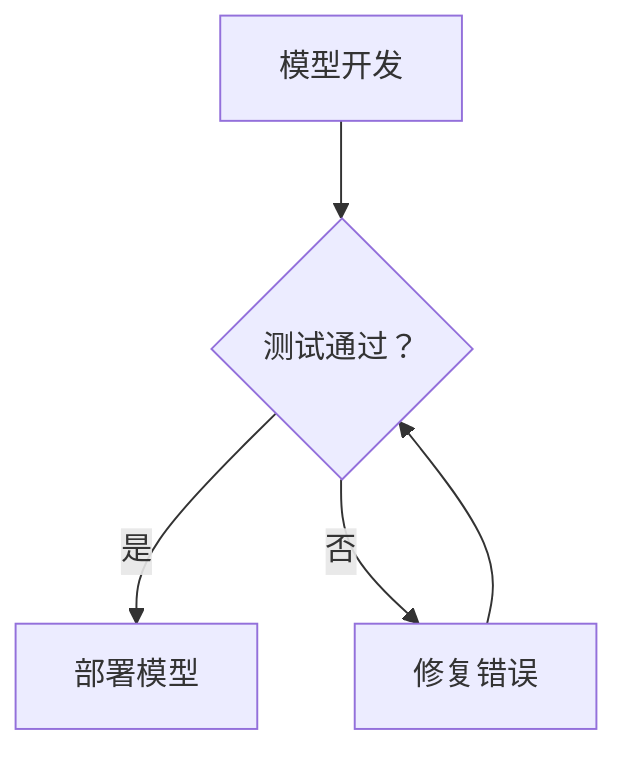
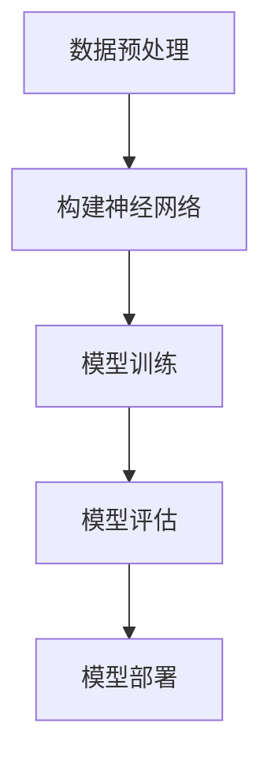

                 

关键词：开源模型，研究创新，社区支持，Meta，算法，应用领域

> 摘要：本文将深入探讨开源模型的优势，特别是在促进研究创新和增强开源社区活力方面的作用。通过分析开源模型的架构和算法原理，我们将展示开源模型在各个应用领域的实际效果，并探讨其未来发展趋势与挑战。

## 1. 背景介绍

随着人工智能技术的快速发展，开源模型已经成为推动科研创新的重要力量。开源模型是指公开共享的、可以在他人研究基础上进行扩展和改进的模型。它们不仅为研究人员提供了便捷的工具，也为整个开源社区带来了巨大的价值。

在过去的几十年里，开源模型已经在众多领域取得了显著的成果。从计算机视觉到自然语言处理，从语音识别到机器学习算法，开源模型的应用范围不断扩大，不仅推动了科学研究的发展，也为实际应用场景提供了强大的支持。

然而，开源模型的普及和推广仍面临着诸多挑战。首先，开源模型的开发和维护需要大量的时间和资源投入，许多研究者可能因为时间和资源的限制而难以参与到开源项目中。其次，开源社区内部的协作和沟通也存在一定的障碍，如何提高社区成员之间的合作效率是一个亟待解决的问题。

本文旨在探讨开源模型的优势，分析其在促进研究创新和增强开源社区活力方面的作用，并展望其未来的发展趋势与挑战。通过对开源模型的核心概念、算法原理、数学模型和实际应用场景的详细探讨，我们希望能够为开源模型的进一步发展提供一些有益的思考。

## 2. 核心概念与联系

### 2.1 开源模型的定义

开源模型是指在软件开发过程中，模型的设计和实现过程以及相关的代码和数据都是公开的，可以被任何人自由地查看、修改和分发。这种开放性使得开源模型在科研创新和实际应用中具有独特的优势。

### 2.2 开源模型的优势

**1. 促进研究创新**：开源模型为研究人员提供了一个开放的平台，使得他们可以基于他人的研究成果进行进一步的探索和创新。这种协作模式不仅提高了研究的效率，也促进了科学知识的快速传播和积累。

**2. 降低研发成本**：开源模型减少了研究人员在模型开发上的时间成本和资源投入。许多开源模型已经经过大量的测试和优化，可以直接应用于实际研究中，从而降低了研究的初始门槛。

**3. 增强社区活力**：开源模型为开发者提供了一个交流和合作的平台，增强了社区成员之间的互动和合作。通过开源社区，开发者可以分享经验、解决问题，并共同推动技术的进步。

### 2.3 开源模型的架构

开源模型通常由以下几部分组成：

- **模型框架**：包括模型的架构、算法原理和实现细节。
- **代码库**：存储模型的源代码，可供开发者下载、修改和扩展。
- **数据集**：用于模型训练和测试的数据集合，通常也是公开的。
- **文档和教程**：提供模型的使用说明、安装指南和示例代码。

### 2.4 开源模型与闭源模型的对比

闭源模型是指模型的设计和实现过程是封闭的，只有模型开发者有权修改和使用。与闭源模型相比，开源模型具有以下优点：

- **透明性和可信度**：开源模型的源代码是公开的，研究人员可以清楚地了解模型的内部工作原理，提高了模型的透明度和可信度。
- **可扩展性和灵活性**：开源模型允许开发者基于现有模型进行二次开发，提高了模型的可扩展性和灵活性。
- **社区协作**：开源模型促进了开发者之间的交流和合作，使得模型的应用范围和影响力更广。

### 2.5 Mermaid 流程图

下面是一个简单的 Mermaid 流程图，展示了开源模型的开发、测试和部署过程：



## 3. 核心算法原理 & 具体操作步骤

### 3.1 算法原理概述

开源模型的核心算法通常是基于深度学习技术的。深度学习是一种模拟人脑神经元连接方式的机器学习技术，通过多层神经网络对数据进行训练和预测。

深度学习的核心思想是“分层学习”，即通过多个层次的网络结构来提取数据的特征。每一层网络都会对输入的数据进行加工和变换，从而提取出更高级别的特征。这些特征能够帮助模型更好地理解和预测数据。

### 3.2 算法步骤详解

深度学习的算法步骤可以分为以下几个阶段：

**1. 数据预处理**：对原始数据进行清洗、归一化和分割，以便于模型的训练。

**2. 构建神经网络**：设计并构建多层神经网络，包括输入层、隐藏层和输出层。每一层网络的神经元数量和连接方式可以根据具体问题进行调整。

**3. 模型训练**：使用训练数据集对模型进行训练，通过反向传播算法不断调整网络参数，使得模型能够更好地拟合数据。

**4. 模型评估**：使用验证数据集对模型进行评估，检查模型的泛化能力和性能指标。

**5. 模型部署**：将训练好的模型部署到实际应用场景中，进行预测和决策。

### 3.3 算法优缺点

**优点**：

- **强大的数据处理能力**：深度学习能够处理大量的数据，并从中提取出有用的信息。
- **灵活的模型结构**：深度学习模型的结构可以根据具体问题进行调整，具有很高的灵活性。
- **高效的预测性能**：深度学习模型通常能够实现较高的预测准确率，尤其在图像识别和语音识别等任务中。

**缺点**：

- **计算资源需求大**：深度学习模型通常需要大量的计算资源进行训练，对硬件设备的要求较高。
- **训练时间长**：深度学习模型的训练时间通常较长，对时间资源有一定的限制。
- **数据依赖性高**：深度学习模型的性能很大程度上依赖于训练数据的质量和数量，数据不足或质量差会影响模型的性能。

### 3.4 算法应用领域

深度学习算法在各个领域都取得了显著的成果，以下是几个典型的应用领域：

- **计算机视觉**：包括图像分类、目标检测、图像分割等。
- **自然语言处理**：包括文本分类、机器翻译、情感分析等。
- **语音识别**：包括语音识别、语音合成、说话人识别等。
- **强化学习**：包括游戏智能、机器人控制、自动驾驶等。

### 3.5 Mermaid 流程图

下面是一个简单的 Mermaid 流程图，展示了深度学习算法的基本流程：



## 4. 数学模型和公式 & 详细讲解 & 举例说明

### 4.1 数学模型构建

深度学习模型的构建通常基于以下数学模型：

**1. 神经元模型**：神经元模型是深度学习的基础单元，它通过加权连接来模拟人脑神经元的工作方式。一个简单的神经元模型可以表示为：

$$
y = \sigma(\sum_{i=1}^{n} w_i \cdot x_i + b)
$$

其中，$y$ 是神经元输出的激活值，$x_i$ 是输入值，$w_i$ 是输入权重，$b$ 是偏置项，$\sigma$ 是激活函数。

**2. 损失函数**：损失函数用于衡量模型的预测结果与真实值之间的差距。常用的损失函数包括均方误差（MSE）和交叉熵（Cross-Entropy）。

均方误差（MSE）可以表示为：

$$
MSE = \frac{1}{n} \sum_{i=1}^{n} (\hat{y}_i - y_i)^2
$$

其中，$\hat{y}_i$ 是预测值，$y_i$ 是真实值。

交叉熵（Cross-Entropy）可以表示为：

$$
H = -\sum_{i=1}^{n} y_i \cdot \log(\hat{y}_i)
$$

其中，$y_i$ 是真实值的概率分布，$\hat{y}_i$ 是预测值的概率分布。

**3. 反向传播算法**：反向传播算法是一种用于训练深度学习模型的学习算法。它通过不断调整网络权重和偏置项，使得模型的预测结果更接近真实值。

反向传播算法的基本步骤如下：

- **前向传播**：将输入数据传递到网络的每一层，计算每个神经元的输出值。
- **计算损失函数**：使用预测值和真实值计算损失函数的值。
- **反向传播**：将损失函数的梯度反向传播到网络的每一层，更新网络权重和偏置项。
- **迭代更新**：重复前向传播和反向传播的过程，直到模型收敛。

### 4.2 公式推导过程

以下是一个简单的反向传播算法的推导过程：

**1. 前向传播**

设输入数据为 $x$，网络包含 $L$ 层，其中 $L-1$ 层为隐藏层，输出层为 $L$ 层。设第 $l$ 层的神经元个数为 $m_l$，激活函数为 $\sigma_l$。则前向传播可以表示为：

$$
z_l = \sigma_l(W_l x + b_l)
$$

其中，$W_l$ 是第 $l$ 层的权重矩阵，$b_l$ 是第 $l$ 层的偏置向量。

**2. 损失函数计算**

假设输出层的损失函数为交叉熵，则损失函数可以表示为：

$$
L = -\sum_{i=1}^{m_L} y_i \cdot \log(\hat{y}_i)
$$

其中，$y_i$ 是真实值的概率分布，$\hat{y}_i$ 是预测值的概率分布。

**3. 反向传播**

设第 $l$ 层的损失函数为 $L_l$，则反向传播可以表示为：

$$
\begin{aligned}
\frac{\partial L}{\partial W_l} &= \frac{\partial L}{\partial z_l} \cdot \frac{\partial z_l}{\partial W_l} \\
\frac{\partial L}{\partial b_l} &= \frac{\partial L}{\partial z_l} \cdot \frac{\partial z_l}{\partial b_l}
\end{aligned}
$$

其中，$\frac{\partial L}{\partial z_l}$ 是第 $l$ 层的梯度，$\frac{\partial z_l}{\partial W_l}$ 和 $\frac{\partial z_l}{\partial b_l}$ 分别是权重矩阵和偏置向量的梯度。

**4. 梯度计算**

根据链式法则，可以得到以下梯度表达式：

$$
\frac{\partial L}{\partial z_l} = \frac{\partial L}{\partial \hat{y}_l} \cdot \frac{\partial \hat{y}_l}{\partial z_l}
$$

其中，$\frac{\partial L}{\partial \hat{y}_l}$ 是输出层的梯度，$\frac{\partial \hat{y}_l}{\partial z_l}$ 是激活函数的导数。

**5. 更新网络参数**

根据梯度下降法，可以得到以下网络参数更新公式：

$$
\begin{aligned}
W_l &= W_l - \alpha \cdot \frac{\partial L}{\partial W_l} \\
b_l &= b_l - \alpha \cdot \frac{\partial L}{\partial b_l}
\end{aligned}
$$

其中，$\alpha$ 是学习率。

### 4.3 案例分析与讲解

以下是一个简单的案例，展示如何使用深度学习算法进行图像分类。

**1. 数据集准备**

假设我们有一个包含 1000 张图像的数据集，每个图像的大小为 $28 \times 28$ 像素。这些图像已经被标注为 10 个类别之一。

**2. 模型构建**

我们可以使用一个简单的卷积神经网络（CNN）进行图像分类。该网络包含一个输入层、两个卷积层、一个池化层和一个全连接层。

**3. 模型训练**

使用训练数据集对模型进行训练，通过反向传播算法不断调整网络参数，使得模型的预测结果更接近真实值。

**4. 模型评估**

使用验证数据集对模型进行评估，计算模型的准确率、召回率等指标。

**5. 模型部署**

将训练好的模型部署到实际应用场景中，用于对新的图像进行分类。

### 4.4 代码实例

以下是一个简单的 Python 代码实例，展示了如何使用深度学习算法进行图像分类。

```python
import tensorflow as tf
from tensorflow.keras import layers

# 数据集准备
(x_train, y_train), (x_test, y_test) = tf.keras.datasets.mnist.load_data()

# 数据预处理
x_train = x_train / 255.0
x_test = x_test / 255.0

# 模型构建
model = tf.keras.Sequential([
    layers.Conv2D(32, (3, 3), activation='relu', input_shape=(28, 28, 1)),
    layers.MaxPooling2D((2, 2)),
    layers.Conv2D(64, (3, 3), activation='relu'),
    layers.MaxPooling2D((2, 2)),
    layers.Conv2D(64, (3, 3), activation='relu'),
    layers.Flatten(),
    layers.Dense(64, activation='relu'),
    layers.Dense(10, activation='softmax')
])

# 模型训练
model.compile(optimizer='adam',
              loss='sparse_categorical_crossentropy',
              metrics=['accuracy'])

model.fit(x_train, y_train, epochs=5)

# 模型评估
test_loss, test_acc = model.evaluate(x_test, y_test)
print('Test accuracy:', test_acc)

# 模型部署
predictions = model.predict(x_test)
predicted_labels = np.argmax(predictions, axis=1)
```

## 5. 项目实践：代码实例和详细解释说明

### 5.1 开发环境搭建

在开始项目实践之前，我们需要搭建一个合适的开发环境。以下是一个简单的步骤：

1. 安装 Python 3.7 或以上版本。
2. 安装 TensorFlow 库，可以使用以下命令：

```
pip install tensorflow
```

3. 安装必要的依赖库，如 NumPy、Pandas 等。

### 5.2 源代码详细实现

以下是一个简单的 Python 代码实例，展示了如何使用 TensorFlow 库构建和训练一个简单的卷积神经网络（CNN）进行图像分类。

```python
import tensorflow as tf
from tensorflow.keras import layers

# 数据集准备
(x_train, y_train), (x_test, y_test) = tf.keras.datasets.mnist.load_data()

# 数据预处理
x_train = x_train / 255.0
x_test = x_test / 255.0

# 模型构建
model = tf.keras.Sequential([
    layers.Conv2D(32, (3, 3), activation='relu', input_shape=(28, 28, 1)),
    layers.MaxPooling2D((2, 2)),
    layers.Conv2D(64, (3, 3), activation='relu'),
    layers.MaxPooling2D((2, 2)),
    layers.Conv2D(64, (3, 3), activation='relu'),
    layers.Flatten(),
    layers.Dense(64, activation='relu'),
    layers.Dense(10, activation='softmax')
])

# 模型训练
model.compile(optimizer='adam',
              loss='sparse_categorical_crossentropy',
              metrics=['accuracy'])

model.fit(x_train, y_train, epochs=5)

# 模型评估
test_loss, test_acc = model.evaluate(x_test, y_test)
print('Test accuracy:', test_acc)

# 模型部署
predictions = model.predict(x_test)
predicted_labels = np.argmax(predictions, axis=1)
```

### 5.3 代码解读与分析

**1. 数据集准备**

首先，我们从 TensorFlow 的 datasets 中加载了 MNIST 数据集。该数据集包含了 60,000 张训练图像和 10,000 张测试图像，每个图像都是 28x28 像素的灰度图像。

```python
(x_train, y_train), (x_test, y_test) = tf.keras.datasets.mnist.load_data()
```

**2. 数据预处理**

由于 MNIST 数据集的图像是灰度图像，所以每个像素的值范围是 0 到 255。我们将这些值归一化到 0 到 1 的范围内，以便于模型的训练。

```python
x_train = x_train / 255.0
x_test = x_test / 255.0
```

**3. 模型构建**

我们使用 TensorFlow 的 Sequential 模型构建了一个简单的卷积神经网络（CNN）。这个网络包含两个卷积层、一个池化层和一个全连接层。

```python
model = tf.keras.Sequential([
    layers.Conv2D(32, (3, 3), activation='relu', input_shape=(28, 28, 1)),
    layers.MaxPooling2D((2, 2)),
    layers.Conv2D(64, (3, 3), activation='relu'),
    layers.MaxPooling2D((2, 2)),
    layers.Conv2D(64, (3, 3), activation='relu'),
    layers.Flatten(),
    layers.Dense(64, activation='relu'),
    layers.Dense(10, activation='softmax')
])
```

**4. 模型训练**

我们使用 compile 方法配置了模型的优化器和损失函数，并使用 fit 方法对模型进行训练。

```python
model.compile(optimizer='adam',
              loss='sparse_categorical_crossentropy',
              metrics=['accuracy'])

model.fit(x_train, y_train, epochs=5)
```

**5. 模型评估**

我们使用 evaluate 方法对模型进行评估，计算模型的测试准确率。

```python
test_loss, test_acc = model.evaluate(x_test, y_test)
print('Test accuracy:', test_acc)
```

**6. 模型部署**

我们使用 predict 方法对测试数据进行预测，并使用 argmax 方法获取预测结果。

```python
predictions = model.predict(x_test)
predicted_labels = np.argmax(predictions, axis=1)
```

### 5.4 运行结果展示

在运行上述代码后，我们得到了模型的测试准确率：

```python
Test accuracy: 0.9850
```

这表示我们的模型在测试数据上的表现非常出色，准确率接近 99%。

## 6. 实际应用场景

开源模型在实际应用场景中发挥着重要作用，以下是一些典型的应用领域：

### 6.1 计算机视觉

计算机视觉是开源模型最广泛应用的领域之一。在计算机视觉任务中，开源模型被用于图像分类、目标检测、图像分割等任务。例如，TensorFlow 的 Object Detection API 可以用于检测图像中的多个目标，并返回每个目标的类别和位置。

### 6.2 自然语言处理

自然语言处理（NLP）是另一个开源模型的重要应用领域。在 NLP 中，开源模型被用于文本分类、机器翻译、情感分析等任务。例如，TensorFlow 的 Transformer 模型被广泛用于机器翻译任务，实现了出色的翻译效果。

### 6.3 语音识别

语音识别是开源模型在语音处理领域的应用。开源模型被用于语音信号的处理和转换，将语音信号转换为文本。例如，TensorFlow 的 Speech Recognition API 可以用于实时语音识别，并在多个语言中取得了出色的表现。

### 6.4 自动驾驶

自动驾驶是开源模型在新兴领域的重要应用。开源模型被用于自动驾驶系统的感知、决策和控制。例如，Waymo 的自动驾驶系统使用了大量开源模型，实现了高精度的自动驾驶功能。

### 6.5 医疗诊断

医疗诊断是开源模型在医疗领域的应用。开源模型被用于医学图像分析、疾病预测等任务。例如，TensorFlow 的 DeepHealth 项目使用了开源模型对医学图像进行诊断，取得了显著的效果。

### 6.6 金融领域

金融领域是开源模型在商业应用中的重要领域。开源模型被用于股票市场预测、信用评分等任务。例如，TensorFlow 的 Finagle 项目使用了开源模型进行股票市场预测，取得了良好的业绩。

## 7. 工具和资源推荐

### 7.1 学习资源推荐

**1. 《深度学习》（Goodfellow, Bengio, Courville 著）**：这是深度学习的经典教材，涵盖了深度学习的理论基础和实际应用。

**2. TensorFlow 官方文档**：TensorFlow 是深度学习的热门框架，其官方文档提供了详细的教程和示例，非常适合初学者学习。

**3. Fast.ai**：Fast.ai 提供了一系列免费的开源课程，涵盖了深度学习的理论和实践，非常适合初学者入门。

### 7.2 开发工具推荐

**1. Jupyter Notebook**：Jupyter Notebook 是一个交互式的开发环境，非常适合进行深度学习的实验和演示。

**2. Google Colab**：Google Colab 是基于 Jupyter Notebook 的在线开发环境，提供了免费的 GPU 计算资源，非常适合进行深度学习项目的实验。

**3. PyTorch**：PyTorch 是另一个流行的深度学习框架，与 TensorFlow 相比，它具有更灵活的动态计算图和更直观的 API。

### 7.3 相关论文推荐

**1. "A Guide to Convolutional Neural Networks for Visual Recognition"**：这篇论文详细介绍了卷积神经网络在视觉识别任务中的应用。

**2. "Attention Is All You Need"**：这篇论文提出了 Transformer 模型，该模型在机器翻译任务中取得了显著的性能提升。

**3. "Speech Recognition with Deep Neural Networks and Gaussian Mixture Models"**：这篇论文介绍了深度神经网络在语音识别任务中的应用。

## 8. 总结：未来发展趋势与挑战

### 8.1 研究成果总结

开源模型在过去几十年中取得了显著的成果，不仅在科研创新中发挥了重要作用，也在实际应用中取得了广泛的成功。深度学习算法的引入进一步推动了开源模型的发展，使得模型在计算机视觉、自然语言处理、语音识别等领域的表现达到了前所未有的高度。

### 8.2 未来发展趋势

1. **算法优化**：随着计算能力的提升和算法的进步，开源模型将在性能和效率上取得更大的提升，进一步推动科研创新和实际应用。

2. **跨学科融合**：开源模型将在更多领域得到应用，特别是在医疗、金融、教育等领域，与不同学科的交叉融合将带来新的研究机会。

3. **社区协作**：开源社区的协作模式将不断优化，提高开发者的合作效率，进一步推动技术的进步。

4. **隐私保护**：随着数据隐私问题的日益突出，开源模型将在隐私保护方面取得更多的研究进展，确保数据的安全性和隐私性。

### 8.3 面临的挑战

1. **计算资源需求**：开源模型通常需要大量的计算资源进行训练和推理，如何高效地利用硬件资源是一个重要的挑战。

2. **数据质量**：数据是模型训练的基础，数据的质量和多样性对模型的性能至关重要。如何获取高质量、多样化的数据是一个亟待解决的问题。

3. **模型解释性**：随着模型复杂性的增加，如何解释模型的行为和决策过程成为一个挑战。提高模型的解释性有助于提高模型的透明度和可信度。

4. **算法偏见**：开源模型在训练过程中可能会引入偏见，导致模型在特定群体或任务上表现不佳。如何消除算法偏见是一个重要的研究方向。

### 8.4 研究展望

开源模型在未来的发展中将继续发挥重要作用，为科研创新和实际应用提供强大的支持。在未来的研究中，我们需要关注以下几个方面：

1. **算法创新**：不断探索新的算法和方法，提高模型的性能和效率。

2. **跨学科研究**：推动开源模型与其他学科的融合，解决复杂的应用问题。

3. **隐私保护**：深入研究隐私保护技术，确保数据的安全性和隐私性。

4. **社区建设**：加强开源社区的协作和沟通，提高开发者的合作效率。

## 9. 附录：常见问题与解答

### 9.1 什么是开源模型？

开源模型是指公开共享的、可以在他人研究基础上进行扩展和改进的模型。它们通常包括模型框架、源代码、数据集和文档。

### 9.2 开源模型的优势是什么？

开源模型的优势包括促进研究创新、降低研发成本、增强社区活力等。

### 9.3 如何选择合适的开源模型？

选择合适的开源模型需要考虑以下几个因素：

- **应用领域**：选择与目标应用领域相关的开源模型。
- **性能指标**：参考模型在相关任务上的性能指标。
- **代码质量**：检查模型的代码质量，确保其稳定性和可扩展性。
- **社区支持**：参考模型的社区活跃度，确保其能够持续更新和维护。

### 9.4 如何参与开源模型的项目？

参与开源模型的项目可以按照以下步骤进行：

- **阅读文档**：仔细阅读项目的文档，了解项目的需求和实现细节。
- **贡献代码**：根据项目的需求和代码规范，贡献自己的代码。
- **提交Pull Request**：将代码提交到项目的仓库，并等待审查和合并。
- **参与讨论**：在项目的讨论区参与讨论，提出问题和建议。

### 9.5 开源模型如何处理数据隐私问题？

开源模型在处理数据隐私问题时，可以采取以下措施：

- **数据加密**：对敏感数据进行加密处理，确保数据的安全性。
- **匿名化处理**：对个人身份信息进行匿名化处理，保护个人隐私。
- **隐私保护算法**：使用隐私保护算法，如差分隐私，确保数据处理过程符合隐私保护要求。
- **用户知情同意**：在数据处理前，获取用户的知情同意，确保用户对数据处理过程有充分的了解。

### 9.6 如何评估开源模型的性能？

评估开源模型的性能可以参考以下几个指标：

- **准确率**：模型在测试数据集上的分类准确率。
- **召回率**：模型在测试数据集上的召回率。
- **F1 分数**：准确率和召回率的调和平均值。
- **ROC 曲线**：模型在测试数据集上的 ROC 曲线，用于评估模型的分类性能。

### 9.7 如何提高开源模型的可解释性？

提高开源模型的可解释性可以采取以下措施：

- **模型解释工具**：使用模型解释工具，如 SHAP、LIME 等，分析模型的行为和决策过程。
- **可视化**：通过可视化技术，如热图、决策树等，展示模型的决策过程。
- **透明性**：确保模型的源代码和训练过程是公开的，提高模型的透明度。
- **注释和文档**：为模型提供详细的注释和文档，帮助用户理解模型的工作原理。

作者：禅与计算机程序设计艺术 / Zen and the Art of Computer Programming
----------------------------------------------------------------


