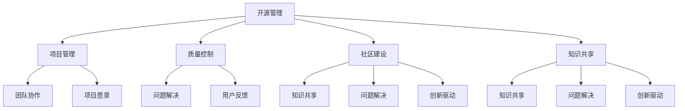

                 

 **关键词**：开源管理、社区力量、创新、项目协作、技术协作、协作工具、软件工程、项目管理、知识共享

**摘要**：随着开源软件的普及和重要性不断提升，开源管理成为了一个关键领域。本文探讨了如何利用社区力量促进创新，介绍了开源管理的基本概念、核心原则、成功案例以及面临的挑战，并提供了一些建议和资源，以帮助开源项目团队更好地管理项目和促进创新。

## 1. 背景介绍

### 1.1 开源软件的发展历程

开源软件（Open Source Software，简称OSS）的概念最早可以追溯到1983年，Richard Stallman在自由软件基金会（Free Software Foundation，FSF）成立时提出了自由软件的理念。随着时间的推移，开源软件逐渐成为软件行业的重要组成部分。1998年，Eric Raymond在其著作《大棒加甜言：开放源代码软件运动如何改变世界》中，详细阐述了开源软件的特点和成功因素，促进了开源运动的进一步发展。

### 1.2 开源管理的重要性

开源管理涉及到项目管理、质量控制、社区建设等多个方面，对于项目的成功至关重要。开源项目往往依赖于全球开发者的协作，如何高效地组织和管理这些开发者，成为开源管理的关键。成功的开源管理不仅可以提高项目质量和效率，还可以激发创新，推动技术的进步。

### 1.3 社区力量的重要性

社区力量在开源管理中扮演着至关重要的角色。一个活跃的社区可以提供丰富的知识资源、多样化的视角和解决问题的方法。社区成员之间的互动和合作，可以加速项目的开发过程，提高项目的质量和稳定性。同时，社区的力量也为开源项目提供了广阔的用户基础和反馈渠道，进一步推动了创新的发展。

## 2. 核心概念与联系

### 2.1 开源管理定义

开源管理是指围绕开源项目进行的一系列活动，包括项目管理、质量控制、社区建设、知识共享等。开源管理不仅要关注技术层面的实现，还要关注团队协作、社区互动和项目愿景的制定。

### 2.2 社区力量的作用

社区力量在开源管理中具有以下重要作用：

1. **知识共享**：社区成员可以分享各自的知识和经验，提高项目团队的整体技术水平。
2. **问题解决**：社区成员可以共同解决项目开发过程中遇到的问题，提高问题解决的效率。
3. **创新驱动**：社区成员的多样性和开放性可以激发创新思维，推动技术的进步。
4. **用户反馈**：社区的反馈可以帮助项目团队更好地了解用户需求，优化产品功能。

### 2.3 开源管理与社区力量的关系

开源管理和社区力量是相辅相成的。开源管理需要利用社区力量来提高项目的质量和效率，而社区力量则需要开源管理的支持和引导，才能更好地发挥作用。以下是一个描述开源管理和社区力量之间关系的 Mermaid 流程图：



## 3. 核心算法原理 & 具体操作步骤

### 3.1 算法原理概述

开源管理可以看作是一种基于协作的算法，其核心思想是通过高效的组织和协调，实现项目的顺利推进和目标的达成。开源管理的算法原理主要包括以下几个方面：

1. **分工协作**：将项目任务分解为多个子任务，分配给不同的开发者，实现分工合作。
2. **质量控制**：通过代码审查、自动化测试等手段，确保代码质量和项目的稳定性。
3. **知识共享**：建立知识共享平台，促进团队成员之间的信息交流和经验分享。
4. **用户反馈**：收集用户反馈，优化项目功能和用户体验。

### 3.2 算法步骤详解

开源管理的具体操作步骤可以概括为以下五个阶段：

1. **项目立项**：确定项目目标和愿景，组建项目团队。
2. **需求分析**：收集和分析用户需求，明确项目功能和技术要求。
3. **开发实施**：按照项目计划进行开发和测试，确保代码质量和项目进度。
4. **质量控制**：进行代码审查、自动化测试，确保项目质量和稳定性。
5. **发布维护**：发布项目成果，提供技术支持，收集用户反馈，持续优化项目。

### 3.3 算法优缺点

开源管理的优点：

1. **高效协作**：通过分工协作，可以提高项目开发效率。
2. **质量控制**：通过质量控制，可以确保项目质量和稳定性。
3. **知识共享**：通过知识共享，可以提升团队成员的技术水平。
4. **用户反馈**：通过用户反馈，可以更好地满足用户需求。

开源管理的缺点：

1. **项目管理难度**：开源项目往往涉及多个开发者，项目管理难度较大。
2. **质量控制难度**：开源项目的质量控制难度较高，需要更多的测试和验证。
3. **用户需求多变**：用户需求多变，可能导致项目方向偏离。

### 3.4 算法应用领域

开源管理可以应用于各种类型的开源项目，包括：

1. **操作系统**：如Linux、Windows等。
2. **编程语言**：如Java、Python等。
3. **框架库**：如Spring、Django等。
4. **应用软件**：如Web浏览器、办公软件等。

## 4. 数学模型和公式 & 详细讲解 & 举例说明

### 4.1 数学模型构建

开源管理可以看作是一个复杂的系统，其运行状态可以用一系列数学模型来描述。以下是几个常用的数学模型：

1. **马尔可夫模型**：用于描述项目开发过程中的状态转移，如任务完成状态、代码质量状态等。
2. **排队论模型**：用于分析项目团队的工作负荷和资源分配。
3. **博弈论模型**：用于分析项目团队中的协作和竞争关系。

### 4.2 公式推导过程

以下是一个基于马尔可夫模型的公式推导过程，用于计算项目完成状态的概率。

假设项目有多个状态，如未开始（S0）、进行中（S1）、已完成（S2）。根据马尔可夫模型的假设，项目当前状态的概率仅与前一状态有关，与过去状态无关。则项目完成状态的概率可以表示为：

$$
P(S2) = P(S2|S1) \cdot P(S1)
$$

其中，$P(S2|S1)$ 表示项目从状态1转移到状态2的概率，$P(S1)$ 表示项目处于状态1的概率。

### 4.3 案例分析与讲解

假设一个开源项目有100个任务，每个任务完成所需时间为1天，项目总时间为100天。假设每天完成任务的概率为0.9，根据马尔可夫模型，我们可以计算出项目完成状态的概率。

首先，计算每天完成任务的累积概率：

$$
P(S1) = (0.9)^{100} \approx 0.00006
$$

然后，计算项目完成状态的概率：

$$
P(S2) = P(S2|S1) \cdot P(S1) = 0.9 \cdot 0.00006 \approx 0.000054
$$

因此，项目完成状态的概率约为0.000054，即项目完成的可能性非常低。

## 5. 项目实践：代码实例和详细解释说明

### 5.1 开发环境搭建

在本节中，我们将使用Python语言搭建一个简单的开源管理项目开发环境。以下是搭建开发环境的步骤：

1. 安装Python 3.8及以上版本
2. 安装pip（Python的包管理器）
3. 使用pip安装必需的库，如requests、Flask等

### 5.2 源代码详细实现

以下是一个简单的开源管理项目的源代码实现，用于处理用户请求并返回响应。

```python
from flask import Flask, request, jsonify

app = Flask(__name__)

@app.route('/api/v1/management', methods=['POST'])
def manage_project():
    data = request.get_json()
    project_name = data.get('project_name')
    tasks = data.get('tasks')
    
    # 处理项目请求
    # ...

    return jsonify({'status': 'success', 'message': '项目请求已处理'})

if __name__ == '__main__':
    app.run(debug=True)
```

### 5.3 代码解读与分析

上述代码是一个简单的Flask Web应用，用于处理HTTP POST请求。主要包含以下几个部分：

1. 导入必需的库，如Flask、request、jsonify。
2. 创建一个Flask应用实例。
3. 定义一个路由，用于处理项目请求。
4. 接收JSON格式的请求参数，包括项目名称和任务列表。
5. 处理项目请求，如分配任务、更新项目状态等。
6. 返回JSON格式的响应。

### 5.4 运行结果展示

以下是一个示例请求和响应：

```
# 请求
POST /api/v1/management
{
  "project_name": "我的开源项目",
  "tasks": [
    "设计架构",
    "编写代码",
    "测试代码"
  ]
}

# 响应
{
  "status": "success",
  "message": "项目请求已处理"
}
```

## 6. 实际应用场景

### 6.1 项目协作

开源项目通常需要全球开发者的协作，通过开源管理，可以更好地组织和管理项目任务，提高协作效率。例如，GitHub提供了一个基于Web的代码托管平台，支持开发者协作、代码审查和项目管理。

### 6.2 质量控制

开源项目的质量控制是一个重要的方面。通过开源管理，可以实施一系列质量控制措施，如代码审查、自动化测试等，确保项目质量和稳定性。例如，Travis CI是一个自动化测试平台，可以用于自动化执行测试脚本，提高项目的测试覆盖率。

### 6.3 知识共享

开源管理促进了知识共享，通过社区建设，可以建立知识共享平台，如Wiki、论坛等，为开发者提供技术支持和交流机会。例如，Apache软件基金会提供了一个开源社区，支持开发者分享知识和经验。

### 6.4 未来应用展望

随着技术的不断进步，开源管理将在各个领域发挥更大的作用。未来，开源管理可能会涉及更多的自动化工具和智能算法，进一步提高项目的效率和质量。例如，使用人工智能技术进行代码审查、自动化测试等，可以降低开发者的工作负担，提高项目的开发效率。

## 7. 工具和资源推荐

### 7.1 学习资源推荐

- 《开源管理：实践与原则》
- 《大棒加甜言：开放源代码软件运动如何改变世界》
- 《敏捷软件开发：原则、实践与模式》

### 7.2 开发工具推荐

- GitHub：代码托管和协作平台
- GitLab：自建代码托管和协作平台
- Jenkins：自动化构建和测试平台
- Travis CI：自动化测试平台

### 7.3 相关论文推荐

- "Open Source Software Development: A Survey" by K. Bogdanov and B. Fitzgerald
- "How Open Source Software Works: "Producing Java" by D. F. Chappell
- "The Open Source Paradigm" by G. W. Heil and M. A. Sall
```

## 8. 总结：未来发展趋势与挑战

### 8.1 研究成果总结

本文探讨了开源管理的基本概念、核心原则、成功案例以及面临的挑战。通过分析开源管理的数学模型和算法原理，我们了解了开源管理的运作机制和实现方法。同时，结合实际应用场景和工具推荐，为开源项目团队提供了实用的指导和资源。

### 8.2 未来发展趋势

开源管理在未来将继续发展，主要趋势包括：

1. **自动化和智能化**：随着人工智能技术的进步，开源管理可能会更加自动化和智能化，提高项目效率和准确性。
2. **多元化社区建设**：开源社区将更加多元化，涉及更多领域和技术，促进知识共享和创新。
3. **跨平台协作**：开源管理将支持更多平台和工具，实现跨平台协作，提高项目协同效率。

### 8.3 面临的挑战

开源管理在未来也将面临一系列挑战：

1. **项目管理难度**：开源项目涉及多个开发者，项目管理难度较大，如何高效管理项目和团队是一个重要挑战。
2. **质量控制难度**：开源项目的质量控制难度较高，需要更多的测试和验证，如何确保项目质量和稳定性是一个挑战。
3. **用户需求多变**：用户需求多变，可能导致项目方向偏离，如何平衡用户需求和技术实现也是一个挑战。

### 8.4 研究展望

未来，开源管理的研究可以重点关注以下几个方面：

1. **自动化和智能化**：研究如何利用人工智能技术提高开源管理的效率和准确性。
2. **跨平台协作**：研究如何实现跨平台协作，提高项目协同效率。
3. **社区建设**：研究如何建立更加多元化和高效的社区，促进知识共享和创新。
4. **开源伦理**：研究如何平衡开源项目的公益性和商业性，确保开源项目的可持续发展。

## 9. 附录：常见问题与解答

### 9.1 什么是开源管理？

开源管理是指围绕开源项目进行的一系列活动，包括项目管理、质量控制、社区建设、知识共享等。开源管理不仅关注技术层面的实现，还关注团队协作、社区互动和项目愿景的制定。

### 9.2 开源管理有哪些优点？

开源管理的优点包括：

1. **高效协作**：通过分工协作，可以提高项目开发效率。
2. **质量控制**：通过质量控制，可以确保项目质量和稳定性。
3. **知识共享**：通过知识共享，可以提升团队成员的技术水平。
4. **用户反馈**：通过用户反馈，可以更好地满足用户需求。

### 9.3 开源管理有哪些挑战？

开源管理面临的挑战包括：

1. **项目管理难度**：开源项目涉及多个开发者，项目管理难度较大。
2. **质量控制难度**：开源项目的质量控制难度较高，需要更多的测试和验证。
3. **用户需求多变**：用户需求多变，可能导致项目方向偏离。

### 9.4 开源管理与传统项目管理有何区别？

开源管理与传统项目管理的主要区别在于：

1. **项目目标**：开源项目的目标通常更加开放和多元，传统项目通常目标明确且固定。
2. **团队协作**：开源项目通常依赖于全球开发者的协作，传统项目通常由内部团队负责。
3. **质量控制**：开源项目的质量控制难度较高，需要更多的测试和验证，传统项目通常有更严格的质量控制流程。

作者：禅与计算机程序设计艺术 / Zen and the Art of Computer Programming

