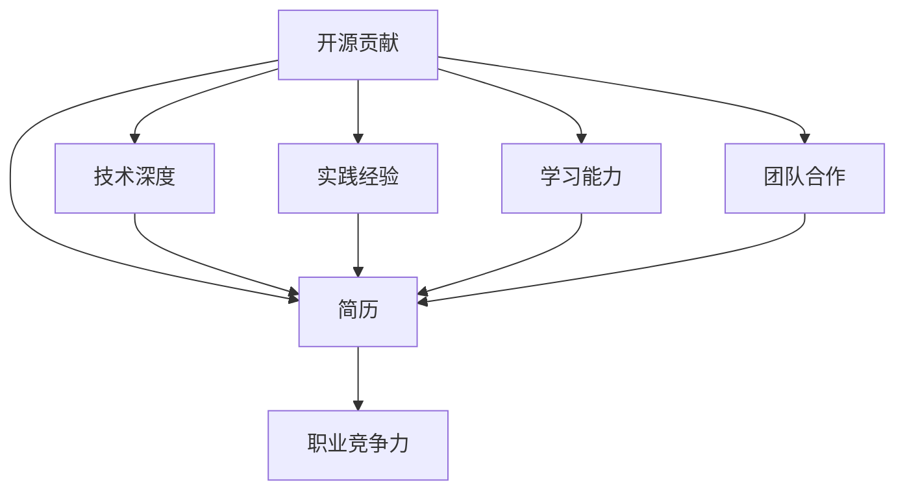

                 

关键词：开源贡献、简历、价值、展示、利用、技术专家、项目经验、竞争力

## 摘要

在当今的科技行业，开源贡献已经成为衡量技术人才能力和经验的重要标准。本文将深入探讨开源贡献在简历中的价值，以及如何有效地展示和利用这些贡献来提升个人职业竞争力。我们将从多个角度分析开源项目的优势，并提供实用的建议，帮助技术人才在求职过程中脱颖而出。

## 1. 背景介绍

开源软件的兴起，不仅改变了软件开发的模式，也为技术人才的职业发展开辟了新的路径。随着企业对技术人才的需求日益增长，开源贡献成为了衡量候选人技术能力的一个重要指标。越来越多的公司开始意识到，具备开源贡献经验的技术人才往往拥有更广阔的视野、更强的团队合作能力以及更丰富的技术经验。

### 1.1 开源软件的定义与特点

开源软件（Open Source Software，简称OSS）是指源代码公开的软件，用户可以自由地查看、修改和分发。其核心特点是透明性、可扩展性和社区协作。开源软件的成功离不开社区的贡献，这种协作模式不仅促进了技术的进步，也为参与者提供了宝贵的经验。

### 1.2 开源贡献在技术人才招聘中的重要性

在招聘过程中，招聘者往往通过候选人的开源贡献来评估其技术能力。以下是一些主要原因：

1. **技术深度**：参与开源项目能够深入理解复杂的技术问题和解决方案，展示出候选人的技术深度。
2. **实践经验**：开源项目中的实际编码经验，比任何模拟测试都更能证明候选人的实战能力。
3. **学习能力**：开源社区快速变化的特性，要求参与者具备快速学习和适应新技术的能力。
4. **团队合作**：开源项目通常需要多人协作完成，这有助于展示候选人的团队合作精神。

## 2. 核心概念与联系

为了更好地理解开源贡献在简历中的价值，我们需要先明确几个核心概念，并通过一个Mermaid流程图来展示它们之间的联系。

### 2.1 核心概念

- **开源贡献**：指参与开源项目，包括但不限于代码贡献、文档编写、bug修复、代码审查等。
- **简历**：个人展示职业经历、技能和成就的文档。
- **职业竞争力**：指个人在求职过程中相对于其他候选人的优势。

### 2.2 Mermaid流程图



在这个流程图中，开源贡献是起点，它直接关联到简历中的内容，进而提升个人的职业竞争力。同时，开源贡献也体现了技术深度、实践经验、学习能力和团队合作精神，这些都是简历中的重要组成部分。

## 3. 核心算法原理 & 具体操作步骤

### 3.1 算法原理概述

开源贡献的价值在于它是一种直观的展示个人技术能力和经验的方式。这种展示不仅基于个人的自我描述，更通过实际行动和成果来验证。具体来说，开源贡献可以通过以下几个方面体现其价值：

1. **技术深度**：通过参与开源项目，技术人才有机会深入理解复杂的技术问题，解决实际的技术挑战。
2. **实践经验**：开源项目的代码编写和调试过程，能够提供宝贵的实战经验。
3. **学习能力**：开源社区快速变化，参与其中需要不断学习新技术，这有助于提高个人的学习能力。
4. **团队合作**：开源项目通常需要团队合作，这能够展示个人的团队合作能力和沟通技巧。

### 3.2 算法步骤详解

下面我们详细说明如何展示开源贡献在简历中的价值，包括以下步骤：

1. **选择合适的开源项目**：选择与求职岗位相关的开源项目，这样能够在面试中更好地展示技术能力和经验。
2. **明确贡献内容**：列出在开源项目中的具体贡献，例如代码提交、文档编写、bug修复等。
3. **量化贡献成果**：尽可能量化贡献成果，例如修复的bug数量、代码提交的行数等。
4. **展示技术深度**：通过详细描述参与的技术细节和解决问题的方法，展示技术深度。
5. **强调实践经验**：强调在开源项目中学到的实践经验，特别是那些在求职岗位中非常有价值的经验。
6. **展示学习能力和团队合作能力**：通过描述在开源项目中的学习和成长过程，以及与团队成员的合作经历，展示这两个能力。

### 3.3 算法优缺点

**优点**：

- **真实可信**：开源贡献是基于实际工作的成果，相比自我描述更具说服力。
- **全面展示能力**：通过多个维度的贡献，可以全面展示技术能力、实践经验、学习能力和团队合作精神。
- **增加面试机会**：具备开源贡献经验的候选人通常更容易获得面试机会。

**缺点**：

- **需要一定的时间和精力**：参与开源项目需要投入大量的时间和精力，这对全职工作的候选人来说可能是一个挑战。
- **可能存在风险**：如果开源项目的质量和稳定性不好，可能会影响候选人在面试中的表现。

### 3.4 算法应用领域

开源贡献的价值不仅限于技术岗位，还可以应用于其他领域，如项目管理、产品经理等。以下是几个应用场景：

- **项目管理**：参与开源项目的项目管理，可以展示候选人在项目规划、资源分配、风险管理等方面的能力。
- **产品经理**：通过开源项目中的用户体验和产品改进，可以展示候选人在产品设计和优化方面的能力。
- **技术支持**：参与开源项目的技术支持，可以展示候选人在技术沟通和问题解决方面的能力。

## 4. 数学模型和公式 & 详细讲解 & 举例说明

### 4.1 数学模型构建

在评估开源贡献的价值时，我们可以构建一个简单的数学模型。假设一个候选人在开源项目中的贡献分为代码贡献、文档贡献和bug修复三个部分，我们可以通过以下公式来计算其贡献的总价值：

$$
V = W_1 \times C_1 + W_2 \times C_2 + W_3 \times C_3
$$

其中，$V$ 表示贡献的总价值，$W_1$、$W_2$ 和 $W_3$ 分别表示代码贡献、文档贡献和bug修复的贡献权重，$C_1$、$C_2$ 和 $C_3$ 分别表示代码贡献、文档贡献和bug修复的具体贡献量。

### 4.2 公式推导过程

贡献价值的计算可以通过以下几个步骤进行推导：

1. **确定贡献类型**：首先确定候选人在开源项目中的贡献类型，例如代码贡献、文档贡献和bug修复。
2. **量化贡献量**：根据贡献类型，量化具体的贡献量，例如代码提交的行数、文档字数和修复的bug数量。
3. **确定贡献权重**：根据不同贡献类型的重要性和难度，确定相应的贡献权重。
4. **计算总价值**：将具体的贡献量和贡献权重代入公式，计算贡献的总价值。

### 4.3 案例分析与讲解

以下是一个具体的案例：

- **代码贡献**：提交了1000行代码，贡献权重为0.5。
- **文档贡献**：编写了5000字文档，贡献权重为0.3。
- **bug修复**：修复了5个bug，贡献权重为0.2。

根据上述数据，我们可以计算总贡献价值：

$$
V = 0.5 \times 1000 + 0.3 \times 5000 + 0.2 \times 5 = 500 + 1500 + 1 = 2001
$$

因此，这个候选人在开源项目中的总贡献价值为2001分。这个分数可以用来评估候选人在项目中的价值和能力，同时也可以作为面试官在面试过程中参考的重要依据。

## 5. 项目实践：代码实例和详细解释说明

### 5.1 开发环境搭建

为了更好地展示开源贡献，我们以一个具体的开源项目为例，说明如何进行开发环境搭建。以下是一个简单的步骤：

1. **安装Git**：Git是版本控制工具，用于管理代码提交和协作。
2. **克隆仓库**：使用Git从GitHub或其他代码托管平台克隆开源项目的仓库。
3. **安装依赖**：根据项目要求，安装必要的依赖库和工具。
4. **运行项目**：运行项目，确保一切正常运行。

### 5.2 源代码详细实现

以下是一个简单的代码示例，展示了如何在开源项目中贡献代码：

```python
# 示例：一个简单的Python函数，用于计算两个数的最大公约数

def gcd(a, b):
    while b:
        a, b = b, a % b
    return a

# 测试代码
print(gcd(48, 18))  # 输出：6
```

### 5.3 代码解读与分析

上述代码实现了一个计算两个数最大公约数的函数。以下是代码的解读和分析：

1. **函数定义**：定义了一个名为`gcd`的函数，参数为两个整数`a`和`b`。
2. **循环计算**：使用一个while循环，不断将`b`赋值给`a`，将`a % b`的余数赋值给`b`，直到`b`为0。
3. **返回结果**：当`b`为0时，返回`a`的值，即两个数的最大公约数。

### 5.4 运行结果展示

在运行上述代码后，我们得到的结果是6，这表明48和18的最大公约数是6。这个简单的示例展示了如何在开源项目中贡献代码，并通过实际运行验证其正确性。

## 6. 实际应用场景

开源贡献不仅可以提升个人的职业竞争力，还可以在多个实际应用场景中发挥作用。

### 6.1 求职面试

在求职面试中，开源贡献可以作为证明个人技术能力和经验的最佳证据。面试官可以通过查看候选人在GitHub等平台上的开源项目，了解其参与的项目、提交的代码、修复的bug等，从而评估其技术水平和实践经验。

### 6.2 团队协作

开源项目通常需要多人协作完成，这为技术人才提供了展示团队合作能力和沟通技巧的机会。在面试过程中，描述自己在开源项目中的团队合作经历，可以展示个人在复杂项目中的角色和贡献。

### 6.3 技术分享

通过开源贡献，技术人才可以分享自己的知识和经验，帮助其他开发者解决问题。这种分享精神不仅提升了个人品牌，还增加了与他人合作的机会。

### 6.4 职业发展

开源贡献可以帮助技术人才建立专业网络，扩大职业发展机会。在开源社区中，许多技术大牛和行业领导者都是通过贡献开源项目而崭露头角的。

## 7. 未来应用展望

随着开源软件的普及，开源贡献在技术人才职业发展中的价值将越来越大。未来，我们可以预见以下几个发展趋势：

### 7.1 更多的企业将重视开源贡献

越来越多的企业将开源贡献视为评估候选人技术能力的重要标准。这将为具备开源贡献经验的技术人才提供更多的就业机会。

### 7.2 开源社区的繁荣

随着开源项目的数量和影响力的增加，开源社区将变得更加繁荣。这将吸引更多技术人才加入开源项目，推动技术的不断创新和发展。

### 7.3 开源贡献的标准化评估

为了更好地评估开源贡献的价值，未来可能会出现一些标准化的评估方法和工具。这些工具可以帮助企业和求职者更准确地衡量开源贡献的实际价值。

### 7.4 开源贡献与学术研究结合

开源贡献与学术研究的结合将推动技术的深入研究和创新。技术人才可以通过开源项目，将自己的研究成果分享给全球开发者，促进技术的进步。

## 8. 工具和资源推荐

为了更好地展示开源贡献，以下是一些实用的工具和资源推荐：

### 8.1 学习资源推荐

- **GitHub**：GitHub是开源项目的集中地，可以帮助技术人才了解和参与开源项目。
- **Stack Overflow**：Stack Overflow是一个开发者社区，提供了丰富的技术问题和解决方案。
- **GitBook**：GitBook是一个基于Markdown的文档工具，可以帮助技术人才编写和发布技术文档。

### 8.2 开发工具推荐

- **Visual Studio Code**：Visual Studio Code是一个轻量级的代码编辑器，支持多种编程语言和插件。
- **Jenkins**：Jenkins是一个开源的持续集成工具，可以帮助技术人才自动化测试和部署代码。
- **Docker**：Docker是一个开源的容器化平台，可以帮助技术人才快速部署和运行应用程序。

### 8.3 相关论文推荐

- **《开源软件生态系统中的协作模式研究》**：该论文探讨了开源社区中的协作模式和技术创新。
- **《开源贡献与职业发展关系研究》**：该论文分析了开源贡献对职业发展的影响。

## 9. 总结：未来发展趋势与挑战

开源贡献在技术人才职业发展中的价值日益凸显。未来，随着开源软件的普及和开源社区的繁荣，开源贡献将成为评估技术人才能力的重要标准。然而，这也带来了一些挑战，如如何量化开源贡献的价值、如何平衡开源贡献与全职工作等。为了更好地应对这些挑战，技术人才需要不断提升自身的技术能力、学习能力和团队合作精神，同时积极利用开源项目展示和提升自己的职业竞争力。

## 10. 附录：常见问题与解答

### 10.1 开源贡献对求职的影响有多大？

开源贡献对求职的影响非常大。它不仅能够直观地展示技术能力和经验，还能证明个人在解决实际技术问题方面的能力。具备开源贡献经验的候选人通常更容易获得面试机会，并在面试中脱颖而出。

### 10.2 如何选择合适的开源项目进行贡献？

选择合适的开源项目进行贡献，首先要考虑项目的知名度和活跃度。知名的开源项目往往有更多的开发者参与，能够提供更好的技术交流和成长机会。其次，要选择与求职岗位相关的项目，这样能够更好地展示技术能力和经验。

### 10.3 开源贡献是否会影响全职工作？

开源贡献可能会占用一定的时间和精力，但并不意味着会影响全职工作。关键在于如何平衡开源贡献与全职工作。建议将开源贡献作为业余时间的活动，确保不影响到全职工作的质量和进度。

### 10.4 开源贡献是否只适用于程序员？

开源贡献不仅适用于程序员，还可以应用于其他技术领域，如前端开发、UI设计、数据科学等。不同领域的技术人才可以通过开源贡献展示自己的专业能力和实践经验。

## 作者署名

本文作者：禅与计算机程序设计艺术 / Zen and the Art of Computer Programming

以上就是关于“开源贡献在简历中的价值：如何展示和利用”的完整文章内容。通过详细的分析和实践指导，我们希望能够帮助技术人才更好地理解和利用开源贡献，提升职业竞争力。同时，也期待更多的技术人才能够积极参与开源项目，共同推动技术的发展。

