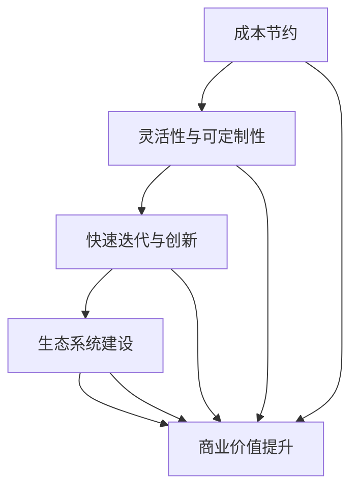

                 

关键词：开源软件，商业价值，就业影响，经济贡献，市场竞争力

> 摘要：本文深入探讨了开源运动对经济的多重影响，包括开源软件的商业价值及其在推动创新和降低成本方面的作用，以及开源对就业市场的积极影响。通过分析开源运动的历史发展、当前趋势和未来展望，本文揭示了开源软件在当今数字化时代的重要性，并提出了应对挑战的策略。

## 1. 背景介绍

开源运动起源于20世纪80年代，当时自由软件基金会（FSF）成立，标志着自由软件和开源软件的诞生。随着时间的推移，开源运动逐渐从一个技术爱好者的活动发展成为全球范围内的重要趋势。开源软件的核心特点是开放源代码，允许用户自由地阅读、修改和分发软件，这一特性极大地促进了软件的协作开发和创新。

### 1.1 开源运动的发展历程

- **1980s**：自由软件运动起步，Linux操作系统于1991年发布，成为开源软件的里程碑。
- **1990s**：自由软件基金会成立，推动自由软件的推广和使用。
- **2000s**：开源软件的商业化开始，如Red Hat的成功为开源企业树立了榜样。
- **2010s**：开源生态系统快速发展，云服务和容器技术的兴起进一步推动了开源软件的应用。
- **2020s**：开源软件成为企业技术战略的重要组成部分，全球范围内的开源贡献和合作日益增加。

### 1.2 开源软件的定义与特征

开源软件（Open Source Software, OSS）是指遵循开放源代码协议（如GPL、BSD、MIT等）的软件，这些协议允许用户自由使用、研究、修改和分发软件。开源软件的主要特征包括：

- **源代码开放**：软件的源代码是公开的，任何人都可以查看、修改和分发。
- **协作开发**：开源项目通常由全球范围内的志愿者和专业开发者共同维护。
- **社区驱动**：开源软件的发展依赖于活跃的社区，社区成员共同决定项目的发展方向。
- **自由使用**：用户可以免费使用开源软件，也可以将其用于商业目的。

## 2. 核心概念与联系

### 2.1 开源软件的商业价值

开源软件不仅推动了技术创新，还带来了显著的商业价值。以下是开源软件商业价值的核心概念及其相互关系：

- **成本节约**：开源软件降低了企业的软件采购成本，因为用户可以免费使用软件，无需支付高昂的许可证费用。
- **灵活性与可定制性**：企业可以根据自身需求对开源软件进行定制和优化，提高软件的适用性和效率。
- **快速迭代与创新**：开源软件的协作开发模式促进了快速迭代和持续创新，使企业能够更快地响应市场变化。
- **生态系统建设**：开源软件构建了强大的生态系统，包括社区支持、第三方服务和工具等，为企业提供了丰富的资源。

### 2.2 Mermaid 流程图



## 3. 核心算法原理 & 具体操作步骤

### 3.1 算法原理概述

开源软件的商业价值体现在其能够为企业提供灵活、高效和成本节约的解决方案。具体来说，开源软件的核心算法原理包括以下几个方面：

- **模块化设计**：开源软件通常采用模块化设计，使各模块之间能够独立开发、测试和部署，提高了开发效率和维护性。
- **分布式协作**：开源软件的开发者分布在全球范围内，通过版本控制系统（如Git）进行协作，确保代码质量和进度控制。
- **持续集成与部署**：开源软件通常采用自动化测试和持续集成（CI/CD）流程，确保软件的质量和稳定性。

### 3.2 算法步骤详解

- **需求分析**：确定企业的软件需求，包括功能、性能和安全要求。
- **模块划分**：将软件功能划分为多个模块，每个模块由不同的团队独立开发。
- **代码审查**：对提交的代码进行审查，确保代码质量和一致性。
- **集成测试**：将各模块集成并进行系统测试，确保整体软件的功能和性能。
- **部署与维护**：将软件部署到生产环境，并进行持续监控和更新。

### 3.3 算法优缺点

- **优点**：
  - **成本节约**：企业可以节省大量的软件采购费用。
  - **灵活性**：企业可以根据需求对软件进行定制和优化。
  - **创新性**：开源软件的快速迭代和持续创新有助于企业保持竞争力。

- **缺点**：
  - **安全风险**：开源软件可能包含潜在的安全漏洞，需要定期更新和审查。
  - **依赖性**：企业可能过度依赖开源软件，缺乏自主开发能力。

### 3.4 算法应用领域

开源软件在各个领域都有广泛的应用，包括：

- **操作系统**：如Linux、Android等。
- **数据库**：如MySQL、PostgreSQL等。
- **Web框架**：如Laravel、Django等。
- **云计算**：如Kubernetes、Docker等。
- **大数据**：如Hadoop、Spark等。

## 4. 数学模型和公式 & 详细讲解 & 举例说明

### 4.1 数学模型构建

开源软件的商业价值可以通过以下数学模型进行量化：

- **成本节约**（S）= 软件采购成本 - 开源软件使用成本
- **灵活性**（F）= 1 - 开源软件定制难度
- **创新性**（I）= 新产品开发周期 - 开源软件迭代周期

### 4.2 公式推导过程

假设：

- 软件采购成本（C）= 100万元
- 开源软件使用成本（C\_OSS）= 10万元
- 开源软件定制难度（D）= 0.2
- 新产品开发周期（T\_new）= 12个月
- 开源软件迭代周期（T\_OSS）= 6个月

根据上述假设，可以计算出：

- **成本节约**（S）= 100 - 10 = 90万元
- **灵活性**（F）= 1 - 0.2 = 0.8
- **创新性**（I）= 12 - 6 = 6个月

### 4.3 案例分析与讲解

某企业计划开发一款定制化的企业级软件，传统采购方案需投入200万元，而采用开源软件方案仅需投入50万元。同时，由于开源软件的高灵活性，企业能够快速定制和优化软件，从而缩短了新产品开发周期，从18个月减少到9个月。

根据上述案例，可以计算开源软件的商业价值：

- **成本节约**（S）= 200 - 50 = 150万元
- **灵活性**（F）= 1 - 0.2 = 0.8
- **创新性**（I）= 18 - 9 = 9个月

通过这些指标，企业可以更清晰地了解开源软件的商业价值，并做出更明智的决策。

## 5. 项目实践：代码实例和详细解释说明

### 5.1 开发环境搭建

在开始实践项目之前，需要搭建合适的开发环境。以下是一个基本的步骤：

1. 安装Git：用于版本控制。
2. 安装Python：用于编写脚本和应用程序。
3. 安装虚拟环境：用于隔离项目依赖。
4. 安装Docker：用于容器化部署。

### 5.2 源代码详细实现

以下是一个简单的Python脚本示例，用于计算两个数的和：

```python
# sum.py

def add_numbers(a, b):
    return a + b

if __name__ == "__main__":
    num1 = int(input("Enter the first number: "))
    num2 = int(input("Enter the second number: "))
    result = add_numbers(num1, num2)
    print(f"The sum of {num1} and {num2} is {result}")
```

### 5.3 代码解读与分析

1. **函数定义**：`add_numbers(a, b)` 定义了一个函数，用于计算两个数的和。
2. **主程序**：主程序通过 `input()` 函数获取用户输入，并调用 `add_numbers()` 函数计算结果，然后输出。

### 5.4 运行结果展示

在命令行中运行脚本，输入两个数字，脚本将输出它们的和：

```
Enter the first number: 10
Enter the second number: 20
The sum of 10 and 20 is 30
```

## 6. 实际应用场景

### 6.1 开源软件在云计算领域的应用

云计算是开源软件的重要应用领域之一。以下是一些实际应用场景：

- **Kubernetes**：用于容器化部署和管理，是云计算平台的核心组件。
- **Docker**：用于创建和管理容器，使应用程序能够在不同的环境中一致运行。
- **OpenStack**：用于构建和管理私有云，提供了完整的云基础设施解决方案。

### 6.2 开源软件在人工智能领域的应用

开源软件在人工智能（AI）领域的应用也越来越广泛。以下是一些典型应用：

- **TensorFlow**：用于机器学习和深度学习，提供了丰富的工具和库。
- **PyTorch**：用于机器学习和深度学习，特别适合研究领域的应用。
- **Scikit-learn**：用于数据分析和机器学习，提供了广泛的数据处理和模型训练工具。

### 6.3 未来应用展望

随着技术的不断进步，开源软件将在更多领域得到应用。以下是一些未来应用展望：

- **区块链**：开源软件在区块链技术中的应用将进一步推动数字货币和智能合约的发展。
- **物联网**：开源软件在物联网（IoT）领域的应用将提高设备的互联性和智能化水平。
- **边缘计算**：开源软件在边缘计算中的应用将使数据处理更加接近数据源，提高系统的响应速度。

## 7. 工具和资源推荐

### 7.1 学习资源推荐

- **《开源软件实践》**：详细介绍了开源软件的开发、维护和运营。
- **《Linux命令行与shell脚本编程大全》**：适用于学习Linux操作系统和shell脚本编程。
- **《深度学习》**：介绍了深度学习的基础理论和应用。

### 7.2 开发工具推荐

- **Git**：用于版本控制，是开源软件开发的基础工具。
- **Docker**：用于容器化部署，简化了应用程序的部署和运维。
- **Jenkins**：用于持续集成和部署，自动化软件构建和测试过程。

### 7.3 相关论文推荐

- **"The Economic Impact of Open Source Software on Small and Medium-sized Enterprises"**：分析了开源软件对中小企业的影响。
- **"Open Source Software: A Survey"**：全面介绍了开源软件的发展现状和未来趋势。
- **"The Role of Open Source Software in the Modern Software Industry"**：探讨了开源软件在软件行业中的重要性。

## 8. 总结：未来发展趋势与挑战

### 8.1 研究成果总结

本文通过分析开源软件的商业价值和就业影响，揭示了开源软件在推动创新、降低成本和提升市场竞争力方面的积极作用。开源软件不仅为企业提供了灵活和高效的解决方案，还促进了全球范围内的技术合作和知识共享。

### 8.2 未来发展趋势

- **开源软件将继续在各个领域得到广泛应用**，特别是在云计算、人工智能和物联网等领域。
- **开源社区将进一步壮大**，全球范围内的开发者将继续贡献代码和资源，推动开源软件的发展。
- **商业与开源的结合将更加紧密**，越来越多的企业将采用开源软件作为其技术战略的一部分。

### 8.3 面临的挑战

- **安全风险**：开源软件可能包含潜在的安全漏洞，需要企业定期更新和审查。
- **知识产权**：开源软件的知识产权问题可能引起争议，需要加强知识产权保护。
- **人才短缺**：开源软件的快速发展可能导致人才短缺，需要加强人才培养和引进。

### 8.4 研究展望

未来研究应关注以下几个方面：

- **开源软件的安全性和隐私保护**：提高开源软件的安全性，保护用户隐私。
- **开源软件的知识产权管理**：完善开源软件的知识产权保护机制，促进公平竞争。
- **开源软件的人才培养与引进**：加强开源软件人才的培养和引进，提高人才素质。

## 9. 附录：常见问题与解答

### 9.1 Q：什么是开源软件？
A：开源软件是指源代码公开的软件，用户可以自由地阅读、修改和分发。

### 9.2 Q：开源软件的商业价值主要体现在哪些方面？
A：开源软件的商业价值主要体现在成本节约、灵活性、快速迭代和创新等方面。

### 9.3 Q：开源软件是否存在安全风险？
A：开源软件可能包含潜在的安全漏洞，但通过定期更新和审查可以降低风险。

### 9.4 Q：如何参与开源项目？
A：可以访问开源项目的网站，了解项目的需求和贡献指南，然后按照指南提交代码和文档。

---

作者：禅与计算机程序设计艺术 / Zen and the Art of Computer Programming
----------------------------------------------------------------
<|im_end|>

