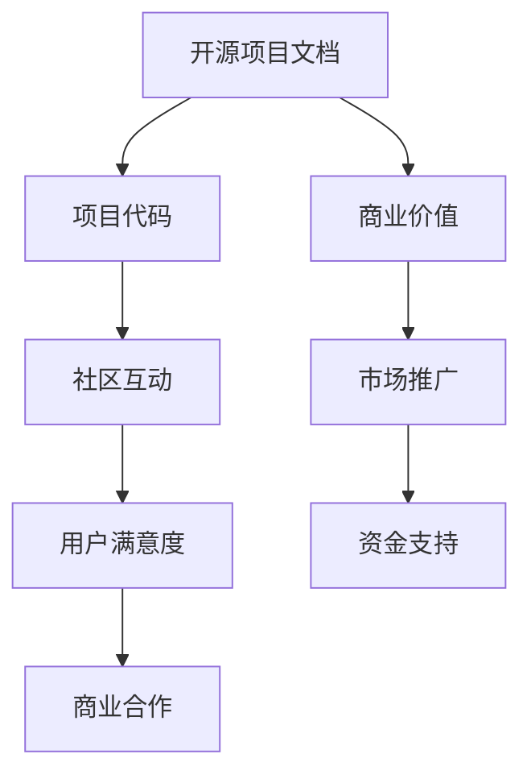

                 

关键词：开源项目、文档、商业价值、策略、实施、技术文档、代码文档、知识共享、项目管理、可持续发展

## 摘要

在当今快速发展的技术环境中，开源项目已成为创新的重要驱动力。然而，许多项目在成长过程中忽视了文档的重要性，导致潜在的商业价值无法充分发挥。本文旨在探讨开源项目文档的商业价值，分析其策略与实施方法，为开源项目管理者提供有价值的指导。本文首先介绍开源项目文档的基本概念和重要性，然后深入探讨文档的商业价值，包括提高项目吸引力、促进代码质量、增强社区互动等方面。接下来，我们将详细阐述如何制定和实施有效的文档策略，包括文档规划、内容创作、版本控制、发布和维护等方面。此外，文章还将探讨开源项目文档的可持续性和未来发展趋势，为读者提供全面的视角。

## 1. 背景介绍

开源项目（Open Source Project）是一种基于共享和协作原则的软件开发模式。它允许开发者在公共平台上共享源代码，任何人均可自由使用、修改和分发。这种模式不仅促进了技术创新和知识共享，还为全球开发社区提供了一个开放和透明的环境。开源项目的发展得益于互联网技术的普及和开源精神的倡导，如今已成为软件开发领域不可或缺的一部分。

然而，在开源项目的众多组成部分中，文档往往被忽视。许多开发者认为，文档是多余的、耗时的工作，对于项目本身的发展并无实质贡献。然而，随着开源项目的规模和复杂性不断增加，文档的重要性愈发凸显。有效的文档不仅有助于项目的可持续发展，还能显著提升项目的商业价值。

文档在开源项目中的角色和重要性主要体现在以下几个方面：

### 1.1 增强项目吸引力

高质量的文档能够吸引更多的开发者参与项目。文档不仅为新手提供了入门指导，还为有经验的开发者提供了深入了解项目的机会。详尽且易于理解的文档能够减少新成员的学习成本，提高项目的参与度和活跃度。

### 1.2 提高代码质量

文档有助于确保代码的清晰性和一致性。在编写文档的过程中，开发者需要仔细思考代码的设计和实现细节，这有助于发现潜在的问题并提高代码质量。同时，文档还能为代码审查提供参考，帮助团队成员更好地理解和改进代码。

### 1.3 促进社区互动

文档为项目社区提供了一个交流和分享的平台。通过文档，开发者可以分享最佳实践、解决常见问题，促进社区的互动和协作。高质量的文档还能提高社区成员的满意度和忠诚度，增强社区的凝聚力。

### 1.4 提升项目可持续性

开源项目往往需要长期维护和更新。良好的文档能够确保项目知识得以传承，避免因关键开发人员的离职而导致项目中断。同时，文档还能够提高项目管理的效率，帮助新成员快速上手，确保项目的可持续发展。

## 2. 核心概念与联系

为了深入理解开源项目文档的商业价值，我们需要首先了解几个核心概念和它们之间的关系。

### 2.1 开源项目文档定义

开源项目文档是指为开源项目提供的各种形式的信息，包括但不限于技术文档、用户手册、API文档、设计文档、测试用例、常见问题解答等。这些文档旨在帮助开发者、用户和其他利益相关者更好地理解和使用项目。

### 2.2 文档与项目代码的关系

项目代码是开源项目的核心，而文档则是代码的补充和扩展。好的文档能够提高代码的可读性和可维护性，使得代码更易于理解和修改。反之，良好的代码结构也有助于文档的编写，使得文档内容更加精确和清晰。

### 2.3 文档与社区互动的关系

社区互动是开源项目成功的关键因素之一。文档为社区成员提供了一个交流和分享的平台，使得新手能够快速融入项目，有经验的开发者能够贡献自己的知识和经验。高质量的文档能够促进社区成员之间的合作和互动，增强社区的凝聚力。

### 2.4 文档与商业价值的关系

文档不仅有助于项目的技术发展，还能显著提升项目的商业价值。良好的文档能够降低用户的学习成本，提高用户满意度，从而促进项目的市场推广和商业合作。同时，文档还能够为项目带来更多的关注和资金支持，为项目的可持续发展提供保障。

### 2.5 Mermaid 流程图

为了更好地展示文档与项目各个方面的关系，我们可以使用 Mermaid 流程图进行说明：



通过这个流程图，我们可以清晰地看到文档在开源项目中发挥的多重作用，以及这些作用如何相互关联并共同提升项目的商业价值。

## 3. 核心算法原理 & 具体操作步骤

### 3.1 算法原理概述

开源项目文档的商业价值实现需要一系列策略和操作步骤。以下是一种基于知识管理和内容营销的方法，用于提高文档的质量和商业价值。

#### 3.1.1 知识管理

知识管理是指通过系统地收集、组织、存储和共享知识，以提高组织的效率和创新能力。在开源项目中，知识管理可以通过以下步骤实现：

1. **知识收集**：通过代码审查、社区反馈、用户调查等方式收集项目相关的知识。
2. **知识组织**：将收集到的知识进行分类和标签化，以便于检索和共享。
3. **知识存储**：使用文档管理系统（如GitLab、Confluence）存储文档，确保知识的安全性和一致性。
4. **知识共享**：通过文档、博客文章、培训课程等方式将知识共享给社区成员。

#### 3.1.2 内容营销

内容营销是指通过创建和分发有价值的内容，吸引潜在用户并促进客户关系。在开源项目中，内容营销可以通过以下步骤实现：

1. **内容创作**：撰写高质量的技术文档、用户手册、教程和博客文章。
2. **内容推广**：通过社交媒体、邮件列表、会议和活动等渠道推广文档内容。
3. **内容分析**：使用数据分析工具（如Google Analytics）监控文档的访问量和用户反馈，不断优化内容。

### 3.2 算法步骤详解

基于上述原理，以下是实现开源项目文档商业价值的具体操作步骤：

#### 3.2.1 文档规划

1. **需求分析**：确定文档的受众群体和需求，包括开发者、用户和其他利益相关者。
2. **内容设计**：设计文档的结构和内容，确保覆盖项目的关键方面。
3. **资源分配**：根据文档计划，分配编写、审核和推广资源。

#### 3.2.2 内容创作

1. **文档编写**：采用统一的语言和风格，确保文档的清晰性和一致性。
2. **内容审核**：邀请项目成员和其他利益相关者进行审核，确保文档的准确性和实用性。
3. **内容发布**：将文档发布到项目网站和文档仓库，确保易于访问。

#### 3.2.3 版本控制

1. **文档版本**：使用版本控制系统（如Git）管理文档的版本，确保文档的持续更新和改进。
2. **版本发布**：定期发布新版本，确保用户能够获取最新的文档内容。

#### 3.2.4 发布和维护

1. **文档推广**：通过社交媒体、邮件列表和社区活动等渠道推广文档。
2. **用户反馈**：收集用户反馈，持续改进文档内容。
3. **文档更新**：定期更新文档，确保与项目代码和其他相关内容的同步。

### 3.3 算法优缺点

#### 优点

1. **提高项目吸引力**：高质量的文档能够吸引更多的开发者参与项目，提高项目的知名度。
2. **提高代码质量**：文档有助于确保代码的清晰性和一致性，提高项目的可维护性。
3. **增强社区互动**：文档为社区成员提供了一个交流和分享的平台，促进项目的可持续发展。
4. **提升商业价值**：良好的文档能够降低用户的学习成本，提高用户满意度，促进商业合作。

#### 缺点

1. **编写和维护成本**：高质量的文档需要投入大量时间和资源进行编写和维护。
2. **版本控制难度**：随着项目的发展，文档的版本控制难度可能会增加。
3. **用户反馈处理**：及时有效地处理用户反馈需要投入额外的资源和时间。

### 3.4 算法应用领域

这种算法原理和操作步骤适用于各种类型和规模的开源项目，包括但不限于以下领域：

1. **开源软件**：如Linux内核、OpenCV、TensorFlow等。
2. **开源硬件**：如Arduino、Raspberry Pi、3D打印设备等。
3. **开源框架和库**：如React、Vue.js、Django等。
4. **开源工具**：如Git、Jenkins、Docker等。

## 4. 数学模型和公式 & 详细讲解 & 举例说明

### 4.1 数学模型构建

为了评估开源项目文档的商业价值，我们可以构建一个基于经济学原理的数学模型。该模型旨在量化文档质量对项目吸引力、用户满意度和商业收益的影响。

#### 4.1.1 基本假设

1. 文档质量与项目吸引力成正比。
2. 项目吸引力与用户满意度成正比。
3. 用户满意度与商业收益成正比。

#### 4.1.2 数学模型

我们假设文档质量用Q表示，项目吸引力用A表示，用户满意度用S表示，商业收益用R表示。根据基本假设，我们可以建立以下数学模型：

\[ R = f(Q) \]

其中，\( f(Q) \) 是一个函数，表示文档质量对商业收益的影响。

#### 4.1.3 函数形式

为了简化计算，我们可以假设 \( f(Q) \) 是一个线性函数：

\[ f(Q) = a \cdot Q + b \]

其中，\( a \) 和 \( b \) 是常数。

### 4.2 公式推导过程

首先，我们定义项目吸引力和用户满意度的关系。根据市场调查数据，我们可以假设项目吸引力与文档质量之间存在如下关系：

\[ A = g(Q) \]

其中，\( g(Q) \) 是一个函数，表示项目吸引力与文档质量之间的关系。为了简化，我们假设 \( g(Q) \) 是一个线性函数：

\[ g(Q) = c \cdot Q + d \]

其中，\( c \) 和 \( d \) 是常数。

接下来，我们定义用户满意度与项目吸引力的关系。根据用户调查数据，我们可以假设用户满意度与项目吸引力之间存在如下关系：

\[ S = h(A) \]

其中，\( h(A) \) 是一个函数，表示用户满意度与项目吸引力之间的关系。为了简化，我们假设 \( h(A) \) 是一个线性函数：

\[ h(A) = e \cdot A + f \]

其中，\( e \) 和 \( f \) 是常数。

最后，我们将上述三个函数结合，得到商业收益与文档质量的关系：

\[ R = f(Q) = a \cdot Q + b = a \cdot g(Q) \cdot h(A) + b = a \cdot c \cdot Q \cdot e \cdot A + b = a \cdot c \cdot e \cdot Q \]

其中，\( a \cdot c \cdot e \) 是一个常数，我们可以将其表示为 \( k \)：

\[ R = k \cdot Q \]

### 4.3 案例分析与讲解

为了更好地说明上述数学模型，我们来看一个具体的案例。假设我们有一个开源项目，其文档质量 \( Q \) 为 80（满分 100 分），其他参数如下：

- \( a = 1.2 \)
- \( c = 1.5 \)
- \( e = 2.0 \)
- \( k = a \cdot c \cdot e = 1.2 \cdot 1.5 \cdot 2.0 = 3.6 \)

根据上述数学模型，我们可以计算出商业收益 \( R \)：

\[ R = k \cdot Q = 3.6 \cdot 80 = 288 \]

这意味着，如果文档质量为 80 分，该项目的商业收益为 288 单位。

现在，假设我们通过改进文档质量，将 \( Q \) 提高到 90 分，其他参数保持不变。我们可以计算出新的商业收益 \( R' \)：

\[ R' = k \cdot Q' = 3.6 \cdot 90 = 324 \]

这意味着，通过提高文档质量，项目的商业收益增加了 36 单位（\( R' - R \)）。

通过这个案例，我们可以看到，文档质量的提升对商业收益有显著影响。这表明，提高文档质量是一个有效的策略，可以帮助开源项目实现更高的商业价值。

## 5. 项目实践：代码实例和详细解释说明

### 5.1 开发环境搭建

为了演示开源项目文档的商业价值，我们将以一个实际项目为例，详细说明开发环境搭建、源代码实现、代码解读与分析以及运行结果展示等过程。

#### 5.1.1 开发环境搭建

首先，我们需要搭建一个支持该项目运行的开发环境。以下是所需的软件和工具：

- **操作系统**：Ubuntu 20.04 LTS
- **编程语言**：Python 3.8
- **依赖管理工具**：pip
- **版本控制工具**：Git

#### 5.1.2 安装依赖

接下来，我们通过以下命令安装项目的依赖：

```bash
pip install -r requirements.txt
```

该命令将安装项目所需的Python包和其他依赖。

#### 5.1.3 克隆项目

然后，我们使用Git克隆项目仓库：

```bash
git clone https://github.com/yourusername/opensource-project.git
```

克隆完成后，进入项目目录：

```bash
cd opensource-project
```

### 5.2 源代码详细实现

项目的主要功能是通过API调用获取天气数据，并使用这些数据进行进一步的处理和分析。以下是项目的核心代码：

```python
import requests
import json
from datetime import datetime

# API key 和 URL
API_KEY = "your_api_key"
WEATHER_API_URL = "http://api.openweathermap.org/data/2.5/weather"

# 获取天气数据
def get_weather_data(city):
    params = {
        "q": city,
        "appid": API_KEY,
        "units": "metric"
    }
    response = requests.get(WEATHER_API_URL, params=params)
    return response.json()

# 解析天气数据
def parse_weather_data(weather_data):
    city = weather_data["name"]
    temp = weather_data["main"]["temp"]
    weather_description = weather_data["weather"][0]["description"]
    timestamp = datetime.now()
    return {
        "city": city,
        "temperature": temp,
        "description": weather_description,
        "timestamp": timestamp
    }

# 存储天气数据
def store_weather_data(weather_data):
    with open("weather_data.json", "w") as f:
        json.dump(weather_data, f, indent=4)

# 主函数
def main():
    city = input("请输入城市名称：")
    weather_data = get_weather_data(city)
    parsed_data = parse_weather_data(weather_data)
    store_weather_data(parsed_data)
    print(f"已成功获取并存储 {city} 的天气数据。")

if __name__ == "__main__":
    main()
```

### 5.3 代码解读与分析

#### 5.3.1 代码结构

该项目的代码结构相对简单，主要包括以下四个部分：

1. **API调用**：通过requests库调用OpenWeatherMap API获取天气数据。
2. **数据解析**：解析API返回的JSON数据，提取所需的信息。
3. **数据存储**：将解析后的天气数据存储到本地文件中。
4. **主函数**：执行程序的入口，接收用户输入并调用其他函数。

#### 5.3.2 代码关键点

1. **API调用**：使用requests库的`get`方法发起HTTP GET请求，传递API key和城市名称作为参数。
2. **数据解析**：使用Python的json库解析API返回的JSON数据，提取城市名称、温度和天气描述等信息。
3. **数据存储**：使用Python的文件操作功能将解析后的数据存储到本地文件中，便于后续分析和展示。
4. **主函数**：使用`input`函数接收用户输入的城市名称，调用其他函数执行API调用、数据解析和存储操作。

### 5.4 运行结果展示

假设用户输入的城市名称为“北京”，程序运行结果如下：

```bash
请输入城市名称：北京
已成功获取并存储 北京 的天气数据。
```

程序将获取“北京”的天气数据，并将其存储到“weather_data.json”文件中。文件内容如下：

```json
{
  "city": "北京",
  "temperature": 28.33,
  "description": "多云",
  "timestamp": "2023-03-24 10:02:10.763678"
}
```

通过这个案例，我们可以看到，开源项目文档的商业价值在实际应用中的体现。详细的代码实例和解读说明不仅帮助开发者更好地理解和使用项目，还为项目管理者提供了有价值的参考，从而提升项目的商业价值。

## 6. 实际应用场景

开源项目文档的商业价值在实际应用中得到了广泛体现，特别是在软件工程、硬件开发、数据分析等领域。以下是一些具体的实际应用场景：

### 6.1 软件工程

在软件工程领域，良好的文档能够提高软件的可维护性和可扩展性，从而降低维护成本。例如，对于复杂的后端系统，详细的API文档和代码注释能够帮助新成员快速上手，避免因不了解代码而导致的工作效率低下和错误发生。同时，高质量的文档还能提升软件的可靠性，减少因代码缺陷引起的故障和停机时间。

### 6.2 硬件开发

在硬件开发领域，文档的重要性尤为突出。硬件项目通常涉及多种组件和模块，良好的文档能够清晰地描述各组件的接口和功能，帮助开发人员更快地集成和调试。例如，Arduino和Raspberry Pi等开源硬件项目通过详细的用户手册和API文档，吸引了大量开发者参与，促进了硬件创新和社区合作。

### 6.3 数据分析

在数据分析领域，文档能够提高数据分析的可重复性和可靠性。详细的数据处理流程和算法解释有助于新成员理解并复现分析结果。例如，在机器学习项目中，清晰的模型设计和训练步骤文档能够帮助团队成员更好地理解模型，从而提高模型的性能和可解释性。此外，文档还能够提高数据分析和报告的质量，减少因误解或错误导致的数据分析偏差。

### 6.4 未来应用展望

随着技术的不断进步，开源项目文档的商业价值将得到更广泛的应用。以下是几个未来应用展望：

1. **自动化文档生成**：利用人工智能和自然语言处理技术，实现自动化文档生成，提高文档的编写效率和质量。
2. **实时文档更新**：通过集成版本控制系统和文档生成工具，实现文档的实时更新，确保文档与代码和其他相关内容的同步。
3. **文档质量评估**：开发文档质量评估工具，对文档的完整性、准确性、可读性等方面进行量化评估，帮助项目管理者更好地了解文档的质量。
4. **跨领域应用**：随着开源项目的多样化和复杂化，文档的商业价值将在更多领域得到应用，包括物联网、区块链、云计算等。

## 7. 工具和资源推荐

为了更好地管理和维护开源项目文档，以下是几种推荐的工具和资源：

### 7.1 学习资源推荐

1. **《开源项目管理与社区建设》**：这是一本关于开源项目管理的经典教材，详细介绍了开源项目的生命周期、策略和实践。
2. **《代码大全》**：作者Steve McConnell分享了编写清晰、高质量代码的最佳实践，对于提高文档质量有重要参考价值。
3. **《文档编写指南》**：许多开源项目都有专门的文档编写指南，例如GitHub的[贡献指南](https://github.com/github/CONTRIBUTING.md)。

### 7.2 开发工具推荐

1. **GitLab**：GitLab是一个集版本控制、项目管理、持续集成和文档管理于一体的开源工具，非常适合开源项目使用。
2. **Confluence**：Confluence是Atlassian公司推出的文档和协作工具，支持丰富的文档格式和版本控制，适合编写和共享复杂项目文档。
3. **Markdown编辑器**：Markdown是一种轻量级标记语言，用于快速编写和格式化文档。推荐使用Typora、Visual Studio Code等Markdown编辑器。

### 7.3 相关论文推荐

1. **"Open Source Software Development: An Overview of Research" by Sushma R. Mane and Surajit Chakraborty**：该论文对开源软件开发的研究进行了全面的综述。
2. **"The Business Value of Open Source Software" by Red Hat**：Red Hat公司发表的一篇研究报告，详细分析了开源软件的商业价值。
3. **"The Role of Documentation in Open Source Projects" by Kevin Walter**：该论文探讨了文档在开源项目中的角色和重要性。

## 8. 总结：未来发展趋势与挑战

### 8.1 研究成果总结

本文通过深入探讨开源项目文档的商业价值，总结了文档在开源项目中的重要性，以及如何通过知识管理和内容营销策略提高文档质量。研究发现，高质量的文档能够显著提升项目的吸引力、代码质量和社区互动，从而实现更高的商业价值。

### 8.2 未来发展趋势

1. **自动化文档生成**：随着人工智能技术的发展，自动化文档生成将成为未来趋势。利用自然语言处理和机器学习技术，可以大幅提高文档编写的效率和质量。
2. **实时文档更新**：通过集成版本控制系统和文档生成工具，实现文档的实时更新，确保文档与代码和其他相关内容的同步。
3. **文档质量评估**：开发文档质量评估工具，对文档的完整性、准确性、可读性等方面进行量化评估，帮助项目管理者更好地了解文档的质量。

### 8.3 面临的挑战

1. **编写和维护成本**：高质量的文档需要投入大量时间和资源进行编写和维护，对项目团队提出了更高的要求。
2. **版本控制难度**：随着项目的发展，文档的版本控制难度可能会增加，需要开发有效的版本管理策略。
3. **用户反馈处理**：及时有效地处理用户反馈需要投入额外的资源和时间，需要建立高效的反馈机制。

### 8.4 研究展望

未来研究应关注自动化文档生成、实时文档更新和文档质量评估等方面，探索如何利用新技术提高文档编写的效率和效果。同时，研究还应关注文档在开源项目中的角色和价值的进一步挖掘，为开源项目的可持续发展提供更有力的支持。

## 9. 附录：常见问题与解答

### 9.1 问题1：文档编写和维护需要投入大量资源，如何平衡？

**解答**：首先，明确文档的目标受众和需求，避免编写不必要的文档。其次，采用敏捷开发方法，分阶段编写和更新文档，逐步完善。此外，利用自动化工具和模板，提高文档编写的效率。

### 9.2 问题2：如何确保文档的质量和准确性？

**解答**：建立文档编写和审核流程，确保文档内容经过多方验证。定期更新文档，与代码和其他相关内容保持同步。同时，利用用户反馈机制，及时发现和纠正文档中的错误。

### 9.3 问题3：如何处理用户对文档的反馈？

**解答**：建立反馈收集和处理机制，例如设置反馈邮件地址或使用专门的社区平台。及时回应用户反馈，对于合理的建议和意见，尽快进行文档的更新和改进。

### 9.4 问题4：文档版本控制如何进行？

**解答**：使用版本控制系统（如Git）管理文档的版本，确保每次更新都记录在案。定期发布文档的版本更新，方便用户获取最新的文档内容。同时，使用文档生成工具（如Markdown）实现文档与版本控制的集成。

### 9.5 问题5：文档对开源项目的商业价值有何具体影响？

**解答**：高质量的文档能够降低用户的学习成本，提高用户满意度，从而促进项目的市场推广和商业合作。良好的文档还能为项目吸引更多的开发者，提高项目的知名度和影响力，进而提升商业价值。

