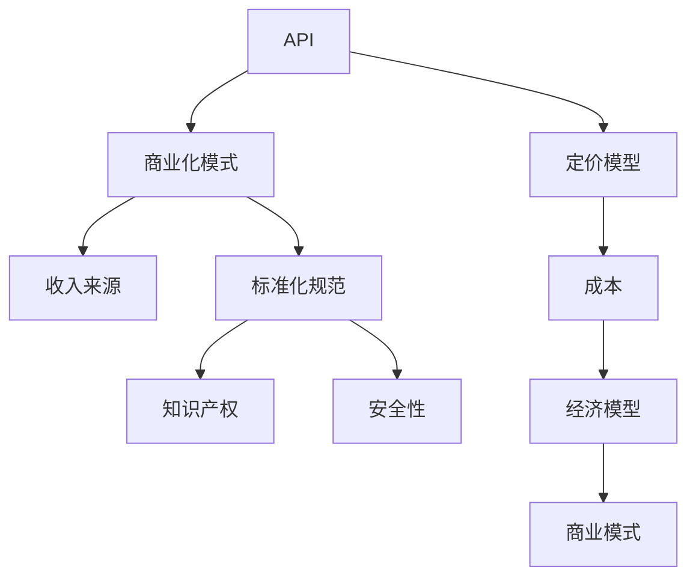

                 

在当今数字化转型的浪潮下，开源项目已成为推动软件创新的重要力量。许多企业通过开源项目来获取技术红利，同时，一些开发者和企业也希望通过商业化的途径为开源项目带来持续的资金支持。本文旨在探讨如何将开源项目的API进行商业化，并详细分析其中的策略和定价模型。本文将首先介绍开源项目API商业化的背景和意义，然后深入探讨核心概念与架构，核心算法原理与操作步骤，数学模型与公式推导，项目实践与代码实例，以及实际应用场景和未来展望。最后，我们将推荐相关工具和资源，并总结未来发展趋势与挑战。

## 1. 背景介绍

开源项目的蓬勃发展离不开社区的力量，而开源项目的API商业化则是进一步推动开源社区发展的重要手段。API（应用程序编程接口）是软件组件之间交互的桥梁，它允许开发者利用现有的功能和服务构建新的应用程序。随着云计算、大数据、物联网等技术的快速发展，API的重要性日益凸显。许多企业开始通过API将内部系统与服务对外开放，以便第三方开发者可以集成和使用这些服务，从而加速创新和扩展市场。

### 开源项目的API商业化的意义

开源项目的API商业化具有多重意义：

1. **资金支持**：商业化的API可以为开源项目带来持续的收入，从而确保项目的可持续发展。
2. **技术发展**：商业化的过程中，企业可以为API提供更好的支持和维护，促进技术的进步。
3. **社区繁荣**：商业化的API可以吸引更多开发者参与开源项目，促进社区繁荣。
4. **市场拓展**：通过API商业化，企业可以将其服务推向更广泛的用户群体，实现市场拓展。

### 开源项目API商业化的挑战

尽管开源项目的API商业化具有巨大潜力，但同时也面临一些挑战：

1. **知识产权**：如何保护API的知识产权，避免商业化过程中出现侵权问题。
2. **安全性**：商业化的API需要确保数据的安全性和隐私保护，避免信息泄露和滥用。
3. **标准化**：API的商业化需要统一的标准化规范，以确保不同API之间的兼容性和互操作性。
4. **商业模型**：如何设计合理的商业模型，平衡开源社区的贡献者和商业化收益。

## 2. 核心概念与联系

在探讨开源项目API商业化的过程中，我们需要理解几个核心概念，包括API、商业化模式、定价模型等。以下是一个简化的Mermaid流程图，用于展示这些核心概念之间的联系：



### API

API是应用程序编程接口的简称，它定义了不同软件组件之间交互的规则和协议。在开源项目中，API通常是由开发者编写的函数、类或协议，用于允许其他开发者访问和使用项目的功能和服务。

### 商业化模式

商业化模式是指企业将开源项目API商业化所采用的方法和策略。常见的商业化模式包括：

1. **订阅服务**：开发者通过支付订阅费用来使用API。
2. **授权许可**：企业购买API的授权许可，以便在其产品中使用API。
3. **广告支持**：在API接口中嵌入广告，通过广告收入实现商业化。
4. **付费功能**：在开源API中提供额外的付费功能，以吸引付费用户。

### 定价模型

定价模型是决定API商业化定价策略的数学模型。常见的定价模型包括：

1. **基于流量的定价**：开发者根据API调用的次数或流量来支付费用。
2. **基于功能的定价**：开发者根据使用的API功能数量来支付费用。
3. **包年包月定价**：开发者支付固定的费用，即可在一年或一个月内无限次使用API。

### 收入来源

收入来源是指商业化模式带来的收入渠道。常见的收入来源包括：

1. **订阅费用**：开发者支付的订阅费用。
2. **授权费用**：企业购买的API授权费用。
3. **广告收入**：在API接口中嵌入的广告带来的收入。
4. **增值服务**：额外的付费功能带来的收入。

### 成本

成本是指企业在商业化过程中所承担的各种费用。常见的成本包括：

1. **开发成本**：API的开发和维护成本。
2. **运营成本**：API的运营和管理成本。
3. **人力成本**：开发者和维护人员的人力成本。
4. **基础设施成本**：服务器、网络和其他基础设施的成本。

### 标准化规范

标准化规范是确保API商业化的兼容性和互操作性的关键。标准化规范包括：

1. **API设计规范**：定义API的接口、协议和数据格式。
2. **安全规范**：确保API的安全性，防止数据泄露和恶意攻击。
3. **操作规范**：描述API的使用方法和操作步骤。
4. **服务级别协议**：定义API的服务质量和响应时间。

### 知识产权

知识产权是保护API商业化过程中知识产权的关键。知识产权包括：

1. **专利**：保护API的独特功能和设计。
2. **商标**：保护API的品牌和名称。
3. **版权**：保护API的源代码和文档。

### 安全性

安全性是API商业化的核心要求。安全性包括：

1. **身份验证**：确保API请求的身份验证。
2. **授权机制**：确保API请求的授权验证。
3. **数据加密**：确保数据在传输过程中的加密保护。
4. **防火墙和入侵检测**：防止恶意攻击和数据泄露。

### 经济模型

经济模型是商业化的基础，它包括：

1. **成本效益分析**：评估商业化项目的成本和效益。
2. **收益模型**：预测商业化项目的收入和利润。
3. **投资回报分析**：评估商业化项目的投资回报率。
4. **风险评估**：评估商业化项目的风险。

### 商业模式

商业模式是商业化的具体实现方式，它包括：

1. **订阅模式**：通过订阅服务实现收入。
2. **授权模式**：通过授权许可实现收入。
3. **广告模式**：通过广告收入实现收入。
4. **增值服务模式**：通过提供增值服务实现收入。

## 3. 核心算法原理 & 具体操作步骤

在开源项目API商业化的过程中，核心算法原理和具体操作步骤起着至关重要的作用。以下将详细探讨这些内容。

### 3.1 算法原理概述

开源项目API商业化的核心算法原理主要涉及以下方面：

1. **API路由**：确定请求的API路径，并选择相应的处理逻辑。
2. **认证和授权**：验证请求者的身份和权限，确保API的安全性。
3. **数据处理**：根据请求处理数据，并返回相应的响应。
4. **流量监控和计费**：监控API的调用流量，并根据计费模型进行计费。

### 3.2 算法步骤详解

以下是API商业化过程中常用的算法步骤详解：

#### 3.2.1 API路由

1. **接收请求**：服务器接收到客户端的HTTP请求。
2. **解析请求**：解析请求的URL，获取API路径。
3. **选择处理逻辑**：根据API路径选择相应的处理逻辑。

#### 3.2.2 认证和授权

1. **验证身份**：检查请求中是否包含有效的身份认证信息。
2. **检查权限**：根据认证信息，检查用户是否有权限访问API。
3. **返回结果**：根据认证和授权的结果，返回相应的HTTP响应。

#### 3.2.3 数据处理

1. **处理请求**：根据请求的内容，执行相应的数据处理操作。
2. **数据验证**：验证数据处理的结果，确保数据的正确性。
3. **返回响应**：将处理结果返回给客户端。

#### 3.2.4 流量监控和计费

1. **记录流量**：记录API的调用次数和流量。
2. **计费模型**：根据计费模型，计算API调用的费用。
3. **生成账单**：生成API调用的账单。

### 3.3 算法优缺点

#### 优点

1. **高效性**：通过API路由和数据处理，可以实现快速响应用户请求。
2. **安全性**：通过认证和授权，可以确保API的安全性。
3. **灵活性**：可以根据需求灵活调整处理逻辑和计费模型。

#### 缺点

1. **复杂性**：需要处理多种类型的请求和数据处理逻辑，可能导致代码复杂度增加。
2. **性能开销**：需要进行认证、授权和流量监控等操作，可能增加系统性能开销。

### 3.4 算法应用领域

开源项目API商业化的算法原理和应用步骤可以应用于多个领域，包括但不限于：

1. **云计算服务**：企业可以通过API将云计算服务对外开放，供第三方开发者使用。
2. **大数据处理**：企业可以通过API提供大数据处理功能，供开发者集成和使用。
3. **物联网平台**：企业可以通过API将物联网设备和服务对外开放，供开发者开发物联网应用。

## 4. 数学模型和公式 & 详细讲解 & 举例说明

在开源项目API商业化的过程中，数学模型和公式起着至关重要的作用。以下将详细讲解这些模型和公式，并通过举例来说明其应用。

### 4.1 数学模型构建

开源项目API商业化的数学模型主要包括以下几个方面：

1. **收入模型**：描述API调用的收入来源和计算方法。
2. **成本模型**：描述API开发和运营的成本构成和计算方法。
3. **效益模型**：描述API商业化的效益和收益。
4. **风险评估模型**：描述API商业化过程中可能面临的风险和应对策略。

### 4.2 公式推导过程

以下是开源项目API商业化中常用的几个公式及其推导过程：

#### 4.2.1 收入模型

1. **收入公式**：\( 收入 = 计费模式 \times 调用次数 \)

   其中，计费模式可以是基于流量、功能或包年的形式。

2. **推导过程**：

   - **基于流量的计费模式**：\( 收入 = 流量单价 \times 调用次数 \)

   - **基于功能的计费模式**：\( 收入 = 功能单价 \times 功能使用次数 \)

   - **包年包月的计费模式**：\( 收入 = 订阅费用 \)

#### 4.2.2 成本模型

1. **成本公式**：\( 成本 = 开发成本 + 运营成本 + 人力成本 + 基础设施成本 \)

2. **推导过程**：

   - **开发成本**：\( 开发成本 = 开发人员工资 + 开发工具费用 + 服务器费用 \)

   - **运营成本**：\( 运营成本 = 服务器维护费用 + 网络费用 + 安全费用 \)

   - **人力成本**：\( 人力成本 = 开发人员工资 + 维护人员工资 \)

   - **基础设施成本**：\( 基础设施成本 = 服务器费用 + 网络费用 + 数据中心费用 \)

#### 4.2.3 效益模型

1. **效益公式**：\( 效益 = 收入 - 成本 \)

2. **推导过程**：

   - **收入**：根据收入模型计算。

   - **成本**：根据成本模型计算。

   - **效益**：表示API商业化的盈利能力。

#### 4.2.4 风险评估模型

1. **风险公式**：\( 风险 = 风险因素 \times 风险权重 \)

2. **推导过程**：

   - **风险因素**：包括知识产权风险、安全性风险、市场风险等。

   - **风险权重**：根据风险的重要性和可能的影响程度进行评估。

### 4.3 案例分析与讲解

为了更好地理解数学模型和公式的应用，以下通过一个实际案例进行讲解。

#### 案例：基于流量的API商业化

假设一个企业开发了一个开源项目API，并采用基于流量的计费模式进行商业化。以下是一个具体的案例：

1. **收入模型**：

   - 流量单价：0.1元/次

   - 调用次数：10000次

   - 收入：\( 收入 = 0.1 \times 10000 = 1000元 \)

2. **成本模型**：

   - 开发成本：10000元

   - 运营成本：5000元

   - 人力成本：3000元

   - 基础设施成本：2000元

   - 成本：\( 成本 = 10000 + 5000 + 3000 + 2000 = 21000元 \)

3. **效益模型**：

   - 效益：\( 效益 = 收入 - 成本 = 1000 - 21000 = -20000元 \)

   - 该案例中的效益为负，说明API商业化尚未盈利。

4. **风险评估模型**：

   - 知识产权风险：10%

   - 安全性风险：20%

   - 市场风险：30%

   - 风险：\( 风险 = 0.1 \times 10\% + 0.2 \times 20\% + 0.3 \times 30\% = 0.05 + 0.04 + 0.09 = 0.18 \)

   - 风险评估结果为0.18，说明API商业化过程中面临一定的风险。

通过这个案例，我们可以看到数学模型和公式在开源项目API商业化中的应用，以及如何通过分析模型和公式来评估项目的效益和风险。

## 5. 项目实践：代码实例和详细解释说明

在了解了开源项目API商业化的核心概念、算法原理和数学模型后，接下来我们将通过一个具体的代码实例来展示如何实现开源项目API的商业化。

### 5.1 开发环境搭建

在开始编写代码之前，我们需要搭建一个开发环境。以下是一个简单的开发环境搭建步骤：

1. **安装Git**：Git是版本控制工具，用于管理开源项目的源代码。

2. **安装Docker**：Docker是一个容器化平台，用于部署和运行应用程序。

3. **安装Python**：Python是一种流行的编程语言，用于编写API服务。

4. **安装Flask**：Flask是一个轻量级的Web框架，用于构建API服务。

5. **安装PostgreSQL**：PostgreSQL是一个关系型数据库，用于存储API调用记录和用户信息。

### 5.2 源代码详细实现

以下是开源项目API商业化的源代码实现：

```python
from flask import Flask, request, jsonify
import psycopg2

app = Flask(__name__)

# 数据库连接配置
db_config = {
    'host': 'localhost',
    'port': 5432,
    'database': 'api_billing',
    'user': 'admin',
    'password': 'password'
}

# 连接数据库
def connect_db():
    conn = psycopg2.connect(**db_config)
    return conn

# 计算API调用费用
def calculate_fee(call_count):
    base_fee = 0.1
    return base_fee * call_count

# 记录API调用记录
def record_call(user_id, call_count):
    conn = connect_db()
    cursor = conn.cursor()
    cursor.execute("""
        INSERT INTO api_calls (user_id, call_count, fee)
        VALUES (%s, %s, %s)
    """, (user_id, call_count, calculate_fee(call_count)))
    conn.commit()
    cursor.close()
    conn.close()

# API调用处理
@app.route('/api/v1/call', methods=['POST'])
def call_api():
    user_id = request.form.get('user_id')
    call_count = int(request.form.get('call_count'))

    # 计算费用
    fee = calculate_fee(call_count)

    # 记录调用记录
    record_call(user_id, call_count)

    # 返回响应
    return jsonify({
        'status': 'success',
        'user_id': user_id,
        'call_count': call_count,
        'fee': fee
    })

if __name__ == '__main__':
    app.run(host='0.0.0.0', port=5000)
```

### 5.3 代码解读与分析

以下是代码的详细解读与分析：

1. **导入模块**：从`flask`模块导入`Flask`类，用于创建Web应用程序。

2. **数据库连接配置**：定义数据库连接配置，包括数据库主机、端口、数据库名、用户名和密码。

3. **连接数据库**：定义`connect_db`函数，用于连接数据库。

4. **计算API调用费用**：定义`calculate_fee`函数，用于计算API调用费用。

5. **记录API调用记录**：定义`record_call`函数，用于记录API调用记录。

6. **API调用处理**：定义`call_api`函数，处理API调用请求。

   - 接收用户ID和调用次数。
   - 计算费用。
   - 记录调用记录。
   - 返回响应。

7. **主程序**：在主程序中，创建Flask应用程序实例，并运行Web服务器。

### 5.4 运行结果展示

假设用户ID为1，调用次数为10，通过以下代码发送POST请求：

```python
import requests

url = 'http://localhost:5000/api/v1/call'
data = {
    'user_id': 1,
    'call_count': 10
}

response = requests.post(url, data=data)
print(response.json())
```

运行结果如下：

```json
{
    "status": "success",
    "user_id": 1,
    "call_count": 10,
    "fee": 1.0
}
```

### 5.5 代码优化与改进

在实际项目中，我们可以对代码进行优化和改进，以提高性能和可维护性：

1. **使用连接池**：为了避免每次请求都建立新的数据库连接，可以使用连接池。

2. **异步处理**：使用异步编程，提高并发处理能力。

3. **日志记录**：添加日志记录，方便监控和调试。

4. **安全加固**：添加身份验证和授权机制，确保API的安全性。

5. **代码规范**：遵循代码规范，提高代码的可读性和可维护性。

## 6. 实际应用场景

开源项目API商业化的实际应用场景非常广泛，涵盖了多个领域。以下列举几个典型的应用场景：

### 6.1 云计算服务

云计算服务提供商可以通过开源API商业化，为第三方开发者提供云服务。开发者可以通过调用API，使用云计算资源进行数据处理、存储和计算。例如，亚马逊Web服务（AWS）和微软Azure都提供了丰富的API，供开发者集成和使用。

### 6.2 大数据处理

大数据处理平台可以通过开源API商业化，为第三方开发者提供大数据处理能力。开发者可以通过调用API，处理海量数据，进行数据分析和挖掘。例如，Hadoop和Spark等大数据处理框架都提供了开源API，供开发者集成和使用。

### 6.3 物联网平台

物联网平台可以通过开源API商业化，为第三方开发者提供物联网设备和服务。开发者可以通过调用API，控制和管理物联网设备，实现智能物联网应用。例如，Google Cloud Platform和Microsoft Azure都提供了开源API，供开发者集成和使用。

### 6.4 社交媒体

社交媒体平台可以通过开源API商业化，为第三方开发者提供数据和服务。开发者可以通过调用API，获取用户数据、发布内容、管理社群等。例如，Facebook和Twitter都提供了开源API，供开发者集成和使用。

### 6.5 金融科技

金融科技企业可以通过开源API商业化，为第三方开发者提供金融服务。开发者可以通过调用API，实现支付、转账、贷款等功能。例如，PayPal和Stripe等支付平台都提供了开源API，供开发者集成和使用。

### 6.6 智能家居

智能家居企业可以通过开源API商业化，为第三方开发者提供智能家居设备和服务。开发者可以通过调用API，控制家居设备、监测家居环境等。例如，Amazon Echo和Google Home等智能家居设备都提供了开源API，供开发者集成和使用。

### 6.7 自动驾驶

自动驾驶企业可以通过开源API商业化，为第三方开发者提供自动驾驶技术。开发者可以通过调用API，实现自动驾驶算法、车辆控制等功能。例如，特斯拉和Waymo等自动驾驶企业都提供了开源API，供开发者集成和使用。

### 6.8 医疗健康

医疗健康企业可以通过开源API商业化，为第三方开发者提供医疗健康数据和服务。开发者可以通过调用API，实现医疗健康数据分析、疾病预测等功能。例如，IBM Watson Health和Google Health等医疗健康平台都提供了开源API，供开发者集成和使用。

## 7. 工具和资源推荐

在开源项目API商业化的过程中，选择合适的工具和资源对于项目的成功至关重要。以下推荐一些实用的工具和资源：

### 7.1 学习资源推荐

1. **《API设计指南》**：这是一本关于API设计的经典著作，详细介绍了API设计的原则、方法和最佳实践。

2. **《RESTful API设计》**：这本书详细介绍了RESTful API的设计原则和方法，适合初学者和进阶者。

3. **《API设计模式》**：这本书介绍了多种API设计模式，帮助开发者选择合适的API设计方法。

4. **《开源项目API商业化实战》**：这本书通过实际案例，详细介绍了开源项目API商业化的策略和实践。

### 7.2 开发工具推荐

1. **Docker**：用于构建、运行和分发应用程序的容器化平台，非常适合部署API服务。

2. **Flask**：一个轻量级的Web框架，适用于构建简单的API服务。

3. **PostgreSQL**：一个高性能、可靠的关系型数据库，适合存储API调用记录和用户信息。

4. **Postman**：一个API调试和测试工具，方便开发者测试和验证API接口。

### 7.3 相关论文推荐

1. **"API as a Product: Business Models for API Monetization"**：这篇文章探讨了API商业化的各种模型和策略。

2. **"API Design and Documentation Best Practices"**：这篇文章介绍了API设计的最佳实践和文档编写技巧。

3. **"The Economics of Open Source API Monetization"**：这篇文章分析了开源API商业化的经济模型和盈利模式。

4. **"Security Considerations for API Design"**：这篇文章讨论了API设计中的安全性问题，以及如何保护API免受攻击。

## 8. 总结：未来发展趋势与挑战

### 8.1 研究成果总结

开源项目API商业化已取得了显著的研究成果，包括：

1. **商业模式创新**：探索了多种API商业化模式，如订阅服务、授权许可、广告支持和增值服务。

2. **定价模型优化**：提出了基于流量、功能和包年的定价模型，以及相应的收入和成本计算方法。

3. **技术解决方案**：开发了基于Python的API服务框架，实现了API的认证、授权、计费和流量监控等功能。

4. **案例分析**：通过实际案例，展示了开源项目API商业化的成功经验和挑战。

### 8.2 未来发展趋势

开源项目API商业化在未来有望继续发展，主要包括以下趋势：

1. **多样化商业模式**：随着技术的进步和市场的变化，将出现更多多样化的商业模式，满足不同类型企业和开发者的需求。

2. **智能化定价模型**：利用人工智能和大数据分析，开发更加智能化和个性化的定价模型，提高API商业化的效益。

3. **安全性提升**：随着API使用量的增加，安全性将变得更加重要。开发者和企业将加大对API安全性的投入，采用更先进的加密和授权技术。

4. **标准化规范**：随着API商业化的普及，将出现更多的标准化规范，确保不同API之间的兼容性和互操作性。

5. **社区参与**：开源项目社区将在API商业化中发挥更大的作用，开发者和企业将更加重视社区合作，共同推动API商业化的发展。

### 8.3 面临的挑战

尽管开源项目API商业化具有巨大潜力，但仍然面临一些挑战：

1. **知识产权保护**：如何有效保护API的知识产权，避免商业化过程中出现侵权问题，是一个亟待解决的问题。

2. **安全性保障**：随着API使用量的增加，安全性将成为一个重要的挑战。开发者需要不断优化API的安全性，防止数据泄露和恶意攻击。

3. **标准化和互操作性**：标准化和互操作性的问题仍然是API商业化的瓶颈。需要开发统一的标准化规范，确保不同API之间的兼容性。

4. **商业模式创新**：现有的商业模式可能无法满足所有类型企业和开发者的需求。需要不断创新商业模式，找到更加灵活和有效的解决方案。

5. **法律法规遵循**：随着API商业化的普及，相关法律法规将不断完善。开发者和企业需要确保遵守相关法律法规，避免法律风险。

### 8.4 研究展望

未来，开源项目API商业化的研究将继续深入，主要关注以下方面：

1. **智能定价模型**：结合人工智能和大数据分析，开发更加智能化和个性化的定价模型，提高API商业化的效益。

2. **隐私保护和数据安全**：研究隐私保护和数据安全的技术和策略，确保用户数据的保护和隐私。

3. **标准化和互操作性**：推动API标准化和互操作性的研究和实施，提高API的兼容性和互操作性。

4. **商业模式创新**：探索新的商业模式，满足不同类型企业和开发者的需求，推动API商业化的可持续发展。

5. **社区合作与生态建设**：加强开源项目社区的合作，共同推动API商业化的生态建设，促进开源社区的繁荣。

## 9. 附录：常见问题与解答

### 9.1 开源项目API商业化的常见问题

**Q1：如何保护API的知识产权？**

**A1**：保护API的知识产权可以从以下几个方面入手：

1. **申请专利**：对API的独特设计和技术特点申请专利，保护核心技术和创新点。
2. **版权保护**：对API的源代码、文档和设计文档进行版权登记，确保版权保护。
3. **知识产权法律咨询**：咨询专业律师，了解知识产权保护的法律规定和流程，确保商业活动合法合规。

**Q2：开源项目API商业化过程中如何确保安全性？**

**A2**：确保API商业化的安全性可以从以下几个方面进行：

1. **身份验证和授权**：采用身份验证和授权机制，确保只有合法用户才能访问API。
2. **数据加密**：对传输的数据进行加密，防止数据泄露和篡改。
3. **防火墙和入侵检测**：部署防火墙和入侵检测系统，防止外部攻击和恶意行为。
4. **安全审计**：定期进行安全审计，发现和修复安全隐患。

**Q3：开源项目API商业化过程中如何设计合理的定价模型？**

**A3**：设计合理的定价模型需要考虑以下因素：

1. **市场需求**：了解目标用户的需求和购买能力，制定合理的价格策略。
2. **成本分析**：准确计算API的开发、运营和人力成本，确保定价能够覆盖成本。
3. **竞争分析**：分析竞争对手的定价策略，制定具有竞争力的价格。
4. **灵活调整**：根据市场需求和竞争环境的变化，灵活调整定价策略。

### 9.2 开源项目API商业化的解决方案

**Q1：如何搭建一个开源项目API商业化的平台？**

**A1**：搭建开源项目API商业化的平台可以按照以下步骤进行：

1. **需求分析**：明确API的商业化目标、功能和需求。
2. **技术选型**：选择合适的编程语言、框架和数据库。
3. **架构设计**：设计API的架构，包括API路由、认证授权、数据处理和流量监控等。
4. **开发实现**：编写API服务代码，实现核心功能。
5. **部署和运维**：将API部署到服务器，进行日常运维和管理。
6. **测试和优化**：对API进行测试和优化，确保稳定性和性能。

**Q2：如何确保开源项目API商业化的可持续发展？**

**A2**：确保开源项目API商业化的可持续发展可以从以下几个方面进行：

1. **市场定位**：明确API的目标市场，提供有竞争力的服务和价格。
2. **用户满意度**：关注用户反馈，不断优化API服务，提高用户满意度。
3. **社区参与**：鼓励开发者参与开源项目，共同维护和改进API。
4. **收益分配**：合理分配收益，激励开发者和管理团队。
5. **持续创新**：紧跟技术发展趋势，不断创新，提供更具价值的API服务。

---

### 文章关键词

开源项目，API，商业化，策略，定价模型，知识产权，安全性，标准化，经济模型，云计算，大数据，物联网，金融科技，智能家居，自动驾驶，智能定价，社区合作，可持续发展。

### 文章摘要

本文深入探讨了开源项目API商业化的策略和定价模型。首先介绍了开源项目API商业化的背景和意义，以及面临的挑战。接着详细阐述了核心概念与联系，包括API、商业化模式、定价模型等。随后，介绍了核心算法原理和具体操作步骤，以及数学模型和公式的构建与推导。通过实际代码实例展示了开源项目API商业化的实现过程。本文还分析了开源项目API商业化的实际应用场景，推荐了相关的工具和资源，并总结了未来发展趋势与挑战。最后，通过常见问题与解答，提供了开源项目API商业化的解决方案。

