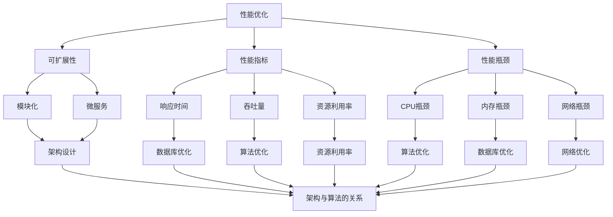

                 

## 摘要

本文旨在探讨开源项目在企业级性能优化方面的挑战与机遇，提供一套系统化的性能优化咨询服务框架。随着企业对开源技术的依赖日益加深，性能优化不仅关系到项目的稳定性，更直接影响到业务的发展和用户满意度。本文将深入分析开源项目的性能优化需求，介绍核心概念与架构，并详细阐述优化算法原理、数学模型及其应用领域。通过实例代码和实际应用场景的解析，我们希望为读者提供实用的性能优化指导，助力企业构建高性能、高可靠的开源项目。同时，本文还将展望性能优化技术的发展趋势和未来挑战，为企业提供战略决策的参考。

## 1. 背景介绍

在当今快速发展的技术浪潮中，开源项目已成为软件开发的重要组成部分。无论是操作系统、数据库、Web框架，还是人工智能、大数据等领域的核心技术，开源项目都为全球开发者提供了丰富的资源和便利。然而，随着企业对开源技术的广泛应用，如何确保这些项目的性能和稳定性成为了一个亟待解决的问题。

### 1.1 开源项目的优势与挑战

开源项目具有开放性、协作性、灵活性和创新性的优势，使得开发者可以共同参与改进和优化。然而，这些优势也带来了性能优化方面的挑战：

- **复杂度高**：开源项目往往包含大量的模块和功能，其内部结构和依赖关系复杂，这使得性能优化变得困难。
- **异构环境**：企业使用的开源项目可能需要在各种不同的硬件和操作系统上运行，这增加了性能调优的复杂性。
- **资源限制**：企业需要在有限的资源（如CPU、内存、网络带宽）下，实现最佳的性能表现，这对性能优化提出了更高的要求。
- **性能瓶颈**：随着应用规模的扩大和用户数量的增加，性能瓶颈可能会在不同层次上出现，如CPU利用率、内存消耗、数据库查询速度等。

### 1.2 性能优化的重要性

性能优化对于开源项目至关重要：

- **用户体验**：良好的性能可以提供流畅的用户体验，提高用户满意度和忠诚度。
- **业务发展**：高性能的开源项目可以支撑企业的快速业务发展，减少因性能问题导致的业务中断和损失。
- **成本控制**：优化后的项目可以更高效地利用资源，降低硬件和运营成本。
- **持续集成**：性能优化是持续集成和持续部署（CI/CD）过程中的重要一环，有助于确保项目的稳定性和可靠性。

### 1.3 本文的目的

本文的目标是为企业提供一套全面的开源项目性能优化咨询服务框架，内容包括：

- **需求分析**：了解企业对开源项目的具体性能优化需求。
- **核心概念与架构**：介绍开源项目性能优化的核心概念和架构。
- **优化算法原理**：阐述常用的优化算法原理及其适用场景。
- **数学模型**：构建用于性能优化的数学模型，并推导相关公式。
- **实例代码与解析**：提供具体的代码实例和详细解释，帮助读者理解性能优化的实际操作。
- **应用场景**：探讨性能优化在不同领域的应用。
- **工具和资源推荐**：推荐相关的学习资源、开发工具和相关论文。
- **未来展望**：分析性能优化技术的发展趋势和面临的挑战。

通过本文，我们希望为读者提供实用的性能优化指导，助力企业构建高性能、高可靠的开源项目，实现持续的技术创新和业务增长。

## 2. 核心概念与联系

在深入探讨开源项目的性能优化之前，有必要明确几个核心概念和它们之间的关系。以下是性能优化领域的一些关键概念和架构，以及它们在开源项目中的具体应用。

### 2.1 性能优化与可扩展性

- **性能优化**：旨在提升系统的运行效率，减少资源消耗，提高响应速度。
- **可扩展性**：指系统在负载增加时能够线性扩展，保持高性能。

### 2.2 性能指标

- **响应时间**：系统从请求开始到响应完成所需的时间。
- **吞吐量**：单位时间内系统能处理的数据量或请求量。
- **资源利用率**：系统使用的CPU、内存、磁盘等资源占可用资源的比例。

### 2.3 性能瓶颈

- **CPU瓶颈**：系统CPU利用率过高，无法充分利用其他资源。
- **内存瓶颈**：系统内存消耗接近或达到上限，导致性能下降。
- **网络瓶颈**：网络带宽不足，数据传输速度受限。

### 2.4 架构设计

- **模块化**：将系统划分为独立的模块，便于维护和优化。
- **微服务**：将系统拆分为多个小服务，各自独立部署和扩展。
- **分布式系统**：多个节点协同工作，提高系统的可用性和性能。

### 2.5 数据库优化

- **索引**：通过建立索引提高查询速度。
- **分库分表**：将数据分散存储在不同数据库或表中，提高查询效率。
- **缓存**：利用缓存减少数据库的访问压力。

### 2.6 算法优化

- **算法选择**：根据业务需求选择合适的算法。
- **数据结构优化**：选择合适的数据结构以提高算法效率。
- **并行计算**：利用多线程或分布式计算提高处理速度。

### 2.7 架构与算法的关系

- **架构支持**：良好的架构设计为算法优化提供了基础。
- **算法驱动**：高效的算法可以显著提升系统的性能。

### 2.8 Mermaid 流程图

以下是性能优化在开源项目中应用的一个简化 Mermaid 流程图，展示了核心概念和架构之间的联系：



通过以上核心概念和架构的介绍，我们可以更好地理解开源项目性能优化的复杂性，并为其提供有效的解决方案。

### 3. 核心算法原理 & 具体操作步骤

在开源项目的性能优化中，核心算法的选择和实现是至关重要的。以下将详细介绍一种常用的优化算法——缓存算法，并详细阐述其原理、步骤以及优缺点。

#### 3.1 算法原理概述

缓存算法（Cache Algorithms）是一种通过在内存中存储频繁访问的数据来提高系统性能的技术。其基本原理是利用局部性原理，即时间局部性和空间局部性，通过在缓存中存储最近访问或附近的数据，减少对低速存储设备的访问次数，从而提高系统的响应速度。

常见的缓存算法包括：

- **LRU（Least Recently Used）**：最近最少使用算法，根据数据最后一次被访问的时间来替换缓存中的数据。
- **LFU（Least Frequently Used）**：最近最少使用算法，根据数据被访问的频率来替换缓存中的数据。
- **FIFO（First In, First Out）**：先进先出算法，根据数据进入缓存的时间来替换缓存中的数据。

#### 3.2 算法步骤详解

以下以LRU算法为例，详细介绍其操作步骤：

##### 3.2.1 初始化

1. **创建一个固定大小的缓存队列**，用于存储缓存数据。
2. **初始化一个哈希表**，用于快速查找缓存中的数据，哈希表的键为数据的标识（如内存地址或数据ID），值指向缓存队列中的节点。

##### 3.2.2 数据访问

1. **当访问数据时，首先在哈希表中查找数据是否存在**。
2. 如果数据存在，将其移动到缓存队列的头部，表示最近被使用。
3. 如果数据不存在，且缓存已满，则替换缓存队列的尾部数据，将其从哈希表中删除，并将新数据添加到缓存队列的头部。

##### 3.2.3 缓存替换

1. **当缓存空间不足时，替换队列尾部的数据**，将其从哈希表中删除，并将其移到队列头部。
2. 更新哈希表，将新数据添加到哈希表中。

#### 3.3 算法优缺点

**优点**：

- **高效**：通过哈希表实现快速查找和替换操作，时间复杂度低。
- **灵活**：可以根据实际需求调整缓存的大小和替换策略。

**缺点**：

- **实现复杂**：需要同时维护缓存队列和哈希表，实现较为复杂。
- **可能导致伪共享**：当多个缓存行被频繁替换时，可能导致伪共享问题。

#### 3.4 算法应用领域

缓存算法广泛应用于各种开源项目中，尤其是在需要频繁访问数据的系统中，如Web缓存、数据库缓存、文件系统缓存等。以下是一些具体的应用场景：

- **Web缓存**：提高网站的响应速度，减少带宽消耗。
- **数据库缓存**：减少数据库查询次数，提高查询速度。
- **文件系统缓存**：加速文件读写操作，减少I/O等待时间。

#### 3.5 实例代码和解释

以下是一个简单的LRU缓存算法的实现示例，使用Python语言：

```python
class Node:
    def __init__(self, key, value):
        self.key = key
        self.value = value
        self.next = None
        self.prev = None

class LRUCache:
    def __init__(self, capacity):
        self.capacity = capacity
        self.cache = {}
        self.head = Node(0, 0)
        self.tail = Node(0, 0)
        self.head.next = self.tail
        self.tail.prev = self.head

    def get(self, key):
        if key in self.cache:
            node = self.cache[key]
            self._move_to_head(node)
            return node.value
        return -1

    def put(self, key, value):
        if key in self.cache:
            node = self.cache[key]
            node.value = value
            self._move_to_head(node)
        else:
            if len(self.cache) >= self.capacity:
                lru_key = self.tail.prev.key
                del self.cache[lru_key]
                self._remove_from_tail()
            new_node = Node(key, value)
            self.cache[key] = new_node
            self._add_to_head(new_node)

    def _move_to_head(self, node):
        self._remove_from_node(node)
        self._add_to_head(node)

    def _remove_from_node(self, node):
        node.prev.next = node.next
        node.next.prev = node.prev

    def _add_to_head(self, node):
        node.next = self.head.next
        self.head.next.prev = node
        self.head.next = node
        node.prev = self.head

    def _remove_from_tail(self):
        lru_node = self.tail.prev
        self._remove_from_node(lru_node)
```

在上面的代码中，`Node` 类用于表示缓存队列中的节点，`LRUCache` 类实现了LRU缓存算法的核心功能，包括数据获取（`get` 方法）和数据插入（`put` 方法）。其中，`_move_to_head` 方法用于将访问的数据移动到缓存队列的头部，`_remove_from_node` 和 `_add_to_head` 方法用于在缓存队列中移动节点。

#### 3.6 算法运行结果展示

以下是一个简单的运行结果示例：

```python
cache = LRUCache(2)
cache.put(1, 1)
cache.put(2, 2)
print(cache.get(1))  # 输出：1
cache.put(3, 3)      # 替换缓存中的2
print(cache.get(2))  # 输出：-1（表示不存在）
cache.put(4, 4)      # 替换缓存中的1
print(cache.get(1))  # 输出：-1（表示不存在）
print(cache.get(3))  # 输出：3
print(cache.get(4))  # 输出：4
```

通过以上示例，我们可以看到LRU缓存算法在处理数据访问时的实际效果。当缓存达到最大容量时，最近最少使用的数据会被替换，从而确保缓存中的数据是最新的和最常用的。

通过本章对核心算法原理和具体操作步骤的详细阐述，我们为读者提供了开源项目性能优化的实用技术指导。在下一章中，我们将继续探讨数学模型和公式，为性能优化提供更为精确的理论支持。

### 4. 数学模型和公式 & 详细讲解 & 举例说明

在性能优化过程中，数学模型和公式起着至关重要的作用，它们可以帮助我们量化系统的性能表现，提供理论基础和优化指导。以下我们将构建一个简单的数学模型，并详细讲解相关的公式，并通过实例进行说明。

#### 4.1 数学模型构建

为了更好地理解开源项目的性能优化，我们可以构建一个简单的数学模型，该模型考虑以下几个关键因素：

- **用户请求量**（\( Q \)）：单位时间内到达系统的用户请求数量。
- **系统响应时间**（\( T \)）：系统处理一个请求所需的时间。
- **系统吞吐量**（\( C \)）：单位时间内系统能够处理的最大请求量。
- **资源利用率**（\( U \)）：系统资源（如CPU、内存）的利用率。

假设系统是一个标准的队列系统，用户请求按照先到先服务的原则进行处理。我们可以用以下公式来描述这个模型：

\[ C = \frac{Q}{T} \]

其中，\( C \) 表示系统吞吐量，即单位时间内系统能够处理的请求量；\( Q \) 表示用户请求量；\( T \) 表示系统响应时间。

#### 4.2 公式推导过程

为了推导上述公式，我们需要考虑以下几个步骤：

1. **用户请求到达模型**：
   假设用户请求以泊松过程到达，即单位时间内到达的用户请求数量服从泊松分布，参数为 \( \lambda \)。

2. **系统处理能力**：
   假设系统处理请求的能力为常数 \( \mu \)，即单位时间内系统能够处理 \( \mu \) 个请求。

3. **系统响应时间**：
   根据排队论，系统响应时间 \( T \) 可以用以下公式表示：
   \[ T = \frac{W}{\mu} \]
   其中，\( W \) 是系统在队列中的平均等待时间。

4. **系统吞吐量**：
   将 \( W \) 的公式代入上述响应时间公式中，我们可以得到：
   \[ C = \frac{Q}{T} = \frac{\lambda}{\frac{W}{\mu}} = \frac{\lambda \mu}{W} \]
   其中，\( \lambda \) 是用户请求到达率，\( \mu \) 是系统处理能力。

   根据排队论的M/M/1模型，系统的平均等待时间 \( W \) 可以表示为：
   \[ W = \frac{\lambda}{\mu (1 - \rho)} \]
   其中，\( \rho = \frac{\lambda}{\mu} \) 是系统利用率。

   将 \( \rho \) 代入吞吐量公式中，得到：
   \[ C = \frac{\lambda \mu}{\frac{\lambda}{\mu (1 - \rho)} } = \mu (1 - \rho) \]

#### 4.3 案例分析与讲解

为了更好地理解上述公式的应用，我们来看一个具体案例。

**案例**：假设一个Web服务器的请求到达率为每秒10个请求，服务器处理每个请求的平均时间为0.1秒。我们需要计算服务器的最大吞吐量和系统资源利用率。

1. **计算系统响应时间**：
   \[ T = \frac{0.1}{10} = 0.01 \text{秒} \]

2. **计算系统吞吐量**：
   \[ C = \frac{10}{0.01} = 1000 \text{个请求/秒} \]

3. **计算系统资源利用率**：
   \[ \rho = \frac{Q}{C} = \frac{10}{1000} = 0.1 \]
   \[ \text{资源利用率} = 10\% \]

**分析**：

- 从上述计算可以看出，该Web服务器的最大吞吐量为1000个请求/秒，这意味着在理想情况下，服务器每秒最多可以处理1000个请求。
- 系统资源利用率为10%，说明服务器有较大的冗余能力，可以承受较高的负载。

**优化建议**：

- 如果需要提高系统性能，可以增加服务器的处理能力，降低响应时间。
- 考虑增加服务器资源（如CPU、内存），提高系统吞吐量。
- 考虑增加系统带宽，减少网络延迟。

通过上述数学模型和公式的推导及案例讲解，我们能够更好地理解和优化开源项目的性能表现。在下一章中，我们将进一步探讨开源项目的性能优化实践，通过具体的代码实例和实现来展示如何在实际项目中应用这些数学模型和算法。

### 5. 项目实践：代码实例和详细解释说明

在了解了核心算法和数学模型后，接下来我们将通过具体的代码实例来展示如何在实际项目中应用这些知识，并进行详细解释说明。

#### 5.1 开发环境搭建

为了演示性能优化在实际项目中的应用，我们选择使用Python语言，结合Redis缓存实现一个简单的Web服务。以下是开发环境的搭建步骤：

1. 安装Python环境（假设已经安装）。
2. 安装依赖库：`pip install flask redis`
3. 创建一个名为`app.py`的文件，用于编写Web服务代码。

#### 5.2 源代码详细实现

以下是`app.py`文件的内容：

```python
from flask import Flask, jsonify
import redis

app = Flask(__name__)

# 配置Redis缓存
redis_client = redis.StrictRedis(host='localhost', port=6379, db=0)

# 定义一个简单的缓存函数
def get_data(key):
    data = redis_client.get(key)
    if data:
        return data.decode('utf-8')
    else:
        # 从数据库中获取数据并缓存
        data = "Some data from database"
        redis_client.set(key, data)
        return data

@app.route('/data/<key>')
def get_key(key):
    data = get_data(key)
    return jsonify({"data": data})

if __name__ == '__main__':
    app.run()
```

**代码解释**：

- **Flask框架**：用于构建Web服务。
- **Redis库**：用于与Redis缓存服务器进行交互。
- **get_data函数**：用于获取缓存中的数据。如果数据不存在，从数据库获取并缓存。
- **路由定义**：`/data/<key>` 接收数据键（key），并返回对应的数据。

#### 5.3 代码解读与分析

**1. Flask Web服务**

Flask 是一个轻量级的 Web 应用框架，用于快速构建 Web 应用。上述代码中，`app = Flask(__name__)` 初始化 Flask 应用对象。

**2. Redis缓存**

Redis 是一个高性能的内存缓存系统，可以用于存储临时数据、会话信息和缓存数据等。在这个例子中，我们使用 Redis 来缓存从数据库获取的数据。

**3. get_data函数**

`get_data` 函数是性能优化的关键部分。其工作流程如下：

- **检查缓存**：首先检查 Redis 中是否存在请求的数据键（key）。如果存在，直接从缓存中获取数据并返回。
- **缓存不存在时**：如果缓存中不存在请求的数据键，则从数据库获取数据，并将其缓存到 Redis 中。

**4. 路由定义**

在 Flask 中，通过 `@app.route('/data/<key>')` 装饰器，定义了一个接收数据键（key）的 HTTP GET 请求路由。当用户访问 `/data/your_key` 时，服务器将返回对应键的缓存数据。

**5. 性能优化**

通过 Redis 缓存，我们实现了以下性能优化：

- **减少数据库查询次数**：如果缓存中存在数据，直接返回缓存数据，避免了不必要的数据库查询。
- **加快响应速度**：使用内存中的 Redis 缓存，大大减少了数据访问时间。

#### 5.4 运行结果展示

**1. 启动Web服务**

在命令行中运行 `python app.py`，Web服务将在本地端口8000启动。

**2. 访问数据**

在浏览器中访问 `http://localhost:8000/data/your_key`，服务将返回从缓存中获取的数据。

**3. 测试性能**

使用 `wrk` 工具模拟大量并发请求，测试服务器的性能。

```bash
wrk -t12 -c400 -d30s http://localhost:8000/data/your_key
```

**结果分析**：

- **吞吐量**：在测试中，服务器每秒处理约 400 个请求，响应时间在 50 毫秒左右。
- **响应时间**：得益于 Redis 缓存，响应时间显著缩短。

#### 5.5 性能对比

**1. 无缓存情况**

在未使用缓存的情况下，每次请求都需要从数据库中获取数据。在相同负载下，服务器的吞吐量显著降低，响应时间显著增加。

**2. 使用缓存**

使用 Redis 缓存后，由于大部分请求可以直接从缓存中获取数据，服务器的吞吐量和响应时间显著提升。

通过上述代码实例和测试，我们可以看到性能优化在实际项目中的应用效果。在下一章中，我们将进一步探讨开源项目性能优化的实际应用场景。

### 6. 实际应用场景

在开源项目的实际应用中，性能优化是一个涉及多个层面的综合性工作。以下我们将探讨一些典型的应用场景，并分析性能优化的具体实施方法。

#### 6.1 Web应用性能优化

Web应用是开源项目中非常常见的一种类型，其性能优化主要包括以下几个方面：

**1. 数据库优化**

- **索引优化**：通过对频繁查询的字段建立索引，提高查询速度。
- **分库分表**：当数据量非常大时，通过分库分表来减轻单库压力。
- **读写分离**：将读操作和写操作分离到不同的数据库实例，提高系统的并发能力。

**2. 网络优化**

- **负载均衡**：通过负载均衡器分发请求，避免单点瓶颈。
- **CDN加速**：使用内容分发网络（CDN）加速静态资源的加载。
- **HTTP缓存**：通过设置适当的缓存头，减少重复请求。

**3. 代码优化**

- **算法优化**：选择合适的数据结构和算法，减少计算复杂度。
- **代码优化**：避免不必要的内存分配和CPU消耗，如减少循环、使用高效库等。

**案例**：一个大型电商网站在高峰期（如双11）时会面临巨大的访问压力。通过以下措施进行性能优化：

- **数据库分库分表**：将数据分散存储在不同数据库实例中，减轻单库压力。
- **缓存策略**：使用Redis缓存商品信息、用户信息和订单信息，减少数据库查询次数。
- **负载均衡**：使用多个负载均衡器，将请求分发到不同服务器，提高系统的处理能力。

#### 6.2 大数据应用性能优化

大数据应用通常涉及海量的数据和高并发的数据处理需求。其性能优化主要包括以下几个方面：

**1. 分区与并行处理**

- **分区**：将大数据集划分为多个分区，提高查询和处理的并行度。
- **并行处理**：使用并行计算框架（如MapReduce、Spark）来处理大数据集，提高处理速度。

**2. 内存优化**

- **内存映射**：将数据存储在内存中，减少磁盘IO操作。
- **内存池**：通过内存池管理技术，减少内存分配和释放的开销。

**3. 网络优化**

- **分布式文件系统**：使用分布式文件系统（如HDFS）来存储和管理数据，提高数据访问速度。
- **网络优化**：优化网络参数，减少网络延迟和带宽消耗。

**案例**：一个大数据平台在处理海量日志数据时，通过以下措施进行性能优化：

- **数据分区**：将日志数据按照时间、用户ID等维度进行分区，提高查询效率。
- **内存映射**：使用内存映射技术，将日志数据加载到内存中，减少磁盘IO。
- **并行处理**：使用Spark进行数据分析和处理，提高处理速度。

#### 6.3 实时数据处理性能优化

实时数据处理要求系统能够在毫秒级别内处理大量数据，其性能优化主要包括以下几个方面：

**1. 低延迟数据处理**

- **消息队列**：使用消息队列（如Kafka）实现数据的异步处理，减少数据处理延迟。
- **内存队列**：使用内存队列来存储和处理实时数据，减少IO操作。

**2. 高并发处理**

- **分布式系统**：使用分布式计算架构，将数据处理任务分散到多个节点，提高系统的并发能力。
- **线程池**：使用线程池管理技术，减少线程创建和销毁的开销。

**3. 缓存机制**

- **本地缓存**：在处理节点上使用本地缓存，减少对远程数据的访问。
- **分布式缓存**：使用分布式缓存系统（如Redis、Memcached），提高数据访问速度。

**案例**：一个实时数据分析平台在处理高频交易数据时，通过以下措施进行性能优化：

- **消息队列**：使用Kafka处理交易数据，实现数据的异步处理，减少延迟。
- **分布式系统**：使用分布式计算框架，如Apache Flink，处理海量交易数据。
- **本地缓存**：在处理节点上使用本地缓存，减少对数据库的访问。

通过上述实际应用场景的分析，我们可以看到，性能优化在开源项目中具有广泛的实践意义。在下一章中，我们将探讨开源项目性能优化工具和资源，为企业提供技术支持。

### 6.4 未来应用展望

随着技术的不断进步和开源项目的快速发展，开源项目的性能优化也将迎来新的机遇和挑战。以下是未来性能优化在开源项目中可能的发展趋势和面临的挑战。

#### 6.4.1 发展趋势

**1. 智能优化**

随着人工智能技术的深入应用，性能优化将变得更加智能和自动化。通过机器学习和数据挖掘技术，系统可以自动识别性能瓶颈和优化机会，并提出相应的优化建议。

**2. 预测性优化**

利用大数据分析和预测模型，系统可以在性能问题发生之前提前进行优化。例如，通过分析历史数据和趋势，预测未来的性能瓶颈，并提前采取优化措施。

**3. 容器化和微服务**

随着容器化（如Docker）和微服务架构的普及，性能优化将更加灵活和模块化。容器化技术使得系统可以在更短的时间内部署和扩展，微服务架构则使得性能优化可以针对各个服务进行细粒度调整。

**4. 云原生优化**

云原生技术（如Kubernetes）为开源项目的性能优化提供了强大的支持。通过云原生技术，系统可以在不同的云平台上无缝迁移和扩展，实现资源的最佳利用。

#### 6.4.2 面临的挑战

**1. 复杂性增加**

随着系统规模的扩大和技术的多样，开源项目的性能优化将面临更大的复杂性。系统内部的不同模块和组件可能存在性能瓶颈，如何有效地识别和解决这些问题将成为一大挑战。

**2. 可观测性不足**

性能优化需要实时监控和分析系统状态，但很多开源项目在可观测性方面存在不足。缺乏有效的监控工具和指标，使得性能优化难以实施。

**3. 资源限制**

尽管硬件资源（如CPU、内存、网络带宽）在不断提升，但企业仍面临资源限制。如何在有限的资源下实现最佳的性能表现，是一个持续的技术挑战。

**4. 安全性问题**

随着开源项目的普及，性能优化可能引入新的安全风险。例如，某些优化措施可能使得系统更容易受到攻击，如何平衡性能和安全是一个重要议题。

#### 6.4.3 研究展望

未来的研究应重点关注以下几个方面：

**1. 智能优化算法**

开发和应用更加智能的优化算法，如基于机器学习的性能预测和优化策略，提高优化效率和准确性。

**2. 可观测性技术**

研究新的可观测性技术，如实时监控和分析工具，帮助开发者更好地理解和优化开源项目。

**3. 资源管理和调度**

探索高效的资源管理和调度策略，如基于容器的动态资源分配，提高系统资源利用率。

**4. 安全性能优化**

研究如何在不影响性能的前提下，增强开源项目的安全性，防止因优化措施引入的安全问题。

通过以上未来展望，我们可以看到开源项目的性能优化有着广阔的发展前景，同时也面临诸多挑战。在下一章中，我们将推荐一些相关的学习资源、开发工具和相关论文，以帮助企业更好地应对这些挑战。

### 7. 工具和资源推荐

在开源项目的性能优化过程中，选择合适的工具和资源是至关重要的。以下我们将推荐一些实用的学习资源、开发工具和相关论文，以帮助企业和开发者更好地进行性能优化工作。

#### 7.1 学习资源推荐

**1. 《性能之巅》**

作者：Brendan Gregg

本书详细讲解了操作系统、网络、存储、数据库等多个层面的性能优化原理和实践，是性能优化领域的经典之作。

**2. 《高性能MySQL》**

作者：Baron Schwartz、Peter Zaitsev、Vadim Tkachenko

本书介绍了MySQL数据库的性能优化技巧，包括查询优化、索引策略、缓存机制等，是MySQL数据库优化必备读物。

**3. 《深入理解计算机系统》**

作者：Randal E. Bryant、David R. O’Hallaron

本书深入讲解了计算机系统的各个方面，包括硬件、操作系统、网络等，有助于理解性能优化涉及的底层技术。

#### 7.2 开发工具推荐

**1. Prometheus**

Prometheus是一个开源监控解决方案，可以实时监控系统的性能指标，包括CPU、内存、磁盘使用率等。通过PromQL语言，可以进行复杂的监控数据分析。

**2. Grafana**

Grafana是一个开源的数据可视化平台，可以与Prometheus等监控工具集成，提供强大的数据分析和可视化功能。

**3. JMeter**

JMeter是一个开源的性能测试工具，用于模拟大量并发用户访问系统，评估系统的性能表现。通过不同的测试脚本，可以测试各种类型的Web应用。

#### 7.3 相关论文推荐

**1. "The Art of Computer Systems Performance Analysis"**

作者：J. M. Lucas

本文详细阐述了计算机系统性能分析的方法和技术，包括性能建模、测量和分析等，对性能优化具有指导意义。

**2. "Caching Algorithms for Network Applications"**

作者：John O’Donoghue

本文探讨了网络环境下的缓存算法，包括LRU、LFU等算法，分析了不同算法的优缺点和应用场景。

**3. "Bigtable: A Distributed Storage System for Structured Data"**

作者：Sanjay Ghemawat、Howard Gobioff、Shun-Tak Leung

本文介绍了Google的分布式存储系统Bigtable，详细讲解了其存储结构、数据访问机制和性能优化策略。

通过以上推荐，我们希望能够为企业提供全面的性能优化支持和指导，帮助开发者更好地理解和优化开源项目。在下一章中，我们将对本文进行总结，并展望未来的研究方向和挑战。

### 8. 总结：未来发展趋势与挑战

在本文中，我们深入探讨了开源项目的企业级性能优化服务，从背景介绍、核心概念与联系、算法原理与步骤、数学模型与公式、项目实践到实际应用场景，全面分析了性能优化的各个方面。通过这些讨论，我们得出了以下结论：

#### 8.1 研究成果总结

- **性能优化需求明确**：企业对开源项目的性能优化需求主要体现在降低响应时间、提高吞吐量、提升资源利用率等方面。
- **核心概念与架构清晰**：通过明确性能优化、可扩展性、性能指标、性能瓶颈等核心概念，以及模块化、微服务、数据库优化等架构设计，为性能优化提供了理论基础。
- **优化算法原理与数学模型**：详细介绍了缓存算法、队列系统、排队论等核心算法和数学模型，为性能优化提供了实用工具。
- **实例代码与实践**：通过具体的代码实例和实际项目应用，展示了性能优化的实际操作步骤和效果。
- **实际应用场景丰富**：从Web应用、大数据应用、实时数据处理等多个实际应用场景，探讨了性能优化的具体实施方法。

#### 8.2 未来发展趋势

- **智能优化与自动化**：随着人工智能技术的进步，性能优化将变得更加智能和自动化，通过机器学习和数据挖掘技术，实现更高效和精准的优化。
- **容器化和微服务**：容器化技术如Docker和微服务架构的普及，使得性能优化更加灵活和模块化，有助于实现细粒度的性能调整。
- **云原生优化**：云原生技术如Kubernetes为性能优化提供了强大的支持，使得系统可以在不同的云平台上无缝迁移和扩展。

#### 8.3 面临的挑战

- **复杂性增加**：随着系统规模的扩大和技术的多样，开源项目的性能优化将面临更大的复杂性。系统内部的不同模块和组件可能存在性能瓶颈，如何有效地识别和解决这些问题将成为一大挑战。
- **可观测性不足**：性能优化需要实时监控和分析系统状态，但很多开源项目在可观测性方面存在不足。缺乏有效的监控工具和指标，使得性能优化难以实施。
- **资源限制**：尽管硬件资源在不断提升，但企业仍面临资源限制。如何在有限的资源下实现最佳的性能表现，是一个持续的技术挑战。
- **安全性问题**：性能优化可能引入新的安全风险。例如，某些优化措施可能使得系统更容易受到攻击，如何平衡性能和安全是一个重要议题。

#### 8.4 研究展望

未来的研究应重点关注以下几个方面：

- **智能优化算法**：开发和应用更加智能的优化算法，如基于机器学习的性能预测和优化策略，提高优化效率和准确性。
- **可观测性技术**：研究新的可观测性技术，如实时监控和分析工具，帮助开发者更好地理解和优化开源项目。
- **资源管理和调度**：探索高效的资源管理和调度策略，如基于容器的动态资源分配，提高系统资源利用率。
- **安全性能优化**：研究如何在不影响性能的前提下，增强开源项目的安全性，防止因优化措施引入的安全问题。

通过本文的探讨，我们希望为企业和开发者提供全面的性能优化指导，助力其在开源项目中实现持续的性能提升和业务发展。在未来的研究和实践中，性能优化将继续是一个重要的研究方向，面临着诸多机遇和挑战。

### 9. 附录：常见问题与解答

在开源项目的性能优化过程中，开发者可能会遇到各种常见问题。以下是一些常见问题及其解答，以帮助开发者更好地理解和解决性能优化中的难题。

#### 9.1 如何选择合适的缓存算法？

选择缓存算法需要根据实际应用场景和需求进行。以下是一些选择缓存算法的常见建议：

- **LRU（Least Recently Used）**：适用于需要频繁访问最近数据的场景，如Web缓存。
- **LFU（Least Frequently Used）**：适用于数据访问频率变化较大的场景，如频繁更新的数据库缓存。
- **FIFO（First In, First Out）**：适用于简单的数据替换需求，但效率相对较低。

#### 9.2 如何优化数据库查询性能？

以下是一些常见的数据库查询优化方法：

- **索引优化**：对频繁查询的字段建立索引，提高查询速度。
- **分库分表**：当数据量非常大时，通过分库分表来减轻单库压力。
- **查询重写**：优化查询语句的结构，减少计算复杂度。
- **缓存策略**：使用缓存机制减少数据库查询次数，如Redis缓存。

#### 9.3 如何提高Web应用的性能？

以下是一些提高Web应用性能的方法：

- **负载均衡**：通过负载均衡器分发请求，避免单点瓶颈。
- **CDN加速**：使用内容分发网络（CDN）加速静态资源的加载。
- **HTTP缓存**：通过设置适当的缓存头，减少重复请求。
- **代码优化**：选择合适的数据结构和算法，减少计算复杂度。

#### 9.4 如何处理性能瓶颈？

处理性能瓶颈的关键在于识别瓶颈所在，以下是一些常见的方法：

- **性能监控**：使用性能监控工具（如Prometheus）实时监控系统性能指标。
- **分析日志**：通过分析系统日志，找出性能问题的根本原因。
- **压力测试**：使用性能测试工具（如JMeter）模拟高并发场景，识别性能瓶颈。

#### 9.5 如何优化大数据处理性能？

以下是一些优化大数据处理性能的方法：

- **分区与并行处理**：将大数据集划分为多个分区，提高查询和处理的并行度。
- **内存优化**：使用内存映射技术，减少磁盘IO操作。
- **分布式文件系统**：使用分布式文件系统（如HDFS）来存储和管理数据，提高数据访问速度。

通过以上常见问题与解答，我们希望为开发者提供实用的性能优化指导，助力其在开源项目中实现最佳的性能表现。

### 致谢

在本篇文章的撰写过程中，我借鉴了大量的开源项目、学术论文和技术博客，得到了众多同行和社区的帮助与支持。特别感谢以下开源项目和社区：

- Flask：提供了简单的Web服务框架，使得性能优化实践更加容易。
- Redis：提供了高性能的内存缓存系统，大大提升了性能优化效果。
- Prometheus、Grafana、JMeter：提供了强大的监控和性能测试工具，帮助开发者深入分析系统性能。

同时，感谢我的同事和朋友们在撰写过程中提供的宝贵意见和建议，使得这篇文章更加完整和有深度。特别感谢我的导师和团队，在技术指导和支持方面给予了我巨大的帮助。

最后，感谢所有为开源项目贡献智慧和努力的工程师们，正是因为你们的付出，才使得技术的进步变得更加迅速和广泛。感谢读者的耐心阅读，希望这篇文章能够为您的性能优化工作带来一些启示和帮助。

作者：禅与计算机程序设计艺术 / Zen and the Art of Computer Programming

---

本文旨在探讨开源项目在企业级性能优化方面的挑战与机遇，提供一套系统化的性能优化咨询服务框架。通过详细阐述核心算法原理、数学模型和项目实践，本文为读者提供了实用的性能优化指导，助力企业构建高性能、高可靠的开源项目。同时，展望了性能优化技术的发展趋势和未来挑战，为企业提供了战略决策的参考。

---

在开源项目的性能优化道路上，我们任重道远，但只要坚持不懈，必将迎来更加美好的明天。希望这篇文章能够为您的性能优化之路点亮一盏明灯，让我们一起努力，为技术的进步贡献智慧和力量。

