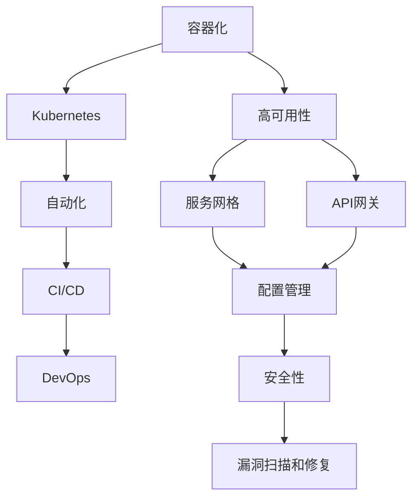

                 

关键词：开源项目，企业级部署，容器化，自动化，高可用性，安全性，成本效益，云原生，微服务架构，DevOps，CI/CD，Kubernetes，Docker，服务网格，容器编排，API网关，服务发现，配置管理，持续集成/持续部署。

> 摘要：本文将探讨如何通过企业级部署服务，将开源项目提升为具有商业价值的产品。本文将详细讨论容器化、自动化、高可用性、安全性等方面的关键技术，并探讨如何在开源项目中实施这些技术，从而实现成本效益、云原生和微服务架构的目标。同时，本文还将介绍DevOps、CI/CD等实践方法，以及相关的工具和资源推荐。

## 1. 背景介绍

随着云计算和容器技术的发展，开源项目已经成为企业级应用开发的主流。开源项目因其灵活性、社区支持和免费等特点，吸引了众多开发者参与，并迅速在各个领域得到广泛应用。然而，对于许多企业来说，如何将开源项目部署到生产环境中，并保证其稳定运行，仍然是一个挑战。

企业级部署服务提供了一套完整的解决方案，包括容器化、自动化、高可用性、安全性等关键技术，帮助企业在使用开源项目时降低成本、提高效率、确保质量。本文将围绕这些关键点，探讨如何利用企业级部署服务，将开源项目转化为具有商业价值的产品。

## 2. 核心概念与联系

### 2.1. 容器化

容器化是一种轻量级、可移植的计算模型，它允许开发人员在不同的环境中运行应用程序，而无需担心依赖和环境差异。容器化技术主要包括Docker和Kubernetes。

**Docker**：一种开源的应用容器引擎，它允许开发人员将应用程序及其依赖环境打包成一个可移植的容器，从而实现一次编写、到处运行。

**Kubernetes**：一种开源的容器编排平台，它可以帮助企业管理和自动化容器化应用程序的部署、扩展和运营。

### 2.2. 自动化

自动化是指通过脚本或工具，将复杂的任务简化为自动化流程。在开源项目的企业级部署中，自动化至关重要，它可以帮助企业提高效率、减少错误并确保一致性。

**CI/CD**：持续集成/持续部署是一种自动化流程，它将代码集成和部署过程自动化，从而确保软件质量并加快交付速度。

**DevOps**：一种文化和实践，它强调开发和运维团队之间的协作和沟通，从而实现快速交付和高质量的应用程序。

### 2.3. 高可用性

高可用性是指系统在长时间运行过程中，能够保持稳定运行并最小化故障时间的特性。在开源项目的企业级部署中，高可用性至关重要，它可以帮助企业确保服务的持续可用性。

**服务网格**：一种用于管理服务间通信的基础设施层，它可以帮助企业实现服务隔离、流量管理和故障转移。

**API网关**：一种用于管理外部访问应用程序的接口，它可以帮助企业实现负载均衡、安全性和服务发现。

### 2.4. 安全性

安全性是指系统在运行过程中，能够抵御恶意攻击和保证数据安全的特性。在开源项目的企业级部署中，安全性至关重要，它可以帮助企业保护应用程序和数据。

**配置管理**：一种用于管理和配置应用程序的工具，它可以帮助企业确保配置的一致性和安全性。

**漏洞扫描和修复**：一种用于识别和修复应用程序漏洞的工具，它可以帮助企业降低安全风险。

### 2.5. Mermaid 流程图

下面是一个关于开源项目企业级部署的 Mermaid 流程图，展示了各个核心概念之间的联系：



## 3. 核心算法原理 & 具体操作步骤

### 3.1. 算法原理概述

在开源项目的企业级部署中，核心算法主要涉及容器编排、自动化流程管理、服务发现和配置管理等方面。

**容器编排**：通过Kubernetes等容器编排工具，实现容器的自动化部署、扩展和管理。

**自动化流程管理**：通过CI/CD工具，实现代码集成、测试和部署的自动化。

**服务发现**：通过API网关和服务网格，实现服务间的自动发现和通信。

**配置管理**：通过配置管理工具，实现配置的一致性和安全性。

### 3.2. 算法步骤详解

**3.2.1. 容器编排**

1. 定义部署配置：使用YAML文件定义容器镜像、容器数量、资源限制等参数。
2. 创建Kubernetes集群：使用Kubernetes集群管理工具（如kubeadm）创建Kubernetes集群。
3. 部署应用程序：使用Kubernetes集群部署应用程序，并监控其运行状态。

**3.2.2. 自动化流程管理**

1. 设置CI/CD环境：搭建CI/CD环境，包括代码仓库、构建服务器和部署服务器。
2. 编写CI/CD流水线：编写CI/CD流水线，包括代码检查、编译、测试、部署等步骤。
3. 持续集成/持续部署：根据CI/CD流水线，实现代码的持续集成和持续部署。

**3.2.3. 服务发现**

1. 部署API网关：部署API网关，实现服务间的负载均衡和安全控制。
2. 配置服务网格：配置服务网格，实现服务间的自动发现和通信。
3. 发布服务：发布应用程序服务，实现服务的自动注册和发现。

**3.2.4. 配置管理**

1. 定义配置：使用配置管理工具（如Ansible、Terraform）定义配置。
2. 配置同步：同步配置到各个节点，确保配置的一致性。
3. 配置审计：对配置进行审计，确保配置的安全和合规。

### 3.3. 算法优缺点

**容器编排**：

- 优点：简化部署和管理，提高资源利用率。
- 缺点：初期设置较复杂，对运维人员要求较高。

**自动化流程管理**：

- 优点：提高开发效率，降低人工干预。
- 缺点：可能引入新的风险，如代码质量下降。

**服务发现**：

- 优点：简化服务间的通信，提高系统的可扩展性。
- 缺点：可能引入单点故障，需要额外配置。

**配置管理**：

- 优点：确保配置的一致性和安全性。
- 缺点：配置管理工具种类繁多，学习曲线较陡峭。

### 3.4. 算法应用领域

容器编排、自动化流程管理、服务发现和配置管理等算法在企业级部署中具有广泛的应用领域，包括：

- 云原生应用：使用容器化技术，实现应用的快速部署和扩展。
- 微服务架构：使用服务发现和配置管理，实现服务间的自动化管理和通信。
- DevOps实践：通过CI/CD等工具，实现开发和运维的自动化和协作。

## 4. 数学模型和公式 & 详细讲解 & 举例说明

### 4.1. 数学模型构建

在开源项目的企业级部署中，我们可以使用一些数学模型来衡量系统的性能和成本。

**性能模型**：通过计算系统的响应时间和吞吐量，评估系统的性能。

$$
响应时间 = \frac{总处理时间}{请求数量}
$$

$$
吞吐量 = \frac{请求数量}{总处理时间}
$$

**成本模型**：通过计算系统的硬件成本、软件成本和运营成本，评估系统的总成本。

$$
总成本 = 硬件成本 + 软件成本 + 运营成本
$$

### 4.2. 公式推导过程

**性能模型**的推导过程如下：

1. 假设系统在一段时间内处理了N个请求，总处理时间为T。
2. 响应时间为每个请求的处理时间之和。
3. 响应时间与总处理时间成正比，与请求数量成反比。

**成本模型**的推导过程如下：

1. 硬件成本包括服务器、存储和网络设备的成本。
2. 软件成本包括操作系统、数据库和中间件的成本。
3. 运营成本包括电力、带宽和人力资源的成本。

### 4.3. 案例分析与讲解

假设一家企业需要部署一个在线购物平台，我们使用数学模型来评估系统的性能和成本。

**性能评估**：

1. 预计每天有10000个用户访问平台，总处理时间为10分钟。
2. 响应时间为 $$ \frac{10分钟}{10000个用户} = 0.001分钟/用户 = 0.06秒/用户 $$。
3. 吞吐量为 $$ \frac{10000个用户}{10分钟} = 1000个用户/分钟 $$。

**成本评估**：

1. 硬件成本：服务器5000元/台，共需要5台，总成本为25000元。
2. 软件成本：操作系统1000元/台，共需要5台，总成本为5000元。
3. 运营成本：电力200元/台/月，共需要5台，总成本为1000元/月。
4. 总成本为 25000元（硬件）+5000元（软件）+1000元（运营）= 31000元。

通过数学模型，我们可以快速评估系统的性能和成本，为企业的决策提供依据。

## 5. 项目实践：代码实例和详细解释说明

### 5.1. 开发环境搭建

在本节中，我们将搭建一个简单的开源项目企业级部署环境，包括Docker、Kubernetes和CI/CD等工具。

**步骤 1**：安装Docker

在服务器上安装Docker，可以使用以下命令：

```shell
sudo apt-get update
sudo apt-get install docker.io
sudo systemctl start docker
```

**步骤 2**：安装Kubernetes

在服务器上安装Kubernetes，可以使用以下命令：

```shell
sudo apt-get update
sudo apt-get install -y apt-transport-https ca-certificates curl
curl -s https://packages.cloud.google.com/apt/doc/apt-key.gpg | sudo apt-key add -
echo "deb https://apt.kubernetes.io/ kubernetes-xenial main" | sudo tee -a /etc/apt/sources.list.d/kubernetes.list
sudo apt-get update
sudo apt-get install -y kubelet kubeadm kubectl
sudo systemctl start kubelet
```

**步骤 3**：安装CI/CD工具

在本项目中，我们使用Jenkins作为CI/CD工具。在服务器上安装Jenkins，可以使用以下命令：

```shell
sudo apt-get update
sudo apt-get install -y openjdk-8-jdk
wget -q -O - https://pkg.jenkins.io/debian-stable/jenkins.io.key | sudo apt-key add -
echo deb https://pkg.jenkins.io/debian-stable binary/ | sudo tee /etc/apt/sources.list.d/jenkins.list
sudo apt-get update
sudo apt-get install -y jenkins
sudo systemctl start jenkins
```

### 5.2. 源代码详细实现

在本节中，我们以一个简单的Web应用为例，介绍如何在Kubernetes上进行部署和自动化。

**步骤 1**：编写Dockerfile

在项目的根目录下，创建一个名为Dockerfile的文件，内容如下：

```Dockerfile
FROM node:14-alpine
WORKDIR /app
COPY package*.json ./
RUN npm install
COPY . .
EXPOSE 3000
CMD ["npm", "start"]
```

这个Dockerfile定义了基于Node.js的Alpine Linux镜像，并在其中安装了项目的依赖和主文件，并暴露了3000端口。

**步骤 2**：构建Docker镜像

在项目的根目录下，运行以下命令构建Docker镜像：

```shell
docker build -t my-web-app .
```

**步骤 3**：编写Kubernetes部署配置文件

在项目的根目录下，创建一个名为deployment.yaml的文件，内容如下：

```yaml
apiVersion: apps/v1
kind: Deployment
metadata:
  name: my-web-app
spec:
  replicas: 3
  selector:
    matchLabels:
      app: my-web-app
  template:
    metadata:
      labels:
        app: my-web-app
    spec:
      containers:
      - name: my-web-app
        image: my-web-app:latest
        ports:
        - containerPort: 3000
```

这个部署配置文件定义了一个具有3个副本的Web应用部署，并使用我们刚刚构建的Docker镜像。

**步骤 4**：部署Web应用

使用kubectl工具部署Web应用，运行以下命令：

```shell
kubectl apply -f deployment.yaml
```

**步骤 5**：配置Jenkins流水线

在Jenkins上创建一个流水线，用于自动化构建和部署。以下是流水线的配置：

```groovy
pipeline {
    agent any
    stages {
        stage('Build') {
            steps {
                sh 'docker build -t my-web-app .'
            }
        }
        stage('Deploy') {
            steps {
                sh 'kubectl apply -f deployment.yaml'
            }
        }
    }
    post {
        always {
            echo 'Build and deploy completed'
        }
    }
}
```

这个流水线首先构建Docker镜像，然后使用Kubernetes部署Web应用。

### 5.3. 代码解读与分析

在本节中，我们分析刚才编写的代码，解释其实现原理和关键点。

**Dockerfile**：

- FROM：指定基础镜像，这里是Node.js的Alpine Linux。
- WORKDIR：设置工作目录，这里是项目的根目录。
- COPY：将项目文件复制到工作目录。
- EXPOSE：暴露端口，这里是3000端口。
- CMD：设置容器的启动命令，这里是运行Node.js应用程序。

**deployment.yaml**：

- apiVersion：指定Kubernetes的API版本。
- kind：指定资源类型，这里是Deployment。
- metadata：定义部署的元数据，包括名称。
- spec：定义部署的配置，包括副本数、选择器和模板。
- template：定义Pod的模板，包括标签、容器和端口。

**Jenkins流水线**：

- agent：指定执行环境的类型，这里是任何可用的节点。
- stages：定义流水线的阶段，包括构建和部署。
- stage：定义具体的构建和部署步骤。
- steps：在构建和部署阶段，执行具体的命令。
- post：定义流水线执行后的操作，包括输出日志。

通过这些代码，我们可以实现Web应用的自动化构建和部署，提高开发效率。

### 5.4. 运行结果展示

在完成上述步骤后，我们可以通过以下命令查看Kubernetes集群中的部署状态：

```shell
kubectl get deployments
```

输出结果如下：

```shell
NAME        READY   UP-TO-DATE   AVAILABLE   AGE
my-web-app   3/3     3            3           30s
```

这表明Web应用已经成功部署，并运行了3个副本。

接下来，我们可以通过以下命令访问Web应用：

```shell
kubectl get pods
kubectl port-forward <pod-name> 3000:3000
```

在本地机器的3000端口，我们可以访问到Web应用。

## 6. 实际应用场景

开源项目的企业级部署服务在多个实际应用场景中发挥着重要作用。以下是一些典型场景：

### 6.1. 云原生应用

云原生应用是指那些专为云计算环境设计的应用，它们具有高度的可扩展性、可靠性和灵活性。开源项目的企业级部署服务可以帮助企业将云原生应用快速部署到生产环境中，从而实现更高效的资源利用和更快速的响应。

### 6.2. 微服务架构

微服务架构是一种将大型应用程序分解为小型、独立服务的架构风格。企业级部署服务可以帮助企业实现微服务架构的部署和管理，从而提高系统的可维护性、可扩展性和可靠性。

### 6.3. DevOps实践

DevOps是一种文化和实践，它强调开发和运维团队的紧密协作。开源项目的企业级部署服务可以帮助企业实现自动化部署和持续集成/持续部署（CI/CD），从而加速软件交付并提高质量。

### 6.4. 未来应用展望

随着技术的不断发展，开源项目的企业级部署服务有望在更多领域发挥作用。例如，在物联网（IoT）和边缘计算等新兴领域，企业级部署服务可以帮助企业实现大规模设备的部署和管理，从而推动数字化转型。

## 7. 工具和资源推荐

为了更好地实施开源项目的企业级部署服务，以下是一些推荐的工具和资源：

### 7.1. 学习资源推荐

- 《Docker实战》
- 《Kubernetes权威指南》
- 《DevOps实践指南》
- 《微服务设计》

### 7.2. 开发工具推荐

- Docker
- Kubernetes
- Jenkins
- GitLab

### 7.3. 相关论文推荐

- "The Rise of Containerization in Software Development"
- "Microservices: A Definition of a New Approach to Building Modular and Scalable Systems"
- "DevOps: A Cultural and Professional Movement"
- "Service Mesh: A Local Load Balancer for Service Discovery and Communication"

## 8. 总结：未来发展趋势与挑战

### 8.1. 研究成果总结

本文从容器化、自动化、高可用性、安全性等方面，探讨了开源项目的企业级部署服务。通过容器化技术，可以实现应用程序的快速部署和可移植性；通过自动化流程管理，可以提高开发效率和质量；通过高可用性和安全性保障，可以确保系统的稳定运行和数据安全。这些研究成果为开源项目的企业级部署提供了有力支持。

### 8.2. 未来发展趋势

未来，开源项目的企业级部署服务将继续向以下几个方向发展：

1. **云原生与微服务架构**：云原生和微服务架构将成为企业应用的主流，企业级部署服务将更加集成和自动化。
2. **服务网格与边计算**：服务网格和边缘计算等技术将在开源项目的企业级部署中发挥更大作用，提高系统的灵活性和可扩展性。
3. **人工智能与机器学习**：人工智能和机器学习技术将应用于部署服务，实现智能化的资源管理和故障检测。

### 8.3. 面临的挑战

在开源项目的企业级部署过程中，企业将面临以下挑战：

1. **技术复杂性**：随着技术的不断发展，企业需要掌握更多的技术栈，这对企业的技术团队提出了更高要求。
2. **安全风险**：容器化技术虽然提供了更高的灵活性，但也带来了新的安全风险，企业需要采取有效的安全措施。
3. **成本控制**：云服务成本的波动和优化，是企业需要持续关注的问题。

### 8.4. 研究展望

未来，开源项目的企业级部署服务将在以下几个方面展开研究：

1. **智能化部署**：结合人工智能和机器学习技术，实现智能化的部署和管理。
2. **性能优化**：通过优化容器编排和自动化流程，提高系统的性能和效率。
3. **安全性提升**：加强容器化环境下的安全防护，提高系统的安全性。

总之，开源项目的企业级部署服务将为企业的数字化转型提供有力支持，在未来发展中具有广阔的前景。

## 9. 附录：常见问题与解答

### 9.1. 如何选择合适的容器编排工具？

- **Docker Swarm**：适用于小型团队和简单应用，易于上手。
- **Kubernetes**：适用于大型复杂应用，具有丰富的社区支持和生态。
- **Apache Mesos**：适用于大数据和分布式系统，具有高度可扩展性。

### 9.2. 如何保证容器化应用的安全性？

- **最小权限原则**：容器应运行在最小权限下，只拥有执行其任务所需的权限。
- **网络安全**：使用容器网络隔离和加密技术，保护容器间的通信。
- **镜像签名与验证**：使用镜像签名和验证机制，确保容器镜像的完整性。

### 9.3. 如何优化容器化应用的性能？

- **资源限制**：合理配置容器的CPU、内存等资源限制，避免资源争用。
- **容器缓存**：利用容器缓存技术，减少容器启动和部署的时间。
- **服务发现与负载均衡**：使用服务发现和负载均衡技术，提高系统的可用性和响应速度。

### 9.4. 如何实施自动化部署和持续集成？

- **CI/CD工具**：选择适合的CI/CD工具，如Jenkins、GitLab CI等。
- **流水线配置**：编写流水线配置，包括构建、测试、部署等步骤。
- **代码仓库**：使用代码仓库管理工具，如Git，实现代码的版本控制和协作。

### 9.5. 如何确保开源项目的质量？

- **代码审查**：实施代码审查，确保代码的质量和一致性。
- **测试覆盖**：实现全面的测试覆盖，包括单元测试、集成测试和性能测试。
- **自动化测试**：使用自动化测试工具，提高测试效率和覆盖范围。

---

作者：禅与计算机程序设计艺术 / Zen and the Art of Computer Programming

---

以上就是关于《开源项目的企业级部署服务：创造高价值机会》的文章，希望对您有所帮助。在开源项目的企业级部署中，充分利用容器化、自动化、高可用性、安全性等技术，将开源项目转化为具有商业价值的产品，是企业数字化转型的重要一步。

