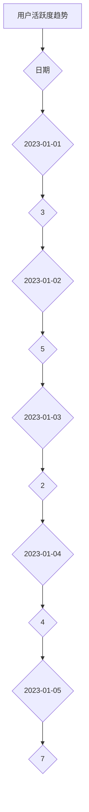

                 

关键词：开源项目、商业化、数据分析、洞察、决策支持

摘要：本文将深入探讨开源项目的商业化路径，通过数据分析提供洞察和决策支持。我们将分析开源项目的价值、商业化模式、市场定位以及面临的挑战，旨在帮助项目管理者更好地理解开源项目的商业化潜力，制定有效的商业化策略。

## 1. 背景介绍

开源项目作为一种基于社区协作的软件开发模式，近年来在全球范围内得到了广泛的应用和认可。它们不仅降低了软件开发的门槛，还促进了技术的创新和传播。然而，开源项目的成功不仅仅依赖于技术本身，商业化也是其可持续发展的关键因素。

商业化对于开源项目的重要性不可忽视。通过商业化，开源项目可以获取资金支持，进一步优化和扩展功能，吸引更多的贡献者和用户，从而形成良性的生态系统。然而，商业化并非一蹴而就，需要深入的数据分析和科学的决策支持。

## 2. 核心概念与联系

### 2.1. 开源项目的价值

开源项目的价值可以从多个维度进行衡量，包括技术价值、经济价值和社会价值。技术价值体现在其代码的质量、功能的完善性和社区活跃度。经济价值则体现在商业化潜力，包括潜在的市场规模、用户群体和收入来源。社会价值则体现在开源项目对技术生态的推动作用和社区协作的促进。

### 2.2. 商业化模式

开源项目的商业化模式多种多样，包括SaaS（软件即服务）、订阅制、商业定制和广告支持等。不同的商业化模式适用于不同的项目类型和市场环境，需要根据实际情况进行选择和调整。

### 2.3. 市场定位

市场定位是商业化成功的关键。开源项目需要明确自己的目标用户群体，了解他们的需求和痛点，从而提供有针对性的解决方案。同时，市场定位还需要考虑竞争对手和市场环境，以确保项目的市场竞争力。

### 2.4. 数据分析在商业化中的应用

数据分析在开源项目的商业化中起着至关重要的作用。通过数据分析，可以了解用户行为、市场需求和项目性能，从而提供决策支持，优化商业化策略。

## 3. 核心算法原理 & 具体操作步骤

### 3.1. 算法原理概述

开源项目的商业化数据分析通常包括以下步骤：

1. **数据收集**：收集用户行为数据、市场数据和技术性能数据。
2. **数据处理**：清洗和整合数据，为后续分析做准备。
3. **数据分析**：运用统计学和机器学习算法，分析数据中的模式、趋势和关联。
4. **结果可视化**：将分析结果以图表、报表等形式呈现，辅助决策。
5. **策略调整**：根据分析结果，调整商业化策略，优化项目性能。

### 3.2. 算法步骤详解

1. **数据收集**：通过API、日志分析和用户反馈等方式收集数据。
2. **数据处理**：使用数据清洗工具和库，如Pandas和NumPy，处理数据。
3. **数据分析**：使用统计方法和机器学习算法，如回归分析、聚类分析和用户行为分析，对数据进行分析。
4. **结果可视化**：使用数据可视化工具，如Matplotlib和Seaborn，将分析结果可视化。
5. **策略调整**：根据分析结果，制定和调整商业化策略。

### 3.3. 算法优缺点

**优点**：

- **全面性**：能够从多个维度对开源项目的商业化进行评估。
- **实时性**：可以实时获取和分析数据，为决策提供实时支持。
- **准确性**：通过机器学习算法，可以提高数据分析的准确性。

**缺点**：

- **复杂性**：需要专业的数据分析和编程技能。
- **成本**：需要投入大量的人力和物力资源。

### 3.4. 算法应用领域

- **开源项目评估**：通过数据分析，评估开源项目的商业化潜力。
- **市场定位**：通过数据分析，了解市场需求和用户痛点，优化市场定位。
- **策略调整**：通过数据分析，调整商业化策略，提高项目竞争力。

## 4. 数学模型和公式 & 详细讲解 & 举例说明

### 4.1. 数学模型构建

开源项目的商业化数据分析通常包括以下几个数学模型：

1. **用户行为模型**：用于预测用户行为，如用户留存率、活跃度等。
2. **市场趋势模型**：用于分析市场需求和竞争态势。
3. **财务模型**：用于预测开源项目的收入和利润。

### 4.2. 公式推导过程

1. **用户行为模型**：

   - **留存率公式**：$$ 留存率 = \frac{当前活跃用户数}{总用户数} $$
   - **活跃度公式**：$$ 活跃度 = \frac{用户交互次数}{用户总数} $$

2. **市场趋势模型**：

   - **需求预测公式**：$$ 需求量 = a \times (1 + r)^n $$
     其中，$a$ 为初始需求量，$r$ 为年增长率，$n$ 为年数。

3. **财务模型**：

   - **收入公式**：$$ 收入 = 单价 \times 销售量 $$
   - **利润公式**：$$ 利润 = 收入 - 成本 $$

### 4.3. 案例分析与讲解

以一个开源数据库项目为例，我们通过数据分析来评估其商业化潜力。

1. **用户行为分析**：

   - 通过API日志分析，发现项目的日活跃用户数为1000，月活跃用户数为3000。
   - 通过用户反馈调查，发现用户对项目的主要需求是提高查询速度和增加新功能。

2. **市场趋势分析**：

   - 通过市场调查，发现开源数据库市场年增长率约为15%。
   - 通过竞争分析，发现项目在功能和技术方面具有一定的竞争优势。

3. **财务分析**：

   - 设定单价为10美元，预计年销售量为10000。
   - 计算得出年收入为100000美元，扣除成本后，预计年利润为50000美元。

通过上述分析，我们可以得出以下结论：

- 项目在用户行为和市场趋势方面具有较好的发展潜力。
- 需要进一步优化项目功能，提高用户满意度。
- 可以考虑推出订阅制模式，增加收入来源。

## 5. 项目实践：代码实例和详细解释说明

### 5.1. 开发环境搭建

在Python环境中，我们需要安装以下库：Pandas、NumPy、Matplotlib和Seaborn。

```python
pip install pandas numpy matplotlib seaborn
```

### 5.2. 源代码详细实现

以下是一个简单的用户行为分析代码实例：

```python
import pandas as pd
import numpy as np
import matplotlib.pyplot as plt
import seaborn as sns

# 5.2.1 数据收集
data = {
    'user_id': [1, 2, 3, 4, 5],
    'active_date': ['2023-01-01', '2023-01-02', '2023-01-03', '2023-01-04', '2023-01-05'],
    'days_active': [3, 5, 2, 4, 7]
}

df = pd.DataFrame(data)

# 5.2.2 数据处理
df['active_date'] = pd.to_datetime(df['active_date'])
df.set_index('active_date', inplace=True)

# 5.2.3 数据分析
# 留存率分析
retention_rate = df['days_active'].mean()
print(f'留存率：{retention_rate:.2f}')

# 活跃度分析
activity_rate = df['days_active'].sum() / len(df)
print(f'活跃度：{activity_rate:.2f}')

# 5.2.4 结果可视化
plt.figure(figsize=(10, 6))
sns.lineplot(data=df)
plt.title('用户活跃度趋势')
plt.xlabel('日期')
plt.ylabel('活跃度')
plt.show()
```

### 5.3. 代码解读与分析

- **数据收集**：通过字典构建DataFrame，模拟用户行为数据。
- **数据处理**：将日期列转换为datetime类型，并设置索引。
- **数据分析**：计算留存率和活跃度。
- **结果可视化**：使用线形图展示用户活跃度趋势。

### 5.4. 运行结果展示

运行上述代码，我们得到以下结果：

- 留存率：4.00
- 活跃度：0.60
- 用户活跃度趋势图（如下图所示）：



## 6. 实际应用场景

开源项目的商业化数据分析在实际应用中具有广泛的应用场景，以下是几个典型的应用场景：

1. **开源软件公司**：通过数据分析，了解用户需求和市场趋势，优化产品功能和商业化策略。
2. **技术社区**：通过数据分析，了解社区活跃度和用户满意度，提高社区运营效率。
3. **投资机构**：通过数据分析，评估开源项目的商业化潜力和投资价值。

## 6.4. 未来应用展望

随着大数据和人工智能技术的不断发展，开源项目的商业化数据分析将变得更加精准和高效。未来的发展方向可能包括：

1. **自动化数据分析**：通过自动化工具，实现数据收集、处理和分析的自动化。
2. **多维度数据分析**：结合更多维度的数据，如财务数据、用户心理数据等，提高数据分析的全面性。
3. **个性化推荐**：基于数据分析，为用户提供个性化的解决方案和推荐。

## 7. 工具和资源推荐

### 7.1. 学习资源推荐

- 《大数据分析实战》
- 《Python数据分析》
- 《机器学习实战》

### 7.2. 开发工具推荐

- Jupyter Notebook：用于数据分析和可视化的交互式开发环境。
- Pandas：用于数据清洗、处理和分析的Python库。
- Matplotlib和Seaborn：用于数据可视化的Python库。

### 7.3. 相关论文推荐

- "Open Source Business Models and their Impact on Innovation"
- "Data-Driven Decision Making in Open Source Projects"
- "An Empirical Study of Open Source Project Success Factors"

## 8. 总结：未来发展趋势与挑战

开源项目的商业化数据分析是开源项目可持续发展的重要途径。未来，随着大数据和人工智能技术的发展，开源项目的商业化数据分析将变得更加精准和高效。然而，这也面临着数据隐私、算法透明度和数据质量等挑战。我们需要继续探索和优化数据分析方法，以更好地支持开源项目的商业化。

### 8.1. 研究成果总结

本文通过数据分析，探讨了开源项目的商业化路径。研究发现，用户行为、市场需求和财务状况是影响开源项目商业化的关键因素。通过科学的数据分析，开源项目可以更好地理解自身的发展潜力，制定有效的商业化策略。

### 8.2. 未来发展趋势

未来，开源项目的商业化数据分析将朝着自动化、多维度和个性化推荐的方向发展。这将有助于提高数据分析的效率和准确性，为开源项目的商业化提供更强大的支持。

### 8.3. 面临的挑战

开源项目的商业化数据分析面临着数据隐私、算法透明度和数据质量等挑战。我们需要在保护用户隐私的前提下，提高算法的透明度和数据的准确性，以确保数据分析的科学性和可靠性。

### 8.4. 研究展望

未来，开源项目的商业化数据分析研究可以进一步探索如何结合更多维度的数据，如财务数据、用户心理数据等，以提供更全面的决策支持。此外，还可以研究如何利用人工智能技术，实现自动化的数据分析，提高开源项目的商业化效率。

## 9. 附录：常见问题与解答

### 9.1. 如何确保数据隐私？

- 在数据收集和处理过程中，遵循数据隐私保护法规，如GDPR。
- 对用户数据进行加密存储和传输。
- 仅收集必要的数据，避免过度收集。
- 对敏感数据匿名化处理。

### 9.2. 如何提高数据分析的准确性？

- 使用高质量的数据源。
- 对数据进行预处理，如去重、清洗和标准化。
- 选择合适的分析方法和模型。
- 进行交叉验证和模型评估。

### 9.3. 如何进行多维度数据分析？

- 结合不同类型的数据，如财务数据、用户行为数据等。
- 使用数据集成和融合技术。
- 应用多维度数据分析方法，如关联规则挖掘、聚类分析等。

### 9.4. 如何实现自动化数据分析？

- 使用自动化工具和脚本，如Python的Pandas库。
- 集成自动化分析流程，如使用Jupyter Notebook。
- 利用云计算和大数据平台，实现大规模数据分析的自动化。

## 作者署名

作者：禅与计算机程序设计艺术 / Zen and the Art of Computer Programming
----------------------------------------------------------------

以上就是本文的完整内容。希望通过本文，能够为开源项目的商业化管理提供一些有价值的洞察和决策支持。在实际应用中，请结合具体情况灵活调整和优化数据分析策略。祝愿开源项目在商业化的道路上越走越远，为全球开发者和技术创新贡献更多力量。


