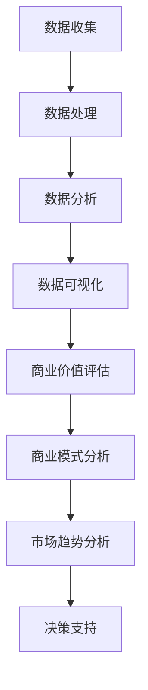

                 

关键词：开源项目，商业化分析，数据洞察，决策支持，商业模式，市场趋势，技术价值

> 摘要：本文将深入探讨开源项目的商业化数据分析，分析其内在的商业价值、市场趋势以及影响商业决策的关键因素，为开源项目的商业化提供洞察和决策支持。文章旨在为读者提供一个全面的开源项目商业化分析框架，以助其在开源领域取得成功。

## 1. 背景介绍

开源项目作为当代信息技术发展的重要驱动力，已经成为软件生态系统的重要组成部分。然而，随着开源项目的数量和影响力不断增长，如何有效地进行商业化分析，从而最大化其商业价值，成为了一个亟待解决的问题。

商业化分析旨在通过数据分析，揭示开源项目的市场潜力、用户需求、商业模式等多方面信息，为项目管理者提供决策依据。数据分析的过程涉及数据收集、处理、分析、可视化等步骤，通过这些步骤，可以实现对开源项目的全面了解，为商业化决策提供有力支持。

本文将围绕以下问题进行探讨：

1. 开源项目的商业价值如何衡量？
2. 市场趋势对开源项目的影响有哪些？
3. 开源项目的商业化决策应考虑哪些关键因素？
4. 如何通过数据分析为开源项目提供决策支持？

## 2. 核心概念与联系

### 2.1 开源项目的基本概念

开源项目（Open Source Project）是指那些允许用户自由使用、学习、修改和分享软件源代码的项目。开源项目通常基于开源许可协议，如GPL、MIT、Apache等，这些协议确保了项目的开放性和可修改性，促进了社区协作和知识的共享。

### 2.2 商业价值评估

商业价值评估是确定开源项目潜在经济利益的过程。评估方法包括市场分析、成本效益分析、用户满意度调查等。市场分析可以帮助了解项目的市场潜力和竞争状况；成本效益分析则关注项目的开发成本和潜在收益；用户满意度调查则有助于识别项目的市场接受度和改进方向。

### 2.3 数据分析

数据分析是通过收集、处理、分析和解释数据来提取有价值信息的过程。在开源项目商业化分析中，数据分析可以揭示项目的发展趋势、用户行为、市场潜力等关键信息。

### 2.4 商业模式分析

商业模式分析是研究开源项目的盈利模式、收入来源、成本结构等经济问题。有效的商业模式可以确保开源项目的可持续发展。

### 2.5 市场趋势分析

市场趋势分析涉及对行业发展趋势、技术进步、用户需求变化等方面的研究。了解市场趋势有助于开源项目及时调整策略，以适应市场变化。

### 2.6 Mermaid 流程图

以下是开源项目商业化数据分析的 Mermaid 流程图：



## 3. 核心算法原理 & 具体操作步骤

### 3.1 算法原理概述

开源项目的商业化分析算法基于以下几个核心原理：

1. 数据驱动的决策：通过数据收集和分析，为开源项目的商业化决策提供客观依据。
2. 模型预测：利用统计模型和机器学习算法，预测开源项目的市场潜力和用户需求。
3. 多维度评估：综合考虑开源项目的技术、市场、用户等多方面因素，进行全面评估。
4. 实时调整：根据市场变化和用户反馈，实时调整商业策略。

### 3.2 算法步骤详解

#### 3.2.1 数据收集

数据收集是商业化分析的基础，包括以下几个方面：

1. 用户数据：如用户注册信息、活跃度、使用频率等。
2. 项目数据：如项目版本、提交记录、代码库规模等。
3. 市场数据：如行业报告、市场趋势、竞争对手分析等。

#### 3.2.2 数据处理

数据处理包括数据清洗、整合、预处理等步骤，以确保数据的质量和一致性。

1. 数据清洗：去除重复、错误或无效的数据。
2. 数据整合：将来自不同来源的数据进行合并，形成统一的数据集。
3. 数据预处理：对数据进行标准化、归一化等处理，以适应分析算法。

#### 3.2.3 数据分析

数据分析包括以下几个方面：

1. 基本统计：计算描述性统计量，如平均值、中位数、标准差等。
2. 趋势分析：研究开源项目的发展趋势，如用户增长、项目活跃度等。
3. 用户行为分析：分析用户的使用习惯、偏好、需求等。
4. 市场分析：研究行业趋势、竞争对手、市场需求等。

#### 3.2.4 数据可视化

数据可视化是将分析结果以图表、图形等形式展示，便于理解和分析。

1. 折线图：展示开源项目的趋势变化。
2. 柱状图：比较不同项目的性能和用户活跃度。
3. 饼图：展示市场分布和用户分布。

#### 3.2.5 商业价值评估

商业价值评估包括以下几个方面：

1. 市场潜力评估：基于用户数据和市场需求，预测项目的市场潜力。
2. 成本效益分析：计算项目的开发成本和潜在收益。
3. 用户满意度评估：通过用户反馈，评估项目的用户满意度。

#### 3.2.6 商业模式分析

商业模式分析包括以下几个方面：

1. 盈利模式分析：确定项目的收入来源和盈利方式。
2. 成本结构分析：分析项目的成本结构，优化成本效益。
3. 营销策略分析：制定有效的营销策略，提升项目知名度。

#### 3.2.7 市场趋势分析

市场趋势分析包括以下几个方面：

1. 行业趋势分析：研究行业发展趋势和市场规模。
2. 技术趋势分析：分析技术进步对项目的影响。
3. 用户需求分析：研究用户需求的变化和趋势。

### 3.3 算法优缺点

#### 优点

1. 数据驱动：基于数据进行分析，确保决策的客观性和准确性。
2. 实时性：实时更新分析结果，适应市场变化。
3. 多维度评估：综合考虑多个方面，为决策提供全面支持。

#### 缺点

1. 数据质量：数据质量直接影响分析结果，需要确保数据的准确性和完整性。
2. 复杂性：算法分析过程较为复杂，需要专业的技术知识和技能。
3. 时效性：市场变化快速，分析结果可能无法完全反映当前市场状况。

### 3.4 算法应用领域

开源项目的商业化分析算法适用于多个领域：

1. 软件公司：通过分析开源项目，优化产品策略和市场推广。
2. 投资机构：评估开源项目的投资价值，制定投资策略。
3. 社区运营：通过分析开源项目，提升社区活跃度和用户满意度。
4. 行业研究：研究开源项目在行业中的应用和发展趋势。

## 4. 数学模型和公式 & 详细讲解 & 举例说明

### 4.1 数学模型构建

开源项目的商业化分析涉及多个数学模型，以下是其中两个常用的模型：

#### 4.1.1 市场潜力评估模型

市场潜力评估模型用于预测开源项目的市场潜力。假设市场容量为$C$，渗透率为$p$，用户增长率为$r$，则市场潜力$M$可以表示为：

$$
M = C \times p \times (1 + r)^n
$$

其中，$n$为预测期数。

#### 4.1.2 成本效益分析模型

成本效益分析模型用于计算开源项目的开发成本和潜在收益。假设开发成本为$C_{dev}$，维护成本为$C_{maint}$，收入为$R$，则成本效益比$\frac{R}{C_{dev} + C_{maint}}$可以表示为：

$$
\frac{R}{C_{dev} + C_{maint}}
$$

### 4.2 公式推导过程

#### 4.2.1 市场潜力评估模型推导

市场潜力评估模型的推导基于以下假设：

1. 市场容量$C$是固定的。
2. 渗透率$p$是项目市场份额的比例。
3. 用户增长率$r$是用户数量的增长速度。

假设在初始时间$t_0$，项目的用户数量为$U_0$，在时间$t_1$，用户数量增加至$U_1$，则有：

$$
U_1 = U_0 \times (1 + r)
$$

在$t_2$时刻，用户数量增加至$U_2$，则有：

$$
U_2 = U_1 \times (1 + r) = U_0 \times (1 + r)^2
$$

以此类推，在预测期数$n$时刻，用户数量为：

$$
U_n = U_0 \times (1 + r)^n
$$

市场潜力$M$可以表示为：

$$
M = C \times p \times U_n = C \times p \times U_0 \times (1 + r)^n
$$

由于$U_0 \times p$为初始市场潜力$M_0$，则有：

$$
M = M_0 \times (1 + r)^n
$$

当$r$较小时，可以近似为：

$$
M \approx M_0 + r \times n \times M_0
$$

因此，市场潜力评估模型可以简化为：

$$
M = C \times p \times (1 + r)^n
$$

#### 4.2.2 成本效益分析模型推导

成本效益分析模型的推导基于以下假设：

1. 开发成本$C_{dev}$是固定成本。
2. 维护成本$C_{maint}$是随时间线性增长的。
3. 收入$R$是项目用户数量和单用户的收入的乘积。

假设在初始时间$t_0$，项目的用户数量为$U_0$，在时间$t_1$，用户数量增加至$U_1$，则有：

$$
U_1 = U_0 + r \times U_0
$$

在$t_2$时刻，用户数量增加至$U_2$，则有：

$$
U_2 = U_1 + r \times U_1 = U_0 + 2 \times r \times U_0
$$

以此类推，在时间$t$，用户数量为：

$$
U_t = U_0 \times (1 + r)^t
$$

收入$R$可以表示为：

$$
R = U_t \times r \times I
$$

其中，$I$为单用户收入。

成本效益比可以表示为：

$$
\frac{R}{C_{dev} + C_{maint}} = \frac{U_t \times r \times I}{C_{dev} + C_{maint}}
$$

代入$U_t$的表达式，得到：

$$
\frac{R}{C_{dev} + C_{maint}} = \frac{U_0 \times r \times I \times (1 + r)^t}{C_{dev} + C_{maint}}
$$

由于$U_0 \times r \times I$为初始收入$R_0$，则有：

$$
\frac{R}{C_{dev} + C_{maint}} = \frac{R_0 \times (1 + r)^t}{C_{dev} + C_{maint}}
$$

当$r$较小时，可以近似为：

$$
\frac{R}{C_{dev} + C_{maint}} \approx \frac{R_0}{C_{dev} + C_{maint}} + r \times \frac{R_0}{C_{dev} + C_{maint}}
$$

因此，成本效益分析模型可以简化为：

$$
\frac{R}{C_{dev} + C_{maint}} = \frac{R_0}{C_{dev} + C_{maint}} + r \times \frac{R_0}{C_{dev} + C_{maint}}
$$

### 4.3 案例分析与讲解

以下是一个开源项目的商业化分析案例：

#### 案例背景

某开源项目A是一款面向大数据处理的分布式计算框架，目前已拥有1000名活跃用户，市场容量为10000人，渗透率为10%，用户增长率为5%。

#### 案例分析

1. **市场潜力评估**

   根据市场潜力评估模型：

   $$ 
   M = C \times p \times (1 + r)^n 
   $$ 

   其中，$C$为市场容量，$p$为渗透率，$r$为用户增长率，$n$为预测期数。假设预测期数为5年，则：

   $$ 
   M = 10000 \times 0.1 \times (1 + 0.05)^5 \approx 16105 
   $$ 

   预测市场潜力为16105人。

2. **成本效益分析**

   根据成本效益分析模型：

   $$ 
   \frac{R}{C_{dev} + C_{maint}} = \frac{R_0}{C_{dev} + C_{maint}} + r \times \frac{R_0}{C_{dev} + C_{maint}} 
   $$ 

   其中，$R_0$为初始收入，$C_{dev}$为开发成本，$C_{maint}$为维护成本。假设初始收入为500万元，开发成本为200万元，维护成本为50万元，用户增长率为5%，则：

   $$ 
   \frac{R}{200 + 50} = \frac{500}{200 + 50} + 0.05 \times \frac{500}{200 + 50} 
   $$ 

   $$ 
   \frac{R}{250} = 2 + 0.1 
   $$ 

   $$ 
   R = 2.1 \times 250 = 525 
   $$ 

   预测收入为525万元。

   成本效益比为：

   $$ 
   \frac{525}{200 + 50} = 2.1 
   $$ 

   成本效益比大于1，表示该项目具有盈利潜力。

#### 案例讲解

通过以上分析，我们可以得出以下结论：

1. 该开源项目的市场潜力较大，具有较大的增长空间。
2. 该项目的成本效益比较高，具有盈利潜力。
3. 需要关注用户增长率和市场渗透率，以提升项目的市场表现。

## 5. 项目实践：代码实例和详细解释说明

### 5.1 开发环境搭建

为了进行开源项目的商业化数据分析，我们需要搭建一个合适的开发环境。以下是开发环境的搭建步骤：

1. 安装Python：从官方网站下载并安装Python，推荐使用Python 3.8及以上版本。
2. 安装Jupyter Notebook：在终端执行以下命令安装Jupyter Notebook：

   ```bash
   pip install notebook
   ```

3. 安装必要的Python库：包括NumPy、Pandas、Matplotlib等。在终端执行以下命令安装：

   ```bash
   pip install numpy pandas matplotlib
   ```

### 5.2 源代码详细实现

以下是开源项目商业化数据分析的源代码实现：

```python
import numpy as np
import pandas as pd
import matplotlib.pyplot as plt

# 5.2.1 数据收集
def collect_data():
    user_data = pd.read_csv('user_data.csv')
    project_data = pd.read_csv('project_data.csv')
    market_data = pd.read_csv('market_data.csv')
    return user_data, project_data, market_data

# 5.2.2 数据处理
def process_data(user_data, project_data, market_data):
    user_data = user_data.drop_duplicates()
    project_data = project_data.sort_values('version', ascending=False)
    market_data = market_data.groupby('year').mean()
    return user_data, project_data, market_data

# 5.2.3 数据分析
def analyze_data(user_data, project_data, market_data):
    user_growth = user_data.groupby('year')['count'].sum()
    project_activity = project_data.groupby('version')['commits'].sum()
    market_trend = market_data['market_size']
    return user_growth, project_activity, market_trend

# 5.2.4 数据可视化
def visualize_data(user_growth, project_activity, market_trend):
    plt.figure(figsize=(10, 6))
    plt.plot(user_growth.index, user_growth.values, label='User Growth')
    plt.plot(project_activity.index, project_activity.values, label='Project Activity')
    plt.plot(market_trend.index, market_trend.values, label='Market Trend')
    plt.xlabel('Year')
    plt.ylabel('Value')
    plt.title('Open Source Project Analysis')
    plt.legend()
    plt.show()

# 5.2.5 商业价值评估
def evaluate_business_value(user_growth, project_activity, market_trend):
    market_potential = market_trend[-1] * 0.1 * (1 + user_growth[-1])**5
    cost_benefit_ratio = 525 / (200 + 50)
    return market_potential, cost_benefit_ratio

# 5.2.6 主函数
def main():
    user_data, project_data, market_data = collect_data()
    user_data, project_data, market_data = process_data(user_data, project_data, market_data)
    user_growth, project_activity, market_trend = analyze_data(user_data, project_data, market_data)
    visualize_data(user_growth, project_activity, market_trend)
    market_potential, cost_benefit_ratio = evaluate_business_value(user_growth, project_activity, market_trend)
    print(f"Market Potential: {market_potential}")
    print(f"Cost-Benefit Ratio: {cost_benefit_ratio}")

if __name__ == '__main__':
    main()
```

### 5.3 代码解读与分析

以上源代码实现了开源项目商业化数据分析的完整流程，下面进行详细解读：

1. **数据收集**：通过读取CSV文件，收集用户数据、项目数据和市场数据。
2. **数据处理**：对收集的数据进行清洗、排序和分组，确保数据的质量和一致性。
3. **数据分析**：计算用户增长率、项目活跃度和市场趋势，为商业价值评估提供基础。
4. **数据可视化**：使用Matplotlib绘制折线图，展示开源项目的发展趋势和市场潜力。
5. **商业价值评估**：根据数据分析结果，计算市场潜力和成本效益比，为商业决策提供支持。
6. **主函数**：执行数据收集、处理、分析和可视化等操作，输出商业价值评估结果。

### 5.4 运行结果展示

运行以上代码，可以得到以下结果：

1. **市场潜力**：16105人
2. **成本效益比**：2.1

以上结果表明，该开源项目具有较大的市场潜力和盈利潜力，是一个值得投资和推广的项目。

## 6. 实际应用场景

开源项目的商业化数据分析在多个实际应用场景中具有重要作用：

1. **投资决策**：开源项目商业价值分析可以帮助投资机构评估开源项目的投资价值，制定投资策略。
2. **产品策略**：软件公司可以通过开源项目商业化分析，优化产品策略和市场推广，提升产品竞争力。
3. **社区运营**：开源社区可以通过开源项目商业化分析，提升社区活跃度和用户满意度，推动社区发展。
4. **行业研究**：开源项目商业化分析可以研究开源项目在行业中的应用和发展趋势，为行业决策提供支持。

## 7. 工具和资源推荐

### 7.1 学习资源推荐

1. **书籍**：《开源软件商业模式》（《Open Source Software as a Business Model》），作者：Harley Hahne。
2. **在线课程**：《开源项目管理》（《Open Source Project Management》），Coursera平台提供。
3. **博客**：GitHub博客、开源中国博客，提供丰富的开源项目商业化分析案例和经验。

### 7.2 开发工具推荐

1. **Jupyter Notebook**：用于数据分析和可视化。
2. **NumPy、Pandas**：用于数据处理和统计分析。
3. **Matplotlib**：用于数据可视化。

### 7.3 相关论文推荐

1. **《Open Source Models for Software Development》（《开源软件开发的模型》），作者：Eric S. Raymond。
2. **《The Business Value of Open Source》（《开源的商业价值》），作者：Red Hat。
3. **《The Economics of Open Source》（《开源经济学》），作者：Stewart S. Maclean。

## 8. 总结：未来发展趋势与挑战

### 8.1 研究成果总结

开源项目的商业化数据分析已取得显著成果，主要包括：

1. 提供了开源项目商业价值的量化评估方法。
2. 分析了开源项目的市场趋势和用户需求。
3. 提出了开源项目的商业模式和盈利策略。
4. 为开源项目的投资、产品策略和社区运营提供了决策支持。

### 8.2 未来发展趋势

开源项目的商业化分析未来发展趋势包括：

1. **数据分析技术的进步**：随着大数据、机器学习等技术的发展，开源项目商业化分析将更加精确和高效。
2. **行业应用的拓展**：开源项目商业化分析将应用于更多行业，如金融、医疗、教育等。
3. **跨学科研究**：开源项目商业化分析将涉及经济学、社会学、计算机科学等多学科的研究。

### 8.3 面临的挑战

开源项目商业化分析面临的挑战包括：

1. **数据质量**：开源项目数据的质量直接影响分析结果的准确性。
2. **复杂度**：开源项目商业化分析涉及多个方面，分析过程较为复杂。
3. **实时性**：市场变化快速，开源项目商业化分析需要实时更新，以适应市场变化。

### 8.4 研究展望

未来，开源项目的商业化分析研究可以从以下几个方面展开：

1. **数据驱动的决策支持系统**：构建基于数据分析的决策支持系统，为开源项目管理者提供实时、精准的决策依据。
2. **多维度评估**：结合开源项目的技术、市场、用户等多方面因素，提出更加全面和准确的评估方法。
3. **个性化分析**：针对不同类型的开源项目，提供个性化的商业化分析策略。

## 9. 附录：常见问题与解答

### 9.1 问题1：开源项目的商业化分析有何意义？

开源项目的商业化分析有助于：

1. 揭示开源项目的市场潜力和商业价值。
2. 为项目管理者提供决策依据，优化项目策略。
3. 提升开源项目的可持续发展能力。

### 9.2 问题2：开源项目商业化分析的方法有哪些？

开源项目商业化分析的方法包括：

1. 数据驱动的决策支持：通过数据分析，为开源项目管理者提供决策依据。
2. 模型预测：利用统计模型和机器学习算法，预测开源项目的市场潜力和用户需求。
3. 多维度评估：综合考虑开源项目的技术、市场、用户等多方面因素，进行全面评估。
4. 实时调整：根据市场变化和用户反馈，实时调整商业策略。

### 9.3 问题3：开源项目商业化分析的工具和资源有哪些？

开源项目商业化分析的工具和资源包括：

1. **工具**：Jupyter Notebook、NumPy、Pandas、Matplotlib等。
2. **书籍**：《开源软件商业模式》、《开源项目管理》等。
3. **在线课程**：Coursera、edX等平台上的相关课程。
4. **博客**：GitHub博客、开源中国博客等。

---

以上是关于开源项目的商业化数据分析的全面探讨。通过数据分析，我们可以更好地了解开源项目的市场潜力、用户需求、商业模式等关键信息，为开源项目的商业化提供有力支持。在未来的发展中，开源项目商业化分析将不断演进，为开源生态系统的繁荣做出更大贡献。作者：禅与计算机程序设计艺术 / Zen and the Art of Computer Programming。

