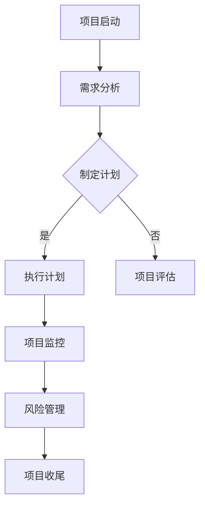

                 

开源项目是一种独特的软件开发模式，它允许全球的开发者共同参与、协作改进和分享代码。然而，随着越来越多的企业和组织开始认识到开源项目的重要性，如何有效地将开源项目商业化，成为一个亟待解决的问题。本文将探讨开源项目的商业化项目管理，特别是项目规划与执行的关键环节。

## 关键词
- 开源项目
- 商业化
- 项目管理
- 规划
- 执行

## 摘要
本文旨在为开源项目的商业化提供一套完整的项目管理策略，从项目规划到执行，详细阐述了关键步骤、工具和方法。通过本文，读者可以了解到如何将开源项目成功商业化，实现技术价值的最大化。

## 1. 背景介绍

开源项目（Open Source Project）起源于20世纪90年代，最早由自由软件运动推动，强调软件的开放性、可修改性和共享性。随着互联网的普及和云计算的发展，开源项目在技术和商业领域的影响力逐渐扩大。

商业化（Commercialization）是指将技术、产品或服务转化为商业价值的过程。对于开源项目而言，商业化不仅意味着获取经济利益，还包括扩大影响力、提升品牌价值等。

项目管理（Project Management）是指通过规划、执行、监控和控制项目活动，以实现项目目标的一系列管理活动。在开源项目的商业化过程中，项目管理发挥着至关重要的作用。

## 2. 核心概念与联系

### 2.1 项目管理核心概念

项目管理包括以下核心概念：

1. **项目目标**：明确项目的目标和预期成果，是项目管理的核心。
2. **项目范围**：定义项目的范围，明确项目的边界。
3. **项目团队**：组建专业的项目团队，确保项目顺利推进。
4. **项目计划**：制定详细的项目计划，包括时间表、资源分配等。
5. **项目监控**：监控项目进度，确保项目按计划执行。
6. **项目风险管理**：识别、评估和应对项目风险。

### 2.2 项目管理架构

项目管理架构包括以下主要组成部分：

1. **项目管理办公室（PMO）**：负责制定项目管理策略、标准和流程。
2. **项目组合管理**：管理多个项目，确保资源优化和目标一致性。
3. **项目阶段管理**：将项目分为不同的阶段，每个阶段有明确的目标和里程碑。
4. **项目管理工具**：如Jira、Trello等，用于项目计划、执行和监控。

### 2.3 Mermaid 流程图

以下是一个简单的项目管理流程图，展示项目管理的主要环节和关系：



## 3. 核心算法原理 & 具体操作步骤

### 3.1 算法原理概述

开源项目的商业化涉及到一系列复杂的管理和运营活动。核心算法原理包括以下几个方面：

1. **市场分析**：了解市场需求，确定商业机会。
2. **商业模式设计**：制定合理的商业模式，实现开源项目的商业化。
3. **合作伙伴关系管理**：与合作伙伴建立良好的关系，共同推动项目发展。
4. **项目管理**：采用先进的项目管理方法，确保项目顺利进行。

### 3.2 算法步骤详解

1. **市场分析**：通过市场调研，收集用户需求、竞争对手信息等，分析市场趋势和潜力。
2. **商业模式设计**：根据市场分析结果，设计适合的商业模式，包括收入模式、利润模式等。
3. **项目规划**：制定详细的项目计划，包括项目目标、范围、时间表、资源需求等。
4. **项目执行**：按照项目计划，组织项目团队，实施项目活动。
5. **项目监控**：监控项目进度，确保项目按计划执行，及时调整计划。
6. **风险管理**：识别、评估和应对项目风险，确保项目顺利进行。
7. **项目收尾**：完成项目，总结项目经验，为后续项目提供参考。

### 3.3 算法优缺点

- 优点：
  - 提高项目成功率：通过系统的项目规划和管理，提高项目成功的概率。
  - 提高资源利用效率：合理分配资源，提高资源利用效率。
  - 提高项目透明度：采用项目管理工具和方法，提高项目透明度。

- 缺点：
  - 增加管理成本：项目管理需要投入额外的时间和资源，可能会增加管理成本。
  - 灵活性不足：过于严格的项目管理可能会降低项目的灵活性，影响创新。

### 3.4 算法应用领域

- **软件开发**：开源项目的商业化通常涉及软件开发，项目管理方法在软件开发中具有广泛应用。
- **技术创新**：开源项目往往涉及到技术创新，项目管理方法可以帮助确保技术创新的顺利进行。
- **企业合作**：开源项目商业化需要与合作伙伴紧密合作，项目管理方法可以帮助管理合作伙伴关系。

## 4. 数学模型和公式 & 详细讲解 & 举例说明

### 4.1 数学模型构建

开源项目的商业化涉及多个变量和因素，构建数学模型需要考虑以下几个方面：

1. **市场需求**：市场需求是决定开源项目商业化成功的关键因素。
2. **项目成本**：项目成本包括开发成本、运营成本等。
3. **收益模型**：开源项目的收益模型包括广告收入、服务收入、许可证收入等。
4. **风险因素**：风险因素包括技术风险、市场风险、管理风险等。

### 4.2 公式推导过程

以下是一个简单的商业模型公式：

\[ \text{净利润} = \text{收入} - \text{成本} - \text{风险费用} \]

其中：
- 收入：包括广告收入、服务收入、许可证收入等。
- 成本：包括开发成本、运营成本等。
- 风险费用：用于应对项目风险的成本。

### 4.3 案例分析与讲解

假设一个开源项目的年度收入为100万元，成本为50万元，风险费用为10万元。根据上述公式，该项目的净利润为：

\[ \text{净利润} = 100\text{万元} - 50\text{万元} - 10\text{万元} = 40\text{万元} \]

通过调整收入、成本和风险费用，可以优化项目的净利润。

## 5. 项目实践：代码实例和详细解释说明

### 5.1 开发环境搭建

搭建一个开源项目的开发环境通常包括以下步骤：

1. 安装Git：用于版本控制和代码管理。
2. 安装编译器：如GCC、Clang等，用于编译代码。
3. 安装依赖库：根据项目需求，安装必要的依赖库。
4. 配置开发环境：配置环境变量、构建脚本等。

### 5.2 源代码详细实现

以下是一个简单的开源项目示例代码：

```c
#include <stdio.h>

int main() {
    printf("Hello, World!\n");
    return 0;
}
```

这个示例代码展示了最简单的C语言程序，它包含一个`main`函数，用于输出"Hello, World!"。

### 5.3 代码解读与分析

- **文件结构**：代码文件通常包括头文件、源文件和资源文件。
- **函数**：`main`函数是程序的入口点，执行程序的主要任务。
- **输出**：使用`printf`函数输出字符串。

### 5.4 运行结果展示

编译并运行上述代码，输出结果为：

```
Hello, World!
```

## 6. 实际应用场景

开源项目的商业化在多个领域具有广泛应用，如：

1. **软件开发**：通过开源项目吸引开发者，构建生态系统，提高产品的竞争力。
2. **技术创新**：开源项目可以促进技术创新，为企业和组织提供新的技术解决方案。
3. **社区建设**：开源项目可以构建社区，吸引更多的开发者参与，共同推动项目发展。

### 6.4 未来应用展望

随着云计算、大数据、人工智能等技术的发展，开源项目的商业化将面临新的机遇和挑战。未来，开源项目商业化可能呈现以下趋势：

1. **生态化**：开源项目将更加注重生态建设，构建完整的生态系统。
2. **平台化**：开源项目将逐渐向平台化发展，提供更加完善的解决方案。
3. **专业化**：开源项目商业化将更加专业化，为特定领域提供定制化的解决方案。

## 7. 工具和资源推荐

### 7.1 学习资源推荐

- **《开源项目指南》**：了解开源项目的最佳实践和流程。
- **《项目管理知识体系指南》**：学习项目管理的核心概念和技能。

### 7.2 开发工具推荐

- **Git**：版本控制和代码管理。
- **Jenkins**：自动化构建和部署。

### 7.3 相关论文推荐

- **"Open Source Model and Its Commercialization Path"**：探讨开源项目的商业模式。
- **"Project Management Practices in Open Source Projects"**：分析开源项目的项目管理方法。

## 8. 总结：未来发展趋势与挑战

### 8.1 研究成果总结

本文探讨了开源项目的商业化项目管理，从项目规划到执行，提供了完整的解决方案。通过市场分析、商业模式设计、项目管理等环节，实现了开源项目的商业化。

### 8.2 未来发展趋势

未来，开源项目的商业化将呈现生态化、平台化和专业化的趋势。随着技术的发展，开源项目将在更多领域发挥重要作用。

### 8.3 面临的挑战

开源项目的商业化面临市场风险、管理挑战和合规性问题。如何平衡商业化与开源精神，实现可持续发展，是未来的重要挑战。

### 8.4 研究展望

开源项目的商业化研究将继续深入，关注生态建设、商业模式创新和管理优化。未来，开源项目将在更多领域发挥重要作用，为企业和组织提供新的价值。

## 9. 附录：常见问题与解答

### 9.1 开源项目商业化与商业软件的区别？

开源项目商业化与商业软件的主要区别在于版权和许可。开源项目通常采用开源许可，允许用户自由使用、修改和分发代码，而商业软件则通常采用封闭许可，限制用户的使用和分发。

### 9.2 如何平衡开源精神与商业化？

平衡开源精神与商业化需要遵循以下原则：

1. 保持代码的开放性：确保代码的质量和可读性，让更多的开发者参与。
2. 设计合理的商业模式：为开发者提供合理的回报机制，鼓励他们积极参与。
3. 管理好社区：建立健康的社区氛围，尊重开发者的贡献。

### 9.3 开源项目的商业化对开发者有何影响？

开源项目的商业化可以为开发者提供以下影响：

1. 经济回报：通过商业化的收益，开发者可以获得经济上的支持。
2. 荣誉与认可：商业化的成功将提升开发者在业界的声誉和地位。
3. 技术成长：参与商业化的开源项目，开发者可以接触到更多前沿技术，提升自身技术能力。

---

### 作者署名

作者：禅与计算机程序设计艺术 / Zen and the Art of Computer Programming
----------------------------------------------------------------
以上就是《开源项目的商业化项目管理：项目规划与执行》的文章内容。文章从开源项目的背景介绍、核心概念与联系、核心算法原理、数学模型和公式、项目实践、实际应用场景、工具和资源推荐等方面进行了详细阐述。希望通过这篇文章，能够为读者在开源项目的商业化过程中提供有益的参考和启示。

