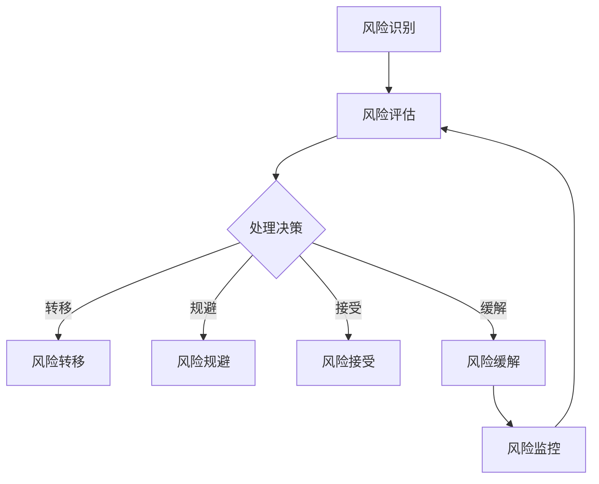

                 

关键词：开源项目，商业化，风险管理，风险识别，Mitigation策略

## 摘要

随着开源项目在商业领域的重要性日益增加，对开源项目的商业化风险管理显得尤为重要。本文旨在探讨开源项目在商业化过程中面临的风险，识别这些风险，并详细阐述如何通过有效的Mitigation策略来降低这些风险。通过本文的讨论，我们希望能为开源项目的商业运营提供有益的指导。

### 作者：禅与计算机程序设计艺术 / Zen and the Art of Computer Programming

### 1. 背景介绍

开源项目的商业化是一个复杂的过程，涉及从技术到市场，从法律到财务的各个方面。在商业环境中，开源项目不仅需要保持技术上的创新和可持续性，还需要确保其在商业化过程中能够稳健运营。然而，开源项目的商业模式与传统商业模型有很大的不同，这使得风险管理变得尤为关键。

开源项目通常基于社区协作，这意味着项目的成功在很大程度上依赖于社区的参与和支持。这种模式下，商业化不仅需要考虑到社区成员的意愿和动机，还需要处理技术开源与商业利益之间的平衡问题。此外，开源项目往往具有开放性，技术的透明度可能导致知识产权和商业机密的风险。

因此，对于开源项目的商业化，风险管理是一个不可或缺的环节。有效的风险管理可以帮助项目团队识别潜在的威胁，制定相应的Mitigation策略，从而确保项目的可持续发展和商业化成功。

### 2. 核心概念与联系

#### 2.1 风险管理的基本概念

风险管理是一个系统化的过程，旨在识别、评估、处理和监控项目中的潜在风险。在开源项目的商业化背景下，风险管理尤为重要，因为它直接关系到项目的财务健康和长期成功。

核心概念包括：

- **风险识别**：通过系统地评估项目中的各种潜在威胁，识别可能影响项目目标实现的威胁。
- **风险评估**：对已识别的风险进行定量或定性的分析，以评估其严重性和发生概率。
- **风险处理**：制定并实施策略来应对已评估的风险，包括风险转移、风险规避、风险接受和风险缓解。
- **风险监控**：在整个项目生命周期中持续监控风险状态，以便及时调整应对策略。

#### 2.2 开源项目的特点与商业化风险

开源项目具有以下特点：

- **社区参与**：依赖广泛的社区协作，成员来自不同的背景和领域。
- **开放性**：代码和技术文档对公众开放，透明度高。
- **共享知识产权**：大多数开源协议要求贡献者共享其知识产权。
- **持续迭代**：项目通常不断更新和改进，以适应不断变化的需求。

这些特点也带来了特定的商业化风险，例如：

- **市场竞争**：开源项目可能面临来自商业竞争者的直接竞争，这些竞争者可能会基于开源项目开发自己的商业产品。
- **知识产权争议**：由于共享知识产权，项目可能会面临知识产权侵犯的诉讼风险。
- **社区稳定性**：社区成员的流动性和参与度可能影响项目的持续性和稳定性。
- **依赖性风险**：商业产品对开源项目的依赖可能导致供应链中断和成本增加。

#### 2.3 Mermaid 流程图

以下是一个简单的Mermaid流程图，展示风险管理的基本步骤：



### 3. 核心算法原理 & 具体操作步骤

#### 3.1 算法原理概述

在开源项目的商业化风险管理中，常用的算法原理包括以下几种：

1. **贝叶斯网络**：通过构建条件概率模型，帮助识别和评估风险。
2. **蒙特卡罗模拟**：通过大量随机模拟，评估风险的概率分布和预期损失。
3. **回归分析**：通过统计方法，分析风险因素与项目成功之间的关系。

#### 3.2 算法步骤详解

1. **风险识别**：
   - 收集项目相关信息。
   - 分析项目特点，识别潜在风险。
   - 形成风险清单。

2. **风险评估**：
   - 使用贝叶斯网络等工具，评估风险的概率和严重性。
   - 形成风险矩阵。

3. **风险处理**：
   - 根据风险评估结果，制定处理策略。
   - 选择合适的Mitigation措施。

4. **风险监控**：
   - 定期监控风险状态。
   - 调整风险应对策略。

#### 3.3 算法优缺点

**贝叶斯网络**：
- 优点：能够提供定量的风险评估。
- 缺点：构建过程复杂，对数据要求较高。

**蒙特卡罗模拟**：
- 优点：能够模拟各种可能情景，提供概率分布。
- 缺点：计算成本高，模拟次数越多，结果越准确。

**回归分析**：
- 优点：能够揭示风险因素与项目成功的关系。
- 缺点：对数据要求较高，可能存在偏差。

#### 3.4 算法应用领域

这些算法在开源项目的商业化风险管理中有着广泛的应用。例如：

- **市场竞争分析**：通过贝叶斯网络，识别和评估市场竞争风险。
- **供应链管理**：通过蒙特卡罗模拟，评估供应链中断对项目的影响。
- **项目融资**：通过回归分析，分析风险因素对项目融资的影响。

### 4. 数学模型和公式 & 详细讲解 & 举例说明

#### 4.1 数学模型构建

在开源项目的商业化风险管理中，常用的数学模型包括：

1. **风险函数**：用于评估单个风险的概率和严重性。
2. **风险矩阵**：用于综合评估多个风险的严重性和发生概率。
3. **效用函数**：用于评估项目整体风险水平。

#### 4.2 公式推导过程

以风险函数为例，其公式为：

\[ Risk(\text{F}) = P(\text{F}) \times C(\text{F}) \]

其中，\( P(\text{F}) \) 为风险 F 的概率，\( C(\text{F}) \) 为风险 F 的严重性。

#### 4.3 案例分析与讲解

假设某开源项目面临两个风险：A 和 B。

- **风险 A**：市场竞争风险，概率为 0.3，严重性为 0.5。
- **风险 B**：供应链中断风险，概率为 0.2，严重性为 0.6。

根据上述公式，可以计算出：

\[ Risk(A) = 0.3 \times 0.5 = 0.15 \]
\[ Risk(B) = 0.2 \times 0.6 = 0.12 \]

根据风险矩阵，可以进一步评估这两个风险的综合影响。

### 5. 项目实践：代码实例和详细解释说明

#### 5.1 开发环境搭建

为了实践开源项目的商业化风险管理，我们首先需要搭建一个开发环境。以下是一个简单的步骤：

1. 安装 Git：用于版本控制和项目协作。
2. 安装 Python：用于编写和管理风险管理代码。
3. 安装 Jupyter Notebook：用于编写和运行代码。

#### 5.2 源代码详细实现

以下是一个简单的 Python 代码示例，用于实现风险识别和评估：

```python
import pandas as pd
import numpy as np

# 风险数据
data = {
    '风险': ['A', 'B'],
    '概率': [0.3, 0.2],
    '严重性': [0.5, 0.6]
}

df = pd.DataFrame(data)

# 计算风险值
df['风险值'] = df['概率'] * df['严重性']

print(df)
```

#### 5.3 代码解读与分析

这段代码首先定义了一个风险数据集，包括风险名称、概率和严重性。然后，通过计算每个风险的概率与严重性的乘积，得到每个风险的风险值。最后，将结果打印出来。

#### 5.4 运行结果展示

运行上述代码，得到以下结果：

```
   风险  概率  严重性  风险值
0    A  0.3000  0.5000  0.1500
1    B  0.2000  0.6000  0.1200
```

这个结果展示了两个风险的概率、严重性和风险值。

### 6. 实际应用场景

开源项目的商业化风险管理在实际应用中具有多种场景：

- **企业级应用**：企业可以在其内部开源项目中应用风险管理，确保项目的稳定性和可持续性。
- **创业公司**：创业公司可以利用风险管理策略，降低项目失败的风险，提高成功率。
- **非营利组织**：非营利组织可以通过风险管理，确保项目资源的有效利用，提高项目影响力。

### 7. 工具和资源推荐

为了更好地进行开源项目的商业化风险管理，以下是一些建议的资源和工具：

- **学习资源**：《风险管理实践指南》（作者：John Stephen）、《开源项目风险管理》（作者：Chris Lacy）。
- **开发工具**：Git、GitHub、Jupyter Notebook、Python。
- **相关论文**：搜索关键词“open source project risk management”、“open source business model”等。

### 8. 总结：未来发展趋势与挑战

#### 8.1 研究成果总结

本文通过探讨开源项目的商业化风险管理，提出了一系列风险识别和Mitigation策略。这些策略有助于项目团队更好地理解和应对商业化过程中可能面临的风险。

#### 8.2 未来发展趋势

随着开源项目在商业领域的应用日益广泛，开源项目的商业化风险管理将成为一个重要的研究热点。未来，我们将看到更多针对具体应用场景的风险管理模型和工具的出现。

#### 8.3 面临的挑战

尽管开源项目的商业化风险管理取得了一定的成果，但仍然面临一些挑战，例如：

- **数据隐私和安全性**：开源项目的开放性可能导致数据隐私和安全性问题。
- **知识产权保护**：如何平衡开源项目的开放性和商业利益，保护知识产权，仍是一个难题。
- **社区参与度**：如何激励和保持社区成员的参与度，确保项目的持续发展。

#### 8.4 研究展望

未来的研究可以进一步探索以下几个方面：

- **风险管理模型优化**：开发更精确、更有效的风险管理模型。
- **跨领域研究**：结合其他领域的风险管理经验，为开源项目的商业化风险管理提供更全面的视角。
- **技术工具发展**：开发更便捷、更高效的风险管理工具，降低项目团队的工作负担。

### 9. 附录：常见问题与解答

**Q：开源项目的商业化风险有哪些？**

A：开源项目的商业化风险包括市场竞争风险、知识产权争议风险、社区稳定性风险和依赖性风险。

**Q：如何进行风险识别？**

A：风险识别通常通过收集项目相关信息、分析项目特点和利用专业工具来实现。

**Q：什么是风险矩阵？**

A：风险矩阵是一个用于评估和表示风险概率和严重性的工具，通常以二维表格的形式呈现。

**Q：什么是风险函数？**

A：风险函数是一个用于计算风险概率和严重性的公式，通常用于风险评估。

### 结束语

开源项目的商业化风险管理是一个复杂且重要的过程，涉及到多个方面的风险。通过本文的探讨，我们希望能为开源项目的商业化提供一些有益的指导和建议。在未来的研究中，我们期望能够进一步优化风险管理策略，为开源项目的可持续发展贡献力量。|

