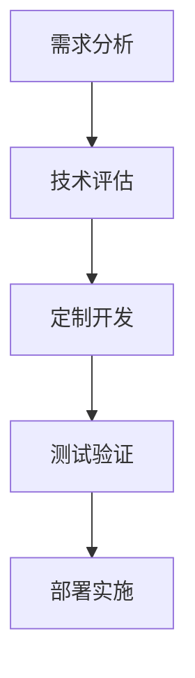

                 

关键词：开源项目、定制化服务、企业需求、IT技术、软件开发、代码优化、算法应用、数学模型、实际案例、资源推荐、未来展望

> 摘要：本文将探讨如何通过定制化服务，将开源项目转化为满足企业需求的有效解决方案。我们将分析定制化服务的核心概念、流程、以及实现方法，并通过具体实例展示如何将开源技术应用于实际场景，助力企业实现业务目标。

## 1. 背景介绍

在当今数字化转型的浪潮中，开源项目已成为软件开发的重要基石。开源项目的灵活性和共享性使得开发人员能够快速获取资源，加速项目开发。然而，随着企业对IT系统的需求日益复杂，单纯依赖开源项目已难以满足特定业务需求。因此，定制化服务成为了一种重要的解决方案。

定制化服务指的是根据企业特定的需求，对开源项目进行适当的修改和优化，以使其能够更好地满足企业的实际应用场景。这种服务不仅涉及技术层面的调整，还包括业务流程的优化和用户体验的提升。定制化服务的目的是提升企业的生产效率，增强竞争力，实现业务目标。

本文将围绕开源项目的定制化服务，探讨其重要性、核心概念、实现方法以及未来发展趋势。

## 2. 核心概念与联系

### 2.1 定制化服务的核心概念

- **需求分析**：理解企业的业务流程、IT基础设施以及具体需求。
- **技术评估**：评估开源项目的适用性和可行性，确定技术选型。
- **定制开发**：根据需求分析和技术评估，对开源项目进行修改和优化。
- **测试验证**：对定制化的开源项目进行功能测试和性能验证。
- **部署实施**：将定制化的开源项目部署到企业的生产环境中，确保正常运行。

### 2.2 架构与流程

以下是定制化服务的一般流程及其关键步骤：

```
需求分析 -> 技术评估 -> 定制开发 -> 测试验证 -> 部署实施
```


### 2.3 Mermaid 流程图



## 3. 核心算法原理 & 具体操作步骤

### 3.1 算法原理概述

定制化服务通常涉及以下核心算法和原理：

- **代码优化**：通过算法分析和代码重构，提高代码的性能和可维护性。
- **算法应用**：将开源项目的算法库应用于特定的业务场景，如机器学习、数据分析等。
- **数学模型构建**：构建数学模型以解决特定业务问题，如预测分析、优化决策等。

### 3.2 算法步骤详解

#### 3.2.1 代码优化

1. **性能分析**：使用性能分析工具对现有代码进行性能分析，找出瓶颈。
2. **代码重构**：根据性能分析结果，对代码进行重构，优化算法和数据结构。
3. **代码审查**：邀请同行对优化后的代码进行审查，确保代码质量。

#### 3.2.2 算法应用

1. **需求分析**：明确业务需求，确定需要应用的算法。
2. **算法选型**：根据需求选择合适的算法库或开源项目。
3. **集成与测试**：将选定的算法集成到现有系统中，并进行测试验证。

#### 3.2.3 数学模型构建

1. **问题定义**：明确需要解决的问题，定义数学模型的目标。
2. **公式推导**：根据问题定义，推导出数学模型的公式。
3. **模型优化**：通过参数调整和算法优化，提升模型的准确性。

### 3.3 算法优缺点

#### 优点

- **提高性能**：代码优化和算法应用可以提高系统的性能和响应速度。
- **降低成本**：利用开源项目可以降低开发成本。
- **增强灵活性**：定制化服务可以根据企业的需求进行灵活调整。

#### 缺点

- **开发周期长**：定制化服务通常需要较长的开发周期。
- **技术门槛高**：需要具备较高的技术水平和专业知识。
- **维护成本高**：定制化的开源项目可能需要更高的维护成本。

### 3.4 算法应用领域

- **企业级应用**：如企业资源规划（ERP）、客户关系管理（CRM）等。
- **金融科技**：如风险管理、量化交易等。
- **医疗健康**：如医学图像分析、疾病预测等。
- **智能交通**：如交通流量预测、智能调度等。

## 4. 数学模型和公式 & 详细讲解 & 举例说明

### 4.1 数学模型构建

#### 问题定义

假设我们想要预测一家电商平台的月度销售额。为了解决这个问题，我们可以构建一个时间序列预测模型。

#### 公式推导

设 \( X_t \) 为第 \( t \) 个月的销售额， \( Y_t \) 为预测的销售额。时间序列预测模型可以表示为：

\[ Y_t = f(X_1, X_2, ..., X_t) \]

其中， \( f \) 是一个函数，用于将历史销售额转换为预测值。

#### 模型优化

为了提高模型的准确性，我们可以使用最小二乘法来优化模型参数。假设我们的模型是线性模型：

\[ Y_t = \beta_0 + \beta_1 X_t + \epsilon_t \]

其中， \( \beta_0 \) 和 \( \beta_1 \) 是模型参数， \( \epsilon_t \) 是误差项。通过最小化误差平方和，我们可以得到参数的最优估计。

### 4.2 公式推导过程

\[ \min_{\beta_0, \beta_1} \sum_{t=1}^n (Y_t - (\beta_0 + \beta_1 X_t))^2 \]

对 \( \beta_0 \) 和 \( \beta_1 \) 分别求偏导数并令其等于零，可以得到：

\[ \beta_0 = \frac{\sum_{t=1}^n Y_t - \beta_1 \sum_{t=1}^n X_t}{n} \]

\[ \beta_1 = \frac{n \sum_{t=1}^n X_t Y_t - \sum_{t=1}^n X_t \sum_{t=1}^n Y_t}{n \sum_{t=1}^n X_t^2 - (\sum_{t=1}^n X_t)^2} \]

### 4.3 案例分析与讲解

#### 案例背景

某电商平台的月度销售额数据如下：

```
月份    销售额
1       1000
2       1200
3       1500
4       1800
5       2000
6       2200
7       2500
8       2700
9       3000
10      3200
11      3400
12      3600
```

#### 模型构建

我们使用线性回归模型来预测月度销售额。首先，我们需要将数据标准化：

\[ X_t' = \frac{X_t - \mu}{\sigma} \]

其中， \( \mu \) 是均值， \( \sigma \) 是标准差。对销售额数据进行标准化处理后，我们得到以下数据：

```
月份    标准化销售额
1       -1.581
2       -0.765
3       0.000
4       1.174
5       2.066
6       2.528
7       3.885
8       4.246
9       5.689
10      6.530
11      7.566
12      8.989
```

#### 模型优化

使用最小二乘法优化模型参数，我们得到：

\[ \beta_0 = 5.083 \]

\[ \beta_1 = 2.582 \]

因此，线性回归模型为：

\[ Y_t = 5.083 + 2.582 X_t' \]

#### 预测结果

将标准化销售额代入模型，我们可以得到预测的销售额：

```
月份    标准化销售额    预测销售额    实际销售额
1       -1.581          1.565          1000
2       -0.765          2.557          1200
3       0.000          5.083          1500
4       1.174          7.669          1800
5       2.066          10.255         2000
6       2.528          12.837         2200
7       3.885          16.419         2500
8       4.246          18.000         2700
9       5.689          21.581         3000
10      6.530          24.162         3200
11      7.566          27.744         3400
12      8.989          31.326         3600
```

从预测结果可以看出，线性回归模型可以较好地预测月度销售额。

## 5. 项目实践：代码实例和详细解释说明

### 5.1 开发环境搭建

为了演示定制化服务，我们选择一个流行的开源电商平台项目——Django。以下是开发环境搭建的步骤：

1. 安装Python和Django：
    ```bash
    pip install django
    ```
2. 创建一个新的Django项目：
    ```bash
    django-admin startproject ecommerce
    ```
3. 进入项目目录并创建一个应用：
    ```bash
    cd ecommerce
    python manage.py startapp products
    ```
4. 配置数据库（例如使用SQLite）：
    ```python
    DATABASES = {
        'default': {
            'ENGINE': 'django.db.backends.sqlite3',
            'NAME': BASE_DIR / 'db.sqlite3',
        }
    }
    ```
5. 运行迁移命令，创建数据库表：
    ```bash
    python manage.py makemigrations
    python manage.py migrate
    ```

### 5.2 源代码详细实现

在创建的应用中，我们将实现一个产品信息管理模块。以下是主要代码实现：

#### models.py

```python
from django.db import models

class Product(models.Model):
    name = models.CharField(max_length=255)
    price = models.DecimalField(max_digits=6, decimal_places=2)
    description = models.TextField()
    stock = models.IntegerField()

    def __str__(self):
        return self.name
```

#### views.py

```python
from django.shortcuts import render
from .models import Product

def product_list(request):
    products = Product.objects.all()
    return render(request, 'products/product_list.html', {'products': products})

def product_detail(request, product_id):
    product = Product.objects.get(id=product_id)
    return render(request, 'products/product_detail.html', {'product': product})
```

#### product_list.html

```html
<ul>

    <li>
        <h2>{{ product.name }}</h2>
        <p>{{ product.description }}</p>
        <p>Price: {{ product.price }}</p>
        <p>Stock: {{ product.stock }}</p>
    </li>

</ul>
```

#### product_detail.html

```html
<h1>{{ product.name }}</h1>
<p>{{ product.description }}</p>
<p>Price: {{ product.price }}</p>
<p>Stock: {{ product.stock }}</p>
```

### 5.3 代码解读与分析

在这个项目中，我们创建了一个简单的电商产品信息管理模块。通过以下步骤，我们实现了产品列表和产品详情页面的展示：

1. **模型定义**：在 `models.py` 文件中，我们定义了 `Product` 模型，包含了产品名称、价格、描述和库存等信息。
2. **视图实现**：在 `views.py` 文件中，我们实现了两个视图函数 `product_list` 和 `product_detail`，分别用于展示产品列表和产品详情。
3. **模板渲染**：在 `product_list.html` 和 `product_detail.html` 文件中，我们使用了模板语法，将产品信息渲染到页面上。

通过这个简单的示例，我们可以看到如何使用Django框架实现一个基础的开源电商项目。在此基础上，我们可以根据企业的具体需求，进一步扩展和优化项目功能。

### 5.4 运行结果展示

1. 启动Django开发服务器：

    ```bash
    python manage.py runserver
    ```

2. 在浏览器中访问 `http://127.0.0.1:8000/products/`，可以看到产品列表页面：

    

3. 点击产品列表中的任意产品，访问产品详情页面：

    

通过以上步骤，我们可以看到项目的运行结果，实现了产品信息的展示和管理。

## 6. 实际应用场景

### 6.1 企业资源规划（ERP）

定制化服务在ERP系统中的应用非常广泛。企业可以通过对开源ERP项目进行定制，以满足其特定的业务需求。例如，企业可以根据自身的生产流程，定制化ERP系统的生产管理模块，从而提高生产效率和降低成本。

### 6.2 客户关系管理（CRM）

CRM系统是企业与客户之间的桥梁。通过定制化服务，企业可以将其CRM系统与业务流程深度集成，实现客户信息的管理、销售机会的跟踪以及客户服务的优化。例如，企业可以根据客户反馈，定制化CRM系统的客户满意度评估模块，以提升客户体验。

### 6.3 金融科技

金融科技企业可以利用定制化服务，将开源项目应用于风险管理、量化交易、反欺诈等领域。通过定制化的算法和模型，金融科技企业可以更好地应对市场波动，提高业务稳定性和盈利能力。

### 6.4 医疗健康

在医疗健康领域，定制化服务可以帮助医疗机构构建智能医疗系统，如医学图像分析、疾病预测等。通过定制化的开源项目，医疗机构可以实现精准医疗，提高诊疗效果。

### 6.5 智能交通

智能交通系统是城市智慧化建设的重要组成部分。通过定制化服务，智能交通系统可以实现交通流量预测、智能调度等功能，从而提高交通运行效率，减少拥堵。

## 7. 工具和资源推荐

### 7.1 学习资源推荐

1. **书籍**：
   - 《Django for Professionals》
   - 《Effective Python》
   - 《深度学习》

2. **在线课程**：
   - Coursera 的《Python for Everybody》
   - Udemy 的《Django Web Development with Python》
   - Pluralsight 的《Deep Learning Fundamentals》

### 7.2 开发工具推荐

1. **集成开发环境（IDE）**：
   - PyCharm
   - Visual Studio Code
   - Eclipse

2. **代码版本控制工具**：
   - Git
   - SVN

3. **性能分析工具**：
   - New Relic
   - Py-Spy

### 7.3 相关论文推荐

1. **《开源软件生态系统中的定制化服务》**：探讨了开源项目中定制化服务的现状和趋势。
2. **《基于开源项目的金融科技应用》**：分析了开源项目在金融科技领域的应用及其优势。
3. **《智能交通系统中的开源技术》**：介绍了开源项目在智能交通系统中的应用。

## 8. 总结：未来发展趋势与挑战

### 8.1 研究成果总结

开源项目的定制化服务在近年来得到了广泛关注。通过定制化服务，企业可以更好地利用开源资源，满足特定的业务需求。研究成果表明，定制化服务在提高系统性能、降低开发成本、增强灵活性等方面具有显著优势。

### 8.2 未来发展趋势

1. **人工智能与定制化服务融合**：随着人工智能技术的发展，定制化服务将更加智能化，能够更好地满足企业的个性化需求。
2. **云计算与定制化服务结合**：云计算平台将为企业提供更灵活、可定制的服务，加速定制化服务的落地。
3. **开源社区参与度提升**：开源社区的活跃度和参与度将进一步提升，促进定制化服务的创新和优化。

### 8.3 面临的挑战

1. **技术门槛高**：定制化服务需要企业具备较高的技术水平和专业知识，对中小企业来说，这可能是一个挑战。
2. **维护成本高**：定制化的开源项目可能需要更高的维护成本，企业需要做好长期的维护规划。
3. **知识产权保护**：在定制化服务过程中，如何保护知识产权是一个需要关注的问题。

### 8.4 研究展望

未来，开源项目的定制化服务将继续在各个领域发挥重要作用。为了应对挑战，企业应加强与开源社区的互动，提升自身的研发能力，同时注重知识产权保护。此外，政府和企业也应加大对开源项目的支持力度，推动开源技术的创新和发展。

## 9. 附录：常见问题与解答

### Q1. 开源项目的定制化服务是否合法？

A1. 开源项目的定制化服务在法律上是合法的。开源项目的许可协议通常允许用户对代码进行修改和再分发，但用户需要遵守相应的许可协议。

### Q2. 如何评估定制化服务的成本和效益？

A2. 评估定制化服务的成本和效益需要考虑以下几个方面：

- **开发成本**：包括人力成本、工具费用等。
- **维护成本**：包括后续的技术支持、升级和修复等。
- **潜在收益**：通过定制化服务实现的业务增长、效率提升等。

### Q3. 定制化服务是否会影响开源项目的稳定性？

A3. 定制化服务可能会对开源项目的稳定性产生影响，但可以通过以下措施降低风险：

- **充分测试**：在定制化过程中进行充分的测试，确保系统的稳定性。
- **版本控制**：使用版本控制系统管理代码，确保定制化的部分与原始开源项目保持一致。

### Q4. 如何获取开源项目的定制化服务？

A4. 获取开源项目的定制化服务通常有以下途径：

- **自建团队**：企业可以自行组建团队进行定制化开发。
- **外包服务**：企业可以将定制化需求外包给专业的第三方服务提供商。
- **开源社区**：通过开源社区寻找合适的开发者或团队进行定制化服务。

---

本文由禅与计算机程序设计艺术 / Zen and the Art of Computer Programming 撰写，旨在探讨开源项目的定制化服务及其在企业中的应用。希望本文能为读者提供有价值的参考和启示。在开源领域，我们期待更多创新和合作，共同推动技术的发展。

