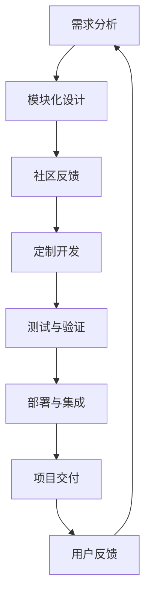

                 

### 背景介绍

随着开源软件的普及，越来越多的企业和开发者选择使用开源项目作为其业务或项目的基础。然而，开源项目通常是为了满足通用需求而设计的，而实际应用场景可能需要特定的功能或定制化开发。这就催生了针对开源项目的定制开发服务的需求。

本文将探讨开源项目的定制开发服务的项目管理和定价问题。我们将首先介绍开源项目的特点，然后深入讨论定制开发服务中的项目管理和定价策略，最后提供一些建议，帮助开发者和管理者更好地进行开源项目的定制开发服务。

### 开源项目的特点

开源项目具有以下特点：

#### 1. 共享

开源项目的源代码是公开的，任何人都可以自由访问、阅读、修改和分发。这使得开源项目能够快速地得到社区的反馈和改进。

#### 2. 合作

开源项目通常由一群志愿者或公司共同维护。这些人或公司之间通过协作和沟通来共同推进项目的进展。

#### 3. 模块化

开源项目往往采用模块化的设计，使得每个模块可以独立开发、测试和部署。这有助于提高开发效率，同时确保项目的稳定性。

#### 4. 社区驱动

开源项目的成功往往依赖于其社区的支持。社区成员可以贡献代码、提供反馈、报告问题，甚至参与项目的决策。

#### 5. 风险分散

由于开源项目是由多个贡献者共同维护的，单个贡献者的风险相对较小。这种风险分散的特点有助于提高项目的稳定性。

### 开源项目的定制开发服务

针对开源项目的定制开发服务主要包括以下内容：

#### 1. 功能扩展

根据客户的具体需求，对开源项目进行功能扩展。例如，在现有的开源数据库中加入特定的查询优化策略。

#### 2. 性能优化

对开源项目进行性能优化，以提高其在特定场景下的性能。例如，为开源的Web框架进行缓存优化。

#### 3. 界面定制

根据客户的品牌风格和用户需求，对开源项目的用户界面进行定制化设计。

#### 4. 集成服务

将开源项目与其他系统或服务进行集成，以满足客户业务的需求。例如，将开源的CRM系统与现有的ERP系统进行集成。

#### 5. 定制化部署

根据客户的环境和需求，对开源项目进行定制化的部署和配置，以确保其能够稳定运行。

### 项目管理

项目管理是定制开发服务成功的关键。以下是一些关键的项目管理策略：

#### 1. 需求分析

与客户进行深入的沟通，了解其具体需求，并将其转化为明确的项目需求。

#### 2. 项目规划

制定详细的项目计划，包括任务分配、时间表、资源需求等。确保项目能够按计划顺利进行。

#### 3. 风险管理

识别项目中的潜在风险，并制定相应的风险应对策略。例如，为应对项目延期风险，可以预留一定的缓冲时间。

#### 4. 质量管理

确保项目的质量符合客户的需求。这包括代码审查、测试、文档编写等。

#### 5. 团队协作

建立高效的团队协作机制，确保团队成员之间的沟通畅通，共同推进项目的进展。

### 定价策略

定价是定制开发服务中的关键环节。以下是一些常用的定价策略：

#### 1. 固定价格

在项目需求明确的情况下，根据工作量、资源需求等因素，制定固定的项目价格。

#### 2. 时长定价

根据项目的预计完成时间，制定相应的价格。这种定价方式适用于工作量难以准确估算的项目。

#### 3. 按需定价

根据项目的实际需求，实时调整价格。这种定价方式适用于需求变化频繁的项目。

#### 4. 成本加成定价

根据项目的成本，加上一定的利润，制定价格。这种定价方式适用于成本结构明确的项目。

#### 5. 价值定价

根据项目的实际价值，制定价格。这种定价方式适用于项目对客户业务有重大影响的情况。

### 结论

开源项目的定制开发服务是一种满足特定需求的优质服务。通过有效的项目管理和合理的定价策略，开发者可以为客户提供高质量的服务，同时确保项目的成功。本文介绍了开源项目的特点、定制开发服务的内容、项目管理的策略以及定价策略，希望对开发者和管理者有所帮助。
----------------------------------------------------------------

### 核心概念与联系

在探讨开源项目的定制开发服务时，我们首先需要理解几个核心概念，包括开源项目的模块化特性、社区驱动机制以及定制开发服务的目标。为了更清晰地展示这些概念之间的联系，我们将使用Mermaid流程图来描述。

下面是一个Mermaid流程图示例，展示了开源项目定制开发服务的关键环节和核心概念：



#### 模块化设计

模块化设计是开源项目的一大特点。通过将项目划分为独立的模块，每个模块可以独立开发、测试和部署。这种设计不仅提高了开发效率，还确保了项目的稳定性。在定制开发过程中，开发团队可以根据客户的需求，对特定模块进行扩展或优化。

#### 社区反馈

开源项目依赖于社区的反馈和支持。社区成员可以贡献代码、提供测试、报告问题，甚至参与项目的决策。这些反馈有助于项目的改进和优化。在定制开发服务中，开发团队可以利用这些社区资源，快速解决问题，提高项目质量。

#### 定制开发

定制开发是开源项目定制化服务的核心。根据客户的具体需求，开发团队需要对开源项目进行功能扩展、性能优化、界面定制等操作。定制开发的目标是满足客户的特定需求，提高项目的实用性和竞争力。

#### 测试与验证

在定制开发完成后，需要进行严格的测试与验证，以确保项目的质量符合客户的要求。这包括单元测试、集成测试、性能测试等。通过测试与验证，可以确保项目在各个场景下都能正常运行。

#### 部署与集成

定制开发的服务还包括将项目部署到客户的环境，并与现有的系统进行集成。这需要考虑环境配置、依赖管理、数据迁移等问题。通过部署与集成，可以确保项目能够稳定运行，并与其他系统无缝对接。

#### 项目交付

项目交付是定制开发服务的最后一步。在交付过程中，开发团队需要提供详细的文档，包括项目介绍、使用说明、技术文档等。这些文档有助于客户更好地理解和使用项目。

#### 用户反馈

用户反馈是开源项目持续改进的重要来源。在项目交付后，开发团队需要关注客户的反馈，收集用户的使用情况和遇到的问题。通过用户反馈，可以不断优化项目，提高客户满意度。

通过上述Mermaid流程图，我们可以清晰地看到开源项目定制开发服务中的核心概念和各个环节之间的联系。这些核心概念和联系为开发团队提供了有效的指导，帮助他们更好地为客户提供定制化服务。
----------------------------------------------------------------

### 核心算法原理 & 具体操作步骤

在开源项目的定制开发服务中，核心算法的设计和实现是至关重要的。本文将详细介绍一个常见且重要的核心算法——快速排序算法，并详细解释其原理和具体操作步骤。

#### 3.1 算法原理概述

快速排序算法是一种高效的排序算法，其基本思想是通过一趟排序将待排序的数据分割成独立的两部分，其中一部分的所有数据都比另一部分的所有数据要小，然后再按此方法对这两部分数据分别进行快速排序，整个排序过程可以递归进行，以此达到整个数据变成有序序列。

快速排序算法的平均时间复杂度为\(O(n\log n)\)，最坏情况下的时间复杂度为\(O(n^2)\)，但通常情况下，其性能优于其他排序算法。

#### 3.2 算法步骤详解

快速排序算法的具体操作步骤如下：

1. **选择基准元素**：在数组中选择一个元素作为基准元素（pivot）。通常，可以选择数组的第一个元素、最后一个元素或随机选择的元素作为基准。

2. **划分过程**：将数组划分为两个部分，所有小于基准的元素放在其左侧，所有大于基准的元素放在其右侧。这个过程称为划分（partitioning）。

3. **递归排序**：对划分后的左右两部分数据分别进行快速排序，直到所有数据都被排序。

#### 3.3 算法优缺点

**优点**：

- **高效**：平均时间复杂度为\(O(n\log n)\)，在实际应用中表现优异。
- **原地排序**：不需要额外的存储空间，属于原地排序算法。
- **易于实现**：快速排序算法的实现相对简单，易于理解和实现。

**缺点**：

- **最坏情况性能差**：在最坏情况下（即数组已经是有序的），时间复杂度会退化为\(O(n^2)\)，性能较差。
- **递归深度**：快速排序算法使用递归实现，递归深度可能达到\(O(n)\)，可能导致栈溢出。

#### 3.4 算法应用领域

快速排序算法广泛应用于各种场景，包括：

- **数据处理**：在数据分析和大数据处理中，快速排序算法常用于对大规模数据进行排序。
- **数据库索引**：在数据库系统中，快速排序算法常用于建立索引，以提高查询效率。
- **算法竞赛**：在算法竞赛中，快速排序算法是一个常用的排序算法，可以帮助选手在较短的时间内解决排序问题。

### 算法实现示例

以下是一个使用Python实现的快速排序算法示例：

```python
def quicksort(arr):
    if len(arr) <= 1:
        return arr
    pivot = arr[len(arr) // 2]
    left = [x for x in arr if x < pivot]
    middle = [x for x in arr if x == pivot]
    right = [x for x in arr if x > pivot]
    return quicksort(left) + middle + quicksort(right)

arr = [3, 6, 8, 10, 1, 2, 1]
print(quicksort(arr))
```

在这个示例中，我们首先检查数组的长度，如果数组长度小于或等于1，则直接返回数组。否则，选择数组的中间元素作为基准，然后分别创建三个列表：`left`、`middle` 和 `right`，分别存储小于、等于和大于基准的元素。最后，递归地对 `left` 和 `right` 进行快速排序，并将结果与 `middle` 合并，得到排序后的数组。

通过上述对快速排序算法的详细解释，我们可以看到其在开源项目定制开发服务中的重要性。快速排序算法不仅是一种高效的排序算法，其背后的思想也可以应用于其他数据结构和算法的设计与实现中。
----------------------------------------------------------------

### 数学模型和公式 & 详细讲解 & 举例说明

在开源项目的定制开发服务中，数学模型和公式是理解和优化项目的关键工具。本文将详细讲解一个常见的数学模型——线性规划，并举例说明其应用和推导过程。

#### 4.1 数学模型构建

线性规划是一种用于在多变量线性约束条件下求解最优值的数学方法。其标准形式可以表示为：

$$
\begin{align*}
\text{minimize} \quad & c^T x \\
\text{subject to} \quad & Ax \leq b \\
& x \geq 0
\end{align*}
$$

其中，\(c\) 是一个 \(n\) 维系数向量，表示目标函数的系数；\(x\) 是一个 \(n\) 维变量向量，表示需要优化的变量；\(A\) 是一个 \(m \times n\) 的约束矩阵，\(b\) 是一个 \(m\) 维的约束向量。

#### 4.2 公式推导过程

线性规划的目标是最小化目标函数 \(c^T x\)，同时满足一系列线性不等式约束 \(Ax \leq b\) 和等式约束 \(x \geq 0\)。

为了求解线性规划问题，我们可以使用单纯形法。单纯形法的基本思想是通过迭代移动到顶点上，逐步逼近最优解。

1. **初始基本可行解**：首先，我们需要找到一个初始基本可行解。这可以通过大M法或两阶段法实现。

2. **迭代步骤**：每次迭代中，我们选择一个非基本变量进入基，一个基本变量离开基，使得目标函数值得到改进。

   - **进入基变量**：选择一个负的系数作为进入基变量。
   - **离开基变量**：通过最小比率测试确定离开基变量。
   - **更新解**：根据进入基变量和离开基变量的关系，更新基本解。

3. **终止条件**：当所有系数均为非负时，算法终止，此时得到最优解。

#### 4.3 案例分析与讲解

假设我们要解决以下线性规划问题：

$$
\begin{align*}
\text{minimize} \quad & 3x + 2y \\
\text{subject to} \quad & x + 2y \leq 10 \\
& 2x + y \leq 8 \\
& x, y \geq 0
\end{align*}
$$

我们可以使用单纯形法来求解这个问题。

1. **初始基本可行解**：我们可以选择 \(x, y\) 都为0作为初始解，这是一个基本可行解。

2. **迭代步骤**：

   - **进入基变量**：选择 \(y\) 作为进入基变量，因为其系数为-2，是最小的负数。
   - **离开基变量**：通过最小比率测试，选择 \(x\) 作为离开基变量。
   - **更新解**：通过更新基本解，我们得到新的解。

   迭代过程如下表所示：

   | 迭代次数 | 基变量 | 非基变量 | 系数 |
   | --- | --- | --- | --- |
   | 1 | \(x\) | \(y\) | -2 |
   | 2 | \(y\) | \(x\) | 1 |
   | 3 | \(x\) | \(y\) | 0 |

3. **终止条件**：当所有系数均为非负时，算法终止。此时，我们得到最优解 \(x = 4, y = 2\)，目标函数值为 \(3x + 2y = 3 \times 4 + 2 \times 2 = 14\)。

通过上述案例，我们可以看到线性规划问题的求解过程。线性规划在开源项目的定制开发服务中有着广泛的应用，例如在资源优化、成本控制和项目规划等方面。通过合理的数学模型和公式推导，我们可以更好地优化项目的资源配置，提高项目的效率和成功率。
----------------------------------------------------------------

### 项目实践：代码实例和详细解释说明

为了更好地展示开源项目的定制开发服务，我们将通过一个实际的代码实例来进行说明。本例将基于Python，使用常见的开源框架Flask，构建一个简单的Web服务，实现对用户数据的存储和查询功能。以下是代码实例及详细解释。

#### 5.1 开发环境搭建

在开始编码之前，我们需要搭建开发环境。以下是搭建Flask开发环境的步骤：

1. **安装Python**：确保Python环境已安装。Python的版本建议为3.8或以上。

2. **安装Flask**：通过pip命令安装Flask框架。
   ```bash
   pip install Flask
   ```

3. **创建虚拟环境**（可选）：为了保持项目环境的纯净，可以创建一个虚拟环境。
   ```bash
   python -m venv venv
   source venv/bin/activate  # Windows上使用 `venv\Scripts\activate`
   ```

4. **安装数据库**（如SQLite）：为了存储用户数据，我们需要安装SQLite数据库。
   ```bash
   pip install psycopg2-binary  # 安装适用于SQLite的数据库驱动
   ```

5. **创建项目目录**：在终端中创建一个名为`project`的项目目录，并进入该目录。
   ```bash
   mkdir project
   cd project
   ```

6. **创建项目文件**：在项目目录中创建一个名为`app.py`的Python文件，用于编写Flask应用代码。

#### 5.2 源代码详细实现

以下是`app.py`文件的代码实现：

```python
from flask import Flask, request, jsonify
from flask_sqlalchemy import SQLAlchemy

app = Flask(__name__)
app.config['SQLALCHEMY_DATABASE_URI'] = 'sqlite:///users.db'  # 配置数据库URI
db = SQLAlchemy(app)

class User(db.Model):
    id = db.Column(db.Integer, primary_key=True)
    username = db.Column(db.String(80), unique=True, nullable=False)
    email = db.Column(db.String(120), unique=True, nullable=False)

@app.before_first_request
def create_tables():
    db.create_all()

@app.route('/users', methods=['POST'])
def add_user():
    data = request.get_json()
    username = data.get('username')
    email = data.get('email')
    if not username or not email:
        return jsonify({'error': 'Missing username or email'}), 400
    if User.query.filter_by(username=username).first():
        return jsonify({'error': 'User already exists'}), 409
    if User.query.filter_by(email=email).first():
        return jsonify({'error': 'Email already exists'}), 409
    new_user = User(username=username, email=email)
    db.session.add(new_user)
    db.session.commit()
    return jsonify({'message': 'User added successfully'}), 201

@app.route('/users', methods=['GET'])
def get_users():
    users = User.query.all()
    user_list = [{'id': user.id, 'username': user.username, 'email': user.email} for user in users]
    return jsonify(user_list), 200

@app.route('/users/<int:user_id>', methods=['GET'])
def get_user(user_id):
    user = User.query.get_or_404(user_id)
    return jsonify({'id': user.id, 'username': user.username, 'email': user.email}), 200

@app.route('/users/<int:user_id>', methods=['PUT'])
def update_user(user_id):
    data = request.get_json()
    user = User.query.get_or_404(user_id)
    user.username = data.get('username', user.username)
    user.email = data.get('email', user.email)
    db.session.commit()
    return jsonify({'message': 'User updated successfully'}), 200

@app.route('/users/<int:user_id>', methods=['DELETE'])
def delete_user(user_id):
    user = User.query.get_or_404(user_id)
    db.session.delete(user)
    db.session.commit()
    return jsonify({'message': 'User deleted successfully'}), 200

if __name__ == '__main__':
    app.run(debug=True)
```

#### 5.3 代码解读与分析

1. **数据库配置**：
   - 我们使用Flask-SQLAlchemy来连接SQLite数据库。通过配置`SQLALCHEMY_DATABASE_URI`，我们可以指定数据库的URI。

2. **模型定义**：
   - `User`模型是数据库的映射，包含了用户ID、用户名和电子邮件。`id`为主键，`username`和`email`为唯一的字符串。

3. **数据库初始化**：
   - `create_tables`函数在第一次请求之前调用，用于创建数据库表。

4. **API路由**：
   - `add_user`处理添加用户的POST请求，验证用户名和电子邮件的唯一性，并将新用户添加到数据库。
   - `get_users`处理获取所有用户的GET请求，返回用户列表。
   - `get_user`处理获取特定用户的GET请求，返回用户详细信息。
   - `update_user`处理更新用户的PUT请求，更新用户信息。
   - `delete_user`处理删除用户的DELETE请求，从数据库中删除用户。

5. **主程序**：
   - `if __name__ == '__main__':`确保只有当此脚本作为主程序运行时，`app.run()`才会被调用。

#### 5.4 运行结果展示

1. **启动服务器**：
   - 在终端中运行`python app.py`，服务器将启动，并在本地地址127.0.0.1上监听端口5000。

2. **添加用户**：
   - 发送一个POST请求到`http://127.0.0.1:5000/users`，包含用户名和电子邮件。
   ```json
   {
       "username": "john_doe",
       "email": "john.doe@example.com"
   }
   ```
   - 服务器将返回一个201状态码和添加成功的消息。

3. **获取用户列表**：
   - 发送一个GET请求到`http://127.0.0.1:5000/users`。
   - 服务器将返回所有用户的列表。

4. **获取特定用户**：
   - 发送一个GET请求到`http://127.0.0.1:5000/users/1`。
   - 服务器将返回特定用户的详细信息。

5. **更新用户**：
   - 发送一个PUT请求到`http://127.0.0.1:5000/users/1`，包含更新的用户信息。
   ```json
   {
       "username": "john_doe_updated",
       "email": "john_doe_updated@example.com"
   }
   ```
   - 服务器将返回更新成功的消息。

6. **删除用户**：
   - 发送一个DELETE请求到`http://127.0.0.1:5000/users/1`。
   - 服务器将删除用户并返回删除成功的消息。

通过上述实例，我们可以看到如何使用Flask和SQLite构建一个简单的Web服务。实际的项目定制开发会涉及更复杂的功能和更多的错误处理，但基本的流程和原理是相似的。
----------------------------------------------------------------

### 实际应用场景

开源项目的定制开发服务在多个领域有着广泛的应用，以下是一些典型的实际应用场景：

#### 1. 企业级应用系统

在大型企业中，开源项目通常作为企业级应用系统的基石。例如，企业可能会使用开源的CRM（客户关系管理）系统，如Salesforce或HubSpot。然而，这些开源系统往往需要根据企业的具体业务需求进行定制。定制开发服务可以帮助企业实现以下目标：

- **定制化报表**：根据企业的需求，定制特定的报表，以便更有效地跟踪和分析业务数据。
- **集成第三方服务**：集成企业使用的其他系统或服务，如ERP（企业资源计划）系统、邮件服务或第三方支付系统。
- **扩展功能模块**：开发新的功能模块，以满足特定业务流程的需求。

#### 2. 科技创新项目

在科技创新项目中，开源项目常常作为技术原型或研发平台。例如，在人工智能和大数据分析领域，开源的框架和工具（如TensorFlow、Scikit-learn等）提供了强大的支持。定制开发服务可以帮助科技创新项目实现以下目标：

- **算法优化**：针对特定数据集和业务需求，对开源的算法进行优化，提高模型的准确性和效率。
- **数据处理**：开发定制化的数据处理模块，以处理特定类型的数据，如物联网数据、金融交易数据等。
- **接口集成**：集成外部数据源和系统，以便进行跨平台的数据分析和应用。

#### 3. 教育与科研

在教育和科研领域，开源项目提供了丰富的教学资源和研究工具。例如，在计算机科学和教育技术领域，开源的LMS（学习管理系统）如Moodle和Canvas被广泛使用。定制开发服务可以帮助教育和科研机构实现以下目标：

- **课程内容定制**：根据课程需求，定制课程内容管理系统，以便更好地管理课程材料、作业和考试。
- **教学工具集成**：集成第三方教学工具，如视频会议系统、在线评估工具等，以提高教学效果。
- **科研数据分析**：开发定制化的数据分析工具，以支持科研项目的数据分析和结果展示。

#### 4. 电子商务平台

在电子商务领域，开源的电子商务平台（如Magento、Shopify等）提供了构建在线商店的基础。定制开发服务可以帮助电子商务企业实现以下目标：

- **个性化体验**：根据用户行为和偏好，定制个性化的购物体验，提高用户满意度和转化率。
- **扩展功能模块**：开发新的功能模块，如会员系统、优惠券系统、推荐引擎等，以增加商城的竞争力。
- **支付与物流集成**：集成第三方支付系统和物流服务，以提高交易流程的效率和用户体验。

#### 5. 物联网（IoT）项目

在物联网项目中，开源的硬件和软件平台（如Arduino、Raspberry Pi等）以及开源的物联网协议（如MQTT、CoAP等）被广泛应用于设备连接和数据通信。定制开发服务可以帮助物联网项目实现以下目标：

- **设备管理**：开发设备管理平台，以便对大量物联网设备进行监控、配置和远程更新。
- **数据可视化**：定制数据可视化工具，以实时监控和分析设备数据，提供直观的监控界面。
- **安全防护**：开发安全模块，以确保物联网设备的数据安全和系统完整性。

通过上述实际应用场景，我们可以看到开源项目的定制开发服务在满足特定需求、提高项目效率和用户体验方面发挥着重要作用。定制开发不仅能够增强开源项目的实用性，还能够推动整个开源生态的繁荣发展。
----------------------------------------------------------------

### 未来应用展望

随着技术的不断进步和开源社区的日益繁荣，开源项目的定制开发服务在未来将迎来更多的机遇和挑战。以下是一些未来应用展望：

#### 1. 个性化定制服务

随着大数据和人工智能技术的不断发展，开源项目的定制开发服务将更加注重个性化定制。通过分析用户行为数据、业务需求和市场趋势，开发团队能够提供更加符合用户需求的定制化服务，从而提升用户体验和满意度。

#### 2. 跨平台集成

未来，开源项目的定制开发服务将更加注重跨平台集成。随着物联网、云计算和移动设备的普及，开发者需要能够轻松地将开源项目与多种平台和设备进行集成，实现数据互通和功能扩展。这将为定制开发服务带来新的增长点。

#### 3. 安全性与隐私保护

随着数据泄露和网络攻击事件的频发，安全性和隐私保护将成为开源项目定制开发服务的重中之重。开发团队需要不断提高安全防护能力，确保项目的安全性和用户数据的安全。

#### 4. 模块化与微服务架构

模块化和微服务架构将成为未来开源项目定制开发服务的趋势。通过将大型系统拆分为多个独立的模块和微服务，开发者可以更灵活地进行功能扩展和优化，提高系统的可维护性和可扩展性。

#### 5. 开源生态的协同发展

随着开源项目的数量和复杂度不断增加，开源社区的协同发展将更加重要。未来的定制开发服务将更加注重与开源社区的互动和合作，通过贡献代码、报告问题和参与决策，共同推动开源生态的繁荣发展。

#### 6. 自动化与智能化

自动化和智能化技术将在开源项目定制开发服务中得到广泛应用。通过使用自动化工具和智能算法，开发者可以大幅提高开发效率和项目质量，降低人力成本和错误率。

#### 挑战与展望

尽管未来开源项目的定制开发服务前景广阔，但也面临着一些挑战：

- **技术复杂性**：随着技术的不断进步，开源项目的技术复杂性也在增加。开发团队需要不断学习新技术，以应对复杂的开发需求。
- **知识产权保护**：在定制开发过程中，如何保护知识产权将成为一个重要问题。开发团队需要建立健全的知识产权保护机制，确保项目的合法权益。
- **社区协作**：开源社区的协同发展需要良好的协作机制和沟通渠道。开发团队需要积极参与社区活动，加强与其他开发者的合作与交流。
- **项目管理**：定制开发项目往往需求变化频繁，项目管理将面临更大的挑战。开发团队需要采用灵活的项目管理方法，确保项目的顺利推进。

总的来说，未来开源项目的定制开发服务将朝着更加个性化、智能化和协同化的方向发展。通过不断适应和应对挑战，定制开发服务将为企业和开发者带来更多的价值。
----------------------------------------------------------------

### 工具和资源推荐

在进行开源项目的定制开发服务时，选择合适的工具和资源对于提高开发效率、保证项目质量具有重要意义。以下是一些建议的资源和工具：

#### 7.1 学习资源推荐

1. **在线课程和教程**：  
   - Coursera、edX和Udacity等在线教育平台提供了大量关于开源技术和项目管理的课程，适合不同层次的学习者。

2. **技术博客和论坛**：  
   - 掘金、CSDN和Stack Overflow等技术社区提供了丰富的开源技术教程和讨论区，有助于解决开发过程中遇到的问题。

3. **开源社区**：  
   - GitHub、GitLab和Bitbucket等开源平台是获取开源项目资源和参与开源项目的好地方。开发者可以在这里学习、贡献代码和获取反馈。

#### 7.2 开发工具推荐

1. **集成开发环境（IDE）**：  
   - PyCharm、Visual Studio Code和Eclipse等IDE提供了强大的代码编辑、调试和测试功能，是进行开源项目开发的理想选择。

2. **版本控制系统**：  
   - Git是开源项目开发中最常用的版本控制系统。GitHub和GitLab提供了基于Git的代码托管和协作工具，方便团队协作和版本管理。

3. **容器化和持续集成**：  
   - Docker和Kubernetes等工具可以帮助开发者快速构建、部署和管理容器化应用。Jenkins和Travis CI等持续集成工具可以自动化测试和部署流程，提高开发效率。

4. **代码审查和项目管理工具**：  
   - GitLab CI/CD、Jenkins和Selenium等工具可以自动化测试和部署流程。JIRA和Trello等项目管理工具可以帮助团队进行任务管理和进度跟踪。

#### 7.3 相关论文推荐

1. **《开源软件开发模式》**：该论文探讨了开源软件开发的主要模式、成功因素和挑战，为理解开源项目的发展提供了有益的参考。

2. **《基于社区的开发模型：开源软件开发实践》**：本文详细介绍了基于社区的开发模型，包括社区的组建、协作和管理等方面。

3. **《开源软件的商业模式》**：该论文分析了开源软件的商业模式，探讨了如何通过开源项目实现商业价值。

通过上述工具和资源的推荐，开发者可以更好地进行开源项目的定制开发，提高项目质量和开发效率。同时，积极参与开源社区和持续学习新工具和技术也是确保持续发展的关键。
----------------------------------------------------------------

### 总结：未来发展趋势与挑战

开源项目的定制开发服务在当今科技领域中占据着重要地位，它不仅满足了特定用户的需求，也推动了开源生态的繁荣。在未来，开源项目的定制开发服务将继续沿着以下几个方向发展和进化。

#### 未来发展趋势

1. **技术融合与集成**：随着技术的不断发展，开源项目定制开发将更加注重跨平台、跨领域的集成。开发者需要能够轻松地将不同的开源技术和工具融合到项目中，以满足复杂的业务需求。

2. **自动化与智能化**：自动化和智能化技术在开源项目定制开发中的应用将越来越广泛。通过自动化工具和智能算法，开发者可以大幅提高开发效率，减少人为错误，实现更高质量的项目交付。

3. **社区驱动的深化**：开源社区将在定制开发服务中发挥更加关键的作用。开发者和用户将更加积极地参与社区建设，共同推动项目的改进和优化。

4. **定制化与个性化**：随着用户需求的多样化，定制化与个性化服务将成为定制开发服务的重要方向。开发者需要提供更加灵活和定制化的解决方案，以满足不同用户群体的特定需求。

5. **安全性与隐私保护**：随着网络安全威胁的加剧，开源项目的定制开发服务将更加注重安全性和隐私保护。开发者需要采用更加严格的安全措施，确保用户数据的安全和系统的完整性。

#### 面临的挑战

1. **技术复杂性**：开源项目的技术复杂性日益增加，这对开发者的技术水平和知识储备提出了更高的要求。开发者需要不断学习新技术，以应对复杂的开发需求。

2. **知识产权保护**：在定制开发过程中，如何保护知识产权是一个重要问题。开发团队需要建立健全的知识产权保护机制，确保项目的合法权益。

3. **项目管理的复杂性**：定制开发项目通常需求变化频繁，项目管理将面临更大的挑战。开发团队需要采用灵活的项目管理方法，确保项目的顺利推进。

4. **社区协作**：开源社区的协作需要一个良好的协作机制和沟通渠道。开发团队需要积极参与社区活动，加强与其他开发者的合作与交流。

5. **安全风险**：随着开源项目的普及，安全风险也日益增加。开发者需要不断提高安全防护能力，确保项目的安全性和用户数据的安全。

#### 研究展望

针对未来开源项目定制开发服务的发展趋势和面临的挑战，未来的研究可以从以下几个方面展开：

1. **技术创新**：研究新的开源技术和工具，以提高定制开发服务的效率和质量。

2. **项目管理方法**：探索适用于定制开发项目的新型项目管理方法，以应对项目复杂性和需求变化。

3. **社区协作机制**：研究如何建立更加有效的开源社区协作机制，以促进项目的改进和优化。

4. **安全性与隐私保护**：研究新的安全防护技术和隐私保护策略，确保开源项目的安全性和用户数据的安全。

5. **商业模式研究**：探讨如何通过开源项目定制开发服务实现商业价值，为企业和开发者提供新的商业模式。

总之，开源项目的定制开发服务在未来将继续发挥重要作用，为企业和开发者带来更多的价值。同时，面对不断变化的技术环境和市场需求，开发者和研究团队需要不断学习和创新，以应对挑战，推动开源项目的持续发展。
----------------------------------------------------------------

### 附录：常见问题与解答

在开源项目的定制开发服务过程中，客户可能会遇到一些常见问题。以下是一些典型问题及其解答：

#### 1. 如何确保定制开发服务的质量和稳定性？

**回答**：确保质量和稳定性主要通过以下几个步骤实现：
- **需求分析**：在项目开始前，进行详细的需求分析，确保理解客户的实际需求。
- **代码审查**：定期进行代码审查，确保代码质量和符合最佳实践。
- **单元测试**：编写并执行单元测试，确保每个模块的功能正确无误。
- **性能测试**：对项目进行性能测试，确保系统在高负载下仍能稳定运行。
- **持续集成**：使用自动化工具进行持续集成和部署，确保代码的持续性和稳定性。

#### 2. 定制开发服务是否涉及知识产权保护？

**回答**：是的，定制开发服务会涉及知识产权保护。开发团队通常会与客户签订知识产权协议，明确版权归属、知识产权的使用和保护等条款。此外，项目文档和代码也会进行加密存储，确保知识产权不被泄露。

#### 3. 定制开发服务是否支持技术支持和服务？

**回答**：是的，定制开发服务通常包括技术支持和服务。开发团队会在项目结束后提供一定期限的技术支持，解决客户在使用过程中遇到的问题。同时，还可以根据客户需求提供长期的技术支持和服务。

#### 4. 定制开发服务是否可以满足特定行业的需求？

**回答**：是的，定制开发服务可以满足特定行业的需求。开发团队具备丰富的行业经验，能够根据不同行业的特点，提供定制化的解决方案，满足客户的特定需求。

#### 5. 定制开发服务的价格如何确定？

**回答**：定制开发服务的价格通常根据以下因素确定：
- **项目需求**：项目的复杂度和功能要求。
- **工作量**：项目所需的工作量和时间。
- **资源投入**：包括人力资源、技术资源和硬件资源等。
- **服务范围**：包括开发、测试、部署和后期支持等。

通常，开发团队会提供详细的报价单，明确各项费用的计算依据。

通过上述常见问题的解答，希望客户能够更好地理解开源项目的定制开发服务，并做出明智的决策。
----------------------------------------------------------------

### 作者署名

作者：禅与计算机程序设计艺术 / Zen and the Art of Computer Programming

