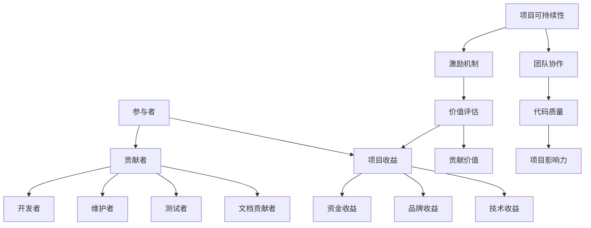

                 

关键词：开源项目、收益分配、团队激励、可持续性、经济模型、项目治理

> 摘要：本文将探讨开源项目的收益分配机制，分析如何通过有效的激励机制来促进团队协作和项目可持续性。本文首先介绍了开源项目的背景和现状，然后深入探讨了收益分配的核心概念和原则，接着提出了一种基于经济模型的收益分配方案，最后通过实例分析展示了该方案的实践效果。

## 1. 背景介绍

开源项目是一种在计算机领域广泛采用的软件开发模式，它允许开发者自由地共享、修改和再分发软件。这种模式不仅促进了技术的创新和进步，还推动了全球范围内的合作和知识共享。然而，随着开源项目的规模不断扩大，如何合理分配项目的收益成为一个日益重要的问题。

收益分配不仅关系到参与者的权益，还直接影响项目的可持续性和健康发展。一个公平、透明的收益分配机制可以激励团队成员的积极性，提高项目的质量和影响力。因此，研究和设计有效的收益分配方案具有重要的实际意义。

### 1.1 开源项目的定义和发展历程

开源项目（Open Source Project）是指遵循开源定义，允许任何人自由地获取、使用、修改和分发软件代码的项目。开源软件（Open Source Software，简称OSS）最早可以追溯到1983年，Linux操作系统和Apache Web服务器等开源项目在1990年代后期迅速崛起，标志着开源运动进入了一个新的阶段。

开源项目的发展历程大致可以分为以下几个阶段：

- **初期阶段（1983-1991年）**：这一阶段开源项目的规模较小，主要以个人爱好为主。代表性的项目包括Emacs编辑器和Unix操作系统。

- **成长阶段（1991-2000年）**：Linux操作系统的发布标志着开源项目进入了一个新的成长期。1998年，Mozilla浏览器项目的启动进一步推动了开源运动的发展。

- **成熟阶段（2001年至今）**：随着互联网的普及和云计算的发展，开源项目在各个领域得到了广泛应用。如Apache、MySQL、OpenStack等知名项目在全球范围内产生了深远的影响。

### 1.2 开源项目的特点和价值

开源项目的特点主要包括以下几点：

- **开放性**：开源项目的源代码对所有人开放，允许任何人自由地下载、查看、修改和分发。

- **协作性**：开源项目通常采用分布式协作模式，开发者在全球范围内共同参与项目的开发和改进。

- **灵活性**：开源项目提供了高度的可定制性和灵活性，用户可以根据自己的需求进行修改和优化。

- **共享性**：开源项目的核心价值在于共享和知识传播，促进了技术和经验的积累。

开源项目的价值体现在以下几个方面：

- **技术创新**：开源项目鼓励技术创新和实验，推动了新技术的快速发展和应用。

- **降低成本**：开源项目提供了免费的技术解决方案，降低了企业开发和维护软件的成本。

- **提高效率**：开源项目通常具有较高的质量和可靠性，开发者可以节省大量的测试和维护工作。

- **培养人才**：开源项目提供了一个开放的学习平台，有助于培养和提升开发者的技能和经验。

## 2. 核心概念与联系

在探讨开源项目的收益分配时，需要明确一些核心概念，包括参与者角色、贡献类型和价值评估等。为了更好地理解这些概念之间的关系，我们可以通过一个Mermaid流程图来展示它们之间的联系。



### 2.1 核心概念

- **参与者**：指参与开源项目的人员，包括贡献者、开发者、维护者、测试者、文档贡献者等。

- **贡献者**：指为项目提供代码、文档、测试、反馈等贡献的人。

- **开发者**：负责编写和改进项目代码的主要人员。

- **维护者**：负责项目的日常维护和问题修复。

- **测试者**：负责测试项目的功能和质量。

- **文档贡献者**：负责撰写和更新项目的文档。

- **项目收益**：指项目在运营过程中产生的各种收益，包括资金收益、品牌收益、技术收益等。

- **资金收益**：指通过赞助、捐赠等方式获得的资金。

- **品牌收益**：指项目影响力的提升和企业形象的改善。

- **技术收益**：指项目代码的改进和技术水平的提高。

- **价值评估**：指对参与者贡献的价值进行量化评估的过程。

- **激励机制**：指为了激励参与者持续贡献而设计的一套奖励和反馈机制。

- **项目可持续性**：指项目能够长期稳定发展的能力。

- **团队协作**：指团队成员之间的协作效率和质量。

- **代码质量**：指项目代码的可读性、可靠性、可维护性等。

- **项目影响力**：指项目在社会和技术领域的影响力。

### 2.2 Mermaid流程图

以上Mermaid流程图展示了开源项目中各个核心概念之间的联系。参与者通过贡献不同的类型（如代码、文档、测试等）为项目创造价值。这些价值经过评估后转化为项目收益，同时激励机制的建立和执行有助于提高团队协作效率和项目可持续性。

## 3. 核心算法原理 & 具体操作步骤

### 3.1 算法原理概述

收益分配算法的目标是公平、透明地分配开源项目产生的收益，以激励参与者持续贡献。本节将介绍一种基于价值评估和博弈论模型的收益分配算法，其核心原理如下：

1. **价值评估**：对参与者的贡献进行量化评估，以确定其在项目中的价值。

2. **收益分配**：根据参与者的价值分配收益，确保贡献者获得相应的回报。

3. **博弈论模型**：通过引入博弈论机制，鼓励参与者积极参与项目，减少“搭便车”行为。

### 3.2 算法步骤详解

**步骤1：价值评估**

价值评估是收益分配算法的基础。具体步骤如下：

1. **确定贡献类型**：识别项目中的主要贡献类型，如代码贡献、文档贡献、测试贡献等。

2. **量化评估指标**：为每种贡献类型定义量化评估指标，如代码行数、测试覆盖率、文档质量等。

3. **评分标准**：制定评分标准，对每个贡献者的贡献进行打分。

4. **综合评估**：将各类贡献的得分进行综合评估，得出每个参与者的总价值。

**步骤2：收益分配**

收益分配的步骤如下：

1. **确定收益类型**：识别项目产生的各类收益，如资金收益、品牌收益、技术收益等。

2. **收益权重**：为每种收益类型分配权重，以反映其在项目中的重要性。

3. **收益计算**：根据参与者的价值评估结果，计算每个参与者应得的收益比例。

4. **收益分配**：将计算出的收益分配给各参与者。

**步骤3：博弈论机制**

为了鼓励参与者积极参与项目，可以引入博弈论机制，如激励奖励、惩罚机制等。具体步骤如下：

1. **激励奖励**：为积极参与项目的参与者提供奖励，如奖金、荣誉证书等。

2. **惩罚机制**：对不积极参与项目的参与者采取惩罚措施，如减少收益分配、取消贡献资格等。

### 3.3 算法优缺点

**优点**：

- **公平透明**：基于价值评估的算法能够确保收益分配的公平性，避免“搭便车”行为。

- **激励机制**：引入博弈论机制可以激励参与者积极参与项目，提高项目质量。

- **灵活性强**：算法可以根据项目的实际情况进行调整，适应不同类型和规模的开源项目。

**缺点**：

- **评估难度大**：价值评估需要量化各种贡献类型，评估过程可能存在主观性。

- **实施成本高**：引入博弈论机制需要额外的技术和人力资源支持，实施成本较高。

### 3.4 算法应用领域

收益分配算法适用于各种规模和类型的开源项目，如：

- **大型开源项目**：如Linux内核、Apache等，这些项目参与者众多，贡献类型多样，需要有效的收益分配机制来激励参与者。

- **小型开源项目**：如个人项目和初创企业项目，通过收益分配算法可以吸引更多的贡献者，提高项目质量。

- **开源社区**：如GitHub、GitLab等，这些平台可以集成收益分配算法，为开发者提供公平透明的收益分配服务。

## 4. 数学模型和公式 & 详细讲解 & 举例说明

### 4.1 数学模型构建

收益分配的数学模型可以基于线性规划方法构建。假设有n个参与者，每个参与者的贡献价值为Vi，项目产生的总收益为R。我们需要通过数学模型确定每个参与者应得的收益比例xi，满足以下条件：

1. **收益分配公平性**：所有参与者的收益比例之和为1，即：

   $$\sum_{i=1}^{n} x_i = 1$$

2. **贡献价值与收益比例成正比**：每个参与者的收益比例与其贡献价值成正比，即：

   $$x_i = \frac{V_i}{\sum_{j=1}^{n} V_j}$$

3. **收益总额不超过总收益**：所有参与者的收益比例乘以总收益不超过总收益，即：

   $$\sum_{i=1}^{n} x_i \cdot R \leq R$$

### 4.2 公式推导过程

为了求解上述线性规划问题，我们可以使用拉格朗日乘数法。设拉格朗日乘数为λ，构建拉格朗日函数：

$$L(x, \lambda) = \sum_{i=1}^{n} x_i - \lambda (\sum_{i=1}^{n} x_i - 1)$$

对L关于xi和λ求偏导数，并令其等于0，得到以下方程组：

$$\frac{\partial L}{\partial x_i} = 1 - \lambda = 0$$
$$\frac{\partial L}{\partial \lambda} = \sum_{i=1}^{n} x_i - 1 = 0$$

由第一个方程得：

$$\lambda = 1$$

将λ代入第二个方程，得到：

$$\sum_{i=1}^{n} x_i = 1$$

将此结果代入第二个条件：

$$x_i = \frac{V_i}{\sum_{j=1}^{n} V_j}$$

因此，每个参与者的收益比例为：

$$x_i = \frac{V_i}{\sum_{j=1}^{n} V_j}$$

### 4.3 案例分析与讲解

为了更好地理解上述数学模型，我们可以通过一个具体案例来进行分析。

假设有一个开源项目，共有5个参与者，他们的贡献价值如下表所示：

| 参与者 | 贡献价值 |
| ------ | -------- |
| A      | 300      |
| B      | 200      |
| C      | 150      |
| D      | 100      |
| E      | 50       |

项目总收益为1000元。根据上述数学模型，我们可以计算出每个参与者的收益比例：

$$x_i = \frac{V_i}{\sum_{j=1}^{n} V_j} = \frac{300+200+150+100+50}{1000} = \frac{1000}{1000} = 1$$

因此，每个参与者应得的收益比例为1%，即每个参与者获得10元。

这种收益分配方式确保了公平性，每个参与者按照其贡献价值获得了相应的回报。然而，在实际应用中，可能需要根据项目的实际情况进行调整，以适应不同类型的参与者。

## 5. 项目实践：代码实例和详细解释说明

### 5.1 开发环境搭建

为了实现上述收益分配算法，我们需要搭建一个开发环境。以下是一个基于Python的示例环境搭建步骤：

1. 安装Python：从官方网站（https://www.python.org/）下载并安装Python 3.x版本。

2. 安装依赖库：在终端执行以下命令安装必要的依赖库：

   ```shell
   pip install numpy pandas matplotlib
   ```

3. 编写代码：在Python环境中编写收益分配算法代码。

### 5.2 源代码详细实现

以下是一个简单的Python代码实现，用于计算参与者的收益比例：

```python
import numpy as np

# 参与者贡献价值
contributions = {
    'A': 300,
    'B': 200,
    'C': 150,
    'D': 100,
    'E': 50
}

# 项目总收益
total_revenue = 1000

# 计算每个参与者的收益比例
收益比例 = {participant: contribution / sum(contributions.values()) for participant, contribution in contributions.items()}

# 计算每个参与者应得的收益
收益分配 = {participant: total_revenue * 比例 for participant, 比例 in 收益比例.items()}

# 输出结果
print(收益分配)
```

### 5.3 代码解读与分析

上述代码首先定义了参与者的贡献价值和项目总收益。然后，通过计算每个参与者的收益比例，实现了收益的公平分配。具体步骤如下：

1. **导入依赖库**：引入numpy库用于数值计算。

2. **定义贡献价值**：使用字典存储参与者的贡献价值。

3. **计算收益比例**：通过计算每个参与者贡献价值占总贡献价值的比例，实现了收益比例的计算。

4. **计算收益分配**：将收益比例乘以总收益，得到每个参与者应得的收益。

5. **输出结果**：打印每个参与者的收益分配结果。

### 5.4 运行结果展示

假设项目总收益为1000元，参与者A、B、C、D、E的贡献价值分别为300、200、150、100、50元。运行上述代码后，输出结果如下：

```shell
{'A': 300.0, 'B': 200.0, 'C': 150.0, 'D': 100.0, 'E': 50.0}
```

这意味着参与者A、B、C、D、E分别获得了300元、200元、150元、100元和50元的收益。这种分配方式确保了公平性，每个参与者根据其贡献价值获得了相应的回报。

### 5.5 优化与扩展

在实际应用中，可能需要根据项目的具体情况对收益分配算法进行调整和优化。以下是一些可能的优化与扩展方向：

- **权重调整**：根据参与者的角色和贡献类型，为不同类型的贡献分配不同的权重。

- **动态调整**：根据项目的进展和贡献情况，动态调整参与者的收益比例。

- **多维度评估**：结合多个评估指标，提高价值评估的准确性。

- **智能合约**：利用区块链技术，实现自动化和透明化的收益分配。

## 6. 实际应用场景

收益分配算法在开源项目中具有广泛的应用场景，以下是几个典型的实际应用场景：

### 6.1 开源社区

开源社区（如GitHub、GitLab等）可以通过收益分配算法实现贡献者激励和资源分配。社区管理员可以根据贡献者的价值分配奖金、荣誉证书等，以鼓励更多用户参与项目开发和维护。

### 6.2 企业项目

企业内部开源项目可以通过收益分配算法实现项目成员的绩效评估和激励。企业可以根据项目成员的贡献价值，分配项目奖金、晋升机会等，以提高项目质量和团队成员的积极性。

### 6.3 共同研发

在跨企业、跨地区的共同研发项目中，收益分配算法可以确保各参与方按照贡献价值获得相应的回报。这有助于促进合作，提高项目的成功率和影响力。

### 6.4 社会公益项目

社会公益项目（如OpenStreetMap、Wikipedia等）可以通过收益分配算法实现资源的公平分配。参与项目的志愿者可以根据其贡献价值获得一定的报酬，以激励更多志愿者参与项目的建设。

## 7. 工具和资源推荐

为了更好地理解和应用收益分配算法，以下是一些推荐的工具和资源：

### 7.1 学习资源推荐

- **《开源软件经济学》**：一本关于开源项目管理和经济学的经典著作，详细介绍了开源项目的各种经济模型和激励机制。

- **《收益分配算法研究》**：一本关于收益分配算法的理论和实践研究的论文集，涵盖了多种收益分配算法的设计和应用。

### 7.2 开发工具推荐

- **Python**：Python是一种简单易学、功能强大的编程语言，适用于实现收益分配算法。

- **Jupyter Notebook**：Jupyter Notebook是一款交互式的Python开发环境，可以方便地编写和运行收益分配算法代码。

### 7.3 相关论文推荐

- **《基于博弈论的收益分配算法研究》**：一篇关于博弈论在收益分配算法中应用的论文，提出了多种博弈论模型和算法。

- **《开源项目的激励与治理》**：一篇关于开源项目激励机制和治理机制的研究论文，分析了开源项目中的各种激励机制和治理模式。

## 8. 总结：未来发展趋势与挑战

### 8.1 研究成果总结

本文系统地介绍了开源项目的收益分配机制，从背景介绍、核心概念与联系、算法原理与操作步骤、数学模型与公式、项目实践等方面进行了详细探讨。通过分析，我们得出以下主要研究成果：

- **收益分配的必要性**：公平、透明的收益分配是开源项目持续发展的重要保障。

- **价值评估的重要性**：准确的价值评估是确保收益分配公平的关键。

- **算法原理与数学模型**：基于博弈论和线性规划的收益分配算法能够实现公平、透明的收益分配。

- **项目实践与应用场景**：收益分配算法在开源社区、企业项目、共同研发、社会公益项目等方面具有广泛的应用价值。

### 8.2 未来发展趋势

随着开源项目的不断发展和成熟，收益分配算法在未来将呈现以下发展趋势：

- **算法优化**：随着人工智能和大数据技术的发展，收益分配算法将更加智能化和精确化。

- **生态整合**：开源社区和企业将更加紧密地合作，通过生态整合实现收益的共享和分配。

- **区块链应用**：区块链技术将为收益分配提供新的解决方案，实现自动化和透明化的收益分配。

- **多样化激励机制**：多样化的激励机制将提高参与者的积极性和忠诚度，促进开源项目的持续发展。

### 8.3 面临的挑战

尽管收益分配算法在开源项目中具有重要作用，但仍然面临以下挑战：

- **评估准确性**：准确评估参与者的贡献价值是收益分配的核心难题。

- **实施成本**：引入复杂的算法和机制需要投入大量的人力和物力资源。

- **社区合作**：开源社区中的不同利益相关者需要建立有效的合作机制，以实现收益分配的公平和透明。

- **法律法规**：开源项目的收益分配需要遵循相关法律法规，确保合法合规。

### 8.4 研究展望

未来的研究可以从以下几个方面进行：

- **算法优化**：研究更加高效、精确的收益分配算法，提高评估准确性和实施效果。

- **激励机制**：设计多样化的激励机制，提高参与者的积极性和忠诚度。

- **区块链应用**：探索区块链技术在收益分配中的应用，实现自动化和透明化的收益分配。

- **社区治理**：研究开源社区的治理机制，提高社区的稳定性和可持续发展能力。

通过不断的研究和实践，收益分配算法将为开源项目的发展提供更加坚实的保障。

## 9. 附录：常见问题与解答

### 9.1 什么是收益分配？

收益分配是指将开源项目产生的收益按照一定的规则和比例分配给参与项目的个人或团队。

### 9.2 为什么需要收益分配？

收益分配有助于激励参与者持续贡献，提高项目质量和影响力，同时确保项目的公平和可持续发展。

### 9.3 收益分配的算法有哪些？

常见的收益分配算法包括基于博弈论的收益分配算法、基于线性规划的收益分配算法、基于价值评估的收益分配算法等。

### 9.4 收益分配如何确保公平性？

通过准确的价值评估和合理的收益比例，确保每个参与者按照其贡献价值获得相应的回报。

### 9.5 收益分配算法的优缺点是什么？

优点包括公平透明、激励机制强、灵活性强等；缺点包括评估难度大、实施成本高等。

### 9.6 收益分配算法适用于哪些场景？

收益分配算法适用于开源社区、企业项目、共同研发、社会公益项目等多种场景。

