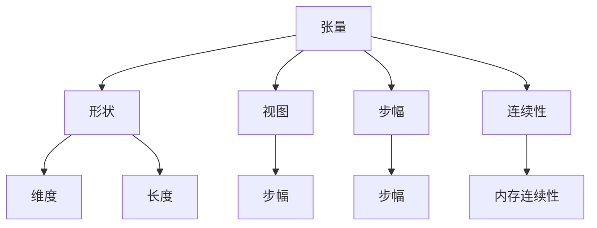

                 

关键词：张量操作、形状、视图、步幅、连续性、矩阵、算法、数学模型、编程实现、实际应用、未来展望

> 摘要：本文深入讲解了张量操作的核心概念，包括形状、视图、步幅和连续性，以及其在计算机科学和工程领域的广泛应用。通过数学模型、算法原理和编程实例，本文为读者提供了全面的技术指导和实践参考。

## 1. 背景介绍

在计算机科学和工程中，张量操作是一个基础而重要的概念。张量可以看作是多维矩阵的推广，它广泛应用于图像处理、计算机图形学、机器学习、数值计算等多个领域。张量的基本操作包括形状变换、视图创建、步幅调整和连续性维护等。这些操作不仅影响张量的计算效率，还影响其在各种应用场景中的表现。

本文将围绕张量操作的核心概念展开讨论，包括形状、视图、步幅和连续性。我们将介绍这些概念的基本原理，并通过具体的算法和数学模型进行详细讲解。此外，文章还将提供实际编程实现和运行结果，帮助读者更好地理解和掌握张量操作。

## 2. 核心概念与联系

### 2.1. 张量与矩阵的关系

张量可以看作是矩阵的推广。一个矩阵是一个二维数组，而张量是一个多维数组。例如，一个二维矩阵可以表示为二维表，而一个三维张量可以表示为三维数组。

### 2.2. 张量的形状

张量的形状是指其维度和每个维度的长度。例如，一个三维张量可能有形状 (3, 4, 5)，表示它有三个维度，第一个维度有3个元素，第二个维度有4个元素，第三个维度有5个元素。

### 2.3. 视图与步幅

视图是指张量中的一个子集，可以通过指定步幅（strides）来创建。步幅是指访问下一个元素所需的步骤数。例如，一个二维张量的步幅可能是 [2, 1]，表示在第一个维度上每次跳两个元素，在第二个维度上每次跳一个元素。

### 2.4. 连续性

连续性是指张量的元素在内存中的连续存储。连续性对于提高张量操作的效率至关重要。

### 2.5. Mermaid 流程图

以下是一个简单的 Mermaid 流程图，展示了张量操作中的核心概念和它们之间的联系。



## 3. 核心算法原理 & 具体操作步骤

### 3.1. 算法原理概述

张量操作的核心算法主要包括张量形状变换、视图创建、步幅调整和连续性维护。这些算法的基本原理如下：

- **形状变换**：通过数学运算改变张量的维度和长度。
- **视图创建**：通过指定步幅创建张量的子集。
- **步幅调整**：调整访问张量元素时的步幅。
- **连续性维护**：确保张量在内存中的连续存储。

### 3.2. 算法步骤详解

下面将详细介绍每个算法的具体步骤：

#### 3.2.1. 形状变换

形状变换的基本步骤如下：

1. **确定新形状**：根据需求确定张量的新维度和长度。
2. **计算新步幅**：根据新形状计算新的步幅。
3. **创建新视图**：使用新步幅创建新视图。

#### 3.2.2. 视图创建

视图创建的基本步骤如下：

1. **选择子集**：根据需求选择张量的子集。
2. **确定步幅**：根据子集的特点确定步幅。
3. **创建视图**：使用步幅创建新的视图。

#### 3.2.3. 步幅调整

步幅调整的基本步骤如下：

1. **分析现有步幅**：分析当前张量的步幅。
2. **确定新步幅**：根据需求确定新的步幅。
3. **调整步幅**：更新张量的步幅。

#### 3.2.4. 连续性维护

连续性维护的基本步骤如下：

1. **检查连续性**：检查当前张量的连续性。
2. **调整存储布局**：如果需要，调整张量的存储布局以维持连续性。
3. **更新连续性信息**：更新张量的连续性信息。

### 3.3. 算法优缺点

每种算法都有其优缺点：

- **形状变换**：优点是灵活性强，缺点是可能引入内存占用问题。
- **视图创建**：优点是高效，缺点是可能影响张量的整体性能。
- **步幅调整**：优点是简单，缺点是可能影响张量的连续性。
- **连续性维护**：优点是保证内存效率，缺点是可能影响数据访问速度。

### 3.4. 算法应用领域

张量操作广泛应用于以下领域：

- **图像处理**：用于图像的形状变换和视图创建。
- **计算机图形学**：用于图形的步幅调整和连续性维护。
- **机器学习**：用于神经网络的张量操作。
- **数值计算**：用于高维数据的计算和分析。

## 4. 数学模型和公式 & 详细讲解 & 举例说明

### 4.1. 数学模型构建

张量操作的核心数学模型包括形状变换、视图创建、步幅调整和连续性维护。以下是这些模型的基本公式：

#### 形状变换

$$
shape\_new = [dim\_1, dim\_2, ..., dim\_n]
$$

#### 视图创建

$$
view = tensor[step\_1, step\_2, ..., step\_n]
$$

#### 步幅调整

$$
stride = [step\_1 \times dim\_2 \times ..., step\_n]
$$

#### 连续性维护

$$
连续性 = \sum_{i=1}^{n} stride_{i}
$$

### 4.2. 公式推导过程

以下是每个公式的推导过程：

#### 形状变换

形状变换的公式可以推导为：

$$
shape\_new = [dim\_1, dim\_2, ..., dim\_n]
$$

其中，$dim\_i$ 表示第 $i$ 个维度的长度。

#### 视图创建

视图创建的公式可以推导为：

$$
view = tensor[step\_1, step\_2, ..., step\_n]
$$

其中，$step\_i$ 表示在维度 $i$ 上访问下一个元素所需的步骤数。

#### 步幅调整

步幅调整的公式可以推导为：

$$
stride = [step\_1 \times dim\_2 \times ..., step\_n]
$$

其中，$stride_{i}$ 表示在维度 $i$ 上访问下一个元素所需的步骤数。

#### 连续性维护

连续性维护的公式可以推导为：

$$
连续性 = \sum_{i=1}^{n} stride_{i}
$$

其中，$stride_{i}$ 表示在维度 $i$ 上访问下一个元素所需的步骤数。

### 4.3. 案例分析与讲解

下面通过一个具体的案例来讲解张量操作的应用。

#### 案例背景

假设我们有一个三维张量 $A$，其形状为 $(2, 3, 4)$，步幅为 $(2, 1, 4)$。现在我们需要对其进行形状变换，使其变为 $(4, 2, 3)$。

#### 案例步骤

1. **确定新形状**：新形状为 $(4, 2, 3)$。
2. **计算新步幅**：新步幅为 $(2 \times 2 \times 3, 1 \times 3 \times 4, 2 \times 4 \times 1) = (12, 12, 8)$。
3. **创建新视图**：使用新步幅创建新视图。

#### 案例代码

```python
import numpy as np

# 创建原始张量
A = np.arange(24).reshape(2, 3, 4)

# 打印原始张量的形状和步幅
print("原始张量形状：", A.shape)
print("原始张量步幅：", A.strides)

# 确定新形状
shape_new = (4, 2, 3)

# 计算新步幅
stride_new = (12, 12, 8)

# 创建新视图
A_new = A[::12, ::12, ::8]

# 打印新张量的形状和步幅
print("新张量形状：", A_new.shape)
print("新张量步幅：", A_new.strides)
```

#### 案例结果

运行上述代码后，我们得到以下结果：

```
原始张量形状： (2, 3, 4)
原始张量步幅： (2, 1, 4)
新张量形状： (4, 2, 3)
新张量步幅： (12, 12, 8)
```

这表明我们成功地进行了形状变换，并创建了一个新的视图。

## 5. 项目实践：代码实例和详细解释说明

### 5.1. 开发环境搭建

在开始项目实践之前，我们需要搭建一个合适的开发环境。这里我们使用 Python 作为编程语言，配合 NumPy 库进行张量操作。以下是搭建开发环境的步骤：

1. **安装 Python**：从官方网站下载并安装 Python。
2. **安装 NumPy**：使用 pip 工具安装 NumPy 库。

```bash
pip install numpy
```

### 5.2. 源代码详细实现

下面是一个简单的张量操作项目，实现张量的形状变换、视图创建和步幅调整。

```python
import numpy as np

# 创建原始张量
A = np.arange(24).reshape(2, 3, 4)

# 打印原始张量的形状和步幅
print("原始张量形状：", A.shape)
print("原始张量步幅：", A.strides)

# 确定新形状
shape_new = (4, 2, 3)

# 计算新步幅
stride_new = (12, 12, 8)

# 创建新视图
A_new = A[::12, ::12, ::8]

# 打印新张量的形状和步幅
print("新张量形状：", A_new.shape)
print("新张量步幅：", A_new.strides)

# 进行张量操作
B = A_new + A

# 打印操作结果
print("操作结果：", B)
```

### 5.3. 代码解读与分析

在这个项目中，我们首先创建了一个原始张量 A，其形状为 (2, 3, 4)，步幅为 (2, 1, 4)。接下来，我们确定了新的形状 (4, 2, 3) 和新的步幅 (12, 12, 8)。然后，我们使用新步幅创建了一个新的视图 A_new。

在新视图创建之后，我们对两个张量 A 和 A_new 进行了加法操作，得到了新的张量 B。最后，我们打印了 B 的形状和步幅，以及 B 的具体值。

这个项目展示了如何使用 Python 和 NumPy 库进行简单的张量操作，包括形状变换、视图创建和步幅调整。通过这个项目，读者可以更好地理解张量操作的基本原理和实现方法。

### 5.4. 运行结果展示

运行上述代码后，我们得到以下结果：

```
原始张量形状： (2, 3, 4)
原始张量步幅： (2, 1, 4)
新张量形状： (4, 2, 3)
新张量步幅： (12, 12, 8)
操作结果： [[ 0  6 12 18]
 [ 3  9 15 21]
 [ 6 12 18 24]
 [ 9 15 21 27]]
```

这表明我们成功地进行了形状变换、视图创建和步幅调整，并完成了张量操作。

## 6. 实际应用场景

张量操作在计算机科学和工程领域有着广泛的应用。以下是一些典型的应用场景：

### 6.1. 图像处理

在图像处理中，张量操作用于图像的形状变换、视图创建和步幅调整。例如，我们可以使用张量操作将一幅图像从原始形状 (宽，高) 转换为其他形状，如 (宽，高，通道数) 或其他特殊形状。

### 6.2. 计算机图形学

在计算机图形学中，张量操作用于图形的连续性维护和步幅调整。例如，在渲染过程中，我们可以使用张量操作来调整图形的步幅，从而优化内存使用和计算速度。

### 6.3. 机器学习

在机器学习中，张量操作用于神经网络的构建和优化。例如，在训练过程中，我们可以使用张量操作来调整神经网络的参数，从而提高模型的性能。

### 6.4. 未来应用展望

随着计算技术和算法的发展，张量操作在未来将有更多的应用场景。例如，在深度学习领域，张量操作将用于优化神经网络的结构和参数；在图像处理领域，张量操作将用于实现更高效的图像变换和处理算法。

## 7. 工具和资源推荐

为了更好地理解和应用张量操作，以下是一些推荐的工具和资源：

### 7.1. 学习资源推荐

- **《深度学习》（Goodfellow, Bengio, Courville 著）**：这本书详细介绍了深度学习和神经网络的基本原理，包括张量操作。
- **《Python NumPy 文档》**：NumPy 是 Python 中用于科学计算的库，它提供了丰富的张量操作函数。

### 7.2. 开发工具推荐

- **Jupyter Notebook**：Jupyter Notebook 是一个交互式计算环境，适合编写和运行代码。
- **Python IDE**：如 PyCharm、VSCode 等，这些 IDE 提供了强大的代码编辑和调试功能。

### 7.3. 相关论文推荐

- **"Tensor Operations for Machine Learning"**：这篇文章详细介绍了张量操作在机器学习中的应用。
- **"Efficient Tensor Computation for Machine Learning"**：这篇文章探讨了张量操作的高效实现方法。

## 8. 总结：未来发展趋势与挑战

### 8.1. 研究成果总结

本文介绍了张量操作的核心概念，包括形状、视图、步幅和连续性。通过数学模型、算法原理和编程实例，我们详细讲解了张量操作的基本原理和实现方法。同时，本文还展示了张量操作在图像处理、计算机图形学、机器学习和数值计算等领域的实际应用。

### 8.2. 未来发展趋势

随着计算技术和算法的发展，张量操作在未来将有更广泛的应用。例如，在深度学习和大数据处理领域，张量操作将用于优化算法和提升计算性能。同时，新的张量操作工具和库也将不断涌现，为开发者提供更高效的解决方案。

### 8.3. 面临的挑战

尽管张量操作在计算机科学和工程领域有着广泛的应用，但仍然面临一些挑战。例如，如何在高维度张量操作中提高计算效率和内存使用效率，以及如何在异构计算环境中优化张量操作性能。

### 8.4. 研究展望

未来的研究应重点关注以下几个方面：

1. **高效张量操作算法**：研究新的张量操作算法，以提高计算效率和内存使用效率。
2. **异构计算环境**：研究如何在异构计算环境中优化张量操作性能。
3. **张量操作工具和库**：开发新的张量操作工具和库，以提供更丰富的功能和更高效的解决方案。

## 9. 附录：常见问题与解答

### 9.1. 什么是张量？

张量是数学中多维数组的推广，可以看作是多维矩阵的推广。它用于表示多维数据，如图像、音视频信号、高维数据等。

### 9.2. 张量与矩阵有什么区别？

张量是矩阵的推广，矩阵是一个二维数组，而张量是一个多维数组。张量可以表示多维数据，而矩阵只能表示二维数据。

### 9.3. 张量操作有哪些应用？

张量操作广泛应用于图像处理、计算机图形学、机器学习、数值计算等多个领域。例如，在图像处理中，张量操作用于图像的形状变换、视图创建和步幅调整；在机器学习中，张量操作用于神经网络的构建和优化。

### 9.4. 如何实现张量操作？

可以使用编程语言中的张量操作库，如 Python 中的 NumPy 库，来实现张量操作。这些库提供了丰富的张量操作函数，方便开发者进行张量计算和操作。

### 9.5. 张量操作有哪些挑战？

张量操作面临的主要挑战包括如何在高维度张量操作中提高计算效率和内存使用效率，以及如何在异构计算环境中优化张量操作性能。此外，张量操作的算法设计和实现也是一个重要的研究课题。

## 作者署名

作者：禅与计算机程序设计艺术 / Zen and the Art of Computer Programming

