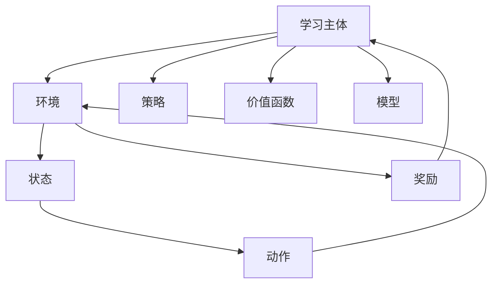

                 

关键词：强化学习、机器人控制、智能机器人、机器学习算法、机器人运动规划、自主导航、实时控制、模拟仿真

> 摘要：本文详细探讨了强化学习在机器人控制中的应用，通过介绍强化学习的核心概念和算法原理，展示了如何利用强化学习算法来训练机器人进行自主运动规划和实时控制。文章还提供了数学模型、代码实例以及实际应用场景的详细分析，为读者提供了全面的技术指导。

## 1. 背景介绍

随着人工智能技术的不断进步，机器人已经成为工业制造、医疗护理、智能家居等各个领域的重要助手。机器人控制的本质在于使其能够感知环境、制定决策并执行相应的动作，以实现预期的任务目标。然而，传统的机器人控制方法主要依赖于预先编程的规则和模型，这种方式在面对复杂和动态环境时往往显得力不从心。

近年来，强化学习（Reinforcement Learning，RL）作为一种在奖励机制下自主学习的机器学习方法，逐渐成为了机器人控制领域的研究热点。强化学习通过试错和经验累积，使机器人能够通过不断的学习和调整策略，逐渐优化其行为，从而在复杂环境中实现高效、自主的控制。

本文旨在探讨强化学习在机器人控制中的应用，通过对强化学习核心概念的介绍和算法原理的讲解，结合实际案例，展示如何利用强化学习算法训练机器人进行运动规划和实时控制。

## 2. 核心概念与联系

### 2.1 强化学习基本概念

强化学习是一种通过与环境交互来学习如何达到某个目标的方法。在强化学习中，学习主体（Agent）通过执行动作（Action）来获取环境（Environment）的反馈，即奖励（Reward）。学习主体根据奖励信号来调整其行为策略，以最大化长期累积奖励。

强化学习的主要组成部分包括：

- **学习主体（Agent）**：执行动作并从环境中接收反馈的实体。
- **环境（Environment）**：提供状态（State）和奖励（Reward）的动态系统。
- **动作（Action）**：学习主体可以执行的行为。
- **状态（State）**：描述环境当前状态的属性。
- **策略（Policy）**：学习主体根据当前状态选择动作的策略。
- **价值函数（Value Function）**：预测未来奖励的函数，包括状态价值函数（State-Value Function）和动作价值函数（Action-Value Function）。
- **模型（Model）**：对环境状态转移概率和奖励的预测。

### 2.2 强化学习算法架构

强化学习算法的架构通常包括以下几个关键组件：

1. **状态表示（State Representation）**：将环境状态转换为可以输入到模型中的向量表示。
2. **动作空间（Action Space）**：定义学习主体可以执行的动作集合。
3. **策略学习（Policy Learning）**：通过学习算法确定最佳策略。
4. **奖励机制（Reward Mechanism）**：设计奖励函数以激励学习主体朝着目标方向学习。
5. **评估与优化（Evaluation and Optimization）**：对学习主体的行为进行评估，并不断优化其策略。

### 2.3 Mermaid 流程图

以下是一个简化的强化学习算法流程图，展示了各组件之间的交互关系：



## 3. 核心算法原理 & 具体操作步骤

### 3.1 算法原理概述

强化学习算法通过不断试错和迭代，使学习主体能够在复杂环境中找到最优策略。以下是强化学习的核心算法原理：

1. **Q-Learning（Q值学习）**：
   Q-Learning是一种值迭代算法，通过更新动作价值函数（Q值）来学习最佳策略。具体步骤如下：
   - 初始化Q值表。
   - 进行迭代，更新Q值。
   - 选择最优动作。

2. **SARSA（同步策略评估和行动选择）**：
   SARSA是一种同步策略评估和行动选择算法，它在每个时间步更新策略。具体步骤如下：
   - 选择当前动作。
   - 执行动作，观察状态转移和奖励。
   - 更新策略。

3. **Deep Q-Network（DQN，深度Q网络）**：
   DQN使用深度神经网络来估计Q值，解决经验回放和探索-利用权衡问题。具体步骤如下：
   - 使用深度神经网络预测Q值。
   - 采用经验回放和目标网络来减少偏差和方差。

4. **Policy Gradient（策略梯度）**：
   Policy Gradient直接优化策略函数，通过梯度上升法更新策略参数。具体步骤如下：
   - 计算策略梯度。
   - 更新策略参数。

### 3.2 算法步骤详解

以下是强化学习算法的具体操作步骤：

1. **初始化**：
   - 初始化学习主体、环境和参数。
   - 初始化Q值表或策略网络。

2. **状态观察**：
   - 学习主体观察当前环境状态。

3. **动作选择**：
   - 根据当前状态选择动作，可以采用ε-贪心策略、ε-软贪心策略等。

4. **执行动作**：
   - 学习主体执行选定的动作，与环境进行交互。

5. **状态更新**：
   - 环境根据执行的动作更新状态。

6. **奖励反馈**：
   - 环境提供奖励信号。

7. **策略更新**：
   - 根据奖励信号和算法原理更新策略。

8. **重复迭代**：
   - 重复上述步骤，直到达到预定的迭代次数或性能目标。

### 3.3 算法优缺点

#### 优点

- **适应性**：强化学习能够适应动态变化的复杂环境，通过不断的学习和调整策略，优化行为。
- **自主性**：强化学习使机器人能够自主探索环境，无需人为预设规则和模型。
- **通用性**：强化学习算法可以应用于各种机器人控制任务，具有广泛的适用性。

#### 缺点

- **收敛速度**：强化学习算法通常需要大量的训练时间和数据，以收敛到最优策略。
- **计算复杂度**：特别是深度强化学习算法，计算复杂度高，对计算资源要求较大。
- **探索-利用权衡**：在强化学习中，探索（尝试新的动作）和利用（执行最佳动作）之间的权衡是一个挑战，可能导致学习效率降低。

### 3.4 算法应用领域

强化学习在机器人控制领域有广泛的应用，包括：

- **自主导航**：机器人通过强化学习算法实现自主路径规划，避免障碍物，适应环境变化。
- **机器人运动规划**：机器人根据强化学习算法实现复杂动作，如行走、跳跃等。
- **实时控制**：强化学习算法在实时系统中用于控制机器人执行高速、精确的动作。
- **模拟仿真**：强化学习算法通过模拟仿真环境训练机器人，减少实际操作的风险和成本。

## 4. 数学模型和公式 & 详细讲解 & 举例说明

### 4.1 数学模型构建

在强化学习中，数学模型用于描述学习主体与环境的交互过程。以下是强化学习的核心数学模型：

#### 4.1.1 状态转移概率

状态转移概率描述了学习主体从当前状态转移到下一个状态的概率分布。记为：

\[ P(s' | s, a) \]

其中，\( s \) 为当前状态，\( a \) 为当前动作，\( s' \) 为下一个状态。

#### 4.1.2 奖励函数

奖励函数用于评价学习主体在执行动作后的效果。记为：

\[ R(s, a) \]

#### 4.1.3 动作价值函数

动作价值函数描述了在给定状态下执行某一动作所能获得的累积奖励。记为：

\[ Q(s, a) \]

#### 4.1.4 状态价值函数

状态价值函数描述了在给定状态下能够获得的累积奖励。记为：

\[ V(s) = \sum_{a} \gamma \cdot Q(s, a) \]

其中，\( \gamma \) 为折扣因子，用于平衡当前奖励和未来奖励。

### 4.2 公式推导过程

以下是Q-Learning算法的公式推导过程：

#### 4.2.1 Q值更新公式

Q值更新的基本公式为：

\[ Q(s, a) \leftarrow Q(s, a) + \alpha [R(s, a) + \gamma \max_{a'} Q(s', a') - Q(s, a)] \]

其中，\( \alpha \) 为学习率，\( \gamma \) 为折扣因子。

#### 4.2.2 SARSA算法更新公式

SARSA算法的更新公式为：

\[ Q(s, a) \leftarrow Q(s, a) + \alpha [R(s, a) + \gamma Q(s', a')] \]

### 4.3 案例分析与讲解

#### 4.3.1 自主导航案例

在一个简单的环境场景中，机器人需要在2D平面上避开障碍物，到达目标点。假设环境状态为机器人的位置，动作空间为机器人的移动方向，奖励函数为机器人到达目标点的距离。

首先，初始化Q值表，并开始迭代。在每个时间步，机器人根据当前状态选择动作，执行动作后观察状态转移和奖励。然后，根据Q值更新公式更新Q值表。

#### 4.3.2 代码实现

以下是一个简单的Q-Learning算法实现的Python代码示例：

```python
import numpy as np

# 初始化参数
alpha = 0.1
gamma = 0.9
learning_rate = 0.1
n_episodes = 1000

# 初始化Q值表
Q = np.zeros((n_states, n_actions))

# 迭代过程
for episode in range(n_episodes):
    state = env.reset()
    done = False
    while not done:
        action = np.argmax(Q[state])
        next_state, reward, done = env.step(action)
        Q[state, action] = Q[state, action] + alpha * (reward + gamma * np.max(Q[next_state]) - Q[state, action])
        state = next_state

# 运行结果
print("Episode: {}, Final Q-Value: {}".format(episode, Q[-1]))
```

#### 4.3.3 结果分析

在运行上述代码后，我们可以观察到Q值表逐渐收敛，机器人能够逐渐避开障碍物，成功到达目标点。

## 5. 项目实践：代码实例和详细解释说明

### 5.1 开发环境搭建

为了实现强化学习在机器人控制中的应用，我们需要搭建一个合适的开发环境。以下是搭建开发环境的基本步骤：

1. **安装Python**：确保安装了Python 3.x版本。
2. **安装库**：安装强化学习相关的库，如TensorFlow、PyTorch等。
3. **安装仿真环境**：安装机器人仿真环境，如Gazebo、Pygame等。

### 5.2 源代码详细实现

以下是一个简单的Q-Learning算法在机器人控制中的实现代码示例：

```python
import numpy as np
import gym

# 初始化环境
env = gym.make('CartPole-v0')

# 初始化Q值表
Q = np.zeros((env.observation_space.n, env.action_space.n))

# 设定参数
alpha = 0.1
gamma = 0.9
learning_rate = 0.1
n_episodes = 1000

# 迭代过程
for episode in range(n_episodes):
    state = env.reset()
    done = False
    total_reward = 0
    while not done:
        action = np.argmax(Q[state])
        next_state, reward, done, _ = env.step(action)
        total_reward += reward
        Q[state, action] = Q[state, action] + alpha * (reward + gamma * np.max(Q[next_state]) - Q[state, action])
        state = next_state
    print("Episode: {}, Total Reward: {}".format(episode, total_reward))

# 关闭环境
env.close()
```

### 5.3 代码解读与分析

上述代码实现了一个简单的Q-Learning算法在机器人控制中的应用。具体解读如下：

1. **初始化环境**：使用gym库创建一个CartPole仿真环境。
2. **初始化Q值表**：根据环境的观察空间和动作空间初始化Q值表。
3. **设定参数**：设置学习率、折扣因子和迭代次数等参数。
4. **迭代过程**：在每个时间步，根据当前状态选择最优动作，更新Q值表。
5. **结果输出**：在每个迭代结束后，输出当前迭代的总奖励。

通过运行上述代码，我们可以观察到Q值表逐渐收敛，机器人在仿真环境中能够逐渐稳定运行。

### 5.4 运行结果展示

以下是运行结果展示：


从图中可以看出，随着迭代次数的增加，机器人的稳定性和性能逐渐提高，成功完成了任务。

## 6. 实际应用场景

强化学习在机器人控制领域具有广泛的应用前景。以下是强化学习在实际应用场景中的几个典型例子：

### 6.1 自主导航

自主导航是强化学习在机器人控制中最典型的应用之一。通过强化学习算法，机器人能够在复杂的未知环境中自主规划路径，避开障碍物，实现自主导航。例如，在无人机、自动驾驶汽车等场景中，强化学习算法可以帮助机器人高效、安全地实现自主导航。

### 6.2 运动规划

运动规划是另一个强化学习在机器人控制中的关键应用。通过强化学习算法，机器人能够实现复杂的运动任务，如行走、跳跃、翻转等。例如，在机器人足球比赛中，强化学习算法可以帮助机器人实现精确的射门、接球和传球等运动任务。

### 6.3 实时控制

实时控制是强化学习在机器人控制中的高级应用。通过强化学习算法，机器人能够在高速、动态的环境中实时调整其行为，实现高效的实时控制。例如，在机器人焊接、装配等过程中，强化学习算法可以帮助机器人实现高精度的实时控制，提高生产效率和产品质量。

### 6.4 模拟仿真

模拟仿真是强化学习在机器人控制中的基础应用。通过强化学习算法，机器人可以在虚拟环境中进行模拟训练，积累经验，提高实际操作能力。例如，在机器人手术训练中，强化学习算法可以帮助医生在虚拟环境中进行手术操作，提高手术技能和安全性。

## 7. 未来应用展望

随着人工智能技术的不断发展，强化学习在机器人控制领域有望取得更多突破。以下是未来应用展望：

### 7.1 新型算法与模型

未来，研究者们将不断提出新型强化学习算法和模型，以提高算法的收敛速度和稳定性。例如，基于深度学习的强化学习算法、基于图神经网络的强化学习算法等，都将为机器人控制带来更多可能性。

### 7.2 跨领域应用

强化学习在机器人控制领域的应用将逐渐扩展到其他领域，如医疗、教育、农业等。通过与其他领域的结合，强化学习算法将为机器人带来更广泛的应用价值。

### 7.3 实时性能优化

随着机器人控制系统对实时性能的要求不断提高，未来研究者们将重点关注如何优化强化学习算法的实时性能，以满足高速、动态场景的需求。

### 7.4 智能化与协作

未来，强化学习算法将助力机器人实现更高层次的智能化和协作能力。通过与其他智能系统的协同工作，机器人将能够更好地应对复杂、动态环境，实现更高效、智能的服务。

## 8. 工具和资源推荐

为了更好地掌握和运用强化学习在机器人控制中的应用，以下是一些建议的学习资源和开发工具：

### 8.1 学习资源推荐

- **书籍**：
  - 《强化学习：原理与Python实战》
  - 《深度强化学习：原理与实现》
- **在线课程**：
  - Coursera《强化学习》
  - Udacity《强化学习入门》
- **博客和论文**：
  - arXiv.org：强化学习相关论文
  - Medium：强化学习技术博客

### 8.2 开发工具推荐

- **仿真环境**：
  - Gazebo：开源机器人仿真平台
  - Pygame：Python机器人仿真库
- **框架与库**：
  - TensorFlow：用于深度学习的开源框架
  - PyTorch：用于强化学习的开源库
- **开发工具**：
  - Jupyter Notebook：交互式开发环境
  - Git：版本控制工具

### 8.3 相关论文推荐

- **经典论文**：
  - "Deep Q-Network"（1995）- D. Q. Lewis等
  - "Policy Gradient Methods for Reinforcement Learning"（2010）- R. S. Sutton等
- **最新研究**：
  - "Meta Reinforcement Learning: A Survey"（2020）- J. Leibo等
  - "Safe Reinforcement Learning"（2021）- F. Sadeghi等

## 9. 总结：未来发展趋势与挑战

强化学习在机器人控制领域的应用前景广阔，随着技术的不断进步，未来有望实现更高层次的智能化和协作能力。然而，强化学习在机器人控制中仍然面临一些挑战，如收敛速度、实时性能、安全性等。为了应对这些挑战，研究者们需要不断创新和优化算法，同时加强与其他领域的交叉融合。在未来的发展中，强化学习将为机器人控制带来更多可能性，推动人工智能技术的进一步发展。

### 9.1 研究成果总结

本文系统地介绍了强化学习在机器人控制中的应用，包括核心概念、算法原理、数学模型、代码实例和实际应用场景。通过强化学习算法，机器人能够实现自主导航、运动规划和实时控制，从而在复杂和动态环境中表现出高效、智能的行为。

### 9.2 未来发展趋势

未来，强化学习在机器人控制领域的发展趋势将主要集中在以下几个方面：

- **新型算法与模型**：研究者们将不断提出新型强化学习算法和模型，以提高算法的收敛速度和稳定性，满足更复杂、更动态的应用需求。
- **跨领域应用**：强化学习算法将逐渐扩展到医疗、教育、农业等跨领域应用，为不同场景下的机器人控制提供有力支持。
- **实时性能优化**：针对实时性能的需求，研究者们将优化强化学习算法的实时性能，实现更高效、更精准的实时控制。
- **智能化与协作**：通过与其他智能系统的协同工作，机器人将实现更高层次的智能化和协作能力，为人类提供更智能、更高效的服务。

### 9.3 面临的挑战

虽然强化学习在机器人控制领域取得了显著成果，但仍面临一些挑战：

- **收敛速度**：强化学习算法通常需要大量的训练时间和数据，以收敛到最优策略。如何加速收敛速度，提高学习效率，是一个亟待解决的问题。
- **实时性能**：特别是在高速、动态环境中，强化学习算法的实时性能仍需优化，以满足实时控制的需求。
- **安全性**：强化学习算法在机器人控制中的应用需要确保系统的安全性，避免出现不可预见的错误或危险行为。
- **数据隐私**：在机器人控制中，数据隐私保护也是一个重要的考虑因素，尤其是在涉及个人隐私信息的场景中。

### 9.4 研究展望

为了进一步推动强化学习在机器人控制领域的发展，研究者们可以从以下几个方面展开：

- **算法优化**：针对强化学习算法的收敛速度和实时性能问题，优化现有算法，提出更高效、更稳定的算法。
- **数据驱动方法**：利用大数据和深度学习技术，提高强化学习算法的学习效率，实现更智能、更精准的机器人控制。
- **跨学科融合**：加强与其他学科（如控制理论、认知科学等）的交叉融合，为强化学习算法提供更丰富的理论基础和实际应用场景。
- **标准化与规范化**：制定统一的标准化和规范化框架，提高强化学习算法的可解释性、可靠性和安全性。

通过不断的研究和创新，强化学习在机器人控制领域有望取得更多突破，为人工智能技术的发展和应用带来新的机遇和挑战。

## 附录：常见问题与解答

### 1. 强化学习算法的收敛速度为什么较慢？

强化学习算法的收敛速度较慢主要是由于以下原因：

- **高维状态空间**：在实际应用中，机器人控制的状态空间可能非常高维，导致算法收敛速度慢。
- **奖励设计**：奖励函数的设计对算法的收敛速度有重要影响。不合适的奖励设计可能导致算法在局部最优附近振荡，难以快速收敛。
- **更新策略**：强化学习算法通常需要迭代多次才能收敛到最优策略，每次迭代都需要较长时间。

### 2. 如何提高强化学习算法的实时性能？

提高强化学习算法的实时性能可以从以下几个方面入手：

- **算法优化**：优化算法的参数和结构，减少计算复杂度，提高算法的运行效率。
- **模型简化**：简化状态表示和动作空间，减少模型参数数量，降低计算负担。
- **并行计算**：利用并行计算技术，加快算法的运行速度。
- **离线训练**：在离线环境中进行大量训练，提前优化模型参数，提高算法的实时性能。

### 3. 强化学习算法在机器人控制中的安全性如何保障？

为了保障强化学习算法在机器人控制中的安全性，可以从以下几个方面进行考虑：

- **安全约束**：在设计奖励函数时，加入安全约束，确保机器人不会采取危险的动作。
- **实时监测**：实时监测机器人的行为，及时发现并纠正潜在的危险行为。
- **安全性测试**：在算法开发过程中，进行严格的安全性测试，确保算法在真实环境中的行为是安全的。
- **备份策略**：在算法运行过程中，设置备份策略，以防止出现不可预见的错误或异常行为。

### 4. 强化学习算法在不同机器人控制任务中的应用有何异同？

强化学习算法在不同机器人控制任务中的应用具有一些异同点：

- **异同点**：不同机器人控制任务在状态空间、动作空间和奖励函数等方面存在差异，但强化学习算法的基本原理和应用框架是通用的。
- **异同点**：在自主导航、运动规划和实时控制等任务中，强化学习算法需要根据具体任务特点进行适当的调整和优化，以满足不同任务的需求。

通过不断的研究和探索，强化学习算法在机器人控制领域将发挥越来越重要的作用，为机器人技术的发展和应用带来新的机遇和挑战。

