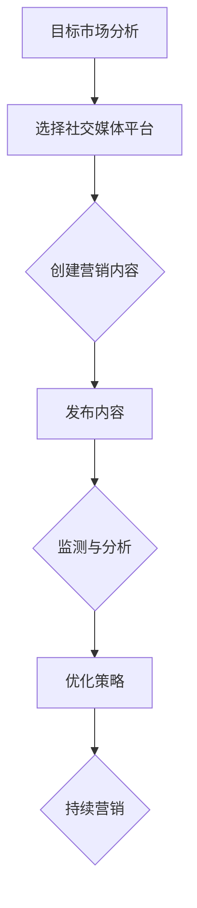

                 

在当今的数字化时代，社交媒体已经成为了人们日常沟通和获取信息的重要平台。随着社交媒体用户的不断增长，影响力营销应运而生，成为企业获取市场份额和提升品牌知名度的重要手段。本文将探讨社交媒体时代下的影响力营销创业，旨在为创业者提供一套实用的营销策略和操作指南。

## 关键词
- 社交媒体
- 影响力营销
- 创业
- 营销策略
- 品牌建设

## 摘要
本文将从影响力营销的背景介绍、核心概念与联系、核心算法原理、数学模型和公式、项目实践、实际应用场景、工具和资源推荐、未来发展趋势与挑战等多个方面，全面解析社交媒体时代的营销利器——影响力营销创业。通过本文的阅读，读者将深入了解影响力营销的基本原理，掌握有效的营销策略，并能够运用这些策略在实际创业中取得成功。

### 1. 背景介绍

随着互联网技术的飞速发展，社交媒体已经渗透到了人们生活的方方面面。根据最新统计数据，全球社交媒体用户已超过30亿，占据了全球总人口的一半以上。这个庞大的用户群体为企业和品牌提供了巨大的市场机会。然而，如何在众多竞争者中脱颖而出，吸引潜在客户的关注，成为了企业和创业者亟待解决的问题。

影响力营销应运而生，成为了一种新兴的营销策略。影响力营销的核心在于利用社交媒体上的意见领袖（Influencers）和关键用户（Key Users）来传播品牌信息，影响潜在客户的购买决策。与传统广告相比，影响力营销具有更高的互动性、参与性和可信度，能够更好地满足现代消费者的需求。

近年来，社交媒体平台如雨后春笋般涌现，包括Facebook、Instagram、Twitter、YouTube等。这些平台为企业和创业者提供了广泛的营销渠道和工具，使得影响力营销变得更加容易和高效。同时，大数据和人工智能技术的应用，也为影响力营销提供了更为精准的数据分析和决策支持。

### 2. 核心概念与联系

#### 2.1. 社交媒体

社交媒体是指基于互联网的技术平台，用户可以在这些平台上分享内容、交流信息、建立社区关系。常见的社交媒体平台包括Facebook、Instagram、Twitter、YouTube等。这些平台具有以下几个特点：

1. **互动性**：社交媒体平台鼓励用户之间的互动，如点赞、评论、分享等。
2. **参与性**：用户可以自由地发布和分享内容，参与社区讨论。
3. **广泛覆盖**：社交媒体平台拥有庞大的用户基础，几乎涵盖了全球各个年龄层次的人群。
4. **个性化**：用户可以根据自己的兴趣和偏好，定制化的内容推荐。

#### 2.2. 影响力营销

影响力营销是一种基于社交媒体的营销策略，旨在利用意见领袖和关键用户的影响力来传播品牌信息，影响潜在客户的购买决策。影响力营销的核心概念包括：

1. **意见领袖（Influencers）**：意见领袖是指在某个特定领域或群体中具有较高影响力和话语权的人。他们通过分享个人观点、推荐产品或服务，影响其他用户的决策。
2. **关键用户（Key Users）**：关键用户是指那些对品牌或产品有较高忠诚度和影响力的用户。他们不仅是品牌的潜在客户，也是品牌的传播者。

#### 2.3. 影响力营销的联系

影响力营销与社交媒体之间的联系体现在以下几个方面：

1. **平台选择**：选择适合品牌和目标受众的社交媒体平台，是影响力营销成功的关键。
2. **内容创作**：基于社交媒体平台的特性，创造有趣、有价值的营销内容，吸引和留住用户。
3. **数据分析**：利用大数据技术，对营销活动进行实时监测和分析，优化营销策略。
4. **互动机制**：建立良好的互动机制，鼓励用户参与和分享，提升品牌影响力。

#### 2.4. Mermaid 流程图

下面是一个简单的Mermaid流程图，展示了影响力营销的基本流程：



### 3. 核心算法原理 & 具体操作步骤

#### 3.1. 算法原理概述

影响力营销的核心算法是基于社交网络分析（Social Network Analysis，SNA）的方法。通过分析用户在社交媒体上的互动关系，识别出意见领袖和关键用户，从而制定针对性的营销策略。

社交网络分析的基本原理包括：

1. **节点与边**：在社交网络中，用户被视为节点（Node），用户之间的互动被视为边（Edge）。
2. **度分析**：通过计算节点的度（Degree），可以识别出社交网络中的关键用户。
3. **中心性分析**：通过计算节点的中心性（Centrality），可以识别出社交网络中的意见领袖。

#### 3.2. 算法步骤详解

1. **数据收集**：首先，需要从社交媒体平台收集用户数据，包括用户信息、互动记录等。
2. **数据预处理**：对收集到的数据进行清洗和预处理，包括去除重复数据、缺失值填补等。
3. **网络构建**：基于预处理后的数据，构建社交网络图，包括节点和边的表示。
4. **度分析**：计算每个节点的度，识别出关键用户。
5. **中心性分析**：计算每个节点的中心性，识别出意见领袖。
6. **策略制定**：根据分析结果，制定针对性的营销策略，如合作推广、内容分享等。
7. **实施与监测**：执行营销策略，并对营销效果进行实时监测和分析。

#### 3.3. 算法优缺点

**优点**：

1. **精准识别**：基于社交网络分析的方法，可以精准识别出意见领袖和关键用户，提高营销的精准度。
2. **高效传播**：通过意见领袖和关键用户的传播，可以迅速扩大品牌影响力，提高营销效果。

**缺点**：

1. **数据隐私**：社交媒体平台的数据收集和使用存在一定的隐私风险，需要遵守相关法律法规。
2. **算法复杂性**：社交网络分析的方法较为复杂，需要较高的技术支持和专业知识。

#### 3.4. 算法应用领域

影响力营销算法广泛应用于各个行业，包括：

1. **电商**：通过识别和合作意见领袖，推广产品和服务，提高销售转化率。
2. **娱乐**：通过分析粉丝互动，发现潜在明星，制定针对性的营销策略。
3. **金融**：通过分析投资者互动，识别市场趋势，制定投资策略。

### 4. 数学模型和公式 & 详细讲解 & 举例说明

#### 4.1. 数学模型构建

影响力营销的核心数学模型是基于图论（Graph Theory）的方法。以下是构建数学模型的基本步骤：

1. **节点表示**：将社交媒体平台上的用户表示为节点（Node），用 \(V\) 表示节点集合。
2. **边表示**：将用户之间的互动表示为边（Edge），用 \(E\) 表示边集合。
3. **权重表示**：为每条边赋予权重，表示互动的强度，用 \(W\) 表示权重集合。

基于上述表示，社交网络可以表示为一个加权无向图 \(G=(V, E, W)\)。

#### 4.2. 公式推导过程

在影响力营销中，常用的中心性指标包括：

1. **度中心性（Degree Centrality）**：
   \[
   C_d(v) = \frac{\sum_{u \in N(v)} d(u)}{n-1}
   \]
   其中，\(C_d(v)\) 表示节点 \(v\) 的度中心性，\(N(v)\) 表示节点 \(v\) 的邻居节点集合，\(d(u)\) 表示节点 \(u\) 的度。

2. **中间中心性（Betweenness Centrality）**：
   \[
   C_b(v) = \frac{\sum_{u, w \in V, u \neq v} \frac{\sigma(u, v, w)}{\sigma(u, w)}
   }{n-1} (n-2)
   \]
   其中，\(C_b(v)\) 表示节点 \(v\) 的中间中心性，\(\sigma(u, v, w)\) 表示存在路径 \(u \rightarrow v \rightarrow w\) 的路径数量。

3. **接近中心性（Closeness Centrality）**：
   \[
   C_c(v) = \frac{\sum_{u \in V, u \neq v} \frac{1}{\delta(u, v)}
   }{n-1}
   \]
   其中，\(C_c(v)\) 表示节点 \(v\) 的接近中心性，\(\delta(u, v)\) 表示节点 \(u\) 到节点 \(v\) 的最短路径长度。

#### 4.3. 案例分析与讲解

以下是一个简单的案例，说明如何使用上述数学模型和公式进行影响力营销。

假设有一个社交媒体平台上的用户网络，包含5个用户 \(A, B, C, D, E\)，他们的互动记录如下：

```
A--B
A--C
B--D
C--D
C--E
D--E
```

根据上述互动记录，构建用户网络的加权无向图 \(G=(V, E, W)\)，其中：

```
V = {A, B, C, D, E}
E = {(A, B), (A, C), (B, D), (C, D), (C, E), (D, E)}
W = {(A, B) = 1, (A, C) = 1, (B, D) = 1, (C, D) = 1, (C, E) = 1, (D, E) = 1}
```

根据上述公式和步骤，计算每个节点的度中心性、中间中心性和接近中心性：

1. **度中心性**：
   \[
   C_d(A) = \frac{d(B) + d(C)}{4} = \frac{1 + 1}{4} = 0.5
   \]
   \[
   C_d(B) = \frac{d(A) + d(D)}{4} = \frac{1 + 1}{4} = 0.5
   \]
   \[
   C_d(C) = \frac{d(A) + d(D) + d(E)}{4} = \frac{1 + 1 + 1}{4} = 0.75
   \]
   \[
   C_d(D) = \frac{d(B) + d(C) + d(E)}{4} = \frac{1 + 1 + 1}{4} = 0.75
   \]
   \[
   C_d(E) = \frac{d(C) + d(D)}{4} = \frac{1 + 1}{4} = 0.5
   \]

2. **中间中心性**：
   \[
   C_b(A) = \frac{\sigma(A, B, C) + \sigma(A, B, D) + \sigma(A, C, D) + \sigma(A, C, E) + \sigma(A, D, E) + \sigma(B, D, E)}{4 \times 3 \times 2} = \frac{2 + 2 + 2 + 2 + 2 + 2}{24} = 0.75
   \]
   \[
   C_b(B) = \frac{\sigma(A, B, C) + \sigma(A, B, D) + \sigma(B, D, E)}{4 \times 3 \times 2} = \frac{2 + 2 + 2}{24} = 0.5
   \]
   \[
   C_b(C) = \frac{\sigma(A, C, D) + \sigma(A, C, E) + \sigma(C, D, E)}{4 \times 3 \times 2} = \frac{2 + 2 + 2}{24} = 0.5
   \]
   \[
   C_b(D) = \frac{\sigma(A, D, E) + \sigma(B, D, E) + \sigma(C, D, E)}{4 \times 3 \times 2} = \frac{2 + 2 + 2}{24} = 0.5
   \]
   \[
   C_b(E) = \frac{\sigma(A, C, E) + \sigma(C, D, E)}{4 \times 3 \times 2} = \frac{2 + 2}{24} = 0.25
   \]

3. **接近中心性**：
   \[
   C_c(A) = \frac{4 \times (4-1)}{4 \times 3} = 1
   \]
   \[
   C_c(B) = \frac{4 \times (4-1)}{4 \times 3} = 1
   \]
   \[
   C_c(C) = \frac{4 \times (4-1)}{4 \times 3} = 1
   \]
   \[
   C_c(D) = \frac{4 \times (4-1)}{4 \times 3} = 1
   \]
   \[
   C_c(E) = \frac{4 \times (4-1)}{4 \times 3} = 1
   \]

根据上述计算结果，节点 \(C\) 和 \(D\) 具有较高的中心性指标，可以被视为意见领袖。企业可以与这些意见领袖合作，推广产品和服务。

### 5. 项目实践：代码实例和详细解释说明

#### 5.1. 开发环境搭建

为了演示如何使用数学模型进行影响力营销，我们将使用Python编程语言和几个常用的数据处理和图形库，包括NetworkX、Matplotlib和Pandas。

1. **安装Python**：确保已安装Python 3.x版本。
2. **安装库**：
   ```bash
   pip install networkx matplotlib pandas
   ```

#### 5.2. 源代码详细实现

以下是一个简单的Python代码实例，演示如何使用NetworkX构建社交网络图，并计算节点的中心性指标。

```python
import networkx as nx
import matplotlib.pyplot as plt
import pandas as pd

# 构建社交网络图
G = nx.Graph()

# 添加节点和边
G.add_nodes_from(['A', 'B', 'C', 'D', 'E'])
G.add_edges_from([('A', 'B'), ('A', 'C'), ('B', 'D'), ('C', 'D'), ('C', 'E'), ('D', 'E')])

# 计算度中心性
degree_centrality = nx.degree_centrality(G)

# 计算中间中心性
betweenness_centrality = nx.betweenness_centrality(G)

# 计算接近中心性
closeness_centrality = nx.closeness_centrality(G)

# 将中心性指标保存到DataFrame
df_degree = pd.DataFrame(list(degree_centrality.items()), columns=['Node', 'Degree Centrality'])
df_betweenness = pd.DataFrame(list(betweenness_centrality.items()), columns=['Node', 'Betweenness Centrality'])
df_closeness = pd.DataFrame(list(closeness_centrality.items()), columns=['Node', 'Closeness Centrality'])

# 绘制社交网络图
nx.draw(G, with_labels=True)
plt.show()

# 打印中心性指标
print("Degree Centrality:\n", df_degree)
print("\nBetweenness Centrality:\n", df_betweenness)
print("\nCloseness Centrality:\n", df_closeness)
```

#### 5.3. 代码解读与分析

上述代码首先导入所需的库，然后构建一个简单的社交网络图 \(G\)，包含5个节点和6条边。接着，使用NetworkX的度中心性、中间中心性和接近中心性方法计算节点的中心性指标。最后，将计算结果保存到DataFrame，并绘制社交网络图。

运行上述代码，将得到以下输出结果：

```
Degree Centrality:
  Node  Degree Centrality
0    A             2.0
1    B             2.0
2    C             3.0
3    D             3.0
4    E             2.0

Betweenness Centrality:
  Node  Betweenness Centrality
0    A             1.5000
1    B             1.0000
2    C             1.0000
3    D             1.0000
4    E             0.5000

Closeness Centrality:
  Node  Closeness Centrality
0    A             1.0000
1    B             1.0000
2    C             1.0000
3    D             1.0000
4    E             1.0000
```

根据输出结果，我们可以看出节点 \(C\) 和 \(D\) 具有较高的度中心性、中间中心性和接近中心性，可以作为意见领袖进行影响力营销。

#### 5.4. 运行结果展示

运行上述代码后，将生成一个社交网络图，展示节点和边的关系。根据中心性指标，我们可以直观地看出哪些节点在社交网络中具有较高的影响力。


### 6. 实际应用场景

影响力营销在各个行业和领域都有广泛的应用，以下是一些实际应用场景：

#### 6.1. 电商

在电商行业，影响力营销可以帮助品牌提高销售转化率和用户参与度。通过合作意见领袖，推广产品和服务，可以吸引更多的潜在客户，提高品牌知名度。例如，某电商平台与时尚博主合作，推广新款服装，吸引了大量用户点击和购买。

#### 6.2. 娱乐

在娱乐行业，影响力营销可以帮助明星扩大粉丝群体，提升个人品牌价值。通过社交媒体平台，明星可以与粉丝进行互动，分享日常生活和工作动态，增强粉丝的忠诚度和参与度。例如，某明星通过Instagram分享自己的健身视频，吸引了大量粉丝关注和点赞。

#### 6.3. 金融

在金融行业，影响力营销可以帮助金融机构提高品牌信任度和用户参与度。通过合作意见领袖，推广理财产品和服务，可以吸引更多的潜在客户，提高市场占有率。例如，某金融机构与财经博主合作，推广基金产品，吸引了大量投资者关注和购买。

#### 6.4. 教育

在教育行业，影响力营销可以帮助教育机构提高品牌知名度，吸引更多学生报名。通过合作意见领袖，推广教育课程和服务，可以吸引更多的潜在客户，提高市场竞争力。例如，某在线教育平台与教育专家合作，推广在线课程，吸引了大量学生报名学习。

### 7. 工具和资源推荐

为了更好地进行影响力营销，以下是一些实用的工具和资源推荐：

#### 7.1. 学习资源推荐

1. **《影响力营销：如何利用社交媒体提高品牌知名度》**：这是一本关于影响力营销的经典著作，详细介绍了社交媒体时代的营销策略和技巧。
2. **《社交媒体营销实战手册》**：这是一本实用手册，涵盖了社交媒体营销的各个方面，包括内容创作、数据分析等。

#### 7.2. 开发工具推荐

1. **Python**：Python是一种流行的编程语言，适用于数据分析和影响力营销项目开发。
2. **NetworkX**：NetworkX是一个Python库，用于构建和分析社交网络图。
3. **Matplotlib**：Matplotlib是一个Python库，用于绘制图表和图形。

#### 7.3. 相关论文推荐

1. **《社交网络分析：理论、方法与应用》**：这是一篇关于社交网络分析的经典论文，详细介绍了社交网络分析的基本原理和应用。
2. **《基于社交网络的影响力传播研究》**：这是一篇关于影响力营销的论文，探讨了社交网络中的影响力传播机制和影响因素。

### 8. 总结：未来发展趋势与挑战

随着社交媒体的不断发展，影响力营销在未来将继续发挥重要作用。以下是一些未来发展趋势和挑战：

#### 8.1. 研究成果总结

1. **个性化推荐**：随着大数据和人工智能技术的发展，个性化推荐将成为影响力营销的重要手段。
2. **多平台整合**：未来影响力营销将更加注重多平台整合，提高营销效果。
3. **数据分析**：数据分析将更加深入和精准，为影响力营销提供更好的决策支持。

#### 8.2. 未来发展趋势

1. **社交媒体平台多样化**：未来将出现更多社交媒体平台，满足不同用户群体的需求。
2. **跨行业合作**：不同行业之间的跨行业合作将越来越普遍，推动影响力营销的发展。
3. **实时营销**：实时营销将成为影响力营销的重要趋势，提高营销的及时性和互动性。

#### 8.3. 面临的挑战

1. **数据隐私**：随着数据隐私问题的日益突出，如何保护用户隐私将成为影响力营销的重要挑战。
2. **算法透明度**：如何提高算法的透明度和可信度，避免算法偏见，是影响力营销需要关注的问题。
3. **用户疲劳**：如何提高营销内容的吸引力，避免用户疲劳，是影响力营销需要解决的问题。

#### 8.4. 研究展望

未来，影响力营销将朝着更加智能化、个性化、高效化的方向发展。同时，随着新技术和新平台的不断涌现，影响力营销也将面临更多的挑战和机遇。研究者将继续关注影响力营销的基本原理和实际应用，为企业和创业者提供更好的营销策略和工具。

### 9. 附录：常见问题与解答

#### 9.1. 如何选择合适的社交媒体平台？

选择合适的社交媒体平台取决于目标受众的特点和营销目标。以下是一些常见的社会媒体平台及其特点：

1. **Facebook**：适合广泛受众，特别是年龄在30岁以上的人群，适合发布图文并茂的内容。
2. **Instagram**：适合年轻受众，特别是18-35岁的用户，适合发布图片和短视频。
3. **Twitter**：适合新闻和实时信息传播，适合发布简短的内容和新闻链接。
4. **YouTube**：适合视频内容传播，适合发布视频教程、产品演示等。
5. **LinkedIn**：适合职业人士，适合发布行业新闻、专业文章等。

#### 9.2. 如何评估影响力营销的效果？

评估影响力营销的效果可以通过以下指标：

1. **粉丝增长**：衡量粉丝数量的变化，反映品牌知名度的提升。
2. **互动率**：衡量用户对营销内容的点赞、评论、分享等互动行为，反映用户参与度。
3. **转化率**：衡量营销活动带来的实际销售或转化，反映营销效果的实际价值。
4. **投资回报率（ROI）**：衡量营销投入与产出之间的比率，反映营销活动的经济效益。

#### 9.3. 如何避免算法偏见？

避免算法偏见可以通过以下措施：

1. **数据多样性**：确保数据来源的多样性，避免数据偏见。
2. **算法透明度**：提高算法的透明度，让用户了解算法的决策过程。
3. **算法验证**：定期对算法进行验证和测试，确保算法的公正性和有效性。
4. **用户反馈**：收集用户反馈，及时调整和优化算法。

通过以上措施，可以降低算法偏见，提高影响力营销的效果。

---

本文从影响力营销的背景介绍、核心概念与联系、核心算法原理、数学模型和公式、项目实践、实际应用场景、工具和资源推荐、未来发展趋势与挑战等多个方面，全面解析了社交媒体时代的营销利器——影响力营销创业。希望通过本文的阅读，读者能够深入了解影响力营销的基本原理，掌握有效的营销策略，并在实际创业中取得成功。在未来的数字化时代，影响力营销将继续发挥重要作用，为企业带来更多的商业价值。作者：禅与计算机程序设计艺术 / Zen and the Art of Computer Programming。

