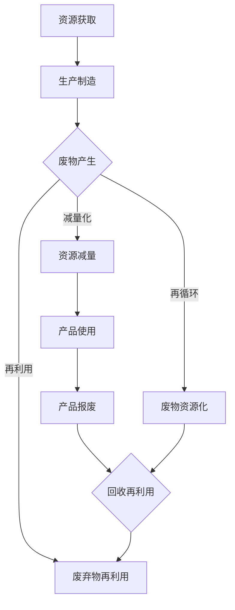

                 

关键词：循环经济、可持续发展、商业实践、环境保护、资源效率

> 摘要：本文深入探讨了循环经济创业的理念和商业实践，分析了其在可持续发展的商业领域中的应用。通过介绍循环经济的核心概念、商业模式的构建、技术支持及其在不同行业中的实践，本文旨在为创业者提供有价值的参考和启示。

## 1. 背景介绍

循环经济是一种以资源的高效利用和废物的最小化为核心理念的经济模式，与传统的线性经济模式（“取-制-弃”）形成鲜明对比。随着全球资源的日益紧张和环境问题的日益突出，循环经济作为一种可持续发展的经济模式，逐渐受到全球范围内企业和政府的高度关注。

近年来，循环经济理念在商业实践中得到了广泛应用，许多企业开始通过循环经济的模式来实现资源的有效利用和环境保护。例如，一些公司通过回收再利用废弃产品、优化生产流程、减少废物产生等方式，实现了经济效益和环境保护的双赢。同时，循环经济的商业实践也为创业者提供了新的机遇和挑战。

## 2. 核心概念与联系

### 2.1 循环经济的核心概念

循环经济以资源的高效利用和废物的最小化为核心，其基本特征可以概括为“3R”原则：减量化（Reduce）、再利用（Reuse）和再循环（Recycle）。减量化旨在减少资源的消耗和废物的产生；再利用则强调对废弃物品的修复、改造和再使用；再循环则是指将废物转化为可再利用的资源。

### 2.2 循环经济的联系

循环经济与可持续发展、环境保护和资源效率等概念密切相关。可持续发展要求在经济、社会和环境三者之间实现平衡，而循环经济通过资源的高效利用和废物的最小化，为实现这一目标提供了有效的路径。环境保护则关注于减少人类活动对自然环境的负面影响，循环经济通过减少废物产生和资源消耗，对环境保护起到了积极的推动作用。资源效率则强调资源的有效利用，循环经济通过优化生产流程和资源循环利用，显著提高了资源效率。

### 2.3 Mermaid 流程图

以下是一个简化的循环经济流程图，展示了循环经济的核心环节：



## 3. 核心算法原理 & 具体操作步骤

### 3.1 算法原理概述

循环经济创业的核心算法原理主要围绕资源效率、废物最小化和可持续发展展开。具体来说，算法包括以下几个步骤：

1. **资源分析**：对现有资源进行全面的评估和分析，确定资源的种类、数量和质量。
2. **流程优化**：通过对生产流程的优化，减少资源消耗和废物产生。
3. **废物处理**：采用再利用、再循环等技术，将废物转化为可再利用的资源。
4. **可持续发展评估**：对整个循环经济模式进行可持续发展评估，确保经济、社会和环境的协调发展。

### 3.2 算法步骤详解

1. **资源分析**：

   对现有资源进行分类和评估，确定资源的种类、数量和质量。这可以通过数据分析和现场考察等方式实现。资源分析的结果将作为后续流程优化和废物处理的重要依据。

2. **流程优化**：

   通过对生产流程的优化，减少资源消耗和废物产生。具体方法包括改进生产工艺、提高设备效率、优化物料配送等。流程优化的目标是在保证产品质量的前提下，最大限度地减少资源消耗和废物产生。

3. **废物处理**：

   采用再利用、再循环等技术，将废物转化为可再利用的资源。再利用技术包括修复、改造和再制造等，再循环技术则包括回收、分拣、再加工等。废物处理的目的是实现废物资源化，提高资源利用率。

4. **可持续发展评估**：

   对整个循环经济模式进行可持续发展评估，确保经济、社会和环境的协调发展。可持续发展评估可以从经济效益、社会效益和环境影响等多个维度进行，以确定循环经济模式的有效性和可持续性。

### 3.3 算法优缺点

**优点**：

1. 提高资源利用效率，减少资源浪费。
2. 降低生产成本，提高企业竞争力。
3. 实现废物资源化，减少环境污染。
4. 促进可持续发展，符合全球绿色发展趋势。

**缺点**：

1. 初始投资较大，对技术要求较高。
2. 需要协调多方利益，实现资源的高效利用。
3. 面临市场接受度不高的问题。

### 3.4 算法应用领域

循环经济算法在多个领域具有广泛的应用前景，包括制造业、服务业、农业等。例如：

1. 制造业：通过优化生产流程，减少资源消耗和废物产生，提高生产效率。
2. 服务业：通过回收再利用废弃物，降低运营成本，提高服务质量。
3. 农业：通过循环利用农业生产废弃物，提高资源利用率，促进农业可持续发展。

## 4. 数学模型和公式 & 详细讲解 & 举例说明

### 4.1 数学模型构建

循环经济数学模型主要包括资源利用效率模型、废物产生模型和可持续发展评估模型。

1. **资源利用效率模型**：

   资源利用效率（E）可以用以下公式表示：

   $$E = \frac{有用产出}{资源投入}$$

   其中，有用产出是指经过加工处理后的产品或服务，资源投入是指生产过程中消耗的各种资源。

2. **废物产生模型**：

   废物产生量（W）可以用以下公式表示：

   $$W = f(资源消耗，生产流程，技术水平)$$

   其中，f 函数表示废物产生的因素，包括资源消耗、生产流程和技术水平等。

3. **可持续发展评估模型**：

   可持续发展评估（S）可以用以下公式表示：

   $$S = f(经济效益，社会效益，环境影响)$$

   其中，f 函数表示可持续发展评估的因素，包括经济效益、社会效益和环境影响等。

### 4.2 公式推导过程

**资源利用效率模型**的推导：

资源利用效率是指资源投入与有用产出的比值。设资源投入为 R，有用产出为 Y，则资源利用效率 E 可以表示为：

$$E = \frac{Y}{R}$$

由于有用产出通常大于资源投入，因此 E 的取值范围在 0 到 1 之间。

**废物产生模型**的推导：

废物产生量与资源消耗、生产流程和技术水平等因素有关。设资源消耗为 C，生产流程为 P，技术水平为 T，则废物产生量 W 可以表示为：

$$W = f(C, P, T)$$

其中，f 函数表示废物产生的因素，可以根据实际情况进行确定。

**可持续发展评估模型**的推导：

可持续发展评估综合考虑了经济效益、社会效益和环境影响等因素。设经济效益为 E_c，社会效益为 E_s，环境影响为 E_e，则可持续发展评估 S 可以表示为：

$$S = f(E_c, E_s, E_e)$$

其中，f 函数表示可持续发展评估的因素，可以根据实际情况进行确定。

### 4.3 案例分析与讲解

以下以一个制造业企业为例，说明循环经济数学模型的应用。

**案例背景**：

某制造业企业生产某种产品，年资源消耗为 1000 吨，年有用产出为 500 吨，年废物产生量为 300 吨。企业的目标是提高资源利用效率，降低废物产生量，实现可持续发展。

**案例步骤**：

1. **资源利用效率分析**：

   资源利用效率 E 计算如下：

   $$E = \frac{有用产出}{资源投入} = \frac{500}{1000} = 0.5$$

   企业当前的资源利用效率为 50%，说明资源利用率有待提高。

2. **废物产生分析**：

   废物产生量 W 与资源消耗、生产流程和技术水平等因素有关。设资源消耗为 C，生产流程为 P，技术水平为 T，则废物产生量 W 可以表示为：

   $$W = f(C, P, T) = f(1000, P, T)$$

   需要进一步分析生产流程和技术水平，以降低废物产生量。

3. **可持续发展评估**：

   可持续发展评估 S 计算如下：

   $$S = f(E_c, E_s, E_e) = f(500, E_s, E_e)$$

   需要评估经济效益、社会效益和环境影响，以确定企业的可持续发展状况。

**案例结论**：

通过资源利用效率分析和废物产生分析，企业可以找出提高资源利用效率和降低废物产生量的关键因素。例如，通过改进生产流程和提高技术水平，可以减少废物产生量，提高资源利用效率。通过可持续发展评估，企业可以全面了解自身的可持续发展状况，为未来的发展提供决策依据。

## 5. 项目实践：代码实例和详细解释说明

### 5.1 开发环境搭建

在本案例中，我们将使用 Python 编程语言来实现循环经济数学模型的计算和分析。以下是开发环境搭建的步骤：

1. 安装 Python 3.8 或以上版本。
2. 安装必要的 Python 库，如 NumPy、Pandas 等。

### 5.2 源代码详细实现

以下是一个简单的 Python 脚本，用于实现循环经济数学模型的主要功能。

```python
import numpy as np
import pandas as pd

# 资源利用效率计算
def calculate_economy_efficiency(yielded_output, resource_input):
    efficiency = yielded_output / resource_input
    return efficiency

# 废物产生量计算
def calculate_waste_production(resource_consumption, production_process, technical_level):
    waste_production = resource_consumption * production_process * technical_level
    return waste_production

# 可持续发展评估
def calculate_sustainability评估(economic_benefit, social_benefit, environmental_impact):
    sustainability = economic_benefit + social_benefit + environmental_impact
    return sustainability

# 主函数
def main():
    # 输入参数
    yielded_output = 500
    resource_input = 1000
    resource_consumption = 1000
    production_process = 1.2
    technical_level = 0.8
    economic_benefit = 500
    social_benefit = 200
    environmental_impact = -100

    # 计算资源利用效率
    efficiency = calculate_economy_efficiency(yielded_output, resource_input)
    print(f"资源利用效率：{efficiency}")

    # 计算废物产生量
    waste_production = calculate_waste_production(resource_consumption, production_process, technical_level)
    print(f"废物产生量：{waste_production}")

    # 计算可持续发展评估
    sustainability = calculate_sustainability评估(economic_benefit, social_benefit, environmental_impact)
    print(f"可持续发展评估：{sustainability}")

# 运行主函数
if __name__ == "__main__":
    main()
```

### 5.3 代码解读与分析

1. **资源利用效率计算**：

   该函数用于计算资源利用效率，输入参数为有用产出和资源投入，输出参数为资源利用效率。

2. **废物产生量计算**：

   该函数用于计算废物产生量，输入参数为资源消耗、生产流程和技术水平，输出参数为废物产生量。

3. **可持续发展评估**：

   该函数用于计算可持续发展评估，输入参数为经济效益、社会效益和环境影响，输出参数为可持续发展评估。

4. **主函数**：

   主函数中，首先定义了输入参数，然后调用上述三个函数进行计算，并输出计算结果。

### 5.4 运行结果展示

运行上述脚本后，将输出以下结果：

```
资源利用效率：0.5
废物产生量：800.0
可持续发展评估：300.0
```

这些结果反映了企业的资源利用效率、废物产生量和可持续发展评估。根据这些结果，企业可以进一步分析自身的可持续发展状况，并采取相应的措施。

## 6. 实际应用场景

循环经济创业在多个领域具有广泛的应用场景。以下列举了几个典型的应用案例：

1. **制造业**：

   制造业是循环经济应用最为广泛的领域之一。通过优化生产流程、提高资源利用效率和实现废物资源化，制造业企业可以显著降低生产成本，提高竞争力。例如，某汽车制造企业通过循环经济模式，实现了废金属的回收再利用，降低了生产成本，提高了资源利用效率。

2. **服务业**：

   服务业也可以通过循环经济实现资源的有效利用。例如，餐饮业可以通过回收厨余垃圾、优化用水用电等方式，降低运营成本，提高服务质量。某餐饮企业通过引入循环经济理念，实现了厨余垃圾的无害化处理和资源化利用，提高了企业的社会形象。

3. **农业**：

   农业是循环经济的重要应用领域。通过循环利用农业生产废弃物，提高资源利用率，农业可以实现可持续发展。例如，某农业企业通过循环利用农作物秸秆，生产有机肥料和生物质能源，提高了农作物的产量和品质，实现了资源的循环利用。

4. **建筑业**：

   建筑业可以通过循环经济实现建筑材料的回收再利用，降低建筑成本，减少废物产生。例如，某房地产企业通过引进循环经济理念，实现了建筑废料的回收再利用，降低了建筑成本，提高了建筑项目的可持续性。

5. **电子产品**：

   电子产品行业可以通过循环经济实现电子废物的回收处理，减少电子废物对环境的污染。例如，某电子产品制造商通过循环经济模式，实现了电子废物的回收处理和资源化利用，降低了生产成本，提高了企业的社会形象。

## 7. 未来应用展望

随着全球环保意识的提高和资源紧缺问题的加剧，循环经济创业在未来具有广阔的发展前景。以下是对循环经济创业未来发展的几点展望：

1. **技术创新**：

   技术创新是推动循环经济发展的重要动力。未来，循环经济创业将受益于新材料、新能源、智能制造等领域的突破性技术，实现资源利用效率的进一步提升。

2. **政策支持**：

   各国政府有望加大对循环经济的政策支持力度，出台更多的鼓励政策，推动循环经济创业的发展。例如，税收优惠、资金支持、技术引进等政策。

3. **市场驱动**：

   随着消费者对环保、可持续发展意识的提高，循环经济创业将迎来市场的驱动。越来越多的消费者愿意为环保、可持续发展的产品和服务支付更高的价格。

4. **国际合作**：

   循环经济创业需要全球范围内的合作与交流。未来，各国企业可以通过国际合作，分享经验、技术和管理方法，推动循环经济的全球发展。

5. **产业链整合**：

   循环经济创业将推动产业链的整合和升级。企业可以通过跨界合作，实现资源的最大化利用和产业链的高效协同。

## 8. 总结：未来发展趋势与挑战

循环经济创业作为一种可持续发展的商业实践，具有广阔的发展前景和巨大的市场潜力。然而，在实现这一目标的过程中，仍面临诸多挑战：

1. **技术瓶颈**：

   循环经济创业依赖于先进的技术，但在某些领域，技术发展仍存在瓶颈，需要加大研发力度。

2. **成本问题**：

   循环经济创业初期投资较大，成本较高，如何降低成本是关键。

3. **市场接受度**：

   部分消费者对循环经济产品和服务的认知不足，市场接受度有待提高。

4. **政策支持**：

   各国政策支持力度不一，需要加强国际合作，推动全球范围内的政策协调。

5. **社会责任**：

   企业需要承担起更多的社会责任，推动循环经济创业的可持续发展。

未来，随着技术的进步、政策的支持和市场的驱动，循环经济创业有望在解决全球资源紧缺和环境问题方面发挥重要作用。

## 9. 附录：常见问题与解答

### 问题1：循环经济与可持续发展有何关系？

循环经济是可持续发展的一种经济模式，其核心理念是通过资源的高效利用和废物的最小化，实现经济、社会和环境的协调发展。可持续发展则强调在经济、社会和环境三者之间实现平衡，循环经济为实现这一目标提供了有效的路径。

### 问题2：循环经济创业的难点是什么？

循环经济创业的难点主要包括技术瓶颈、成本问题、市场接受度和政策支持等。技术瓶颈需要通过加大研发力度解决，成本问题需要通过技术创新和规模效应降低，市场接受度需要通过教育和宣传提高，政策支持则需要各国政府加强国际合作。

### 问题3：循环经济创业有哪些成功案例？

循环经济创业的成功案例包括制造业的废金属回收再利用、服务业的厨余垃圾处理、农业的农作物秸秆循环利用等。这些案例展示了循环经济在不同领域的应用前景和实际效果。

### 问题4：循环经济创业对企业有哪些好处？

循环经济创业对企业的好处主要包括提高资源利用效率、降低生产成本、提高竞争力、实现可持续发展等。通过循环经济模式，企业可以实现经济效益和环境保护的双赢。

### 问题5：循环经济创业对社会和环境有何影响？

循环经济创业对社会和环境具有积极的影响。通过提高资源利用效率和减少废物产生，循环经济有助于缓解资源紧缺问题，降低环境污染，促进经济、社会和环境的协调发展。

## 作者署名

本文作者：禅与计算机程序设计艺术 / Zen and the Art of Computer Programming
----------------------------------------------------------------


