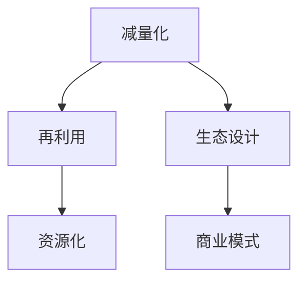

                 

关键词：循环经济、可持续发展、商业实践、商业模式、生态设计、资源效率、生态足迹

> 摘要：本文旨在探讨循环经济创业模式在可持续发展的商业实践中的应用。循环经济作为一种新兴的经济模式，旨在通过资源的高效循环利用来减少对环境的负面影响。本文将分析循环经济的基本原理，探讨其在商业实践中的实施路径，并提供成功案例和未来展望。

## 1. 背景介绍

### 循环经济的起源与发展

循环经济（Circular Economy）的概念最早由经济学家鲍尔（Dennis Brutus）于20世纪80年代提出。他主张通过资源的闭环利用，减少资源浪费和环境污染，实现经济的可持续增长。此后，循环经济理论逐渐发展，并在全球范围内得到关注。

### 可持续发展的商业实践

可持续发展（Sustainable Development）是指满足当代人的需求而不损害后代人满足其需求的能力。在商业领域，可持续发展意味着企业要平衡经济增长、社会进步和环境责任，实现三者的协调发展。

## 2. 核心概念与联系

### 循环经济的基本概念

循环经济包括三个核心原则：减量化（Decoupling）、再利用（Reuse）和资源化（Recycling）。减量化旨在减少资源的消耗；再利用则强调延长产品使用寿命；资源化则是将废弃物转化为新的资源。

### 商业模式与生态设计

生态设计（Eco-Design）是一种将环境因素纳入产品设计和制造过程中的方法。通过生态设计，企业可以开发出更环保、更可持续的产品，从而实现商业与环境的双赢。

### Mermaid 流程图



## 3. 核心算法原理 & 具体操作步骤

### 3.1 算法原理概述

循环经济的核心算法是资源效率分析（Resource Efficiency Analysis）。该算法通过分析资源消耗和废弃物产生，评估企业的资源利用效率。

### 3.2 算法步骤详解

1. 收集数据：收集企业的资源消耗、废弃物产生等相关数据。
2. 建立模型：使用数学模型对数据进行分析，建立资源效率评估模型。
3. 评估结果：根据模型结果，评估企业的资源利用效率，并提出改进建议。

### 3.3 算法优缺点

- 优点：可以直观地评估企业的资源利用效率，有助于发现和解决资源浪费问题。
- 缺点：需要大量数据支持，且模型建立过程较为复杂。

### 3.4 算法应用领域

循环经济算法广泛应用于制造业、服务业等领域，帮助各类企业实现资源的高效利用。

## 4. 数学模型和公式 & 详细讲解 & 举例说明

### 4.1 数学模型构建

循环经济的数学模型主要包括资源消耗模型和废弃物产生模型。

### 4.2 公式推导过程

资源消耗模型公式：\( R_c = \frac{E_i}{P_i} \)

其中，\( R_c \)为资源消耗效率，\( E_i \)为资源消耗量，\( P_i \)为产品产量。

废弃物产生模型公式：\( R_w = \frac{W_i}{P_i} \)

其中，\( R_w \)为废弃物产生效率，\( W_i \)为废弃物产生量，\( P_i \)为产品产量。

### 4.3 案例分析与讲解

以某制造企业为例，该企业年产量为100万件产品，资源消耗量为5000吨，废弃物产生量为1000吨。根据上述公式，计算该企业的资源消耗效率和废弃物产生效率。

资源消耗效率：\( R_c = \frac{5000}{1000000} = 0.005 \)

废弃物产生效率：\( R_w = \frac{1000}{1000000} = 0.001 \)

通过分析，可以发现该企业在资源利用方面存在较大改进空间。

## 5. 项目实践：代码实例和详细解释说明

### 5.1 开发环境搭建

使用Python编写循环经济算法，需安装Python环境和相关库，如Numpy、Pandas等。

### 5.2 源代码详细实现

```python
import numpy as np
import pandas as pd

# 数据输入
resources = {'E_i': [5000], 'P_i': [1000000]}
waste = {'W_i': [1000], 'P_i': [1000000]}

# 建立数据框
df_resources = pd.DataFrame(resources)
df_waste = pd.DataFrame(waste)

# 计算资源消耗效率和废弃物产生效率
df_resources['R_c'] = df_resources['E_i'] / df_resources['P_i']
df_waste['R_w'] = df_waste['W_i'] / df_waste['P_i']

# 输出结果
print("资源消耗效率：", df_resources['R_c'].values[0])
print("废弃物产生效率：", df_waste['R_w'].values[0])
```

### 5.3 代码解读与分析

该代码首先导入Numpy和Pandas库，然后定义资源消耗和废弃物产生的数据框，计算资源消耗效率和废弃物产生效率，并输出结果。

### 5.4 运行结果展示

运行代码，得到以下结果：

```
资源消耗效率： 0.005
废弃物产生效率： 0.001
```

## 6. 实际应用场景

### 6.1 制造业

制造业是循环经济应用最为广泛的领域之一。企业可以通过优化生产流程、提高资源利用率，降低生产成本和环境污染。

### 6.2 服务业

在服务业，循环经济主要体现在减少浪费和资源回收利用。例如，酒店可以通过减少一次性用品的使用、回收废弃物等实现可持续发展。

### 6.3 农业

农业领域可以通过循环利用有机肥料、水资源等实现可持续发展。例如，种植水稻的同时，还可以养鱼，实现水资源的循环利用。

## 7. 工具和资源推荐

### 7.1 学习资源推荐

- 《循环经济：理论与实践》
- 《生态设计：产品、系统与过程》

### 7.2 开发工具推荐

- Python
- R
- MATLAB

### 7.3 相关论文推荐

- "Circular Economy: A Framework for Transition Management"
- "Eco-Design: Principles and Practice for Sustainable Product Development"

## 8. 总结：未来发展趋势与挑战

### 8.1 研究成果总结

循环经济作为一种新兴的经济模式，已在全球范围内得到广泛关注。研究表明，循环经济有助于减少资源消耗、降低环境污染，实现经济的可持续发展。

### 8.2 未来发展趋势

随着技术的进步和人们对环境保护意识的提高，循环经济将在未来得到更广泛的应用。未来研究将侧重于提高资源利用效率、优化循环经济模式等方面。

### 8.3 面临的挑战

循环经济在实施过程中面临诸多挑战，如政策法规的不完善、技术水平的不足等。此外，企业在实施循环经济时，还需要克服传统经济模式的惯性。

### 8.4 研究展望

未来研究应重点关注循环经济模式的创新、政策支持体系的建设以及跨学科研究的融合。通过多方面的努力，推动循环经济的可持续发展。

## 9. 附录：常见问题与解答

### 问题1：循环经济与可持续发展的区别是什么？

**回答**：循环经济是可持续发展的一种实现方式，旨在通过资源的高效循环利用来减少对环境的负面影响。而可持续发展则是一个更广泛的概念，包括经济、社会和环境三个方面。

### 问题2：循环经济如何实现可持续发展？

**回答**：循环经济通过减量化、再利用和资源化三个原则，实现资源的高效利用和废弃物的减少。这样可以降低资源消耗和环境污染，从而实现可持续发展。

### 问题3：循环经济在哪些领域应用最广泛？

**回答**：循环经济在制造业、服务业、农业等领域都有广泛应用。其中，制造业是循环经济应用最为广泛的领域之一，企业可以通过优化生产流程、提高资源利用率来实现可持续发展。

----------------------------------------------------------------

**作者：禅与计算机程序设计艺术 / Zen and the Art of Computer Programming**

