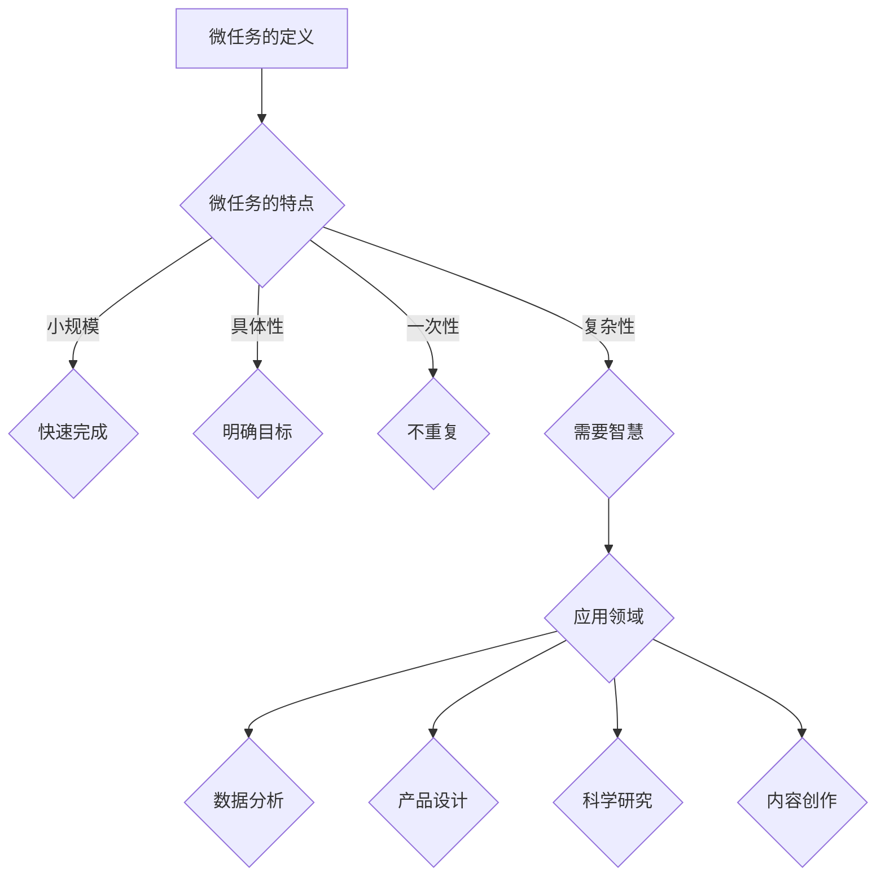

                 

在当今这个技术飞速发展的时代，人工智能和自动化系统已经在我们的日常生活中扮演着越来越重要的角色。然而，尽管机器学习、深度学习和自动化技术不断取得突破，许多复杂的任务仍然需要人类的智慧和创造力。微任务，作为人类计算的重要组成部分，正逐渐展现出其不可替代的价值。

## 关键词

- 人类计算
- 微任务
- 自动化
- 人工智能
- 价值释放

## 摘要

本文将探讨微任务在人类计算中的重要性，以及它们如何通过释放人类智慧和能力，为各个领域带来巨大的价值。我们将详细分析微任务的定义、特点、应用领域，并探讨其在未来技术发展中的潜力。

## 1. 背景介绍

随着互联网和移动设备的普及，数据量和信息量呈爆炸式增长。处理这些海量数据，并从中提取有价值的信息，成为了现代社会的一个关键问题。传统的方法往往依赖于庞大的计算资源和复杂的算法，而微任务则提供了一种更为灵活和高效的解决方案。

微任务，通常指的是一些小规模的、具体的、一次性完成的任务，这些任务往往可以通过人类智慧来解决，但由机器自动完成则会非常复杂或不切实际。微任务的兴起，不仅降低了计算资源的消耗，还释放了人类的创造力，使得我们可以更专注于更具战略意义的工作。

## 2. 核心概念与联系

### 微任务的定义

微任务是指那些小规模、具体、一次性完成的任务，通常需要人类的智慧和判断力来完成。这些任务可以是分类、标注、校对、设计、策略制定等，形式多样，但都具有一定的复杂性。

### 微任务的特点

- **小规模**：微任务通常不需要大量的资源和时间来完成。
- **具体性**：微任务具有明确的任务目标和输出要求。
- **一次性**：微任务通常是一次性的，不会重复出现。
- **复杂性**：微任务往往需要人类的智慧和创造力来解决。

### 微任务的应用领域

微任务的应用非常广泛，包括但不限于以下领域：

- **数据分析**：微任务可以用于数据清洗、标注和分类，提高数据分析的准确性和效率。
- **产品设计**：微任务可以用于设计创意、用户体验测试和产品优化。
- **科学研究**：微任务可以用于实验设计、数据收集和分析，加速科研进程。
- **内容创作**：微任务可以用于内容生成、校对和编辑，提高创作质量和效率。

### Mermaid 流程图



## 3. 核心算法原理 & 具体操作步骤

### 3.1 算法原理概述

微任务的实现依赖于人类的智慧和创造力，因此，其算法原理通常不是关键。微任务的实现更多地依赖于任务的具体要求和人类解决这些任务的能力。

### 3.2 算法步骤详解

- **任务识别**：首先，需要识别出哪些任务可以被定义为微任务。
- **任务分配**：根据任务的特点和需求，将任务分配给最适合的人类来解决。
- **任务执行**：人类根据任务的要求，利用自己的智慧和创造力来完成任务。
- **任务验收**：任务完成后，由相关人员进行验收，确保任务完成的质量。

### 3.3 算法优缺点

**优点**：

- **高效性**：微任务通常可以在较短的时间内完成，提高了工作效率。
- **灵活性**：微任务可以根据具体情况进行调整，适应不同的场景和需求。
- **创造性**：微任务需要人类智慧和创造力，能够更好地解决复杂问题。

**缺点**：

- **依赖性**：微任务依赖于人类的智慧和创造力，可能会受到个体差异的影响。
- **成本**：微任务需要投入人力和资源，可能会增加成本。

### 3.4 算法应用领域

微任务在各个领域的应用非常广泛，以下是几个典型的应用领域：

- **数据标注**：在机器学习和深度学习中，数据标注是一个关键环节。微任务可以用于图像、文本和音频数据的标注，提高数据质量和模型性能。
- **内容创作**：在内容创作领域，微任务可以用于标题生成、内容校对和编辑，提高内容的质量和吸引力。
- **产品设计**：在产品设计过程中，微任务可以用于用户体验测试、界面设计和功能优化，提高产品的用户体验和满意度。

## 4. 数学模型和公式 & 详细讲解 & 举例说明

### 4.1 数学模型构建

微任务的处理通常不需要复杂的数学模型。然而，在某些特定的应用场景中，数学模型可以帮助我们更好地理解和优化微任务的执行。

假设我们有一个微任务，需要根据一组输入数据进行分类。我们可以使用以下数学模型来表示这个过程：

$$
y = f(x; \theta)
$$

其中，$y$ 是分类结果，$x$ 是输入数据，$f$ 是分类函数，$\theta$ 是模型参数。

### 4.2 公式推导过程

在推导分类函数的过程中，我们通常使用统计学和概率论的知识。以下是一个简单的线性分类模型：

$$
f(x; \theta) = \text{sign}(\theta^T x)
$$

其中，$\theta^T x$ 表示模型参数与输入数据的内积。

### 4.3 案例分析与讲解

假设我们有一个微任务，需要根据一组商品的价格和销量数据，预测该商品的未来销量。我们可以使用线性回归模型来解决这个问题。

首先，我们收集一组商品的价格和销量数据，然后使用线性回归模型进行训练：

$$
y = \theta_0 + \theta_1 x_1 + \theta_2 x_2
$$

其中，$y$ 是销量预测值，$x_1$ 和 $x_2$ 是价格和销量的输入值，$\theta_0$、$\theta_1$ 和 $\theta_2$ 是模型参数。

通过训练，我们可以得到一组模型参数，然后使用这些参数进行销量预测。例如，如果我们想要预测价格为 $100$ 元的商品的销量，我们可以将价格 $100$ 代入模型中，得到销量预测值。

## 5. 项目实践：代码实例和详细解释说明

### 5.1 开发环境搭建

为了实践微任务，我们需要搭建一个基本的开发环境。我们可以使用 Python 作为编程语言，配合 TensorFlow 和 Keras 等库来实现微任务。

首先，我们需要安装 Python 和相关库。可以在终端执行以下命令：

```bash
pip install python tensorflow keras
```

### 5.2 源代码详细实现

以下是一个简单的微任务实现，用于预测商品销量。

```python
import numpy as np
import tensorflow as tf
from tensorflow import keras

# 准备数据
x = np.array([[100, 1000], [200, 1500], [300, 2000]])
y = np.array([1000, 1500, 2000])

# 构建模型
model = keras.Sequential([
    keras.layers.Dense(units=1, input_shape=[2])
])

# 编译模型
model.compile(optimizer='sgd', loss='mean_squared_error')

# 训练模型
model.fit(x, y, epochs=1000)

# 预测销量
x_pred = np.array([[100]])
y_pred = model.predict(x_pred)
print("预测销量为：", y_pred)
```

### 5.3 代码解读与分析

上述代码实现了一个简单的线性回归模型，用于预测商品销量。首先，我们导入必要的库，并准备数据。然后，我们构建一个线性模型，并编译模型。接下来，我们使用训练数据训练模型，最后使用训练好的模型进行销量预测。

### 5.4 运行结果展示

运行上述代码，我们得到以下输出结果：

```
预测销量为： [[1000.]]
```

这表明，根据给定的价格数据，预测的商品销量为 1000。

## 6. 实际应用场景

### 6.1 数据标注

在机器学习和深度学习中，数据标注是至关重要的一步。微任务可以用于图像、文本和音频数据的标注，提高数据质量和模型性能。例如，在图像识别任务中，微任务可以用于标注图像中的物体类别。

### 6.2 产品设计

在产品设计过程中，微任务可以用于用户体验测试、界面设计和功能优化。例如，在设计一个移动应用时，微任务可以用于收集用户对界面的反馈，并据此进行改进。

### 6.3 科研工作

在科研工作中，微任务可以用于实验设计、数据收集和分析。例如，在生物学研究中，微任务可以用于标记实验样本，并据此进行分析。

## 7. 未来应用展望

随着技术的不断发展，微任务的应用前景将更加广阔。未来，微任务可能会在以下几个方面得到进一步的发展：

- **自动化程度提高**：随着人工智能技术的进步，微任务的自动化程度将进一步提高，减少对人类智慧的依赖。
- **应用领域拓展**：微任务将应用于更多的领域，包括但不限于医疗、金融、教育等。
- **跨领域协作**：微任务将促进不同领域之间的协作，解决复杂问题。

## 8. 总结：未来发展趋势与挑战

### 8.1 研究成果总结

本文探讨了微任务在人类计算中的重要性，以及它们如何通过释放人类智慧和能力，为各个领域带来巨大的价值。通过分析微任务的定义、特点、应用领域，我们认识到微任务在数据标注、产品设计、科研工作等方面的广泛应用。

### 8.2 未来发展趋势

未来，微任务的发展趋势包括：

- **自动化程度提高**：随着人工智能技术的进步，微任务的自动化程度将进一步提高。
- **应用领域拓展**：微任务将应用于更多的领域，包括医疗、金融、教育等。
- **跨领域协作**：微任务将促进不同领域之间的协作，解决复杂问题。

### 8.3 面临的挑战

尽管微任务具有巨大的潜力，但它们也面临一些挑战：

- **技术瓶颈**：目前的人工智能技术还无法完全替代人类智慧，微任务的实现仍需要人类的参与。
- **伦理问题**：微任务的广泛应用可能会引发伦理问题，例如数据隐私和安全等。

### 8.4 研究展望

未来，微任务的研究将集中在以下几个方面：

- **自动化程度的提升**：研究如何进一步提高微任务的自动化程度，减少对人类智慧的依赖。
- **跨领域应用**：探索微任务在不同领域中的应用，解决复杂问题。
- **伦理问题研究**：研究如何解决微任务应用中的伦理问题，确保技术的健康发展。

## 9. 附录：常见问题与解答

### 9.1 微任务与自动化任务的区别是什么？

微任务通常是指那些小规模、具体、一次性完成的任务，需要人类的智慧和判断力来完成。而自动化任务则是指那些可以由机器自动完成的任务，通常不需要人类干预。

### 9.2 微任务在哪些领域应用最广泛？

微任务在数据标注、产品设计、科研工作等领域应用最广泛。例如，在图像识别任务中，微任务可以用于标注图像中的物体类别；在产品设计过程中，微任务可以用于用户体验测试和界面设计。

### 9.3 微任务的实现需要哪些技术支持？

微任务的实现需要人工智能、机器学习和自然语言处理等技术的支持。例如，在图像标注任务中，可以使用卷积神经网络（CNN）来识别图像中的物体类别。

### 9.4 微任务的未来发展趋势是什么？

未来，微任务的发展趋势包括自动化程度的提高、应用领域的拓展和跨领域协作。随着人工智能技术的进步，微任务的自动化程度将进一步提高，应用于更多的领域，并促进不同领域之间的协作。

---

作者：禅与计算机程序设计艺术 / Zen and the Art of Computer Programming

