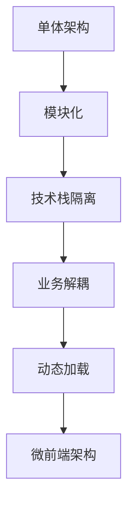

                 

关键词：微前端架构，模块化，Web应用，代码复用，维护性，性能优化，协作开发，技术栈隔离，业务解耦

摘要：本文将深入探讨微前端架构在大型Web应用开发中的应用，解释其核心概念、架构原理，并提供详细的算法和操作步骤。我们将通过实例代码展示微前端架构的实际应用，并分析其在不同场景下的应用效果。同时，我们将讨论未来发展趋势和面临的挑战，以及推荐相关的学习资源和工具。

## 1. 背景介绍

在互联网快速发展的今天，Web应用的规模和复杂度不断增加。传统的单体架构（Monolithic Architecture）已经难以满足现代Web应用的快速迭代和多变需求。单体架构将前端、后端、数据库等多个组件耦合在一起，导致系统难以扩展和维护。为了解决这些问题，微前端架构（Micro-Frontend Architecture）应运而生。

微前端架构将Web应用拆分为多个独立的、可复用的小型前端模块，每个模块由不同的团队独立开发和部署。这种架构具有高灵活性、高可维护性、高性能等优点，能够更好地应对复杂的项目需求。

## 2. 核心概念与联系

### 2.1 微前端架构的核心概念

微前端架构主要包括以下几个核心概念：

- **模块化**：将应用拆分为多个独立的模块，每个模块具有清晰的功能和职责。
- **技术栈隔离**：允许不同的团队使用不同的技术栈进行开发，降低技术债务。
- **业务解耦**：通过将业务功能拆分为独立模块，降低模块之间的耦合度，提高系统的可维护性。
- **动态加载**：根据应用需求动态加载模块，提高性能和用户体验。

### 2.2 微前端架构的联系

微前端架构与单体架构、前后端分离架构等概念有着紧密的联系：

- **单体架构**：微前端架构是单体架构的一种改进，通过模块化、技术栈隔离等方式，解决单体架构的扩展性和维护性问题。
- **前后端分离架构**：微前端架构在前后端分离架构的基础上，进一步实现了前端模块的独立开发和部署，降低了前后端的耦合度。
- **模块化**：微前端架构通过模块化实现前端应用的拆分，使得不同功能模块可以独立开发和维护。

### 2.3 微前端架构的Mermaid流程图



## 3. 核心算法原理 & 具体操作步骤

### 3.1 算法原理概述

微前端架构的核心算法原理主要包括以下几个方面：

- **模块划分**：根据应用功能和职责，将前端应用划分为多个独立的模块。
- **模块加载**：使用模块加载器（如Webpack、Rollup等），根据需求动态加载模块。
- **模块通信**：通过公共API或消息总线（如Event Bus、WebSocket等），实现模块之间的通信和协作。
- **模块部署**：使用持续集成和持续部署（CI/CD）工具，实现模块的自动化部署和更新。

### 3.2 算法步骤详解

#### 3.2.1 模块划分

1. 分析应用功能，确定模块划分策略。
2. 为每个模块定义清晰的功能和职责。
3. 编写模块文档，记录模块的接口、依赖和职责。

#### 3.2.2 模块加载

1. 安装并配置模块加载器（如Webpack）。
2. 编写模块加载配置文件，指定模块的入口、出口和依赖。
3. 编写加载器插件，实现模块的动态加载和依赖管理。

#### 3.2.3 模块通信

1. 选择合适的通信机制（如Event Bus、WebSocket等）。
2. 编写通信协议，定义模块之间的交互接口。
3. 实现模块之间的通信和协作。

#### 3.2.4 模块部署

1. 安装并配置CI/CD工具（如Jenkins、GitLab CI等）。
2. 编写构建脚本，实现模块的自动化编译和打包。
3. 配置部署脚本，实现模块的自动化部署和更新。

### 3.3 算法优缺点

#### 3.3.1 优点

- **高灵活性**：支持不同的团队使用不同的技术栈进行开发，降低技术债务。
- **高可维护性**：模块化使得代码更易于理解和维护。
- **高性能**：通过动态加载模块，提高性能和用户体验。
- **高可扩展性**：支持将新模块快速集成到现有应用中。

#### 3.3.2 缺点

- **复杂性**：引入微前端架构后，项目整体复杂性增加，需要更精细化的管理和协调。
- **性能风险**：如果模块加载不当，可能导致性能问题。
- **学习成本**：开发团队需要学习新的技术栈和架构模式。

### 3.4 算法应用领域

微前端架构主要适用于以下领域：

- **大型Web应用**：支持复杂、多变的业务需求，提高开发效率和可维护性。
- **企业级应用**：降低技术债务，提高系统的稳定性和可靠性。
- **跨部门协作**：实现不同团队之间的独立开发和协作。

## 4. 数学模型和公式 & 详细讲解 & 举例说明

### 4.1 数学模型构建

在微前端架构中，可以使用以下数学模型来评估模块划分的合理性和性能：

- **模块复杂度**：$$C = \frac{N \cdot (N - 1)}{2}$$，其中N为模块数量。
- **模块耦合度**：$$C_{耦合} = \frac{C_{总}}{C_{理想}}$$，其中$$C_{总}$$为实际模块复杂度，$$C_{理想}$$为理想模块复杂度。

### 4.2 公式推导过程

#### 4.2.1 模块复杂度推导

假设有N个模块，每个模块之间存在相互依赖关系。模块复杂度可以通过计算模块之间的依赖关系数来评估。

- 当有N个模块时，每个模块最多与其他N-1个模块存在依赖关系。
- 因此，模块复杂度可以表示为：$$C = \frac{N \cdot (N - 1)}{2}$$。

#### 4.2.2 模块耦合度推导

模块耦合度表示实际模块复杂度与理想模块复杂度之间的比值。理想模块复杂度可以假设为每个模块相互独立，不存在依赖关系。

- 理想模块复杂度：$$C_{理想} = 1$$。
- 实际模块复杂度：$$C_{总} = \frac{N \cdot (N - 1)}{2}$$。
- 模块耦合度：$$C_{耦合} = \frac{C_{总}}{C_{理想}} = \frac{N \cdot (N - 1)}{2}$$。

### 4.3 案例分析与讲解

假设一个大型Web应用包含10个模块，使用微前端架构进行模块划分。以下是模块复杂度和模块耦合度的计算：

- 模块复杂度：$$C = \frac{10 \cdot (10 - 1)}{2} = 45$$。
- 模块耦合度：$$C_{耦合} = \frac{45}{1} = 45$$。

根据计算结果，模块复杂度为45，模块耦合度为45。这意味着模块之间存在较高的依赖关系，需要进一步优化模块划分和模块通信。

## 5. 项目实践：代码实例和详细解释说明

### 5.1 开发环境搭建

为了实践微前端架构，我们需要搭建一个开发环境。以下是一个简单的搭建步骤：

1. 安装Node.js（版本大于12.0.0）。
2. 安装Webpack（版本大于4.0.0）。
3. 创建一个新项目，并初始化包管理器（如npm或yarn）。

### 5.2 源代码详细实现

以下是微前端架构的一个简单示例：

```javascript
// src/App.js
import React from 'react';
import Home from './components/Home';
import About from './components/About';

const App = () => {
  return (
    <div>
      <Home />
      <About />
    </div>
  );
};

export default App;

// src/components/Home.js
import React from 'react';

const Home = () => {
  return (
    <div>
      <h1>欢迎来到主页</h1>
    </div>
  );
};

export default Home;

// src/components/About.js
import React from 'react';

const About = () => {
  return (
    <div>
      <h1>关于我们</h1>
    </div>
  );
};

export default About;
```

### 5.3 代码解读与分析

以上代码展示了微前端架构的一个简单示例。其中，`App.js`作为主应用，负责加载和渲染各个模块。`Home.js`和`About.js`分别作为独立的模块，负责展示主页和关于我们页面的内容。

通过模块划分和模块加载，我们可以实现不同模块之间的独立开发和部署。这种架构提高了代码的可维护性和可扩展性，降低了模块之间的耦合度。

### 5.4 运行结果展示

在开发环境中运行主应用`App.js`，我们可以看到以下结果：

```html
<!DOCTYPE html>
<html lang="en">
  <head>
    <meta charset="UTF-8" />
    <meta name="viewport" content="width=device-width, initial-scale=1.0" />
    <title>微前端架构示例</title>
  </head>
  <body>
    <div id="app"></div>
    <script src="/src/App.js"></script>
  </body>
</html>
```

在浏览器中打开上述HTML文件，我们可以看到主页和关于我们页面的内容已经成功渲染。

## 6. 实际应用场景

微前端架构在以下场景中具有显著的应用价值：

- **大型Web应用**：支持复杂、多变的业务需求，提高开发效率和可维护性。
- **企业级应用**：降低技术债务，提高系统的稳定性和可靠性。
- **跨部门协作**：实现不同团队之间的独立开发和协作。

在实际应用中，微前端架构可以帮助开发团队更好地应对项目挑战，提高代码质量和开发效率。

### 6.1 大型Web应用

微前端架构可以帮助大型Web应用实现模块化开发和部署，降低系统复杂度，提高可维护性和扩展性。例如，电商平台可以拆分为商品模块、订单模块、用户模块等，每个模块由不同的团队独立开发和维护。

### 6.2 企业级应用

微前端架构在企业级应用中具有广泛的应用场景。企业可以将不同业务功能拆分为独立的模块，实现不同团队之间的协作开发。例如，一家金融公司的在线银行系统可以拆分为账户管理模块、交易管理模块、风险管理模块等，每个模块由不同的团队负责开发和维护。

### 6.3 跨部门协作

微前端架构可以帮助跨部门团队实现独立开发和部署，降低沟通成本，提高协作效率。例如，一家互联网公司的电商部门和技术部门可以采用微前端架构，电商部门专注于前端界面设计，技术部门专注于后端服务开发，实现高效的项目协作。

## 7. 未来应用展望

随着互联网技术的不断发展，微前端架构在未来具有广阔的应用前景。以下是一些可能的发展方向：

- **微前端平台化**：构建统一的微前端平台，提供模块化、自动化、可视化的开发体验。
- **微前端与云计算结合**：利用云计算技术，实现微前端架构的弹性扩展和资源优化。
- **微前端与大数据结合**：结合大数据技术，实现微前端架构的智能决策和个性化推荐。
- **微前端与人工智能结合**：利用人工智能技术，实现微前端架构的智能诊断和自动优化。

## 8. 总结：未来发展趋势与挑战

### 8.1 研究成果总结

微前端架构自提出以来，已经取得了显著的研究成果。在实际应用中，微前端架构展示了其在模块化、可维护性、性能优化等方面的优势。然而，微前端架构也面临着一定的挑战，如复杂性、性能风险等。

### 8.2 未来发展趋势

未来，微前端架构将继续发展，探索更多的应用场景和解决方案。以下是一些可能的发展趋势：

- **微前端平台化**：构建统一的微前端平台，提供模块化、自动化、可视化的开发体验。
- **微前端与云计算结合**：利用云计算技术，实现微前端架构的弹性扩展和资源优化。
- **微前端与大数据结合**：结合大数据技术，实现微前端架构的智能决策和个性化推荐。
- **微前端与人工智能结合**：利用人工智能技术，实现微前端架构的智能诊断和自动优化。

### 8.3 面临的挑战

微前端架构在发展过程中面临以下挑战：

- **复杂性**：引入微前端架构后，项目整体复杂性增加，需要更精细化的管理和协调。
- **性能风险**：如果模块加载不当，可能导致性能问题。
- **学习成本**：开发团队需要学习新的技术栈和架构模式。

### 8.4 研究展望

未来，微前端架构的研究应重点关注以下几个方面：

- **性能优化**：研究更高效的模块加载和通信机制，降低性能风险。
- **工具链整合**：整合现有工具链，提高开发效率和项目可维护性。
- **跨平台支持**：研究跨平台支持，实现微前端架构在不同平台上的兼容性和扩展性。
- **安全性**：研究微前端架构的安全性，确保模块之间的数据安全和访问控制。

## 9. 附录：常见问题与解答

### 9.1 微前端架构与传统单体架构的区别

微前端架构与传统单体架构的主要区别在于模块化、技术栈隔离、业务解耦等方面。微前端架构将前端应用拆分为多个独立的模块，每个模块由不同的团队独立开发和部署，降低了系统的复杂度和耦合度。而传统单体架构将前端、后端、数据库等多个组件耦合在一起，难以扩展和维护。

### 9.2 微前端架构与前后端分离架构的区别

微前端架构与前后端分离架构的主要区别在于前端模块的独立开发和部署。前后端分离架构通过将前端和后端分离，实现不同团队之间的独立开发和部署，但前端模块仍然是一个整体。微前端架构进一步将前端模块拆分为多个独立的模块，每个模块具有清晰的功能和职责，实现更高程度的模块化和业务解耦。

### 9.3 微前端架构的优势和劣势

微前端架构的优势包括高灵活性、高可维护性、高性能、高可扩展性等。其劣势主要包括复杂性、性能风险、学习成本等。在实际应用中，我们需要根据项目需求和团队实际情况，权衡微前端架构的优势和劣势，选择合适的架构方案。

### 9.4 微前端架构的适用场景

微前端架构主要适用于以下场景：

- 大型Web应用：支持复杂、多变的业务需求，提高开发效率和可维护性。
- 企业级应用：降低技术债务，提高系统的稳定性和可靠性。
- 跨部门协作：实现不同团队之间的独立开发和协作。

在应用微前端架构时，我们需要根据项目需求和团队实际情况，合理划分模块，选择合适的模块加载器和通信机制，确保系统的稳定性和性能。

