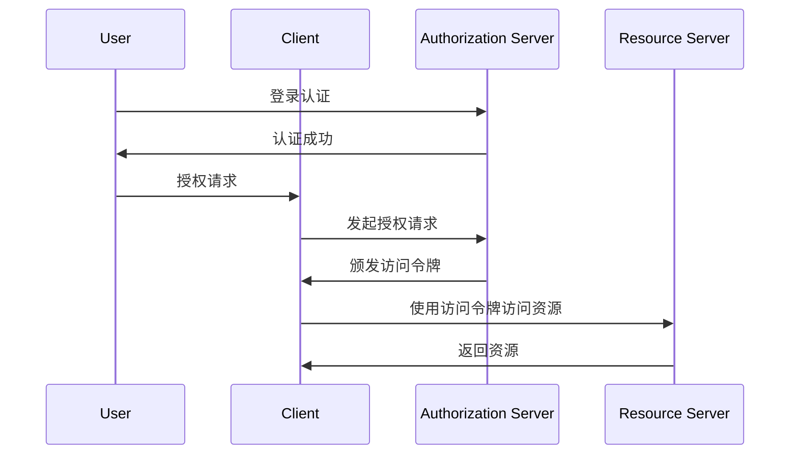

                 

## 1. 背景介绍

在当今数字化时代，微服务架构因其灵活性、可扩展性和高容错性而受到广泛的应用。微服务架构允许我们将一个复杂的单一应用程序拆分为多个独立的小服务，每个服务都负责完成特定的功能，从而实现模块化开发和管理。然而，随着微服务数量的增加，如何确保微服务之间的安全通信和访问控制成为了一个关键问题。

OAuth2和JWT（JSON Web Token）是两种常用的安全协议，用于保护微服务的安全。OAuth2是一种授权框架，主要用于第三方应用与资源服务器之间的授权过程。它允许用户授权第三方应用访问其受保护的资源，而无需透露用户账户密码。JWT则是一种基于JSON的开放标准，用于生成安全传输令牌，通常用于用户认证和授权。

本文将探讨OAuth2和JWT在微服务安全中的应用，包括其核心概念、原理、实施步骤以及优缺点。通过本文的阅读，读者将能够深入了解这两种安全协议的工作机制，掌握其实践方法，并能够根据实际需求选择合适的方案来确保微服务的安全。

## 2. 核心概念与联系

在深入了解OAuth2和JWT之前，我们首先需要了解它们的核心概念及其之间的联系。以下是这两个概念的基本介绍：

### OAuth2

OAuth2是一种开放标准，用于授权第三方应用访问用户资源。它定义了一种授权框架，允许用户将对其资源的访问权限授予第三方应用，而无需透露用户账户密码。OAuth2的核心概念包括以下几部分：

- **客户端（Client）**：请求访问资源的服务器应用程序。
- **用户（User）**：拥有资源并希望授权第三方应用访问这些资源的用户。
- **资源服务器（Resource Server）**：保存用户资源并提供访问接口的服务器。
- **授权服务器（Authorization Server）**：负责处理客户端请求、用户认证和授权决策的服务器。

OAuth2的工作流程如下：

1. **认证**：用户在授权服务器上登录并认证。
2. **授权**：用户在授权服务器上批准客户端的访问请求。
3. **令牌**：授权服务器向客户端颁发访问令牌（Access Token）。
4. **访问资源**：客户端使用访问令牌从资源服务器获取用户资源。

### JWT

JWT是一种基于JSON的开放标准，用于生成安全传输令牌。它包含三部分：头部（Header）、载荷（Payload）和签名（Signature）。JWT的核心概念包括：

- **头部**：包含JWT类型和加密算法等元数据。
- **载荷**：包含用户身份信息、权限等数据。
- **签名**：使用头部和载荷的哈希值和私钥生成的签名。

JWT的工作流程如下：

1. **生成JWT**：客户端在认证过程中获取用户信息，生成JWT。
2. **传输JWT**：客户端将JWT作为HTTP请求的Authorization头传递给服务器。
3. **验证JWT**：服务器接收JWT，使用公钥验证签名。
4. **授权访问**：如果JWT验证通过，服务器根据载荷中的信息进行用户认证和授权。

### 核心概念与联系

OAuth2和JWT在微服务安全中紧密相连。OAuth2负责处理客户端与授权服务器之间的授权流程，而JWT则用于客户端与服务器之间的身份验证和访问控制。以下是二者的联系：

- **OAuth2**：提供授权流程，用于生成访问令牌，JWT可以作为访问令牌。
- **JWT**：提供身份验证和访问控制，可以作为OAuth2中的访问令牌。

二者的区别在于：

- **OAuth2**：是一种授权框架，关注授权流程和令牌管理。
- **JWT**：是一种安全传输令牌，关注身份验证和访问控制。

### Mermaid 流程图

以下是OAuth2和JWT在微服务安全中的应用流程图：



通过上述流程图，我们可以清晰地看到OAuth2和JWT在微服务安全中的应用关系。

## 3. 核心算法原理 & 具体操作步骤

### 3.1 算法原理概述

OAuth2和JWT的安全机制基于一系列加密算法和协议，其中最核心的算法是签名算法和哈希算法。

#### 签名算法

签名算法用于生成JWT的签名，确保JWT在传输过程中不被篡改。常用的签名算法有：

- **HMAC（Hash-based Message Authentication Code）**：使用哈希函数和密钥生成签名。
- **RSA（Rivest-Shamir-Adleman）**：使用非对称加密算法生成签名。

#### 哈希算法

哈希算法用于生成JWT的哈希值，用于验证JWT的完整性和真实性。常用的哈希算法有：

- **SHA-256（Secure Hash Algorithm 256-bit）**：生成256位的哈希值。
- **SHA-3（SHA-3 Cryptographic Hash Algorithm）**：生成不同长度的哈希值。

### 3.2 算法步骤详解

#### OAuth2算法步骤

1. **用户认证**：用户在授权服务器上登录，通过密码或其他认证方式获得身份验证。

2. **授权请求**：用户同意授权客户端访问其资源，并向授权服务器发送授权请求。

3. **颁发访问令牌**：授权服务器生成访问令牌（Access Token），通常为JWT格式，并返回给客户端。

4. **访问资源**：客户端使用访问令牌向资源服务器请求资源，资源服务器验证令牌的有效性并返回资源。

#### JWT算法步骤

1. **生成JWT**：客户端在认证过程中获取用户信息，生成JWT。JWT包含头部、载荷和签名。

   - **头部**：定义JWT类型和签名算法，如`{"alg":"HS256","typ":"JWT"}`。
   - **载荷**：包含用户身份信息和其他数据，如`{"sub":"user1","exp":1506833142,"iss":"http://jwt.io"}`。
   - **签名**：使用头部和载荷的哈希值和私钥生成签名，如`"1.0.0.SignedValue"`。

2. **传输JWT**：客户端将JWT作为HTTP请求的Authorization头传递给服务器。

3. **验证JWT**：服务器接收JWT，使用公钥验证签名，确保JWT未被篡改。

4. **授权访问**：如果JWT验证通过，服务器根据载荷中的信息进行用户认证和授权。

### 3.3 算法优缺点

#### OAuth2优缺点

**优点**：

- **灵活的授权模式**：支持多种授权模式，如授权码模式、密码模式、客户端凭证模式等。
- **集中式认证**：授权服务器负责用户认证和授权决策，简化了认证流程。
- **安全性**：访问令牌与用户密码无关，减少密码泄露的风险。

**缺点**：

- **复杂性**：涉及多个服务器和流程，增加系统的复杂度。
- **性能开销**：每次访问资源都需要验证访问令牌，增加网络通信开销。

#### JWT优缺点

**优点**：

- **简单性**：无需额外流程，直接生成和验证JWT。
- **性能**：无需访问授权服务器，减少网络通信开销。
- **灵活性**：载荷中可以包含丰富的用户信息，支持自定义扩展。

**缺点**：

- **安全性**：可能面临中间人攻击、重放攻击等安全风险。
- **无集中式认证**：缺乏集中式认证，可能导致认证管理复杂。

### 3.4 算法应用领域

#### OAuth2应用领域

- **第三方应用授权**：如社交媒体登录、移动应用授权等。
- **企业应用集成**：如企业内部应用之间的资源共享和访问控制。

#### JWT应用领域

- **用户认证和授权**：如Web应用、移动应用等。
- **单点登录（SSO）**：用于多个系统之间的用户身份验证和访问控制。

通过以上算法原理和具体操作步骤的讲解，我们可以更好地理解OAuth2和JWT在微服务安全中的应用，并根据实际需求选择合适的方案来保护微服务安全。

## 4. 数学模型和公式 & 详细讲解 & 举例说明

### 4.1 数学模型构建

为了更好地理解OAuth2和JWT的安全性，我们需要构建一个数学模型来描述其工作原理。以下是一个简化的数学模型：

#### OAuth2模型

- **用户认证**：设`U`为用户集合，`u`为用户，`P`为密码集合，`p`为用户`u`的密码。
  - 认证函数：`authenticate(u, p)`，返回`True`表示认证成功，返回`False`表示认证失败。

- **授权请求**：设`C`为客户端集合，`c`为客户端，`A`为访问令牌集合，`a`为访问令牌。
  - 授权请求函数：`authorize(c, u)`，返回`True`表示用户`u`已授权客户端`c`访问其资源，返回`False`表示未授权。

- **颁发访问令牌**：设`T`为访问令牌集合，`t`为访问令牌。
  - 颁发访问令牌函数：`issueToken(u, c)`，生成访问令牌`t`并加入`T`集合。

- **访问资源**：设`R`为资源集合，`r`为资源。
  - 访问资源函数：`accessResource(r, t)`，验证访问令牌`t`的有效性，返回`True`表示允许访问，返回`False`表示拒绝访问。

#### JWT模型

- **生成JWT**：设`H`为哈希函数集合，`h`为哈希函数，`K`为密钥集合，`k`为密钥。
  - 生成JWT函数：`createJWT(header, payload, key)`，生成JWT字符串。

- **验证JWT**：设`S`为签名函数集合，`s`为签名函数。
  - 验证JWT函数：`validateJWT(jwt, key)`，验证JWT的签名和有效期。

### 4.2 公式推导过程

#### OAuth2公式推导

1. **用户认证**：
   - 认证成功条件：`authenticate(u, p) = True`，其中`u ∈ U`，`p ∈ P`。
   - 认证失败条件：`authenticate(u, p) = False`，其中`u ∉ U` 或 `p ∉ P`。

2. **授权请求**：
   - 授权请求成功条件：`authorize(c, u) = True`，其中`c ∈ C`，`u ∈ U`，且`u`已授权`c`。
   - 授权请求失败条件：`authorize(c, u) = False`，其中`c ∉ C` 或 `u`未授权`c`。

3. **颁发访问令牌**：
   - 访问令牌生成公式：`t = issueToken(u, c)`，其中`t ∈ T`。

4. **访问资源**：
   - 访问资源成功条件：`accessResource(r, t) = True`，其中`t ∈ T`，且`t`有效。
   - 访问资源失败条件：`accessResource(r, t) = False`，其中`t ∉ T` 或 `t`无效。

#### JWT公式推导

1. **生成JWT**：
   - JWT字符串生成公式：`jwt = createJWT(header, payload, key)`，其中`header`为头部，`payload`为载荷，`key`为密钥。
   - 签名生成公式：`signature = s(header || '.' || payload, key)`，其中`header`为头部，`payload`为载荷，`s`为签名函数。

2. **验证JWT**：
   - JWT验证公式：`validateJWT(jwt, key) = True`，如果`jwt`的签名有效且未过期。
   - JWT验证公式：`validateJWT(jwt, key) = False`，如果`jwt`的签名无效或已过期。

### 4.3 案例分析与讲解

#### OAuth2案例

假设用户`user1`已授权客户端`client1`访问其资源。以下是OAuth2的认证、授权和访问资源过程：

1. **用户认证**：
   - 用户`user1`输入用户名和密码，认证服务器验证用户身份，返回`True`。

2. **授权请求**：
   - 客户端`client1`请求用户`user1`的授权，授权服务器检查`user1`是否已授权`client1`，返回`True`。

3. **颁发访问令牌**：
   - 授权服务器生成访问令牌`token1`，并返回给客户端`client1`。

4. **访问资源**：
   - 客户端`client1`使用访问令牌`token1`请求资源，资源服务器验证访问令牌的有效性，返回用户`user1`的资源。

#### JWT案例

假设客户端`client2`需要访问用户`user2`的资源。以下是JWT的认证、生成和验证过程：

1. **生成JWT**：
   - 客户端`client2`在认证过程中获取用户`user2`的信息，生成JWT。头部包含`{"alg":"HS256","typ":"JWT"}`，载荷包含`{"sub":"user2","exp":1506833142,"iss":"http://jwt.io"}`，签名使用`HMAC`算法和密钥生成。

2. **传输JWT**：
   - 客户端`client2`将JWT作为HTTP请求的Authorization头传递给服务器。

3. **验证JWT**：
   - 服务器接收JWT，使用公钥验证JWT的签名，确保JWT未被篡改。同时，检查JWT的有效期，确保未过期。

4. **授权访问**：
   - 如果JWT验证通过，服务器根据载荷中的信息进行用户认证和授权，允许客户端访问用户`user2`的资源。

通过以上案例，我们可以更好地理解OAuth2和JWT的数学模型和公式推导过程，以及在实际应用中的具体操作步骤。

## 5. 项目实践：代码实例和详细解释说明

### 5.1 开发环境搭建

为了更好地理解和实践OAuth2和JWT，我们需要搭建一个开发环境。以下是所需的工具和步骤：

#### 工具：

- **开发环境**：Python 3.7+
- **库**：`Flask`、`Flask-OAuthlib`、`PyJWT`、`requests`
- **文本编辑器**：如Visual Studio Code

#### 步骤：

1. 安装Python和必要的库：

```bash
pip install flask flask-oauthlib pyjwt requests
```

2. 创建一个新的Python虚拟环境，以便管理和隔离依赖：

```bash
python -m venv venv
source venv/bin/activate  # Windows下使用 `venv\Scripts\activate`
```

3. 创建一个名为`app.py`的Python文件，用于编写应用程序代码。

### 5.2 源代码详细实现

以下是使用Flask和Flask-OAuthlib实现的OAuth2和JWT的示例代码。该示例包含认证、授权和资源访问三个部分。

```python
from flask import Flask, request, jsonify
from flask_oauthlib.client import OAuth
from itsdangerous import TimedJSONWebSignatureSerializer as Serializer
import jwt
import time

app = Flask(__name__)
app.config['SECRET_KEY'] = 'your_secret_key'

# OAuth2配置
oauth = OAuth(app)
github = oauth.remote_app(
    'github',
    consumer_key='your_github_consumer_key',
    consumer_secret='your_github_consumer_secret',
    request_token_url=None,
    base_url='https://api.github.com',
    request_token_path=None,
    access_token_url='https://github.com/login/oauth/access_token',
    authorize_url='https://github.com/login/oauth/authorize'
)

# JWT密钥
def generate_jwt(token):
    return jwt.encode({'token': token, 'exp': time.time() + 3600}, app.config['SECRET_KEY'], algorithm='HS256')

# 验证JWT
def verify_jwt(token):
    try:
        payload = jwt.decode(token, app.config['SECRET_KEY'], algorithms=['HS256'])
        return payload['token']
    except jwt.ExpiredSignatureError:
        return None
    except jwt.InvalidTokenError:
        return None

@app.route('/')
def index():
    return 'Welcome to the Microservices Security Demo!'

@app.route('/login')
def login():
    return github.authorize(callback='http://localhost:5000/auth/login/callback')

@app.route('/auth/login/callback')
def login_callback():
    # 从请求中获取授权码
    code = request.args.get('code')
    # 使用授权码获取访问令牌
    token = github.get_token(code=code)
    # 生成JWT
    jwt_token = generate_jwt(token['access_token'])
    return jsonify({'jwt_token': jwt_token})

@app.route('/resource', methods=['GET'])
def resource():
    # 从请求中获取JWT
    jwt_token = request.headers.get('Authorization', None)
    # 验证JWT
    token = verify_jwt(jwt_token)
    if token:
        return jsonify({'resource': 'Private Resource'})
    else:
        return jsonify({'error': 'Unauthorized'})

if __name__ == '__main__':
    app.run(debug=True)
```

### 5.3 代码解读与分析

#### 5.3.1 OAuth2部分

- **登录**：`/login`路由负责跳转到GitHub的登录页面，用户登录后，GitHub会将用户重定向到`/auth/login/callback`路由。

- **认证回调**：`/auth/login/callback`路由从请求中获取授权码，使用授权码获取访问令牌，并生成JWT。

#### 5.3.2 JWT部分

- **生成JWT**：`generate_jwt`函数使用`jwt.encode`方法生成JWT。JWT包含用户的访问令牌和过期时间。

- **验证JWT**：`verify_jwt`函数使用`jwt.decode`方法验证JWT的签名和有效期。

#### 5.3.3 资源访问

- `/resource`路由负责保护资源，只有验证通过的用户才能访问。用户需要在请求头中包含JWT。

### 5.4 运行结果展示

1. 启动Flask应用：

```bash
python app.py
```

2. 访问`http://localhost:5000/login`，用户将被重定向到GitHub登录页面。

3. 用户登录后，GitHub会将用户重定向到`http://localhost:5000/auth/login/callback`，应用会生成JWT并返回。

4. 将JWT放入请求头，访问`http://localhost:5000/resource`，如果JWT验证通过，用户将能够访问私有资源。

通过上述代码示例和解析，我们可以看到如何使用OAuth2和JWT实现微服务安全。实际开发中，可以根据需求进行调整和优化。

## 6. 实际应用场景

### 6.1 微服务架构中的安全需求

在微服务架构中，安全需求变得尤为重要。微服务架构的分散性和动态性使得传统的集中式安全机制难以适应，因此需要一种灵活且高效的安全解决方案来保护微服务之间的通信和数据。OAuth2和JWT因其灵活性、扩展性和安全性，成为了微服务安全的重要手段。

#### 6.1.1 认证和授权

微服务架构中，各个服务之间需要进行认证和授权以确保请求的合法性和安全性。OAuth2提供了强大的认证和授权机制，允许第三方应用通过用户授权访问其资源，而无需直接传递用户密码。JWT则提供了一种简单有效的令牌机制，用于用户认证和授权。

#### 6.1.2 数据传输安全

在微服务架构中，数据通常需要在不同的服务之间传输。为了确保数据传输过程中的安全性，可以使用JWT进行加密传输。通过在HTTP请求的Authorization头中传递JWT，可以确保数据在传输过程中不被窃取或篡改。

#### 6.1.3 API安全性

微服务通常通过API对外提供服务。为了防止未授权访问和攻击，可以使用OAuth2和JWT对API进行保护。通过在API请求中包含JWT，服务器可以验证请求的合法性，并根据JWT中的权限进行访问控制。

### 6.2 具体应用实例

#### 6.2.1 企业内部应用集成

在企业内部，多个微服务需要集成以实现业务流程的自动化。使用OAuth2和JWT，可以轻松实现跨服务认证和授权。例如，一个员工管理系统可以与HR系统、财务系统等进行集成，通过OAuth2进行授权，确保只有授权的服务才能访问特定资源。

#### 6.2.2 第三方应用接入

第三方应用需要接入企业系统时，可以使用OAuth2进行认证和授权。例如，一个第三方销售平台需要访问企业的客户数据，可以通过OAuth2获取访问令牌，使用JWT进行认证，确保数据的安全传输和访问控制。

#### 6.2.3 公共API

对于公共API，为了防止未授权访问和滥用，可以使用OAuth2和JWT进行安全保护。例如，一个天气服务API可以通过OAuth2进行用户认证，使用JWT进行授权，确保只有授权的用户才能访问特定天气数据。

### 6.3 最佳实践

为了在微服务架构中有效使用OAuth2和JWT，以下是一些最佳实践：

- **集中式认证和授权**：使用专门的认证和授权服务器，集中管理用户认证和授权，减少系统复杂度。
- **动态令牌**：使用动态JWT，减少令牌泄露的风险，并定期刷新令牌，确保访问的安全性。
- **令牌缓存**：在客户端缓存令牌，减少访问授权服务器的次数，提高系统性能。
- **最小权限原则**：授予服务最小必要的权限，避免权限过大导致的安全风险。
- **日志和监控**：记录访问日志，监控异常行为，及时发现和应对潜在的安全威胁。

通过上述实际应用场景和最佳实践，我们可以更好地理解OAuth2和JWT在微服务安全中的重要性，并能够有效地将其应用于实际的开发场景中。

## 7. 工具和资源推荐

### 7.1 学习资源推荐

为了更好地学习和掌握OAuth2和JWT，以下是一些建议的学习资源：

- **官方文档**：
  - [OAuth2官方文档](https://oauth.net/2/)
  - [JWT官方文档](https://auth0.com/resources/ebooks/what-is-a-json-web-token)
- **在线教程**：
  - [Flask-OAuthlib教程](https://flask-oauthlib.readthedocs.io/en/stable/)
  - [PyJWT教程](https://pyjwt.readthedocs.io/en/latest/)
- **书籍**：
  - 《OAuth 2.0实战》 - 探讨OAuth2的原理和实现方法。
  - 《JSON Web Tokens: The Practical Guide》 - 深入讲解JWT的原理和应用。
- **视频教程**：
  - [YouTube教程](https://www.youtube.com/playlist?list=PLKI3fZCWh_d7uWi-wrJXoZ1DjPCFJbHJa)
  - [Udemy课程](https://www.udemy.com/courses/search/?q=oauth2)

### 7.2 开发工具推荐

在开发过程中，以下工具和框架可以帮助我们更高效地实现OAuth2和JWT：

- **Flask**：一个轻量级的Web应用框架，广泛用于Python开发。
- **Spring Security**：用于Java开发的强大安全框架，支持OAuth2和JWT。
- **Auth0**：一个基于云的身份验证服务，提供OAuth2和JWT的解决方案。
- **Okta**：另一个基于云的身份验证服务，提供OAuth2和JWT的支持。

### 7.3 相关论文推荐

- "The OAuth 2.0 Authorization Framework" - IETF RFC 6749，OAuth2的官方规范。
- "JSON Web Token (JWT)" - IETF RFC 7519，JWT的官方规范。
- "The Simple and Secure Authorization Using JSON Web Tokens (JWT)" - 陈述JWT在授权中的应用。
- "OAuth 2.0 Threat Model" - 分析OAuth2的安全威胁。

通过上述资源推荐，我们可以更全面地了解OAuth2和JWT，掌握其核心原理和实践方法。

## 8. 总结：未来发展趋势与挑战

### 8.1 研究成果总结

本文通过详细讨论OAuth2和JWT在微服务安全中的应用，总结了二者在认证和授权、数据传输安全以及API保护方面的优势和实践方法。OAuth2提供了灵活的授权机制，通过令牌管理实现了第三方应用与资源服务器之间的安全通信；JWT则通过简单的令牌机制，提供了高效的用户认证和授权。这些研究成果为微服务架构中的安全性提供了有力支持。

### 8.2 未来发展趋势

随着微服务架构的广泛应用，OAuth2和JWT将继续发挥重要作用。以下是未来可能的发展趋势：

- **标准化和优化**：随着技术的发展，OAuth2和JWT将进一步标准化，优化其性能和安全性。
- **跨平台兼容性**：OAuth2和JWT将更加兼容各种编程语言和平台，便于开发者和企业采用。
- **混合认证机制**：未来可能结合多种认证机制，如生物识别、多因素认证等，提高认证安全性。
- **分布式认证中心**：分布式认证中心将提供更灵活的认证和授权服务，支持大规模微服务架构。

### 8.3 面临的挑战

尽管OAuth2和JWT在微服务安全中具有显著优势，但它们也面临着一些挑战：

- **安全性**：随着攻击手段的不断升级，OAuth2和JWT需要不断改进以应对新的安全威胁。
- **性能**：在大型微服务架构中，认证和授权的性能可能成为瓶颈，需要优化性能和减少延迟。
- **兼容性问题**：不同平台和语言之间的兼容性可能成为开发者面临的难题，需要提供更加统一的解决方案。
- **用户隐私**：随着数据隐私保护意识的增强，如何平衡安全与隐私保护将成为重要课题。

### 8.4 研究展望

未来的研究应重点关注以下几个方面：

- **安全增强**：研究新的加密算法和协议，提高OAuth2和JWT的安全性。
- **性能优化**：通过分布式架构和缓存技术，优化OAuth2和JWT的性能。
- **标准化**：推动OAuth2和JWT的标准化，提供统一的实现和接口，降低开发难度。
- **跨平台支持**：提供跨平台的支持，使OAuth2和JWT在各种编程语言和平台上都能高效应用。

通过不断的研究和优化，OAuth2和JWT将为微服务安全提供更全面、可靠的支持，助力企业实现高效、安全的微服务架构。

## 9. 附录：常见问题与解答

### Q1. 什么是OAuth2？

A1. OAuth2是一种开放标准，用于授权第三方应用访问用户资源。它允许用户将对其资源的访问权限授予第三方应用，而无需透露用户账户密码。OAuth2定义了多个授权模式，包括授权码模式、密码模式、客户端凭证模式和简化模式等，用于满足不同场景的授权需求。

### Q2. JWT有哪些优点？

A2. JWT具有以下优点：

- **简单性**：JWT是一个简单的JSON对象，便于生成和验证。
- **自包含**：JWT包含所有认证和授权信息，无需额外的查询或请求。
- **基于JSON**：支持结构化数据和自定义扩展，便于处理复杂的认证需求。
- **高效性**：无需访问授权服务器，减少了网络通信开销。

### Q3. 如何保护JWT免受攻击？

A3. 为了保护JWT免受攻击，可以采取以下措施：

- **使用安全的加密算法**：如HMAC或RSA，确保JWT签名不可篡改。
- **定期更换JWT**：设置JWT的过期时间，避免长期有效的JWT被盗用。
- **防止中间人攻击**：通过HTTPS确保JWT在传输过程中的安全性。
- **监控和审计**：监控JWT的使用情况，及时发现异常行为并采取措施。

### Q4. OAuth2和JWT如何协同工作？

A4. OAuth2和JWT可以协同工作来确保微服务安全：

- **OAuth2处理授权**：OAuth2负责处理第三方应用的授权流程，生成访问令牌。
- **JWT进行认证**：访问令牌（通常是JWT）用于认证用户的身份和权限，确保只有授权用户可以访问受保护资源。
- **JWT传递**：OAuth2生成的访问令牌作为JWT传递给客户端，客户端在请求资源时附带JWT进行认证。

通过OAuth2和JWT的协同工作，可以实现高效的认证和授权机制，确保微服务之间的安全通信。

