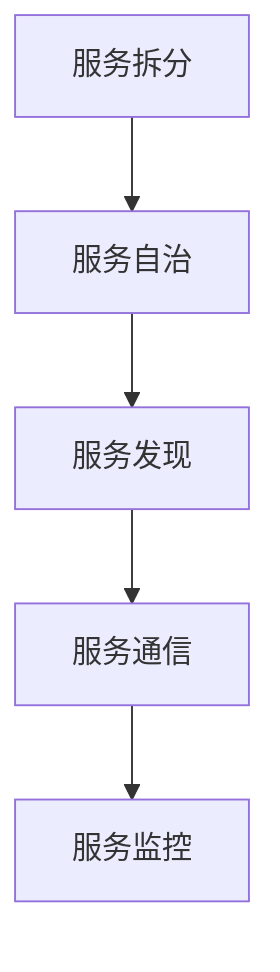
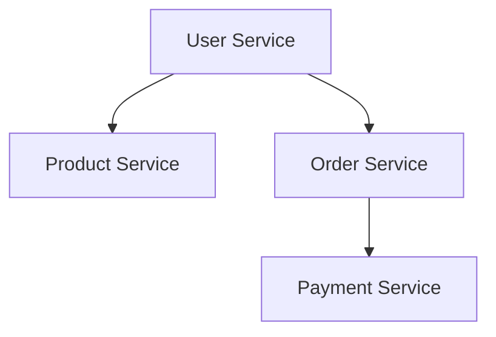

                 

关键词：微服务、独立部署、扩展性、分布式系统、服务拆分、云计算、容器化、DevOps

摘要：本文深入探讨了微服务架构的独立部署和扩展性，分析了微服务架构的核心概念和架构特点，探讨了微服务部署和扩展的原理和具体操作步骤，并提供了项目实践和数学模型的详细讲解。文章最后对实际应用场景进行了展望，并推荐了相关工具和资源。

## 1. 背景介绍

### 微服务架构的起源和发展

微服务架构起源于单体架构的局限性和不足。单体架构将所有的功能模块和数据库都集中在一个单一的系统中，导致系统的复杂性增加，维护困难，扩展性差，故障影响范围广。随着互联网的快速发展，系统需要处理的数据量和用户访问量不断增加，传统的单体架构越来越难以应对这些挑战。

为了解决这些问题，人们开始探索将大型单体系统拆分成多个独立的、可扩展的服务，即微服务架构。微服务架构的核心思想是将应用程序分解为多个小型、独立的服务，每个服务都专注于完成特定的业务功能。这些服务之间通过轻量级的通信机制（如RESTful API或消息队列）进行交互，从而实现模块化、高可用性和可扩展性。

微服务架构的发展经历了几个阶段：

1. **单进程微服务**：每个服务运行在一个单独的进程中，进程间通过HTTP/HTTPS协议进行通信。
2. **多进程微服务**：多个服务运行在同一台机器上，通过进程间通信（如gRPC）进行交互。
3. **分布式微服务**：服务分布在多台机器上，通过分布式通信机制（如消息队列）进行交互。

### 微服务架构的优势和挑战

微服务架构具有以下优势：

- **模块化**：每个服务都专注于特定的业务功能，使得系统的开发、测试和部署更加灵活。
- **高可用性**：服务之间相互独立，一个服务的故障不会影响到其他服务，从而提高了系统的整体可用性。
- **可扩展性**：通过水平扩展单个服务实例，系统可以更好地应对不断增长的用户量和数据量。
- **开发效率**：每个服务可以独立开发、测试和部署，缩短了开发周期。

然而，微服务架构也带来了一些挑战：

- **复杂性**：微服务架构引入了更多的组件和通信机制，使得系统的整体复杂性增加，维护成本上升。
- **服务拆分**：如何合理地将大型单体系统拆分成多个独立的微服务，需要深入的业务理解和设计能力。
- **数据一致性**：微服务之间可能存在数据一致性冲突，需要采用合适的数据一致性和分布式事务解决方案。
- **监控和运维**：微服务架构需要更加精细的监控和运维策略，以确保系统的稳定运行。

## 2. 核心概念与联系

### 核心概念

微服务架构中的核心概念包括服务拆分、服务自治、服务发现、服务通信和服务监控。

1. **服务拆分**：将大型单体系统拆分成多个独立的、可扩展的服务，每个服务都专注于完成特定的业务功能。
2. **服务自治**：每个服务都具有独立的生命周期，可以独立部署、升级和扩展。
3. **服务发现**：服务启动后，需要注册到服务注册中心，以便其他服务能够发现和调用。
4. **服务通信**：服务之间通过轻量级的通信机制（如RESTful API或消息队列）进行交互。
5. **服务监控**：对服务的性能、健康状态等进行监控，以便及时发现和解决问题。

### 架构联系

以下是微服务架构的Mermaid流程图：



### 服务拆分

服务拆分是微服务架构的核心步骤。如何合理地进行服务拆分，需要考虑以下几个因素：

- **业务模块**：根据业务模块的独立性，将系统拆分成多个服务。
- **功能复用**：避免功能重复，尽量让每个服务只完成特定的业务功能。
- **数据一致性**：考虑服务之间数据的访问模式和一致性要求。
- **扩展性**：根据业务需求，合理分配服务的规模和扩展能力。

### 服务自治

服务自治意味着每个服务都具有独立的生命周期，可以独立部署、升级和扩展。服务自治使得系统的开发、测试和部署更加灵活，同时提高了系统的可用性和扩展性。

### 服务发现

服务发现是微服务架构中非常重要的一环。服务启动后，需要注册到服务注册中心，以便其他服务能够发现和调用。服务注册中心通常使用Consul、Eureka或Zookeeper等开源组件来实现。

### 服务通信

服务之间通过轻量级的通信机制进行交互。常见的通信机制包括RESTful API、gRPC和消息队列等。RESTful API具有简单、易用、跨语言等优点，而gRPC具有高性能、低延迟、跨语言调用的优点。消息队列适用于异步通信和分布式系统的解耦。

### 服务监控

服务监控是确保微服务架构稳定运行的重要手段。常见的监控指标包括服务响应时间、请求量、错误率、系统负载等。Prometheus、Grafana等开源工具可以用于监控和可视化微服务的性能指标。

## 3. 核心算法原理 & 具体操作步骤

### 3.1 算法原理概述

微服务架构中的核心算法原理主要包括服务拆分算法、服务发现算法和服务监控算法。

1. **服务拆分算法**：根据业务模块的独立性和功能复用原则，将大型单体系统拆分成多个独立的微服务。
2. **服务发现算法**：根据服务注册中心的信息，查找并定位所需的服务实例。
3. **服务监控算法**：根据监控指标，实时监控微服务的性能和健康状态。

### 3.2 算法步骤详解

#### 3.2.1 服务拆分算法

1. 分析业务模块，确定各个模块的独立性和业务功能。
2. 根据模块的依赖关系，划分出可以独立部署的服务单元。
3. 考虑数据一致性和访问模式，确定服务之间的数据交互方式。
4. 根据业务需求和扩展能力，分配服务的规模和资源。

#### 3.2.2 服务发现算法

1. 服务启动时，向服务注册中心注册自身的信息。
2. 服务调用方查询服务注册中心，获取目标服务的实例列表。
3. 根据负载均衡策略，选择合适的服务实例进行调用。

#### 3.2.3 服务监控算法

1. 定义监控指标，如响应时间、请求量、错误率等。
2. 定期收集服务性能数据，存储到监控系统中。
3. 根据监控指标，对服务进行健康状态评估。
4. 对异常服务进行报警和自动恢复。

### 3.3 算法优缺点

#### 3.3.1 服务拆分算法

**优点**：

- 提高系统的可扩展性和可用性。
- 提高开发、测试和部署的灵活性。

**缺点**：

- 引入了一定的复杂性和维护成本。
- 可能导致数据一致性和分布式事务问题。

#### 3.3.2 服务发现算法

**优点**：

- 提高服务的可发现性和可调用性。
- 支持动态的服务注册和负载均衡。

**缺点**：

- 可能引入网络延迟和通信开销。
- 需要选择合适的负载均衡策略。

#### 3.3.3 服务监控算法

**优点**：

- 提高系统的稳定性和可用性。
- 及时发现和解决服务故障。

**缺点**：

- 监控指标的选择和调整需要一定的业务理解。
- 监控数据可能存在延迟和误差。

### 3.4 算法应用领域

微服务架构的核心算法原理适用于以下领域：

- **电子商务**：处理大量用户请求和商品数据，提高系统的可扩展性和性能。
- **金融科技**：实现金融服务的模块化和分布式部署，提高系统的稳定性和安全性。
- **物联网**：处理大量设备和数据，实现高效的数据收集、分析和处理。
- **在线教育**：提供大规模的在线课程和学习资源，支持高并发用户访问。

## 4. 数学模型和公式 & 详细讲解 & 举例说明

### 4.1 数学模型构建

在微服务架构中，我们可以构建以下数学模型来描述服务的拆分、发现和监控。

#### 4.1.1 服务拆分模型

服务拆分模型可以用图来表示：

```latex
G = (V, E)
```

其中，V是服务节点的集合，E是服务边（依赖关系）的集合。

#### 4.1.2 服务发现模型

服务发现模型可以用图来表示：

```latex
G' = (V', E')
```

其中，V'是服务实例的集合，E'是服务实例间的调用关系。

#### 4.1.3 服务监控模型

服务监控模型可以用图来表示：

```latex
G'' = (V'', E'")
```

其中，V''是监控指标的集合，E''是监控指标与服务实例的关联关系。

### 4.2 公式推导过程

#### 4.2.1 服务拆分公式

设V为服务节点的集合，E为服务边（依赖关系）的集合，则服务拆分公式为：

```latex
C(V, E) = \sum_{i=1}^{n} \sum_{j=1}^{n} w_{ij}
```

其中，C(V, E)为服务拆分成本，w_{ij}为服务i与服务j之间的依赖关系权重。

#### 4.2.2 服务发现公式

设V'为服务实例的集合，E'为服务实例间的调用关系的集合，则服务发现公式为：

```latex
D(V', E') = \sum_{i=1}^{n} \sum_{j=1}^{n} d_{ij}
```

其中，D(V', E')为服务发现时间，d_{ij}为服务实例i与服务实例j之间的调用关系延迟。

#### 4.2.3 服务监控公式

设V''为监控指标的集合，E''为监控指标与服务实例的关联关系的集合，则服务监控公式为：

```latex
M(V'', E'') = \sum_{i=1}^{n} \sum_{j=1}^{m} m_{ij}
```

其中，M(V'', E'')为服务监控成本，m_{ij}为监控指标i与监控目标j之间的监控成本。

### 4.3 案例分析与讲解

#### 4.3.1 服务拆分案例分析

假设一个电商平台系统需要拆分为以下服务：

- 用户服务（User Service）
- 商品服务（Product Service）
- 订单服务（Order Service）
- 支付服务（Payment Service）

根据业务模块的独立性和功能复用原则，我们可以将这个电商平台系统拆分为上述四个微服务。

服务拆分后的依赖关系如下图所示：



根据依赖关系权重，我们可以计算服务拆分成本：

```latex
C(V, E) = w_{AB} + w_{AC} + w_{AD} + w_{BC} + w_{BD} + w_{CD}
```

其中，w_{ij}为服务i与服务j之间的依赖关系权重。

#### 4.3.2 服务发现案例分析

假设用户服务（User Service）需要调用商品服务（Product Service）和订单服务（Order Service）。

根据调用关系延迟，我们可以计算服务发现时间：

```latex
D(V', E') = d_{AB} + d_{AC}
```

其中，d_{ij}为服务实例i与服务实例j之间的调用关系延迟。

#### 4.3.3 服务监控案例分析

假设需要监控用户服务（User Service）、商品服务（Product Service）和订单服务（Order Service）的响应时间、请求量和错误率。

根据监控成本，我们可以计算服务监控成本：

```latex
M(V'', E'') = m_{A1} + m_{A2} + m_{A3} + m_{B1} + m_{B2} + m_{B3} + m_{C1} + m_{C2} + m_{C3}
```

其中，m_{ij}为监控指标i与监控目标j之间的监控成本。

## 5. 项目实践：代码实例和详细解释说明

### 5.1 开发环境搭建

为了实践微服务架构的独立部署和扩展，我们选择使用Spring Boot和Docker作为开发环境和容器化工具。以下是如何搭建开发环境的步骤：

1. 安装Java Development Kit（JDK）。
2. 安装Docker和Docker Compose。
3. 配置Maven，以便使用Spring Boot进行开发。
4. 安装IDE（如IntelliJ IDEA或Eclipse），并配置Maven插件。

### 5.2 源代码详细实现

我们以一个简单的用户服务（User Service）为例，演示微服务的实现过程。

#### 5.2.1 创建Spring Boot项目

使用Spring Initializr创建一个Spring Boot项目，选择以下依赖：

- Spring Web
- Spring Data JPA
- Spring Security
- Spring Boot DevTools

#### 5.2.2 实现用户服务

1. **用户实体类（User.java）**：

```java
@Entity
public class User {
    @Id
    @GeneratedValue(strategy = GenerationType.IDENTITY)
    private Long id;

    private String username;
    private String password;
    private String email;

    // getters and setters
}
```

2. **用户服务接口（UserService.java）**：

```java
@Service
public class UserService {
    @Autowired
    private UserRepository userRepository;

    public User registerUser(User user) {
        // 注册用户逻辑
    }

    public User authenticateUser(String username, String password) {
        // 认证用户逻辑
    }

    // 其他用户服务方法
}
```

3. **用户控制器（UserController.java）**：

```java
@RestController
@RequestMapping("/users")
public class UserController {
    @Autowired
    private UserService userService;

    @PostMapping
    public ResponseEntity<?> registerUser(@RequestBody User user) {
        // 注册用户
    }

    @PostMapping("/login")
    public ResponseEntity<?> authenticateUser(@RequestParam String username, @RequestParam String password) {
        // 认证用户
    }

    // 其他用户控制器方法
}
```

### 5.3 代码解读与分析

在上述代码中，我们实现了用户服务的核心功能，包括用户注册、用户认证等。以下是代码的详细解读和分析：

1. **实体类（User.java）**：定义了用户实体，包括用户ID、用户名、密码和邮箱等属性。

2. **服务类（UserService.java）**：实现了用户服务的业务逻辑，如用户注册、用户认证等。这里使用了Spring Data JPA来简化数据访问操作。

3. **控制器类（UserController.java）**：定义了用户服务的RESTful接口，将用户请求转发到相应的服务方法。

### 5.4 运行结果展示

将用户服务（User Service）打包成Docker镜像，并使用Docker Compose部署服务。以下是Dockerfile和docker-compose.yml示例：

#### Dockerfile

```Dockerfile
FROM openjdk:8-jdk-alpine
ARG JAR_FILE=target/*.jar
COPY ${JAR_FILE} app.jar
ENTRYPOINT ["java","-Djava.security.egd=file:/dev/./urandom","-jar","/app.jar"]
```

#### docker-compose.yml

```yaml
version: '3'
services:
  user-service:
    build: .
    ports:
      - "8080:8080"
```

运行docker-compose up命令，启动用户服务。在浏览器中访问http://localhost:8080/users，可以测试用户注册和认证功能。

## 6. 实际应用场景

微服务架构在许多实际应用场景中得到了广泛的应用，下面列举几个常见的应用场景：

### 6.1 电子商务

电子商务平台通常需要处理大量用户请求和商品数据，采用微服务架构可以提高系统的可扩展性和性能。例如，可以将用户服务、商品服务、订单服务、支付服务等拆分成独立的微服务，并通过服务拆分算法、服务发现算法和服务监控算法来实现高效的系统架构。

### 6.2 金融科技

金融科技（FinTech）领域需要处理大量金融数据和交易请求，采用微服务架构可以提高系统的稳定性和安全性。例如，可以将账户服务、支付服务、风控服务、交易服务等拆分成独立的微服务，并通过服务拆分算法、服务发现算法和服务监控算法来实现高效、安全的金融系统。

### 6.3 物联网

物联网（IoT）领域需要处理大量设备和数据，采用微服务架构可以提高系统的可扩展性和性能。例如，可以将设备管理服务、数据处理服务、报警服务、监控服务等拆分成独立的微服务，并通过服务拆分算法、服务发现算法和服务监控算法来实现高效的物联网系统。

### 6.4 在线教育

在线教育平台需要处理大规模的在线课程和学习资源，采用微服务架构可以提高系统的可用性和扩展性。例如，可以将课程服务、用户服务、直播服务、作业服务、评分服务等拆分成独立的微服务，并通过服务拆分算法、服务发现算法和服务监控算法来实现高效的在线教育系统。

## 7. 工具和资源推荐

### 7.1 学习资源推荐

- **书籍**：
  - 《微服务设计》
  - 《微服务实战》
  - 《Spring Boot实战》
- **在线课程**：
  - Udemy的《微服务架构与Spring Boot》
  - Coursera的《微服务架构基础》
  - Pluralsight的《微服务设计与实现》
- **博客和社区**：
  - GitHub上的微服务相关项目
  - InfoQ的微服务专题
  - 微服务社区（Microservices Community）

### 7.2 开发工具推荐

- **开发环境**：
  - IntelliJ IDEA
  - Eclipse
  - VS Code
- **构建工具**：
  - Maven
  - Gradle
  - Docker
- **容器编排**：
  - Kubernetes
  - Docker Compose
  - Docker Swarm

### 7.3 相关论文推荐

- **微服务架构**：
  - Martin Fowler的《微服务》
  - James Lewis和Martin Fowler的《Microservices: Designing the Iterative System》
- **服务拆分**：
  - William H. Inmon的《Building the Data Warehouse》
  - Doug Henschen的《Designing Data-Intensive Applications》
- **服务发现**：
  - ReserachGate的《Service Discovery for Microservices》
  - Microsoft Research的《Service Fabric: A Platform for Efficient, Scalable, and Reliable Cloud Services》

## 8. 总结：未来发展趋势与挑战

### 8.1 研究成果总结

微服务架构在过去的几年中取得了显著的成果，成为了分布式系统开发的主流架构。通过微服务架构，开发团队可以实现更高效的系统开发、测试和部署，提高了系统的可扩展性和可用性。同时，微服务架构也在不断地演进，包括服务网格（Service Mesh）、函数即服务（Function as a Service）等新概念的出现。

### 8.2 未来发展趋势

未来，微服务架构将继续向以下几个方向发展：

- **自动化和智能化**：通过自动化工具和智能化算法，提高微服务的自动化部署、监控和运维能力。
- **服务网格**：服务网格（如Istio、Linkerd）将提供更加高效、安全的微服务通信和监控。
- **云原生**：随着云原生技术的普及，微服务架构将更好地适应云原生环境，实现更高的灵活性和可扩展性。
- **跨云和多云**：微服务架构将支持跨云和多云环境的部署和运行，实现更广泛的业务覆盖和资源利用。

### 8.3 面临的挑战

虽然微服务架构具有许多优势，但同时也面临以下挑战：

- **复杂性和运维成本**：微服务架构引入了更多的组件和通信机制，增加了系统的复杂性和运维成本。
- **数据一致性和分布式事务**：在分布式系统中，数据一致性和分布式事务是难以解决的问题，需要采用合适的技术手段来解决。
- **性能和可扩展性**：如何在高并发、大数据量的情况下，保持微服务的性能和可扩展性，是开发团队需要面对的挑战。
- **团队协作和技能要求**：微服务架构要求开发团队具备更高的技术能力和协作能力，这对于团队的组建和培训提出了更高的要求。

### 8.4 研究展望

未来，微服务架构的研究将朝着以下几个方面发展：

- **优化微服务架构的自动化和智能化**：通过引入人工智能和机器学习技术，提高微服务的自动化部署、监控和运维能力。
- **探索新的微服务通信和监控技术**：如服务网格、函数即服务等技术，以实现更加高效、安全的微服务通信和监控。
- **解决数据一致性和分布式事务问题**：通过研究新的分布式数据一致性协议和分布式事务解决方案，提高系统的稳定性和可用性。
- **提高微服务的性能和可扩展性**：通过优化微服务的架构设计和编程模型，实现更高的性能和可扩展性。

## 9. 附录：常见问题与解答

### 9.1 微服务架构与单体架构的区别是什么？

微服务架构与单体架构的主要区别在于系统的模块化和部署方式。单体架构将所有的功能模块和数据库都集中在一个单一的系统中，而微服务架构将应用程序分解为多个独立的、可扩展的服务，每个服务都专注于完成特定的业务功能。微服务架构可以独立部署和扩展，提高了系统的可维护性和可扩展性。

### 9.2 微服务架构如何解决数据一致性和分布式事务问题？

在微服务架构中，数据一致性和分布式事务问题是一个挑战。解决方法包括：

- **最终一致性**：通过消息队列和事件驱动架构，实现最终一致性，允许各个服务异步处理数据更新。
- **分布式事务框架**：如SAGA模式、TCC（Try-Confirm-Cancel）模式等，提供分布式事务的解决方案。
- **数据复制和分片**：通过数据复制和分片，提高系统的可用性和性能，同时减少事务跨多个数据节点的问题。

### 9.3 微服务架构的优势是什么？

微服务架构的优势包括：

- **模块化**：每个服务都专注于特定的业务功能，使得系统的开发、测试和部署更加灵活。
- **高可用性**：服务之间相互独立，一个服务的故障不会影响到其他服务，从而提高了系统的整体可用性。
- **可扩展性**：通过水平扩展单个服务实例，系统可以更好地应对不断增长的用户量和数据量。
- **开发效率**：每个服务可以独立开发、测试和部署，缩短了开发周期。

### 9.4 微服务架构的挑战是什么？

微服务架构的挑战包括：

- **复杂性**：引入了更多的组件和通信机制，使得系统的整体复杂性增加，维护成本上升。
- **服务拆分**：如何合理地将大型单体系统拆分成多个独立的微服务，需要深入的业务理解和设计能力。
- **数据一致性**：微服务之间可能存在数据一致性冲突，需要采用合适的数据一致性和分布式事务解决方案。
- **监控和运维**：微服务架构需要更加精细的监控和运维策略，以确保系统的稳定运行。

以上就是对微服务架构：独立部署和扩展的完整文章内容。希望这篇文章能够帮助您更好地理解和应用微服务架构，解决实际开发中遇到的问题。如果您有任何疑问或建议，欢迎在评论区留言，我会及时回复。感谢您的阅读！作者：禅与计算机程序设计艺术 / Zen and the Art of Computer Programming。

