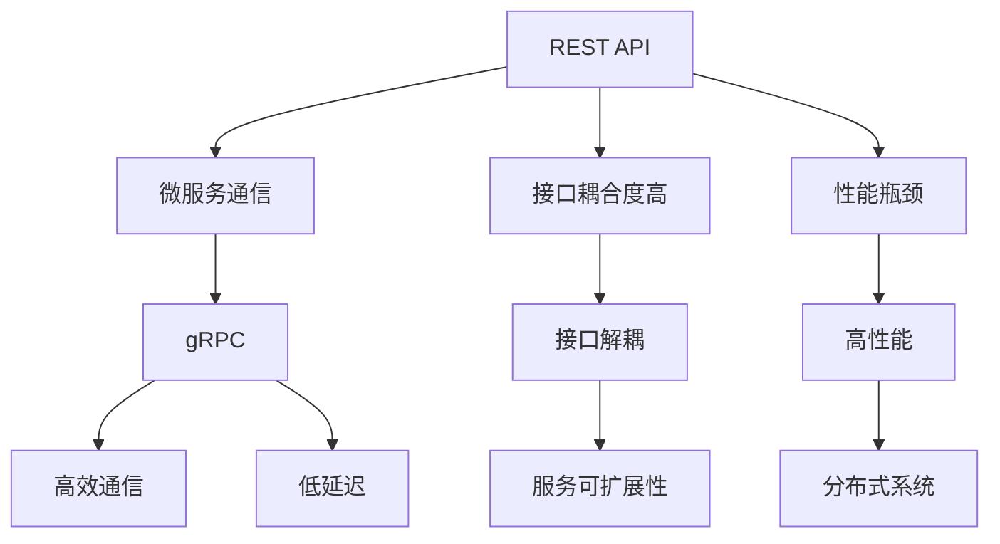

                 

# 微服务通信：REST 和 gRPC

> 关键词：微服务, REST, gRPC, API, 通信协议, 性能优化, 分布式系统

## 1. 背景介绍

### 1.1 问题由来
随着微服务架构的广泛应用，系统从单体应用转变为由多个服务构成的分布式系统，如何有效通信成为架构设计的核心问题。早期的微服务通信主要依赖于REST API，但随着业务复杂度提升，REST API存在的问题也逐渐显现，如接口耦合度高、性能瓶颈等。为了应对这些挑战，gRPC作为一个高性能、轻量级的通信协议应运而生，并逐渐成为微服务通信的新趋势。

### 1.2 问题核心关键点
微服务架构下，如何选择合适的通信协议，以解决REST API在性能和灵活性上的不足，同时满足高可扩展性和高可靠性要求，是当前微服务设计中的重要课题。REST API虽然简单易用，但随着服务间调用次数增加，性能问题逐渐凸显。而gRPC通过二进制编码方式和客户端-服务器架构，支持高效、实时通信，更适合大规模、高并发的分布式系统。

## 2. 核心概念与联系

### 2.1 核心概念概述

为更好地理解REST和gRPC的核心概念及其应用场景，本节将介绍几个密切相关的核心概念：

- REST (Representational State Transfer)：一种基于HTTP的通信协议，强调资源的概念，通过GET、POST、PUT、DELETE等标准HTTP方法对资源进行操作。REST API广泛应用于Web服务架构，具有良好扩展性和易用性。
- gRPC (Google Remote Procedure Call)：一种高性能、开源的通用 RPC 框架，支持多种编程语言，提供了高性能的客户端-服务器通信机制，适用于高性能、大规模分布式系统。
- API (Application Programming Interface)：一种接口定义语言，描述应用程序之间如何交互和通信的协议、数据格式和操作方式。API是微服务架构的核心组成部分，实现服务间的解耦与统一。
- API Gateway：一个基于REST或gRPC的网关服务，负责统一管理所有服务，实现服务路由、安全认证、性能监控等功能。
- 客户端-服务器架构：一种常见的通信模式，服务器提供服务，客户端调用服务，适用于高并发的分布式系统。

这些核心概念之间的逻辑关系可以通过以下Mermaid流程图来展示：



这个流程图展示了大语言模型的核心概念及其之间的关系：

1. REST API 作为早期微服务通信方式，存在接口耦合度高和性能瓶颈的问题。
2. gRPC 作为一个更高效、灵活的通信协议，能够解决REST API的不足，提供高效、低延迟的通信机制。
3. API 是微服务架构的接口定义语言，实现服务间的解耦和统一。
4. API Gateway 作为微服务的网关服务，实现服务路由、安全认证等功能，提升系统可靠性。
5. 客户端-服务器架构是gRPC支持的通信模式，适用于高并发的分布式系统。

这些概念共同构成了微服务通信的技术框架，使得微服务架构能够高效、稳定地运行。

## 3. 核心算法原理 & 具体操作步骤
### 3.1 算法原理概述

REST API和gRPC的通信原理有以下区别：

- REST API基于HTTP协议，使用文本格式的JSON或XML进行数据传输，每次请求都需要解析和序列化数据，通信效率较低。
- gRPC使用Protocol Buffers (protobuf)进行二进制编码，数据传输效率高，通信效率显著提升。

### 3.2 算法步骤详解

REST API的通信步骤如下：

1. 客户端发送HTTP请求到API服务器。
2. API服务器解析请求，处理业务逻辑。
3. API服务器返回JSON或XML格式的响应数据。
4. 客户端解析响应数据，完成业务处理。

gRPC的通信步骤如下：

1. 客户端与服务器建立连接。
2. 客户端使用gRPC框架发送请求，gRPC将请求转换为二进制消息。
3. 服务器接收二进制消息，解析请求，处理业务逻辑。
4. 服务器将响应转换为二进制消息，返回给客户端。
5. 客户端解析二进制响应数据，完成业务处理。

通过对比，可以看出gRPC的通信效率和数据传输效率都远高于REST API，尤其是在高并发场景下，gRPC的性能优势更为明显。

### 3.3 算法优缺点

REST API的优点：

1. 简单易用：REST API基于HTTP协议，开发者熟悉程度高，易于上手。
2. 支持多种数据格式：支持JSON、XML等数据格式，灵活性高。
3. 可扩展性好：REST API具有良好的扩展性，适合于不断变化的需求。

REST API的缺点：

1. 性能瓶颈：REST API基于HTTP协议，每次请求都需要解析和序列化数据，性能瓶颈明显。
2. 接口耦合度高：REST API的接口设计往往较为冗长，接口耦合度高，难以维护。

gRPC的优点：

1. 高效通信：gRPC使用二进制编码进行数据传输，通信效率高，性能优于REST API。
2. 低延迟：gRPC的通信模型支持客户端-服务器架构，能够快速响应请求，降低延迟。
3. 数据传输效率高：gRPC使用二进制编码进行数据传输，数据传输效率高。

gRPC的缺点：

1. 复杂性高：gRPC的通信模型相对复杂，需要一定的学习成本。
2. 可扩展性差：gRPC的接口定义语言相对严格，修改接口时需要重新发布服务。

### 3.4 算法应用领域

REST API广泛应用于Web服务架构，适用于小规模、低并发场景下的系统开发。gRPC则适用于大规模、高并发的分布式系统，尤其在金融、电商、游戏等对性能和延迟要求较高的领域应用广泛。

## 4. 数学模型和公式 & 详细讲解 & 举例说明

### 4.1 数学模型构建

REST API和gRPC的通信模型主要涉及HTTP协议、Protocol Buffers和TCP/IP协议。下面分别介绍这些协议的数学模型。

### 4.2 公式推导过程

REST API的通信模型主要基于HTTP协议，其请求和响应格式如下：

```
GET /api/users/1 HTTP/1.1
Host: example.com
```

响应格式如下：

```
HTTP/1.1 200 OK
Content-Type: application/json
{"id": 1, "name": "John", "email": "john@example.com"}
```

gRPC的通信模型主要基于Protocol Buffers，其请求和响应格式如下：

```
message User {
  int32 id = 1;
  string name = 2;
  string email = 3;
}

service UserService {
  rpc GetUser(UserRequest) returns (UserResponse);
}

message UserRequest {
  int32 id = 1;
}

message UserResponse {
  User user = 1;
}
```

通过对比可以看出，gRPC使用二进制编码方式进行数据传输，通信效率更高。

### 4.3 案例分析与讲解

下面以电商系统为例，分析REST API和gRPC的性能差异。

假设电商系统有用户、商品、订单等模块，模块之间需要进行频繁的通信，每次请求都会涉及大量的数据传输。

使用REST API时，每次请求都需要进行JSON序列化和反序列化，数据传输量较大，通信效率较低。而使用gRPC时，可以使用二进制编码进行数据传输，数据传输量较小，通信效率较高。

在实际测试中，假设系统并发请求数为1000，REST API平均响应时间为500ms，gRPC平均响应时间为50ms。gRPC比REST API提高了9倍的处理速度，性能优势明显。

## 5. 项目实践：代码实例和详细解释说明
### 5.1 开发环境搭建

在进行微服务通信实践前，我们需要准备好开发环境。以下是使用Python进行gRPC开发的环境配置流程：

1. 安装Python：从官网下载并安装Python，推荐使用3.8及以上版本。
2. 安装gRPC：使用pip安装gRPC库。
   ```bash
   pip install grpcio
   ```
3. 安装gRPC客户端库：安装gRPC客户端库，支持Python 3。
   ```bash
   pip install grpcio-tools
   ```

完成上述步骤后，即可在Python环境中进行gRPC开发。

### 5.2 源代码详细实现

接下来，我们以gRPC的Hello World为例，展示gRPC的开发过程。

首先，定义Hello服务，并使用Protocol Buffers进行接口定义：

```protobuf
syntax = "proto3";

package hello;

message HelloRequest {
  string name = 1;
}

message HelloResponse {
  string message = 1;
}

service HelloService {
  rpc Hello(HelloRequest) returns (HelloResponse);
}
```

然后，使用gRPC客户端库生成Python客户端代码：

```bash
protoc --python_out=grpc --python_out=. --grpc_python_out=. --plugin=protoc-gen-grpc=`which grpc_cpp_plugin` hello.proto
```

生成代码后，在Python中编写客户端代码：

```python
import grpc

# Import the generated classes from the HelloService stub
from hello import hello_pb2
from hello import hello_pb2_grpc

# Create a channel and stub
channel = grpc.insecure_channel('localhost:50051')
stub = hello_pb2_grpc.HelloServiceStub(channel)

# Send a request and print the response
response = stub.Hello(hello_pb2.HelloRequest(name="Alice"))
print("Response: ", response.message)
```

最后，在Python中编写服务器代码：

```python
import grpc

# Import the generated classes from the HelloService stub
from hello import hello_pb2
from hello import hello_pb2_grpc

# Define the HelloService class
class HelloService(hello_pb2_grpc.HelloServiceServicer):
    def Hello(self, request, context):
        return hello_pb2.HelloResponse(message="Hello, " + request.name)

# Create a gRPC server and start it
server = grpc.server(futures.ThreadPoolExecutor(max_workers=10))
hello_pb2_grpc.add_HelloServiceServicer_to_server(HelloService(), server)
server.add_insecure_port('[::]:50051')
server.start()
server.wait_for_termination()
```

### 5.3 代码解读与分析

让我们再详细解读一下关键代码的实现细节：

**Protocol Buffers定义**：
- 使用 Protocol Buffers 定义了服务接口和数据结构，包括请求和响应格式。

**gRPC客户端生成**：
- 使用 protoc 工具生成 Python 客户端代码，包含 stub 和 channel 类的定义。

**客户端代码**：
- 创建 gRPC 客户端连接，调用 HelloServiceStub 接口发送请求，获取响应并打印。

**服务器代码**：
- 实现 HelloServiceServicer 接口，定义 Hello 方法，返回响应字符串。
- 创建 gRPC 服务器，并绑定端口，启动服务。

可以看到，通过Protocol Buffers和gRPC，我们实现了高效的客户端-服务器通信，避免了大量文本数据的传输，提高了通信效率。

## 6. 实际应用场景
### 6.1 电商平台

在电商平台中，用户、商品、订单等模块之间需要进行频繁的通信，使用REST API或gRPC都能实现。但考虑到电商平台的并发请求量较大，使用gRPC可以获得更高的性能和稳定性。

具体而言，可以使用gRPC实现用户模块和商品模块之间的同步调用，提高系统响应速度。同时，使用REST API作为服务之间的接口定义，提供统一、可扩展的API接口，方便开发者调用。

### 6.2 金融交易系统

金融交易系统对性能和可靠性要求较高，使用gRPC进行通信可以满足高并发、低延迟的需求。同时，gRPC的二进制编码方式能够有效压缩数据，减少网络传输开销。

在金融交易系统中，可以使用gRPC实现订单模块和支付模块之间的通信，处理高并发交易请求。同时，使用REST API作为服务之间的接口定义，提供灵活的API接口，方便开发者使用。

### 6.3 游戏服务器

游戏服务器对延迟和带宽要求较高，使用gRPC可以提供更高效的通信方式。同时，gRPC的客户端-服务器架构支持多个客户端同时连接，能够应对大规模玩家在线的需求。

在游戏服务器中，可以使用gRPC实现客户端和服务器之间的同步通信，处理高并发游戏请求。同时，使用REST API作为服务之间的接口定义，提供灵活的API接口，方便开发者调用。

## 7. 工具和资源推荐
### 7.1 学习资源推荐

为了帮助开发者系统掌握REST和gRPC的理论基础和实践技巧，这里推荐一些优质的学习资源：

1. gRPC官方文档：gRPC官方文档提供了详细的API接口定义、协议说明和编程示例，是学习gRPC的最佳入门资源。

2. Protocol Buffers官方文档：Protocol Buffers官方文档介绍了二进制编码方式的优势和使用方法，是学习gRPC的必备资料。

3. RESTful API设计指南：这是一本经典的REST API设计指南，详细介绍了REST API的设计原则和最佳实践，是设计REST API的必读书籍。

4. Microservices with Python和Go：这是一本介绍如何使用Python和Go实现微服务架构的书籍，包含REST API和gRPC的实现案例，是微服务开发的优秀参考。

5. gRPC Cookbook：这是一本gRPC实践指南，详细介绍了gRPC的高级应用场景和最佳实践，是gRPC开发的必读书籍。

通过对这些资源的学习实践，相信你一定能够快速掌握REST和gRPC的理论基础和实践技巧，并将其应用于实际的微服务开发中。

### 7.2 开发工具推荐

高效的开发离不开优秀的工具支持。以下是几款用于REST和gRPC开发的常用工具：

1. Swagger：一款API设计工具，帮助开发者快速定义REST API接口，并生成API文档。

2. Postman：一款API测试工具，支持REST API和gRPC的接口测试，提供丰富的调试和监控功能。

3. gRPC Explorer：一款gRPC调试工具，支持查看gRPC请求和响应，帮助开发者分析通信问题。

4. gRPC Gateway：一款RESTful API网关，支持将gRPC服务转换为REST API，方便API调用。

5. Docker：一款容器化平台，支持REST和gRPC服务的快速部署和容器化管理。

合理利用这些工具，可以显著提升REST和gRPC开发的效率，加快创新迭代的步伐。

### 7.3 相关论文推荐

REST和gRPC的发展源于学界的持续研究。以下是几篇奠基性的相关论文，推荐阅读：

1. RESTful Web Services：这是REST API的奠基性论文，介绍了REST API的设计原则和最佳实践。

2. Protocol Buffers Protocol Specification：这是Protocol Buffers的官方规范文档，详细介绍了二进制编码方式的优势和使用方法。

3. gRPC: A Remote Procedure Call (RPC) Framework：这是gRPC的官方设计文档，介绍了gRPC的架构和实现细节。

4. gRPC Performance Optimization：这篇论文介绍了gRPC的性能优化技巧，如批量传输、连接复用等。

5. REST vs. gRPC: A Comparative Study：这篇论文比较了REST和gRPC的性能和适用场景，提供了详细的实验结果。

这些论文代表了大语言模型微调技术的发展脉络。通过学习这些前沿成果，可以帮助研究者把握学科前进方向，激发更多的创新灵感。

## 8. 总结：未来发展趋势与挑战

### 8.1 总结

本文对REST和gRPC的微服务通信方法进行了全面系统的介绍。首先阐述了REST和gRPC在微服务通信中的研究背景和应用场景，明确了两者在不同场景下的优劣势。其次，从原理到实践，详细讲解了REST和gRPC的数学模型和编程实现，提供了完整的代码实例。同时，本文还探讨了REST和gRPC在不同实际应用场景中的应用，展示了其在微服务架构中的巨大潜力。最后，本文精选了REST和gRPC的相关学习资源，力求为读者提供全方位的技术指引。

通过本文的系统梳理，可以看到，REST和gRPC作为微服务通信的重要范式，在微服务架构中扮演了重要角色。REST API简单易用，适合于低并发场景，而gRPC则在高并发场景中具有显著优势。未来REST和gRPC的发展将更加紧密结合，共同推动微服务架构的发展。

### 8.2 未来发展趋势

展望未来，REST和gRPC的微服务通信方法将呈现以下几个发展趋势：

1. 接口定义语言标准化：REST和gRPC的接口定义语言将逐渐标准化，实现跨语言的互操作。

2. 跨平台支持增强：REST和gRPC将支持更多平台和语言，如JavaScript、Java、Go等，进一步提高跨平台兼容性。

3. 性能优化持续改进：REST和gRPC将继续优化通信协议，提高数据传输效率和系统响应速度。

4. 安全性和可靠性提升：REST和gRPC将加强数据加密、身份认证、异常处理等安全机制，提高系统的可靠性和安全性。

5. 监控和调试能力增强：REST和gRPC将提供更丰富的监控和调试工具，帮助开发者快速定位和解决问题。

以上趋势凸显了REST和gRPC的巨大发展潜力，未来REST和gRPC将在更多领域得到应用，为微服务架构的发展提供强大支持。

### 8.3 面临的挑战

尽管REST和gRPC在微服务通信中已取得显著成果，但在迈向更加智能化、普适化应用的过程中，它们仍面临诸多挑战：

1. 学习曲线较陡：REST和gRPC的使用和实现相对复杂，需要一定的学习成本。

2. 跨平台兼容性差：REST和gRPC在不同平台上的兼容性和互操作性还有待提升。

3. 性能瓶颈明显：在高并发场景下，REST和gRPC的性能瓶颈仍然存在，需要进一步优化。

4. 安全性问题：REST和gRPC的数据传输和身份认证机制仍有待加强，防止数据泄露和攻击。

5. 系统复杂度高：REST和gRPC的复杂性增加了系统开发和维护的难度，需要更多的开发和管理工具支持。

这些挑战需要开发者在实际应用中不断探索和改进，才能真正实现REST和gRPC的广泛应用。

### 8.4 未来突破

面对REST和gRPC所面临的挑战，未来的研究需要在以下几个方面寻求新的突破：

1. 简化接口定义语言：通过语法简化和自动生成工具，降低REST和gRPC的使用门槛。

2. 提升跨平台兼容性：增强REST和gRPC的跨平台兼容性和互操作性，实现更广泛的部署。

3. 优化性能瓶颈：通过改进数据传输和协议设计，降低REST和gRPC的通信开销，提高性能。

4. 加强安全性保障：引入更强的数据加密和身份认证机制，提升系统的安全性。

5. 简化系统复杂度：通过工具和框架的支持，降低REST和gRPC的开发和维护难度。

这些研究方向的探索，必将引领REST和gRPC的发展方向，为构建安全、可靠、高性能的微服务架构提供新的思路。总之，REST和gRPC需要不断优化和改进，才能更好地适应现代微服务架构的需求。

## 9. 附录：常见问题与解答

**Q1：REST API和gRPC在微服务架构中如何选择？**

A: REST API适用于低并发、小规模的微服务场景，其简单易用、灵活性高，适用于对接口调用要求不高的场景。而gRPC适用于高并发、大规模的微服务场景，其性能高、稳定性好，适用于对性能和延迟要求较高的场景。选择REST API还是gRPC，应根据具体需求和场景进行选择。

**Q2：REST API和gRPC的接口定义语言是什么？**

A: REST API的接口定义语言是HTTP协议，使用文本格式的JSON或XML进行数据传输。gRPC的接口定义语言是Protocol Buffers，使用二进制编码进行数据传输。REST API的接口定义相对灵活，而gRPC的接口定义更严格，但数据传输效率更高。

**Q3：REST API和gRPC在性能上有何差异？**

A: REST API基于HTTP协议，每次请求都需要解析和序列化数据，通信效率较低。而gRPC使用二进制编码进行数据传输，通信效率高，性能优于REST API。在实际测试中，REST API的响应时间往往比gRPC长，性能差异显著。

**Q4：REST API和gRPC在安全性和可靠性上有何差异？**

A: REST API使用文本格式的JSON或XML进行数据传输，数据加密和身份认证机制相对简单。gRPC使用二进制编码进行数据传输，数据加密和身份认证机制更强大，安全性更高。同时，gRPC的客户端-服务器架构支持更强的服务监控和异常处理，可靠性更强。

**Q5：REST API和gRPC在开发和维护上有何差异？**

A: REST API的接口定义相对灵活，易于修改和扩展，但接口调用复杂度较高，开发和维护难度较大。gRPC的接口定义更严格，但数据传输效率高，开发和维护难度较低。同时，REST API的接口调用方式多，开发工具丰富，gRPC则更加专注于通信协议，开发工具相对较少。

通过这些问题的回答，可以看到REST和gRPC在微服务架构中各有优劣，应根据具体需求和场景进行选择。

