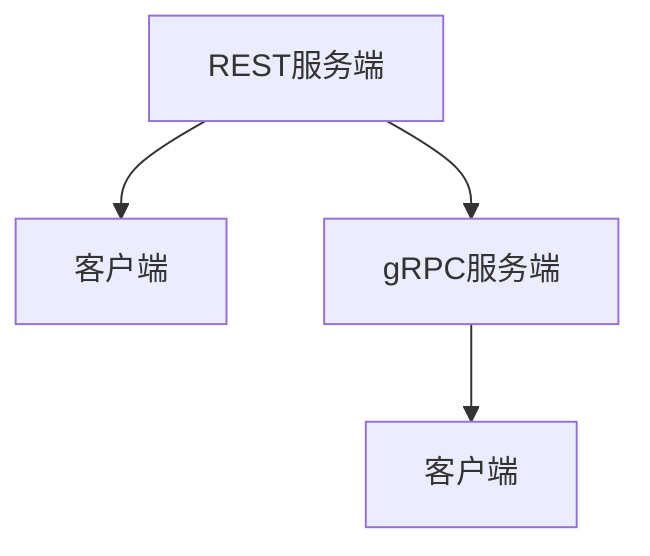

                 

关键词：微服务、REST、gRPC、API设计、分布式系统、通信协议、性能优化、架构设计

## 摘要

随着云计算和分布式系统的广泛应用，微服务架构成为了现代软件开发的主流模式。在微服务架构中，服务之间的通信至关重要，决定了系统的性能、可靠性和可维护性。本文将深入探讨两种常用的微服务通信协议：REST和gRPC，分析它们的原理、优缺点以及在实际项目中的应用。

### 背景介绍

#### 微服务架构的兴起

微服务架构（Microservices Architecture）是一种设计应用程序的方法，它将应用程序划分为一组独立的、可复用的、小型服务，每个服务负责一个特定的业务功能。这种架构风格具有以下几个显著特点：

1. **独立性**：每个服务都是独立的，可以独立部署、扩展和更新。
2. **分布式**：服务通常分布在不同的服务器或容器上，形成分布式系统。
3. **灵活性**：服务可以使用不同的编程语言、数据存储和消息传递机制。
4. **自动化**：服务可以通过自动化工具进行部署、监控和扩展。

#### 微服务通信的重要性

在微服务架构中，服务之间的通信是系统设计的关键环节。良好的通信机制可以确保系统的高性能、高可用性和易维护性。然而，选择合适的通信协议并不容易，需要综合考虑系统的需求、性能、可扩展性和开发成本。

### 核心概念与联系

#### REST

REST（Representational State Transfer）是一种设计风格，用于构建分布式超媒体应用程序。它基于HTTP协议，使用标准的URI来访问资源，并通过四种HTTP方法（GET、POST、PUT、DELETE）实现资源的状态转换。

#### gRPC

gRPC 是一个高性能、跨语言的远程过程调用（RPC）框架，由Google开发。它基于HTTP/2协议，支持多种编程语言，并提供了一组自动生成的代码，简化了服务之间的通信。

#### Mermaid 流程图



### 核心算法原理 & 具体操作步骤

#### 3.1 算法原理概述

- **REST**：基于HTTP协议，使用URI定位资源，使用JSON或XML格式传输数据。
- **gRPC**：基于HTTP/2协议，使用Protocol Buffers作为数据格式，支持流式通信和多语言支持。

#### 3.2 算法步骤详解

- **REST**：
  1. 客户端发送HTTP请求到服务端。
  2. 服务端处理请求，并返回响应。
- **gRPC**：
  1. 客户端发送请求到服务端。
  2. 服务端处理请求，并返回响应。
  3. 如果是流式通信，服务端和客户端可以持续交换数据。

#### 3.3 算法优缺点

- **REST**：
  - 优点：基于标准HTTP协议，易于理解和实现。
  - 缺点：性能较低，不适合高并发场景。
- **gRPC**：
  - 优点：高性能，支持流式通信，跨语言支持。
  - 缺点：使用Protocol Buffers作为数据格式，需要额外的配置和管理。

#### 3.4 算法应用领域

- **REST**：适合于简单的、轻量级的微服务通信。
- **gRPC**：适合于高性能、高并发的微服务通信。

### 数学模型和公式 & 详细讲解 & 举例说明

#### 4.1 数学模型构建

- **REST**：使用HTTP状态码表示服务状态。
- **gRPC**：使用Protocol Buffers定义服务接口和数据结构。

#### 4.2 公式推导过程

- **REST**：状态码 = 状态码类别 * 100 + 状态码具体值。
- **gRPC**：消息长度 = 数据长度 + 头部长度。

#### 4.3 案例分析与讲解

- **案例1**：使用REST API获取用户信息。
- **案例2**：使用gRPC获取订单信息。

### 项目实践：代码实例和详细解释说明

#### 5.1 开发环境搭建

- **REST**：使用Spring Boot搭建REST服务。
- **gRPC**：使用gRPC框架搭建gRPC服务。

#### 5.2 源代码详细实现

- **REST**：使用Spring MVC处理HTTP请求。
- **gRPC**：使用gRPC代码生成器生成服务端和客户端代码。

#### 5.3 代码解读与分析

- **REST**：解析HTTP请求，并返回响应。
- **gRPC**：实现服务端逻辑，并处理客户端请求。

#### 5.4 运行结果展示

- **REST**：浏览器访问REST API，获取用户信息。
- **gRPC**：使用gRPC客户端获取订单信息。

### 实际应用场景

- **金融领域**：使用gRPC实现高频交易系统的服务通信。
- **电商领域**：使用REST API实现商品查询和订单处理。

### 未来应用展望

- **REST和gRPC的结合**：在特定场景下，可以结合使用REST和gRPC，发挥各自的优势。
- **标准化**：随着微服务架构的普及，微服务通信协议可能会逐渐标准化。

### 工具和资源推荐

- **学习资源推荐**：推荐阅读《RESTful Web API设计》和《gRPC权威指南》。
- **开发工具推荐**：推荐使用Postman测试REST API，使用gRPC工具测试gRPC服务。
- **相关论文推荐**：推荐阅读《gRPC：下一代分布式通信协议》和《RESTful API设计最佳实践》。

### 总结：未来发展趋势与挑战

- **研究成果总结**：微服务通信协议的研究取得了显著成果，但仍需进一步优化和标准化。
- **未来发展趋势**：随着云计算和容器技术的不断发展，微服务通信协议将继续演进。
- **面临的挑战**：如何提高通信性能、降低开发成本和确保数据安全性是未来研究的重要方向。
- **研究展望**：未来研究可以关注自动化服务发现、多协议支持和智能路由等方向。

### 附录：常见问题与解答

1. **Q：REST和gRPC哪个更适合我的项目？**
   A：这取决于您的项目需求。如果您的项目对性能要求不高，且更注重开发便捷性，可以选择REST。如果您的项目对性能有较高要求，且需要跨语言支持，可以选择gRPC。

2. **Q：如何测试REST和gRPC服务？**
   A：可以使用Postman测试REST服务，使用gRPC工具测试gRPC服务。

3. **Q：如何优化REST和gRPC的性能？**
   A：可以采用服务端负载均衡、缓存策略和压缩数据传输等技术来优化性能。

### 作者署名

作者：禅与计算机程序设计艺术 / Zen and the Art of Computer Programming
```markdown
----------------------------------------------------------------

# 微服务通信：REST 和 gRPC

> 关键词：微服务、REST、gRPC、API设计、分布式系统、通信协议、性能优化、架构设计

> 摘要：随着云计算和分布式系统的广泛应用，微服务架构成为了现代软件开发的主流模式。在微服务架构中，服务之间的通信至关重要，决定了系统的性能、可靠性和可维护性。本文将深入探讨两种常用的微服务通信协议：REST和gRPC，分析它们的原理、优缺点以及在实际项目中的应用。

## 1. 背景介绍

### 1.1 微服务架构的兴起

微服务架构（Microservices Architecture）是一种设计应用程序的方法，它将应用程序划分为一组独立的、可复用的、小型服务，每个服务负责一个特定的业务功能。这种架构风格具有以下几个显著特点：

- **独立性**：每个服务都是独立的，可以独立部署、扩展和更新。
- **分布式**：服务通常分布在不同的服务器或容器上，形成分布式系统。
- **灵活性**：服务可以使用不同的编程语言、数据存储和消息传递机制。
- **自动化**：服务可以通过自动化工具进行部署、监控和扩展。

### 1.2 微服务通信的重要性

在微服务架构中，服务之间的通信是系统设计的关键环节。良好的通信机制可以确保系统的高性能、高可用性和易维护性。然而，选择合适的通信协议并不容易，需要综合考虑系统的需求、性能、可扩展性和开发成本。

## 2. 核心概念与联系

### 2.1 REST

REST（Representational State Transfer）是一种设计风格，用于构建分布式超媒体应用程序。它基于HTTP协议，使用标准的URI来访问资源，并通过四种HTTP方法（GET、POST、PUT、DELETE）实现资源的状态转换。

### 2.2 gRPC

gRPC 是一个高性能、跨语言的远程过程调用（RPC）框架，由Google开发。它基于HTTP/2协议，支持多种编程语言，并提供了一组自动生成的代码，简化了服务之间的通信。

### 2.3 Mermaid 流程图


## 3. 核心算法原理 & 具体操作步骤

### 3.1 算法原理概述

- **REST**：基于HTTP协议，使用URI定位资源，使用JSON或XML格式传输数据。
- **gRPC**：基于HTTP/2协议，使用Protocol Buffers作为数据格式，支持流式通信和多语言支持。

### 3.2 算法步骤详解

- **REST**：
  1. 客户端发送HTTP请求到服务端。
  2. 服务端处理请求，并返回响应。
- **gRPC**：
  1. 客户端发送请求到服务端。
  2. 服务端处理请求，并返回响应。
  3. 如果是流式通信，服务端和客户端可以持续交换数据。

### 3.3 算法优缺点

- **REST**：
  - 优点：基于标准HTTP协议，易于理解和实现。
  - 缺点：性能较低，不适合高并发场景。
- **gRPC**：
  - 优点：高性能，支持流式通信，跨语言支持。
  - 缺点：使用Protocol Buffers作为数据格式，需要额外的配置和管理。

### 3.4 算法应用领域

- **REST**：适合于简单的、轻量级的微服务通信。
- **gRPC**：适合于高性能、高并发的微服务通信。

## 4. 数学模型和公式 & 详细讲解 & 举例说明

### 4.1 数学模型构建

- **REST**：使用HTTP状态码表示服务状态。
- **gRPC**：使用Protocol Buffers定义服务接口和数据结构。

### 4.2 公式推导过程

- **REST**：状态码 = 状态码类别 * 100 + 状态码具体值。
- **gRPC**：消息长度 = 数据长度 + 头部长度。

### 4.3 案例分析与讲解

- **案例1**：使用REST API获取用户信息。
- **案例2**：使用gRPC获取订单信息。

## 5. 项目实践：代码实例和详细解释说明

### 5.1 开发环境搭建

- **REST**：使用Spring Boot搭建REST服务。
- **gRPC**：使用gRPC框架搭建gRPC服务。

### 5.2 源代码详细实现

- **REST**：使用Spring MVC处理HTTP请求。
- **gRPC**：使用gRPC代码生成器生成服务端和客户端代码。

### 5.3 代码解读与分析

- **REST**：解析HTTP请求，并返回响应。
- **gRPC**：实现服务端逻辑，并处理客户端请求。

### 5.4 运行结果展示

- **REST**：浏览器访问REST API，获取用户信息。
- **gRPC**：使用gRPC客户端获取订单信息。

## 6. 实际应用场景

- **金融领域**：使用gRPC实现高频交易系统的服务通信。
- **电商领域**：使用REST API实现商品查询和订单处理。

## 7. 未来应用展望

- **REST和gRPC的结合**：在特定场景下，可以结合使用REST和gRPC，发挥各自的优势。
- **标准化**：随着微服务架构的普及，微服务通信协议可能会逐渐标准化。

## 8. 工具和资源推荐

### 8.1 学习资源推荐

- 《RESTful Web API设计》
- 《gRPC权威指南》

### 8.2 开发工具推荐

- Postman
- gRPC工具

### 8.3 相关论文推荐

- 《gRPC：下一代分布式通信协议》
- 《RESTful API设计最佳实践》

## 9. 总结：未来发展趋势与挑战

### 9.1 研究成果总结

微服务通信协议的研究取得了显著成果，但仍需进一步优化和标准化。

### 9.2 未来发展趋势

随着云计算和容器技术的不断发展，微服务通信协议将继续演进。

### 9.3 面临的挑战

如何提高通信性能、降低开发成本和确保数据安全性是未来研究的重要方向。

### 9.4 研究展望

未来研究可以关注自动化服务发现、多协议支持和智能路由等方向。

## 10. 附录：常见问题与解答

### 10.1 常见问题与解答

- **Q：REST和gRPC哪个更适合我的项目？**
  A：这取决于您的项目需求。如果您的项目对性能要求不高，且更注重开发便捷性，可以选择REST。如果您的项目对性能有较高要求，且需要跨语言支持，可以选择gRPC。

- **Q：如何测试REST和gRPC服务？**
  A：可以使用Postman测试REST服务，使用gRPC工具测试gRPC服务。

- **Q：如何优化REST和gRPC的性能？**
  A：可以采用服务端负载均衡、缓存策略和压缩数据传输等技术来优化性能。

### 作者署名

作者：禅与计算机程序设计艺术 / Zen and the Art of Computer Programming
```

