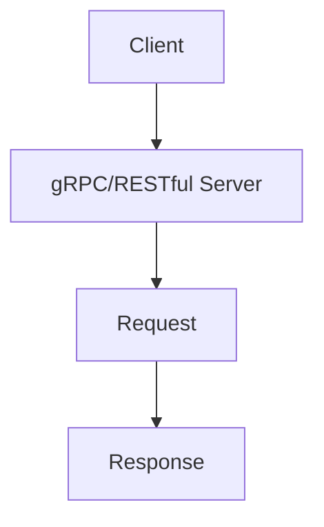

                 

关键词：微服务、通信、gRPC、RESTful API、性能、可靠性、跨语言、分布式系统

> 摘要：本文深入探讨了微服务架构中的通信机制，重点分析了gRPC和RESTful API两种常用的通信协议。通过对两者的原理、优缺点以及实际应用场景的详细比较，文章旨在为开发者提供一种全面且深入的理解，以帮助他们在不同场景下做出最佳选择。

## 1. 背景介绍

在云计算和容器化的推动下，微服务架构（Microservices Architecture）逐渐成为现代软件系统设计的主流。微服务架构的核心思想是将复杂的大型应用拆分成多个独立的小服务，每个服务专注于完成特定功能，并通过网络进行通信和协作。这使得系统具有更高的灵活性、可维护性和扩展性。

微服务之间的通信是微服务架构中至关重要的一环。高效、可靠和灵活的通信机制直接影响到系统的性能、稳定性和用户体验。目前，微服务通信常用的协议有gRPC和RESTful API。本文将重点讨论这两种通信协议，分析它们的原理、优势和局限性，并探讨在实际应用中的选择和使用策略。

## 2. 核心概念与联系

### 2.1. gRPC

gRPC是由谷歌开发的一种高性能、跨语言的远程过程调用（RPC）框架。它基于HTTP/2协议传输数据，并使用Protocol Buffers作为接口描述语言（IDL）。gRPC的主要特点如下：

- **高效性**：gRPC使用多路复用连接，可以将多个请求和响应在同一连接上传输，减少了网络延迟和开销。
- **跨语言支持**：gRPC支持多种编程语言，包括Java、Go、Python、C++等，使得开发者可以轻松地在不同语言的服务之间进行通信。
- **强类型**：gRPC使用Protocol Buffers进行数据序列化，确保数据的强类型和高效的传输。
- **自动健康检查**：gRPC支持自动健康检查和负载均衡，确保系统的可靠性和高性能。

### 2.2. RESTful API

RESTful API是一种基于REST（Representational State Transfer）架构风格的网络通信协议。RESTful API的主要特点如下：

- **无状态**：RESTful API要求服务端不保存客户端的状态信息，每次请求都需要包含所需的所有信息。
- **HTTP方法**：RESTful API使用HTTP的GET、POST、PUT、DELETE等方法来表示不同的操作。
- **统一接口**：RESTful API提供统一的接口，使得客户端可以方便地访问和操作资源。
- **支持多种数据格式**：RESTful API支持JSON、XML等多种数据格式，方便客户端和服务端之间的数据传输。

### 2.3. Mermaid 流程图

以下是一个简单的Mermaid流程图，展示了gRPC和RESTful API的基本通信流程：



在这个流程图中，客户端发送请求到服务器，服务器处理后返回响应。gRPC和RESTful API在通信流程上存在一些差异，将在后续章节中详细讨论。

## 3. 核心算法原理 & 具体操作步骤

### 3.1. 算法原理概述

#### gRPC

gRPC的核心算法原理是使用Protocol Buffers进行数据序列化，并基于HTTP/2协议传输数据。具体步骤如下：

1. **接口描述**：使用Protocol Buffers定义服务接口，包括方法和请求/响应消息类型。
2. **生成代码**：使用Protocol Buffers编译器生成服务端和客户端的代码。
3. **服务端实现**：实现服务端逻辑，处理客户端发送的请求并返回响应。
4. **客户端调用**：使用生成的客户端代码发送请求并接收响应。

#### RESTful API

RESTful API的核心算法原理是使用HTTP协议传输数据。具体步骤如下：

1. **资源定义**：定义API的URL路径和HTTP方法，表示不同的资源操作。
2. **请求发送**：客户端发送HTTP请求，包含URL、HTTP方法、请求体和请求头。
3. **响应处理**：服务端处理请求，返回HTTP响应，包含状态码、响应体和响应头。
4. **数据格式**：支持JSON、XML等多种数据格式，客户端和服务端需要协商一致。

### 3.2. 算法步骤详解

#### gRPC

1. **定义接口**：使用Protocol Buffers定义服务接口，如下所示：
    ```protobuf
    syntax = "proto3";

    service Greeter {
        rpc SayHello (HelloRequest) returns (HelloReply) {}
    }

    message HelloRequest {
        string name = 1;
    }

    message HelloReply {
        string message = 1;
    }
    ```

2. **生成代码**：使用Protocol Buffers编译器生成服务端和客户端的代码。例如，使用Go语言：
    ```bash
    protoc --go_out=. --grpc_out=. hello.proto
    ```

3. **服务端实现**：实现服务端逻辑，如下所示：
    ```go
    type server struct {
        grpc.Server
    }

    func (s *server) SayHello(ctx context.Context, in *HelloRequest) (*HelloReply, error) {
        return &HelloReply{Message: "Hello " + in.Name}, nil
    }

    func main() {
        l, err := net.Listen("tcp", ":50051")
        if err != nil {
            log.Fatalf("failed to listen: %v", err)
        }
        s := grpc.NewServer()
        pb.RegisterGreeterServer(s, &server{})
        if err := s.Serve(l); err != nil {
            log.Fatalf("failed to serve: %v", err)
        }
    }
    ```

4. **客户端调用**：使用生成的客户端代码发送请求并接收响应，如下所示：
    ```go
    conn, err := grpc.Dial("localhost:50051", grpc.WithInsecure())
    if err != nil {
        log.Fatalf("did not connect: %v", err)
    }
    defer conn.Close()
    c := pb.NewGreeterClient(conn)
    resp, err := c.SayHello(context.Background(), &pb.HelloRequest{Name: "world"})
    if err != nil {
        log.Fatalf("could not greet: %v", err)
    }
    log.Printf("Greeting: %s", resp.Message)
    ```

#### RESTful API

1. **定义接口**：定义API的URL路径和HTTP方法，如下所示：
    ```json
    {
        "baseUrl": "http://api.example.com",
        "resources": [
            {
                "name": "users",
                "url": "/users",
                "methods": ["GET", "POST"]
            }
        ]
    }
    ```

2. **请求发送**：使用HTTP客户端发送请求，如下所示：
    ```python
    import requests

    url = "http://api.example.com/users"
    response = requests.post(url, json={"name": "John Doe", "email": "john.doe@example.com"})
    ```

3. **响应处理**：解析HTTP响应，如下所示：
    ```python
    if response.status_code == 201:
        print("User created successfully")
    else:
        print("Failed to create user")
    ```

### 3.3. 算法优缺点

#### gRPC

- **优点**：
  - 高性能：使用多路复用连接，减少了网络延迟和开销。
  - 跨语言支持：支持多种编程语言，方便开发者使用。
  - 强类型：使用Protocol Buffers进行数据序列化，确保数据的强类型和高效的传输。
  - 自动健康检查：支持自动健康检查和负载均衡，确保系统的可靠性和高性能。

- **缺点**：
  - 学习曲线较高：需要了解Protocol Buffers和数据序列化的概念。
  - 缺乏文档和社区支持：相对于其他成熟的框架，gRPC的文档和社区支持相对较少。

#### RESTful API

- **优点**：
  - 易于使用：基于HTTP协议，开发者熟悉。
  - 支持多种数据格式：支持JSON、XML等多种数据格式，方便客户端和服务端之间的数据传输。
  - 跨语言支持：几乎所有编程语言都支持HTTP客户端。

- **缺点**：
  - 性能较低：每次请求都需要建立新的TCP连接，增加了网络延迟和开销。
  - 弱类型：数据传输缺乏强类型保证，容易出错。

### 3.4. 算法应用领域

#### gRPC

- 适用于需要高性能、低延迟的微服务通信场景，例如实时数据处理、在线游戏等。
- 适用于跨语言的微服务架构，方便开发者使用不同编程语言开发服务。

#### RESTful API

- 适用于大多数Web应用场景，特别是需要高可扩展性和灵活性的场景。
- 适用于需要多种数据格式的客户端和服务端通信。

## 4. 数学模型和公式 & 详细讲解 & 举例说明

### 4.1. 数学模型构建

#### gRPC

- **响应时间**：\( T_{gRPC} = T_{setup} + T_{serialize} + T_{deserialize} + T_{compute} \)
- **带宽消耗**：\( B_{gRPC} = 4 \times L_{message} \)

#### RESTful API

- **响应时间**：\( T_{REST} = T_{setup} + 2 \times T_{serialize} + T_{deserialize} + T_{compute} \)
- **带宽消耗**：\( B_{REST} = 2 \times L_{message} \)

### 4.2. 公式推导过程

#### gRPC

- \( T_{setup} \)：建立TCP连接的时间。
- \( T_{serialize} \)：序列化请求消息的时间。
- \( T_{deserialize} \)：反序列化响应消息的时间。
- \( T_{compute} \)：服务端处理请求的时间。
- \( L_{message} \)：请求消息的大小。

#### RESTful API

- \( T_{setup} \)：建立TCP连接的时间。
- \( T_{serialize} \)：序列化请求消息的时间。
- \( T_{deserialize} \)：反序列化响应消息的时间。
- \( T_{compute} \)：服务端处理请求的时间。
- \( L_{message} \)：请求消息的大小。

### 4.3. 案例分析与讲解

假设我们有一个简单的微服务系统，包含一个用户服务和一个订单服务。用户服务负责管理用户信息，订单服务负责处理订单。使用gRPC和RESTful API两种通信协议，分别计算系统的响应时间和带宽消耗。

#### gRPC

- **响应时间**：\( T_{gRPC} = T_{setup} + T_{serialize} + T_{deserialize} + T_{compute} \)
- **带宽消耗**：\( B_{gRPC} = 4 \times L_{message} \)

假设：

- \( T_{setup} = 10ms \)
- \( T_{serialize} = 5ms \)
- \( T_{deserialize} = 5ms \)
- \( T_{compute} = 20ms \)
- \( L_{message} = 1024bytes \)

计算结果：

- \( T_{gRPC} = 10 + 5 + 5 + 20 = 40ms \)
- \( B_{gRPC} = 4 \times 1024 = 4096bytes \)

#### RESTful API

- **响应时间**：\( T_{REST} = T_{setup} + 2 \times T_{serialize} + T_{deserialize} + T_{compute} \)
- **带宽消耗**：\( B_{REST} = 2 \times L_{message} \)

假设：

- \( T_{setup} = 10ms \)
- \( T_{serialize} = 5ms \)
- \( T_{deserialize} = 5ms \)
- \( T_{compute} = 20ms \)
- \( L_{message} = 1024bytes \)

计算结果：

- \( T_{REST} = 10 + 2 \times 5 + 5 + 20 = 40ms \)
- \( B_{REST} = 2 \times 1024 = 2048bytes \)

通过比较，我们可以发现gRPC和RESTful API在响应时间和带宽消耗上存在一些差异。在实际应用中，开发者需要根据具体的场景和需求选择合适的通信协议。

## 5. 项目实践：代码实例和详细解释说明

### 5.1. 开发环境搭建

本节以Go语言为例，介绍如何搭建gRPC开发环境。首先，确保已经安装了Go语言环境，然后执行以下命令：

```bash
go get -u google.golang.org/grpc
go get -u google.golang.org/protobuf
```

接下来，创建一个名为`hello`的Go模块：

```bash
mkdir hello
cd hello
go mod init hello
```

在`hello`目录下创建一个名为`hello.proto`的文件，输入以下代码：

```protobuf
syntax = "proto3";

option go_package = "hello";

service Greeter {
  rpc SayHello (HelloRequest) returns (HelloReply) {}
}

message HelloRequest {
  string name = 1;
}

message HelloReply {
  string message = 1;
}
```

使用Protocol Buffers编译器生成Go代码：

```bash
protoc --go_out=. hello.proto
```

此时，会在`hello`目录下生成`hello.pb.go`文件，以及`hello_grpc.pb.go`文件。

### 5.2. 源代码详细实现

#### 服务端实现

在`hello`目录下创建一个名为`server.go`的文件，输入以下代码：

```go
package main

import (
    "context"
    "log"
    "net"

    "google.golang.org/grpc"
    "google.golang.org/grpc/reflection"
    pb "hello/hello"
)

type server struct {
    pb.UnimplementedGreeterServer
}

func (s *server) SayHello(ctx context.Context, in *pb.HelloRequest) (*pb.HelloReply, error) {
    return &pb.HelloReply{Message: "Hello " + in.Name}, nil
}

func main() {
    lis, err := net.Listen("tcp", ":50051")
    if err != nil {
        log.Fatalf("failed to listen: %v", err)
    }
    s := grpc.NewServer()
    pb.RegisterGreeterServer(s, &server{})
    reflection.Register(s)
    if err := s.Serve(lis); err != nil {
        log.Fatalf("failed to serve: %v", err)
    }
}
```

#### 客户端实现

在`hello`目录下创建一个名为`client.go`的文件，输入以下代码：

```go
package main

import (
    "context"
    "log"
    "time"

    "google.golang.org/grpc"
    pb "hello/hello"
)

func main() {
    ctx, cancel := context.WithTimeout(context.Background(), time.Second)
    defer cancel()

    conn, err := grpc.DialContext(ctx, "localhost:50051", grpc.WithInsecure())
    if err != nil {
        log.Fatalf("did not connect: %v", err)
    }
    defer conn.Close()

    c := pb.NewGreeterClient(conn)

    ctx, cancel = context.WithTimeout(context.Background(), time.Second)
    defer cancel()

    resp, err := c.SayHello(ctx, &pb.HelloRequest{Name: "world"})
    if err != nil {
        log.Fatalf("could not greet: %v", err)
    }
    log.Printf("Greeting: %s", resp.Message)
}
```

### 5.3. 代码解读与分析

#### 服务端实现

1. 引入必要的包：

    ```go
    import (
        "context"
        "log"
        "net"

        "google.golang.org/grpc"
        "google.golang.org/grpc/reflection"
        pb "hello/hello"
    )
    ```

2. 定义服务端结构体：

    ```go
    type server struct {
        pb.UnimplementedGreeterServer
    }
    ```

3. 实现SayHello方法：

    ```go
    func (s *server) SayHello(ctx context.Context, in *pb.HelloRequest) (*pb.HelloReply, error) {
        return &pb.HelloReply{Message: "Hello " + in.Name}, nil
    }
    ```

4. 启动服务端：

    ```go
    func main() {
        lis, err := net.Listen("tcp", ":50051")
        if err != nil {
            log.Fatalf("failed to listen: %v", err)
        }
        s := grpc.NewServer()
        pb.RegisterGreeterServer(s, &server{})
        reflection.Register(s)
        if err := s.Serve(lis); err != nil {
            log.Fatalf("failed to serve: %v", err)
        }
    }
    ```

#### 客户端实现

1. 引入必要的包：

    ```go
    import (
        "context"
        "log"
        "time"

        "google.golang.org/grpc"
        pb "hello/hello"
    )
    ```

2. 连接服务端：

    ```go
    func main() {
        ctx, cancel := context.WithTimeout(context.Background(), time.Second)
        defer cancel()

        conn, err := grpc.DialContext(ctx, "localhost:50051", grpc.WithInsecure())
        if err != nil {
            log.Fatalf("did not connect: %v", err)
        }
        defer conn.Close()
    }
    ```

3. 发送请求并接收响应：

    ```go
    c := pb.NewGreeterClient(conn)

    ctx, cancel := context.WithTimeout(context.Background(), time.Second)
    defer cancel()

    resp, err := c.SayHello(ctx, &pb.HelloRequest{Name: "world"})
    if err != nil {
        log.Fatalf("could not greet: %v", err)
    }
    log.Printf("Greeting: %s", resp.Message)
    ```

通过以上代码，我们可以实现一个简单的gRPC服务，服务端和客户端之间可以通过定义的接口进行通信。

## 6. 实际应用场景

### 6.1. 常见应用场景

#### gRPC

- **实时数据处理**：gRPC的高性能和低延迟特性非常适合用于实时数据处理场景，如实时数据分析、在线游戏等。
- **跨语言通信**：在涉及多种编程语言的分布式系统中，gRPC的跨语言支持使得不同语言的服务可以方便地进行通信。
- **内部服务通信**：在企业内部，使用gRPC作为服务之间的通信协议，可以提高系统的性能和可靠性。

#### RESTful API

- **Web应用**：RESTful API是构建Web应用的首选协议，广泛用于处理HTTP请求和响应。
- **公共API**：对于开放的公共API，RESTful API因其易于理解和使用的特性而受到青睐。
- **多终端应用**：在涉及多终端（Web、iOS、Android等）的应用中，RESTful API可以方便地实现数据同步和共享。

### 6.2. 应用实例

#### gRPC实例

假设我们开发一个实时聊天应用，需要实现客户端和服务端之间的实时通信。使用gRPC，我们可以定义一个聊天服务接口，包括发送消息、接收消息和获取用户列表等方法。服务端实现这些方法，客户端通过gRPC调用这些方法，实现实时聊天功能。

#### RESTful API实例

假设我们开发一个在线购物平台，需要实现商品查询、购物车管理和订单支付等功能。使用RESTful API，我们可以定义相应的URL路径和HTTP方法，如`GET /products`用于查询商品信息，`POST /cart`用于添加商品到购物车，`POST /orders`用于提交订单。客户端通过发送HTTP请求，接收服务器返回的响应，实现购物平台的功能。

## 7. 工具和资源推荐

### 7.1. 学习资源推荐

- **gRPC官方文档**：[https://grpc.io/docs/](https://grpc.io/docs/)
- **RESTful API设计指南**：[https://restfulapi.net/guide/](https://restfulapi.net/guide/)
- **微服务架构教程**：[https://microservices.io/](https://microservices.io/)

### 7.2. 开发工具推荐

- **gRPC工具集**：[https://github.com/grpc/grpc-go](https://github.com/grpc/grpc-go)
- **RESTful API开发工具**：Postman、Swagger

### 7.3. 相关论文推荐

- **"gRPC: The Universal Client-Server Protocol"**：https://www.usenix.org/conference/lisa18/technical-sessions/presentation/nelson
- **"RESTful API Design Rulebook"**：https://restfulapi.net/rulebook/

## 8. 总结：未来发展趋势与挑战

### 8.1. 研究成果总结

本文深入探讨了微服务架构中的通信机制，分析了gRPC和RESTful API两种常用的通信协议。通过对比分析，我们发现gRPC在性能和跨语言支持方面具有明显优势，而RESTful API在易用性和灵活性方面更具优势。在实际应用中，开发者可以根据具体场景和需求选择合适的通信协议。

### 8.2. 未来发展趋势

- **gRPC的普及**：随着微服务架构的广泛应用，gRPC作为一种高性能、跨语言的通信协议，有望在更多场景中得到普及。
- **RESTful API的改进**：RESTful API在易用性和灵活性方面仍有改进空间，未来可能会出现更多基于RESTful API的新技术和框架。
- **混合通信模式**：在实际应用中，可能需要结合使用gRPC和RESTful API，以充分发挥各自的优势。

### 8.3. 面临的挑战

- **性能优化**：在复杂场景下，如何进一步提高gRPC和RESTful API的性能，降低延迟和带宽消耗，仍是一个挑战。
- **跨语言支持**：虽然gRPC支持多种编程语言，但在某些场景下，可能需要开发特定的客户端库，以提高兼容性和性能。
- **安全性**：在分布式系统中，保障数据传输的安全性至关重要，需要进一步研究如何提高gRPC和RESTful API的安全性。

### 8.4. 研究展望

未来的研究可以关注以下几个方面：

- **性能优化**：通过改进数据序列化和传输机制，提高通信性能。
- **跨语言支持**：开发更多高效、易用的客户端库，提高跨语言支持能力。
- **安全性**：研究如何提高gRPC和RESTful API的安全性，保护数据传输过程中的隐私和完整性。
- **混合通信模式**：探索如何将gRPC和RESTful API的优势相结合，构建更高效、可靠的分布式系统。

## 9. 附录：常见问题与解答

### 9.1. gRPC与RESTful API的区别

**Q**：什么是gRPC，它与RESTful API有什么区别？

**A**：gRPC是一种基于高性能、跨语言的远程过程调用（RPC）框架，而RESTful API是一种基于HTTP协议的Web服务架构风格。gRPC的特点包括高效性、跨语言支持和自动健康检查，而RESTful API的特点包括无状态、统一接口和支持多种数据格式。在实际应用中，gRPC适用于高性能、低延迟的场景，而RESTful API适用于大多数Web应用场景。

### 9.2. gRPC的优势

**Q**：gRPC相比其他通信协议有哪些优势？

**A**：gRPC具有以下优势：

- **高性能**：gRPC使用多路复用连接，减少了网络延迟和开销，提高了通信性能。
- **跨语言支持**：gRPC支持多种编程语言，方便开发者使用。
- **强类型**：gRPC使用Protocol Buffers进行数据序列化，确保数据的强类型和高效的传输。
- **自动健康检查**：gRPC支持自动健康检查和负载均衡，提高了系统的可靠性和性能。

### 9.3. RESTful API的局限性

**Q**：RESTful API有哪些局限性？

**A**：RESTful API的局限性包括：

- **性能较低**：每次请求都需要建立新的TCP连接，增加了网络延迟和开销。
- **弱类型**：数据传输缺乏强类型保证，容易出错。
- **文档和社区支持不足**：相对于其他成熟的框架，RESTful API的文档和社区支持相对较少。

### 9.4. 如何选择通信协议

**Q**：如何根据应用场景选择gRPC和RESTful API？

**A**：可以根据以下因素选择通信协议：

- **性能要求**：如果应用对性能要求较高，可以考虑使用gRPC。
- **跨语言需求**：如果应用涉及多种编程语言，可以考虑使用gRPC。
- **场景复杂度**：如果应用场景较为复杂，需要考虑使用gRPC。
- **易用性和灵活性**：如果应用对易用性和灵活性要求较高，可以考虑使用RESTful API。

通过以上分析，我们可以根据具体应用场景和需求选择合适的通信协议。

