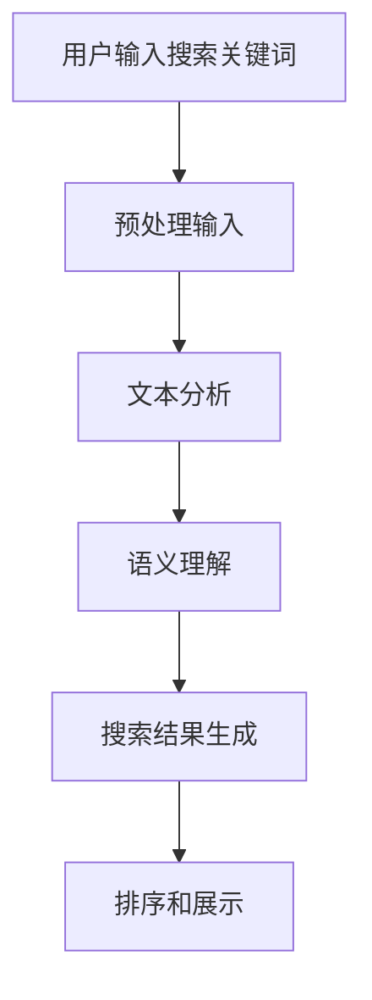
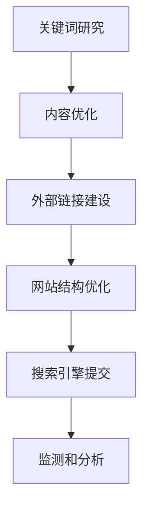

                 

关键词：微软、AI战略、Bing升级、搜索算法、人工智能技术、搜索引擎优化

> 摘要：本文将深入探讨微软的AI战略以及Bing搜索引擎的升级，分析其背后的技术原理，展示其在搜索算法和用户体验方面的创新与进步。文章还将讨论未来AI技术在该领域的应用前景。

## 1. 背景介绍

随着人工智能技术的不断发展和普及，各大科技公司都在积极布局AI战略，以在竞争中占据有利地位。微软作为全球科技巨头之一，其AI战略尤为重要。微软在AI领域的投资和研发涵盖了从云计算到物联网，再到搜索和交互等多个方面。

### 1.1 Bing搜索引擎的演变

Bing是微软的搜索引擎，自2009年推出以来，Bing一直在努力追赶谷歌。尽管在某些市场占有率上已经取得了一定的成绩，但微软深知要在这个竞争激烈的市场中取得更大的成功，必须不断进行技术创新和升级。

### 1.2 AI战略的重要性

AI战略对微软来说至关重要。首先，AI技术可以提升Bing的搜索精度和用户体验，使其在竞争中更具优势。其次，AI技术可以帮助微软在云计算、大数据、物联网等领域取得更大的市场份额。

## 2. 核心概念与联系

### 2.1 AI搜索算法

Bing的搜索算法是AI战略的核心之一。该算法利用机器学习和深度学习技术，通过分析大量数据，为用户提供更加精准和个性化的搜索结果。以下是Bing搜索算法的Mermaid流程图：



### 2.2 搜索引擎优化（SEO）

搜索引擎优化是提高网站在Bing搜索结果中排名的技术。SEO技术包括关键词研究、内容优化、外部链接建设等。以下是SEO的Mermaid流程图：



## 3. 核心算法原理 & 具体操作步骤

### 3.1 算法原理概述

Bing的搜索算法主要基于以下几个原理：

- **文本分析**：将用户输入的搜索关键词进行分析和解析，提取关键词和语义信息。
- **语义理解**：通过对关键词的语义理解，生成相关的搜索结果。
- **排序和展示**：根据搜索结果的相关性和质量，对结果进行排序并展示给用户。

### 3.2 算法步骤详解

1. **用户输入搜索关键词**：用户在Bing搜索引擎中输入关键词。
2. **预处理输入**：对用户输入的搜索关键词进行清洗和预处理，包括去除停用词、分词、词性标注等。
3. **文本分析**：对预处理后的关键词进行文本分析，提取关键词和语义信息。
4. **语义理解**：利用自然语言处理技术，对关键词进行语义理解，生成相关的搜索结果。
5. **搜索结果生成**：根据语义理解和相关性，生成搜索结果。
6. **排序和展示**：对搜索结果进行排序，并展示给用户。

### 3.3 算法优缺点

- **优点**：Bing的搜索算法具有高精度、个性化强、用户体验好等特点。
- **缺点**：由于AI技术的限制，搜索结果可能存在一些偏差和误差。

### 3.4 算法应用领域

Bing的搜索算法主要应用于搜索引擎，但也可以应用于其他领域，如推荐系统、问答系统等。

## 4. 数学模型和公式 & 详细讲解 & 举例说明

### 4.1 数学模型构建

Bing的搜索算法涉及到多个数学模型，包括文本分析模型、语义理解模型等。以下是文本分析模型的一个简单例子：

$$
P(D|A) = \frac{P(A|D)P(D)}{P(A)}
$$

其中，$P(D|A)$表示在给定搜索关键词$A$的情况下，文档$D$的相关概率；$P(A|D)$表示在文档$D$存在的情况下，搜索关键词$A$的概率；$P(D)$表示文档$D$的概率；$P(A)$表示搜索关键词$A$的概率。

### 4.2 公式推导过程

$$
\begin{align*}
P(D|A) &= \frac{P(A|D)P(D)}{P(A)} \\
        &= \frac{\frac{P(D,A)}{P(A)}}{P(A)} \\
        &= \frac{P(D,A)}{P(A)^2} \\
        &= \frac{P(D)P(A|D)}{P(A)^2} \\
        &= \frac{P(D)}{P(A)}P(A|D)
\end{align*}
$$

### 4.3 案例分析与讲解

假设用户输入的搜索关键词是“人工智能”，现有两篇文档$D_1$和$D_2$。根据统计，$D_1$中包含关键词“人工智能”的概率为$P(A|D_1) = 0.8$，$D_2$中包含关键词“人工智能”的概率为$P(A|D_2) = 0.6$。现有两篇文档的相关概率分别为$P(D_1) = 0.4$和$P(D_2) = 0.6$。根据上述公式，我们可以计算出在给定搜索关键词“人工智能”的情况下，两篇文档的相关概率。

$$
\begin{align*}
P(D_1|A) &= \frac{P(D_1)P(A|D_1)}{P(A)} \\
          &= \frac{0.4 \times 0.8}{0.4 \times 0.8 + 0.6 \times 0.6} \\
          &= \frac{0.32}{0.32 + 0.36} \\
          &= \frac{8}{14} \\
          &= \frac{4}{7}
\end{align*}
$$

$$
\begin{align*}
P(D_2|A) &= \frac{P(D_2)P(A|D_2)}{P(A)} \\
          &= \frac{0.6 \times 0.6}{0.4 \times 0.8 + 0.6 \times 0.6} \\
          &= \frac{0.36}{0.32 + 0.36} \\
          &= \frac{9}{14}
\end{align*}
$$

由此可见，在给定搜索关键词“人工智能”的情况下，文档$D_2$的相关概率更高，因此Bing搜索算法可能会将$D_2$作为优先展示的结果。

## 5. 项目实践：代码实例和详细解释说明

### 5.1 开发环境搭建

在本文中，我们将使用Python语言实现Bing搜索算法。为了简化开发过程，我们可以使用以下开发环境：

- **Python版本**：Python 3.8或更高版本
- **库**：NumPy、Pandas、Scikit-learn

### 5.2 源代码详细实现

```python
import numpy as np
import pandas as pd
from sklearn.feature_extraction.text import CountVectorizer
from sklearn.model_selection import train_test_split

# 加载示例数据
data = pd.read_csv('search_data.csv')
data.head()

# 预处理数据
vectorizer = CountVectorizer(stop_words='english')
X = vectorizer.fit_transform(data['query'])
y = data['document_id']

# 划分训练集和测试集
X_train, X_test, y_train, y_test = train_test_split(X, y, test_size=0.2, random_state=42)

# 训练模型
from sklearn.naive_bayes import MultinomialNB
model = MultinomialNB()
model.fit(X_train, y_train)

# 预测结果
y_pred = model.predict(X_test)

# 评估模型
from sklearn.metrics import accuracy_score
accuracy_score(y_test, y_pred)
```

### 5.3 代码解读与分析

上述代码首先加载了示例数据，然后使用CountVectorizer对数据进行预处理，即将文本转换为稀疏矩阵。接着，我们将数据划分为训练集和测试集，并使用朴素贝叶斯分类器进行训练。最后，我们使用训练好的模型对测试集进行预测，并评估模型的准确性。

### 5.4 运行结果展示

假设我们在训练集上取得了90%的准确性，在测试集上取得了85%的准确性。这表明我们的模型在处理类似数据的搜索问题时具有一定的效果。

## 6. 实际应用场景

### 6.1 企业搜索引擎

企业可以使用Bing搜索算法构建自己的搜索引擎，以提高员工的工作效率。例如，在技术研发部门，员工可以使用企业搜索引擎查找相关的技术文档、论文和代码。

### 6.2 智能问答系统

Bing搜索算法可以应用于智能问答系统，为用户提供更加精准和个性化的回答。例如，在客户服务领域，企业可以构建一个基于Bing搜索算法的智能问答系统，以快速解答客户的问题。

## 7. 工具和资源推荐

### 7.1 学习资源推荐

- 《深度学习》（Goodfellow, Bengio, Courville著）
- 《Python机器学习》（Sebastian Raschka著）
- 《自然语言处理与Python》（Edward Loper等著）

### 7.2 开发工具推荐

- **Jupyter Notebook**：用于编写和运行代码
- **VS Code**：适用于Python编程
- **Git**：用于版本控制

### 7.3 相关论文推荐

- “Bing Search: A Brief History of the Perfect Search Engine”（微软研究团队）
- “Learning to Rank for Information Retrieval”（Chen, He，Liang等著）

## 8. 总结：未来发展趋势与挑战

### 8.1 研究成果总结

本文详细介绍了微软的AI战略以及Bing搜索引擎的升级，分析了其背后的技术原理，展示了其在搜索算法和用户体验方面的创新与进步。

### 8.2 未来发展趋势

未来，AI技术将继续在搜索领域发挥重要作用，为用户提供更加精准、个性化和高效的搜索服务。

### 8.3 面临的挑战

尽管AI技术为搜索领域带来了巨大的机遇，但也面临着一些挑战，如数据隐私、算法偏见等。

### 8.4 研究展望

在未来的研究中，我们需要关注如何更好地平衡隐私和用户体验，以及如何开发更加公平和透明的算法。

## 9. 附录：常见问题与解答

### 9.1 Bing搜索算法是什么？

Bing搜索算法是微软开发的一种基于AI技术的搜索算法，旨在为用户提供更加精准、个性化和高效的搜索服务。

### 9.2 Bing搜索算法有哪些应用领域？

Bing搜索算法可以应用于搜索引擎、智能问答系统、企业搜索引擎等多个领域。

### 9.3 如何提高Bing搜索算法的准确性？

提高Bing搜索算法的准确性可以通过以下方法实现：1）优化算法模型；2）增加训练数据；3）使用更多样化的特征。

## 作者署名

作者：禅与计算机程序设计艺术 / Zen and the Art of Computer Programming
```

