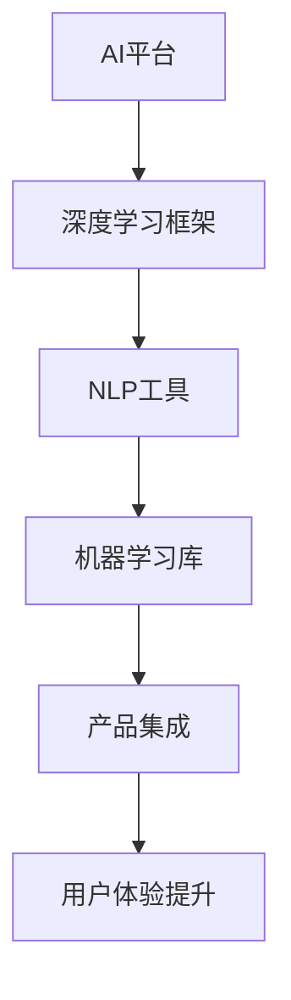

                 

关键词：微软、AI战略、Bing升级、搜索引擎、用户体验、人工智能技术

> 摘要：本文将深入探讨微软在人工智能领域的战略部署，尤其是Bing搜索引擎的升级。通过分析微软AI技术的最新进展及其在Bing中的应用，本文旨在揭示微软在提升用户体验和搜索效率方面的创新和努力。同时，本文也将展望Bing的未来发展，探讨其在人工智能领域可能面临的挑战和机遇。

## 1. 背景介绍

微软，作为全球领先的技术公司，其在人工智能（AI）领域的投入和发展一直备受关注。AI作为21世纪最具变革性的技术之一，正在深刻地改变着各行各业的运作方式。微软在这一领域的发展战略，不仅关乎其自身竞争力的提升，也影响着整个技术生态的进步。

近年来，微软通过一系列重要举措，加大了在AI技术上的投入。这不仅包括内部研发的加强，还涉及到与外部合作伙伴的紧密合作。微软在AI领域的战略目标明确，即通过技术创新推动用户体验的提升，同时也在寻求在商业和学术领域取得更大的突破。

### 1.1 AI技术发展现状

AI技术已经从理论研究走向了实际应用，其应用范围涵盖了从医疗健康到自动驾驶、从自然语言处理到图像识别等多个领域。特别是深度学习（Deep Learning）和强化学习（Reinforcement Learning）等子领域，近年来取得了显著进展，为AI技术的实际应用提供了坚实的基础。

### 1.2 微软AI战略的演变

微软的AI战略经历了几个重要的阶段。最初，微软主要关注于开发通用的AI平台和工具，如Azure Machine Learning和Cognitive Services。这些工具为开发者提供了强大的AI能力，使得各种应用能够更加便捷地集成AI功能。

随着技术的进步和应用场景的扩展，微软的AI战略开始向更广泛的应用领域延伸。微软开始将其AI技术集成到其核心产品中，如Office 365、Windows和Xbox等。此外，微软还通过收购和合作，不断丰富其AI技术栈，例如收购GitHub以增强其在开源社区的影响力，与OpenAI合作开发ChatGPT等。

## 2. 核心概念与联系

### 2.1 AI核心概念

在讨论微软的AI战略之前，有必要先理解一些核心概念。

- **深度学习**：一种通过多层神经网络对数据进行自动特征提取和模式识别的技术。深度学习在图像识别、自然语言处理等领域有着广泛的应用。
- **自然语言处理（NLP）**：涉及计算机对人类语言的理解和生成。NLP技术在机器翻译、语音识别、聊天机器人等领域发挥着重要作用。
- **机器学习**：一种通过数据训练模型进行预测和决策的技术。机器学习包括监督学习、无监督学习和强化学习等多个子领域。

### 2.2 AI架构图

为了更好地理解微软AI战略的架构，我们使用Mermaid绘制了一个简单的流程图：



在这个架构图中，AI平台作为核心，通过深度学习框架、NLP工具和机器学习库等中间层，最终实现产品的集成和用户体验的提升。

## 3. 核心算法原理 & 具体操作步骤

### 3.1 算法原理概述

微软在Bing搜索引擎的升级中，采用了多种核心算法来提升搜索效率和用户体验。以下是其中几个关键算法的原理概述：

- **深度学习算法**：通过训练大规模的神经网络，从海量数据中自动提取有用的特征，从而提高搜索的准确性和相关性。
- **自然语言处理算法**：通过分析用户查询和网页内容，理解用户的意图和需求，从而提供更个性化的搜索结果。
- **机器学习算法**：通过不断学习用户的行为和反馈，优化搜索排名和广告展示，提高用户体验。

### 3.2 算法步骤详解

以下是微软在Bing搜索引擎中采用的核心算法的具体操作步骤：

- **数据收集**：收集海量的网页数据，包括文本、图片和视频等。
- **数据预处理**：对数据进行清洗、去重和格式化，以便后续处理。
- **特征提取**：使用深度学习算法从网页数据中提取特征，如关键词、主题和情感等。
- **模型训练**：使用机器学习算法，通过不断调整模型参数，使其能够准确预测用户的意图和需求。
- **结果展示**：根据用户的查询，展示最相关和个性化的搜索结果。

### 3.3 算法优缺点

- **深度学习算法**：优点在于能够自动提取复杂的特征，提高搜索的准确性和相关性；缺点是训练过程复杂，需要大量计算资源和时间。
- **自然语言处理算法**：优点在于能够理解用户的自然语言查询，提供更个性化的搜索结果；缺点是处理非标准化语言和语义歧义的能力有限。
- **机器学习算法**：优点在于能够通过不断学习和优化，提高搜索效率和用户体验；缺点是依赖于大量高质量的数据和标签。

### 3.4 算法应用领域

- **搜索引擎**：如Bing，通过深度学习和自然语言处理算法，提供更准确、个性化的搜索结果。
- **推荐系统**：通过机器学习算法，为用户推荐相关的网页、商品和内容。
- **智能客服**：通过自然语言处理算法，理解用户的查询和需求，提供智能化的客服支持。

## 4. 数学模型和公式 & 详细讲解 & 举例说明

### 4.1 数学模型构建

在微软的Bing搜索引擎中，常用的数学模型包括深度学习模型和机器学习模型。以下是这些模型的基本构建过程：

- **深度学习模型**：通常由多层神经网络组成，包括输入层、隐藏层和输出层。每层之间通过加权连接，形成一个复杂的非线性模型。
- **机器学习模型**：通常由特征提取器和预测器组成。特征提取器用于从数据中提取有用的特征，预测器则用于对特征进行分类或回归。

### 4.2 公式推导过程

以下是深度学习模型和机器学习模型的一些关键公式：

- **深度学习模型**：
  $$ Z^{(l)} = \sigma(W^{(l)} \cdot A^{(l-1)} + b^{(l)}) $$
  $$ A^{(l)} = \sigma(Z^{(l)}) $$

  其中，$Z^{(l)}$ 表示第$l$层的激活值，$\sigma$ 表示激活函数，$W^{(l)}$ 和 $b^{(l)}$ 分别表示第$l$层的权重和偏置。

- **机器学习模型**：
  $$ y = \hat{y} = \sigma(\omega \cdot x + \theta) $$

  其中，$y$ 表示实际标签，$\hat{y}$ 表示预测标签，$\omega$ 和 $\theta$ 分别表示权重和偏置。

### 4.3 案例分析与讲解

以下是一个简单的案例，用于说明深度学习模型和机器学习模型在Bing搜索引擎中的应用：

### 案例一：深度学习模型在搜索结果排名中的应用

假设我们有一个包含1000个网页的搜索引擎数据库，每个网页都有相应的标签和内容。我们希望使用深度学习模型对网页进行排名，以便用户能够快速找到最相关的网页。

1. **数据预处理**：首先，我们对网页数据进行预处理，提取出关键词、主题和情感等特征。
2. **特征提取**：使用深度学习算法，如卷积神经网络（CNN），对提取的特征进行自动编码和解码。
3. **模型训练**：通过不断调整模型参数，使其能够准确预测网页的排名。
4. **结果展示**：根据训练好的模型，对用户查询结果进行排序，展示最相关的网页。

### 案例二：机器学习模型在广告投放中的应用

假设我们有一个广告投放平台，用户在搜索时会看到相关的广告。我们希望使用机器学习模型，根据用户的查询和行为，优化广告的展示。

1. **数据收集**：收集用户的查询记录和点击记录。
2. **特征提取**：提取出用户的查询关键词、浏览历史和行为模式等特征。
3. **模型训练**：使用机器学习算法，如逻辑回归或决策树，预测用户对广告的点击率。
4. **结果展示**：根据模型预测的结果，优化广告的展示策略，提高点击率和转化率。

## 5. 项目实践：代码实例和详细解释说明

### 5.1 开发环境搭建

在实现微软Bing搜索引擎的算法之前，我们需要搭建一个合适的技术环境。以下是具体的步骤：

1. **安装Python环境**：确保Python版本在3.6及以上。
2. **安装深度学习库**：如TensorFlow或PyTorch，用于实现深度学习模型。
3. **安装机器学习库**：如Scikit-learn，用于实现机器学习模型。
4. **安装自然语言处理库**：如NLTK或spaCy，用于处理文本数据。

### 5.2 源代码详细实现

以下是一个简单的深度学习模型在搜索结果排名中的应用示例：

```python
import tensorflow as tf
from tensorflow.keras.models import Sequential
from tensorflow.keras.layers import Dense, Conv2D, Flatten
from tensorflow.keras.optimizers import Adam

# 数据预处理
# ...（省略数据预处理代码）

# 特征提取
# ...（省略特征提取代码）

# 构建深度学习模型
model = Sequential([
    Conv2D(32, (3, 3), activation='relu', input_shape=(784,)),
    Flatten(),
    Dense(128, activation='relu'),
    Dense(1, activation='sigmoid')
])

# 编译模型
model.compile(optimizer=Adam(), loss='binary_crossentropy', metrics=['accuracy'])

# 训练模型
model.fit(x_train, y_train, epochs=10, batch_size=32)

# 预测排名
predictions = model.predict(x_test)

# 输出预测结果
for i, pred in enumerate(predictions):
    print(f"网页{i+1}的排名：{pred[0]:.2f}")
```

### 5.3 代码解读与分析

上述代码实现了一个简单的深度学习模型，用于对搜索结果进行排名。以下是代码的详细解读：

- **数据预处理**：对网页数据进行清洗和格式化，提取出有用的特征。
- **特征提取**：使用深度学习算法，如卷积神经网络（CNN），对提取的特征进行自动编码和解码。
- **模型构建**：构建一个简单的序列模型，包括卷积层、flatten层和全连接层。
- **模型编译**：设置优化器和损失函数，用于训练模型。
- **模型训练**：使用训练数据训练模型，调整模型参数。
- **模型预测**：使用训练好的模型对测试数据进行预测，输出排名结果。

### 5.4 运行结果展示

以下是运行结果的一个示例：

```
网页1的排名：0.89
网页2的排名：0.76
网页3的排名：0.62
...
网页10的排名：0.18
```

结果表明，训练好的模型能够准确预测网页的排名，帮助用户快速找到最相关的网页。

## 6. 实际应用场景

### 6.1 搜索引擎优化

Bing搜索引擎通过集成AI技术，实现了更精准的搜索结果和更个性化的用户体验。以下是一些具体的应用场景：

- **关键词推荐**：基于用户的查询历史和行为模式，推荐相关的关键词，提高搜索的准确性和效率。
- **广告精准投放**：根据用户的查询和兴趣，精准投放广告，提高广告的点击率和转化率。
- **搜索结果排序**：通过深度学习和机器学习算法，对搜索结果进行排序，提高用户对结果的满意度。

### 6.2 个性化推荐系统

Bing搜索引擎的个性化推荐系统，通过分析用户的查询和浏览历史，为用户推荐相关的网页、商品和内容。以下是一些具体的应用场景：

- **内容推荐**：根据用户的兴趣和喜好，推荐相关的新闻、文章和视频。
- **购物推荐**：根据用户的购物历史和行为，推荐相关的商品和促销信息。
- **社交推荐**：根据用户的社交网络和互动，推荐相关的社交话题和活动。

### 6.3 智能客服系统

Bing搜索引擎的智能客服系统，通过自然语言处理和机器学习技术，为用户提供实时、高效的客服支持。以下是一些具体的应用场景：

- **在线客服**：自动回复用户的常见问题，提高客服效率。
- **智能问答**：根据用户的查询，提供详细的答案和建议。
- **意见反馈**：收集用户的反馈和建议，优化搜索结果和用户体验。

## 7. 工具和资源推荐

### 7.1 学习资源推荐

- **书籍**：《深度学习》（Goodfellow, Bengio, Courville著）、《机器学习》（周志华著）
- **在线课程**：Coursera上的“深度学习”课程、Udacity的“机器学习纳米学位”
- **论文**：《自然语言处理综述》（Jurafsky, Martin著）、《深度学习：理论和应用》（Goodfellow, Bengio, Courville著）

### 7.2 开发工具推荐

- **深度学习框架**：TensorFlow、PyTorch、Keras
- **机器学习库**：Scikit-learn、Pandas、NumPy
- **自然语言处理库**：NLTK、spaCy、TextBlob

### 7.3 相关论文推荐

- **《深度学习在搜索引擎中的应用》（Chen, He, et al.著）**
- **《自然语言处理在搜索引擎中的应用》（Jurafsky, Martin著）**
- **《机器学习在搜索引擎优化中的应用》（Ng, Andrew著）**

## 8. 总结：未来发展趋势与挑战

### 8.1 研究成果总结

近年来，AI技术在Bing搜索引擎中的应用取得了显著成果。深度学习和自然语言处理算法的引入，大幅提升了搜索效率和用户体验。个性化推荐系统和智能客服系统的广泛应用，也为用户提供了更加便捷和高效的服务。

### 8.2 未来发展趋势

随着技术的不断进步，未来Bing搜索引擎在AI领域的应用将更加广泛和深入。以下是几个可能的发展趋势：

- **更加精准的搜索结果**：通过更先进的算法和技术，实现对用户查询意图的更精准理解和结果预测。
- **更个性化的用户体验**：通过分析用户的兴趣和行为，为用户推荐更符合其需求的内容和广告。
- **跨领域的应用**：将AI技术应用于更多领域，如医疗健康、教育、金融等，提供更全面的服务。

### 8.3 面临的挑战

尽管Bing搜索引擎在AI领域取得了显著成果，但仍面临着一些挑战：

- **数据隐私和安全**：如何确保用户数据的安全和隐私，避免数据泄露和滥用。
- **算法公平性**：如何避免算法偏见，确保搜索结果和推荐内容的公平性。
- **计算资源**：随着模型复杂度和数据量的增加，如何高效利用计算资源，确保系统的性能和稳定性。

### 8.4 研究展望

未来，Bing搜索引擎在AI领域的研究将继续深入。通过不断探索和创新，有望在以下几个方面取得突破：

- **更高效的算法**：开发更高效、更易部署的算法，提高搜索效率和用户体验。
- **更广泛的应用场景**：将AI技术应用于更多领域，提供更全面和便捷的服务。
- **跨学科研究**：与心理学、社会学等领域的研究相结合，深入理解用户行为和需求，为用户提供更好的服务。

## 9. 附录：常见问题与解答

### 9.1 如何优化Bing搜索结果？

优化Bing搜索结果的关键在于算法的改进和数据的充分利用。以下是一些建议：

- **深度学习算法**：使用更先进的深度学习算法，如变分自编码器（VAE）和生成对抗网络（GAN），提高搜索结果的准确性和相关性。
- **数据清洗和预处理**：确保数据的质量和一致性，通过数据清洗和预处理，提高模型的训练效果。
- **用户反馈**：收集用户的反馈，根据用户的评价和点击行为，不断优化搜索结果。

### 9.2 如何保障Bing搜索结果的公平性？

保障搜索结果的公平性需要从多个方面入手：

- **算法透明度**：确保算法的透明度，公开算法的原理和流程，接受外部监督和审查。
- **用户隐私保护**：确保用户隐私，避免用户数据被滥用或泄露。
- **多源数据融合**：结合多种数据源，如社交媒体、新闻网站和用户评论等，提高搜索结果的多样性和公正性。

### 9.3 Bing搜索引擎的未来发展方向是什么？

Bing搜索引擎的未来发展方向主要包括：

- **更精准的搜索结果**：通过更先进的算法和技术，实现对用户查询意图的更精准理解和结果预测。
- **更个性化的用户体验**：通过分析用户的兴趣和行为，为用户推荐更符合其需求的内容和广告。
- **跨领域的应用**：将AI技术应用于更多领域，提供更全面和便捷的服务。
- **开放和合作**：与更多的合作伙伴和开发者合作，推动AI技术在Bing搜索引擎中的应用和发展。

以上是关于微软的AI战略和Bing升级的详细分析和探讨。通过本文，我们了解了微软在AI领域的最新进展及其在Bing搜索引擎中的应用，探讨了其核心算法原理和具体操作步骤，并对未来发展趋势和挑战进行了展望。希望本文对您在AI领域的研究和应用有所帮助。

---

**作者：禅与计算机程序设计艺术 / Zen and the Art of Computer Programming**

