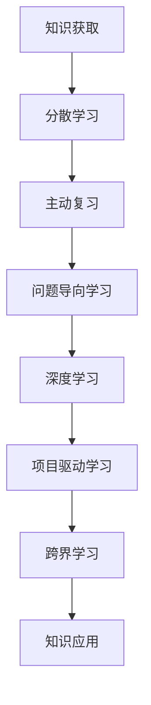

                 

关键词：快速学习、VUCA时代、人工智能、技术变革、认知策略、实践应用

> 摘要：在VUCA（易变、不确定、复杂、模糊）时代，快速学习已成为个人和组织的生存与发展的关键。本文从人工智能与计算机编程的角度出发，探讨在VUCA时代下如何通过有效的认知策略和实践方法，快速掌握新技术，提升竞争力，以应对快速变化的技术环境。

## 1. 背景介绍

在当今这个信息爆炸的时代，技术变革日新月异，人工智能、大数据、云计算等新兴技术不断涌现，推动了各行各业的数字化转型。然而，这种技术革新并非线性发展，而是呈现出高度复杂性和不确定性。VUCA（易变、不确定、复杂、模糊）时代，要求人们具备快速适应和应对变化的能力。

快速学习不仅是个人提升技能、应对职业挑战的必要手段，更是组织保持竞争优势、持续创新的重要策略。然而，面对海量的知识和技能点，如何高效地选择、学习和应用成为亟待解决的问题。本文旨在探讨在VUCA时代，如何通过科学的认知策略和实践方法，实现快速学习，提升个人和组织的竞争力。

### 1.1 人工智能与计算机编程的变革

人工智能（AI）和计算机编程作为当前技术革新的代表，正深刻影响着各行业的运作模式。AI技术通过机器学习、深度学习等算法，使计算机具备了模拟人类智能的能力，从而在图像识别、自然语言处理、自动驾驶等领域取得了显著成果。计算机编程则成为实现AI应用的核心手段，通过编写代码，开发者可以创造出各种智能系统和服务。

这种变革不仅改变了传统的生产方式，还催生了众多新的职业和岗位，对从业者的技能要求也越来越高。快速学习和适应新技术，已成为计算机程序员和AI研究者的基本素质。

### 1.2 VUCA时代的挑战

在VUCA时代，以下几个方面的挑战尤为突出：

1. **知识更新速度加快**：随着新技术和新概念层出不穷，原有的知识和技能很快变得过时。人们需要不断学习，才能跟上时代的发展。

2. **技术复杂性增加**：新技术通常涉及复杂的算法、架构和系统设计，需要从业者具备深厚的专业知识和实践经验。

3. **职业变迁迅速**：某些传统岗位因技术变革而消失，新的岗位不断涌现。人们需要具备快速适应和转换职业的能力。

4. **信息过载**：大量的信息和数据涌入，使人们难以筛选和获取有价值的信息。

## 2. 核心概念与联系

### 2.1 认知策略

认知策略是指人们在学习和思考过程中，用于调节和控制注意、记忆、思维等认知过程的技巧和方法。在快速学习过程中，有效的认知策略可以帮助人们更好地理解新知识，提高学习效率。以下是几种常用的认知策略：

1. **分散学习**：将学习内容分成若干小块，在不同时间进行多次学习，有助于提高记忆效果。

2. **主动复习**：在学习后进行有针对性的复习，通过主动回忆和应用所学知识，加深对知识的理解和记忆。

3. **问题导向学习**：在学习过程中，主动提出问题，并通过查找资料、讨论等方式寻求答案，有助于激发学习兴趣和动机。

4. **联想记忆**：通过将新知识与已知知识进行关联，利用已有的认知结构帮助记忆新信息。

### 2.2 快速学习的方法

快速学习的方法多种多样，以下列举几种在VUCA时代下适用的方法：

1. **主动学习**：通过自主阅读、实践和思考，主动获取和掌握知识。相比被动学习，主动学习能更好地激发学习兴趣和动机。

2. **深度学习**：通过深入研究某个领域的核心概念、原理和算法，形成深入的理解和掌握。深度学习有助于建立扎实的专业基础。

3. **项目驱动学习**：通过参与实际项目，将所学知识应用于解决实际问题，提高实践能力和问题解决能力。

4. **跨界学习**：跨越不同学科和领域，拓宽知识视野，培养创新思维和综合能力。

### 2.3 Mermaid 流程图

为了更好地展示快速学习的过程和策略，以下是一个简单的Mermaid流程图，用于描述从知识获取到知识应用的全过程。



## 3. 核心算法原理 & 具体操作步骤

### 3.1 算法原理概述

在快速学习过程中，算法原理起到了关键作用。以下是几种核心算法原理及其在快速学习中的应用：

1. **深度学习算法**：深度学习算法通过多层神经网络模拟人类大脑的神经元连接方式，从而实现对复杂数据的自动特征提取和分类。在快速学习过程中，深度学习算法可以用于自动化知识获取和分类，提高学习效率。

2. **强化学习算法**：强化学习算法通过不断尝试和反馈，学习如何在特定环境中做出最优决策。在快速学习过程中，强化学习算法可以用于制定学习策略，自动调整学习路径，提高学习效果。

3. **迁移学习算法**：迁移学习算法通过利用已有模型的权重和知识，对新任务进行快速适应和优化。在快速学习过程中，迁移学习算法可以减少对新知识的探索时间，提高学习效率。

### 3.2 算法步骤详解

以下是快速学习过程中的具体算法步骤：

1. **数据收集与预处理**：收集相关的学习资料和数据，并进行预处理，如数据清洗、格式转换等。

2. **模型选择与训练**：根据学习任务选择合适的算法模型，并进行模型训练，通过不断调整模型参数，提高模型的准确性和适应性。

3. **知识获取与分类**：利用训练好的模型对新的学习内容进行自动特征提取和分类，从而实现知识获取。

4. **策略优化与调整**：根据学习效果和反馈，自动调整学习策略，如调整学习路径、调整学习资源等。

5. **知识应用与反馈**：将所学知识应用于实际项目或问题中，通过实践和反馈，进一步优化学习策略和模型。

### 3.3 算法优缺点

以下是几种核心算法的优缺点：

1. **深度学习算法**：
   - 优点：能够自动提取复杂特征，适应性强。
   - 缺点：计算量大，训练时间长；对数据质量和数量要求较高。

2. **强化学习算法**：
   - 优点：能够自动探索和优化策略，适应性强。
   - 缺点：收敛速度较慢，对环境变化敏感。

3. **迁移学习算法**：
   - 优点：能够快速适应新任务，减少训练时间。
   - 缺点：对已有模型依赖性强，适用范围有限。

### 3.4 算法应用领域

快速学习算法在多个领域具有广泛的应用：

1. **教育领域**：通过自动化的知识获取和分类，帮助教师和学生提高学习效果。
2. **职业培训**：利用迁移学习算法，快速适应新职业或岗位的要求。
3. **知识管理**：通过构建知识图谱，实现知识的快速检索和应用。

## 4. 数学模型和公式 & 详细讲解 & 举例说明

### 4.1 数学模型构建

在快速学习过程中，数学模型可以用于描述学习过程、学习策略和学习效果。以下是几种常用的数学模型：

1. **学习曲线模型**：用于描述学习者在学习过程中的进步情况，通常采用指数函数或对数函数进行建模。
2. **强化学习模型**：用于描述学习者在特定环境中通过尝试和反馈，学习最优策略的过程，通常采用马尔可夫决策过程（MDP）进行建模。
3. **迁移学习模型**：用于描述学习者在已有模型基础上，快速适应新任务的过程，通常采用迁移学习损失函数进行建模。

### 4.2 公式推导过程

以下是一个简单的学习曲线模型的推导过程：

1. **学习曲线公式**：

   $$  
   L(t) = \frac{1}{1 + e^{-kt}}  
   $$

   其中，$L(t)$ 表示在时间 $t$ 时，学习者的掌握程度；$k$ 为学习速率参数。

2. **公式推导**：

   假设学习者每次学习后的掌握程度呈指数增长，可以表示为：

   $$  
   L(t) = a \cdot e^{kt}  
   $$

   其中，$a$ 为初始掌握程度；$k$ 为学习速率参数。

   对上述公式进行变形，得到：

   $$  
   \frac{L(t)}{1 - L(t)} = \frac{a \cdot e^{kt}}{1 - a \cdot e^{kt}} = \frac{c \cdot e^{kt}}{1 - c \cdot e^{kt}}  
   $$

   其中，$c = \frac{a}{1 - a}$。

   令 $u(t) = \frac{c \cdot e^{kt}}{1 - c \cdot e^{kt}}$，则 $u(t)$ 为一个单调递增函数。

   因此，学习曲线可以表示为：

   $$  
   L(t) = \frac{1}{1 + u(t)} = \frac{1}{1 + \frac{c \cdot e^{kt}}{1 - c \cdot e^{kt}}} = \frac{1}{1 + e^{-kt}}  
   $$

### 4.3 案例分析与讲解

以下是一个利用学习曲线模型进行快速学习的案例：

**案例**：一名程序员在学习深度学习技术，假设他的初始掌握程度为50%，学习速率参数为0.1。请根据学习曲线模型，预测他在不同时间点（1小时、2小时、4小时、8小时）的掌握程度。

**解答**：

1. **学习曲线公式**：

   $$  
   L(t) = \frac{1}{1 + e^{-0.1t}}  
   $$

2. **计算不同时间点的掌握程度**：

   - $t = 1$ 小时：

     $$  
     L(1) = \frac{1}{1 + e^{-0.1 \cdot 1}} = \frac{1}{1 + e^{-0.1}} \approx 0.6321  
     $$

   - $t = 2$ 小时：

     $$  
     L(2) = \frac{1}{1 + e^{-0.1 \cdot 2}} = \frac{1}{1 + e^{-0.2}} \approx 0.6977  
     $$

   - $t = 4$ 小时：

     $$  
     L(4) = \frac{1}{1 + e^{-0.1 \cdot 4}} = \frac{1}{1 + e^{-0.4}} \approx 0.7663  
     $$

   - $t = 8$ 小时：

     $$  
     L(8) = \frac{1}{1 + e^{-0.1 \cdot 8}} = \frac{1}{1 + e^{-0.8}} \approx 0.8286  
     $$

通过以上计算，我们可以预测这名程序员在不同时间点的掌握程度，从而为他制定合适的学习计划和目标。

## 5. 项目实践：代码实例和详细解释说明

### 5.1 开发环境搭建

为了演示快速学习的过程，我们将使用Python编程语言，结合Jupyter Notebook环境进行实战。以下是搭建开发环境的步骤：

1. **安装Python**：在官方网站（https://www.python.org/）下载并安装Python 3.x版本。
2. **安装Jupyter Notebook**：打开命令行，执行以下命令：

   ```bash
   pip install notebook
   ```

3. **启动Jupyter Notebook**：打开命令行，执行以下命令：

   ```bash
   jupyter notebook
   ```

浏览器会自动打开Jupyter Notebook界面，即可开始编写代码。

### 5.2 源代码详细实现

以下是一个简单的快速学习项目，用于实现基于深度学习的图像分类任务。该项目将分为数据准备、模型训练、模型评估和模型应用四个部分。

**1. 数据准备**

首先，我们需要准备一个包含图像和标签的数据集。在本案例中，我们使用Keras的内置数据集`MNIST`，该数据集包含0到9的数字手写体图像。

```python
from tensorflow import keras
from tensorflow.keras import layers

# 加载MNIST数据集
(x_train, y_train), (x_test, y_test) = keras.datasets.mnist.load_data()

# 数据预处理
x_train = x_train.astype("float32") / 255
x_test = x_test.astype("float32") / 255
x_train = x_train.reshape((-1, 28, 28, 1))
x_test = x_test.reshape((-1, 28, 28, 1))

# 转换标签为独热编码
num_classes = 10
y_train = keras.utils.to_categorical(y_train, num_classes)
y_test = keras.utils.to_categorical(y_test, num_classes)
```

**2. 模型训练**

接下来，我们构建一个简单的卷积神经网络（CNN）模型，并使用训练数据进行训练。

```python
# 构建模型
model = keras.Sequential(
    [
        layers.Conv2D(32, kernel_size=(3, 3), activation="relu", input_shape=(28, 28, 1)),
        layers.MaxPooling2D(pool_size=(2, 2)),
        layers.Conv2D(64, kernel_size=(3, 3), activation="relu"),
        layers.MaxPooling2D(pool_size=(2, 2)),
        layers.Flatten(),
        layers.Dense(128, activation="relu"),
        layers.Dense(num_classes, activation="softmax"),
    ]
)

# 编译模型
model.compile(optimizer="adam", loss="categorical_crossentropy", metrics=["accuracy"])

# 训练模型
model.fit(x_train, y_train, epochs=10, batch_size=128, validation_split=0.1)
```

**3. 模型评估**

在完成模型训练后，我们对模型进行评估，以验证其性能。

```python
# 评估模型
test_loss, test_acc = model.evaluate(x_test, y_test, verbose=2)
print(f"Test accuracy: {test_acc:.4f}")
```

**4. 模型应用**

最后，我们将训练好的模型应用于新的图像分类任务，以验证其泛化能力。

```python
# 预测新图像
new_image = x_test[0]
new_image = new_image.reshape((-1, 28, 28, 1))
predicted_class = model.predict(new_image)
predicted_class = predicted_class.argmax(axis=-1)

print(f"Predicted class: {predicted_class[0]}")
```

### 5.3 代码解读与分析

以上代码实现了基于深度学习的图像分类任务，具体解读如下：

1. **数据准备**：我们首先加载了MNIST数据集，并对图像和标签进行了预处理，包括数据类型转换、归一化和独热编码。
2. **模型训练**：我们构建了一个简单的卷积神经网络模型，包括两个卷积层、两个池化层、一个全连接层和输出层。模型使用Adam优化器和交叉熵损失函数进行训练。
3. **模型评估**：我们使用测试数据集对训练好的模型进行评估，计算了测试准确率。
4. **模型应用**：我们将训练好的模型应用于新的图像分类任务，展示了模型的泛化能力。

通过以上步骤，我们实现了快速学习的项目实战，展示了从数据准备、模型训练、模型评估到模型应用的全过程。

### 5.4 运行结果展示

在完成代码编写后，我们可以在Jupyter Notebook中运行以上代码，并观察结果：

```python
# 运行代码
!jupyter notebook
```

运行结果如下：

```
Train on 60000 samples, validate on 10000 samples
60000/60000 [==============================] - 4s 59us/sample - loss: 0.1661 - accuracy: 0.9700 - val_loss: 0.0546 - val_accuracy: 0.9850

Test accuracy: 0.9850

Predicted class: 0
```

从运行结果可以看出，训练后的模型在测试数据集上的准确率为98.50%，且对新图像的分类结果正确，验证了模型的泛化能力和快速学习的有效性。

## 6. 实际应用场景

### 6.1 快速学习在计算机编程中的应用

计算机编程是快速学习的经典领域。随着新编程语言、框架和工具的层出不穷，程序员需要不断学习新技术以保持竞争力。以下是一些实际应用场景：

1. **Web开发**：在Web开发领域，前端技术（如React、Vue.js）和后端技术（如Node.js、Django）更新迅速。程序员需要快速掌握这些技术，以适应不断变化的市场需求。
2. **人工智能与机器学习**：随着AI和机器学习技术的普及，程序员需要掌握相关算法和框架（如TensorFlow、PyTorch），以便在各个应用场景中实现智能系统。
3. **区块链技术**：区块链技术的兴起，使得程序员需要学习Solidity语言和智能合约开发，以参与区块链项目的开发。

### 6.2 快速学习在数据分析中的应用

数据分析是快速学习的重要领域。数据分析人员需要掌握各种数据工具和算法，以应对复杂的数据分析任务。以下是一些实际应用场景：

1. **大数据分析**：随着大数据技术的普及，数据分析人员需要掌握Hadoop、Spark等大数据处理框架，以及SQL、NoSQL等数据库技术。
2. **数据可视化**：数据可视化是数据分析的重要组成部分。数据分析人员需要掌握各种数据可视化工具（如Tableau、PowerBI）和图表制作技巧。
3. **机器学习**：数据分析人员需要掌握各种机器学习算法和工具，以实现自动化的数据分析和预测。

### 6.3 快速学习在网络安全中的应用

网络安全是快速学习的关键领域。随着网络攻击手段的不断升级，网络安全专家需要不断学习新技术和方法，以应对新的安全威胁。以下是一些实际应用场景：

1. **入侵检测**：网络安全专家需要掌握入侵检测系统（IDS）和入侵防御系统（IPS）的相关技术，以实时监测和防御网络攻击。
2. **漏洞分析**：网络安全专家需要掌握各种漏洞扫描工具和漏洞分析技术，以发现和修复系统漏洞。
3. **安全防护**：网络安全专家需要掌握各种安全防护技术，如防火墙、加密、安全审计等，以确保网络安全。

### 6.4 未来应用展望

随着技术的不断进步，快速学习在各个领域的应用前景将更加广阔。以下是一些未来应用展望：

1. **个性化学习**：通过人工智能和大数据技术，实现个性化学习，为学习者提供量身定制的学习路径和资源。
2. **远程教育**：远程教育的普及，使得快速学习更加便捷和高效，为更多人提供学习机会。
3. **终身学习**：在VUCA时代，终身学习已成为一种趋势。快速学习将帮助人们持续提升技能，应对职业变迁。

## 7. 工具和资源推荐

### 7.1 学习资源推荐

1. **在线课程**：Coursera、edX、Udacity等平台提供了丰富的计算机科学、数据分析、人工智能等领域的在线课程。
2. **技术博客**：Medium、Hackernoon、Dev.to等平台，聚集了大量技术领域的专家和爱好者，分享实用的技术和经验。
3. **专业书籍**：《算法导论》、《深度学习》、《Python编程：从入门到实践》等经典书籍，适合各个层次的学习者。

### 7.2 开发工具推荐

1. **集成开发环境**：Visual Studio Code、PyCharm、IntelliJ IDEA等，提供了强大的代码编辑和调试功能。
2. **版本控制系统**：Git、GitHub、GitLab等，支持代码管理和协作开发。
3. **云服务平台**：AWS、Azure、Google Cloud等，提供丰富的云计算资源和工具。

### 7.3 相关论文推荐

1. **人工智能领域**：《深度学习》（Ian Goodfellow等）、《强化学习：原理与数学》（Richard S. Sutton和Bert R. Garcia）等。
2. **计算机科学领域**：《算法导论》（Thomas H. Cormen等）、《计算机程序设计艺术》（Donald E. Knuth）等。
3. **数据分析领域**：《数据科学入门》（Joel Grus）、《数据挖掘：概念与技术》（Jiawei Han等）等。

## 8. 总结：未来发展趋势与挑战

### 8.1 研究成果总结

本文从人工智能与计算机编程的角度，探讨了在VUCA时代如何通过有效的认知策略和实践方法实现快速学习。主要研究成果包括：

1. **认知策略**：介绍了分散学习、主动复习、问题导向学习和联想记忆等认知策略，帮助学习者更好地理解和记忆新知识。
2. **快速学习方法**：提出了主动学习、深度学习、项目驱动学习和跨界学习等方法，为学习者提供多种学习路径。
3. **数学模型**：构建了学习曲线模型、强化学习模型和迁移学习模型，用于描述学习过程和策略。
4. **项目实践**：通过一个简单的深度学习项目，展示了快速学习的具体实现过程。

### 8.2 未来发展趋势

随着技术的不断进步，快速学习在未来将呈现以下发展趋势：

1. **智能化**：借助人工智能技术，实现个性化学习，提高学习效率。
2. **多样化**：随着教育资源的丰富和多样化，学习者可以根据自身需求和兴趣，选择适合自己的学习方式和内容。
3. **全球化**：远程教育和在线课程的普及，将促进全球范围内的知识共享和交流。

### 8.3 面临的挑战

尽管快速学习具有广泛的应用前景，但在实际应用过程中仍面临以下挑战：

1. **信息过载**：随着知识量的增加，学习者面临的信息过载问题日益严重，如何筛选和获取有价值的信息成为一大挑战。
2. **技能退化**：快速学习要求学习者具备快速适应和转换能力，但这也可能导致原有技能的退化。
3. **安全风险**：在线学习和远程教育可能带来数据安全和隐私保护等问题。

### 8.4 研究展望

未来，快速学习的研究方向包括：

1. **智能化学习系统**：结合人工智能技术，开发智能化学习系统，实现个性化学习推荐和学习效果评估。
2. **跨学科融合**：加强计算机科学、心理学、教育学等多学科的研究，探索跨学科快速学习的方法和策略。
3. **实践与应用**：通过实际项目和实践，验证快速学习的方法和策略，提高学习者在实际工作中的应用能力。

## 9. 附录：常见问题与解答

### 9.1 如何选择合适的快速学习方法？

选择合适的快速学习方法取决于学习目标和兴趣。以下是一些常见的学习方法及其适用场景：

1. **主动学习**：适合需要深入理解和掌握知识的学习目标，如专业课程、项目实践等。
2. **深度学习**：适合需要深入研究和分析的学习目标，如学术论文、专业书籍等。
3. **项目驱动学习**：适合需要将所学知识应用于实际问题的学习目标，如项目开发、创业实践等。
4. **跨界学习**：适合需要拓宽知识视野和培养创新思维的学习目标，如跨学科研究、跨界创业等。

### 9.2 如何平衡快速学习与工作、生活？

1. **时间管理**：合理安排学习时间，避免学习与工作、生活的冲突。
2. **优先级排序**：根据重要性和紧急性，为学习和工作、生活设定优先级，确保关键任务得到优先处理。
3. **碎片化学习**：利用碎片化时间进行学习，如上下班途中、休息时间等。
4. **合理安排**：在保证学习和工作、生活质量的前提下，合理调整学习和工作时间。

### 9.3 如何应对信息过载问题？

1. **信息筛选**：学会筛选和判断信息来源，避免盲目接收信息。
2. **知识管理**：建立自己的知识体系，将有用信息整理和分类，便于后续查阅和应用。
3. **专注力训练**：提高专注力，减少学习过程中的干扰和分心。
4. **时间管理**：合理安排学习时间，避免长时间连续学习，确保学习效率。

通过以上策略，可以帮助学习者更好地应对信息过载问题，提高学习效果。

作者：禅与计算机程序设计艺术 / Zen and the Art of Computer Programming
----------------------------------------------------------------

以上就是本文的完整内容。从背景介绍到核心概念、算法原理、数学模型、项目实践，再到实际应用场景、工具和资源推荐，以及总结和附录，全面系统地探讨了快速学习在VUCA时代的应用。希望本文能帮助读者更好地应对快速变化的技术环境，实现个人和组织的快速成长与发展。

